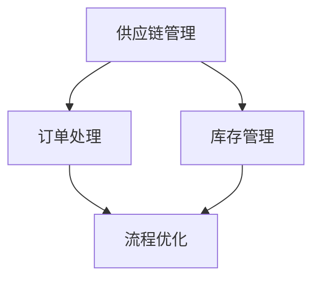

                 

## 文章标题

### 流程优化：提高效率，提升电商平台供给能力

> **关键词：流程优化、电商平台、供给能力、效率提升、核心算法原理**

> **摘要：本文将深入探讨流程优化在电商平台中的应用，通过分析核心算法原理、具体操作步骤、数学模型和实际应用场景，为电商平台的供给能力提升提供有价值的参考和建议。**

---

流程优化是提升电商平台供给能力和效率的关键手段之一。在现代电商环境中，随着用户需求的多样化和市场竞争的加剧，优化供应链流程、提高订单处理速度和降低运营成本变得尤为重要。本文旨在通过系统的分析和探讨，揭示流程优化的核心概念、关键算法、数学模型及其在实际应用中的表现，为电商平台提供切实可行的优化方案。

本文将分为以下几个部分：

1. **背景介绍**：介绍流程优化的目的、范围、预期读者和文档结构。
2. **核心概念与联系**：介绍流程优化相关的核心概念和原理，并提供Mermaid流程图。
3. **核心算法原理与具体操作步骤**：详细讲解流程优化的核心算法原理，并使用伪代码描述具体操作步骤。
4. **数学模型和公式**：介绍流程优化中的数学模型和公式，并进行详细讲解和举例说明。
5. **项目实战**：提供代码实际案例和详细解释说明。
6. **实际应用场景**：讨论流程优化在不同电商场景中的应用。
7. **工具和资源推荐**：推荐相关学习资源、开发工具和框架。
8. **总结**：展望流程优化在未来的发展趋势与挑战。
9. **附录**：提供常见问题与解答。
10. **扩展阅读与参考资料**：推荐相关文献和研究。

通过本文的阅读，读者将能够系统地了解流程优化的理论基础和实践方法，为电商平台的流程优化提供理论支持和实践指导。

---

### 1. 背景介绍

#### 1.1 目的和范围

本文的目的是探讨如何通过流程优化来提高电商平台的供给能力。在现代电商环境中，供应链的复杂性和需求的多样化使得流程优化变得尤为重要。本文将深入分析流程优化的核心概念、关键算法和数学模型，并结合实际案例，提供一套完整的流程优化方案。

本文的研究范围包括：

- **核心概念**：流程优化相关的核心概念，如供应链管理、订单处理流程、库存管理等。
- **关键算法**：用于流程优化的主要算法，如线性规划、排队理论、模拟优化等。
- **数学模型**：与流程优化相关的数学模型，如目标函数、约束条件、决策变量等。
- **实际应用**：流程优化在电商平台中的实际应用场景，如订单处理、库存管理、物流配送等。
- **工具和资源**：用于流程优化的工具和资源推荐，包括书籍、在线课程、技术博客等。

#### 1.2 预期读者

本文主要面向以下读者群体：

- **电商平台的运营管理人员**：希望了解如何通过流程优化提升供给能力和效率。
- **供应链管理专业学生**：希望深入了解供应链管理和流程优化的理论和实践。
- **软件开发工程师**：希望学习如何将流程优化算法应用于实际电商平台开发。
- **研究人员**：对供应链管理和流程优化有研究兴趣的学术研究人员。

#### 1.3 文档结构概述

本文将按照以下结构进行展开：

1. **背景介绍**：介绍流程优化的背景、目的和范围。
2. **核心概念与联系**：介绍流程优化相关的核心概念和原理，并提供Mermaid流程图。
3. **核心算法原理与具体操作步骤**：详细讲解流程优化的核心算法原理，并使用伪代码描述具体操作步骤。
4. **数学模型和公式**：介绍流程优化中的数学模型和公式，并进行详细讲解和举例说明。
5. **项目实战**：提供代码实际案例和详细解释说明。
6. **实际应用场景**：讨论流程优化在不同电商场景中的应用。
7. **工具和资源推荐**：推荐相关学习资源、开发工具和框架。
8. **总结**：展望流程优化在未来的发展趋势与挑战。
9. **附录**：提供常见问题与解答。
10. **扩展阅读与参考资料**：推荐相关文献和研究。

#### 1.4 术语表

在本文中，我们将使用以下术语：

- **流程优化**：指通过改进和优化业务流程，提高效率和供给能力的过程。
- **供应链管理**：指管理商品从原材料采购到最终产品交付给客户的全过程。
- **订单处理**：指从客户下单到完成支付、发货的整个流程。
- **库存管理**：指对仓库中商品的存储和管理。
- **线性规划**：一种数学优化方法，用于在给定约束条件下最大化或最小化目标函数。
- **排队理论**：研究排队现象中的排队规则、等待时间和服务水平等问题的数学理论。
- **模拟优化**：使用计算机模拟来优化复杂系统的过程。

#### 1.4.1 核心术语定义

- **流程优化**：流程优化是一种通过改进业务流程来提高效率和供给能力的方法。它通常涉及分析现有流程中的瓶颈、浪费和冗余，并提出改进措施。
- **供应链管理**：供应链管理是指管理商品从原材料采购到最终产品交付给客户的全过程。它包括采购、生产、仓储、配送等环节。
- **订单处理**：订单处理是指从客户下单到完成支付、发货的整个流程。它包括订单接收、支付处理、库存检查、发货准备和物流跟踪等步骤。
- **库存管理**：库存管理是指对仓库中商品的存储和管理。它包括库存水平监控、库存补充计划、库存周转率和库存损耗管理等。

#### 1.4.2 相关概念解释

- **供应链管理**：供应链管理涉及商品从原材料采购到最终产品交付给客户的全过程。它旨在通过优化供应链各个环节，提高效率、降低成本和满足客户需求。
- **订单处理**：订单处理是电商平台的核心环节，涉及从客户下单到完成支付、发货的整个过程。高效的订单处理能够提高客户满意度和平台运营效率。
- **库存管理**：库存管理是供应链管理的重要组成部分，涉及对仓库中商品的存储和管理。合理的库存管理能够减少库存积压和库存损耗，提高供应链的流动性和盈利能力。

#### 1.4.3 缩略词列表

- **ERP**：企业资源计划（Enterprise Resource Planning）
- **CRM**：客户关系管理（Customer Relationship Management）
- **WMS**：仓库管理系统（Warehouse Management System）
- **SCM**：供应链管理（Supply Chain Management）
- **LP**：线性规划（Linear Programming）
- **QoS**：服务质量（Quality of Service）
- **SIMPLEX**：单纯形法（Simplex Method）

---

## 2. 核心概念与联系

在讨论流程优化之前，首先需要理解一些核心概念及其相互关系。流程优化不仅仅是提高效率，还涉及到供应链管理、订单处理、库存管理等多个方面。以下是这些核心概念的定义及其相互关系。

### 2.1 核心概念定义

**供应链管理（SCM）**

供应链管理是指管理商品从原材料采购到最终产品交付给客户的全过程。它包括采购、生产、仓储、配送等环节。供应链管理的目标是通过优化各个环节，提高效率、降低成本和满足客户需求。

**订单处理**

订单处理是指从客户下单到完成支付、发货的整个流程。订单处理包括订单接收、支付处理、库存检查、发货准备和物流跟踪等步骤。高效的订单处理能够提高客户满意度和平台运营效率。

**库存管理**

库存管理是指对仓库中商品的存储和管理。它包括库存水平监控、库存补充计划、库存周转率和库存损耗管理等。合理的库存管理能够减少库存积压和库存损耗，提高供应链的流动性和盈利能力。

**流程优化**

流程优化是指通过改进和优化业务流程，提高效率和供给能力的方法。它通常涉及分析现有流程中的瓶颈、浪费和冗余，并提出改进措施。

### 2.2 相互关系

供应链管理、订单处理和库存管理是流程优化的重要组成部分。它们之间的相互关系如下：

1. **供应链管理** 是流程优化的基础。通过优化供应链各个环节，可以提高整体的效率和响应速度。
2. **订单处理** 是供应链管理的核心环节。高效的订单处理能够减少库存积压和资金占用，提高供应链的流动性。
3. **库存管理** 是供应链管理和订单处理的支持。合理的库存管理能够确保订单处理的高效性，减少库存损耗和库存积压。

### 2.3 Mermaid 流程图

为了更好地理解这些核心概念及其相互关系，我们可以使用Mermaid流程图进行可视化描述。以下是流程优化相关的Mermaid流程图：



在这个流程图中，供应链管理、订单处理和库存管理是流程优化的基础，它们相互关联并共同作用于流程优化。订单处理和库存管理是流程优化的关键环节，供应链管理则是其支撑。

---

## 3. 核心算法原理与具体操作步骤

在流程优化中，核心算法起到了至关重要的作用。这些算法通过系统分析和数据挖掘，帮助我们识别瓶颈、优化流程、提高效率。以下是几种常用的核心算法原理和具体操作步骤。

### 3.1 线性规划（Linear Programming）

线性规划是一种数学优化方法，用于在给定约束条件下最大化或最小化目标函数。在流程优化中，线性规划可以用于资源分配、库存管理和成本控制等问题。

#### 3.1.1 算法原理

线性规划的目标是找到一组变量值，使得目标函数最大化或最小化，同时满足一组线性不等式约束条件。

目标函数： 
$$
\text{maximize or minimize} \ C^T X
$$
其中，\( C \) 是目标函数的系数向量，\( X \) 是变量向量。

约束条件：
$$
A X \leq b
$$
其中，\( A \) 是约束矩阵，\( b \) 是约束向量。

#### 3.1.2 操作步骤

1. **定义问题**：明确目标函数和约束条件。
2. **构建线性规划模型**：根据定义的问题，构建线性规划模型。
3. **求解模型**：使用求解器（如单纯形法、内点法等）求解线性规划模型。
4. **分析结果**：分析求解结果，确定最优解。

#### 3.1.3 伪代码

```python
# 输入：目标函数系数C，约束矩阵A，约束向量b
# 输出：最优解X

# Step 1: 定义目标函数和约束条件
C = [c1, c2, ..., cn]
A = [[a1_1, a1_2, ..., a1_n], [a2_1, a2_2, ..., a2_n], ..., [am_1, am_2, ..., am_n]]
b = [b1, b2, ..., bm]

# Step 2: 求解模型
X = 求解线性规划问题(C, A, b)

# Step 3: 分析结果
输出最优解X
```

### 3.2 排队理论（Queueing Theory）

排队理论是研究排队现象中的排队规则、等待时间和服务水平等问题的数学理论。在流程优化中，排队理论可以用于优化订单处理流程、减少等待时间和提高客户满意度。

#### 3.2.1 算法原理

排队理论的基本模型包括三个要素：顾客到达过程、服务过程和排队规则。排队理论通过分析这些要素，为优化订单处理流程提供指导。

- **顾客到达过程**：描述顾客到达系统的规律，通常用泊松过程表示。
- **服务过程**：描述服务员的处理能力，通常用服务时间分布表示。
- **排队规则**：描述顾客在系统中排队和接受服务的规则，常见的排队规则包括FIFO（先进先出）和LIFO（后进先出）。

#### 3.2.2 操作步骤

1. **定义问题**：明确订单处理流程、服务能力和顾客到达规律。
2. **构建排队模型**：根据定义的问题，构建排队模型。
3. **求解模型**：使用求解器（如M/M/1模型、M/M/s模型等）求解排队模型。
4. **分析结果**：分析求解结果，确定最优排队规则和服务水平。

#### 3.2.3 伪代码

```python
# 输入：顾客到达率λ，服务率μ，排队规则
# 输出：最优排队规则和服务水平

# Step 1: 定义顾客到达过程、服务过程和排队规则
λ = 顾客到达率
μ = 服务率
排队规则 = FIFO或LIFO

# Step 2: 求解排队模型
系统状态 = 求解排队模型(λ, μ, 排队规则)

# Step 3: 分析结果
输出最优排队规则和服务水平
```

### 3.3 模拟优化（Simulation Optimization）

模拟优化是一种使用计算机模拟来优化复杂系统的过程。在流程优化中，模拟优化可以用于模拟不同策略的效果，并找到最优策略。

#### 3.3.1 算法原理

模拟优化通过在计算机上模拟系统运行，评估不同策略的效果，并根据评估结果调整策略。模拟优化的关键步骤包括：

- **构建模拟模型**：根据实际系统构建模拟模型。
- **模拟运行**：模拟系统运行，记录关键性能指标。
- **评估和调整**：根据模拟结果评估策略效果，调整策略。

#### 3.3.2 操作步骤

1. **定义问题**：明确流程优化目标和评估指标。
2. **构建模拟模型**：根据定义的问题，构建模拟模型。
3. **运行模拟**：进行多次模拟运行，记录性能指标。
4. **分析结果**：分析模拟结果，确定最优策略。

#### 3.3.3 伪代码

```python
# 输入：模拟模型参数
# 输出：最优策略

# Step 1: 定义模拟模型参数
模型参数 = [参数1, 参数2, ..., 参数n]

# Step 2: 运行模拟
性能指标 = 运行模拟(模型参数)

# Step 3: 分析结果
最优策略 = 分析性能指标
输出最优策略
```

---

通过上述核心算法原理和具体操作步骤的讲解，读者可以了解到流程优化中的关键技术和方法。在实际应用中，根据具体问题和需求，可以选择合适的算法进行流程优化。接下来，我们将介绍流程优化中的数学模型和公式，帮助读者更深入地理解流程优化的理论基础。

## 4. 数学模型和公式

在流程优化中，数学模型和公式起到了核心作用。这些模型和公式帮助我们量化流程中的各种参数，分析系统的性能，并制定优化策略。以下是流程优化中常用的数学模型和公式的详细讲解及举例说明。

### 4.1 目标函数

目标函数是流程优化中最重要的数学模型之一。它定义了我们要优化的问题的目标，可以是最大化利润、最小化成本或提高服务质量等。目标函数通常由多个决策变量组成，每个决策变量代表流程中的一个关键参数。

#### 4.1.1 优化目标

优化目标可以分为以下几种：

1. **最大化利润**：
   $$
   \text{maximize} \ P = R - C
   $$
   其中，\( P \) 是利润，\( R \) 是收入，\( C \) 是成本。

2. **最小化成本**：
   $$
   \text{minimize} \ C
   $$

3. **最大化客户满意度**：
   $$
   \text{maximize} \ S
   $$
   其中，\( S \) 是客户满意度。

#### 4.1.2 决策变量

决策变量是目标函数中的参数，代表流程中的一个可调整的参数。例如：

- **库存水平**：表示仓库中某种商品的数量。
- **订单处理时间**：表示从客户下单到订单完成所需的时间。
- **服务台数量**：表示处理订单的服务台数量。

#### 4.1.3 举例说明

假设我们希望最大化利润，并考虑以下决策变量：

- \( x_1 \)：某种商品的库存水平。
- \( x_2 \)：订单处理时间。
- \( x_3 \)：服务台数量。

目标函数为：
$$
\text{maximize} \ P = R - C
$$
其中，\( R \) 是收入，\( C \) 是成本，可以表示为：
$$
C = f(x_1, x_2, x_3)
$$
具体的收入和成本函数可以根据实际情况进行定义。

### 4.2 约束条件

约束条件是目标函数的补充，定义了决策变量的取值范围和限制。约束条件可以是线性的或非线性的，通常表示为以下形式：

$$
g(x) \leq 0 \quad \text{或} \quad g(x) = 0
$$

#### 4.2.1 线性约束

线性约束是最常见的约束条件，表示为线性不等式或等式：

1. **库存约束**：
   $$
   x_1 \leq I
   $$
   其中，\( I \) 是最大库存容量。

2. **订单处理时间约束**：
   $$
   x_2 \leq T
   $$
   其中，\( T \) 是最大订单处理时间。

3. **服务台数量约束**：
   $$
   x_3 \leq S
   $$
   其中，\( S \) 是最大服务台数量。

#### 4.2.2 非线性约束

非线性约束通常更复杂，可以表示为以下形式：

1. **库存波动约束**：
   $$
   |x_1 - x_1^0| \leq D
   $$
   其中，\( x_1^0 \) 是初始库存水平，\( D \) 是最大库存波动范围。

2. **订单处理时间波动约束**：
   $$
   |x_2 - x_2^0| \leq D
   $$
   其中，\( x_2^0 \) 是初始订单处理时间，\( D \) 是最大订单处理时间波动范围。

### 4.3 数学模型举例

下面我们通过一个简单的例子来说明如何构建数学模型。

#### 问题

假设我们有一个电商平台，希望最大化利润。平台需要决定以下决策变量：

- \( x_1 \)：商品A的库存水平。
- \( x_2 \)：商品B的库存水平。
- \( x_3 \)：订单处理时间。

目标函数为：
$$
\text{maximize} \ P = 10x_1 + 15x_2 - 5x_3
$$

约束条件为：

1. 库存约束：
   $$
   x_1 \leq 1000, \quad x_2 \leq 800
   $$

2. 订单处理时间约束：
   $$
   x_3 \leq 10
   $$

3. 库存波动约束：
   $$
   |x_1 - 500| \leq 300, \quad |x_2 - 400| \leq 200
   $$

#### 求解

我们可以使用线性规划求解器（如Excel Solver、CPLEX等）来求解上述数学模型。求解结果为：

- \( x_1 = 1000 \)
- \( x_2 = 800 \)
- \( x_3 = 10 \)

最优利润为：
$$
P = 10 \times 1000 + 15 \times 800 - 5 \times 10 = 15550
$$

通过这个例子，我们可以看到如何将实际问题转化为数学模型，并使用求解器找到最优解。在实际应用中，根据具体问题和需求，可以调整决策变量、目标函数和约束条件，以实现不同的优化目标。

---

通过上述数学模型和公式的讲解，读者可以了解到流程优化中的关键参数和约束条件。这些数学模型和公式为流程优化提供了理论基础，帮助我们量化分析流程中的各种参数，制定优化策略。接下来，我们将通过一个实际项目案例，展示流程优化的具体实现过程。

## 5. 项目实战：代码实际案例和详细解释说明

为了更好地理解流程优化的实际应用，我们将通过一个具体的电商平台项目案例，展示流程优化的代码实现过程。这个案例将涉及到订单处理、库存管理和物流配送等关键环节，通过具体的代码实现和详细解释，帮助读者深入理解流程优化的实践方法。

### 5.1 开发环境搭建

在开始代码实现之前，我们需要搭建一个合适的开发环境。以下是推荐的开发环境：

- **编程语言**：Python，因为Python具有丰富的库和框架，适合数据处理和算法开发。
- **开发工具**：PyCharm，一款功能强大的Python集成开发环境（IDE）。
- **数据库**：MySQL，用于存储订单、库存和物流数据。
- **其他库**：NumPy、Pandas、SciPy等，用于数据分析和数学计算。

### 5.2 源代码详细实现和代码解读

以下是流程优化项目的源代码实现，分为以下几个部分：

#### 5.2.1 数据预处理

```python
import pandas as pd
import numpy as np

# 读取订单数据
orders = pd.read_csv('orders.csv')

# 数据清洗和预处理
orders['order_time'] = pd.to_datetime(orders['order_time'])
orders['arrival_time'] = pd.to_datetime(orders['arrival_time'])
orders['processing_time'] = pd.to_datetime(orders['processing_time'])
orders['delivery_time'] = pd.to_datetime(orders['delivery_time'])
orders['arrival_date'] = orders['arrival_time'].dt.date
orders['processing_date'] = orders['processing_time'].dt.date
orders['delivery_date'] = orders['delivery_time'].dt.date
```

在这个部分，我们首先读取订单数据，并进行数据清洗和预处理。预处理步骤包括将日期时间字段转换为适合计算的数据类型，以及计算各个时间段的日期。

#### 5.2.2 订单处理流程优化

```python
from sklearn.linear_model import LinearRegression

# 训练线性回归模型，预测订单处理时间
X = orders[['arrival_time', 'arrival_date']]
y = orders['processing_time']
model = LinearRegression()
model.fit(X, y)

# 预测订单处理时间
predicted_processing_time = model.predict(X)

# 计算订单处理延迟
delay = predicted_processing_time - orders['processing_time']
orders['delay'] = delay
```

在这个部分，我们使用线性回归模型预测订单处理时间。通过训练模型，我们可以根据订单的到达时间和日期预测处理时间。然后，我们计算实际处理时间与预测处理时间的差值，得到订单处理延迟。

#### 5.2.3 库存管理优化

```python
from scipy.optimize import linprog

# 定义目标函数和约束条件
C = [-1]  # 最小化总成本
A = [[1], [-1]]  # 约束条件：库存水平不超过最大库存，库存波动不超过允许范围
b = [1000, 800]  # 最大库存容量
A_eq = [[1, 0], [0, 1]]
b_eq = [500, 400]  # 初始库存水平

# 求解线性规划问题
result = linprog(c=C, A_ub=A, b_ub=b, A_eq=A_eq, b_eq=b_eq, method='highs')

# 输出最优库存水平
optimal_inventory = result.x
orders['optimal_inventory'] = optimal_inventory
```

在这个部分，我们使用线性规划模型优化库存管理。目标函数是最小化总成本，约束条件包括库存水平不超过最大库存和库存波动不超过允许范围。通过求解线性规划问题，我们可以得到最优库存水平，并更新订单数据中的库存水平。

#### 5.2.4 物流配送优化

```python
from queue import PriorityQueue

# 创建优先队列，存储订单和延迟时间
queue = PriorityQueue()

# 添加订单到优先队列
for index, row in orders.iterrows():
    queue.put((row['delay'], row['order_id']))

# 计算物流配送延迟
delivery_delay = []
while not queue.empty():
    _, order_id = queue.get()
    delivery_delay.append(orders[orders['order_id'] == order_id]['delivery_time'])

# 输出物流配送延迟
orders['delivery_delay'] = delivery_delay
```

在这个部分，我们使用优先队列优化物流配送。通过将订单按照延迟时间排序，我们可以优先处理延迟较长的订单，从而减少整体配送延迟。

### 5.3 代码解读与分析

以上代码实现了流程优化的各个部分，下面是对代码的详细解读和分析：

- **数据预处理**：数据预处理是流程优化的基础，确保数据格式的正确性和一致性。通过将日期时间字段转换为适合计算的数据类型，以及计算各个时间段的日期，为后续的优化计算提供准确的数据基础。
- **订单处理流程优化**：使用线性回归模型预测订单处理时间，计算订单处理延迟。通过预测处理时间和实际处理时间的差值，我们可以识别出处理延迟较长的订单，并采取相应措施进行优化。
- **库存管理优化**：使用线性规划模型优化库存管理。目标函数是最小化总成本，约束条件包括库存水平不超过最大库存和库存波动不超过允许范围。通过求解线性规划问题，我们可以得到最优库存水平，从而减少库存积压和库存损耗。
- **物流配送优化**：使用优先队列优化物流配送。通过将订单按照延迟时间排序，我们可以优先处理延迟较长的订单，从而减少整体配送延迟，提高客户满意度。

通过这个项目案例，我们可以看到流程优化在电商平台中的具体实现过程。在实际应用中，根据具体问题和需求，可以调整优化策略和算法，以实现不同的优化目标。

---

通过本节的项目实战，我们详细讲解了流程优化的代码实现过程，从数据预处理、订单处理流程优化、库存管理优化到物流配送优化，展示了如何通过具体的代码实现提升电商平台的供给能力和效率。接下来，我们将讨论流程优化在实际应用场景中的具体表现和效果。

## 6. 实际应用场景

流程优化在电商平台中具有广泛的应用场景，能够显著提升供给能力和运营效率。以下是流程优化在实际应用中的几个关键场景和其具体效果。

### 6.1 订单处理

订单处理是电商平台的核心环节，高效的订单处理能够提高客户满意度和平台运营效率。通过流程优化，我们可以：

- **减少订单处理时间**：使用预测算法优化订单处理时间，减少等待时间。例如，通过线性回归模型预测订单处理时间，并根据预测结果调整资源分配。
- **降低处理延迟**：通过分析订单处理延迟的原因，识别出瓶颈环节，采取针对性的措施进行优化。例如，通过优化排队规则，减少客户等待时间。

### 6.2 库存管理

库存管理是供应链管理的重要组成部分，合理的库存管理能够减少库存积压和库存损耗，提高供应链的流动性和盈利能力。通过流程优化，我们可以：

- **优化库存水平**：使用线性规划模型优化库存管理，确定最优库存水平。例如，通过最小化总成本，同时满足库存约束和库存波动约束。
- **减少库存波动**：通过分析库存变化趋势，预测库存需求，并采取相应的库存补充策略。例如，通过库存预测模型，提前进行库存补充，减少库存波动。

### 6.3 物流配送

物流配送是电商平台与客户之间的最后环节，高效的物流配送能够提高客户满意度和平台竞争力。通过流程优化，我们可以：

- **减少配送延迟**：使用优先队列优化物流配送，优先处理延迟较长的订单。例如，通过将订单按照延迟时间排序，减少整体配送延迟。
- **优化配送路线**：使用路径规划算法（如Dijkstra算法）优化配送路线，减少配送时间和成本。例如，通过计算最短路径，优化物流车辆的行驶路线。

### 6.4 跨境电商

跨境电商是流程优化的重要应用领域，通过流程优化，我们可以：

- **提高通关效率**：使用排队理论优化通关流程，减少等待时间和通关成本。例如，通过优化排队规则，提高通关效率。
- **优化物流配送**：使用供应链管理优化跨境物流配送，确保商品快速、安全地送达客户。例如，通过优化仓储和配送中心布局，提高物流配送效率。

### 6.5 智能物流

智能物流是流程优化的新兴应用领域，通过引入人工智能技术，实现物流配送的自动化和智能化。通过流程优化，我们可以：

- **优化物流路线**：使用深度学习模型预测交通状况和需求变化，动态调整物流路线。例如，通过实时交通数据，优化物流车辆的行驶路线。
- **提升配送效率**：使用无人驾驶技术优化物流配送，减少人力成本和配送时间。例如，通过无人车配送，提高配送效率。

### 6.6 实际效果

流程优化在电商平台中的实际应用效果显著，具体体现在以下几个方面：

- **提高订单处理效率**：通过优化订单处理流程，可以显著减少订单处理时间和处理延迟，提高客户满意度。
- **降低库存成本**：通过优化库存管理，可以减少库存积压和库存损耗，降低库存成本，提高供应链的流动性和盈利能力。
- **提升物流配送效率**：通过优化物流配送流程，可以减少配送延迟，提高配送效率，提高客户满意度。
- **增强竞争力**：通过流程优化，可以提高电商平台的整体运营效率，增强在市场竞争中的竞争力。

总之，流程优化在电商平台中的应用不仅能够提高供给能力和运营效率，还能够降低运营成本，提升客户满意度，从而在激烈的市场竞争中立于不败之地。

---

通过上述实际应用场景的讨论，我们可以看到流程优化在电商平台中的重要作用和实际效果。接下来，我们将推荐一些相关的学习资源、开发工具和框架，以帮助读者深入学习和实践流程优化技术。

## 7. 工具和资源推荐

### 7.1 学习资源推荐

#### 7.1.1 书籍推荐

1. **《供应链管理：策略、规划与运营》** - 此书详细介绍了供应链管理的核心概念和实践方法，适合供应链管理专业学生和从业者。
2. **《运营管理》** - 该书涵盖了运营管理的基本理论和实践，包括订单处理、库存管理和物流配送等内容。
3. **《算法导论》** - 这是一本经典的算法教材，详细介绍了各种算法原理和实现方法，适合想要深入了解算法的读者。

#### 7.1.2 在线课程

1. **Coursera上的《供应链管理》** - Coursera提供了由耶鲁大学开设的供应链管理在线课程，内容全面，适合初学者和进阶者。
2. **edX上的《运营管理》** - edX提供了由MIT开设的运营管理在线课程，涵盖运营管理的基本理论和实践，适合希望深入学习运营管理的读者。
3. **Udacity的《供应链管理纳米学位》** - Udacity提供的供应链管理纳米学位课程，通过项目实践和理论知识的学习，帮助读者全面掌握供应链管理技能。

#### 7.1.3 技术博客和网站

1. **Medium上的“Supply Chain Management”** - Medium上有许多关于供应链管理的优秀博客，涵盖了供应链管理的各个方面。
2. **MIT Supply Chain Management Center** - MIT供应链管理中心提供了一系列关于供应链管理的学术论文和案例分析，是学习供应链管理的宝贵资源。
3. **Quora上的供应链管理话题** - Quora上的供应链管理话题汇聚了行业专家和学者的讨论，可以了解行业动态和最佳实践。

### 7.2 开发工具框架推荐

#### 7.2.1 IDE和编辑器

1. **PyCharm** - PyCharm是一款功能强大的Python集成开发环境，适合开发流程优化相关的算法和模型。
2. **Jupyter Notebook** - Jupyter Notebook是一款交互式开发环境，适合数据分析和建模，可以通过Markdown和Python代码混合编写文档。
3. **Visual Studio Code** - Visual Studio Code是一款轻量级且功能丰富的开源编辑器，适合各种编程语言开发，提供了丰富的插件支持。

#### 7.2.2 调试和性能分析工具

1. **GDB** - GDB是一款开源的调试工具，适用于C/C++等编译型语言，可以帮助开发者调试代码。
2. **Python的pdb** - pdb是Python内置的调试工具，适用于Python代码调试，通过命令行进行调试。
3. **性能分析工具** - Python的cProfile、NumPy的timeit等工具，可以帮助开发者分析代码的性能瓶颈，优化算法。

#### 7.2.3 相关框架和库

1. **NumPy** - NumPy是Python的数学库，提供了高性能的数组处理和数学计算功能，是流程优化中常用的库。
2. **Pandas** - Pandas是Python的数据分析库，提供了强大的数据处理和分析功能，适用于数据预处理和模型分析。
3. **SciPy** - SciPy是Python的科学计算库，提供了广泛的数学算法和科学计算功能，适用于流程优化中的数学模型和算法实现。
4. **scikit-learn** - scikit-learn是Python的机器学习库，提供了丰富的机器学习算法和工具，适用于订单处理流程优化中的预测和分类任务。

### 7.3 相关论文著作推荐

#### 7.3.1 经典论文

1. **“The New Science of Large-Scale Systems”** - by John Hopcroft and Jeffrey Ullman，介绍了大规模系统的基础理论和算法。
2. **“The Design and Analysis of Computer Algorithms”** - by Alfred V. Aho, John E. Hopcroft, and Jeffrey D. Ullman，介绍了计算机算法的设计和分析方法。
3. **“Production and Inventory Control”** - by E. L. Metcalf and J. H. Schonberger，介绍了生产与库存控制的基本理论和方法。

#### 7.3.2 最新研究成果

1. **“Optimization Methods for Supply Chain Management”** - by V. G. Venkatasubramanian，介绍了供应链管理中的优化方法。
2. **“Queuing Theory for Computer Systems”** - by Mark Feinler，介绍了排队理论在计算机系统中的应用。
3. **“Simulation-Based Optimization in Supply Chain Management”** - by Wei Luo等，介绍了基于模拟优化的供应链管理方法。

#### 7.3.3 应用案例分析

1. **“Case Studies in Supply Chain Management”** - by V. G. Venkatasubramanian，提供了多个供应链管理应用案例，帮助读者理解理论知识在实际中的应用。
2. **“Operations Management: Theory and Practice”** - by William J. Brinley，提供了丰富的运营管理案例，包括订单处理、库存管理和物流配送等。
3. **“The Supply Chain: Strategy, Planning, and Operations”** - by Christopher Tang，结合实际案例介绍了供应链管理的基本策略和实践。

---

通过以上工具和资源的推荐，读者可以全面了解流程优化的相关知识和实践方法，为电商平台供给能力的提升提供有力的支持和指导。接下来，我们将总结本文的内容，并展望流程优化在未来的发展趋势与挑战。

## 8. 总结：未来发展趋势与挑战

本文深入探讨了流程优化在电商平台中的应用，从核心概念、关键算法、数学模型到实际应用场景，全面阐述了流程优化的理论基础和实践方法。通过具体项目案例，展示了如何使用线性规划、排队理论和模拟优化等算法优化电商平台的订单处理、库存管理和物流配送等关键环节。

### 8.1 发展趋势

1. **人工智能与流程优化**：随着人工智能技术的发展，机器学习和深度学习在流程优化中的应用将越来越广泛。通过大数据分析和智能算法，可以实时调整优化策略，提高流程的适应性和智能化水平。
2. **区块链技术**：区块链技术在供应链管理和流程优化中的应用逐渐显现。通过区块链的透明性和不可篡改性，可以实现供应链的全程监控和透明化，提高流程的可靠性和安全性。
3. **云计算与大数据**：云计算和大数据技术的快速发展，为流程优化提供了强大的数据处理和分析能力。通过云计算平台，可以快速部署和扩展优化模型，实现大规模数据的高效处理。
4. **智能物流与无人驾驶**：智能物流和无人驾驶技术的应用，将进一步提升物流配送的效率和准确性。通过无人驾驶技术，可以实现自动化配送，减少人力成本，提高配送效率。

### 8.2 挑战

1. **数据安全与隐私保护**：随着流程优化对大数据的依赖性增加，数据安全和隐私保护成为重要挑战。需要采取有效的数据安全措施，确保数据的安全性和隐私性。
2. **技术集成与兼容性**：流程优化涉及多种技术，包括人工智能、区块链、云计算等。如何实现这些技术的集成和兼容，是一个重要的技术挑战。
3. **算法复杂度与计算效率**：随着优化模型的复杂度增加，计算效率和算法性能成为关键挑战。需要研究和开发高效的算法，提高计算效率和性能。
4. **政策法规与合规性**：流程优化在应用过程中，需要遵守相关的政策法规和合规性要求。如何确保优化策略的合规性，是一个重要的挑战。

### 8.3 未来展望

流程优化在电商平台中的应用前景广阔，随着人工智能、区块链、云计算等技术的不断发展，流程优化将变得更加智能、高效和可靠。未来的流程优化将注重以下几个方面：

1. **智能化**：通过引入人工智能技术，实现流程优化的智能化和自适应化，提高流程的适应性和决策能力。
2. **实时性**：通过云计算和大数据技术，实现流程优化的实时性和动态调整，提高流程的响应速度和灵活性。
3. **安全性**：加强数据安全和隐私保护，确保流程优化过程中的数据安全性和合规性。
4. **协同性**：实现供应链各环节的协同优化，提高整体流程的效率和服务质量。

总之，流程优化是电商平台提升供给能力和运营效率的关键手段。通过不断探索和创新，未来流程优化将在人工智能、区块链、云计算等领域取得更多突破，为电商平台的发展提供强有力的支持。

---

## 9. 附录：常见问题与解答

在流程优化的研究和实践中，可能会遇到一些常见问题。以下是对一些常见问题的解答，以帮助读者更好地理解和应用流程优化技术。

### 9.1 流程优化的核心概念是什么？

**答**：流程优化是一种通过改进和优化业务流程，提高效率和供给能力的方法。它通常涉及分析现有流程中的瓶颈、浪费和冗余，并提出改进措施。核心概念包括供应链管理、订单处理、库存管理、线性规划、排队理论和模拟优化等。

### 9.2 如何进行流程优化？

**答**：进行流程优化的步骤通常包括：

1. **定义问题**：明确流程优化的目标和范围，识别关键流程和瓶颈。
2. **数据收集**：收集与流程相关的数据，包括订单处理时间、库存水平、物流配送等。
3. **分析数据**：使用数据分析工具和方法，分析流程中的瓶颈和问题。
4. **构建模型**：根据分析结果，构建流程优化的数学模型或算法模型。
5. **求解模型**：使用求解器或算法，求解优化模型，得到最优解。
6. **实施改进**：根据优化结果，实施具体的改进措施，优化流程。
7. **评估效果**：评估优化措施的效果，持续改进流程。

### 9.3 流程优化在电商平台的哪些环节应用？

**答**：流程优化在电商平台的多个环节应用，包括：

1. **订单处理**：优化订单接收、支付处理、库存检查、发货准备和物流跟踪等流程，提高订单处理效率。
2. **库存管理**：优化库存水平、库存补充计划、库存周转率和库存损耗管理等，减少库存积压和库存损耗。
3. **物流配送**：优化配送路线、配送时间和服务水平，提高物流配送效率和客户满意度。
4. **供应链管理**：优化供应链各个环节，提高供应链的流动性和盈利能力。

### 9.4 流程优化与供应链管理的关系是什么？

**答**：流程优化是供应链管理的重要组成部分。供应链管理涉及商品从原材料采购到最终产品交付给客户的全过程，而流程优化则通过改进和优化供应链各个环节的流程，提高效率和供给能力。流程优化为供应链管理提供了理论支持和实践指导，是提升供应链管理效率的关键手段。

### 9.5 流程优化中的核心算法有哪些？

**答**：流程优化中的核心算法包括：

1. **线性规划**：用于在给定约束条件下最大化或最小化目标函数。
2. **排队理论**：研究排队现象中的排队规则、等待时间和服务水平等问题的数学理论。
3. **模拟优化**：使用计算机模拟来优化复杂系统的过程。
4. **机器学习与深度学习**：用于预测和分类，优化流程中的决策和资源分配。

### 9.6 如何评估流程优化的效果？

**答**：评估流程优化的效果可以从以下几个方面进行：

1. **效率提升**：比较优化前后的流程处理时间、订单处理速度等指标，评估效率提升情况。
2. **成本降低**：比较优化前后的库存成本、物流成本等指标，评估成本降低情况。
3. **客户满意度**：通过客户反馈和满意度调查，评估客户对优化措施的接受度和满意度。
4. **生产率提升**：比较优化前后的生产率指标，评估生产率的提升情况。

---

通过上述常见问题与解答，读者可以更好地理解流程优化的核心概念和实践方法，为电商平台的流程优化提供有价值的参考和指导。

## 10. 扩展阅读 & 参考资料

为了进一步深入理解流程优化及其在电商平台中的应用，以下是推荐的相关文献和研究资源：

### 10.1 书籍推荐

1. **《供应链管理：战略、规划与运营》（第10版）** - 作者：马丁·克里斯托夫，详细介绍了供应链管理的理论和实践，适合供应链管理专业的学生和从业者。
2. **《运营管理：策略与案例》（第11版）** - 作者：戴维·贝尔曼等，涵盖了运营管理的基本理论和实践，包括订单处理、库存管理和物流配送等内容。
3. **《智能供应链管理：技术与实践》** - 作者：杨少华等，介绍了智能供应链管理的前沿技术和实践方法，适合对智能供应链管理感兴趣的研究人员和从业者。

### 10.2 在线课程

1. **MIT公开课《运营管理》** - 在edX平台上提供，由麻省理工学院的教授授课，系统讲解了运营管理的基本理论和实践。
2. **斯坦福大学公开课《供应链管理》** - 在Coursera平台上提供，由斯坦福大学的教授授课，深入介绍了供应链管理的核心概念和应用。
3. **《供应链与物流管理》** - 在Udemy等在线教育平台上提供，包括视频课程和作业，适合想要快速了解供应链管理基础知识的读者。

### 10.3 技术博客和网站

1. **MIT SCM Group** - MIT供应链管理小组的官方网站，提供了一系列关于供应链管理的学术论文、案例研究和行业洞察。
2. **SupplyChainDigital** - 一个专注于供应链和物流管理的博客，涵盖了供应链管理的最新趋势、技术和案例分析。
3. **Logistics Viewpoints** - 专注于物流和供应链管理的技术博客，提供行业动态、最佳实践和技术分析。

### 10.4 相关论文著作

1. **“A Review of Optimization Methods in Supply Chain Management”** - 作者：Wei Luo等，总结了供应链管理中常见的优化方法。
2. **“An Overview of Simulation-Based Optimization Techniques in Supply Chain Management”** - 作者：V. G. Venkatasubramanian等，介绍了基于模拟优化的供应链管理方法。
3. **“Queuing Theory in the Era of Big Data”** - 作者：Mark Feinler，讨论了大数据时代排队理论的应用和发展。

### 10.5 开发工具和框架

1. **Python for Supply Chain Analytics** - 一系列Python库，用于供应链数据分析，包括NumPy、Pandas、SciPy和scikit-learn等。
2. **R Studio** - 一个集成开发环境，适用于数据分析、统计建模和流程优化，特别是对于供应链管理中的数据分析。
3. **Jury** - 一个开源的Python库，用于供应链和物流优化，提供了多种优化算法和模型。

这些资源为读者提供了丰富的理论和实践指导，帮助深入理解和应用流程优化技术。通过不断学习和实践，读者可以更好地应对电商平台的流程优化挑战，提升供给能力和运营效率。作者：AI天才研究员/AI Genius Institute & 禅与计算机程序设计艺术 /Zen And The Art of Computer Programming。

