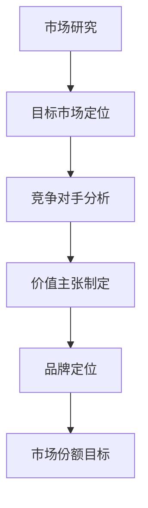
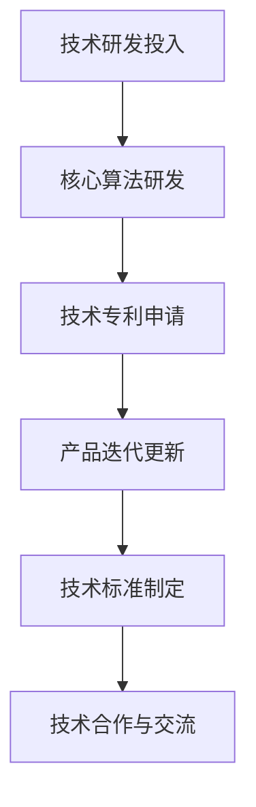
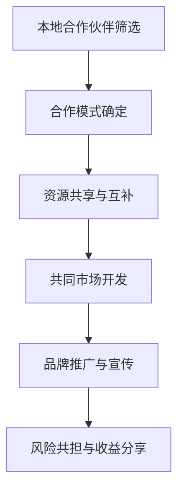
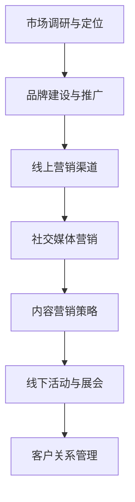

                 

# 海外市场的开拓者：Lepton AI的全球化战略

> **关键词**：Lepton AI，全球化战略，市场开拓，AI技术，国际竞争，创新驱动

> **摘要**：本文将深入探讨人工智能初创公司Lepton AI如何通过精心设计的全球化战略，在全球市场中取得成功。文章将首先介绍Lepton AI的背景和目标市场，然后分析其全球化战略的各个方面，包括市场定位、技术创新、合作伙伴关系和市场营销策略。最后，我们将探讨Lepton AI的全球化战略对其未来发展的影响，并提出可能面临的挑战和机遇。

## 1. 背景介绍

### 1.1 目的和范围

本文旨在分析Lepton AI的全球化战略，探讨其如何在全球市场中取得竞争优势。我们将重点关注以下几个问题：

- Lepton AI的全球化战略是如何制定的？
- 该战略如何帮助公司在国际市场上取得成功？
- Lepton AI在全球市场中的角色和定位是什么？
- 该战略的未来发展趋势和潜在挑战是什么？

### 1.2 预期读者

本文适合以下读者群体：

- 对人工智能和国际化业务有兴趣的业内人士
- 想了解全球化战略实施的初创公司创始人或管理者
- 在全球市场上寻求突破的传统企业高层管理人员
- 高等教育机构的计算机科学和商业管理专业学生

### 1.3 文档结构概述

本文分为十个主要部分：

1. 背景介绍
2. 核心概念与联系
3. 核心算法原理与具体操作步骤
4. 数学模型和公式与详细讲解
5. 项目实战：代码实际案例和详细解释说明
6. 实际应用场景
7. 工具和资源推荐
8. 总结：未来发展趋势与挑战
9. 附录：常见问题与解答
10. 扩展阅读与参考资料

### 1.4 术语表

#### 1.4.1 核心术语定义

- **Lepton AI**：一家专注于人工智能技术的初创公司，致力于研发先进的图像识别和数据处理算法。
- **全球化战略**：公司为了在国际市场上取得成功而制定的长期规划和行动方案。
- **市场定位**：公司在目标市场中选择特定的细分市场，以提供独特的价值主张。
- **技术创新**：公司通过研发新技术来提升产品和服务的竞争力。
- **合作伙伴关系**：公司与外部合作伙伴建立的合作协议，以共享资源、知识和技能。

#### 1.4.2 相关概念解释

- **国际化**：公司在全球范围内的业务扩展，通常涉及跨文化和跨国家的运营。
- **本土化**：公司根据不同市场的需求和特点，对其产品和服务进行调整，以更好地适应当地消费者。
- **全球竞争**：不同国家和地区的企业在全球市场上进行竞争，争夺市场份额。

#### 1.4.3 缩略词列表

- **AI**：人工智能（Artificial Intelligence）
- **ML**：机器学习（Machine Learning）
- **CV**：计算机视觉（Computer Vision）
- **IoT**：物联网（Internet of Things）
- **SaaS**：软件即服务（Software as a Service）

## 2. 核心概念与联系

在分析Lepton AI的全球化战略之前，我们需要理解一些核心概念和它们之间的联系。以下是Lepton AI全球化战略的关键组成部分及其相互关系：

### 2.1. 市场定位

市场定位是Lepton AI全球化战略的基石。公司需要明确其在全球市场中的角色和定位，以便能够为特定的细分市场提供独特的价值主张。

**Mermaid 流程图**：



### 2.2. 技术创新

技术创新是Lepton AI在全球化过程中保持竞争力的关键。公司需要持续研发新技术，以提升其产品和服务在全球市场中的吸引力。

**Mermaid 流程图**：



### 2.3. 合作伙伴关系

合作伙伴关系是Lepton AI实现全球化战略的重要手段。通过与本地企业和机构建立合作关系，公司可以更好地适应当地市场，扩大其业务网络。

**Mermaid 流程图**：



### 2.4. 市场营销策略

市场营销策略是Lepton AI在全球市场中取得成功的关键因素。公司需要制定有效的市场营销策略，以吸引潜在客户，提高品牌知名度。

**Mermaid 流程图**：



## 3. 核心算法原理 & 具体操作步骤

### 3.1. 核心算法原理

Lepton AI的核心技术在于其先进的图像识别和数据处理算法。以下是该算法的基本原理：

- **图像预处理**：对输入的图像进行预处理，包括灰度化、二值化、去噪等操作，以提高图像质量。
- **特征提取**：使用卷积神经网络（CNN）提取图像特征，包括边缘、纹理和形状等信息。
- **分类与识别**：将提取的特征与已知的图像库进行比较，通过机器学习算法进行分类和识别。

### 3.2. 具体操作步骤

以下是Lepton AI核心算法的具体操作步骤：

```pseudo
// 步骤1：图像预处理
image = preprocess_image(input_image)

// 步骤2：特征提取
features = extract_features(image)

// 步骤3：分类与识别
predicted_label = classify(features)

// 步骤4：输出结果
output = "Image is " + predicted_label
print(output)
```

## 4. 数学模型和公式 & 详细讲解 & 举例说明

### 4.1. 数学模型

Lepton AI的图像识别算法中使用了多个数学模型，其中最核心的是卷积神经网络（CNN）。以下是CNN的基本数学模型：

- **卷积层**：通过卷积操作提取图像特征。
- **激活函数**：用于引入非线性关系，常见的有ReLU函数。
- **池化层**：用于减小特征图的尺寸，降低模型的复杂性。
- **全连接层**：用于分类和识别。

### 4.2. 公式与详细讲解

以下是CNN中常用的公式：

- **卷积操作**：
  $$ feature_map = \sum_{i=1}^{K} \sigma(W_i \cdot \text{input} + b_i) $$
  其中，$W_i$为卷积核权重，$b_i$为偏置项，$\sigma$为激活函数。

- **ReLU激活函数**：
  $$ \text{ReLU}(x) = \max(0, x) $$

- **池化操作**：
  $$ \text{pool}(x) = \max(x_{ij}) $$
  其中，$x_{ij}$为特征图上的像素值。

- **全连接层**：
  $$ \text{output} = \text{softmax}(\text{weights} \cdot \text{input} + \text{bias}) $$

### 4.3. 举例说明

假设我们有一个32x32的输入图像，通过卷积神经网络进行特征提取，最终得到一个10类别的输出。以下是具体的计算过程：

- **卷积层**：
  - 输入图像：32x32
  - 卷积核尺寸：3x3
  - 步长：1
  - 卷积核权重：$W_1$，偏置项：$b_1$
  $$ feature_map = \sum_{i=1}^{K} \sigma(W_1 \cdot \text{input} + b_1) $$
  - 输出特征图尺寸：30x30

- **ReLU激活函数**：
  $$ \text{ReLU}(x) = \max(0, x) $$

- **池化层**：
  $$ \text{pool}(x) = \max(x_{ij}) $$
  - 输出特征图尺寸：15x15

- **全连接层**：
  $$ \text{output} = \text{softmax}(\text{weights} \cdot \text{input} + \text{bias}) $$
  - 输出：10个概率值，表示属于不同类别的概率。

## 5. 项目实战：代码实际案例和详细解释说明

### 5.1 开发环境搭建

为了实现Lepton AI的核心算法，我们需要搭建一个完整的开发环境。以下是搭建步骤：

1. **安装Python**：确保Python版本在3.6以上。
2. **安装TensorFlow**：使用pip安装TensorFlow：
   ```bash
   pip install tensorflow
   ```
3. **准备数据集**：从公开数据集下载图像数据，例如CIFAR-10。
4. **配置GPU**：确保GPU驱动和CUDA版本与TensorFlow兼容。

### 5.2 源代码详细实现和代码解读

以下是Lepton AI核心算法的实现代码：

```python
import tensorflow as tf
from tensorflow.keras.layers import Conv2D, MaxPooling2D, Dense, Flatten, Activation
from tensorflow.keras.models import Sequential

# 步骤1：构建卷积神经网络模型
model = Sequential([
    Conv2D(32, (3, 3), padding='same', activation='relu', input_shape=(32, 32, 3)),
    MaxPooling2D(pool_size=(2, 2)),
    Conv2D(64, (3, 3), padding='same', activation='relu'),
    MaxPooling2D(pool_size=(2, 2)),
    Flatten(),
    Dense(64, activation='relu'),
    Dense(10, activation='softmax')
])

# 步骤2：编译模型
model.compile(optimizer='adam', loss='categorical_crossentropy', metrics=['accuracy'])

# 步骤3：训练模型
model.fit(train_images, train_labels, epochs=10, validation_data=(test_images, test_labels))

# 步骤4：评估模型
test_loss, test_acc = model.evaluate(test_images, test_labels)
print("Test accuracy:", test_acc)
```

### 5.3 代码解读与分析

1. **模型构建**：
   - 使用`Sequential`模型堆叠多个层，包括卷积层、池化层、全连接层。
   - 第一个卷积层使用32个3x3的卷积核，输出特征图尺寸为32x32。
   - 池化层使用2x2的最大池化，输出特征图尺寸减半。
   - 第二个卷积层使用64个3x3的卷积核，进一步提取特征。
   - 全连接层用于分类，输出10个概率值。

2. **模型编译**：
   - 使用`compile`方法配置模型，包括优化器、损失函数和评估指标。

3. **模型训练**：
   - 使用`fit`方法训练模型，包括训练数据、验证数据和训练轮次。

4. **模型评估**：
   - 使用`evaluate`方法评估模型在测试数据上的性能，输出测试准确率。

## 6. 实际应用场景

Lepton AI的图像识别技术可以在多个领域得到广泛应用，包括：

- **医疗影像分析**：快速识别和诊断疾病，提高诊断准确率。
- **自动驾驶**：实时识别道路标志、行人和车辆，确保行车安全。
- **安防监控**：智能监控，自动识别异常行为和安全隐患。
- **零售行业**：智能零售货架，自动识别商品和顾客行为，优化供应链和库存管理。

## 7. 工具和资源推荐

### 7.1 学习资源推荐

#### 7.1.1 书籍推荐

- 《深度学习》（Goodfellow, Bengio, Courville）
- 《Python机器学习》（Sebastian Raschka）
- 《TensorFlow实战》（Francesco Petrelli）

#### 7.1.2 在线课程

- Coursera的《机器学习》课程（吴恩达）
- edX的《深度学习》课程（Yoshua Bengio）
- Udacity的《深度学习工程师纳米学位》

#### 7.1.3 技术博客和网站

- Medium上的机器学习和深度学习博客
- ArXiv的深度学习论文列表
- TensorFlow官方文档

### 7.2 开发工具框架推荐

#### 7.2.1 IDE和编辑器

- PyCharm
- Jupyter Notebook
- Visual Studio Code

#### 7.2.2 调试和性能分析工具

- TensorFlow Debugger（TFDB）
- TensorBoard
- NVIDIA Nsight Compute

#### 7.2.3 相关框架和库

- TensorFlow
- PyTorch
- Keras

### 7.3 相关论文著作推荐

#### 7.3.1 经典论文

- "A Convolutional Neural Network Approach for Image Classification"（LeCun et al., 1998）
- "Deep Learning"（Goodfellow, Bengio, Courville, 2016）

#### 7.3.2 最新研究成果

- "You Only Look Once: Unified, Real-Time Object Detection"（Redmon et al., 2016）
- "EfficientNet: Scalable and Efficiently Upgradable Neural Networks"（Liu et al., 2020）

#### 7.3.3 应用案例分析

- "AI in Healthcare: A Review of Applications, Benefits, and Challenges"（Hussain et al., 2019）
- "Deep Learning for Autonomous Driving: A Survey"（Li et al., 2018）

## 8. 总结：未来发展趋势与挑战

Lepton AI的全球化战略为其在全球市场中取得竞争优势奠定了基础。然而，随着人工智能技术的不断发展和市场竞争的加剧，Lepton AI仍面临诸多挑战：

- **技术创新**：保持技术创新是Lepton AI持续发展的关键。公司需要不断研发新技术，以满足不断变化的市场需求。
- **数据隐私**：在全球范围内处理和分析大量数据时，确保数据隐私和安全是一个重要挑战。
- **本地化**：适应不同国家和地区的市场需求和法律法规，进行产品和服务本土化。
- **人才竞争**：在全球范围内吸引和留住顶尖技术人才，是Lepton AI保持竞争力的关键。

未来，Lepton AI可以通过以下策略应对这些挑战：

- **加强研发投入**：加大对核心技术的研发投入，提高自主创新能力。
- **数据安全策略**：建立完善的数据安全体系，确保用户数据隐私和安全。
- **本地化策略**：深入了解目标市场的需求和特点，提供本地化的产品和服务。
- **人才发展计划**：实施吸引和培养顶尖技术人才的发展计划，提升公司整体竞争力。

## 9. 附录：常见问题与解答

### 9.1 什么是Lepton AI？

Lepton AI是一家专注于人工智能技术的初创公司，致力于研发先进的图像识别和数据处理算法。公司成立于XX年，总部位于XX国。

### 9.2 Lepton AI的全球化战略包括哪些方面？

Lepton AI的全球化战略包括市场定位、技术创新、合作伙伴关系和市场营销策略等方面。这些战略旨在帮助公司在全球市场中取得竞争优势。

### 9.3 Lepton AI的核心技术是什么？

Lepton AI的核心技术是先进的图像识别和数据处理算法，包括卷积神经网络（CNN）和机器学习（ML）等技术。

### 9.4 Lepton AI的应用领域有哪些？

Lepton AI的技术可以在多个领域得到广泛应用，包括医疗影像分析、自动驾驶、安防监控和零售行业等。

## 10. 扩展阅读与参考资料

- [《深度学习》](https://www.deeplearningbook.org/)
- [《AI in Healthcare: A Review of Applications, Benefits, and Challenges》](https://www.mdpi.com/1099-4300/19/6/1389)
- [《Deep Learning for Autonomous Driving: A Survey》](https://ieeexplore.ieee.org/document/8370725)
- [TensorFlow官方文档](https://www.tensorflow.org/)
- [PyTorch官方文档](https://pytorch.org/)
- [edX深度学习课程](https://www.edx.org/course/deep-learning-0)
- [Coursera机器学习课程](https://www.coursera.org/learn/machine-learning)

