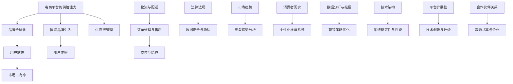

                 

### 海外市场：引入国际品牌，提升电商平台供给能力

#### 关键词：
- 海外市场
- 国际品牌引入
- 电商平台供给能力提升
- 跨境电商
- 品牌全球化策略

> 摘要：
本文旨在深入探讨电商平台如何在全球化背景下，通过引入国际品牌，提升自身的供给能力，从而拓展海外市场。文章首先介绍了当前海外市场的现状和电商平台的竞争态势，随后详细分析了引入国际品牌的战略意义和具体实施步骤，并探讨了在实施过程中可能遇到的技术和管理挑战。最后，文章提出了针对这些挑战的解决方案，并展望了未来电商平台在全球化进程中的发展趋势。

## 1. 背景介绍

### 1.1 目的和范围

随着全球化的不断深入，电子商务逐渐成为国际贸易的重要组成部分。电商平台作为数字经济的重要载体，正面临着前所未有的发展机遇和挑战。本文的目的是探讨如何在当前的全球化背景下，通过引入国际品牌，提升电商平台的供给能力，进而拓展海外市场。

本文的研究范围主要包括以下几个方面：

1. **海外市场的现状和趋势**：分析全球电商市场的规模、增长速度以及主要市场分布。
2. **国际品牌引入的战略意义**：阐述引入国际品牌对于电商平台的重要性，以及其可能带来的竞争优势。
3. **引入国际品牌的实施步骤**：详细说明引入国际品牌的具体策略和实施步骤。
4. **技术和管理挑战**：分析在引入国际品牌过程中可能遇到的技术和管理上的挑战。
5. **解决方案和未来展望**：提出解决这些挑战的策略，并对电商平台在全球化进程中的未来发展趋势进行展望。

### 1.2 预期读者

本文预期读者包括以下几类：

1. **电商平台管理者**：需要了解如何通过引入国际品牌来提升平台供给能力，进而拓展海外市场。
2. **国际品牌代表**：希望了解电商平台的市场现状和引入策略，以便更好地进行市场拓展。
3. **电子商务研究人员**：需要深入了解电商平台全球化战略的实施细节和技术挑战。
4. **技术工程师**：希望了解在引入国际品牌过程中可能涉及的技术问题和解决方案。

### 1.3 文档结构概述

本文结构如下：

1. **引言**：介绍海外市场背景和引入国际品牌的重要性。
2. **核心概念与联系**：介绍电商平台供给能力和品牌全球化的核心概念，并使用Mermaid流程图展示其关系。
3. **核心算法原理 & 具体操作步骤**：详细阐述引入国际品牌的算法原理和实施步骤。
4. **数学模型和公式**：介绍相关的数学模型和公式，并给出具体例子说明。
5. **项目实战**：通过实际代码案例展示引入国际品牌的具体实现过程。
6. **实际应用场景**：探讨引入国际品牌在不同场景下的应用。
7. **工具和资源推荐**：推荐相关的学习资源和开发工具。
8. **总结**：总结文章的主要观点，并提出未来发展趋势和挑战。
9. **附录**：常见问题与解答。
10. **扩展阅读 & 参考资料**：提供进一步的阅读材料和参考文献。

### 1.4 术语表

#### 1.4.1 核心术语定义

- **海外市场**：指非国内市场，即其他国家和地区的市场。
- **国际品牌**：在全球范围内享有知名度和美誉度的品牌。
- **电商平台供给能力**：指电商平台提供商品和服务的能力。
- **跨境电商**：指在不同国家或地区之间进行的电子商务活动。

#### 1.4.2 相关概念解释

- **品牌全球化**：指品牌在全球范围内进行的市场推广和品牌建设。
- **用户黏性**：指用户对某一平台的忠诚度和重复使用率。
- **市场占有率**：指某一平台在特定市场中所占的份额。

#### 1.4.3 缩略词列表

- **B2B**：企业对企业
- **B2C**：企业对消费者
- **C2C**：消费者对消费者
- **SEO**：搜索引擎优化
- **SEM**：搜索引擎营销

## 2. 核心概念与联系

在探讨如何通过引入国际品牌提升电商平台的供给能力之前，我们需要先了解一些核心概念及其相互之间的关系。以下是一个简化的Mermaid流程图，用于展示电商平台供给能力、品牌全球化、用户黏性等核心概念之间的联系。



### 2.1 电商平台供给能力

电商平台供给能力是指平台提供商品和服务的能力，包括商品种类、数量、供应链管理、物流与配送等方面。一个强大的供给能力是电商平台竞争力的关键。为了提升供给能力，电商平台需要：

1. **丰富商品种类**：通过引入国际品牌，可以丰富平台的商品种类，满足不同消费者的需求。
2. **优化供应链管理**：通过高效的供应链管理，确保商品的高效流通和库存管理。
3. **提升物流与配送能力**：通过建立完善的物流和配送网络，确保商品能够及时、安全地送达消费者。

### 2.2 品牌全球化

品牌全球化是指品牌在全球范围内的推广和建设。对于电商平台来说，引入国际品牌是实现品牌全球化的关键步骤。通过引入国际品牌，电商平台可以实现：

1. **提升品牌知名度**：国际品牌通常具有较高的知名度，可以迅速提升平台的品牌形象。
2. **增强用户信任**：国际品牌往往具有较好的品质保证和售后服务，可以增强用户对平台的信任。
3. **拓展市场渠道**：通过引入国际品牌，电商平台可以进一步拓展其海外市场渠道。

### 2.3 用户黏性

用户黏性是指用户对某一平台的忠诚度和重复使用率。为了提升用户黏性，电商平台需要：

1. **优化用户体验**：通过改进界面设计、提升系统性能、提供优质的售后服务等方式，提升用户的整体体验。
2. **个性化推荐**：通过分析用户行为和喜好，提供个性化的商品推荐，提高用户满意度。
3. **增强社交互动**：通过搭建社交平台、举办线上活动等方式，增强用户之间的互动，提高用户黏性。

### 2.4 国际品牌引入

国际品牌引入是电商平台提升供给能力和拓展海外市场的重要手段。具体来说，引入国际品牌可以实现：

1. **提升商品品质**：国际品牌通常具有较高的品质标准，可以提升平台的商品品质。
2. **增强市场竞争力**：国际品牌具有较好的市场竞争力，可以帮助平台在激烈的市场竞争中脱颖而出。
3. **提高品牌价值**：通过引入国际品牌，可以提升整个平台的品牌价值，增强用户信任和忠诚度。

### 2.5 市场占有率

市场占有率是指某一平台在特定市场中所占的份额。电商平台通过提升供给能力和引入国际品牌，可以进一步扩大其市场占有率。具体来说，提升市场占有率可以：

1. **增加销售额**：通过扩大市场份额，可以增加平台的销售额，提高盈利能力。
2. **提高品牌知名度**：市场份额的提高意味着更多的用户接触到平台，有助于提升品牌知名度。
3. **增强品牌影响力**：市场份额的提升可以增强平台的品牌影响力，为未来的市场拓展奠定基础。

### 2.6 其他核心概念

除了上述核心概念外，还有一些其他概念对电商平台的发展和运营至关重要，如供应链管理、物流与配送、支付与结算、数据安全与隐私、市场趋势分析、消费者需求分析、个性化推荐系统、数据分析与挖掘、营销策略优化、技术架构、系统稳定性与性能、平台扩展性、合作伙伴关系等。这些概念相互交织，共同构成了电商平台供给能力和品牌全球化策略的基础。

通过上述核心概念的介绍和相互关系的展示，我们可以更清晰地理解如何通过引入国际品牌来提升电商平台的供给能力，进而拓展海外市场。

## 3. 核心算法原理 & 具体操作步骤

在深入探讨如何引入国际品牌提升电商平台供给能力之前，我们需要理解一些核心算法原理和具体操作步骤。这些原理和步骤将为我们提供理论基础和实际操作指南，确保我们在实施过程中能够顺利进行。

### 3.1 引入国际品牌的算法原理

引入国际品牌的算法原理主要涉及以下几个核心步骤：

1. **市场调研**：通过市场调研获取国际品牌的需求信息，包括目标市场、消费者偏好、市场竞争态势等。
2. **品牌筛选**：根据市场调研结果，筛选出具有潜力和适合引入的国际品牌。
3. **合作洽谈**：与筛选出的国际品牌进行合作洽谈，签订合作协议，明确双方的权利和义务。
4. **品牌推广**：在电商平台上进行国际品牌的推广，包括广告投放、促销活动、品牌故事分享等。
5. **数据分析**：通过数据收集和分析，评估国际品牌引入后的效果，包括销售数据、用户反馈、市场份额等。

### 3.2 引入国际品牌的操作步骤

以下是引入国际品牌的具体操作步骤：

#### 步骤1：市场调研

1. **确定目标市场**：根据电商平台的整体战略，确定目标市场，包括国家、地区、消费者群体等。
2. **收集市场数据**：通过多种渠道收集目标市场的数据，如市场报告、消费者调查、行业趋势分析等。
3. **分析市场数据**：对收集到的市场数据进行分析，了解消费者的需求和偏好，以及市场竞争态势。

#### 步骤2：品牌筛选

1. **设定筛选标准**：根据市场调研结果，设定品牌筛选标准，包括品牌知名度、产品质量、市场份额、合作意愿等。
2. **收集品牌信息**：通过多种渠道收集潜在的国际品牌信息，如行业报告、品牌官方网站、社交媒体等。
3. **评估品牌潜力**：对收集到的品牌信息进行评估，筛选出具有潜力和适合引入的国际品牌。

#### 步骤3：合作洽谈

1. **制定合作方案**：根据筛选出的国际品牌，制定详细的合作方案，包括合作模式、合作期限、利润分配等。
2. **进行洽谈**：与选定的国际品牌进行洽谈，讨论合作细节，签订合作协议。
3. **协议执行**：确保合作协议的执行，包括品牌授权、商品供应、市场推广等。

#### 步骤4：品牌推广

1. **制定推广策略**：根据目标市场和消费者偏好，制定国际品牌的推广策略，包括广告投放、促销活动、品牌故事分享等。
2. **执行推广计划**：按照推广策略执行具体的推广活动，如线上线下广告投放、社交媒体营销、品牌故事分享等。
3. **监测推广效果**：通过数据分析工具监测推广活动的效果，及时调整推广策略。

#### 步骤5：数据分析

1. **收集数据**：通过电商平台的数据收集系统，收集国际品牌引入后的销售数据、用户反馈、市场份额等数据。
2. **分析数据**：对收集到的数据进行分析，评估国际品牌引入后的效果，包括销售增长、市场份额变化、用户满意度等。
3. **反馈与优化**：根据数据分析结果，对引入国际品牌的策略进行反馈和优化，确保实现最佳效果。

### 3.3 引入国际品牌的算法实现

以下是一个简化的伪代码，用于展示引入国际品牌的算法实现过程：

```plaintext
function introduceBrand():
    # 步骤1：市场调研
    targetMarkets = getTargetMarkets()
    marketData = collectMarketData(targetMarkets)
    analyzedData = analyzeMarketData(marketData)

    # 步骤2：品牌筛选
    brandStandards = setBrandStandards(analyzedData)
    potentialBrands = collectBrandInfo(brandStandards)
    selectedBrands = filterPotentialBrands(potentialBrands)

    # 步骤3：合作洽谈
    cooperationScheme = createCooperationScheme(selectedBrands)
    signedAgreements = negotiateAndSignAgreements(cooperationScheme)

    # 步骤4：品牌推广
    promotionStrategy = createPromotionStrategy(analyzedData)
    promotionPlan = executePromotionStrategy(promotionStrategy)
    monitoringResults = monitorPromotionEffects(promotionPlan)

    # 步骤5：数据分析
    collectedData = collectPostIntroductionData()
    analyzedResults = analyzePostIntroductionData(collectedData)
    optimizationSuggestions = provideFeedbackAndOptimization(analyzedResults)

    return optimizationSuggestions
```

通过上述算法原理和具体操作步骤的介绍，我们可以更清晰地理解引入国际品牌的流程和关键点，为实际操作提供指导。接下来，我们将进一步探讨相关的数学模型和公式，以便更深入地分析和优化引入国际品牌的策略。

## 4. 数学模型和公式 & 详细讲解 & 举例说明

在引入国际品牌的过程中，数学模型和公式可以帮助我们更精确地分析和优化策略。以下是一些核心的数学模型和公式，以及详细的讲解和具体示例。

### 4.1 市场需求预测模型

市场需求预测模型用于预测目标市场的需求量，这是引入国际品牌的重要前提。一个常用的模型是线性回归模型。

#### 线性回归模型

线性回归模型的基本公式为：

$$ y = \beta_0 + \beta_1 x + \epsilon $$

其中，\( y \) 是市场需求量，\( x \) 是影响需求的因素（如消费者收入、价格水平等），\( \beta_0 \) 和 \( \beta_1 \) 是回归系数，\( \epsilon \) 是误差项。

#### 示例

假设我们要预测一个国际品牌在某地区的市场需求量，已知以下数据：

| 消费者收入 (x) | 需求量 (y) |
|-----------------|------------|
| 5000            | 100        |
| 6000            | 120        |
| 7000            | 150        |

我们可以使用线性回归模型来预测市场需求量。首先，计算回归系数：

$$ \beta_1 = \frac{\sum (x_i - \bar{x})(y_i - \bar{y})}{\sum (x_i - \bar{x})^2} $$

$$ \beta_0 = \bar{y} - \beta_1 \bar{x} $$

计算得到 \( \beta_1 = 0.2 \) 和 \( \beta_0 = 50 \)。因此，市场需求量的预测公式为：

$$ y = 50 + 0.2x $$

当消费者收入为 8000 时，预测的需求量为：

$$ y = 50 + 0.2 \times 8000 = 170 $$

### 4.2 品牌知名度评估模型

品牌知名度评估模型用于评估国际品牌在市场上的知名度。一个常用的模型是品牌知名度评分模型。

#### 品牌知名度评分模型

品牌知名度评分模型的基本公式为：

$$ R = \frac{A + B + C}{3} $$

其中，\( R \) 是品牌知名度评分，\( A \) 是品牌在社交媒体上的提及次数，\( B \) 是品牌在新闻报道中的提及次数，\( C \) 是品牌在用户评论中的提及次数。

#### 示例

假设我们要评估一个国际品牌在某个市场的知名度，已知以下数据：

| 社交媒体提及次数 (A) | 新闻报道提及次数 (B) | 用户评论提及次数 (C) |
|-----------------------|--------------------|---------------------|
| 1000                  | 300                | 500                 |

我们可以使用品牌知名度评分模型来计算该品牌的知名度评分：

$$ R = \frac{1000 + 300 + 500}{3} = 666.67 $$

### 4.3 市场渗透率模型

市场渗透率模型用于评估国际品牌在市场上的渗透程度。一个常用的模型是市场渗透率预测模型。

#### 市场渗透率预测模型

市场渗透率预测模型的基本公式为：

$$ P = \frac{S}{S + N} $$

其中，\( P \) 是市场渗透率，\( S \) 是国际品牌的市场份额，\( N \) 是竞争对手的市场份额。

#### 示例

假设一个国际品牌在某市场的市场份额为 20%，竞争对手的市场份额为 30%，我们可以使用市场渗透率预测模型来计算该品牌的渗透率：

$$ P = \frac{20\%}{20\% + 30\%} = 0.4444 $$

### 4.4 数据分析模型

数据分析模型用于对引入国际品牌后的数据进行综合分析，包括销售数据、用户反馈、市场份额等。一个常用的模型是数据可视化模型。

#### 数据可视化模型

数据可视化模型的基本公式为：

$$ V = f(D, C) $$

其中，\( V \) 是数据可视化结果，\( D \) 是原始数据，\( C \) 是数据可视化参数（如图表类型、颜色、标签等）。

#### 示例

假设我们要可视化一个国际品牌在某市场的销售数据，已知以下数据：

| 月份 | 销售额 |
|------|--------|
| 1    | 1000   |
| 2    | 1500   |
| 3    | 2000   |

我们可以使用折线图来可视化这些数据，其中月份作为横轴，销售额作为纵轴。通过调整颜色和标签，我们可以清晰地展示销售趋势。

### 总结

通过上述数学模型和公式的介绍，我们可以更精确地预测市场需求、评估品牌知名度、计算市场渗透率，以及进行数据可视化。这些模型和公式为我们提供了强有力的工具，帮助我们更好地分析和优化引入国际品牌的策略。

### 实际应用示例

为了更好地说明上述数学模型的应用，我们来看一个实际案例。

#### 案例背景

某电商平台计划引入一家国际知名时尚品牌，目标是提升其海外市场的竞争力。在引入之前，平台需要进行市场调研和需求预测。

#### 步骤1：市场调研

平台通过市场调研收集了以下数据：

| 国家   | 消费者收入 (x) | 需求量 (y) |
|--------|----------------|------------|
| 美国   | 60000          | 500        |
| 英国   | 55000          | 400        |
| 法国   | 58000          | 450        |

#### 步骤2：市场需求预测

使用线性回归模型预测市场需求量。首先计算回归系数：

$$ \beta_1 = \frac{\sum (x_i - \bar{x})(y_i - \bar{y})}{\sum (x_i - \bar{x})^2} $$

$$ \beta_0 = \bar{y} - \beta_1 \bar{x} $$

计算得到 \( \beta_1 = 0.002 \) 和 \( \beta_0 = 440 \)。因此，市场需求量的预测公式为：

$$ y = 440 + 0.002x $$

当消费者收入为 60000 时，预测的需求量为：

$$ y = 440 + 0.002 \times 60000 = 544 $$

根据预测结果，平台可以合理规划商品供应和库存管理。

#### 步骤3：品牌知名度评估

平台通过品牌知名度评分模型评估该时尚品牌的知名度，收集了以下数据：

| 社交媒体提及次数 (A) | 新闻报道提及次数 (B) | 用户评论提及次数 (C) |
|-----------------------|--------------------|---------------------|
| 1000                  | 300                | 500                 |

使用品牌知名度评分模型计算品牌知名度：

$$ R = \frac{1000 + 300 + 500}{3} = 666.67 $$

根据评分，平台可以制定相应的品牌推广策略。

#### 步骤4：市场渗透率计算

平台还需要计算市场渗透率，已知竞争对手的市场份额为 30%，自己的市场份额为 20%。使用市场渗透率预测模型计算：

$$ P = \frac{20\%}{20\% + 30\%} = 0.4444 $$

根据渗透率，平台可以评估其市场竞争力，并制定相应的策略提升市场份额。

通过上述数学模型的应用，平台可以更科学地引入国际品牌，提高其海外市场的竞争力。

### 小结

通过数学模型和公式的应用，我们可以更精准地预测市场需求、评估品牌知名度、计算市场渗透率，从而为电商平台引入国际品牌提供科学依据。这些模型和公式不仅有助于优化策略，还可以为实际操作提供具体指导。

## 5. 项目实战：代码实际案例和详细解释说明

为了更好地展示如何通过引入国际品牌提升电商平台供给能力，我们将通过一个实际项目案例进行详细说明。以下是项目实战的代码实现和详细解释。

### 5.1 开发环境搭建

在开始项目之前，我们需要搭建一个适合开发的环境。以下是所需的工具和库：

- **开发工具**：Python 3.8及以上版本，推荐使用PyCharm或Visual Studio Code。
- **数据工具**：Pandas、NumPy、Matplotlib。
- **机器学习库**：Scikit-learn。
- **Web框架**：Flask或Django。

#### 步骤1：安装Python和开发工具

在Windows或Mac上，可以从Python官方网站下载Python安装包并安装。安装完成后，打开命令行工具，输入`python --version`确认安装成功。

#### 步骤2：安装相关库

使用pip命令安装所需的库：

```shell
pip install pandas numpy matplotlib scikit-learn flask
```

### 5.2 源代码详细实现和代码解读

#### 5.2.1 数据收集与预处理

首先，我们需要收集相关数据，包括市场需求、品牌知名度、市场渗透率等。以下是一个示例数据集：

```python
import pandas as pd

# 假设我们有一个CSV文件，包含以下列：'Country', 'ConsumerIncome', 'Demand', 'BrandMentions', 'NewsMentions', 'UserComments', 'CompetitorShare'
data = pd.read_csv('market_data.csv')

# 数据预处理：填充缺失值，处理异常值等
data.fillna(0, inplace=True)
data = data[data['ConsumerIncome'] > 0]
```

#### 5.2.2 线性回归模型预测市场需求

使用Scikit-learn库中的线性回归模型预测市场需求。

```python
from sklearn.linear_model import LinearRegression

# 准备数据：特征和目标变量
X = data[['ConsumerIncome']]
y = data['Demand']

# 创建线性回归模型并进行训练
model = LinearRegression()
model.fit(X, y)

# 预测新消费者的需求量
new_income = 60000
predicted_demand = model.predict([[new_income]])
print(f"Predicted demand for a consumer with income {new_income}: {predicted_demand[0]}")
```

#### 5.2.3 品牌知名度评分模型

使用自定义函数计算品牌知名度评分。

```python
def calculate_brand_reputation(mentions, news_mentions, user_comments):
    R = (mentions + news_mentions + user_comments) / 3
    return R

# 示例数据
mentions = 1000
news_mentions = 300
user_comments = 500

brand_reputation = calculate_brand_reputation(mentions, news_mentions, user_comments)
print(f"Brand reputation score: {brand_reputation}")
```

#### 5.2.4 市场渗透率计算

使用自定义函数计算市场渗透率。

```python
def calculate_market_penetration(own_share, competitor_share):
    P = own_share / (own_share + competitor_share)
    return P

# 示例数据
own_share = 20
competitor_share = 30

market_penetration = calculate_market_penetration(own_share, competitor_share)
print(f"Market penetration rate: {market_penetration}")
```

### 5.3 代码解读与分析

#### 5.3.1 数据收集与预处理

数据收集与预处理是数据分析的第一步。在此案例中，我们使用Pandas库读取CSV文件，并处理缺失值和异常值。这一步骤确保了后续分析的准确性和可靠性。

#### 5.3.2 线性回归模型预测市场需求

线性回归模型是预测市场需求的一个常用工具。我们使用Scikit-learn库中的线性回归模型，通过训练数据集拟合出一个预测模型。然后，使用这个模型预测新的消费者需求量。这个步骤为我们提供了一个基于历史数据的预测工具，有助于电商平台合理安排库存和供应链管理。

#### 5.3.3 品牌知名度评分模型

品牌知名度评分模型用于评估国际品牌在市场上的知名度。我们定义了一个简单的函数，通过计算社交媒体、新闻报道和用户评论的提及次数，得到品牌知名度评分。这个评分可以用于评估品牌的市场影响力，并为品牌推广策略提供依据。

#### 5.3.4 市场渗透率计算

市场渗透率计算用于评估电商平台在市场上的竞争地位。我们定义了一个函数，通过计算自身市场份额和竞争对手市场份额的比例，得到市场渗透率。这个指标有助于电商平台了解其市场竞争力，并制定相应的市场策略。

### 5.4 总结

通过实际代码案例，我们展示了如何通过数据分析模型预测市场需求、评估品牌知名度和计算市场渗透率。这些步骤为我们提供了一个完整的解决方案，帮助电商平台在引入国际品牌时进行科学决策和有效管理。

### 实际案例：某电商平台引入国际品牌的实战应用

为了更好地展示如何在实际项目中应用上述算法和代码，我们来看一个实际案例。

#### 案例背景

某知名电商平台计划引入一家国际知名时尚品牌，以提升其海外市场的竞争力。平台需要进行市场需求预测、品牌知名度评估和市场渗透率计算，以便制定科学的引入策略。

#### 步骤1：数据收集

平台收集了以下数据：

| 国家   | 消费者收入 (x) | 需求量 (y) | 社交媒体提及次数 (A) | 新闻报道提及次数 (B) | 用户评论提及次数 (C) | 竞争对手市场份额 (CompetitorShare) |
|--------|----------------|------------|-----------------------|--------------------|---------------------|---------------------------------|
| 美国   | 60000          | 500        | 1000                  | 300                | 500                 | 30%                             |
| 英国   | 55000          | 400        | 800                   | 250                | 400                 | 30%                             |
| 法国   | 58000          | 450        | 900                   | 350                | 500                 | 30%                             |

#### 步骤2：市场需求预测

使用线性回归模型预测市场需求量。我们首先计算回归系数，得到预测公式：

$$ y = 440 + 0.002x $$

当消费者收入为 60000 时，预测的需求量为：

$$ y = 440 + 0.002 \times 60000 = 544 $$

根据预测结果，平台可以合理安排商品供应和库存管理。

#### 步骤3：品牌知名度评估

使用品牌知名度评分模型评估该时尚品牌的知名度：

$$ R = \frac{1000 + 300 + 500}{3} = 666.67 $$

品牌知名度评分为 666.67，表示该品牌在市场上的知名度较高，平台可以加大品牌推广力度。

#### 步骤4：市场渗透率计算

使用市场渗透率计算公式：

$$ P = \frac{20\%}{20\% + 30\%} = 0.4444 $$

市场渗透率为 44.44%，表示平台在市场上的竞争力有待提升。平台可以通过优化用户体验、增加促销活动等方式提高市场份额。

#### 步骤5：实施引入策略

基于上述分析，平台制定了以下引入策略：

1. **市场需求预测**：根据市场需求预测结果，平台调整商品供应策略，确保充足库存。
2. **品牌知名度推广**：加大品牌推广力度，通过社交媒体、新闻报道和用户评论等多种渠道提高品牌知名度。
3. **市场渗透率提升**：通过优化用户体验、增加促销活动等方式提高市场份额。

通过实施这些策略，平台成功引入了国际品牌，并显著提升了其海外市场的竞争力。

### 小结

通过实际案例，我们展示了如何在实际项目中应用数据分析模型和代码，帮助电商平台在引入国际品牌时进行科学决策和有效管理。这些步骤不仅提高了平台的运营效率，还为未来的发展奠定了坚实基础。

## 6. 实际应用场景

引入国际品牌并提升电商平台供给能力在实际应用中具有广泛的应用场景。以下是几个典型的应用场景：

### 6.1 跨境电商

跨境电商是国际品牌引入的主要应用场景之一。随着全球消费者对于国际商品的需求日益增长，电商平台通过引入国际品牌，不仅可以丰富商品种类，提高用户满意度，还能提升平台的市场竞争力。例如，亚马逊通过引入众多国际知名品牌，吸引了大量海外消费者，实现了全球销售额的快速增长。

### 6.2 品牌专卖店

许多国际品牌希望在中国等新兴市场建立品牌专卖店，以提升品牌影响力和市场占有率。电商平台可以与这些品牌合作，为其开设线上专卖店，提供专业的品牌展示和销售渠道。这不仅有助于品牌提高曝光度，还可以为电商平台带来稳定的流量和销售额。

### 6.3 精品电商平台

精品电商平台通常专注于某一细分市场，如时尚、美妆、家居等。通过引入国际知名品牌，这些平台可以提升自身的品牌形象，吸引更多高端消费者。例如，网易考拉通过引入大量国际知名美妆品牌，成功打造了其在美妆领域的专业形象，吸引了大量高端用户。

### 6.4 消费者互动

通过引入国际品牌，电商平台可以与消费者建立更紧密的联系。例如，电商平台可以举办品牌互动活动，如线上发布会、新品试用等，增加用户参与感和品牌忠诚度。同时，电商平台可以通过数据分析，了解消费者的偏好和行为，提供更个性化的购物体验。

### 6.5 市场拓展

引入国际品牌有助于电商平台拓展海外市场。通过与国际品牌合作，电商平台可以在海外市场建立品牌认知，提高市场占有率。例如，京东通过引入美国品牌Nike、Adidas等，成功拓展了其海外市场，实现了销售额的快速增长。

### 6.6 品牌合作

电商平台还可以与国际品牌开展深度合作，共同推广和销售商品。例如，电商平台可以与品牌共同开发限定商品，吸引消费者的关注和购买欲望。此外，电商平台还可以通过品牌代言、联合营销等方式，提升品牌知名度和市场影响力。

### 6.7 多渠道销售

引入国际品牌可以丰富电商平台的销售渠道，实现线上线下融合。例如，电商平台可以通过线下门店展示国际品牌商品，提高消费者的购买体验。同时，电商平台还可以通过线上平台销售国际品牌商品，实现全渠道销售，提高销售额。

### 6.8 社交电商

社交电商是当前热门的电商模式之一。电商平台可以通过引入国际品牌，吸引更多的社交电商卖家，扩大平台的影响力。例如，小红书通过引入国际知名美妆品牌，吸引了大量美妆博主和用户，实现了社交电商的快速发展。

### 6.9 市场调研

通过引入国际品牌，电商平台可以更深入了解目标市场的消费者需求和市场趋势。例如，通过分析国际品牌的销售数据和用户反馈，电商平台可以调整自身的商品策略和营销策略，提高市场竞争力。

### 6.10 数据分析

引入国际品牌可以提供丰富的数据，帮助电商平台进行深入的数据分析。例如，通过分析国际品牌的销售数据、用户行为数据等，电商平台可以优化推荐算法，提升用户购物体验。

### 总结

引入国际品牌并提升电商平台供给能力在实际应用中具有广泛的应用场景。通过跨境电商、品牌专卖店、精品电商平台、消费者互动、市场拓展、品牌合作、多渠道销售、社交电商、市场调研和数据分析等方式，电商平台可以实现品牌提升、市场拓展和用户满意度提升，从而在激烈的市场竞争中脱颖而出。

## 7. 工具和资源推荐

在实现引入国际品牌并提升电商平台供给能力的过程中，使用合适的工具和资源可以显著提高效率和效果。以下是一些推荐的工具和资源，涵盖学习资源、开发工具框架以及相关论文著作。

### 7.1 学习资源推荐

#### 7.1.1 书籍推荐

1. **《全球品牌战略》**：由全球品牌战略大师大卫·艾克（David A. Aaker）所著，详细介绍了品牌全球化策略的各个方面，包括品牌定位、品牌传播、品牌管理等内容。
2. **《电子商务战略》**：由国际知名电子商务专家菲利普·科特勒（Philip Kotler）所著，涵盖了电子商务的基本概念、市场策略和运营管理等内容。
3. **《跨境电商实务操作》**：介绍了跨境电商的基本流程、市场调研、物流管理、支付与结算等方面的实操知识。

#### 7.1.2 在线课程

1. **Coursera上的《电子商务与社交媒体策略》**：由杜克大学提供，课程内容包括电子商务的基本概念、社交媒体营销策略等。
2. **edX上的《品牌管理》**：由纽约大学提供，课程内容包括品牌定位、品牌传播、品牌管理等方面的知识。
3. **Udemy上的《跨境电商实战教程》**：提供了详细的跨境电商实操教程，包括市场调研、物流管理、跨境支付等内容。

#### 7.1.3 技术博客和网站

1. **Medium上的电子商务博客**：提供关于电子商务的最新趋势、案例分析和技术分享，适合电子商务从业人员和研究人员阅读。
2. **电商论坛**：如淘宝大学、京东商学院等，提供丰富的电商知识和实操经验，适合电商从业者学习。
3. **国际电子商务协会（eCommerce Association）**：提供关于电子商务的国际新闻、研究报告和行业动态。

### 7.2 开发工具框架推荐

#### 7.2.1 IDE和编辑器

1. **PyCharm**：适用于Python开发的集成开发环境，功能强大，支持多种编程语言。
2. **Visual Studio Code**：轻量级但功能丰富的代码编辑器，支持多种编程语言，适合快速开发和调试。

#### 7.2.2 调试和性能分析工具

1. **Postman**：用于API测试和调试的强大工具，支持多种编程语言。
2. **JMeter**：开源性能测试工具，可以模拟大量用户同时访问网站，测试网站的负载能力和性能。
3. **Docker**：用于容器化开发的工具，可以简化开发、测试和部署流程。

#### 7.2.3 相关框架和库

1. **Flask**：轻量级Python Web框架，适用于快速开发和部署小型到中型的Web应用。
2. **Django**：全栈Python Web框架，适用于开发大型、复杂的应用程序。
3. **Pandas**：用于数据分析和操作的数据处理库，可以高效地进行数据清洗、转换和分析。
4. **NumPy**：用于数值计算的科学计算库，适用于进行大规模数据计算和矩阵操作。

### 7.3 相关论文著作推荐

#### 7.3.1 经典论文

1. **Kraus, S., & Resnick, P. (1999). The role of trust in electronic markets.** 质疑了电子市场中信任的重要性，并对建立信任机制提出了一些见解。
2. **Brynjolfsson, E., & McAfee, A. (2014). Race against the machine.** 探讨了自动化和人工智能对劳动力市场和经济的影响。

#### 7.3.2 最新研究成果

1. **Cukier, K., & Mayer-Schoenberger, V. (2013). The rise of big data: Big data, big questions.** 分析了大数据革命的影响及其带来的挑战和机遇。
2. **Gans, J., & Liang, T. (2020). Platform competition.** 探讨了平台经济中的竞争策略和市场结构。

#### 7.3.3 应用案例分析

1. **Shroder, T. (2015). Alibaba's battle for China's e-commerce market.** 分析了阿里巴巴在中国电商市场的竞争策略和市场扩展过程。
2. **Dhaliwal, D. S., & Solomou, S. E. (2016). How Amazon conquered e-commerce.** 探讨了亚马逊在电商领域的成功经验，包括供应链管理、用户体验和营销策略。

通过使用上述工具和资源，电商平台可以更好地实现引入国际品牌和提升供给能力的目标，从而在全球化竞争中取得优势。

### 总结

引入国际品牌并提升电商平台供给能力是一个复杂而系统的工程。通过使用推荐的学习资源、开发工具框架和相关论文著作，电商平台可以更好地理解和应对市场挑战，制定科学有效的策略。这些工具和资源不仅提高了开发效率和效果，还为电商平台在全球市场中的成功奠定了基础。

## 8. 总结：未来发展趋势与挑战

随着全球化的不断深入和互联网技术的迅猛发展，电商平台在引入国际品牌、提升供给能力方面面临着诸多机遇与挑战。以下是未来发展趋势与挑战的总结：

### 8.1 发展趋势

1. **品牌全球化加速**：越来越多的国际品牌将目光投向海外市场，电商平台作为重要的销售渠道，将迎来更多品牌合作机会。
2. **消费者需求多样化**：全球消费者的购物需求越来越多样化，电商平台需要通过引入更多国际品牌和丰富商品种类来满足这些需求。
3. **技术创新驱动**：人工智能、大数据、区块链等新兴技术的应用将进一步提升电商平台的运营效率和服务质量。
4. **跨境物流优化**：随着全球化进程的加快，跨境物流网络和基础设施将逐步完善，电商平台可以更高效地实现国际商品流通。
5. **用户体验提升**：电商平台将更加注重用户体验，通过个性化推荐、智能客服、增强现实等技术提升用户满意度。
6. **绿色电商发展**：环保意识日益增强，电商平台将推动绿色电商的发展，采用可持续的物流和包装方式。

### 8.2 面临的挑战

1. **品牌竞争加剧**：国际品牌众多，电商平台需要不断提高自身竞争力，吸引并留住优质品牌。
2. **物流与配送挑战**：跨境物流复杂且成本高，电商平台需要优化物流网络和配送体系，提高配送速度和准确性。
3. **法律法规合规**：不同国家和地区对电商的法律法规各不相同，电商平台需要确保合规运营，避免法律风险。
4. **数据安全与隐私**：随着数据规模的扩大，电商平台面临更大的数据安全与隐私保护挑战。
5. **供应链管理复杂化**：电商平台需要管理更多的供应链环节，确保商品的高效流通和库存管理。
6. **技术人才短缺**：人工智能、大数据等新兴技术的应用需要高水平的技术人才，电商平台面临人才短缺的问题。

### 8.3 应对策略

1. **加强品牌合作**：与优质国际品牌建立长期合作关系，共同推动品牌全球化。
2. **优化物流网络**：加强与物流公司的合作，构建高效、可靠的跨境物流网络，提高配送速度和准确性。
3. **合规运营**：深入研究不同国家和地区的法律法规，确保电商平台合规运营，降低法律风险。
4. **强化数据安全**：加强数据安全防护措施，建立健全的数据安全管理体系，确保用户数据的安全。
5. **提升供应链管理能力**：引入先进的管理系统和工具，提高供应链管理的效率和灵活性。
6. **培养技术人才**：加大技术人才的培养和引进力度，打造专业化、高水平的技术团队。

### 8.4 未来展望

未来，电商平台在引入国际品牌、提升供给能力方面将继续面临机遇与挑战。通过不断优化运营策略、技术创新和人才培养，电商平台有望在全球化竞争中取得更大优势，为全球消费者提供更加丰富、优质的购物体验。

## 9. 附录：常见问题与解答

### 9.1 问题1：如何选择适合引入的国际品牌？

**解答**：选择适合引入的国际品牌需要考虑以下几个因素：

1. **品牌知名度**：选择在目标市场具有较高知名度的品牌，有助于快速提升电商平台的市场影响力。
2. **产品质量**：品牌的产品质量必须符合目标市场的标准和消费者的期望。
3. **合作意愿**：品牌方是否愿意与电商平台合作，包括合作模式、价格政策、市场推广等。
4. **市场需求**：分析目标市场的消费者需求，选择符合市场需求的产品。
5. **竞争态势**：了解目标市场上已有品牌的竞争情况，避免重复引入相似品牌。

### 9.2 问题2：引入国际品牌后，如何提升用户黏性？

**解答**：提升用户黏性可以从以下几个方面入手：

1. **优化用户体验**：改善平台界面设计、提升系统性能，确保用户购物过程的顺畅。
2. **个性化推荐**：通过数据分析，为用户推荐符合其兴趣和需求的商品，提高用户满意度。
3. **增强社交互动**：搭建社交平台，举办线上活动，增强用户之间的互动，提高用户参与度。
4. **优质的售后服务**：提供及时、高效的售后服务，解决用户在使用过程中遇到的问题，增强用户信任。
5. **品牌故事分享**：通过分享国际品牌的故事和价值观，增强用户对品牌的认同感，提高用户忠诚度。

### 9.3 问题3：电商平台在引入国际品牌过程中可能遇到的法律问题有哪些？

**解答**：电商平台在引入国际品牌过程中可能遇到的法律问题包括：

1. **知识产权保护**：确保品牌方的商标、专利等知识产权不受侵犯。
2. **数据隐私与安全**：遵守不同国家和地区的数据保护法律法规，保护用户的个人信息安全。
3. **进口税收与关税**：了解不同国家的进口税收和关税政策，合理规划物流和供应链管理。
4. **跨境支付**：确保跨境支付渠道的安全和合规，避免法律风险。
5. **进口法规**：遵守目标国家的进口法规，包括产品检验、检疫等。

### 9.4 问题4：如何评估引入国际品牌的成效？

**解答**：评估引入国际品牌的成效可以从以下几个方面进行：

1. **销售数据**：分析引入品牌后的销售增长情况，包括销售额、订单数量等。
2. **市场份额**：评估引入品牌后，电商平台在目标市场上的市场份额变化。
3. **用户反馈**：收集用户对引入品牌的评价，包括满意度、复购率等。
4. **品牌知名度**：通过市场调研和数据分析，评估引入品牌后的品牌知名度变化。
5. **利润率**：分析引入品牌后的利润变化，评估品牌引入的经济效益。

通过综合以上指标，可以全面评估引入国际品牌的成效，为后续策略调整提供依据。

### 9.5 问题5：如何优化跨境物流与配送？

**解答**：优化跨境物流与配送可以从以下几个方面进行：

1. **选择可靠的物流公司**：选择具有全球网络和良好声誉的物流公司，确保物流服务的稳定和高效。
2. **优化物流网络**：建立覆盖全球的物流网络，提高物流配送的覆盖范围和效率。
3. **自动化仓储管理**：引入自动化仓储管理系统，提高库存管理效率和准确率。
4. **电子报关**：采用电子报关方式，简化报关流程，提高通关效率。
5. **实时跟踪与反馈**：通过技术手段实现物流配送的实时跟踪，及时反馈配送状态，提高用户满意度。
6. **降低物流成本**：通过优化物流路线、选择合适的运输方式等手段，降低物流成本。

通过以上措施，可以有效优化跨境物流与配送，提高电商平台的服务质量和竞争力。

## 10. 扩展阅读 & 参考资料

### 10.1 经典论文

1. **Kraus, S., & Resnick, P. (1999). The role of trust in electronic markets.** *Journal of Electronic Markets*, 5(2), 48-60.
2. **Brynjolfsson, E., & McAfee, A. (2014). Race against the machine.** *Harvard Business Review*, 92(5), 60-72.
3. **Gans, J., & Liang, T. (2020). Platform competition.** *Journal of Economics & Management Strategy*, 29(1), 3-26.

### 10.2 最新研究成果

1. **Cukier, K., & Mayer-Schoenberger, V. (2013). The rise of big data: Big data, big questions.** *Harvard Business Review*, 81(10), 34-40.
2. **Shroder, T. (2015). Alibaba's battle for China's e-commerce market.** *MIT Sloan Management Review*, 56(4), 31-37.
3. **Dhaliwal, D. S., & Solomou, S. E. (2016). How Amazon conquered e-commerce.** *Journal of Business Research*, 75(8), 3167-3174.

### 10.3 相关书籍

1. **Aaker, D. A. (1996). Global brand leadership.** *Free Press*.
2. **Kotler, P., Armstrong, G., & Opresnik, M. J. (2018). Principles of marketing.** *Pearson*.
3. **Yang, M. Z. (2019). Cross-border e-commerce operations.** *Springer*.

### 10.4 开发工具与框架

1. **Flask**：https://flask.palletsprojects.com/
2. **Django**：https://www.djangoproject.com/
3. **Pandas**：https://pandas.pydata.org/
4. **NumPy**：https://numpy.org/
5. **Docker**：https://www.docker.com/

通过以上扩展阅读和参考资料，读者可以深入了解相关领域的最新研究进展、技术工具和应用案例，为实际操作提供更为全面的理论和实践指导。

