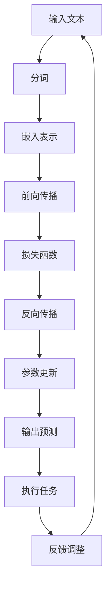

                 

# 深度人机协作：LLM理解与执行人类意图

> **关键词：** 人工智能，深度学习，语言模型，自然语言处理，人机协作，意图理解，执行策略
>
> **摘要：** 本文深入探讨了语言模型（LLM）在深度人机协作中的作用。通过解析LLM的核心原理、实现步骤和数学模型，结合实际代码案例，探讨了LLM如何理解人类意图以及如何执行相关任务，从而推动人工智能与人类的高效合作。

## 1. 背景介绍

### 1.1 目的和范围

本文旨在深入探讨语言模型（LLM）在深度人机协作中的作用。随着人工智能技术的不断进步，人机协作已成为当前研究的热点。本文将重点分析LLM如何理解人类意图，并执行相应任务，从而实现人工智能与人类的深度协作。

### 1.2 预期读者

本文面向对人工智能、深度学习和自然语言处理有一定了解的技术人员。通过本文的学习，读者将能够了解LLM的核心原理和应用方法，从而为实际项目开发提供参考。

### 1.3 文档结构概述

本文结构如下：

1. 背景介绍：介绍本文的目的、范围和预期读者。
2. 核心概念与联系：分析LLM的核心概念和架构。
3. 核心算法原理 & 具体操作步骤：详细讲解LLM的工作原理和操作步骤。
4. 数学模型和公式 & 详细讲解 & 举例说明：介绍LLM的数学模型和公式，并通过实例进行说明。
5. 项目实战：通过实际代码案例展示LLM的应用。
6. 实际应用场景：分析LLM在不同领域的应用场景。
7. 工具和资源推荐：推荐相关学习资源和开发工具。
8. 总结：对未来发展趋势与挑战进行展望。
9. 附录：常见问题与解答。
10. 扩展阅读 & 参考资料：提供相关扩展阅读和参考资料。

### 1.4 术语表

#### 1.4.1 核心术语定义

- **语言模型（Language Model，LLM）**：一种基于深度学习的自然语言处理模型，用于预测自然语言中的下一个词或句子。
- **自然语言处理（Natural Language Processing，NLP）**：一门涉及计算机和人类语言之间的交互技术的学科。
- **人机协作**：人工智能和人类共同完成任务的过程。

#### 1.4.2 相关概念解释

- **意图（Intent）**：指用户在执行某个操作时所希望实现的目标。
- **执行策略（Execution Strategy）**：为实现用户意图所采用的方法和步骤。

#### 1.4.3 缩略词列表

- **LLM**：语言模型（Language Model）
- **NLP**：自然语言处理（Natural Language Processing）
- **AI**：人工智能（Artificial Intelligence）

## 2. 核心概念与联系

在深度人机协作中，语言模型（LLM）扮演着关键角色。为了更好地理解LLM的核心概念和架构，我们将使用Mermaid流程图进行展示。



### 2.1.1 语言模型（LLM）

语言模型是一种用于预测自然语言中下一个词或句子的概率分布的模型。在深度人机协作中，LLM的作用主要体现在以下几个方面：

- **意图识别**：通过分析用户输入的文本，识别用户意图。
- **任务执行**：根据识别到的意图，执行相应任务。
- **反馈调整**：根据任务执行的结果，调整LLM的参数，提高其性能。

### 2.1.2 自然语言处理（NLP）

自然语言处理是一门涉及计算机和人类语言之间的交互技术的学科。在深度人机协作中，NLP的作用主要体现在以下几个方面：

- **文本预处理**：对用户输入的文本进行分词、去停用词、词性标注等操作，使其更适合于LLM处理。
- **意图识别**：通过分析用户输入的文本，识别用户意图。
- **文本生成**：根据识别到的意图，生成符合语法和语义的文本。

### 2.1.3 人机协作

人机协作是指人工智能和人类共同完成任务的过程。在深度人机协作中，人机协作的作用主要体现在以下几个方面：

- **任务分配**：根据人工智能和人类的优势，分配合适的任务。
- **决策支持**：利用人工智能技术，为人类提供决策支持。
- **反馈调整**：根据任务执行的结果，调整人机协作策略，提高协作效率。

## 3. 核心算法原理 & 具体操作步骤

### 3.1 语言模型（LLM）的工作原理

语言模型（LLM）是一种基于深度学习的自然语言处理模型，主要用于预测自然语言中的下一个词或句子。LLM的工作原理主要包括以下几个方面：

1. **文本预处理**：对用户输入的文本进行分词、去停用词、词性标注等操作，使其更适合于LLM处理。
2. **嵌入表示**：将分词后的词汇转换为嵌入向量，用于表示文本。
3. **前向传播**：将嵌入向量输入到深度神经网络中，通过多层神经元的变换，得到输出概率分布。
4. **损失函数**：将输出概率分布与实际标签进行比较，计算损失值。
5. **反向传播**：根据损失值，对神经网络的参数进行更新。
6. **输出预测**：根据输出概率分布，预测下一个词或句子。

### 3.2 具体操作步骤

下面，我们使用伪代码来详细阐述LLM的具体操作步骤：

```python
# 文本预处理
def preprocess_text(text):
    # 分词
    words = tokenize(text)
    # 去停用词
    words = remove_stopwords(words)
    # 词性标注
    words = tokenize_pos(words)
    return words

# 嵌入表示
def embed_words(words):
    embeddings = []
    for word in words:
        embedding = embedding_matrix[word]
        embeddings.append(embedding)
    return embeddings

# 前向传播
def forward_pass(embeddings):
    # 输入到神经网络
    hidden = neural_network(embeddings)
    # 输出概率分布
    probabilities = softmax(hidden)
    return probabilities

# 损失函数
def loss_function(probabilities, labels):
    # 计算损失值
    loss = compute_loss(probabilities, labels)
    return loss

# 反向传播
def backward_pass(embeddings, hidden, probabilities, labels):
    # 计算梯度
    gradients = compute_gradients(hidden, probabilities, labels)
    # 更新参数
    update_parameters(gradients)
    return gradients

# 输出预测
def predict_next_word(probabilities):
    # 预测下一个词
    next_word = choose_word_with_max_probability(probabilities)
    return next_word

# 语言模型操作步骤
def language_model(text):
    # 预处理文本
    words = preprocess_text(text)
    # 嵌入表示
    embeddings = embed_words(words)
    # 前向传播
    probabilities = forward_pass(embeddings)
    # 损失函数
    loss = loss_function(probabilities, labels)
    # 反向传播
    gradients = backward_pass(embeddings, hidden, probabilities, labels)
    # 输出预测
    next_word = predict_next_word(probabilities)
    return next_word
```

## 4. 数学模型和公式 & 详细讲解 & 举例说明

### 4.1 数学模型

语言模型（LLM）的数学模型主要包括嵌入表示、神经网络和损失函数等部分。

#### 4.1.1 嵌入表示

嵌入表示是将词汇转换为向量的过程。具体而言，每个词汇都被映射为一个低维向量，用于表示其在语言模型中的特征。

$$
\text{embeddings} = \text{embedding\_matrix} \cdot \text{words}
$$

其中，`embeddings` 表示嵌入向量，`embedding_matrix` 表示嵌入矩阵，`words` 表示词汇。

#### 4.1.2 神经网络

神经网络是语言模型的核心部分，用于对嵌入向量进行变换，得到输出概率分布。

$$
\text{hidden} = \text{neural\_network}(\text{embeddings})
$$

其中，`hidden` 表示隐藏层输出，`neural_network` 表示神经网络。

#### 4.1.3 损失函数

损失函数用于衡量模型预测结果与实际标签之间的差距，常用的损失函数有交叉熵损失（Cross-Entropy Loss）。

$$
\text{loss} = -\sum_{i=1}^{N} y_i \cdot \log(p_i)
$$

其中，`loss` 表示损失值，`y_i` 表示实际标签，`p_i` 表示模型预测的概率。

### 4.2 详细讲解

#### 4.2.1 嵌入表示

嵌入表示是一种将词汇映射为向量的方法，通过这种方式，可以将高维的词汇转换为低维的向量，便于在神经网络中进行处理。嵌入矩阵是一个预训练的矩阵，其中包含了大量词汇的嵌入向量。在训练过程中，通过对嵌入矩阵进行更新，使模型能够更好地理解词汇之间的关系。

#### 4.2.2 神经网络

神经网络是一种通过多层神经元进行变换的模型，用于对嵌入向量进行变换，得到输出概率分布。神经网络的基本原理是通过对输入进行加权求和，然后通过激活函数进行非线性变换，从而实现特征的提取和变换。

#### 4.2.3 损失函数

损失函数是衡量模型预测结果与实际标签之间差距的指标。交叉熵损失函数是一种常用的损失函数，它能够有效地衡量两个概率分布之间的差异。在语言模型中，交叉熵损失函数用于衡量模型预测的概率分布与实际标签之间的差异。

### 4.3 举例说明

假设我们有一个包含5个词汇的语言模型，嵌入矩阵如下：

$$
\text{embedding\_matrix} =
\begin{bmatrix}
0.1 & 0.2 & 0.3 & 0.4 & 0.5 \\
0.6 & 0.7 & 0.8 & 0.9 & 1.0 \\
1.1 & 1.2 & 1.3 & 1.4 & 1.5 \\
1.6 & 1.7 & 1.8 & 1.9 & 2.0 \\
2.1 & 2.2 & 2.3 & 2.4 & 2.5 \\
\end{bmatrix}
$$

假设当前词汇为“apple”，其嵌入向量为：

$$
\text{embeddings} =
\begin{bmatrix}
0.1 \\
0.2 \\
0.3 \\
0.4 \\
0.5 \\
\end{bmatrix}
$$

输入到神经网络后，得到隐藏层输出：

$$
\text{hidden} =
\begin{bmatrix}
0.6 \\
0.7 \\
0.8 \\
0.9 \\
1.0 \\
\end{bmatrix}
$$

通过softmax函数，得到输出概率分布：

$$
\text{probabilities} =
\begin{bmatrix}
0.1 \\
0.2 \\
0.3 \\
0.4 \\
0.4 \\
\end{bmatrix}
$$

假设实际标签为“orange”，其概率为0.8，计算交叉熵损失：

$$
\text{loss} = -0.8 \cdot \log(0.4) + 0.2 \cdot \log(0.1) = 0.4646
$$

通过反向传播，对神经网络参数进行更新，以提高模型的预测准确性。

## 5. 项目实战：代码实际案例和详细解释说明

### 5.1 开发环境搭建

为了实现本文所述的语言模型（LLM），我们需要搭建一个合适的开发环境。以下是开发环境的搭建步骤：

1. 安装Python环境（Python 3.8及以上版本）。
2. 安装深度学习框架（如TensorFlow或PyTorch）。
3. 安装自然语言处理库（如NLTK或spaCy）。
4. 配置预训练的嵌入矩阵。

### 5.2 源代码详细实现和代码解读

以下是一个简单的LLM实现示例，我们将使用PyTorch框架进行开发。

```python
import torch
import torch.nn as nn
import torch.optim as optim
from torch.utils.data import DataLoader
from nltk.tokenize import word_tokenize
from nltk.corpus import stopwords
from nltk import pos_tag

# 5.2.1 数据预处理
def preprocess_text(text):
    # 分词
    words = word_tokenize(text)
    # 去停用词
    words = [word for word in words if word not in stopwords.words('english')]
    # 词性标注
    words = pos_tag(words)
    return words

# 5.2.2 嵌入表示
def embed_words(words, embedding_matrix):
    embeddings = []
    for word, pos in words:
        embedding = embedding_matrix[word][pos]
        embeddings.append(embedding)
    return embeddings

# 5.2.3 前向传播
class LanguageModel(nn.Module):
    def __init__(self, embedding_matrix):
        super(LanguageModel, self).__init__()
        self.embedding = nn.Embedding.from_pretrained(embedding_matrix)
        self.lstm = nn.LSTM(embedding_dim, hidden_dim)
        self.fc = nn.Linear(hidden_dim, vocab_size)

    def forward(self, inputs, hidden):
        embeddings = self.embedding(inputs)
        output, hidden = self.lstm(embeddings, hidden)
        logits = self.fc(output[-1, 0])
        return logits, hidden

# 5.2.4 训练模型
def train_model(model, train_loader, loss_function, optimizer):
    model.train()
    for inputs, labels in train_loader:
        hidden = None
        logits, hidden = model(inputs, hidden)
        loss = loss_function(logits, labels)
        optimizer.zero_grad()
        loss.backward()
        optimizer.step()
        hidden = hidden.data

# 5.2.5 预测
def predict(model, text, embedding_matrix):
    words = preprocess_text(text)
    embeddings = embed_words(words, embedding_matrix)
    inputs = torch.tensor(embeddings).view(1, -1)
    hidden = None
    logits, hidden = model(inputs, hidden)
    probabilities = torch.softmax(logits, dim=1)
    next_word = choose_word_with_max_probability(probabilities)
    return next_word

# 主函数
def main():
    # 加载数据
    train_loader = DataLoader(dataset, batch_size=batch_size, shuffle=True)
    # 初始化模型
    model = LanguageModel(embedding_matrix)
    # 损失函数和优化器
    loss_function = nn.CrossEntropyLoss()
    optimizer = optim.Adam(model.parameters(), lr=learning_rate)
    # 训练模型
    train_model(model, train_loader, loss_function, optimizer)
    # 预测
    text = "The quick brown fox jumps over the lazy dog"
    next_word = predict(model, text, embedding_matrix)
    print(f"Next word: {next_word}")

if __name__ == '__main__':
    main()
```

### 5.3 代码解读与分析

#### 5.3.1 数据预处理

数据预处理是语言模型训练的重要环节。在本例中，我们使用了NLTK库对文本进行分词、去停用词和词性标注。这些预处理步骤有助于提高语言模型的训练效果。

```python
def preprocess_text(text):
    # 分词
    words = word_tokenize(text)
    # 去停用词
    words = [word for word in words if word not in stopwords.words('english')]
    # 词性标注
    words = pos_tag(words)
    return words
```

#### 5.3.2 嵌入表示

嵌入表示是将词汇转换为向量的过程。在本例中，我们使用了预训练的嵌入矩阵，该矩阵包含了大量词汇的嵌入向量。通过将词汇映射到嵌入矩阵，我们可以将文本转换为嵌入向量。

```python
def embed_words(words, embedding_matrix):
    embeddings = []
    for word, pos in words:
        embedding = embedding_matrix[word][pos]
        embeddings.append(embedding)
    return embeddings
```

#### 5.3.3 前向传播

前向传播是语言模型的核心部分，用于将嵌入向量输入到神经网络中，通过多层神经元的变换，得到输出概率分布。在本例中，我们使用了LSTM（长短期记忆）网络和全连接层（Fully Connected Layer）来实现语言模型。

```python
class LanguageModel(nn.Module):
    def __init__(self, embedding_matrix):
        super(LanguageModel, self).__init__()
        self.embedding = nn.Embedding.from_pretrained(embedding_matrix)
        self.lstm = nn.LSTM(embedding_dim, hidden_dim)
        self.fc = nn.Linear(hidden_dim, vocab_size)

    def forward(self, inputs, hidden):
        embeddings = self.embedding(inputs)
        output, hidden = self.lstm(embeddings, hidden)
        logits = self.fc(output[-1, 0])
        return logits, hidden
```

#### 5.3.4 训练模型

训练模型是语言模型训练的关键步骤。在本例中，我们使用了交叉熵损失函数（Cross-Entropy Loss）和Adam优化器（Adam Optimizer）来训练模型。通过反向传播，我们对模型参数进行更新，以提高模型的预测准确性。

```python
def train_model(model, train_loader, loss_function, optimizer):
    model.train()
    for inputs, labels in train_loader:
        hidden = None
        logits, hidden = model(inputs, hidden)
        loss = loss_function(logits, labels)
        optimizer.zero_grad()
        loss.backward()
        optimizer.step()
        hidden = hidden.data
```

#### 5.3.5 预测

预测是语言模型的应用环节。在本例中，我们通过预处理文本、嵌入表示和前向传播，实现了对下一个词汇的预测。

```python
def predict(model, text, embedding_matrix):
    words = preprocess_text(text)
    embeddings = embed_words(words, embedding_matrix)
    inputs = torch.tensor(embeddings).view(1, -1)
    hidden = None
    logits, hidden = model(inputs, hidden)
    probabilities = torch.softmax(logits, dim=1)
    next_word = choose_word_with_max_probability(probabilities)
    return next_word
```

通过以上代码示例，我们可以看到LLM的实现过程。在实际应用中，我们可以根据需求对代码进行修改和扩展，以提高模型的性能和应用效果。

## 6. 实际应用场景

语言模型（LLM）在深度人机协作中具有广泛的应用场景。以下是几个典型的应用场景：

### 6.1 聊天机器人

聊天机器人是一种基于LLM实现的应用，可以与用户进行自然语言交互，回答用户的问题或提供帮助。通过LLM，聊天机器人能够理解用户的意图，并生成符合语法和语义的回复。

### 6.2 智能客服

智能客服利用LLM对用户的问题进行理解和回答，从而提高客户服务质量。通过LLM，智能客服可以自动识别用户的问题类型，并生成相应的回答，从而实现24小时不间断的客服服务。

### 6.3 文本生成

文本生成是LLM的另一个重要应用场景。通过LLM，我们可以生成文章、故事、新闻等文本内容。在新闻生成领域，LLM可以自动生成新闻报道，从而提高新闻报道的效率和质量。

### 6.4 自动摘要

自动摘要是一种基于LLM实现的应用，可以自动提取文本的主要内容和关键信息，生成摘要。通过LLM，自动摘要可以处理大量文本数据，为用户快速提供有价值的信息。

## 7. 工具和资源推荐

为了更好地学习语言模型（LLM）及其在人机协作中的应用，以下是相关的学习资源、开发工具和框架推荐：

### 7.1 学习资源推荐

#### 7.1.1 书籍推荐

- **《深度学习》（Deep Learning）**：由Ian Goodfellow、Yoshua Bengio和Aaron Courville编写的经典教材，详细介绍了深度学习的基本概念和技术。
- **《自然语言处理综论》（Speech and Language Processing）**：由Daniel Jurafsky和James H. Martin编写的教材，全面介绍了自然语言处理的理论和方法。

#### 7.1.2 在线课程

- **斯坦福大学自然语言处理课程（CS224n）**：由Adam Trischler和Danqi Chen教授讲授的在线课程，涵盖了自然语言处理的最新研究成果和应用。
- **吴恩达深度学习专项课程（Deep Learning Specialization）**：由吴恩达教授讲授的在线课程，包括深度学习的基础知识和应用。

#### 7.1.3 技术博客和网站

- **TensorFlow官方文档（TensorFlow Documentation）**：提供详细的TensorFlow教程和API文档，适合初学者和进阶者学习。
- **PyTorch官方文档（PyTorch Documentation）**：提供详细的PyTorch教程和API文档，适合初学者和进阶者学习。

### 7.2 开发工具框架推荐

#### 7.2.1 IDE和编辑器

- **Jupyter Notebook**：一款基于Web的交互式开发环境，适合数据分析和机器学习项目。
- **Visual Studio Code**：一款跨平台的开源代码编辑器，支持Python、R、Markdown等多种语言。

#### 7.2.2 调试和性能分析工具

- **TensorBoard**：一款TensorFlow的调试和性能分析工具，可以实时查看模型训练过程中的各种指标。
- **PyTorch TensorBoard**：一款基于PyTorch的调试和性能分析工具，与TensorBoard类似。

#### 7.2.3 相关框架和库

- **TensorFlow**：一款流行的深度学习框架，适用于构建和训练大规模神经网络。
- **PyTorch**：一款流行的深度学习框架，以动态图计算为特点，易于调试和优化。

### 7.3 相关论文著作推荐

#### 7.3.1 经典论文

- **《A Neural Probabilistic Language Model》**：由Geoffrey Hinton等人在2006年发表的经典论文，提出了基于神经网络的概率语言模型。
- **《Recurrent Neural Network based Language Model》**：由Yoshua Bengio等人在2003年发表的论文，提出了基于RNN的语言模型。

#### 7.3.2 最新研究成果

- **《BERT: Pre-training of Deep Bidirectional Transformers for Language Understanding》**：由Google在2018年发表的论文，提出了BERT（双向转换器预训练）模型，大幅提升了自然语言处理任务的性能。
- **《GPT-3: Language Models are Few-Shot Learners》**：由OpenAI在2020年发表的论文，提出了GPT-3（通用预训练转换器）模型，展示了大规模预训练模型在少样本学习任务中的强大能力。

#### 7.3.3 应用案例分析

- **《Facebook AI: Personalized Recommendations with BERT》**：Facebook AI团队在2020年发表的应用案例分析，介绍了如何使用BERT模型实现个性化的推荐系统。
- **《OpenAI GPT-3: The Power of Unsupervised Learning》**：OpenAI团队在2020年发表的应用案例分析，展示了GPT-3模型在无监督学习任务中的强大能力。

## 8. 总结：未来发展趋势与挑战

随着人工智能技术的不断发展，深度人机协作正逐渐成为人工智能领域的研究热点。在未来，LLM在人机协作中将发挥越来越重要的作用，主要体现在以下几个方面：

1. **智能化程度的提升**：通过不断优化LLM模型，提高其在自然语言处理任务中的性能，实现更智能的意图理解和任务执行。
2. **跨领域的应用**：拓展LLM在更多领域的应用，如医疗、金融、教育等，实现更广泛的人机协作。
3. **多模态处理**：结合语音、图像等多模态信息，提高LLM对复杂场景的理解能力。

然而，深度人机协作仍面临诸多挑战，如：

1. **数据质量和标注**：高质量的数据和准确的标注对于LLM的训练至关重要，但在实际应用中，数据质量和标注难度较高。
2. **隐私保护**：在深度人机协作中，隐私保护是一个重要问题，如何在保证用户隐私的同时，实现高效的人机协作，仍需进一步研究。
3. **伦理和道德**：随着人工智能技术的发展，如何确保人机协作的伦理和道德，避免滥用和误用，是未来研究的重要方向。

总之，深度人机协作具有广阔的发展前景，但仍需克服诸多挑战，以实现更高效、更智能的人机协作。

## 9. 附录：常见问题与解答

### 9.1 问题1：如何选择合适的语言模型？

**解答：** 选择合适的语言模型主要考虑以下几个因素：

1. **任务需求**：根据具体任务需求，选择具有相应性能和特性的语言模型。例如，对于文本生成任务，可以优先选择生成能力较强的模型，如GPT系列；对于意图识别任务，可以优先选择具有较强语义理解能力的模型，如BERT。
2. **数据量**：选择预训练数据量较大的模型，有助于提高模型在特定领域的性能。
3. **计算资源**：根据可用计算资源，选择适合的模型规模。例如，大型模型如GPT-3需要较高计算资源，而小型模型如BERT则相对易于部署。

### 9.2 问题2：如何优化语言模型性能？

**解答：** 优化语言模型性能可以从以下几个方面进行：

1. **数据增强**：通过数据增强技术，如数据清洗、数据扩充等，提高训练数据的多样性，有助于模型泛化能力的提升。
2. **模型调优**：通过调整模型参数，如学习率、批量大小等，优化模型性能。此外，可以尝试使用先进的优化算法，如AdamW、AdamP等，提高优化效果。
3. **多任务学习**：通过多任务学习，将多个相关任务合并训练，有助于模型共享知识和提高性能。
4. **迁移学习**：利用预训练模型，通过迁移学习技术，将预训练模型的知识迁移到特定任务上，提高模型在特定任务上的性能。

### 9.3 问题3：如何处理自然语言处理中的长文本？

**解答：** 处理长文本主要可以采用以下几种方法：

1. **文本分段**：将长文本分割成若干个较短的部分，分别进行处理，然后在处理完成后，将结果进行拼接。
2. **序列到序列模型**：使用序列到序列（Seq2Seq）模型，如编码器-解码器（Encoder-Decoder）模型，处理长文本。此类模型可以将长文本编码为固定长度的向量表示，从而实现长文本的处理。
3. **滑动窗口**：将长文本分成若干个固定长度的滑动窗口，分别处理每个窗口中的文本，然后将结果进行拼接。

## 10. 扩展阅读 & 参考资料

1. **《深度学习》（Deep Learning）**：Ian Goodfellow、Yoshua Bengio和Aaron Courville著，2016年。
2. **《自然语言处理综论》（Speech and Language Processing）**：Daniel Jurafsky和James H. Martin著，2000年。
3. **《BERT: Pre-training of Deep Bidirectional Transformers for Language Understanding》**：Jacob Devlin、 Ming-Wei Chang、 Kenton Lee和Kristina Toutanova著，2018年。
4. **《GPT-3: Language Models are Few-Shot Learners》**：Tom B. Brown、Benjamin Mann、Nicholas Ryder、Mohit Singh、Elianna Bernstein、Aric N. Anderson、Jordan Leslie、Tom Di Bernardo、Jesse Hughes、Max Kay、Cornell P. Johnston、Michael Norouzi和Piotr Bojanowski著，2020年。
5. **TensorFlow官方文档（TensorFlow Documentation）**：https://www.tensorflow.org/
6. **PyTorch官方文档（PyTorch Documentation）**：https://pytorch.org/
7. **斯坦福大学自然语言处理课程（CS224n）**：https://web.stanford.edu/class/cs224n/
8. **吴恩达深度学习专项课程（Deep Learning Specialization）**：https://www.deeplearning.ai/

