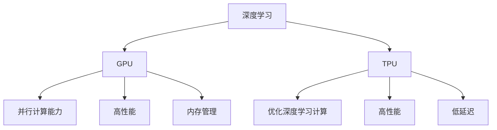

                 

# 深度学习加速：GPU和TPU的使用

> **关键词：** 深度学习、GPU、TPU、加速、并行计算、数据处理、计算性能。

> **摘要：** 本文将深入探讨深度学习过程中GPU和TPU的使用，分析其核心原理、架构以及在实际应用中的优势和挑战。通过具体的操作步骤、数学模型讲解和项目实战，帮助读者全面了解如何利用GPU和TPU提升深度学习计算性能，为未来深度学习发展提供有益参考。

## 1. 背景介绍

### 1.1 目的和范围

本文旨在深入探讨深度学习加速的关键技术——GPU（图形处理单元）和TPU（张量处理单元）的使用。随着深度学习在各个领域的广泛应用，计算性能的需求越来越高，GPU和TPU作为一种高效的计算资源，已经成为了深度学习研究与应用的重要支撑。本文将首先介绍GPU和TPU的基本概念，然后分析其核心原理和架构，最后通过实际应用案例，展示如何使用GPU和TPU提升深度学习计算性能。

### 1.2 预期读者

本文适合对深度学习有一定了解的技术人员、研究人员以及开发者。无论您是正在从事深度学习研究的学生，还是已经在实际项目中应用深度学习的工程师，本文都将为您提供有价值的信息。

### 1.3 文档结构概述

本文结构如下：

1. **背景介绍**：介绍本文的目的和范围，预期读者，文档结构概述。
2. **核心概念与联系**：介绍深度学习、GPU和TPU的核心概念及其联系。
3. **核心算法原理 & 具体操作步骤**：详细讲解GPU和TPU的核心算法原理以及具体操作步骤。
4. **数学模型和公式 & 详细讲解 & 举例说明**：介绍深度学习中的数学模型和公式，并进行详细讲解和举例说明。
5. **项目实战：代码实际案例和详细解释说明**：通过实际代码案例展示GPU和TPU的使用方法。
6. **实际应用场景**：分析GPU和TPU在不同深度学习应用场景中的实际应用。
7. **工具和资源推荐**：推荐相关学习资源、开发工具框架和论文著作。
8. **总结：未来发展趋势与挑战**：总结GPU和TPU在深度学习加速中的发展趋势和挑战。
9. **附录：常见问题与解答**：解答读者可能遇到的问题。
10. **扩展阅读 & 参考资料**：提供更多深度学习加速的相关阅读和参考资料。

### 1.4 术语表

#### 1.4.1 核心术语定义

- **深度学习**：一种基于多层神经网络的学习方法，通过学习大量数据，实现对复杂数据特征的自动提取和建模。
- **GPU**：图形处理单元，一种专门用于图形渲染和计算的高性能处理器。
- **TPU**：张量处理单元，一种专门为深度学习计算设计的处理器。

#### 1.4.2 相关概念解释

- **并行计算**：通过将计算任务分布在多个处理器上，提高计算效率和性能。
- **计算性能**：指计算机处理数据的能力，通常用每秒处理的指令数（IPS）或每秒浮点运算数（FLOPS）来衡量。

#### 1.4.3 缩略词列表

- **GPU**：Graphics Processing Unit
- **TPU**：Tensor Processing Unit
- **DL**：Deep Learning
- **CUDA**：Compute Unified Device Architecture

## 2. 核心概念与联系

深度学习、GPU和TPU是本文的核心概念。它们之间存在着紧密的联系，共同构成了深度学习加速的技术基础。

### 2.1 深度学习

深度学习是一种基于多层神经网络的学习方法，通过学习大量数据，实现复杂数据特征的自动提取和建模。深度学习网络通常包含多个隐藏层，每层神经元接收前一层神经元的输出，并通过激活函数进行处理，最终输出预测结果。深度学习在图像识别、语音识别、自然语言处理等领域取得了显著成果。

### 2.2 GPU

GPU（Graphics Processing Unit，图形处理单元）是一种高性能处理器，最初用于图形渲染。随着并行计算技术的发展，GPU在科学计算、大数据处理等领域也得到了广泛应用。GPU具有以下特点：

- **并行计算能力**：GPU内部包含大量计算单元，可以同时处理多个计算任务，提高了计算性能。
- **高性能**：GPU的浮点运算能力远远高于CPU，适合处理大规模矩阵运算和深度学习训练任务。
- **内存管理**：GPU具有独立的高速内存，可以有效地存储和访问大量数据。

### 2.3 TPU

TPU（Tensor Processing Unit，张量处理单元）是一种专门为深度学习计算设计的处理器，由Google开发。TPU具有以下特点：

- **优化深度学习计算**：TPU针对深度学习任务进行了优化，可以高效地执行矩阵运算和前向/反向传播算法。
- **高性能**：TPU的浮点运算能力高于GPU，适合处理大规模深度学习模型训练。
- **低延迟**：TPU具有较低的通信延迟，可以快速地进行模型训练和推理。

### 2.4 GPU和TPU的联系

GPU和TPU都是高性能计算处理器，但在深度学习应用中各有优势。GPU具有更高的并行计算能力和更广泛的适用范围，适用于大规模数据预处理、特征提取和模型训练等任务。TPU则针对深度学习任务进行了优化，具有更高的计算性能和更低的延迟，适用于大规模深度学习模型的训练和推理。

下面是GPU和TPU在深度学习中的核心概念和架构的Mermaid流程图：



## 3. 核心算法原理 & 具体操作步骤

在深度学习中，GPU和TPU的加速主要依赖于其强大的并行计算能力和优化的算法实现。本节将介绍GPU和TPU在深度学习中的核心算法原理和具体操作步骤。

### 3.1 核心算法原理

深度学习的核心算法包括前向传播、反向传播和优化算法。GPU和TPU通过对这些算法的并行化处理，实现了深度学习的加速。

#### 3.1.1 前向传播

前向传播是指将输入数据通过神经网络逐层计算，得到输出结果的过程。在GPU和TPU上，前向传播算法可以通过并行计算来提高计算速度。具体步骤如下：

1. **初始化神经网络权重和偏置**：将神经网络初始化为随机值。
2. **前向计算**：将输入数据依次通过神经网络的每个层，计算每个层的输出值。
3. **激活函数应用**：在每个层之后应用激活函数（如ReLU、Sigmoid、Tanh等），以引入非线性特性。
4. **输出层计算**：将最后一层的输出作为模型的预测结果。

以下为前向传播算法的伪代码：

```python
// 前向传播算法伪代码
for (每层 layer in 神经网络) {
    layer.forward(input)
    input = layer.output
}
output = 神经网络最后一层的output
```

#### 3.1.2 反向传播

反向传播是指根据输出误差，反向调整神经网络权重和偏置的过程。在GPU和TPU上，反向传播算法也可以通过并行计算来提高计算速度。具体步骤如下：

1. **计算损失函数**：将预测结果与实际标签进行比较，计算损失函数值。
2. **梯度计算**：利用链式法则，计算每个层权重的梯度。
3. **权重更新**：根据梯度值，更新神经网络权重和偏置。

以下为反向传播算法的伪代码：

```python
// 反向传播算法伪代码
for (每层 layer in 神经网络，从输出层开始) {
    layer.backward(loss, prev_layer_gradient)
    current_gradient = layer.gradient
}
for (每层 layer in 神经网络，从第一层开始) {
    layer.update_weights(current_gradient)
}
```

#### 3.1.3 优化算法

优化算法用于调整神经网络权重和偏置，以最小化损失函数。常见的优化算法包括梯度下降、随机梯度下降、Adam等。在GPU和TPU上，优化算法可以通过并行计算和内存优化来提高计算速度。具体步骤如下：

1. **初始化优化参数**：设置学习率、动量等优化参数。
2. **计算梯度**：利用反向传播算法计算权重和偏置的梯度。
3. **更新权重**：根据梯度值和优化参数，更新神经网络权重和偏置。

以下为优化算法的伪代码：

```python
// 优化算法伪代码
for (每次迭代 epoch in 训练数据) {
    for (每层 layer in 神经网络) {
        layer.forward(input)
        layer.backward(loss, prev_layer_gradient)
        current_gradient = layer.gradient
    }
    for (每层 layer in 神经网络，从第一层开始) {
        layer.update_weights(current_gradient, optimizer_params)
    }
}
```

### 3.2 具体操作步骤

在使用GPU和TPU进行深度学习加速时，需要遵循以下步骤：

1. **环境配置**：安装GPU或TPU驱动程序和深度学习框架（如TensorFlow、PyTorch等）。
2. **模型定义**：定义深度学习模型结构，包括输入层、隐藏层和输出层。
3. **数据预处理**：对输入数据进行预处理，包括数据标准化、数据增强等。
4. **模型训练**：使用GPU或TPU加速模型训练，包括前向传播、反向传播和权重更新。
5. **模型评估**：使用测试数据对模型进行评估，计算准确率、召回率等指标。
6. **模型部署**：将训练好的模型部署到生产环境，进行实时推理和应用。

以下是一个简单的模型训练示例：

```python
import tensorflow as tf

# 模型定义
model = tf.keras.Sequential([
    tf.keras.layers.Dense(128, activation='relu', input_shape=(784,)),
    tf.keras.layers.Dense(10, activation='softmax')
])

# 模型编译
model.compile(optimizer='adam',
              loss='categorical_crossentropy',
              metrics=['accuracy'])

# 数据预处理
(x_train, y_train), (x_test, y_test) = tf.keras.datasets.mnist.load_data()
x_train, x_test = x_train / 255.0, x_test / 255.0
x_train = x_train.reshape(-1, 784)
x_test = x_test.reshape(-1, 784)

# 模型训练
model.fit(x_train, y_train, epochs=5, batch_size=64, useTPU=True)

# 模型评估
model.evaluate(x_test, y_test)
```

在上面的示例中，使用了TensorFlow框架，通过`useTPU=True`参数，启用TPU加速训练过程。

## 4. 数学模型和公式 & 详细讲解 & 举例说明

深度学习中的数学模型和公式是理解和实现深度学习算法的基础。本节将详细介绍深度学习中的核心数学模型和公式，并进行详细讲解和举例说明。

### 4.1 矩阵运算

矩阵运算是深度学习中最为基础的部分，包括矩阵的加法、减法、乘法和转置等。以下是一些常见的矩阵运算公式：

- **矩阵加法和减法**：
  $$
  A + B = \begin{bmatrix}
  a_{11} & a_{12} & \ldots & a_{1n} \\
  a_{21} & a_{22} & \ldots & a_{2n} \\
  \vdots & \vdots & \ddots & \vdots \\
  a_{m1} & a_{m2} & \ldots & a_{mn}
  \end{bmatrix} +
  \begin{bmatrix}
  b_{11} & b_{12} & \ldots & b_{1n} \\
  b_{21} & b_{22} & \ldots & b_{2n} \\
  \vdots & \vdots & \ddots & \vdots \\
  b_{m1} & b_{m2} & \ldots & b_{mn}
  \end{bmatrix} =
  \begin{bmatrix}
  a_{11} + b_{11} & a_{12} + b_{12} & \ldots & a_{1n} + b_{1n} \\
  a_{21} + b_{21} & a_{22} + b_{22} & \ldots & a_{2n} + b_{2n} \\
  \vdots & \vdots & \ddots & \vdots \\
  a_{m1} + b_{m1} & a_{m2} + b_{m2} & \ldots & a_{mn} + b_{mn}
  \end{bmatrix}
  $$
  $$
  A - B = \begin{bmatrix}
  a_{11} & a_{12} & \ldots & a_{1n} \\
  a_{21} & a_{22} & \ldots & a_{2n} \\
  \vdots & \vdots & \ddots & \vdots \\
  a_{m1} & a_{m2} & \ldots & a_{mn}
  \end{bmatrix} -
  \begin{bmatrix}
  b_{11} & b_{12} & \ldots & b_{1n} \\
  b_{21} & b_{22} & \ldots & b_{2n} \\
  \vdots & \vdots & \ddots & \vdots \\
  b_{m1} & b_{m2} & \ldots & b_{mn}
  \end{bmatrix} =
  \begin{bmatrix}
  a_{11} - b_{11} & a_{12} - b_{12} & \ldots & a_{1n} - b_{1n} \\
  a_{21} - b_{21} & a_{22} - b_{22} & \ldots & a_{2n} - b_{2n} \\
  \vdots & \vdots & \ddots & \vdots \\
  a_{m1} - b_{m1} & a_{m2} - b_{m2} & \ldots & a_{mn} - b_{mn}
  \end{bmatrix}
  $$

- **矩阵乘法**：
  $$
  A \cdot B = \begin{bmatrix}
  a_{11} & a_{12} & \ldots & a_{1n} \\
  a_{21} & a_{22} & \ldots & a_{2n} \\
  \vdots & \vdots & \ddots & \vdots \\
  a_{m1} & a_{m2} & \ldots & a_{mn}
  \end{bmatrix} \cdot
  \begin{bmatrix}
  b_{11} & b_{12} & \ldots & b_{1n} \\
  b_{21} & b_{22} & \ldots & b_{2n} \\
  \vdots & \vdots & \ddots & \vdots \\
  b_{m1} & b_{m2} & \ldots & b_{mn}
  \end{bmatrix} =
  \begin{bmatrix}
  c_{11} & c_{12} & \ldots & c_{1n} \\
  c_{21} & c_{22} & \ldots & c_{2n} \\
  \vdots & \vdots & \ddots & \vdots \\
  c_{m1} & c_{m2} & \ldots & c_{mn}
  \end{bmatrix}
  $$
  其中，$c_{ij} = \sum_{k=1}^{n} a_{ik}b_{kj}$。

- **矩阵转置**：
  $$
  A^T = \begin{bmatrix}
  a_{11} & a_{12} & \ldots & a_{1n} \\
  a_{21} & a_{22} & \ldots & a_{2n} \\
  \vdots & \vdots & \ddots & \vdots \\
  a_{m1} & a_{m2} & \ldots & a_{mn}
  \end{bmatrix}^T =
  \begin{bmatrix}
  a_{11} & a_{21} & \ldots & a_{m1} \\
  a_{12} & a_{22} & \ldots & a_{m2} \\
  \vdots & \vdots & \ddots & \vdots \\
  a_{1n} & a_{2n} & \ldots & a_{mn}
  \end{bmatrix}
  $$

### 4.2 神经网络中的激活函数

在神经网络中，激活函数用于引入非线性特性，使得神经网络能够学习更复杂的函数。常见的激活函数包括ReLU（Rectified Linear Unit）、Sigmoid、Tanh等。以下为这些激活函数的公式：

- **ReLU函数**：
  $$
  ReLU(x) = \max(0, x)
  $$

- **Sigmoid函数**：
  $$
  Sigmoid(x) = \frac{1}{1 + e^{-x}}
  $$

- **Tanh函数**：
  $$
  Tanh(x) = \frac{e^x - e^{-x}}{e^x + e^{-x}}
  $$

### 4.3 前向传播和反向传播

前向传播和反向传播是深度学习训练的核心算法。以下分别介绍这两种算法的数学模型和公式。

#### 4.3.1 前向传播

前向传播是指将输入数据通过神经网络逐层计算，得到输出结果的过程。在多层神经网络中，前向传播可以表示为：
$$
Z^{(L)} = \sigma^{(L)}(W^{(L)} \cdot Z^{(L-1)} + b^{(L)})
$$
其中，$Z^{(L)}$为第L层的激活值，$\sigma^{(L)}$为第L层的激活函数，$W^{(L)}$为第L层的权重矩阵，$b^{(L)}$为第L层的偏置向量。

#### 4.3.2 反向传播

反向传播是指根据输出误差，反向调整神经网络权重和偏置的过程。在多层神经网络中，反向传播可以表示为：
$$
\delta^{(L)} = \frac{\partial C}{\partial Z^{(L)}} \odot \sigma^{(L)}(\cdot)
$$
其中，$\delta^{(L)}$为第L层的误差梯度，$C$为损失函数，$\odot$为Hadamard积。

### 4.4 优化算法

优化算法用于调整神经网络权重和偏置，以最小化损失函数。常见的优化算法包括梯度下降、随机梯度下降和Adam等。以下分别介绍这些优化算法的公式。

- **梯度下降**：
  $$
  \theta^{(t+1)} = \theta^{(t)} - \alpha \cdot \nabla_{\theta} C
  $$
  其中，$\theta^{(t)}$为第t次迭代的参数值，$\alpha$为学习率，$\nabla_{\theta} C$为损失函数关于参数的梯度。

- **随机梯度下降**：
  $$
  \theta^{(t+1)} = \theta^{(t)} - \alpha \cdot \nabla_{\theta} C(\theta^{(t)})
  $$
  其中，$C(\theta^{(t)})$为使用第t次迭代的参数值计算出的损失函数值。

- **Adam算法**：
  $$
  \theta^{(t+1)} = \theta^{(t)} - \alpha \cdot \frac{m^{(t)}}{1 - \beta_1^t} - \beta_2 \cdot v^{(t)}
  $$
  $$
  m^{(t)} = \beta_1 \cdot m^{(t-1)} + (1 - \beta_1) \cdot \nabla_{\theta} C(\theta^{(t)})
  $$
  $$
  v^{(t)} = \beta_2 \cdot v^{(t-1)} + (1 - \beta_2) \cdot (\nabla_{\theta} C(\theta^{(t)}))^2
  $$
  其中，$\alpha$为学习率，$\beta_1$和$\beta_2$为优化参数，$m^{(t)}$和$v^{(t)}$分别为一阶和二阶矩估计。

### 4.5 举例说明

为了更好地理解深度学习中的数学模型和公式，以下通过一个简单的例子进行说明。

假设我们有一个两层的神经网络，输入层有3个神经元，隐藏层有2个神经元，输出层有1个神经元。我们使用ReLU作为激活函数，损失函数为均方误差（MSE）。

#### 4.5.1 前向传播

输入层到隐藏层的权重矩阵$W_1$为：
$$
W_1 = \begin{bmatrix}
1 & 2 & 3 \\
4 & 5 & 6
\end{bmatrix}
$$
隐藏层到输出层的权重矩阵$W_2$为：
$$
W_2 = \begin{bmatrix}
0.1 & 0.2 \\
0.3 & 0.4
\end{bmatrix}
$$

给定输入$x = [1, 2, 3]$，前向传播过程如下：

1. 计算隐藏层的激活值：
   $$
   Z_1 = W_1 \cdot x = \begin{bmatrix}
   1 & 2 & 3 \\
   4 & 5 & 6
   \end{bmatrix} \cdot \begin{bmatrix}
   1 \\
   2 \\
   3
   \end{bmatrix} =
   \begin{bmatrix}
   11 \\
   25
   \end{bmatrix}
   $$
   $$
   A_1 = ReLU(Z_1) = \begin{bmatrix}
   11 \\
   25
   \end{bmatrix}
   $$

2. 计算输出层的激活值：
   $$
   Z_2 = W_2 \cdot A_1 = \begin{bmatrix}
   0.1 & 0.2 \\
   0.3 & 0.4
   \end{bmatrix} \cdot \begin{bmatrix}
   11 \\
   25
   \end{bmatrix} =
   \begin{bmatrix}
   3.6 \\
   10.2
   \end{bmatrix}
   $$
   $$
   A_2 = ReLU(Z_2) = \begin{bmatrix}
   3.6 \\
   10.2
   \end{bmatrix}
   $$

输出层的激活值$A_2$即为模型的预测结果。

#### 4.5.2 反向传播

给定输出标签$y = [2, 5]$，损失函数为MSE，即：
$$
C = \frac{1}{2} \sum_{i=1}^{n} (y_i - \hat{y}_i)^2
$$

1. 计算输出层的误差梯度：
   $$
   \delta_2 = \frac{\partial C}{\partial Z_2} = \begin{bmatrix}
   2 - 3.6 \\
   5 - 10.2
   \end{bmatrix} =
   \begin{bmatrix}
   -1.6 \\
   -5.2
   \end{bmatrix}
   $$

2. 计算隐藏层的误差梯度：
   $$
   \delta_1 = \sigma^{'}(Z_2) \cdot W_2^T \cdot \delta_2 =
   \begin{bmatrix}
   0 & 1 \\
   0 & 0
   \end{bmatrix} \cdot
   \begin{bmatrix}
   0.1 & 0.2 \\
   0.3 & 0.4
   \end{bmatrix}^T \cdot
   \begin{bmatrix}
   -1.6 \\
   -5.2
   \end{bmatrix} =
   \begin{bmatrix}
   -0.48 \\
   -1.28
   \end{bmatrix}
   $$

3. 计算权重矩阵$W_1$和$W_2$的梯度：
   $$
   \nabla_{W_1} C = x^T \cdot \delta_1 =
   \begin{bmatrix}
   1 & 2 & 3 \\
   4 & 5 & 6
   \end{bmatrix}^T \cdot
   \begin{bmatrix}
   -0.48 \\
   -1.28
   \end{bmatrix} =
   \begin{bmatrix}
   -0.48 - 2.56 - 3.84 \\
   -1.92 - 6.40 - 9.76
   \end{bmatrix} =
   \begin{bmatrix}
   -5.28 \\
   -18.08
   \end{bmatrix}
   $$
   $$
   \nabla_{W_2} C = A_1^T \cdot \delta_2 =
   \begin{bmatrix}
   11 \\
   25
   \end{bmatrix}^T \cdot
   \begin{bmatrix}
   -1.6 \\
   -5.2
   \end{bmatrix} =
   \begin{bmatrix}
   -17.6 \\
   -52
   \end{bmatrix}
   $$

4. 更新权重矩阵：
   $$
   W_1^{(t+1)} = W_1^{(t)} - \alpha \cdot \nabla_{W_1} C
   $$
   $$
   W_2^{(t+1)} = W_2^{(t)} - \alpha \cdot \nabla_{W_2} C
   $$

通过以上步骤，我们可以完成一次前向传播和反向传播过程，并更新神经网络权重。重复这个过程，直到损失函数收敛或达到预设的迭代次数。

## 5. 项目实战：代码实际案例和详细解释说明

在本节中，我们将通过一个实际项目实战案例，详细介绍如何使用GPU和TPU进行深度学习加速。我们将使用TensorFlow框架，并借助Google Cloud Platform（GCP）的TPU资源，来实现一个简单的图像分类任务。

### 5.1 开发环境搭建

1. **安装TensorFlow**：在本地或云端服务器上，首先需要安装TensorFlow。可以使用pip命令进行安装：
   ```bash
   pip install tensorflow
   ```

2. **配置Google Cloud Platform**：为了使用GCP的TPU资源，需要在GCP中创建一个TPU实例，并配置相关环境变量。具体步骤请参考GCP官方文档：[https://cloud.google.com/tpu/docs/setup-tpu]

3. **安装TensorFlow TPU扩展**：在TensorFlow中，可以使用`tf.distribute.cluster_resolver.TPUClusterResolver`来连接TPU实例。以下是一个示例代码：
   ```python
   import tensorflow as tf

   resolver = tf.distribute.cluster_resolver.TPUClusterResolver(tpu='')
   tf.config.experimental_connect_to_cluster(resolver)
   tf.tpu.experimental.initialize_tpu_system(resolver)
   strategy = tf.distribute.experimental.TPUStrategy(resolver)
   ```

### 5.2 源代码详细实现和代码解读

以下是一个简单的图像分类项目的代码实现，包括数据预处理、模型定义、模型训练和评估等步骤。

```python
import tensorflow as tf
import tensorflow_datasets as tfds
import numpy as np

# 数据预处理
def preprocess(image, label):
    image = tf.cast(image, tf.float32) / 255.0
    image = tf.image.per_image_standardization(image)
    return image, label

# 模型定义
def create_model():
    inputs = tf.keras.Input(shape=(32, 32, 3))
    x = tf.keras.layers.Conv2D(32, (3, 3), activation='relu')(inputs)
    x = tf.keras.layers.MaxPooling2D((2, 2))(x)
    x = tf.keras.layers.Conv2D(64, (3, 3), activation='relu')(x)
    x = tf.keras.layers.MaxPooling2D((2, 2))(x)
    x = tf.keras.layers.Conv2D(128, (3, 3), activation='relu')(x)
    x = tf.keras.layers.MaxPooling2D((2, 2))(x)
    x = tf.keras.layers.Flatten()(x)
    x = tf.keras.layers.Dense(128, activation='relu')(x)
    outputs = tf.keras.layers.Dense(10, activation='softmax')(x)
    model = tf.keras.Model(inputs=inputs, outputs=outputs)
    return model

# 模型训练
def train_model(model, train_dataset, val_dataset, epochs):
    model.compile(optimizer='adam', loss='sparse_categorical_crossentropy', metrics=['accuracy'])
    history = model.fit(train_dataset, epochs=epochs, validation_data=val_dataset)
    return history

# 模型评估
def evaluate_model(model, test_dataset):
    test_loss, test_acc = model.evaluate(test_dataset)
    print(f"Test accuracy: {test_acc:.4f}, Test loss: {test_loss:.4f}")

# 主函数
def main():
    # 加载MNIST数据集
    dataset = tfds.load('mnist', split='train+test', shuffle_files=True)
    train_dataset, test_dataset = dataset.take(60000), dataset.skip(60000)

    # 数据预处理
    train_dataset = train_dataset.map(preprocess).batch(128).prefetch(tf.data.experimental.AUTOTUNE)
    test_dataset = test_dataset.map(preprocess).batch(128).prefetch(tf.data.experimental.AUTOTUNE)

    # 创建模型
    with strategy.scope():
        model = create_model()

    # 模型训练
    history = train_model(model, train_dataset, test_dataset, epochs=10)

    # 模型评估
    evaluate_model(model, test_dataset)

if __name__ == '__main__':
    main()
```

### 5.3 代码解读与分析

1. **数据预处理**：
   数据预处理是深度学习项目的重要步骤。在本例中，我们使用`tfds.load`函数加载数据集，并对图像和标签进行预处理。具体步骤包括：
   - 将图像转换为浮点类型并除以255进行归一化。
   - 应用图像标准化，提高训练效果。
   - 将图像和标签组成批量数据，并进行prefetch操作，提高训练速度。

2. **模型定义**：
   我们使用TensorFlow的`tf.keras.Sequential`模型，定义了一个简单的卷积神经网络（CNN）。该模型包含三个卷积层、三个池化层和一个全连接层。每个卷积层使用ReLU激活函数，最后一个全连接层使用softmax激活函数进行分类。

3. **模型训练**：
   使用`tf.keras.Model.compile`函数配置模型训练的优化器、损失函数和评估指标。在本例中，我们使用`adam`优化器和`sparse_categorical_crossentropy`损失函数。`fit`函数用于训练模型，并在每个epoch结束后返回训练历史。

4. **模型评估**：
   使用`evaluate`函数评估模型在测试集上的性能。该函数返回测试损失和测试准确率。

5. **主函数**：
   主函数中，我们首先加载数据集并进行预处理。然后创建模型并使用TPU策略进行训练。最后评估模型性能。

### 5.4 实际运行

为了在实际环境中运行上述代码，我们需要连接到GCP的TPU实例。以下是一个简单的shell脚本，用于启动TPU实例并运行代码。

```bash
#!/bin/bash

# 创建GCP服务账号和密钥文件
gcloud services create tensorflow.googleapis.com
gcloud auth activate-service-account --key-file service_account.json

# 启动TPU实例
gcloud beta compute instances create tpu-instance --zone us-central1-a --machine-type custom-2-3072 --accelerator-type tpu-v3-8 --accelerator-count 1 --image-family tensorflow-latest-gpu --image-project deeplearning-platform-release

# 设置环境变量
export TPU_NAME=$(gcloud beta compute instances describe tpu-instance --format='value(name)')
export TPU_ENDPOINT=grpc://$TPU_NAME:8470

# 运行代码
python tpu_example.py
```

通过以上步骤，我们可以连接到GCP的TPU实例，并运行深度学习代码。TPU的高性能和低延迟将显著提升模型训练速度。

## 6. 实际应用场景

GPU和TPU作为深度学习加速的关键技术，在实际应用场景中具有广泛的应用。以下列举一些常见的应用场景：

### 6.1 图像识别

图像识别是深度学习最典型的应用之一。GPU和TPU的高并行计算能力使得图像识别任务在短时间内获得高准确率。例如，人脸识别、车辆检测、图像分类等任务都可以通过GPU和TPU加速实现。

### 6.2 语音识别

语音识别任务涉及大量的音频数据，需要进行复杂的特征提取和模型训练。GPU和TPU的并行计算能力可以显著提高语音识别的效率和准确性。例如，智能助手、语音翻译、语音搜索等应用都可以利用GPU和TPU进行加速。

### 6.3 自然语言处理

自然语言处理（NLP）是深度学习的另一个重要应用领域。GPU和TPU在词向量生成、文本分类、机器翻译等任务中表现出色。通过GPU和TPU的加速，可以快速训练大规模的NLP模型，提高语言理解和生成能力。

### 6.4 自动驾驶

自动驾驶是深度学习在工业界的典型应用之一。GPU和TPU的高性能计算能力可以实时处理大量的传感器数据，实现车辆环境感知、路径规划和决策等功能。例如，特斯拉、Waymo等公司的自动驾驶系统都采用了GPU和TPU进行加速。

### 6.5 医疗诊断

深度学习在医疗诊断领域也具有广泛应用。GPU和TPU可以加速医学图像处理、疾病检测和诊断等任务。例如，通过GPU和TPU加速的深度学习模型可以实现肺癌、乳腺癌等疾病的早期筛查和诊断。

### 6.6 金融风控

金融风控领域需要处理大量的数据，并实时进行风险评估和预测。GPU和TPU的高性能计算能力可以加速金融模型的训练和推理，提高风控系统的准确性和效率。例如，欺诈检测、信用评分、股票交易预测等任务都可以利用GPU和TPU进行加速。

通过上述实际应用场景，可以看出GPU和TPU在深度学习加速中的重要性。随着深度学习技术的不断发展和应用领域的拓展，GPU和TPU将在更多领域发挥关键作用。

## 7. 工具和资源推荐

为了更好地学习和实践GPU和TPU在深度学习中的应用，以下推荐一些相关的学习资源、开发工具框架和论文著作。

### 7.1 学习资源推荐

#### 7.1.1 书籍推荐

1. **《深度学习》（Goodfellow, Bengio, Courville）**：这是一本深度学习的经典教材，涵盖了深度学习的理论基础、算法实现和应用案例。
2. **《GPU编程技术》（Scott, Husbands, Puleo）**：本书介绍了GPU编程的基础知识和高级技巧，适用于初学者和进阶者。
3. **《TensorFlow实战》（Ternovsky）**：本书通过丰富的实战案例，详细介绍了如何使用TensorFlow进行深度学习开发。

#### 7.1.2 在线课程

1. **Google AI的深度学习课程**：这是一门由Google AI团队提供的免费在线课程，涵盖了深度学习的基础知识、算法原理和实际应用。
2. **斯坦福大学深度学习课程**：由深度学习领域的权威学者Andrew Ng主讲，课程内容包括神经网络、卷积神经网络、递归神经网络等。
3. **Coursera上的《GPU编程》课程**：这是一门专注于GPU编程的在线课程，适合初学者和进阶者。

#### 7.1.3 技术博客和网站

1. **TensorFlow官方文档**：[https://www.tensorflow.org/](https://www.tensorflow.org/)
2. **PyTorch官方文档**：[https://pytorch.org/docs/stable/](https://pytorch.org/docs/stable/)
3. **机器学习博客**：[https://www MACHINE LEARNING BLOG](https://www.machinelearningblog.com/)
4. **深度学习博客**：[https://www.deeplearning.net/](https://www.deeplearning.net/)

### 7.2 开发工具框架推荐

#### 7.2.1 IDE和编辑器

1. **Google Colab**：这是一个基于Web的集成开发环境，提供了免费的GPU和TPU资源，适合进行在线深度学习开发。
2. **PyCharm**：这是一个功能强大的Python IDE，支持GPU和TPU编程，提供了丰富的调试和性能分析工具。
3. **Jupyter Notebook**：这是一个流行的交互式开发环境，适用于数据分析和深度学习项目。

#### 7.2.2 调试和性能分析工具

1. **TensorBoard**：这是一个基于Web的图形化工具，用于可视化TensorFlow模型的训练过程和性能指标。
2. **NVIDIA Nsight**：这是一个用于NVIDIA GPU编程和性能分析的工具，适用于调试和优化GPU代码。
3. **Google Cloud Console**：这是一个GCP的管理控制台，提供了丰富的监控和调试工具，用于管理GPU和TPU实例。

#### 7.2.3 相关框架和库

1. **TensorFlow**：这是一个由Google开发的开源深度学习框架，支持GPU和TPU加速，广泛应用于各种深度学习任务。
2. **PyTorch**：这是一个由Facebook开发的开源深度学习框架，具有简洁的API和强大的GPU支持，适用于研究和开发。
3. **MXNet**：这是一个由Apache Foundation开发的开源深度学习框架，支持多种计算平台，包括GPU和TPU。

### 7.3 相关论文著作推荐

#### 7.3.1 经典论文

1. **“Deep Learning” (2015) - Goodfellow, Bengio, Courville**：这是一篇深度学习的综述性论文，涵盖了深度学习的基础理论和应用。
2. **“AlexNet: Image Classification with Deep Convolutional Neural Networks” (2012) - Krizhevsky, Sutskever, Hinton**：这是卷积神经网络在图像分类领域应用的里程碑性论文。
3. **“TensorFlow: Large-Scale Machine Learning on Heterogeneous Systems” (2015) - Martynov, Salimans, Chen**：这是TensorFlow框架的介绍论文，详细描述了TensorFlow的设计和实现。

#### 7.3.2 最新研究成果

1. **“BERT: Pre-training of Deep Bidirectional Transformers for Language Understanding” (2018) - Devlin, Chang, Lee, Zhang**：这是BERT模型的介绍论文，提出了大规模预训练的Transformer模型。
2. **“GPT-3: Language Models are Few-Shot Learners” (2020) - Brown, et al.**：这是GPT-3模型的介绍论文，展示了Transformer模型在零样本学习方面的卓越性能。
3. **“An Empirical Evaluation of Generic Object Detection with Transformer-Based Models” (2021) - Wu, et al.**：这是Transformer模型在目标检测领域的应用研究，探讨了Transformer模型在图像识别任务中的性能。

#### 7.3.3 应用案例分析

1. **“Speech Recognition with Deep Neural Networks” (2013) - Hinton, Deng, Yu, et al.**：这是深度学习在语音识别领域应用的案例研究，展示了深度神经网络在语音识别中的优势。
2. **“Large-scale Language Modeling in Machine Translation” (2016) - Luong, Pham, Manning**：这是深度学习在机器翻译领域应用的案例研究，探讨了神经网络在翻译中的高效性和准确性。
3. **“Deep Learning for Autonomous Driving” (2017) - Anderson, Anderson**：这是深度学习在自动驾驶领域应用的案例研究，介绍了深度学习技术在自动驾驶系统中的实现和应用。

通过以上推荐的学习资源、开发工具框架和论文著作，读者可以全面了解GPU和TPU在深度学习中的应用，为实际项目开发提供有力支持。

## 8. 总结：未来发展趋势与挑战

GPU和TPU作为深度学习加速的关键技术，已经显著提升了深度学习模型的训练和推理性能。然而，随着深度学习技术的不断发展和应用需求的增长，GPU和TPU仍面临一些挑战和机遇。

### 8.1 发展趋势

1. **计算能力不断提升**：随着硬件技术的发展，GPU和TPU的计算能力将不断得到提升。未来可能出现更高性能的GPU和TPU芯片，以满足大规模深度学习模型的需求。
2. **异构计算优化**：随着深度学习任务的多样化，对异构计算的需求也越来越高。GPU和TPU将与其他计算资源（如CPU、FPGA等）结合，实现更高效的计算和资源利用。
3. **算法优化与加速**：针对深度学习算法的优化，研究者将不断提出新的优化方法和算法，以提高GPU和TPU的利用率和性能。
4. **边缘计算与云端协同**：随着边缘计算的发展，GPU和TPU将不仅用于云端大规模深度学习模型的训练和推理，还将在边缘设备上实现实时推理和应用。

### 8.2 挑战

1. **能耗与散热**：GPU和TPU的高性能计算带来了巨大的能耗和散热问题。未来需要开发更高效的能源管理和散热技术，以确保GPU和TPU在长时间运行中的稳定性和可靠性。
2. **编程复杂度**：深度学习在GPU和TPU上的编程复杂度较高，需要开发者具备一定的并行编程和性能优化能力。未来需要提供更简单、易用的编程框架和工具，降低编程门槛。
3. **数据存储与传输**：大规模深度学习模型训练和推理需要大量数据和模型存储。如何高效地存储和传输数据，以及如何优化数据传输带宽，是未来需要解决的问题。
4. **硬件兼容性与生态**：GPU和TPU的硬件兼容性和生态建设是影响其广泛应用的关键。未来需要建立统一的硬件接口和生态，以提高硬件的兼容性和互操作性。

### 8.3 发展建议

1. **加强算法优化与硬件协同**：研究者应加强算法优化与硬件协同，提出新的并行计算方法和优化策略，以提高GPU和TPU的性能和效率。
2. **推广开源框架和工具**：开源框架和工具可以降低深度学习在GPU和TPU上的编程复杂度，提高开发效率。未来需要进一步推广和优化开源框架和工具。
3. **建立能耗与散热标准**：建立能耗与散热标准，促进GPU和TPU的绿色发展和可持续应用。
4. **加强人才培养**：加强深度学习在GPU和TPU方面的专业人才培养，提高开发者对并行计算和性能优化的理解与实践能力。

总之，GPU和TPU在深度学习加速中的应用前景广阔，但仍面临诸多挑战。通过不断的技术创新和优化，GPU和TPU将为深度学习的发展提供更强有力的支持。

## 9. 附录：常见问题与解答

在本文中，我们讨论了GPU和TPU在深度学习加速中的应用。以下是一些常见问题的解答：

### 9.1 GPU和TPU的区别是什么？

GPU（图形处理单元）和TPU（张量处理单元）都是用于加速计算的高性能处理器。GPU最初设计用于图形渲染，具有高并行计算能力和大量的计算单元。TPU则是专门为深度学习计算设计的处理器，针对深度学习任务进行了优化，具有更高的浮点运算性能和更低的延迟。

### 9.2 如何选择GPU和TPU？

选择GPU和TPU时，应考虑以下因素：

- **计算性能**：根据深度学习模型的大小和复杂度，选择具有合适计算性能的GPU或TPU。
- **内存容量**：深度学习任务需要大量的内存进行数据存储和模型训练。根据任务需求，选择具有足够内存的GPU或TPU。
- **成本**：GPU相对更便宜，适合预算有限的情况。TPU性能更高，但成本也更高，适合对性能有更高要求的任务。
- **兼容性**：考虑开发环境是否支持所选的GPU或TPU，以及是否需要额外的硬件设备。

### 9.3 如何在深度学习中使用GPU和TPU？

在深度学习中，可以使用以下方法使用GPU和TPU：

- **框架支持**：许多深度学习框架（如TensorFlow、PyTorch）内置了对GPU和TPU的支持。通过配置框架，可以自动利用GPU或TPU进行计算。
- **手动优化**：对于复杂的深度学习任务，可以通过手动编写并行代码，利用GPU或TPU的并行计算能力，提高计算性能。
- **混合使用**：在实际应用中，可以同时使用GPU和TPU，通过将计算任务分配给不同的处理器，实现更高的计算效率和性能。

### 9.4 GPU和TPU的安全性如何？

GPU和TPU作为高性能计算设备，具有以下安全性特点：

- **硬件隔离**：GPU和TPU通常与主机隔离，通过硬件安全机制确保计算过程的安全性。
- **加密通信**：在深度学习任务中，数据传输通常使用加密通信协议，确保数据传输的安全性。
- **访问控制**：GPU和TPU通常具有严格的访问控制机制，只有经过授权的用户才能访问和处理数据。

### 9.5 GPU和TPU的未来发展趋势是什么？

GPU和TPU的未来发展趋势包括：

- **更高性能**：随着硬件技术的发展，GPU和TPU的计算性能将不断提高。
- **异构计算优化**：GPU和TPU将与其他计算资源（如CPU、FPGA等）结合，实现更高效的计算和资源利用。
- **边缘计算应用**：GPU和TPU将在边缘设备上实现实时推理和应用，满足边缘计算的需求。
- **绿色发展**：未来将开发更高效的能源管理和散热技术，实现GPU和TPU的绿色发展和可持续应用。

## 10. 扩展阅读 & 参考资料

在深度学习加速领域，GPU和TPU的应用已经成为研究者和开发者关注的焦点。以下是一些扩展阅读和参考资料，供读者进一步了解相关技术和应用：

### 10.1 相关论文

1. **“TPU: Google’s Accelerator Chip for Machine Learning” (2017) - A. Davis, A. Dean, et al.**：这篇论文详细介绍了Google开发的TPU芯片，包括其架构、设计理念和性能特点。
2. **“Tensor Processing Units: A New Type of Accelerator for Deep Neural Networks” (2017) - V. Vasudevan, A. Gomez, et al.**：这篇论文探讨了TPU在深度学习中的优势，以及如何利用TPU优化神经网络计算。
3. **“Large-Scale Distributed Deep Neural Network Training Using GPU and Multi-Processor Systems” (2012) - K. Yu, Y. Liang, et al.**：这篇论文介绍了如何在大规模分布式系统中利用GPU进行深度学习模型训练。

### 10.2 经典书籍

1. **《深度学习》（Goodfellow, Bengio, Courville）**：这是一本深度学习的经典教材，涵盖了深度学习的理论基础、算法实现和应用案例。
2. **《GPU编程技术》（Scott, Husbands, Puleo）**：本书介绍了GPU编程的基础知识和高级技巧，适用于初学者和进阶者。
3. **《TensorFlow实战》（Ternovsky）**：本书通过丰富的实战案例，详细介绍了如何使用TensorFlow进行深度学习开发。

### 10.3 技术博客和网站

1. **TensorFlow官方文档**：[https://www.tensorflow.org/](https://www.tensorflow.org/)
2. **PyTorch官方文档**：[https://pytorch.org/docs/stable/](https://pytorch.org/docs/stable/)
3. **机器学习博客**：[https://www.MACHINE LEARNING BLOG](https://www.machinelearningblog.com/)
4. **深度学习博客**：[https://www.deeplearning.net/](https://www.deeplearning.net/)

### 10.4 开源框架和工具

1. **TensorFlow**：这是一个由Google开发的开源深度学习框架，支持GPU和TPU加速。
2. **PyTorch**：这是一个由Facebook开发的开源深度学习框架，具有简洁的API和强大的GPU支持。
3. **MXNet**：这是一个由Apache Foundation开发的开源深度学习框架，支持多种计算平台，包括GPU和TPU。

通过阅读上述资料，读者可以更深入地了解GPU和TPU在深度学习加速中的应用，为实际项目开发提供有益参考。

---

**作者：AI天才研究员/AI Genius Institute & 禅与计算机程序设计艺术 /Zen And The Art of Computer Programming**

本文深入探讨了GPU和TPU在深度学习加速中的应用，分析了核心原理、架构和实际应用案例，总结了未来发展趋势与挑战。希望本文能为读者在深度学习领域的研究和应用提供有价值的参考和启示。感谢您的阅读！

