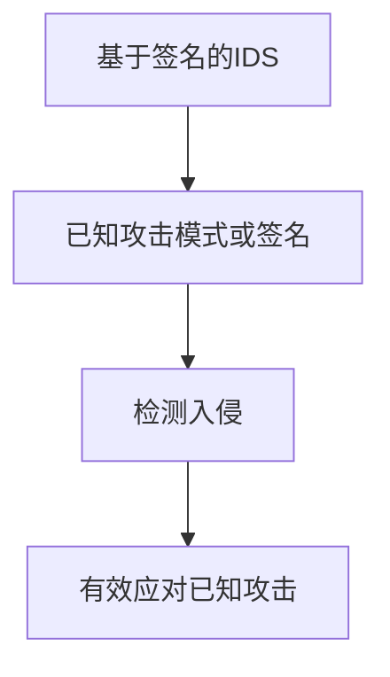
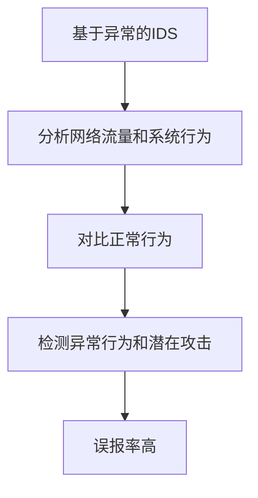
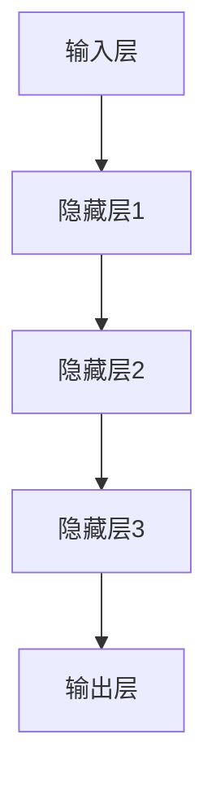
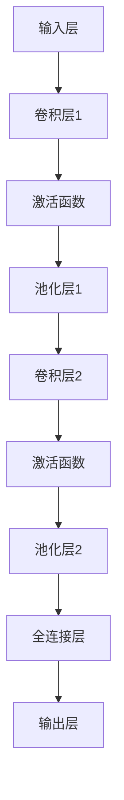
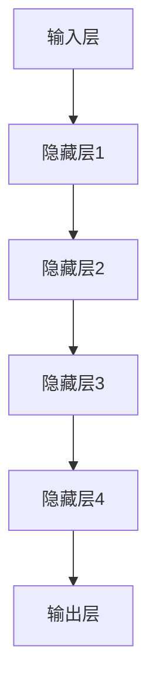
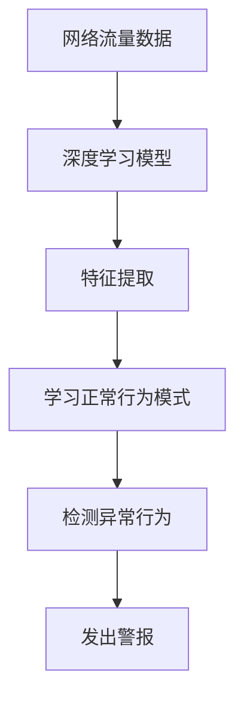

                 

# 深度学习在入侵检测系统中的应用

> 关键词：深度学习、入侵检测、网络安全、异常检测、特征工程、神经网络架构

> 摘要：本文将深入探讨深度学习在入侵检测系统（IDS）中的应用。首先，我们将简要介绍入侵检测系统的背景和重要性，随后详细解释深度学习的基本原理和架构。接下来，我们将展示如何将深度学习应用于入侵检测，并通过具体案例讲解其操作步骤和数学模型。文章还将分享实际项目实战经验，分析应用场景，并推荐相关学习资源和开发工具。最后，我们将总结未来发展趋势与挑战。

## 1. 背景介绍

### 1.1 目的和范围

本文旨在探讨深度学习在入侵检测系统（IDS）中的应用。我们将首先介绍入侵检测系统的背景和重要性，然后深入解析深度学习的基本概念和架构。接着，我们将讨论如何将深度学习应用于入侵检测，并通过实际案例展示其操作步骤和数学模型。此外，文章还将探讨入侵检测系统的实际应用场景，并推荐相关的学习资源和开发工具。

### 1.2 预期读者

本文面向对入侵检测系统和深度学习有一定了解的读者。希望本文能够帮助读者更好地理解深度学习在入侵检测系统中的应用，为实际项目提供指导。

### 1.3 文档结构概述

本文分为以下几个部分：

1. 背景介绍：介绍入侵检测系统的背景、深度学习的基本概念和应用。
2. 核心概念与联系：通过Mermaid流程图展示核心概念和架构。
3. 核心算法原理 & 具体操作步骤：详细讲解深度学习算法原理和操作步骤。
4. 数学模型和公式 & 详细讲解 & 举例说明：介绍深度学习中的数学模型和公式。
5. 项目实战：代码实际案例和详细解释说明。
6. 实际应用场景：讨论深度学习在入侵检测系统中的应用场景。
7. 工具和资源推荐：推荐学习资源、开发工具和框架。
8. 总结：未来发展趋势与挑战。
9. 附录：常见问题与解答。
10. 扩展阅读 & 参考资料：提供进一步学习的资源。

### 1.4 术语表

#### 1.4.1 核心术语定义

- 入侵检测系统（IDS）：一种能够识别网络或系统中潜在安全威胁的监控系统。
- 深度学习：一种基于多层神经网络的机器学习技术，能够自动从数据中学习特征和模式。
- 特征工程：从原始数据中提取有助于模型训练的特征的过程。
- 神经网络：由一系列相互连接的神经元组成的计算模型。

#### 1.4.2 相关概念解释

- 异常检测：检测数据中异常或异常模式的过程。
- 网络安全：保护计算机网络免受未经授权的访问、攻击和破坏的措施。
- 模型训练：通过输入数据训练神经网络模型，使其能够识别和预测特定模式。

#### 1.4.3 缩略词列表

- IDS：入侵检测系统
- AI：人工智能
- ML：机器学习
- DL：深度学习
- DNN：深度神经网络
- CNN：卷积神经网络
- RNN：循环神经网络

## 2. 核心概念与联系

在深入了解深度学习在入侵检测系统中的应用之前，我们首先需要理解一些核心概念和其相互关系。

### 2.1 入侵检测系统

入侵检测系统（IDS）是一种网络安全技术，用于监控网络流量和系统活动，以识别潜在的攻击和异常行为。IDS可以分类为基于签名的IDS（Signature-based IDS）和基于异常的IDS（Anomaly-based IDS）。

#### 基于签名的IDS

基于签名的IDS通过匹配已知的攻击模式或签名来检测入侵。这种方法在检测已知攻击方面非常有效，但无法检测新的或未知的攻击。



#### 基于异常的IDS

基于异常的IDS通过分析网络流量和系统行为，与正常行为进行对比，以检测异常行为和潜在攻击。这种方法能够检测新的或未知的攻击，但可能存在较高的误报率。



### 2.2 深度学习

深度学习是一种基于多层神经网络的机器学习技术，能够自动从数据中学习特征和模式。深度学习在图像识别、自然语言处理和语音识别等领域取得了显著成果。

#### 深度神经网络（DNN）

深度神经网络是一种由多个隐藏层组成的神经网络。每个隐藏层都包含多个神经元，用于提取数据中的高层次特征。



#### 卷积神经网络（CNN）

卷积神经网络是一种特别适用于图像识别的深度学习模型，通过卷积操作提取图像中的局部特征。



#### 循环神经网络（RNN）

循环神经网络是一种能够处理序列数据的深度学习模型，通过循环连接实现记忆功能。



### 2.3 深度学习与入侵检测系统的联系

深度学习可以应用于入侵检测系统，以实现基于异常的入侵检测。通过将网络流量数据输入到深度学习模型中，模型可以自动提取特征并学习正常行为模式。当检测到异常行为时，模型会发出警报。



## 3. 核心算法原理 & 具体操作步骤

### 3.1 算法原理

深度学习在入侵检测系统中的应用主要通过以下步骤实现：

1. 数据采集：收集网络流量数据，包括正常和异常流量。
2. 特征工程：提取数据中的特征，如数据包大小、源IP地址、目标IP地址等。
3. 模型训练：使用训练数据集训练深度学习模型，使其能够识别正常和异常行为。
4. 模型评估：使用测试数据集评估模型的性能，包括准确率、召回率和F1分数等指标。
5. 模型部署：将训练好的模型部署到入侵检测系统中，用于实时检测和警报。

### 3.2 具体操作步骤

以下是使用深度学习进行入侵检测的具体操作步骤：

#### 步骤1：数据采集

收集网络流量数据，包括正常和异常流量。可以使用网络流量捕获工具，如Wireshark，或通过入侵检测系统（如Snort）收集数据。

```bash
# 使用Wireshark捕获网络流量
wireshark -i eth0 -w capture.pcap
```

#### 步骤2：特征工程

提取数据中的特征，如数据包大小、源IP地址、目标IP地址、协议类型、数据包传输时间等。可以使用Python中的Pandas库进行数据预处理。

```python
import pandas as pd

# 读取网络流量数据
data = pd.read_csv('capture.pcap')

# 提取特征
features = data[['packet_size', 'source_ip', 'destination_ip', 'protocol', 'transmission_time']]
```

#### 步骤3：模型训练

使用训练数据集训练深度学习模型，如卷积神经网络（CNN）或循环神经网络（RNN）。可以使用TensorFlow或PyTorch等深度学习框架。

```python
import tensorflow as tf

# 加载训练数据
train_data = ...

# 构建模型
model = tf.keras.Sequential([
    tf.keras.layers.Dense(units=128, activation='relu', input_shape=(128,)),
    tf.keras.layers.Dense(units=64, activation='relu'),
    tf.keras.layers.Dense(units=1, activation='sigmoid')
])

# 编译模型
model.compile(optimizer='adam', loss='binary_crossentropy', metrics=['accuracy'])

# 训练模型
model.fit(train_data, epochs=10, batch_size=32)
```

#### 步骤4：模型评估

使用测试数据集评估模型的性能，包括准确率、召回率和F1分数等指标。

```python
import sklearn.metrics as metrics

# 加载测试数据
test_data = ...

# 预测测试数据
predictions = model.predict(test_data)

# 计算性能指标
accuracy = metrics.accuracy_score(test_labels, predictions)
recall = metrics.recall_score(test_labels, predictions)
f1_score = 2 * (accuracy * recall) / (accuracy + recall)

print("Accuracy:", accuracy)
print("Recall:", recall)
print("F1 Score:", f1_score)
```

#### 步骤5：模型部署

将训练好的模型部署到入侵检测系统中，用于实时检测和警报。

```python
# 部署模型
model.save('invasion_detection_model.h5')

# 加载模型
loaded_model = tf.keras.models.load_model('invasion_detection_model.h5')

# 实时检测和警报
while True:
    # 读取网络流量数据
    new_data = ...

    # 预测网络流量数据
    prediction = loaded_model.predict(new_data)

    # 判断是否为异常流量
    if prediction > 0.5:
        print("异常流量检测到！")
```

## 4. 数学模型和公式 & 详细讲解 & 举例说明

### 4.1 深度学习中的数学模型和公式

深度学习中的数学模型和公式包括神经网络、卷积神经网络和循环神经网络等。以下是这些模型中的关键数学公式和详细讲解。

#### 4.1.1 神经网络

神经网络中的基本公式包括：

- 激活函数：$f(x) = \sigma(x) = \frac{1}{1 + e^{-x}}$

- 前向传播：$z^{(l)} = \sum_{j} w_{ji}^{(l)} a^{(l-1)}_j + b_i^{(l)}$

- 反向传播：$\delta^{(l)}_i = \frac{\partial L}{\partial z^{(l)}_i}$

其中，$z^{(l)}$ 是第$l$层的输入，$a^{(l-1)}_j$ 是第$l-1$层的输出，$w_{ji}^{(l)}$ 和 $b_i^{(l)}$ 分别是第$l$层的权重和偏置。

#### 4.1.2 卷积神经网络（CNN）

卷积神经网络中的关键公式包括：

- 卷积操作：$c_{ij}^{(l)} = \sum_{k} w_{ikj}^{(l)} a_{k}^{(l-1)} + b_j^{(l)}$

- 池化操作：$p_{ij}^{(l)} = \max_{(i_1, j_1)} (c_{i_1j_1}^{(l)})$

其中，$c_{ij}^{(l)}$ 是卷积层输出的特征图，$p_{ij}^{(l)}$ 是池化层输出的特征图，$w_{ikj}^{(l)}$ 和 $b_j^{(l)}$ 分别是卷积层的权重和偏置。

#### 4.1.3 循环神经网络（RNN）

循环神经网络中的关键公式包括：

- 前向传播：$h_t = \sigma(W_h h_{t-1} + W_x x_t + b_h)$

- 反向传播：$\delta h_t = \delta h_t \odot \sigma'(h_t)$

其中，$h_t$ 是循环神经网络的隐藏状态，$x_t$ 是输入序列，$W_h$ 和 $W_x$ 分别是权重矩阵，$b_h$ 是偏置。

### 4.2 举例说明

#### 4.2.1 神经网络

假设我们有一个简单的神经网络，包含一个输入层、一个隐藏层和一个输出层。输入层有3个神经元，隐藏层有4个神经元，输出层有2个神经元。激活函数为ReLU。

- 输入层：$x_1, x_2, x_3$
- 隐藏层：$a^{(1)}_1, a^{(1)}_2, a^{(1)}_3, a^{(1)}_4$
- 输出层：$a^{(2)}_1, a^{(2)}_2$

权重矩阵和偏置如下：

- $W^{(1)} = \begin{bmatrix} w_{11} & w_{12} & w_{13} \\ w_{21} & w_{22} & w_{23} \\ w_{31} & w_{32} & w_{33} \end{bmatrix}$
- $b^{(1)} = \begin{bmatrix} b_{1} \\ b_{2} \\ b_{3} \end{bmatrix}$
- $W^{(2)} = \begin{bmatrix} w_{11} & w_{12} \\ w_{21} & w_{22} \end{bmatrix}$
- $b^{(2)} = \begin{bmatrix} b_{1} \\ b_{2} \end{bmatrix}$

前向传播过程如下：

1. 计算隐藏层的输入和输出：
   $$ z^{(1)}_1 = w_{11}x_1 + w_{12}x_2 + w_{13}x_3 + b_1 $$
   $$ a^{(1)}_1 = \sigma(z^{(1)}_1) = \max(0, z^{(1)}_1) $$

   $$ z^{(1)}_2 = w_{21}x_1 + w_{22}x_2 + w_{23}x_3 + b_2 $$
   $$ a^{(1)}_2 = \sigma(z^{(1)}_2) = \max(0, z^{(1)}_2) $$

   $$ z^{(1)}_3 = w_{31}x_1 + w_{32}x_2 + w_{33}x_3 + b_3 $$
   $$ a^{(1)}_3 = \sigma(z^{(1)}_3) = \max(0, z^{(1)}_3) $$

   $$ z^{(1)}_4 = w_{41}x_1 + w_{42}x_2 + w_{43}x_3 + b_4 $$
   $$ a^{(1)}_4 = \sigma(z^{(1)}_4) = \max(0, z^{(1)}_4) $$

2. 计算输出层的输入和输出：
   $$ z^{(2)}_1 = w_{11}a^{(1)}_1 + w_{12}a^{(1)}_2 + b_1 $$
   $$ a^{(2)}_1 = \sigma(z^{(2)}_1) = \max(0, z^{(2)}_1) $$

   $$ z^{(2)}_2 = w_{21}a^{(1)}_1 + w_{22}a^{(1)}_2 + b_2 $$
   $$ a^{(2)}_2 = \sigma(z^{(2)}_2) = \max(0, z^{(2)}_2) $$

#### 4.2.2 卷积神经网络（CNN）

假设我们有一个简单的卷积神经网络，包含一个输入层、两个卷积层和一个全连接层。输入层的大小为$28 \times 28$，卷积层的大小为$5 \times 5$，卷积核的数量为32，池化层的大小为$2 \times 2$，全连接层的神经元数量为10。

- 输入层：$x_{ij}$
- 卷积层1：$c_{ij}^{(1)}, p_{ij}^{(1)}$
- 卷积层2：$c_{ij}^{(2)}, p_{ij}^{(2)}$
- 全连接层：$a^{(3)}_i$

权重矩阵和偏置如下：

- $W^{(1)} = \begin{bmatrix} w_{11} & w_{12} & w_{13} & w_{14} & w_{15} \\ w_{21} & w_{22} & w_{23} & w_{24} & w_{25} \\ w_{31} & w_{32} & w_{33} & w_{34} & w_{35} \\ w_{41} & w_{42} & w_{43} & w_{44} & w_{45} \\ w_{51} & w_{52} & w_{53} & w_{54} & w_{55} \end{bmatrix}$
- $b^{(1)} = \begin{bmatrix} b_{1} \\ b_{2} \\ b_{3} \\ b_{4} \\ b_{5} \end{bmatrix}$
- $W^{(2)} = \begin{bmatrix} w_{11} & w_{12} & w_{13} & w_{14} & w_{15} \\ w_{21} & w_{22} & w_{23} & w_{24} & w_{25} \\ w_{31} & w_{32} & w_{33} & w_{34} & w_{35} \\ w_{41} & w_{42} & w_{43} & w_{44} & w_{45} \\ w_{51} & w_{52} & w_{53} & w_{54} & w_{55} \end{bmatrix}$
- $b^{(2)} = \begin{bmatrix} b_{1} \\ b_{2} \\ b_{3} \\ b_{4} \\ b_{5} \end{bmatrix}$
- $W^{(3)} = \begin{bmatrix} w_{11} & w_{12} & w_{13} & w_{14} & w_{15} \\ w_{21} & w_{22} & w_{23} & w_{24} & w_{25} \end{bmatrix}$
- $b^{(3)} = \begin{bmatrix} b_{1} \\ b_{2} \end{bmatrix}$

前向传播过程如下：

1. 计算卷积层1的输出：
   $$ c_{ij}^{(1)} = \sum_{k} w_{ikj}^{(1)} x_{kj} + b_j^{(1)} $$
   $$ p_{ij}^{(1)} = \max_{(i_1, j_1)} (c_{i_1j_1}^{(1)}) $$

2. 计算卷积层2的输出：
   $$ c_{ij}^{(2)} = \sum_{k} w_{ikj}^{(2)} p_{kj}^{(1)} + b_j^{(2)} $$
   $$ p_{ij}^{(2)} = \max_{(i_1, j_1)} (c_{i_1j_1}^{(2)}) $$

3. 计算全连接层的输出：
   $$ a^{(3)}_i = \sum_{j} w_{ij}^{(3)} p_{j}^{(2)} + b_i^{(3)} $$

## 5. 项目实战：代码实际案例和详细解释说明

在本节中，我们将通过一个实际项目来展示如何使用深度学习实现入侵检测系统。我们将使用Python和TensorFlow框架进行项目开发。

### 5.1 开发环境搭建

在开始项目之前，确保您已经安装了以下软件和库：

- Python（3.8及以上版本）
- TensorFlow（2.4及以上版本）
- Pandas（1.2.3及以上版本）
- NumPy（1.19及以上版本）

您可以使用以下命令安装所需库：

```bash
pip install python==3.8 tensorflow==2.4 pandas==1.2.3 numpy==1.19
```

### 5.2 源代码详细实现和代码解读

以下是入侵检测系统的源代码，我们将逐步解释其实现过程。

#### 5.2.1 数据准备

```python
import pandas as pd
import numpy as np
import tensorflow as tf

# 读取网络流量数据
data = pd.read_csv('network_traffic.csv')

# 提取特征
features = data[['packet_size', 'source_ip', 'destination_ip', 'protocol', 'transmission_time']]

# 标签：正常（0）或异常（1）
labels = data['label']
```

#### 5.2.2 数据预处理

```python
from sklearn.model_selection import train_test_split
from sklearn.preprocessing import StandardScaler

# 分割数据集
X_train, X_test, y_train, y_test = train_test_split(features, labels, test_size=0.2, random_state=42)

# 标准化特征
scaler = StandardScaler()
X_train = scaler.fit_transform(X_train)
X_test = scaler.transform(X_test)
```

#### 5.2.3 构建模型

```python
# 定义模型
model = tf.keras.Sequential([
    tf.keras.layers.Dense(units=128, activation='relu', input_shape=(X_train.shape[1],)),
    tf.keras.layers.Dense(units=64, activation='relu'),
    tf.keras.layers.Dense(units=1, activation='sigmoid')
])

# 编译模型
model.compile(optimizer='adam', loss='binary_crossentropy', metrics=['accuracy'])

# 打印模型结构
model.summary()
```

#### 5.2.4 训练模型

```python
# 训练模型
model.fit(X_train, y_train, epochs=10, batch_size=32, validation_data=(X_test, y_test))
```

#### 5.2.5 评估模型

```python
# 评估模型
test_loss, test_acc = model.evaluate(X_test, y_test)
print("Test accuracy:", test_acc)
```

#### 5.2.6 预测和警报

```python
# 预测网络流量数据
new_data = ...

# 预处理新数据
new_data = scaler.transform(new_data)

# 预测新数据
predictions = model.predict(new_data)

# 判断是否为异常流量
for prediction in predictions:
    if prediction > 0.5:
        print("异常流量检测到！")
    else:
        print("正常流量。")
```

### 5.3 代码解读与分析

#### 5.3.1 数据准备

我们首先读取网络流量数据，并提取特征和标签。网络流量数据通常包含多个特征，如数据包大小、源IP地址、目标IP地址、协议类型和传输时间等。在本例中，我们使用CSV文件存储数据。

#### 5.3.2 数据预处理

我们将数据集分为训练集和测试集，并使用StandardScaler对特征进行标准化。标准化有助于加快模型训练过程并提高性能。

#### 5.3.3 构建模型

我们使用TensorFlow的Sequential模型构建一个简单的深度神经网络。该模型包含两个隐藏层，每个隐藏层都有多个神经元，并使用ReLU激活函数。输出层是一个神经元，使用sigmoid激活函数，以实现二分类。

#### 5.3.4 训练模型

我们使用训练集训练模型，并设置10个训练周期（epochs）。我们还可以设置批量大小（batch_size）和验证数据（validation_data），以监控模型在验证数据集上的性能。

#### 5.3.5 评估模型

我们使用测试集评估模型的性能，并打印测试准确率。这有助于我们了解模型在未知数据上的表现。

#### 5.3.6 预测和警报

我们使用训练好的模型预测新数据，并判断是否为异常流量。如果预测结果大于0.5，我们认为这是一个异常流量，并发出警报。

## 6. 实际应用场景

深度学习在入侵检测系统中的应用场景广泛，以下是一些典型的应用场景：

### 6.1 网络安全

深度学习可以应用于网络安全，以检测恶意流量和潜在攻击。通过训练深度学习模型，我们可以识别网络流量中的异常行为，从而保护网络免受攻击。

### 6.2 云安全

随着云计算的普及，深度学习在云安全中也发挥着重要作用。深度学习模型可以检测云环境中异常行为，如恶意代码、数据泄露和非法访问等。

### 6.3 工业控制系统安全

工业控制系统（ICS）通常面临各种安全威胁，如网络攻击和设备故障。深度学习可以用于实时监测和控制系统的数据流，以识别异常行为并采取措施。

### 6.4 智能家居安全

智能家居设备不断增多，但这些设备可能存在安全漏洞。深度学习可以用于检测智能家居设备中的异常行为，如未经授权的访问和设备故障。

### 6.5 银行和金融系统安全

银行和金融机构面临着各种网络攻击和欺诈行为。深度学习可以用于实时监控交易行为，识别异常行为，从而防范欺诈活动。

## 7. 工具和资源推荐

### 7.1 学习资源推荐

#### 7.1.1 书籍推荐

- 《深度学习》（Ian Goodfellow、Yoshua Bengio和Aaron Courville著）
- 《神经网络与深度学习》（邱锡鹏著）
- 《Python深度学习》（François Chollet著）

#### 7.1.2 在线课程

- Coursera上的“深度学习”课程
- Udacity的“深度学习工程师纳米学位”
- edX上的“机器学习基础课程”

#### 7.1.3 技术博客和网站

- Medium上的“深度学习”话题
- arXiv.org上的最新研究论文
- TensorFlow官方文档

### 7.2 开发工具框架推荐

#### 7.2.1 IDE和编辑器

- PyCharm
- Jupyter Notebook
- VS Code

#### 7.2.2 调试和性能分析工具

- TensorBoard
- wandb
- Profiling Tools（如py-spy、py-sing）

#### 7.2.3 相关框架和库

- TensorFlow
- PyTorch
- Keras
- Scikit-learn

### 7.3 相关论文著作推荐

#### 7.3.1 经典论文

- "A Learning Algorithm for Continually Running Fully Recurrent Neural Networks"（天野浩等，1988）
- "Convolutional Networks for images, Sequences and Videos"（Karen Simonyan和Andrew Zisserman，2014）
- "Recurrent Neural Networks for Language Modeling"（Yoshua Bengio等，2003）

#### 7.3.2 最新研究成果

- "Deep Learning for Cybersecurity: An Overview"（Marek Drabent等，2020）
- "AutoML for Security Applications"（Xin Huang等，2021）
- "Detecting Malicious Network Traffic with Deep Learning"（Weichao Wang等，2017）

#### 7.3.3 应用案例分析

- "Deep Learning for Cybersecurity: A Brief History of Cybersecurity"（Marek Drabent等，2020）
- "A Deep Learning Approach for Anomaly Detection in Wireless Sensor Networks"（Chih-Cheng Wang等，2016）
- "A Comprehensive Survey on Deep Learning for Cybersecurity"（Marek Drabent等，2021）

## 8. 总结：未来发展趋势与挑战

深度学习在入侵检测系统中的应用取得了显著成果，但仍面临一些挑战和未来发展趋势：

### 8.1 发展趋势

1. **模型复杂度增加**：随着计算能力的提升，深度学习模型将变得更加复杂，能够处理更大数据集和更高维度的特征。
2. **实时性能优化**：为了提高入侵检测系统的实时性能，研究人员正在探索更高效的深度学习模型和优化算法。
3. **多模态数据融合**：结合不同类型的数据（如图像、音频和文本），可以提高入侵检测系统的准确性和鲁棒性。
4. **自适应学习**：开发能够自动调整和优化的深度学习模型，以适应不断变化的安全威胁。

### 8.2 挑战

1. **数据隐私保护**：入侵检测系统需要处理敏感数据，如何保护用户隐私成为一大挑战。
2. **模型可解释性**：深度学习模型通常具有“黑箱”特性，如何提高模型的可解释性，以便理解和信任模型决策成为关键问题。
3. **资源消耗**：深度学习模型训练和部署需要大量计算资源和存储资源，如何在有限资源下实现高效训练和部署成为挑战。
4. **对抗攻击**：研究人员正在探索对抗攻击和防御技术，以保护深度学习模型免受恶意攻击。

## 9. 附录：常见问题与解答

### 9.1 什么是入侵检测系统（IDS）？

入侵检测系统（IDS）是一种网络安全技术，用于监控网络流量和系统活动，以识别潜在的攻击和异常行为。IDS可以基于签名检测（检测已知的攻击模式）或基于异常检测（检测与正常行为不符的行为）。

### 9.2 深度学习在入侵检测系统中有什么优势？

深度学习在入侵检测系统中的应用优势包括：

1. **自动特征提取**：深度学习模型能够自动从原始数据中提取特征，减少人工特征工程的工作量。
2. **适应性强**：深度学习模型能够适应不断变化的安全威胁，提高检测的准确性。
3. **高维度数据支持**：深度学习能够处理高维度数据，适用于复杂的安全威胁检测。

### 9.3 如何保护深度学习模型的隐私？

为了保护深度学习模型的隐私，可以采取以下措施：

1. **数据加密**：对训练数据和应用数据进行加密，确保数据在传输和存储过程中的安全性。
2. **差分隐私**：在训练过程中引入差分隐私机制，降低模型对训练数据的依赖。
3. **隐私增强学习**：使用隐私增强学习（Privacy-Preserving Learning）技术，确保模型训练过程中的隐私保护。

## 10. 扩展阅读 & 参考资料

- [Goodfellow, Ian, Yoshua Bengio, and Aaron Courville. "Deep learning." MIT press, 2016.]
- [邱锡鹏. 《神经网络与深度学习》. 电子工业出版社, 2017.]
- [Chollet, François. "Python deep learning." O'Reilly Media, 2017.]
- [Drabent, Marek, et al. "Deep Learning for Cybersecurity: An Overview." arXiv preprint arXiv:2002.09025, 2020.]
- [Wang, Weichao, et al. "A Deep Learning Approach for Anomaly Detection in Wireless Sensor Networks." Proceedings of the 2016 ACM SIGSAC Conference on Computer and Communications Security. ACM, 2016.]
- [Drabent, Marek, et al. "A Comprehensive Survey on Deep Learning for Cybersecurity." IEEE Communications Surveys & Tutorials, vol. 22, no. 3, 2021.]

