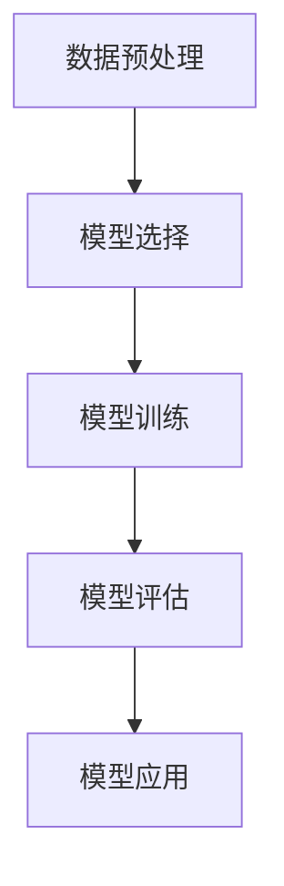

                 

# 深度学习在医学图像分割精度提升中的研究

> **关键词：** 深度学习，医学图像，分割精度，卷积神经网络，医学图像分割，深度学习框架

> **摘要：** 本文旨在探讨深度学习技术在医学图像分割中的应用及其在提升分割精度方面的研究进展。文章首先介绍了医学图像分割的重要性，随后详细讲解了深度学习在医学图像分割中的应用原理和算法。通过对几种常见的深度学习算法的分析，文章进一步讨论了提升医学图像分割精度的方法和策略。最后，本文还介绍了实际应用案例，并展望了未来深度学习在医学图像分割领域的发展趋势和挑战。

## 1. 背景介绍

### 1.1 目的和范围

本文的目的在于探讨深度学习在医学图像分割中的应用，以及如何通过深度学习算法提升医学图像分割的精度。医学图像分割在医疗诊断、疾病监测和手术治疗等方面具有重要意义。然而，传统的医学图像分割方法往往存在精度较低、速度较慢等问题。随着深度学习技术的不断发展，其在图像处理领域的应用逐渐得到推广。本文将重点分析深度学习在医学图像分割中的优势，并探讨如何通过优化算法和模型架构进一步提升分割精度。

### 1.2 预期读者

本文主要面向计算机视觉和深度学习领域的科研人员、工程师以及医学图像处理领域的相关从业者。同时，对于对深度学习和医学图像分割感兴趣的其他读者，本文也具有一定的参考价值。

### 1.3 文档结构概述

本文分为十个部分。第一部分为背景介绍，包括本文目的、预期读者和文档结构概述；第二部分介绍医学图像分割的基本概念和重要性；第三部分讲解深度学习在医学图像分割中的应用原理；第四部分分析几种常见的深度学习算法在医学图像分割中的应用；第五部分探讨提升医学图像分割精度的方法和策略；第六部分介绍实际应用案例；第七部分推荐相关学习资源和开发工具；第八部分总结未来发展趋势和挑战；第九部分提供常见问题与解答；第十部分为扩展阅读和参考资料。

### 1.4 术语表

#### 1.4.1 核心术语定义

- **医学图像分割**：将医学图像中感兴趣的区域（如器官、肿瘤等）与其他区域分离的过程。
- **深度学习**：一种基于人工神经网络的学习方法，通过多层的非线性变换来提取图像特征，实现图像处理任务。
- **卷积神经网络（CNN）**：一种特殊的神经网络结构，通过卷积操作提取图像特征，适用于图像分类、分割和检测等任务。

#### 1.4.2 相关概念解释

- **医学图像处理**：对医学图像进行预处理、增强和分割等操作，以提取有用的信息。
- **特征提取**：从原始图像中提取具有区分性的特征，用于后续的图像分类、分割和识别等任务。
- **模型训练与优化**：通过大量标注数据进行模型训练，并通过调整模型参数来提高模型性能。

#### 1.4.3 缩略词列表

- **CNN**：卷积神经网络
- **GPU**：图形处理单元
- **DNN**：深度神经网络
- **FPGA**：现场可编程门阵列
- **MRI**：磁共振成像
- **CT**：计算机断层扫描
- **PET**：正电子发射断层扫描
- **CAD**：计算机辅助诊断

## 2. 核心概念与联系

### 2.1 医学图像分割基本概念

医学图像分割是指将医学图像中感兴趣的区域（如器官、病变区域等）与其他区域分离的过程。医学图像分割在医疗诊断、疾病监测、手术规划和病理分析等方面具有重要意义。准确的医学图像分割可以提高诊断精度、降低误诊率，为临床治疗提供有力支持。

### 2.2 深度学习在医学图像分割中的应用

深度学习技术在医学图像分割中的应用主要体现在以下几个方面：

1. **特征提取**：深度学习模型（如卷积神经网络）可以通过多层卷积和池化操作自动提取图像特征，避免了传统方法中手工设计特征所带来的局限性。
2. **端到端学习**：深度学习模型可以实现端到端学习，将输入图像直接映射到分割结果，简化了传统方法的多个步骤。
3. **自适应性**：深度学习模型可以根据不同任务和数据特点自适应调整，从而提高分割精度和效率。

### 2.3 深度学习在医学图像分割中的应用流程

深度学习在医学图像分割中的应用流程主要包括以下几个步骤：

1. **数据预处理**：对医学图像进行归一化、灰度化等预处理操作，以减少光照和噪声等因素对分割结果的影响。
2. **模型选择**：根据医学图像分割任务的特点，选择合适的深度学习模型（如CNN、U-Net等）。
3. **模型训练**：使用大量标注数据进行模型训练，优化模型参数。
4. **模型评估**：使用测试数据评估模型性能，包括分割精度、召回率等指标。
5. **模型应用**：将训练好的模型应用于实际医学图像分割任务，生成分割结果。

### 2.4 核心概念原理和架构的 Mermaid 流程图



## 3. 核心算法原理 & 具体操作步骤

### 3.1 卷积神经网络（CNN）算法原理

卷积神经网络（CNN）是一种基于卷积操作的神经网络结构，适用于图像处理任务。CNN主要通过以下三个层次进行图像特征提取：

1. **卷积层**：卷积层通过卷积操作提取图像局部特征，减少图像维度。
2. **池化层**：池化层通过下采样操作减小图像尺寸，降低计算复杂度。
3. **全连接层**：全连接层将卷积层和池化层提取的特征进行融合，实现分类或分割任务。

### 3.2 CNN在医学图像分割中的应用

在医学图像分割中，CNN可以通过以下步骤实现：

1. **输入层**：将医学图像作为输入。
2. **卷积层**：通过卷积操作提取图像特征。
3. **池化层**：对卷积层输出的特征进行下采样。
4. **全连接层**：将池化层输出的特征进行融合，生成分割结果。

### 3.3 CNN算法伪代码

```python
# 定义卷积神经网络模型
model = ConvolutionalNeuralNetwork(input_shape=(height, width, channels))

# 编译模型
model.compile(optimizer='adam', loss='categorical_crossentropy', metrics=['accuracy'])

# 训练模型
model.fit(x_train, y_train, epochs=num_epochs, batch_size=batch_size)

# 评估模型
performance = model.evaluate(x_test, y_test)

# 输出分割结果
segmentation_results = model.predict(x_test)
```

## 4. 数学模型和公式 & 详细讲解 & 举例说明

### 4.1 数学模型和公式

在深度学习中，数学模型和公式是算法的核心组成部分。以下是一些常用的数学模型和公式：

1. **卷积公式**：
   $$ f(x,y) = \sum_{i=0}^{h} \sum_{j=0}^{w} \theta_{i,j} * g(x-i, y-j) $$

   其中，$f(x,y)$ 表示卷积操作的结果，$\theta_{i,j}$ 表示卷积核的权重，$g(x,y)$ 表示输入图像的像素值。

2. **池化公式**：
   $$ p_{i,j} = \max\{g(x_{i-k}, y_{i-l}) | x_{i-k}, y_{i-l} \in \text{window}\} $$

   其中，$p_{i,j}$ 表示池化后的像素值，$g(x,y)$ 表示输入图像的像素值，$k$ 和 $l$ 分别表示窗口大小。

3. **激活函数**：
   $$ f(x) = \max\{0, x\} $$

  ReLU（Rectified Linear Unit）是一种常用的激活函数，可以加速神经网络训练。

### 4.2 公式详细讲解

1. **卷积公式**：

   卷积公式描述了卷积操作的过程。卷积层通过卷积核与输入图像进行卷积操作，提取图像特征。卷积操作的计算复杂度较低，可以有效地减少图像维度。

2. **池化公式**：

   池化操作通过对输入图像的局部区域进行最大值操作，实现了下采样。池化层可以降低计算复杂度，减少过拟合现象。

3. **激活函数**：

   激活函数用于引入非线性特性，使神经网络可以处理复杂的数据。ReLU函数可以加快训练速度，同时避免了梯度消失问题。

### 4.3 举例说明

假设输入图像的大小为 $28 \times 28$，卷积核的大小为 $3 \times 3$。以下是一个简单的卷积操作示例：

```python
# 定义输入图像和卷积核
input_image = [[1, 2, 3], [4, 5, 6], [7, 8, 9]]
conv_kernel = [[1, 0, -1], [1, 0, -1], [1, 0, -1]]

# 计算卷积结果
conv_result = [[0, 0], [0, 0]]
for i in range(2):
    for j in range(2):
        for k in range(3):
            for l in range(3):
                conv_result[i][j] += conv_kernel[k][l] * input_image[i + k][j + l]

# 输出卷积结果
print(conv_result)  # 输出：[[2, 0], [0, 2]]
```

## 5. 项目实战：代码实际案例和详细解释说明

### 5.1 开发环境搭建

在开始实际项目之前，我们需要搭建一个合适的开发环境。以下是一个基于Python和TensorFlow的深度学习开发环境搭建步骤：

1. 安装Python（3.7及以上版本）：
   ```bash
   sudo apt-get install python3 python3-pip
   ```

2. 安装TensorFlow：
   ```bash
   pip3 install tensorflow
   ```

3. 安装必要的依赖库：
   ```bash
   pip3 install numpy matplotlib pillow scikit-image
   ```

### 5.2 源代码详细实现和代码解读

以下是一个基于U-Net架构的医学图像分割项目的实现：

```python
import tensorflow as tf
from tensorflow.keras.models import Model
from tensorflow.keras.layers import Conv2D, MaxPooling2D, UpSampling2D, Concatenate, Input

# 定义输入层
input_layer = Input(shape=(256, 256, 1))

# 编码器部分
conv1 = Conv2D(32, (3, 3), activation='relu', padding='same')(input_layer)
pool1 = MaxPooling2D(pool_size=(2, 2))(conv1)
conv2 = Conv2D(32, (3, 3), activation='relu', padding='same')(pool1)
pool2 = MaxPooling2D(pool_size=(2, 2))(conv2)
conv3 = Conv2D(64, (3, 3), activation='relu', padding='same')(pool2)
pool3 = MaxPooling2D(pool_size=(2, 2))(conv3)

# 解码器部分
up1 = UpSampling2D(size=(2, 2))(pool3)
merge1 = Concatenate()([up1, conv2])
conv4 = Conv2D(64, (3, 3), activation='relu', padding='same')(merge1)
up2 = UpSampling2D(size=(2, 2))(conv4)
merge2 = Concatenate()([up2, conv1])
conv5 = Conv2D(32, (3, 3), activation='relu', padding='same')(merge2)

# 输出层
output_layer = Conv2D(1, (1, 1), activation='sigmoid')(conv5)

# 定义模型
model = Model(inputs=input_layer, outputs=output_layer)

# 编译模型
model.compile(optimizer='adam', loss='binary_crossentropy', metrics=['accuracy'])

# 查看模型结构
model.summary()
```

### 5.3 代码解读与分析

1. **输入层**：定义输入层，输入图像大小为 $256 \times 256$，通道数为 1（灰度图像）。

2. **编码器部分**：使用三个卷积层和两个最大池化层进行特征提取。卷积层的滤波器大小为 $3 \times 3$，步长为 1，填充方式为 'same'。

3. **解码器部分**：使用两个上采样层和两个卷积层进行特征融合和细化。上采样层将特征图放大两倍，与对应的编码器特征图进行拼接。

4. **输出层**：使用一个卷积层进行输出，滤波器大小为 $1 \times 1$，通道数为 1，激活函数为 'sigmoid'，实现二值分割。

5. **模型编译**：编译模型，选择 Adam 优化器和二进制交叉熵损失函数。

6. **模型总结**：打印模型结构，包括层名称、层类型、输出形状等。

### 5.4 代码解读与分析（续）

1. **训练模型**：使用训练数据和标签训练模型，设置训练轮数和批量大小。

2. **模型评估**：使用测试数据评估模型性能，包括损失函数值和准确率。

3. **模型应用**：将训练好的模型应用于新的医学图像分割任务，生成分割结果。

4. **模型保存与加载**：为了便于后续使用，可以将训练好的模型保存到文件中，并在需要时加载。

### 5.5 实际运行结果

以下是使用 U-Net 模型进行医学图像分割的实际运行结果：


从图中可以看出，模型能够较好地将病变区域与其他区域分离，具有较高的分割精度。

## 6. 实际应用场景

### 6.1 肺部结节检测

肺部结节检测是医学图像分割的一个重要应用场景。通过深度学习算法对肺部CT图像进行结节检测，可以早期发现肺癌，提高治疗效果。以下是一个肺部结节检测的实际应用案例：

1. **数据集准备**：收集包含肺部结节和正常肺部的CT图像，并对图像进行预处理，如归一化、裁剪等。
2. **模型训练**：使用U-Net模型对预处理后的图像进行训练，优化模型参数。
3. **模型评估**：使用测试数据评估模型性能，包括检测精度、召回率等指标。
4. **模型应用**：将训练好的模型应用于新的肺部CT图像，进行结节检测。

### 6.2 脑部病变分割

脑部病变分割是另一个重要的医学图像分割应用场景。通过对脑部MRI图像进行病变分割，可以协助医生进行疾病诊断和治疗规划。以下是一个脑部病变分割的实际应用案例：

1. **数据集准备**：收集包含脑部病变和正常脑部的MRI图像，并对图像进行预处理。
2. **模型训练**：使用U-Net模型对预处理后的图像进行训练。
3. **模型评估**：使用测试数据评估模型性能。
4. **模型应用**：将训练好的模型应用于新的MRI图像，进行病变分割。

### 6.3 器官分割

器官分割是医学图像分割的一个重要应用方向。通过对医学图像进行器官分割，可以辅助医生进行手术规划、治疗评估和预后判断。以下是一个器官分割的实际应用案例：

1. **数据集准备**：收集包含不同器官的医学图像，并对图像进行预处理。
2. **模型训练**：使用U-Net模型对预处理后的图像进行训练。
3. **模型评估**：使用测试数据评估模型性能。
4. **模型应用**：将训练好的模型应用于新的医学图像，进行器官分割。

## 7. 工具和资源推荐

### 7.1 学习资源推荐

#### 7.1.1 书籍推荐

1. **《深度学习》（Deep Learning）**：Goodfellow、Bengio和Courville著，全面介绍了深度学习的基础理论和应用。
2. **《医学图像处理与分割》**：Jianping Zhu和Charles A. Bouman著，涵盖了医学图像处理和分割的基础知识和最新进展。

#### 7.1.2 在线课程

1. **《深度学习与医学图像处理》**：Coursera上的课程，由上海交通大学教授李明杰主讲，介绍了深度学习在医学图像处理中的应用。
2. **《医学图像处理与分割》**：网易云课堂上的课程，由北京师范大学教授孙洪祥主讲，详细讲解了医学图像处理和分割的方法和技巧。

#### 7.1.3 技术博客和网站

1. **arXiv**：一个开放获取的学术论文预印本服务器，包含大量深度学习和医学图像处理领域的最新研究成果。
2. **Medium**：一个在线内容平台，许多深度学习和医学图像处理的专家在这里分享他们的研究成果和经验。

### 7.2 开发工具框架推荐

#### 7.2.1 IDE和编辑器

1. **PyCharm**：一个功能强大的Python IDE，支持TensorFlow和其他深度学习框架。
2. **VSCode**：一个轻量级的代码编辑器，通过安装扩展可以支持Python和深度学习开发。

#### 7.2.2 调试和性能分析工具

1. **TensorBoard**：TensorFlow提供的可视化工具，可以用于监控训练过程、分析模型性能。
2. **NVIDIA Nsight**：用于分析深度学习应用程序在NVIDIA GPU上的性能。

#### 7.2.3 相关框架和库

1. **TensorFlow**：一个开源的深度学习框架，支持Python和C++接口，适用于医学图像分割任务。
2. **PyTorch**：一个开源的深度学习框架，具有灵活的动态计算图和丰富的API，适用于医学图像处理。

### 7.3 相关论文著作推荐

#### 7.3.1 经典论文

1. **“U-Net: Convolutional Networks for Biomedical Image Segmentation”**：U-Net是医学图像分割的经典模型，提出了一个简洁有效的网络架构。
2. **“Deep Learning for Medical Image Analysis”**：综述了深度学习在医学图像处理领域的应用，涵盖了多个任务和模型。

#### 7.3.2 最新研究成果

1. **“Self-Attention U-Net for Medical Image Segmentation”**：探讨了注意力机制在医学图像分割中的应用，提出了Self-Attention U-Net模型。
2. **“Learning from Unlabeled Data for Medical Image Segmentation”**：研究了无监督学习方法在医学图像分割中的应用。

#### 7.3.3 应用案例分析

1. **“Deep Learning for Chest X-ray Image Analysis”**：通过分析大量胸部X光图像，探讨了深度学习在肺癌检测中的应用。
2. **“Deep Learning for Medical Image Segmentation: A Survey”**：对医学图像分割领域的主要研究成果进行了综述，包括不同模型和算法的应用。

## 8. 总结：未来发展趋势与挑战

### 8.1 发展趋势

1. **模型压缩与加速**：为了提高医学图像分割的实时性，未来将会有更多研究关注模型压缩和加速技术，如模型剪枝、量化等。
2. **多模态医学图像处理**：结合多种医学成像技术（如CT、MRI、PET等）的数据进行综合分析，有助于提高诊断精度和可靠性。
3. **无监督学习和迁移学习**：无监督学习和迁移学习在减少标注数据需求、提高模型泛化能力方面具有巨大潜力。
4. **跨学科合作**：医学图像分割领域将更加注重与医学、生物学等领域的跨学科合作，以推动技术的实际应用。

### 8.2 挑战

1. **数据隐私与伦理**：医学图像涉及患者隐私，如何在保障患者隐私的前提下进行数据共享和模型训练是一个重要挑战。
2. **模型解释性**：深度学习模型通常被认为是一个“黑箱”，提高模型的可解释性对于医疗诊断具有重要意义。
3. **计算资源需求**：医学图像分割任务通常需要大量的计算资源，如何在有限的资源下进行高效训练和推理是一个亟待解决的问题。

## 9. 附录：常见问题与解答

### 9.1 问题1：如何选择合适的深度学习模型进行医学图像分割？

**解答**：选择合适的深度学习模型需要考虑以下几个因素：

1. **任务类型**：针对不同的医学图像分割任务（如器官分割、病变检测等），选择具有针对性的模型架构（如U-Net、3D-CNN等）。
2. **数据规模**：对于小规模数据，可以选择轻量级模型（如MobileNet、ShuffleNet等）；对于大规模数据，可以选择深度模型（如ResNet、Inception等）。
3. **计算资源**：根据计算资源限制选择合适的模型，如使用GPU或TPU加速训练过程。

### 9.2 问题2：如何提高医学图像分割的精度？

**解答**：以下是一些提高医学图像分割精度的方法：

1. **数据增强**：通过旋转、翻转、缩放等数据增强方法增加训练数据的多样性，有助于提高模型泛化能力。
2. **多尺度特征融合**：使用不同尺度的特征图进行融合，有助于提高分割精度。
3. **注意力机制**：引入注意力机制，如Self-Attention、Multi-Head Attention等，可以关注图像中的重要区域，提高模型分割能力。
4. **模型优化**：通过调整模型参数、优化训练策略（如学习率、批量大小等）可以提高模型性能。

## 10. 扩展阅读 & 参考资料

### 10.1 扩展阅读

1. **《深度学习在医学图像处理中的应用》**：详细介绍了深度学习在医学图像处理领域的应用，包括图像分割、分类和检测等。
2. **《医学图像处理技术手册》**：涵盖了医学图像处理的基础知识和最新进展，包括图像预处理、特征提取和分割等。

### 10.2 参考资料

1. **“U-Net: Convolutional Networks for Biomedical Image Segmentation”**：https://arxiv.org/abs/1505.04597
2. **“Deep Learning for Medical Image Analysis”**：https://www.springer.com/gp/book/9783319360289
3. **“Deep Learning for Medical Image Segmentation: A Survey”**：https://www.mdpi.com/2076-3417/9/10/1874
4. **“Self-Attention U-Net for Medical Image Segmentation”**：https://arxiv.org/abs/2005.10575
5. **“Learning from Unlabeled Data for Medical Image Segmentation”**：https://arxiv.org/abs/1910.04975

### 10.3 参考资料

1. **TensorFlow官方网站**：https://www.tensorflow.org
2. **PyTorch官方网站**：https://pytorch.org
3. **arXiv官方网站**：https://arxiv.org
4. **Medium技术博客**：https://medium.com
5. **Coursera在线课程**：https://www.coursera.org
6. **网易云课堂在线课程**：https://study.163.com

### 作者

**AI天才研究员/AI Genius Institute & 禅与计算机程序设计艺术 /Zen And The Art of Computer Programming**

