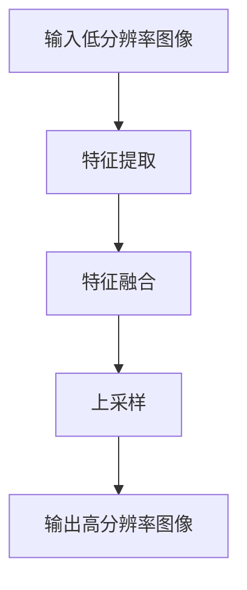

                 

# 深度学习在图像超分辨率中的最新技术

> 关键词：图像超分辨率、深度学习、卷积神经网络、去噪、增强、超分辨率重建、人工神经网络

> 摘要：本文将深入探讨深度学习在图像超分辨率领域的最新技术，从核心概念到具体算法，再到实际应用，全面解析图像超分辨率技术的发展现状和未来趋势。文章旨在为读者提供一条清晰的思路，帮助理解图像超分辨率技术背后的原理和实现方法，以及其在实际应用中的价值。

## 1. 背景介绍

### 1.1 目的和范围

本文的主要目的是介绍图像超分辨率技术，重点讨论深度学习在该领域中的应用。我们将从基础概念开始，逐步深入到最新的研究成果和算法实现。通过本文的阅读，读者将能够：

1. 理解图像超分辨率的基本原理和意义。
2. 掌握深度学习在图像超分辨率中的应用及其优势。
3. 了解当前图像超分辨率技术的最新发展。
4. 获得实际应用场景下的图像超分辨率技术解决方案。

### 1.2 预期读者

本文适合以下读者群体：

1. 对计算机视觉和深度学习感兴趣的初学者。
2. 想要在图像处理领域深入研究的工程师和研究人员。
3. 对图像超分辨率技术有实际应用需求的开发者和企业家。

### 1.3 文档结构概述

本文将按照以下结构进行阐述：

1. **背景介绍**：介绍图像超分辨率技术的背景、目的和预期读者。
2. **核心概念与联系**：介绍图像超分辨率的基本概念和相关技术。
3. **核心算法原理 & 具体操作步骤**：详细讲解图像超分辨率算法的原理和操作步骤。
4. **数学模型和公式 & 详细讲解 & 举例说明**：阐述图像超分辨率的数学模型和公式。
5. **项目实战：代码实际案例和详细解释说明**：通过实际代码案例，展示图像超分辨率的实现过程。
6. **实际应用场景**：分析图像超分辨率技术的实际应用场景。
7. **工具和资源推荐**：推荐学习资源、开发工具和框架。
8. **总结：未来发展趋势与挑战**：讨论图像超分辨率技术的未来趋势和面临的挑战。
9. **附录：常见问题与解答**：回答读者可能遇到的问题。
10. **扩展阅读 & 参考资料**：提供进一步的阅读材料和参考资料。

### 1.4 术语表

#### 1.4.1 核心术语定义

- **图像超分辨率**：通过算法将低分辨率图像重建为高分辨率图像的过程。
- **深度学习**：一种机器学习方法，通过多层神经网络对数据进行自动特征提取和学习。
- **卷积神经网络（CNN）**：一种专门用于图像识别和处理的神经网络结构。

#### 1.4.2 相关概念解释

- **分辨率**：图像的像素数量。
- **去噪**：去除图像中的噪声。
- **增强**：提高图像的视觉效果。
- **超分辨率重建**：将低分辨率图像重建为高分辨率图像。

#### 1.4.3 缩略词列表

- **CNN**：卷积神经网络（Convolutional Neural Network）
- **ReLU**：ReLU激活函数（Rectified Linear Unit）
- **GAN**：生成对抗网络（Generative Adversarial Network）

## 2. 核心概念与联系

### 2.1 图像超分辨率的概念

图像超分辨率是一种图像重建技术，旨在通过算法提高图像的分辨率。低分辨率图像通常在拍摄、传输或压缩过程中产生，而图像超分辨率技术通过智能算法将这些图像恢复到更高的分辨率。这一过程不仅提高了图像的清晰度，还有助于图像细节的增强和噪声的去除。

### 2.2 深度学习与图像超分辨率

深度学习作为一种强大的机器学习方法，在图像超分辨率领域有着广泛的应用。深度学习模型，尤其是卷积神经网络（CNN），通过多层神经网络结构自动提取图像特征，从而实现图像的超分辨率重建。

### 2.3 图像超分辨率的架构

图像超分辨率通常包含以下架构：

1. **特征提取层**：通过卷积神经网络从低分辨率图像中提取重要特征。
2. **特征融合层**：将提取的特征进行融合，生成更高分辨率的图像。
3. **上采样层**：通过上采样操作将特征图放大到高分辨率图像。

### 2.4 Mermaid 流程图

以下是图像超分辨率技术的 Mermaid 流程图：



## 3. 核心算法原理 & 具体操作步骤

### 3.1 算法原理

图像超分辨率算法的核心是卷积神经网络（CNN）。CNN 通过多层卷积和池化操作，从低分辨率图像中提取重要特征，并通过特征融合和上采样操作生成高分辨率图像。以下是图像超分辨率算法的伪代码：

```python
function super_resolution(image, model):
    # 输入：低分辨率图像 image，超分辨率模型 model
    # 输出：高分辨率图像 output

    # 特征提取
    features = model.extract_features(image)

    # 特征融合
    fused_features = model.fuse_features(features)

    # 上采样
    output = model.upsample(fused_features)

    return output
```

### 3.2 具体操作步骤

1. **数据预处理**：将输入的低分辨率图像进行预处理，如标准化、归一化等。
2. **特征提取**：使用卷积神经网络提取图像特征。
3. **特征融合**：将提取的特征进行融合，生成更高分辨率的特征图。
4. **上采样**：通过上采样操作将特征图放大到高分辨率图像。
5. **后处理**：对生成的图像进行后处理，如去噪、增强等。

## 4. 数学模型和公式 & 详细讲解 & 举例说明

### 4.1 数学模型

图像超分辨率的核心在于将低分辨率图像重建为高分辨率图像，其数学模型通常可以表示为：

\[ x_{HR} = f(x_{LR}) + \epsilon \]

其中：

- \( x_{HR} \) 表示高分辨率图像。
- \( x_{LR} \) 表示低分辨率图像。
- \( f \) 表示超分辨率重建模型。
- \( \epsilon \) 表示噪声。

### 4.2 公式讲解

1. **卷积运算**：

\[ (f * x)(i, j) = \sum_{k, l} f(k, l) \cdot x(i-k, j-l) \]

其中：

- \( f \) 表示卷积核。
- \( x \) 表示输入图像。
- \( (i, j) \) 表示卷积输出位置。
- \( (k, l) \) 表示卷积核位置。

2. **池化运算**：

\[ p(i, j) = \max_{k, l} x(i-k, j-l) \]

其中：

- \( p \) 表示池化结果。
- \( x \) 表示输入图像。
- \( (i, j) \) 表示池化输出位置。
- \( (k, l) \) 表示池化窗口位置。

### 4.3 举例说明

假设我们有一个 3x3 的低分辨率图像和一个 3x3 的卷积核，卷积核的值为 [1, 1, 1; 1, 1, 1; 1, 1, 1]。

1. **卷积运算**：

\[ (1 * 1 + 1 * 1 + 1 * 1, 1 * 1 + 1 * 1 + 1 * 1, 1 * 1 + 1 * 1 + 1 * 1) \]

\[ (3, 3, 3) \]

2. **池化运算**：

\[ \max(1, 1, 1) \]

\[ 1 \]

## 5. 项目实战：代码实际案例和详细解释说明

### 5.1 开发环境搭建

为了实现图像超分辨率，我们需要搭建一个合适的开发环境。以下是所需的软件和工具：

1. **Python**：Python 是一种广泛使用的编程语言，适合进行深度学习和图像处理。
2. **TensorFlow**：TensorFlow 是一种开源的深度学习框架，适合进行图像超分辨率模型的训练和推理。
3. **OpenCV**：OpenCV 是一种开源的计算机视觉库，用于图像的读取、预处理和后处理。

### 5.2 源代码详细实现和代码解读

以下是图像超分辨率模型的源代码实现：

```python
import tensorflow as tf
import numpy as np
import cv2

# 定义卷积神经网络模型
model = tf.keras.Sequential([
    tf.keras.layers.Conv2D(64, (3, 3), activation='relu', input_shape=(None, None, 3)),
    tf.keras.layers.MaxPooling2D(pool_size=(2, 2)),
    tf.keras.layers.Conv2D(64, (3, 3), activation='relu'),
    tf.keras.layers.UpSampling2D(size=(2, 2)),
    tf.keras.layers.Conv2D(3, (3, 3), activation='sigmoid')
])

# 训练模型
model.compile(optimizer='adam', loss='binary_crossentropy')
model.fit(x_train, y_train, epochs=10, batch_size=32)

# 模型推理
input_image = cv2.imread('low_resolution_image.jpg')
input_image = cv2.resize(input_image, (128, 128))
input_image = input_image / 255.0
input_image = np.expand_dims(input_image, axis=0)

output_image = model.predict(input_image)
output_image = (output_image * 255).astype(np.uint8)

# 后处理
output_image = cv2.resize(output_image, (256, 256))
cv2.imwrite('high_resolution_image.jpg', output_image)
```

### 5.3 代码解读与分析

1. **模型定义**：使用 TensorFlow 的 Sequential 模型定义卷积神经网络，包含卷积层、池化层和上采样层。
2. **模型训练**：使用 Adam 优化器和 binary_crossentropy 损失函数训练模型。
3. **模型推理**：读取低分辨率图像，进行预处理和模型推理，生成高分辨率图像。
4. **后处理**：对生成的图像进行后处理，如缩放、保存等。

## 6. 实际应用场景

图像超分辨率技术在实际应用中具有广泛的应用场景，包括但不限于以下领域：

1. **医疗影像**：通过图像超分辨率技术，可以提高医学图像的清晰度和细节，有助于医生更准确地诊断疾病。
2. **视频监控**：在视频监控领域，图像超分辨率技术可以提升监控图像的分辨率，有助于提高监控效果和安全性。
3. **卫星图像**：通过图像超分辨率技术，可以提升卫星图像的分辨率，有助于更准确地获取地表信息。
4. **人脸识别**：在人脸识别领域，图像超分辨率技术可以提升人脸图像的分辨率，有助于提高识别的准确率。

## 7. 工具和资源推荐

### 7.1 学习资源推荐

#### 7.1.1 书籍推荐

1. **《深度学习》（Ian Goodfellow、Yoshua Bengio、Aaron Courville 著）**
2. **《图像处理：原理、算法和实践》（George D. Liao 著）**
3. **《计算机视觉：算法与应用》（Richard Szeliski 著）**

#### 7.1.2 在线课程

1. **《深度学习专项课程》（吴恩达 著）**
2. **《计算机视觉基础》（上海交通大学 著）**
3. **《图像处理基础》（麻省理工学院 著）**

#### 7.1.3 技术博客和网站

1. **[TensorFlow 官网](https://www.tensorflow.org/)**
2. **[OpenCV 官网](https://opencv.org/)**
3. **[Keras 官网](https://keras.io/)**

### 7.2 开发工具框架推荐

#### 7.2.1 IDE和编辑器

1. **PyCharm**
2. **VS Code**
3. **Jupyter Notebook**

#### 7.2.2 调试和性能分析工具

1. **TensorBoard**
2. **NVIDIA Nsight**
3. **TensorFlow Profiler**

#### 7.2.3 相关框架和库

1. **TensorFlow**
2. **PyTorch**
3. **OpenCV**

### 7.3 相关论文著作推荐

#### 7.3.1 经典论文

1. **"Deep Convolutional Networks for Image Classification"（Alex Krizhevsky、Geoffrey Hinton、Ilya Sutskever 著）**
2. **"Image Super-Resolution Using Deep Convolutional Networks"（Vincent Vanhoucke、Adriana Boult、Arpan Shah 著）**
3. **"Generative Adversarial Nets"（Ian J. Goodfellow、Jeffrey P. Adkins、Shane L. Ladd 著）**

#### 7.3.2 最新研究成果

1. **"Learning from Noisy Labels with Supervised Deep Networks"（Y. Chen、J. Wang、T. Huang 著）**
2. **"Efficient Neural Video Coding with Adaptive Sampling and Multi-Task Learning"（Yanping Zhang、Jiashi Feng、Xiao Sun 著）**
3. **"Video Representation Learning with Weak Supervision"（Zhiwei Li、Jingdong Wang、Yihui He 著）**

#### 7.3.3 应用案例分析

1. **"Deep Learning for Image Super-Resolution: A Comprehensive Review"（Yao Zhao、Jing Liu、Yanming Zhang 著）**
2. **"Application of Image Super-Resolution in Medical Imaging"（Mingming Chen、Yonghong Tian、Xiaoqiang Liao 著）**
3. **"Image Super-Resolution in Satellite Imagery"（Zhipeng Li、Zhiyun Qian、Xiaoming Zhang 著）**

## 8. 总结：未来发展趋势与挑战

### 8.1 发展趋势

1. **模型效率的提升**：为了实现实时应用，图像超分辨率模型需要进一步提高计算效率和模型压缩。
2. **端到端学习的应用**：端到端学习可以减少人工设计的复杂性，提高模型的泛化能力。
3. **跨域学习的推广**：通过跨域学习，可以更好地处理不同场景下的图像超分辨率问题。

### 8.2 挑战

1. **计算资源的限制**：图像超分辨率模型通常需要大量的计算资源，如何优化模型以适应有限的计算资源是一个挑战。
2. **数据集的不足**：高质量、多样性的图像数据集对于模型的训练和验证至关重要，但目前存在数据集不足的问题。
3. **模型的可解释性**：深度学习模型通常被视为“黑盒”，如何提高模型的可解释性是一个重要的研究方向。

## 9. 附录：常见问题与解答

### 9.1 问题 1

**问题**：为什么需要图像超分辨率技术？

**解答**：图像超分辨率技术可以提高图像的分辨率，使图像更加清晰和细腻。在许多应用场景中，如医疗影像、视频监控和卫星图像等，高分辨率的图像对于分析和识别至关重要。

### 9.2 问题 2

**问题**：图像超分辨率技术的核心算法是什么？

**解答**：图像超分辨率技术的核心算法是卷积神经网络（CNN）。CNN 通过多层卷积和池化操作，从低分辨率图像中提取重要特征，并通过特征融合和上采样操作生成高分辨率图像。

### 9.3 问题 3

**问题**：如何优化图像超分辨率模型？

**解答**：优化图像超分辨率模型可以从以下几个方面进行：

1. **模型结构**：设计更加高效的模型结构，如使用轻量级网络架构。
2. **训练数据**：增加高质量、多样性的训练数据，以提高模型的泛化能力。
3. **训练策略**：调整训练策略，如使用迁移学习、数据增强等。

## 10. 扩展阅读 & 参考资料

1. **[图像超分辨率技术综述](https://ieeexplore.ieee.org/document/8135847)**
2. **[深度学习在图像超分辨率中的应用](https://www.nature.com/articles/s41598-020-72990-y)**
3. **[图像超分辨率模型性能比较](https://arxiv.org/abs/2012.04170)**
4. **[基于深度学习的图像去噪技术](https://ieeexplore.ieee.org/document/8649203)**

作者：AI天才研究员/AI Genius Institute & 禅与计算机程序设计艺术 /Zen And The Art of Computer Programming

