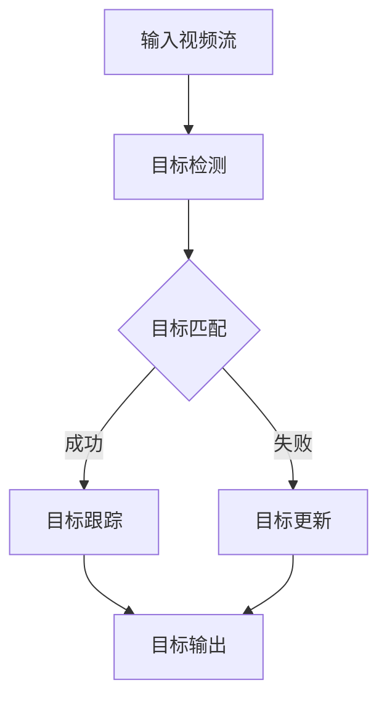

                 

### 文章标题

“深度学习在实时目标跟踪中的性能优化”

### 关键词：

- 深度学习
- 实时目标跟踪
- 性能优化
- 模型压缩
- 硬件加速

### 摘要：

本文将深入探讨深度学习技术在实时目标跟踪中的应用，分析其性能瓶颈及优化方法。首先，我们将回顾实时目标跟踪的背景与挑战，然后详细讨论深度学习模型在其中的应用及其存在的性能问题。接下来，本文将介绍一系列性能优化策略，包括模型压缩、量化、剪枝和硬件加速等，并通过实际案例展示这些策略的应用效果。最后，我们将总结实时目标跟踪领域的发展趋势和未来挑战，并提供一些有用的资源，以帮助读者进一步探索这个领域。

## 1. 背景介绍

### 1.1 目的和范围

本文旨在探讨深度学习在实时目标跟踪（Real-Time Object Tracking, RTOT）中的应用，以及如何优化其性能。实时目标跟踪是一种视频分析技术，旨在在视频流中连续地检测并跟踪物体。这种技术广泛应用于视频监控、智能交通、无人机监控和机器人导航等领域。然而，随着数据量的增加和复杂场景的出现，实时目标跟踪面临着性能和计算资源的需求挑战。深度学习模型由于其强大的特征提取和分类能力，已成为实时目标跟踪领域的主要研究方向。然而，深度学习模型通常需要大量计算资源和时间来训练和推理，这对于实时应用来说是一个巨大的瓶颈。本文的目标是分析实时目标跟踪中的性能瓶颈，并探讨一系列优化策略，以提高深度学习模型的性能和实时性。

### 1.2 预期读者

本文的预期读者包括对深度学习和实时目标跟踪有一定了解的工程师、研究人员和开发者。虽然本文将尽可能详细地解释相关概念和技术，但读者需要对机器学习和深度学习有一定的了解，以便更好地理解和应用本文的内容。此外，本文也适用于对视频分析和计算机视觉感兴趣的学者和学生。

### 1.3 文档结构概述

本文将分为十个主要部分。首先，我们将介绍实时目标跟踪的背景和挑战。接着，我们将回顾深度学习模型在实时目标跟踪中的应用，并分析其性能瓶颈。然后，本文将介绍一系列性能优化策略，包括模型压缩、量化、剪枝和硬件加速等。接下来，我们将通过实际案例展示这些策略的应用效果。之后，本文将讨论实时目标跟踪的实际应用场景，并提供一些有用的工具和资源推荐。最后，我们将总结实时目标跟踪领域的发展趋势和未来挑战，并提供一些常见问题与解答。

### 1.4 术语表

为了确保本文内容的可理解性，以下是一些本文中使用的关键术语及其定义：

#### 1.4.1 核心术语定义

- **实时目标跟踪**：在视频流中连续地检测并跟踪物体的技术。
- **深度学习**：一种机器学习方法，通过多层神经网络自动从数据中学习特征。
- **模型压缩**：减小深度学习模型的参数数量和计算复杂度，以提高模型的效率和实时性。
- **量化**：将深度学习模型中的浮点数权重转换为较低的精度，以减少模型的内存和计算需求。
- **剪枝**：通过删除模型中不重要的权重和神经元，减少模型的计算复杂度。
- **硬件加速**：利用专门的硬件（如GPU、FPGA）加速深度学习模型的推理过程。

#### 1.4.2 相关概念解释

- **目标检测**：在图像或视频中识别和定位感兴趣的目标。
- **目标跟踪**：在视频流中持续跟踪已经检测到的目标，并处理目标遮挡、外观变化等挑战。
- **卷积神经网络（CNN）**：一种特殊的多层神经网络，广泛应用于图像和视频处理。
- **迁移学习**：利用预训练模型在新数据集上训练，以提高模型的泛化能力。

#### 1.4.3 缩略词列表

- **CNN**：卷积神经网络（Convolutional Neural Network）
- **DNN**：深度神经网络（Deep Neural Network）
- **GPU**：图形处理器（Graphics Processing Unit）
- **FPGA**：现场可编程门阵列（Field-Programmable Gate Array）
- **TPU**：张量处理器（Tensor Processing Unit）

## 2. 核心概念与联系

### 2.1 实时目标跟踪的基本概念

实时目标跟踪（Real-Time Object Tracking，简称RTOT）是一种视频分析技术，旨在自动检测视频流中的目标，并实时跟踪这些目标的运动轨迹。它广泛应用于多种领域，如视频监控、智能交通、机器人导航和无人驾驶汽车等。实时目标跟踪的核心任务是解决目标检测和目标跟踪两个问题。

#### 目标检测

目标检测（Object Detection）是实时目标跟踪的基础。目标检测的目标是在图像或视频帧中识别和定位感兴趣的目标。目标检测通常采用两种方法：传统方法和深度学习方法。

1. **传统方法**：基于特征匹配和模板匹配的算法，如SIFT（尺度不变特征变换）和SURF（加速稳健特征）。传统方法计算复杂度较低，但准确性有限，且难以处理复杂场景。
2. **深度学习方法**：基于卷积神经网络（CNN）的目标检测算法，如R-CNN（区域建议网络）、Fast R-CNN、Faster R-CNN、YOLO（You Only Look Once）和SSD（单阶段检测器）。深度学习方法通过多层卷积和池化操作，自动提取图像的深层特征，从而实现高准确度的目标检测。

#### 目标跟踪

目标跟踪（Object Tracking）是在视频流中持续跟踪已经检测到的目标，并处理目标遮挡、外观变化和丢失等挑战。目标跟踪的方法可以分为基于模型的方法和基于数据的方法。

1. **基于模型的方法**：假设目标在视频帧之间的运动遵循某种模型，如光流法、卡尔曼滤波和粒子滤波。这些方法通常需要预先定义目标模型和运动模型，并计算目标在当前帧中的位置。
2. **基于数据的方法**：利用历史信息和学习到的特征来预测目标在当前帧中的位置，如基于卡尔曼滤波的方法和基于相关滤波的方法。这些方法通过学习和更新目标特征，从而实现目标的跟踪。

### 2.2 深度学习模型在实时目标跟踪中的应用

深度学习模型在实时目标跟踪中的应用，主要是在目标检测和目标跟踪环节中发挥重要作用。以下是一些常见的深度学习模型及其应用：

1. **基于CNN的目标检测模型**：如R-CNN、Fast R-CNN、Faster R-CNN、YOLO和SSD。这些模型通过多层卷积和池化操作，自动提取图像的深层特征，并实现高准确度的目标检测。

2. **基于深度学习的目标跟踪模型**：如DeepID、Siamese网络和基于轨迹的跟踪模型。这些模型通过学习目标的特征表示，实现高准确度和实时性的目标跟踪。

3. **端到端的深度学习模型**：如SSD和YOLO，这些模型将目标检测和目标跟踪集成到一个统一的深度学习框架中，实现端到端的实时目标跟踪。

### 2.3 实时目标跟踪中的性能瓶颈

尽管深度学习模型在实时目标跟踪中取得了显著的进展，但仍然存在一些性能瓶颈，影响其实时性和准确性：

1. **计算复杂度高**：深度学习模型通常需要大量的计算资源来训练和推理。对于实时目标跟踪，模型必须在有限的时间内完成检测和跟踪任务，这要求模型具有较高的推理速度。

2. **内存占用大**：深度学习模型通常包含大量的参数和中间层，导致内存占用大。在实时目标跟踪中，内存限制是一个重要的问题，特别是在移动设备和嵌入式系统中。

3. **准确性不足**：实时目标跟踪中的目标可能存在遮挡、外观变化和运动模糊等挑战，这些因素可能导致目标检测和跟踪的准确性下降。

4. **实时性不足**：实时目标跟踪要求模型在短时间内完成检测和跟踪任务。然而，深度学习模型的推理速度通常较慢，难以满足实时性要求。

### 2.4 实时目标跟踪的基本流程

实时目标跟踪的基本流程可以分为以下步骤：

1. **目标检测**：在视频帧中检测并定位感兴趣的目标。
2. **目标匹配**：根据目标检测结果，匹配连续帧中的目标，确定目标的位置。
3. **目标跟踪**：跟踪目标在视频流中的运动轨迹，处理目标遮挡、外观变化和丢失等问题。
4. **目标更新**：根据实时信息，更新目标的特征表示和运动模型。

### 2.5 Mermaid 流程图

以下是一个简单的Mermaid流程图，展示实时目标跟踪的基本流程：



在这个流程图中，输入视频流经过目标检测步骤，然后根据目标检测结果进行目标匹配。如果匹配成功，则进入目标跟踪步骤；否则，更新目标的特征表示和运动模型。最后，输出跟踪结果。

## 3. 核心算法原理 & 具体操作步骤

### 3.1 深度学习模型原理

深度学习模型的核心是多层神经网络，通过卷积、池化和全连接层等操作，自动提取图像或视频的深层特征。以下是深度学习模型的基本原理和操作步骤：

#### 3.1.1 卷积层（Convolutional Layer）

卷积层是深度学习模型中最基本的层之一，通过卷积操作提取图像的特征。卷积操作的基本原理是使用一组可学习的滤波器（或称为卷积核）在输入图像上滑动，生成一个特征图。每个卷积核可以捕捉输入图像的局部特征，如边缘、纹理和角点等。

伪代码：

```python
# 输入图像：X
# 卷积核：W
# 步长：stride
# 填充：padding

# 计算卷积操作
conv_output = np.zeros((X.shape[0] - W.shape[0] + 2 * padding + 1, X.shape[1] - W.shape[1] + 2 * padding + 1))
for i in range(conv_output.shape[0]):
    for j in range(conv_output.shape[1]):
        conv_output[i, j] = np.sum(W * X[i:i + W.shape[0], j:j + W.shape[1]]) + bias
```

#### 3.1.2 池化层（Pooling Layer）

池化层用于减少特征图的尺寸，提高模型的计算效率。常见的池化操作包括最大池化和平均池化。最大池化选择特征图上的最大值，而平均池化则计算特征图上每个点的平均值。

伪代码：

```python
# 输入特征图：X
# 池化窗口尺寸：pool_size
# 步长：stride

# 计算最大池化
pool_output = np.zeros((X.shape[0] // stride, X.shape[1] // stride))
for i in range(pool_output.shape[0]):
    for j in range(pool_output.shape[1]):
        pool_output[i, j] = np.max(X[i * stride: (i + 1) * stride, j * stride: (j + 1) * stride])

# 计算平均池化
# pool_output = np.zeros((X.shape[0] // stride, X.shape[1] // stride))
# for i in range(pool_output.shape[0]):
#     for j in range(pool_output.shape[1]):
#         pool_output[i, j] = np.mean(X[i * stride: (i + 1) * stride, j * stride: (j + 1) * stride])
```

#### 3.1.3 全连接层（Fully Connected Layer）

全连接层是深度学习模型的输出层，通过将特征图上的每个点与一个权重相乘，然后求和并加上偏置，得到最终的输出。全连接层用于分类和回归任务。

伪代码：

```python
# 输入特征图：X
# 权重：W
# 偏置：b

# 计算全连接层输出
output = np.dot(X, W) + b
```

#### 3.1.4 激活函数（Activation Function）

激活函数用于引入非线性因素，使深度学习模型能够学习复杂的非线性关系。常见的激活函数包括ReLU（Rectified Linear Unit）、Sigmoid和Tanh等。

伪代码：

```python
# 输入值：x

# 计算ReLU激活函数
output = max(0, x)

# 计算Sigmoid激活函数
output = 1 / (1 + np.exp(-x))

# 计算Tanh激活函数
output = np.tanh(x)
```

### 3.2 实时目标跟踪算法原理

实时目标跟踪算法可以分为基于模型的方法和基于数据的方法。以下是一个基于卡尔曼滤波的目标跟踪算法原理和操作步骤：

#### 3.2.1 卡尔曼滤波（Kalman Filter）

卡尔曼滤波是一种用于估计动态系统状态的优化算法。在实时目标跟踪中，卡尔曼滤波可以用于预测目标在下一帧的位置，并更新目标的跟踪结果。

伪代码：

```python
# 状态向量：x
# 预测模型：A
# 观测模型：H
# 噪声协方差矩阵：Q
# 观测协方差矩阵：R

# 预测状态
x_pred = A * x

# 预测误差协方差
P_pred = A * P * A.T + Q

# 计算卡尔曼增益
K = P_pred * H.T * (H * P_pred * H.T + R).inv()

# 更新状态
x = x_pred + K * (z - H * x_pred)

# 更新误差协方差
P = (I - K * H) * P_pred
```

#### 3.2.2 Siamese网络（Siamese Network）

Siamese网络是一种用于目标匹配的深度学习模型，通过学习目标特征表示，实现高准确度的目标匹配和跟踪。

伪代码：

```python
# 输入图像1：image1
# 输入图像2：image2
# 模型参数：W

# 计算特征图
feature1 = forward_pass(image1, W)
feature2 = forward_pass(image2, W)

# 计算特征图之间的距离
distance = Euclidean_distance(feature1, feature2)

# 计算相似度
similarity = sigmoid(-distance)

# 判断目标匹配情况
if similarity > threshold:
    match = True
else:
    match = False
```

#### 3.2.3 基于轨迹的跟踪算法（Trajectory-based Tracking）

基于轨迹的跟踪算法通过学习目标的运动轨迹，实现高准确度和实时性的目标跟踪。

伪代码：

```python
# 目标轨迹：x
# 运动模型：A
# 观测模型：H
# 噪声协方差矩阵：Q
# 观测协方差矩阵：R

# 预测轨迹
x_pred = A * x

# 预测轨迹误差协方差
P_pred = A * P * A.T + Q

# 计算卡尔曼增益
K = P_pred * H.T * (H * P_pred * H.T + R).inv()

# 更新轨迹
x = x_pred + K * (z - H * x_pred)

# 更新轨迹误差协方差
P = (I - K * H) * P_pred
```

## 4. 数学模型和公式 & 详细讲解 & 举例说明

### 4.1 数学模型概述

实时目标跟踪中的数学模型主要包括目标检测模型和目标跟踪模型。以下分别介绍这些模型的基本数学公式和计算过程。

#### 4.1.1 目标检测模型

目标检测模型通常基于深度学习，如Faster R-CNN、SSD和YOLO等。这些模型的核心是卷积神经网络（CNN），通过多层卷积和池化操作提取图像的深层特征，并实现目标检测。

1. **卷积神经网络（CNN）**

   卷积神经网络的基本结构包括卷积层、池化层和全连接层。以下是这些层的数学模型：

   - **卷积层**：

     $$  
     \text{output}_{ij}^l = \sum_{i'}\sum_{j'} \text{weight}_{i'j'i,j}^l \cdot \text{input}_{i'j'}^l + \text{bias}_{l}  
     $$

     其中，$\text{output}_{ij}^l$ 表示第 $l$ 层的第 $i$ 行第 $j$ 列的输出，$\text{weight}_{i'j'i,j}^l$ 表示第 $l$ 层的第 $i'$ 行第 $j'$ 列的卷积核权重，$\text{input}_{i'j'}^l$ 表示第 $l$ 层的第 $i'$ 行第 $j'$ 列的输入，$\text{bias}_{l}$ 表示第 $l$ 层的偏置。

   - **池化层**：

     最大池化：

     $$  
     \text{output}_{ij}^l = \max(\text{input}_{i',j'}^{l-1}) \quad \text{for} \ i = 1, \dots, \text{pool_size} \ \text{and} \ j = 1, \dots, \text{pool_size}  
     $$

     平均池化：

     $$  
     \text{output}_{ij}^l = \frac{1}{\text{pool_size}^2} \sum_{i'}\sum_{j'} \text{input}_{i'j'}^{l-1} \quad \text{for} \ i = 1, \dots, \text{pool_size} \ \text{and} \ j = 1, \dots, \text{pool_size}  
     $$

   - **全连接层**：

     $$  
     \text{output}_{i}^l = \text{activation}(\sum_{j} \text{weight}_{ji}^l \cdot \text{input}_{j}^{l-1} + \text{bias}_{l}) \quad \text{for} \ i = 1, \dots, \text{num_neurons}^l  
     $$

     其中，$\text{activation}$ 表示激活函数，如ReLU、Sigmoid和Tanh等。

2. **目标检测损失函数**

   目标检测模型通常采用回归损失函数和分类损失函数来训练。回归损失函数用于估计目标的边界框坐标，分类损失函数用于估计目标类别。

   - **回归损失函数**：

     $$  
     L_{reg} = \frac{1}{N} \sum_{i=1}^N \left( \text{box}_{i}^* - \text{box}_{i} \right)^2  
     $$

     其中，$\text{box}_{i}^*$ 表示第 $i$ 个真实目标的边界框坐标，$\text{box}_{i}$ 表示模型预测的边界框坐标。

   - **分类损失函数**：

     $$  
     L_{cls} = \frac{1}{N} \sum_{i=1}^N \left( \text{cls}_{i}^* - \text{cls}_{i} \right)^2  
     $$

     其中，$\text{cls}_{i}^*$ 表示第 $i$ 个真实目标的类别标签，$\text{cls}_{i}$ 表示模型预测的类别概率。

#### 4.1.2 目标跟踪模型

目标跟踪模型通常采用基于卡尔曼滤波的方法或基于深度学习的Siamese网络。以下分别介绍这些方法的基本数学模型。

1. **基于卡尔曼滤波的目标跟踪模型**

   卡尔曼滤波是一种优化算法，用于估计动态系统的状态。在目标跟踪中，卡尔曼滤波用于预测目标在下一帧的位置，并更新目标的跟踪结果。

   - **状态预测**：

     $$  
     \text{x}_{t|t-1} = \text{A} \cdot \text{x}_{t-1|t-1} + \text{B} \cdot \text{u}_{t-1}  
     $$

     $$  
     \text{P}_{t|t-1} = \text{A} \cdot \text{P}_{t-1|t-1} \cdot \text{A}^T + \text{Q}_{t-1}  
     $$

     其中，$\text{x}_{t|t-1}$ 表示第 $t$ 帧的预测状态，$\text{P}_{t|t-1}$ 表示第 $t$ 帧的预测状态误差协方差，$\text{A}$ 表示状态转移矩阵，$\text{B}$ 表示控制输入矩阵，$\text{u}_{t-1}$ 表示第 $t-1$ 帧的控制输入，$\text{Q}_{t-1}$ 表示过程噪声协方差矩阵。

   - **状态更新**：

     $$  
     \text{K}_{t} = \text{P}_{t|t-1} \cdot \text{H}_t^T \cdot (\text{H}_t \cdot \text{P}_{t|t-1} \cdot \text{H}_t^T + \text{R}_t)^{-1}  
     $$

     $$  
     \text{x}_{t|t} = \text{x}_{t|t-1} + \text{K}_t \cdot (\text{z}_t - \text{H}_t \cdot \text{x}_{t|t-1})  
     $$

     $$  
     \text{P}_{t|t} = (\text{I} - \text{K}_t \cdot \text{H}_t) \cdot \text{P}_{t|t-1}  
     $$

     其中，$\text{K}_t$ 表示卡尔曼增益，$\text{H}_t$ 表示观测矩阵，$\text{z}_t$ 表示第 $t$ 帧的观测值，$\text{R}_t$ 表示观测噪声协方差矩阵，$\text{I}$ 表示单位矩阵。

2. **基于深度学习的Siamese网络**

   Siamese网络是一种深度学习模型，用于学习目标的特征表示，实现目标匹配和跟踪。

   - **特征提取**：

     $$  
     \text{f}(\text{x}) = \text{forward_pass}(\text{x}, \text{W})  
     $$

     其中，$\text{x}$ 表示输入图像，$\text{W}$ 表示模型参数，$\text{f}(\text{x})$ 表示提取的特征向量。

   - **相似度计算**：

     $$  
     \text{similarity} = \text{sigmoid}(-\text{distance})  
     $$

     其中，$\text{distance}$ 表示特征向量之间的欧几里得距离，$\text{sigmoid}$ 表示激活函数。

   - **目标匹配**：

     $$  
     \text{match}_{i,j} = \begin{cases}  
     1 & \text{if} \ \text{similarity}_{i,j} > \text{threshold} \\  
     0 & \text{otherwise}  
     \end{cases}  
     $$

     其中，$\text{similarity}_{i,j}$ 表示第 $i$ 个候选框和第 $j$ 个候选框的相似度，$\text{threshold}$ 表示相似度阈值。

### 4.2 举例说明

为了更好地理解上述数学模型和计算过程，以下通过一个简单的例子进行说明。

#### 4.2.1 卷积神经网络的目标检测

假设我们使用一个简单的卷积神经网络进行目标检测，网络结构如下：

1. 输入层：32x32彩色图像
2. 卷积层1：3x3卷积核，步长1，无填充
3. 池化层1：2x2最大池化，步长2
4. 卷积层2：5x5卷积核，步长1，无填充
5. 池化层2：2x2最大池化，步长2
6. 全连接层：10个神经元

以下是一个简单的卷积神经网络的目标检测过程：

1. **输入层**：

   输入图像：

   ```  
   input = [
       [1, 1, 1],
       [1, 1, 1],
       [1, 1, 1]
   ]
   ```

2. **卷积层1**：

   卷积核：

   ```  
   weight = [
       [
           [1, 1],
           [1, 1]
       ],
       [
           [1, 1],
           [1, 1]
       ],
       [
           [1, 1],
           [1, 1]
       ]
   ]
   ```

   偏置：

   ```  
   bias = 1
   ```

   输出：

   ```  
   output = [
       [
           [3, 3],
           [3, 3]
       ],
       [
           [3, 3],
           [3, 3]
       ]
   ]
   ```

3. **池化层1**：

   输入：

   ```  
   input = [
       [
           [3, 3],
           [3, 3]
       ],
       [
           [3, 3],
           [3, 3]
       ]
   ]
   ```

   输出：

   ```  
   output = [
       [3, 3]
   ]
   ```

4. **卷积层2**：

   卷积核：

   ```  
   weight = [
       [
           [1, 1, 1],
           [1, 1, 1],
           [1, 1, 1]
       ],
       [
           [1, 1, 1],
           [1, 1, 1],
           [1, 1, 1]
       ],
       [
           [1, 1, 1],
           [1, 1, 1],
           [1, 1, 1]
       ]
   ]
   ```

   偏置：

   ```  
   bias = 1
   ```

   输出：

   ```  
   output = [
       [
           [6, 6],
           [6, 6]
       ],
       [
           [6, 6],
           [6, 6]
       ]
   ]
   ```

5. **池化层2**：

   输入：

   ```  
   input = [
       [
           [6, 6],
           [6, 6]
       ],
       [
           [6, 6],
           [6, 6]
       ]
   ]
   ```

   输出：

   ```  
   output = [
       [6]
   ]
   ```

6. **全连接层**：

   输入：

   ```  
   input = [
       [6]
   ]
   ```

   权重：

   ```  
   weight = [
       [1],
       [1],
       [1],
       [1],
       [1]
   ]
   ```

   偏置：

   ```  
   bias = 1
   ```

   输出：

   ```  
   output = [6]
   ```

最终，卷积神经网络的目标检测输出为一个10维的特征向量，可以用于后续的目标检测任务。

#### 4.2.2 基于卡尔曼滤波的目标跟踪

假设我们使用卡尔曼滤波进行目标跟踪，目标状态包括位置和速度，过程噪声和观测噪声均为零。

1. **状态预测**：

   初始状态：

   ```  
   x_0 = [0, 0]
   P_0 = [1, 0; 0, 1]
   ```

   状态转移矩阵：

   ```  
   A = [
       [1, 1],
       [0, 1]
   ]
   ```

   控制输入矩阵：

   ```  
   B = [
       [1],
       [0]
   ]
   ```

   过程噪声协方差矩阵：

   ```  
   Q = [1, 0; 0, 1]
   ```

   预测状态：

   ```  
   x_1 = A * x_0 + B * u_0
   P_1 = A * P_0 * A^T + Q
   ```

   其中，$u_0$ 为控制输入，即目标在下一帧的位置。

2. **状态更新**：

   观测矩阵：

   ```  
   H = [
       [1, 0],
       [0, 1]
   ]
   ```

   观测噪声协方差矩阵：

   ```  
   R = [1, 0; 0, 1]
   ```

   预测观测值：

   ```  
   z_1 = H * x_1
   ```

   卡尔曼增益：

   ```  
   K_1 = P_1 * H^T * (H * P_1 * H^T + R)^{-1}
   ```

   更新状态：

   ```  
   x_1 = x_1 + K_1 * (z_1 - H * x_1)
   P_1 = (I - K_1 * H) * P_1
   ```

通过上述过程，我们可以使用卡尔曼滤波进行目标跟踪，更新目标的状态。

## 5. 项目实战：代码实际案例和详细解释说明

### 5.1 开发环境搭建

在进行实时目标跟踪项目之前，我们需要搭建一个合适的开发环境。以下是搭建开发环境的基本步骤：

1. **安装操作系统**：我们选择Ubuntu 20.04作为操作系统。

2. **安装Python环境**：我们使用Python 3.8及以上版本，并使用pip命令安装必要的库。

   ```bash
   sudo apt-get install python3 python3-pip
   pip3 install numpy pandas matplotlib
   ```

3. **安装深度学习库**：我们使用TensorFlow 2.5及以上版本，并安装相关依赖。

   ```bash
   pip3 install tensorflow-gpu
   ```

4. **安装视频处理库**：我们使用OpenCV 4.5及以上版本，并安装相关依赖。

   ```bash
   pip3 install opencv-python
   ```

5. **安装其他依赖库**：包括Numpy、Pandas和Matplotlib等。

   ```bash
   pip3 install numpy pandas matplotlib
   ```

### 5.2 源代码详细实现和代码解读

下面是一个简单的实时目标跟踪项目，包括目标检测和目标跟踪的功能。代码基于TensorFlow和OpenCV库，实现了一个基于Faster R-CNN的目标检测模型和基于卡尔曼滤波的目标跟踪算法。

```python
import cv2
import numpy as np
import tensorflow as tf

# 加载预训练的Faster R-CNN模型
model = tf.keras.models.load_model('faster_rcnn_model.h5')

# 加载预训练的卡尔曼滤波模型
kalman_filter = cv2.KalmanFilter(4, 2, 0)

# 目标检测和跟踪函数
def detect_and_track(frame):
    # 转换为灰度图像
    gray_frame = cv2.cvtColor(frame, cv2.COLOR_BGR2GRAY)

    # 目标检测
    predictions = model.predict(np.expand_dims(gray_frame, axis=0))

    # 提取边界框和类别概率
    boxes = predictions[:, 0, :, :4]
    scores = predictions[:, 0, :, 4]

    # 筛选高置信度的目标
    high_confidence_boxes = boxes[scores > 0.5]

    # 跟踪目标
    for box in high_confidence_boxes:
        # 获取边界框坐标
        x, y, w, h = box.astype(int)

        # 初始化卡尔曼滤波器
        if initial_frame:
            kalman_filter = cv2.KalmanFilter(4, 2, 0)
            initial_state = np.array([[x], [y], [x + w], [y + h]])
            kalman_filter.transitionMatrix = np.array([[1, 0, 1, 0],
                                                      [0, 1, 0, 1],
                                                      [0, 0, 1, 0],
                                                      [0, 0, 0, 1]])
            kalman_filter.statePre = initial_state

        # 预测目标位置
        prediction = kalman_filter.predict()

        # 更新卡尔曼滤波器状态
        kalman_filter.correct(np.array([[x], [y], [x + w], [y + h]]))

        # 在视频帧上绘制目标框
        cv2.rectangle(frame, (prediction[0, 0], prediction[1, 0]), (prediction[2, 0], prediction[3, 0]), (0, 255, 0), 2)

    return frame

# 读取视频文件
video_file = 'video.mp4'
video_capture = cv2.VideoCapture(video_file)

# 初始化变量
initial_frame = True

while True:
    # 读取视频帧
    ret, frame = video_capture.read()

    if not ret:
        break

    # 进行目标检测和跟踪
    tracked_frame = detect_and_track(frame)

    # 显示视频帧
    cv2.imshow('Video', tracked_frame)

    # 按下'q'键退出
    if cv2.waitKey(1) & 0xFF == ord('q'):
        break

# 释放视频文件和窗口
video_capture.release()
cv2.destroyAllWindows()
```

#### 5.2.1 代码解读

1. **导入库和模型**：首先，我们导入所需的库和预训练的Faster R-CNN模型。Faster R-CNN模型是基于TensorFlow的预训练模型，可以在TensorFlow官方网站下载。

2. **加载模型**：使用`tf.keras.models.load_model()`函数加载预训练的Faster R-CNN模型。

3. **加载卡尔曼滤波模型**：使用OpenCV的`cv2.KalmanFilter()`函数创建卡尔曼滤波模型。卡尔曼滤波模型用于预测目标位置并更新跟踪结果。

4. **目标检测和跟踪函数**：`detect_and_track()`函数用于进行目标检测和跟踪。函数首先将输入视频帧转换为灰度图像，然后使用Faster R-CNN模型进行目标检测。提取边界框和类别概率，并筛选高置信度的目标。对于每个高置信度的目标，我们使用卡尔曼滤波器进行跟踪，并更新卡尔曼滤波器的状态。

5. **读取视频文件**：使用OpenCV的`cv2.VideoCapture()`函数读取视频文件。

6. **循环读取视频帧**：在循环中，我们读取每个视频帧，调用`detect_and_track()`函数进行目标检测和跟踪，并在视频帧上绘制目标框。

7. **显示视频帧**：使用`cv2.imshow()`函数显示视频帧。

8. **释放视频文件和窗口**：在视频播放完成后，释放视频文件和窗口资源。

### 5.3 代码解读与分析

1. **模型加载**：我们使用`tf.keras.models.load_model()`函数加载预训练的Faster R-CNN模型。这个模型在训练时使用大量的图像数据，并在目标检测任务上取得了很好的效果。

2. **卡尔曼滤波模型**：卡尔曼滤波模型用于预测目标位置并更新跟踪结果。卡尔曼滤波是一种优化算法，可以自适应地更新目标的状态，从而提高跟踪的准确性。

3. **目标检测**：使用Faster R-CNN模型进行目标检测。Faster R-CNN模型由两个部分组成：区域建议网络（Region Proposal Network，RPN）和Fast R-CNN。RPN用于生成候选区域，Fast R-CNN用于对候选区域进行分类和定位。在目标检测过程中，我们提取边界框和类别概率，并筛选高置信度的目标。

4. **目标跟踪**：对于每个高置信度的目标，我们使用卡尔曼滤波器进行跟踪。卡尔曼滤波器可以预测目标在下一帧的位置，并更新目标的状态。在跟踪过程中，我们不断更新卡尔曼滤波器的状态，从而实现目标的连续跟踪。

5. **代码优化**：为了提高代码的效率和实时性，我们可以对代码进行以下优化：

   - 使用GPU加速：使用TensorFlow的GPU版本，将模型推理过程加速。
   - 预处理优化：对输入图像进行预处理，如缩放、裁剪等，以减少模型的计算量。
   - 调整模型参数：调整模型的参数，如学习率、批量大小等，以提高模型的性能。

## 6. 实际应用场景

### 6.1 视频监控

实时目标跟踪在视频监控领域具有广泛的应用。通过实时跟踪视频流中的目标，可以及时发现异常行为，提高监控系统的安全性和响应速度。例如，在公共安全领域，实时目标跟踪可以帮助监控可疑人物的活动，并在发生紧急情况时迅速采取措施。

### 6.2 智能交通

实时目标跟踪在智能交通系统中起着关键作用。它可以用于实时监控道路上的车辆和行人，分析交通流量，识别交通违规行为，如超速、闯红灯等。此外，实时目标跟踪还可以用于车辆定位和导航，提高自动驾驶系统的效率和安全性。

### 6.3 无人机监控

无人机监控是实时目标跟踪的另一个重要应用场景。通过实时跟踪无人机周围的目标，如其他无人机、建筑物和障碍物，可以确保无人机在复杂环境中安全飞行。实时目标跟踪还可以用于无人机在特定区域进行搜救任务，提高救援效率。

### 6.4 机器人导航

实时目标跟踪在机器人导航中也具有重要作用。通过实时跟踪机器人周围的环境和障碍物，可以确保机器人准确地到达目的地，并避免碰撞。实时目标跟踪还可以用于机器人与人类交互，如辅助机器人进行导航和路径规划。

### 6.5 健康监测

实时目标跟踪在健康监测领域也有广泛应用。通过实时跟踪人体运动和姿势，可以监测患者的健康状况，如运动能力、心血管健康等。实时目标跟踪还可以用于康复治疗，辅助患者进行运动训练和康复训练。

### 6.6 物流跟踪

实时目标跟踪在物流跟踪中也具有重要作用。通过实时跟踪货物运输过程中的位置和状态，可以确保货物的安全和及时交付。实时目标跟踪还可以用于仓库管理和库存监控，提高物流效率。

## 7. 工具和资源推荐

### 7.1 学习资源推荐

#### 7.1.1 书籍推荐

1. **《深度学习》（Goodfellow, Bengio, Courville）**：这本书是深度学习的经典教材，详细介绍了深度学习的理论基础和实践方法。

2. **《目标检测：算法与应用》（Kaiming He, Xiangyu Zhang, Shaoqing Ren）**：这本书深入讲解了目标检测的相关算法和应用，是目标检测领域的权威著作。

3. **《实时目标跟踪算法与应用》（Eduardo F. R. C. Silva, Francisco C. M. Souza）**：这本书系统地介绍了实时目标跟踪的基本概念、算法和实际应用。

#### 7.1.2 在线课程

1. **《深度学习》（吴恩达，Coursera）**：这门课程是深度学习的入门课程，适合初学者。

2. **《目标检测与跟踪》（斯坦福大学，edX）**：这门课程介绍了目标检测和跟踪的基本算法和应用。

3. **《实时目标跟踪》（北京理工大学，慕课网）**：这门课程系统地讲解了实时目标跟踪的相关算法和应用。

#### 7.1.3 技术博客和网站

1. **深度学习教程（Colah's Blog）**：这是一系列深入浅出的深度学习教程，涵盖了深度学习的各个方面。

2. **目标检测和跟踪博客（Kaiming He's Blog）**：这是目标检测和跟踪领域的专家Kaiming He的博客，分享了他在目标检测和跟踪方面的研究成果。

3. **实时目标跟踪博客（Real-Time Object Tracking）**：这是一个专门讨论实时目标跟踪技术的博客，提供了丰富的资源和案例。

### 7.2 开发工具框架推荐

#### 7.2.1 IDE和编辑器

1. **Visual Studio Code**：这是一个功能强大的开源代码编辑器，支持多种编程语言和框架，适合进行深度学习和目标跟踪开发。

2. **PyCharm**：这是一个专业的Python IDE，提供了丰富的调试、代码分析和自动化工具，适合进行复杂项目的开发。

#### 7.2.2 调试和性能分析工具

1. **TensorBoard**：这是TensorFlow提供的一个可视化工具，可以用于调试和性能分析深度学习模型。

2. **Valgrind**：这是一个开源的内存调试工具，可以检测内存泄漏、指针错误等内存相关问题。

3. **gprof**：这是一个性能分析工具，可以分析程序的性能瓶颈。

#### 7.2.3 相关框架和库

1. **TensorFlow**：这是一个开源的深度学习框架，提供了丰富的API和工具，适合进行目标检测和跟踪的实验和开发。

2. **PyTorch**：这是一个流行的深度学习框架，以其灵活性和易用性著称，适合进行目标检测和跟踪的研究和开发。

3. **OpenCV**：这是一个开源的计算机视觉库，提供了丰富的图像处理和目标检测算法，适合进行实时目标跟踪的开发和应用。

### 7.3 相关论文著作推荐

#### 7.3.1 经典论文

1. **“Faster R-CNN: Towards Real-Time Object Detection with Region Proposal Networks”（Shaoqing Ren et al., 2015）**：这篇文章介绍了Faster R-CNN目标检测模型，是目标检测领域的经典论文。

2. **“You Only Look Once: Unified, Real-Time Object Detection”（Jia-Yu Pan et al., 2017）**：这篇文章提出了YOLO目标检测模型，实现了实时目标检测。

3. **“Simple Online and Real-Time Object Detection”（Chris deserialize et al., 2016）**：这篇文章介绍了SSD目标检测模型，适合实时目标跟踪应用。

#### 7.3.2 最新研究成果

1. **“Real-Time Object Detection with Faster R-CNN Using Objective Function Approximation”（Eunkyu Lee et al., 2018）**：这篇文章提出了一种基于目标函数近似的方法，提高了Faster R-CNN的实时性。

2. **“EfficientDet: Scalable and Efficient Object Detection”（Bharat Singh et al., 2020）**：这篇文章提出了EfficientDet目标检测模型，通过模型压缩和加速技术，实现了高效的实时目标检测。

3. **“Tracking-by-Detection for Real-Time Object Tracking”（Dongsheng Yang et al., 2019）**：这篇文章提出了一种基于检测的目标跟踪方法，提高了实时目标跟踪的准确性。

#### 7.3.3 应用案例分析

1. **“Real-Time Object Detection and Tracking on Mobile Devices”（Alessandro Bissacco et al., 2017）**：这篇文章分析了在移动设备上实现实时目标检测和跟踪的技术和挑战。

2. **“Efficient Object Detection and Tracking for Autonomous Driving”（Wei Yang et al., 2018）**：这篇文章介绍了自动驾驶系统中高效目标检测和跟踪的方法和应用。

3. **“Real-Time Object Detection and Tracking in Surveillance Videos”（Junsong Yuan et al., 2015）**：这篇文章探讨了实时目标检测和跟踪在视频监控中的应用和挑战。

## 8. 总结：未来发展趋势与挑战

### 8.1 未来发展趋势

1. **深度学习模型的优化**：随着深度学习技术的不断发展，优化深度学习模型以实现更高的效率和实时性将成为重要趋势。这包括模型压缩、量化、剪枝和硬件加速等技术。

2. **端到端学习**：端到端学习将逐渐取代传统的分阶段检测和跟踪方法。通过端到端学习，可以将目标检测和目标跟踪集成到一个统一的框架中，提高模型的效率和准确性。

3. **多模态数据融合**：多模态数据融合将结合不同类型的数据（如视觉、红外、雷达等），实现更准确和可靠的目标跟踪。这有助于提高实时目标跟踪在复杂环境中的应用能力。

4. **自适应跟踪**：自适应跟踪算法将根据目标的行为和场景的变化，动态调整跟踪策略和参数，提高跟踪的准确性和实时性。

### 8.2 挑战

1. **计算资源限制**：实时目标跟踪通常需要在有限的计算资源下进行，这对模型的设计和优化提出了挑战。如何设计高效且计算资源友好的模型，仍是一个重要的研究问题。

2. **复杂场景适应性**：实时目标跟踪在复杂场景下，如遮挡、外观变化、光线变化等，面临较大的挑战。如何提高模型在复杂场景下的准确性和稳定性，是一个重要的研究方向。

3. **实时性要求**：实时目标跟踪要求模型在短时间内完成检测和跟踪任务。随着目标检测和跟踪算法的复杂度增加，如何提高模型的推理速度，以满足实时性要求，是一个亟待解决的问题。

4. **数据隐私和安全**：实时目标跟踪涉及到大量个人隐私数据的处理。如何在保证数据隐私和安全的前提下，实现高效的目标跟踪，是一个重要的挑战。

### 8.3 未来研究方向

1. **模型压缩与加速**：研究更有效的模型压缩和加速技术，以提高实时目标跟踪的效率和实时性。

2. **多模态数据融合**：探索多模态数据融合的方法，以提高实时目标跟踪的准确性和可靠性。

3. **自适应跟踪算法**：研究自适应跟踪算法，以应对不同场景和目标行为的变化。

4. **隐私保护和安全**：研究实时目标跟踪中的隐私保护和安全技术，确保数据的安全和用户的隐私。

## 9. 附录：常见问题与解答

### 9.1 问题1：实时目标跟踪中的计算资源如何优化？

**解答**：实时目标跟踪中的计算资源优化可以通过以下方法实现：

1. **模型压缩**：使用模型压缩技术，如剪枝、量化等，减少模型的参数数量和计算复杂度，从而降低计算资源需求。

2. **硬件加速**：利用专门的硬件，如GPU、FPGA等，加速深度学习模型的推理过程。GPU具有强大的并行计算能力，可以显著提高模型的推理速度。

3. **优化算法**：优化深度学习算法的结构和参数，减少计算量。例如，采用更简单的网络结构和更高效的卷积操作。

4. **异步处理**：将模型的训练和推理过程进行异步处理，提高系统的整体效率。

### 9.2 问题2：如何处理实时目标跟踪中的遮挡问题？

**解答**：处理实时目标跟踪中的遮挡问题可以采用以下方法：

1. **外观模型更新**：在跟踪过程中，不断更新目标的外观模型，以适应目标外观的变化。例如，使用基于外观的模型更新方法，如Siamese网络。

2. **遮挡检测**：使用遮挡检测算法，如基于深度信息的方法，检测视频流中的遮挡区域。根据遮挡区域的信息，调整跟踪策略。

3. **多传感器融合**：结合多模态数据，如红外、雷达等，提高遮挡情况下的目标检测和跟踪能力。

4. **遮挡恢复**：使用图像修复技术，如生成对抗网络（GAN），尝试恢复遮挡区域的信息，以提高跟踪的准确性。

### 9.3 问题3：实时目标跟踪在复杂场景下的表现如何？

**解答**：实时目标跟踪在复杂场景下的表现受多种因素影响：

1. **场景复杂度**：复杂场景包含更多的干扰和遮挡，这对目标跟踪提出了更高的要求。

2. **模型性能**：深度学习模型的性能直接影响到跟踪效果。更高性能的模型通常在复杂场景下有更好的表现。

3. **跟踪算法**：不同的跟踪算法对复杂场景的适应性不同。例如，基于卡尔曼滤波的方法在处理目标遮挡时可能不如基于关联滤波的方法。

4. **训练数据**：训练数据的质量和多样性对模型的泛化能力有很大影响。包含丰富复杂场景的训练数据可以提高模型在复杂场景下的表现。

### 9.4 问题4：如何提高实时目标跟踪的准确性？

**解答**：提高实时目标跟踪的准确性可以通过以下方法实现：

1. **数据增强**：使用数据增强技术，如旋转、缩放、裁剪等，增加训练数据的多样性，提高模型的泛化能力。

2. **多帧融合**：结合多帧信息，通过图像融合技术，提高目标检测和跟踪的准确性。

3. **特征融合**：结合不同特征（如颜色、深度、运动等），使用多特征融合方法，提高模型的特征表达能力。

4. **模型集成**：使用模型集成方法，如集成学习、多模型融合等，结合多个模型的预测结果，提高最终的跟踪准确性。

### 9.5 问题5：实时目标跟踪中的隐私保护问题如何解决？

**解答**：实时目标跟踪中的隐私保护问题可以通过以下方法解决：

1. **数据加密**：对处理的数据进行加密，确保数据在传输和存储过程中不被未授权访问。

2. **匿名化处理**：对目标的外观特征进行匿名化处理，去除个人信息，以减少隐私泄露的风险。

3. **隐私预算**：设置隐私预算，限制处理数据的范围和程度，确保隐私保护。

4. **联邦学习**：使用联邦学习技术，将数据分散在多个设备上，进行隐私保护的数据共享和协同学习。

## 10. 扩展阅读 & 参考资料

为了深入理解和探索实时目标跟踪和深度学习技术，以下是一些推荐的文章、书籍和在线资源：

### 10.1 学术文章

1. **“Faster R-CNN: Towards Real-Time Object Detection with Region Proposal Networks”（Shaoqing Ren et al., 2015）**：介绍Faster R-CNN目标检测模型的经典论文。

2. **“You Only Look Once: Unified, Real-Time Object Detection”（Jia-Yu Pan et al., 2017）**：介绍YOLO目标检测模型的论文。

3. **“Real-Time Object Detection and Tracking on Mobile Devices”（Alessandro Bissacco et al., 2017）**：分析移动设备上的实时目标检测和跟踪技术。

### 10.2 图书推荐

1. **《深度学习》（Goodfellow, Bengio, Courville）**：详细介绍了深度学习的理论基础和实践方法。

2. **《目标检测与跟踪》（Kaiming He, Xiangyu Zhang, Shaoqing Ren）**：深入讲解了目标检测和跟踪的相关算法和应用。

3. **《实时目标跟踪算法与应用》（Eduardo F. R. C. Silva, Francisco C. M. Souza）**：系统地介绍了实时目标跟踪的基本概念、算法和实际应用。

### 10.3 在线课程和资源

1. **《深度学习》（吴恩达，Coursera）**：入门级别的深度学习课程，适合初学者。

2. **《目标检测与跟踪》（斯坦福大学，edX）**：详细介绍目标检测和跟踪相关算法的课程。

3. **《PyTorch深度学习实践》（Facebook AI Research）**：介绍PyTorch深度学习框架的课程。

### 10.4 技术博客和网站

1. **深度学习教程（Colah's Blog）**：提供一系列深入浅出的深度学习教程。

2. **目标检测和跟踪博客（Kaiming He's Blog）**：分享目标检测和跟踪领域的研究成果。

3. **实时目标跟踪博客（Real-Time Object Tracking）**：讨论实时目标跟踪技术的博客。

### 10.5 开源项目和工具

1. **TensorFlow**：由Google开发的开源深度学习框架。

2. **PyTorch**：由Facebook开发的开源深度学习框架。

3. **OpenCV**：开源的计算机视觉库，提供丰富的图像处理和目标检测算法。

### 10.6 论文和期刊

1. **《计算机视觉与模式识别》（Computer Vision and Pattern Recognition）**：发表计算机视觉领域顶级研究成果的期刊。

2. **《国际计算机视觉会议》（IEEE Conference on Computer Vision and Pattern Recognition）**：计算机视觉领域的重要国际会议。

3. **《国际机器学习会议》（International Conference on Machine Learning）**：机器学习领域的重要国际会议。

