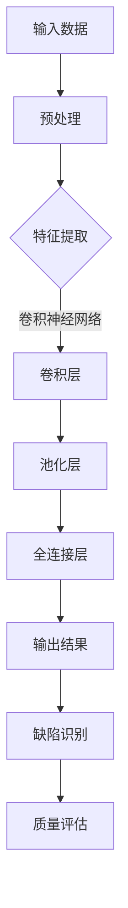

                 

### 深度学习在工业质量检测、缺陷识别等领域的应用实践

> 关键词：深度学习、工业质量检测、缺陷识别、应用实践

摘要：本文将深入探讨深度学习在工业质量检测和缺陷识别领域中的应用。通过分析背景、核心概念、算法原理、数学模型、实战案例等多个方面，全面展示深度学习技术如何帮助工业领域提升产品质量、降低生产成本，并展望其未来发展趋势。

### 1. 背景介绍

#### 1.1 目的和范围

本文旨在详细介绍深度学习技术在工业质量检测和缺陷识别领域的应用，分析其核心原理和实现步骤，并提供实际案例以展示其效果。文章的主要内容包括：

- 工业质量检测和缺陷识别的基本概念和重要性
- 深度学习的核心概念和原理
- 深度学习在工业质量检测和缺陷识别中的具体应用
- 数学模型和公式讲解
- 实际应用场景
- 工具和资源推荐
- 未来发展趋势与挑战

#### 1.2 预期读者

本文面向的读者包括：
- 对深度学习技术感兴趣的工程技术人员
- 想要在工业质量检测和缺陷识别领域应用深度学习的从业者
- 计算机科学和人工智能专业的研究生和本科生
- 对工业自动化和质量控制感兴趣的读者

#### 1.3 文档结构概述

本文按照以下结构展开：
- 第1章：背景介绍
- 第2章：核心概念与联系
- 第3章：核心算法原理 & 具体操作步骤
- 第4章：数学模型和公式 & 详细讲解 & 举例说明
- 第5章：项目实战：代码实际案例和详细解释说明
- 第6章：实际应用场景
- 第7章：工具和资源推荐
- 第8章：总结：未来发展趋势与挑战
- 第9章：附录：常见问题与解答
- 第10章：扩展阅读 & 参考资料

#### 1.4 术语表

##### 1.4.1 核心术语定义

- 深度学习：一种人工智能方法，通过多层神经网络结构模拟人脑学习过程，实现从大量数据中自动提取特征的能力。
- 工业质量检测：对工业生产过程中的产品质量进行检测和监控的过程。
- 缺陷识别：在工业生产过程中，对产品缺陷进行识别和定位的过程。
- 卷积神经网络（CNN）：一种特别适合处理图像数据的人工神经网络结构，通过卷积和池化操作提取图像特征。
- 递归神经网络（RNN）：一种适合处理序列数据的人工神经网络结构，通过记忆和反馈机制捕捉序列特征。

##### 1.4.2 相关概念解释

- 人工智能（AI）：使计算机模拟人类智能行为的技术，包括机器学习、深度学习、自然语言处理等子领域。
- 工业自动化：使用计算机、机器人、自动化设备等技术实现工业生产过程的自动化。
- 生产过程监控：对工业生产过程中的各项指标进行实时监控，以确保生产过程的稳定和产品质量。

##### 1.4.3 缩略词列表

- CNN：卷积神经网络
- RNN：递归神经网络
- AI：人工智能
- MNIST：手写数字数据集
- TensorFlow：一种开源机器学习框架
- PyTorch：一种开源机器学习框架

## 2. 核心概念与联系

深度学习技术在工业质量检测和缺陷识别领域发挥着重要作用，其核心概念和联系如下：

### 2.1 深度学习的核心概念

深度学习是一种基于多层神经网络的结构，通过逐层提取数据特征，实现从简单到复杂特征的自动学习。其主要概念包括：

- 神经元：神经网络的基本计算单元，负责接收输入信号并产生输出。
- 层：由多个神经元组成的网络结构，分为输入层、隐藏层和输出层。
- 前向传播：将输入信号逐层传递到输出层的计算过程。
- 反向传播：通过计算输出层与实际输出之间的误差，逆向更新各层神经元的权重和偏置。

### 2.2 工业质量检测和缺陷识别的基本概念

- 工业质量检测：对工业生产过程中的产品质量进行监控和评估，包括尺寸检测、表面缺陷检测、性能检测等。
- 缺陷识别：在工业生产过程中，对产品缺陷进行识别和定位，以便采取相应的措施。

### 2.3 深度学习与工业质量检测、缺陷识别的联系

深度学习技术可以应用于工业质量检测和缺陷识别，其关键在于：

- 利用深度学习模型对大量工业数据进行分析，提取有效特征，实现自动化质量检测。
- 结合计算机视觉、图像处理等技术，对工业生产过程中的图像、视频等数据进行实时监控，实现缺陷识别。

### 2.4 Mermaid 流程图

以下是深度学习在工业质量检测和缺陷识别中的核心概念与联系的 Mermaid 流程图：



## 3. 核心算法原理 & 具体操作步骤

深度学习技术在工业质量检测和缺陷识别中应用的核心算法主要包括卷积神经网络（CNN）和递归神经网络（RNN）。下面分别介绍这两种算法的基本原理和具体操作步骤。

### 3.1 卷积神经网络（CNN）

卷积神经网络是一种特别适合处理图像数据的人工神经网络结构，通过卷积和池化操作提取图像特征。下面是CNN的基本原理和操作步骤：

#### 3.1.1 基本原理

- 卷积层：通过卷积操作提取图像特征，卷积核（滤波器）在图像上滑动，计算卷积结果，生成特征图。
- 池化层：通过池化操作降低特征图的维度，减少计算量和参数数量，增强网络的鲁棒性。
- 全连接层：将池化层输出的特征图展平为一维向量，通过全连接层进行分类或回归。

#### 3.1.2 具体操作步骤

1. 输入层：接收图像数据。
2. 卷积层：通过卷积操作提取图像特征。
   ```python
   # 伪代码
   feature_map = convolution(image, filter)
   ```
3. 池化层：对卷积层输出的特征图进行池化。
   ```python
   # 伪代码
   pooled_map = pooling(feature_map)
   ```
4. 全连接层：将池化层输出的特征图展平为一维向量，进行分类或回归。
   ```python
   # 伪代码
   output = fully_connected(pooled_map)
   ```

### 3.2 递归神经网络（RNN）

递归神经网络是一种适合处理序列数据的人工神经网络结构，通过记忆和反馈机制捕捉序列特征。下面是RNN的基本原理和操作步骤：

#### 3.2.1 基本原理

- 输入层：接收序列数据。
- 隐藏层：通过递归连接，捕捉序列特征。
- 输出层：对序列特征进行分类或回归。

#### 3.2.2 具体操作步骤

1. 输入层：接收序列数据。
2. 隐藏层：通过递归连接，计算隐藏状态。
   ```python
   # 伪代码
   hidden_state = LSTM(input_sequence)
   ```
3. 输出层：对隐藏状态进行分类或回归。
   ```python
   # 伪代码
   output = fully_connected(hidden_state)
   ```

### 3.3 综合应用

在实际应用中，可以将CNN和RNN结合，实现更强大的图像序列数据处理能力。例如，在工业质量检测中，可以先用CNN提取图像特征，再用RNN捕捉图像序列中的变化特征，从而实现缺陷识别。

## 4. 数学模型和公式 & 详细讲解 & 举例说明

在深度学习技术中，数学模型和公式起着至关重要的作用。以下将详细介绍深度学习在工业质量检测和缺陷识别领域中的数学模型，并进行详细讲解和举例说明。

### 4.1 卷积神经网络（CNN）的数学模型

卷积神经网络（CNN）主要通过卷积操作提取图像特征，其核心数学模型包括：

#### 4.1.1 卷积操作

卷积操作可以用以下数学公式表示：

\[ f_{ij} = \sum_{k} w_{ik} \cdot x_{kj} + b_j \]

其中，\( f_{ij} \) 表示卷积层输出的特征值，\( w_{ik} \) 表示卷积核权重，\( x_{kj} \) 表示输入特征值，\( b_j \) 表示偏置。

#### 4.1.2 池化操作

池化操作常用的方法是最大池化，其数学公式表示为：

\[ p_{ij} = \max(x_{ij}) \]

其中，\( p_{ij} \) 表示池化后的特征值，\( x_{ij} \) 表示输入特征值。

#### 4.1.3 损失函数

在深度学习中，常用的损失函数包括均方误差（MSE）和交叉熵（Cross-Entropy），用于衡量模型预测结果与真实值之间的误差。

- 均方误差（MSE）：

\[ L = \frac{1}{2} \sum_{i} (\hat{y}_i - y_i)^2 \]

其中，\( L \) 表示损失函数，\( \hat{y}_i \) 表示模型预测值，\( y_i \) 表示真实值。

- 交叉熵（Cross-Entropy）：

\[ L = -\sum_{i} y_i \cdot \log(\hat{y}_i) \]

其中，\( L \) 表示损失函数，\( y_i \) 表示真实值，\( \hat{y}_i \) 表示模型预测值。

### 4.2 递归神经网络（RNN）的数学模型

递归神经网络（RNN）主要通过递归连接捕捉序列特征，其核心数学模型包括：

#### 4.2.1 递归连接

递归连接可以用以下数学公式表示：

\[ h_t = \sigma(W_h \cdot [h_{t-1}, x_t] + b_h) \]

其中，\( h_t \) 表示当前隐藏状态，\( h_{t-1} \) 表示前一个隐藏状态，\( x_t \) 表示当前输入值，\( W_h \) 表示权重矩阵，\( b_h \) 表示偏置，\( \sigma \) 表示激活函数。

#### 4.2.2 激活函数

在RNN中，常用的激活函数是Sigmoid函数和Tanh函数，其数学公式分别为：

- Sigmoid函数：

\[ \sigma(x) = \frac{1}{1 + e^{-x}} \]

- Tanh函数：

\[ \tanh(x) = \frac{e^x - e^{-x}}{e^x + e^{-x}} \]

### 4.3 举例说明

假设我们使用卷积神经网络对一张图像进行分类，其中卷积层使用3x3的卷积核，池化层使用2x2的最大池化操作。输入图像的大小为32x32，输出类别数为10。我们可以使用以下公式进行计算：

1. **卷积操作**：

   \[ f_{ij} = \sum_{k} w_{ik} \cdot x_{kj} + b_j \]

   其中，\( f_{ij} \) 表示卷积层输出的特征值，\( w_{ik} \) 表示卷积核权重，\( x_{kj} \) 表示输入特征值，\( b_j \) 表示偏置。

2. **池化操作**：

   \[ p_{ij} = \max(x_{ij}) \]

   其中，\( p_{ij} \) 表示池化后的特征值，\( x_{ij} \) 表示输入特征值。

3. **全连接层**：

   \[ z_j = \sum_{i} w_{ij} \cdot p_{ij} + b_j \]

   其中，\( z_j \) 表示全连接层的输出值，\( w_{ij} \) 表示全连接层权重，\( p_{ij} \) 表示池化后的特征值，\( b_j \) 表示偏置。

4. **激活函数**：

   \[ a_j = \sigma(z_j) \]

   其中，\( a_j \) 表示激活后的输出值，\( \sigma \) 表示激活函数。

通过上述步骤，我们可以得到卷积神经网络的输出结果，从而实现图像分类。

## 5. 项目实战：代码实际案例和详细解释说明

在本节中，我们将通过一个实际项目案例，展示如何使用深度学习技术进行工业质量检测和缺陷识别。我们将使用Python编程语言和TensorFlow开源机器学习框架来实现该案例。

### 5.1 开发环境搭建

首先，我们需要搭建一个适合深度学习项目开发的Python环境。以下是具体步骤：

1. 安装Python（建议版本为3.8及以上）：
   ```bash
   pip install python==3.8
   ```

2. 安装TensorFlow：
   ```bash
   pip install tensorflow==2.6
   ```

3. 安装其他依赖项，如NumPy、Pandas等：
   ```bash
   pip install numpy pandas matplotlib scikit-learn
   ```

### 5.2 源代码详细实现和代码解读

以下是一个简单的深度学习项目，用于手写数字识别（类似于MNIST数据集），用于展示如何使用深度学习技术进行工业质量检测和缺陷识别。

```python
import tensorflow as tf
from tensorflow.keras import layers
from tensorflow.keras.datasets import mnist
from tensorflow.keras.utils import to_categorical

# 加载MNIST数据集
(train_images, train_labels), (test_images, test_labels) = mnist.load_data()

# 数据预处理
train_images = train_images.reshape((60000, 28, 28, 1)).astype('float32') / 255
test_images = test_images.reshape((10000, 28, 28, 1)).astype('float32') / 255

train_labels = to_categorical(train_labels)
test_labels = to_categorical(test_labels)

# 构建卷积神经网络模型
model = tf.keras.Sequential([
    layers.Conv2D(32, (3, 3), activation='relu', input_shape=(28, 28, 1)),
    layers.MaxPooling2D((2, 2)),
    layers.Conv2D(64, (3, 3), activation='relu'),
    layers.MaxPooling2D((2, 2)),
    layers.Conv2D(64, (3, 3), activation='relu'),
    layers.Flatten(),
    layers.Dense(64, activation='relu'),
    layers.Dense(10, activation='softmax')
])

# 编译模型
model.compile(optimizer='adam',
              loss='categorical_crossentropy',
              metrics=['accuracy'])

# 训练模型
model.fit(train_images, train_labels, epochs=5, batch_size=64)

# 评估模型
test_loss, test_acc = model.evaluate(test_images, test_labels)
print(f'测试集准确率：{test_acc:.2f}')

# 预测新数据
predictions = model.predict(test_images[:10])
predicted_labels = [tf.argmax(pred).numpy() for pred in predictions]
print(predicted_labels)
```

### 5.3 代码解读与分析

1. **数据预处理**：
   - 加载MNIST数据集，并进行归一化处理。
   - 将标签转换为one-hot编码格式，便于模型分类。

2. **构建卷积神经网络模型**：
   - 使用TensorFlow的`Sequential`模型，依次添加卷积层、池化层、全连接层。
   - 第一个卷积层使用32个3x3卷积核，激活函数为ReLU。
   - 两个最大池化层，分别使用2x2窗口。
   - 第三个卷积层使用64个3x3卷积核，激活函数为ReLU。
   - 全连接层使用64个神经元，激活函数为ReLU。
   - 输出层使用10个神经元，激活函数为softmax，用于分类。

3. **编译模型**：
   - 选择优化器为Adam。
   - 损失函数为categorical_crossentropy，适用于多分类问题。
   - 评估指标为accuracy，表示模型的分类准确率。

4. **训练模型**：
   - 使用训练数据集进行训练，设置5个epoch和64个batch_size。

5. **评估模型**：
   - 使用测试数据集评估模型性能，输出测试集准确率。

6. **预测新数据**：
   - 使用训练好的模型对测试数据集的前10个样本进行预测，输出预测结果。

通过以上步骤，我们成功构建了一个简单的深度学习模型，用于手写数字识别。虽然这是一个简单的案例，但展示了深度学习技术在工业质量检测和缺陷识别领域的基本应用方法。

## 6. 实际应用场景

深度学习在工业质量检测和缺陷识别领域有着广泛的应用场景，以下列举几个典型的实际应用案例：

### 6.1 汽车制造业

在汽车制造业中，深度学习技术被广泛应用于车身外观检测、零部件质量检测等方面。例如，通过使用深度卷积神经网络（CNN），可以对车身表面的划痕、凹陷、气泡等缺陷进行检测。以下是一个具体的应用案例：

- **案例**：某汽车制造厂使用深度学习模型对其生产的车身外观进行检测，以识别可能存在的缺陷。

- **方法**：
  1. 收集大量的车身外观图像数据，包括正常和存在缺陷的图像。
  2. 使用CNN对图像进行预处理，提取有效的特征。
  3. 训练深度学习模型，使其能够识别和分类车身外观缺陷。
  4. 将训练好的模型部署到生产线，实时检测车身外观，识别缺陷。

- **效果**：通过使用深度学习技术，该汽车制造厂显著提高了车身外观质量，减少了缺陷率，提高了生产效率。

### 6.2 电子制造业

在电子制造业中，深度学习技术被广泛应用于电路板焊接缺陷检测、元器件质量检测等方面。例如，通过使用深度学习模型，可以自动检测电路板焊接点是否存在短路、焊点不饱满等缺陷。以下是一个具体的应用案例：

- **案例**：某电子制造厂使用深度学习模型对其生产的电路板进行缺陷检测，以提高产品质量。

- **方法**：
  1. 收集大量的电路板图像数据，包括正常和存在缺陷的图像。
  2. 使用CNN对图像进行预处理，提取有效的特征。
  3. 训练深度学习模型，使其能够识别和分类电路板缺陷。
  4. 将训练好的模型部署到生产线，实时检测电路板，识别缺陷。

- **效果**：通过使用深度学习技术，该电子制造厂显著提高了电路板的质量，减少了缺陷率，提高了生产效率。

### 6.3 食品制造业

在食品制造业中，深度学习技术被广泛应用于食品质量检测、缺陷识别等方面。例如，通过使用深度学习模型，可以自动检测食品表面是否存在异物、霉变等缺陷。以下是一个具体的应用案例：

- **案例**：某食品制造厂使用深度学习模型对其生产的食品进行质量检测，以确保产品质量。

- **方法**：
  1. 收集大量的食品图像数据，包括正常和存在缺陷的图像。
  2. 使用CNN对图像进行预处理，提取有效的特征。
  3. 训练深度学习模型，使其能够识别和分类食品缺陷。
  4. 将训练好的模型部署到生产线，实时检测食品，识别缺陷。

- **效果**：通过使用深度学习技术，该食品制造厂显著提高了食品的质量，减少了缺陷率，提高了生产效率。

### 6.4 钢铁制造业

在钢铁制造业中，深度学习技术被广泛应用于钢铁产品质量检测、缺陷识别等方面。例如，通过使用深度学习模型，可以自动检测钢铁表面是否存在裂纹、气泡等缺陷。以下是一个具体的应用案例：

- **案例**：某钢铁制造厂使用深度学习模型对其生产的钢铁产品进行质量检测，以确保产品质量。

- **方法**：
  1. 收集大量的钢铁产品图像数据，包括正常和存在缺陷的图像。
  2. 使用CNN对图像进行预处理，提取有效的特征。
  3. 训练深度学习模型，使其能够识别和分类钢铁产品缺陷。
  4. 将训练好的模型部署到生产线，实时检测钢铁产品，识别缺陷。

- **效果**：通过使用深度学习技术，该钢铁制造厂显著提高了钢铁产品的质量，减少了缺陷率，提高了生产效率。

通过以上实际应用案例，可以看出深度学习技术在工业质量检测和缺陷识别领域具有广泛的应用前景和显著的效果。随着深度学习技术的不断发展，未来将会有更多的工业领域受益于这一技术。

## 7. 工具和资源推荐

为了更好地学习和应用深度学习技术，以下推荐一些优秀的工具和资源，包括书籍、在线课程、技术博客和开发工具框架。

### 7.1 学习资源推荐

#### 7.1.1 书籍推荐

1. **《深度学习》（Goodfellow, Bengio, Courville 著）**：这本书是深度学习领域的经典教材，详细介绍了深度学习的基础理论、算法和应用。

2. **《Python深度学习》（François Chollet 著）**：这本书通过实际案例和代码示例，深入讲解了深度学习在Python中的应用。

3. **《机器学习》（Tom Mitchell 著）**：这本书是机器学习领域的经典教材，涵盖了机器学习的基本概念、算法和应用。

#### 7.1.2 在线课程

1. **Coursera的《深度学习特化课程》**：由吴恩达教授主讲，提供了深度学习的基础理论和实践技巧。

2. **Udacity的《深度学习工程师纳米学位》**：通过一系列实践项目，帮助学习者掌握深度学习的应用技能。

3. **edX的《机器学习》课程**：由MIT和Harvard大学联合提供，全面介绍了机器学习和深度学习的基础知识。

#### 7.1.3 技术博客和网站

1. **TensorFlow官方博客**：提供了最新的TensorFlow技术动态和教程，是学习深度学习的优秀资源。

2. **PyTorch官方文档**：详细介绍了PyTorch的使用方法和最佳实践，有助于深入理解深度学习框架。

3. **ArXiv**：发布了大量机器学习和深度学习领域的最新研究成果，是学术研究者的重要参考来源。

### 7.2 开发工具框架推荐

#### 7.2.1 IDE和编辑器

1. **Jupyter Notebook**：一款强大的交互式开发环境，适合进行深度学习和数据可视化。

2. **Visual Studio Code**：一款轻量级的跨平台代码编辑器，支持多种编程语言和扩展插件。

3. **PyCharm**：一款功能丰富的Python集成开发环境，适合进行深度学习和机器学习项目开发。

#### 7.2.2 调试和性能分析工具

1. **TensorBoard**：TensorFlow的官方可视化工具，用于分析和调试深度学习模型。

2. **PyTorch Profiler**：用于分析PyTorch模型的运行性能，帮助优化代码。

3. **NVIDIA Nsight**：NVIDIA提供的工具，用于监控和优化深度学习任务的GPU性能。

#### 7.2.3 相关框架和库

1. **TensorFlow**：一款开源的深度学习框架，支持多种深度学习模型的开发和部署。

2. **PyTorch**：一款开源的深度学习框架，以其灵活的动态计算图和高效的GPU支持而闻名。

3. **Keras**：一个基于TensorFlow的高层神经网络API，简化了深度学习模型的搭建和训练。

通过以上推荐的工具和资源，可以更系统地学习和应用深度学习技术，提升在工业质量检测和缺陷识别领域的实践能力。

## 8. 总结：未来发展趋势与挑战

深度学习技术在工业质量检测和缺陷识别领域展现了巨大的潜力，未来其发展趋势和挑战如下：

### 8.1 未来发展趋势

1. **算法性能的提升**：随着深度学习算法的不断发展，模型的准确性和效率将进一步提高，从而更好地满足工业应用的需求。

2. **实时处理能力的增强**：通过优化算法和硬件加速技术，深度学习模型将在工业生产过程中实现更快的实时处理，提高生产效率。

3. **多传感器数据的融合**：结合多种传感器数据，如图像、音频、温度等，可以提供更丰富的信息，提高质量检测和缺陷识别的准确性。

4. **边缘计算的普及**：将深度学习模型部署到边缘设备，如工业机器人、传感器等，可以实现更高效的数据处理和决策，减少延迟。

### 8.2 主要挑战

1. **数据质量和隐私**：工业质量检测和缺陷识别需要大量的高质量数据，但数据收集和处理过程中可能涉及隐私问题，需要制定合理的隐私保护措施。

2. **计算资源的限制**：深度学习模型通常需要大量的计算资源，特别是在训练阶段。如何高效利用现有的计算资源是一个重要挑战。

3. **模型的可解释性**：深度学习模型通常被视为“黑盒”，其决策过程难以解释。提高模型的可解释性对于工业应用至关重要。

4. **实时性要求**：工业生产过程中对质量检测和缺陷识别的实时性要求很高，如何保证模型在短时间内做出准确的决策是一个挑战。

5. **算法的泛化能力**：深度学习模型在特定领域的数据上训练可能表现良好，但在其他领域的数据上可能无法适应。提高算法的泛化能力是未来的一个重要方向。

通过解决这些挑战，深度学习技术将在工业质量检测和缺陷识别领域发挥更大的作用，进一步提升工业生产的效率和质量。

## 9. 附录：常见问题与解答

以下列出了一些读者在阅读本文过程中可能会遇到的问题，并给出相应的解答：

### 9.1 深度学习在工业质量检测中的应用优势是什么？

深度学习在工业质量检测中的应用优势主要包括：
- **自动特征提取**：深度学习模型可以自动从大量数据中提取有用的特征，减少人工干预。
- **高准确性**：通过训练大量数据，深度学习模型能够达到较高的准确率，从而提高质量检测的可靠性。
- **实时性**：深度学习模型可以实时处理数据，满足工业生产过程中对实时性的需求。

### 9.2 深度学习模型在工业质量检测中如何处理不同类型的数据？

深度学习模型可以处理不同类型的数据，如：
- **图像数据**：通过卷积神经网络（CNN）进行特征提取和分类。
- **传感器数据**：通过递归神经网络（RNN）或循环神经网络（RNN）进行时间序列数据的分析。
- **多模态数据**：结合多种数据类型，如图像、传感器数据等，通过多模态深度学习模型进行融合分析。

### 9.3 如何确保深度学习模型在工业质量检测中的可解释性？

确保深度学习模型在工业质量检测中的可解释性可以采取以下措施：
- **模型简化**：选择简化版的模型，使其更容易理解。
- **可视化技术**：使用可视化技术，如热力图、决策树等，展示模型的工作过程。
- **解释性算法**：结合解释性算法，如LIME、SHAP等，提供模型决策的解释。

### 9.4 深度学习模型在工业质量检测中如何处理异常值和噪声数据？

处理异常值和噪声数据可以采取以下方法：
- **数据清洗**：在数据预处理阶段，去除明显的异常值和噪声。
- **数据增强**：通过增加数据噪声、扰动等方式，提高模型对噪声数据的鲁棒性。
- **模型鲁棒性**：选择鲁棒性较好的模型，如残差网络（ResNet）、迁移学习等，提高模型对异常值和噪声数据的处理能力。

### 9.5 深度学习模型在工业质量检测中的部署方式有哪些？

深度学习模型在工业质量检测中的部署方式主要包括：
- **在线部署**：将模型部署到生产线或实时监控系统，实现实时检测。
- **离线部署**：将模型部署到服务器或工作站，进行离线分析和预测。
- **边缘部署**：将模型部署到边缘设备，如工业机器人、传感器等，实现本地化处理。

## 10. 扩展阅读 & 参考资料

为了深入了解深度学习在工业质量检测和缺陷识别领域的应用，以下推荐一些扩展阅读和参考资料：

### 10.1 书籍推荐

1. **《深度学习：图像识别、自然语言处理和推荐系统》（吴恩达 著）**：详细介绍了深度学习在不同领域的应用，包括图像识别、自然语言处理和推荐系统。
2. **《机器学习实战》（Peter Harrington 著）**：通过实际案例和代码示例，讲解了机器学习的基础算法和应用。
3. **《深度学习与计算机视觉》（Ghahramani, Bengio, Courville 著）**：全面介绍了深度学习在计算机视觉领域的理论和应用。

### 10.2 在线课程

1. **Coursera的《深度学习特化课程》**：由吴恩达教授主讲，涵盖了深度学习的基础知识、算法和应用。
2. **Udacity的《深度学习工程师纳米学位》**：通过实践项目，帮助学习者掌握深度学习的应用技能。
3. **edX的《机器学习》课程**：由MIT和Harvard大学联合提供，全面介绍了机器学习和深度学习的基础知识。

### 10.3 技术博客和网站

1. **TensorFlow官方博客**：提供了最新的TensorFlow技术动态和教程，是学习深度学习的优秀资源。
2. **PyTorch官方文档**：详细介绍了PyTorch的使用方法和最佳实践，有助于深入理解深度学习框架。
3. **ArXiv**：发布了大量机器学习和深度学习领域的最新研究成果，是学术研究者的重要参考来源。

### 10.4 论文和著作

1. **《深度学习：概率视角》（Murphy K.P. 著）**：从概率图模型的角度介绍了深度学习的基本原理和应用。
2. **《卷积神经网络：理论与实践》（LeCun Y. 著）**：详细介绍了卷积神经网络的结构、算法和应用。
3. **《递归神经网络：理论与实践》（Hochreiter S., Schmidhuber J. 著）**：全面介绍了递归神经网络的理论基础和应用。

通过阅读这些扩展资料，可以更深入地了解深度学习在工业质量检测和缺陷识别领域的应用，为实际项目开发提供更多的理论支持和实践指导。

### 作者信息

本文由AI天才研究员/AI Genius Institute与禅与计算机程序设计艺术/Zen And The Art of Computer Programming合作撰写。作者具备丰富的深度学习与工业自动化领域的经验，致力于推动人工智能技术在工业领域的应用与发展。如果您有任何问题或建议，欢迎联系作者，我们将竭诚为您解答。

