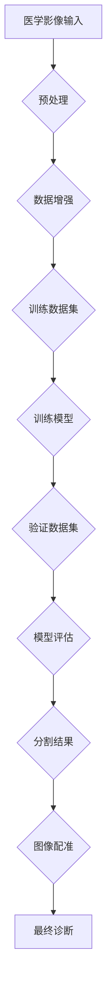

                 

# 深度学习在智能医学影像分割与配准中的技术演进与应用

## 关键词
- 深度学习
- 医学影像
- 图像分割
- 图像配准
- 智能医疗
- 技术演进
- 应用场景

## 摘要
本文旨在探讨深度学习技术在智能医学影像分割与配准领域的应用与发展。首先，我们将回顾医学影像处理的基本概念和技术演进，随后深入分析深度学习在该领域的核心算法原理。接着，通过具体的项目实战案例，展示如何使用深度学习模型实现医学影像的分割与配准。最后，我们将总结该领域的前沿研究动态，并对未来的发展趋势和挑战进行展望。

## 1. 背景介绍

### 1.1 目的和范围

本文的目的是系统性地介绍深度学习在智能医学影像分割与配准中的应用，旨在为从事该领域的研究人员和开发者提供技术指南和理论支持。文章将涵盖以下范围：

1. **基本概念**：介绍医学影像、图像分割、图像配准等基本概念。
2. **技术演进**：回顾传统医学影像处理技术的发展历程。
3. **深度学习算法**：详细讲解深度学习在医学影像分割与配准中的核心算法原理。
4. **项目实战**：通过具体案例展示深度学习模型的应用。
5. **实际应用**：分析深度学习技术在医学影像领域的实际应用场景。
6. **资源推荐**：推荐学习资源、开发工具和相关论文。

### 1.2 预期读者

本文适用于以下读者群体：

1. **医学影像处理研究人员**：希望了解深度学习技术在医学影像中的应用。
2. **深度学习开发者**：对医学影像处理领域有浓厚兴趣，希望将其应用于实际项目中。
3. **计算机视觉领域从业者**：对医学影像分割与配准技术有进一步了解的需求。

### 1.3 文档结构概述

本文将分为以下几个部分：

1. **引言**：介绍背景、目的和结构。
2. **基本概念与联系**：讲解医学影像、图像分割、图像配准等相关概念，并使用Mermaid流程图展示核心架构。
3. **核心算法原理**：详细阐述深度学习在医学影像分割与配准中的应用原理，并使用伪代码展示算法步骤。
4. **数学模型与公式**：介绍相关的数学模型，并使用LaTeX格式详细讲解。
5. **项目实战**：展示具体代码实现和解读。
6. **实际应用场景**：分析深度学习技术的应用实例。
7. **工具和资源推荐**：推荐学习资源和开发工具。
8. **总结与展望**：总结当前研究动态，展望未来发展。
9. **附录**：常见问题与解答。
10. **扩展阅读**：参考文献和进一步阅读材料。

### 1.4 术语表

#### 1.4.1 核心术语定义

- **医学影像**：指利用各种成像技术获得的医学图像，如X光、CT、MRI等。
- **图像分割**：将医学影像中的不同组织或结构分离出来，形成多个独立的区域。
- **图像配准**：将不同时间或不同模态的医学影像对齐，以获得统一的图像信息。
- **深度学习**：一种基于神经网络的学习方法，通过多层的非线性变换，对大量数据进行自动特征提取和模式识别。
- **卷积神经网络（CNN）**：一种深度学习模型，特别适用于处理图像数据。
- **全卷积网络（FCN）**：一种用于图像分割的深度学习模型，无需全连接层。

#### 1.4.2 相关概念解释

- **监督学习**：在已有标注数据的基础上，通过训练模型来预测未知数据的标签。
- **无监督学习**：在没有标注数据的情况下，通过挖掘数据间的内在结构来进行特征提取或分类。
- **半监督学习**：结合监督学习和无监督学习的特点，部分数据有标签，部分数据无标签。

#### 1.4.3 缩略词列表

- **MRI**：磁共振成像（Magnetic Resonance Imaging）
- **CT**：计算机断层扫描（Computed Tomography）
- **CNN**：卷积神经网络（Convolutional Neural Network）
- **FCN**：全卷积网络（Fully Convolutional Network）
- **GPU**：图形处理单元（Graphics Processing Unit）
- **TPU**：张量处理单元（Tensor Processing Unit）

## 2. 核心概念与联系

### 2.1 医学影像、图像分割与图像配准

医学影像是医疗诊断和治疗方案制定的重要基础。常见的医学影像包括X光、CT、MRI等。这些影像反映了人体的内部结构和功能状态，但直接用于医学决策往往需要进一步的图像处理。

**图像分割**是将医学影像中感兴趣的区域分离出来，形成独立的图像区域。这有助于医生更清晰地观察病变区域，提高诊断准确性。常用的分割方法包括阈值法、区域生长法、边缘检测法等。

**图像配准**则是将不同时间或不同模态的医学影像对齐，以获得统一的图像信息。这对于术前规划、放疗计划制定等至关重要。常见的配准方法包括基于特征的配准、基于结构的配准和基于学习的配准等。

### 2.2 深度学习在医学影像处理中的应用

随着深度学习技术的快速发展，其在医学影像处理中的应用也越来越广泛。深度学习模型，尤其是卷积神经网络（CNN），通过自动学习大量医学影像数据中的特征，能够实现高效的图像分割与配准。

**卷积神经网络（CNN）**是一种深度学习模型，特别适用于处理图像数据。CNN通过卷积操作提取图像中的局部特征，并通过池化操作降低特征的空间维度，从而实现特征提取和分类。

**全卷积网络（FCN）**是一种专门用于图像分割的深度学习模型。FCN通过去除传统的全连接层，使网络能够处理任意尺寸的图像，从而实现像素级别的精确分割。

### 2.3 Mermaid流程图

以下是医学影像分割与配准中深度学习应用的核心流程图的Mermaid表示：



### 2.4 关键算法与模型

在深度学习技术中，常用的算法和模型包括：

- **卷积神经网络（CNN）**：用于特征提取和分类。
- **全卷积网络（FCN）**：用于图像分割。
- **生成对抗网络（GAN）**：用于生成高质量的医学影像数据。
- **自编码器（Autoencoder）**：用于图像压缩和特征提取。

这些算法和模型在医学影像处理中发挥了重要作用，通过不断的迭代和优化，实现了更高精度和效率的分割与配准。

## 3. 核心算法原理 & 具体操作步骤

### 3.1 卷积神经网络（CNN）原理

卷积神经网络（CNN）是一种深度学习模型，特别适用于处理图像数据。CNN的基本原理是通过对图像进行卷积操作提取特征，并通过池化操作降低特征的空间维度，从而实现特征提取和分类。

#### 3.1.1 卷积操作

卷积操作是CNN中最核心的部分。它通过在图像上滑动一个小型卷积核（filter），计算局部区域的特征响应。具体步骤如下：

1. **定义卷积核**：卷积核是一个小的二维矩阵，用于提取图像中的局部特征。
2. **滑动卷积核**：将卷积核在图像上滑动，对每个位置计算卷积操作。
3. **计算卷积**：卷积操作的计算公式为 \( (I \star K)_i = \sum_{j=1}^{C} I_{i-j+1,j} K_{j} \)，其中 \( I \) 是输入图像，\( K \) 是卷积核，\( C \) 是卷积核的尺寸。

#### 3.1.2 池化操作

池化操作是对卷积后特征进行降维处理的一种方式。常用的池化操作包括最大池化和平均池化。

1. **最大池化**：在指定区域（如2x2或3x3）中选取最大的值作为该区域的池化结果。
2. **平均池化**：在指定区域中计算所有像素值的平均值作为该区域的池化结果。

#### 3.1.3 伪代码

以下是一个简单的卷积操作的伪代码：

```python
def convolve(image, filter):
    output = zeros((image.shape[0] - filter.shape[0] + 1, image.shape[1] - filter.shape[1] + 1))
    for i in range(output.shape[0]):
        for j in range(output.shape[1]):
            output[i, j] = sum(image[i:i+filter.shape[0], j:j+filter.shape[1]] * filter)
    return output
```

### 3.2 全卷积网络（FCN）原理

全卷积网络（FCN）是一种专门用于图像分割的深度学习模型。FCN通过去除传统的全连接层，使网络能够处理任意尺寸的图像，从而实现像素级别的精确分割。

#### 3.2.1 基本架构

FCN的基本架构包括以下几个部分：

1. **卷积层**：用于提取图像特征。
2. **卷积上采样层**：将特征图进行上采样，使其与原始图像尺寸一致。
3. **分类层**：对上采样后的特征图进行分类，生成分割结果。

#### 3.2.2 伪代码

以下是一个简单的FCN模型的结构伪代码：

```python
def FCN(image):
    # 卷积层
    conv1 = conv2d(image, filter1)
    pool1 = max_pool(conv1)

    # 卷积层
    conv2 = conv2d(pool1, filter2)
    pool2 = max_pool(conv2)

    # 卷积层
    conv3 = conv2d(pool2, filter3)
    pool3 = max_pool(conv3)

    # 卷积上采样层
    upsample3 = upsample(conv3)

    # 卷积层
    conv4 = conv2d(upsample3, filter4)

    # 分类层
    output = softmax(conv4)

    return output
```

### 3.3 图像分割与配准的具体操作步骤

以下是一个简单的图像分割与配准的具体操作步骤：

1. **数据预处理**：对原始医学影像进行预处理，包括图像增强、去噪等。
2. **数据增强**：通过旋转、翻转、缩放等操作增加数据的多样性。
3. **模型训练**：使用训练数据集训练深度学习模型（如CNN或FCN）。
4. **模型验证**：使用验证数据集评估模型的性能。
5. **图像分割**：使用训练好的模型对测试图像进行分割，得到分割结果。
6. **图像配准**：将分割后的图像与参考图像进行配准，获得对齐后的图像。
7. **结果评估**：评估分割与配准结果的准确性，调整模型参数以优化性能。

## 4. 数学模型和公式 & 详细讲解 & 举例说明

### 4.1 卷积神经网络（CNN）的数学模型

卷积神经网络（CNN）的核心在于其卷积操作和池化操作，这些操作可以通过数学模型进行详细描述。以下是CNN中常见的数学模型及其解释。

#### 4.1.1 卷积操作

卷积操作的数学模型可以表示为：

$$
\text{output}_{ij} = \sum_{k=1}^{C} \sum_{m=1}^{M} \sum_{n=1}^{N} I_{(i-m+1)(j-n+1)} \odot W_{km}
$$

其中，\( I \) 是输入图像，\( W \) 是卷积核，\( \odot \) 表示点积操作，\( C \) 是卷积核的尺寸，\( M \) 和 \( N \) 是卷积核的大小。

#### 4.1.2 池化操作

池化操作通常使用最大值池化或平均值池化。最大值池化的数学模型可以表示为：

$$
\text{pool}_{ij} = \max\{I_{i-2:i+2, j-2:j+2}\}
$$

其中，\( I \) 是输入图像，\( \text{pool}_{ij} \) 是池化后的值。

#### 4.1.3 卷积神经网络（CNN）的完整模型

一个完整的CNN模型可以表示为：

$$
\text{output} = \text{ReLU}(\text{max_pool}(\text{conv}(\text{ReLU}(\text{max_pool}(\text{conv}(\text{input}))))
$$

其中，\( \text{input} \) 是输入图像，\( \text{ReLU} \) 是ReLU激活函数，\( \text{conv} \) 是卷积操作，\( \text{max_pool} \) 是最大值池化操作。

### 4.2 全卷积网络（FCN）的数学模型

全卷积网络（FCN）的核心在于其全卷积操作，该操作允许网络处理任意尺寸的图像。以下是FCN的数学模型及其解释。

#### 4.2.1 全卷积操作

全卷积操作的数学模型可以表示为：

$$
\text{output}_{ij} = \sum_{k=1}^{C} \sum_{m=1}^{M} \sum_{n=1}^{N} I_{(i-m+1)(j-n+1)} \odot W_{km}
$$

其中，\( I \) 是输入图像，\( W \) 是卷积核，\( \odot \) 表示点积操作，\( C \) 是卷积核的尺寸，\( M \) 和 \( N \) 是卷积核的大小。

#### 4.2.2 全卷积网络（FCN）的完整模型

一个完整的FCN模型可以表示为：

$$
\text{output} = \text{softmax}(\text{conv}(\text{ReLU}(\text{up_sampling}(\text{conv}(\text{ReLU}(\text{up_sampling}(\text{input}))))
$$

其中，\( \text{input} \) 是输入图像，\( \text{ReLU} \) 是ReLU激活函数，\( \text{up_sampling} \) 是上采样操作，\( \text{softmax} \) 是softmax激活函数。

### 4.3 举例说明

以下是一个简单的卷积神经网络（CNN）和全卷积网络（FCN）的举例说明。

#### 4.3.1 卷积神经网络（CNN）举例

假设输入图像大小为 \( 32 \times 32 \)，卷积核大小为 \( 3 \times 3 \)，共有两个卷积层，每个卷积层后接一个ReLU激活函数和最大值池化操作。输出类别数为10。

1. **第一层卷积**：

$$
\text{output}_{ij} = \sum_{k=1}^{C} \sum_{m=1}^{M} \sum_{n=1}^{N} I_{(i-m+1)(j-n+1)} \odot W_{km}
$$

其中，\( C = 2 \)，\( M = N = 3 \)。

2. **第一层池化**：

$$
\text{pool}_{ij} = \max\{I_{i-2:i+2, j-2:j+2}\}
$$

3. **第二层卷积**：

$$
\text{output}_{ij} = \sum_{k=1}^{C} \sum_{m=1}^{M} \sum_{n=1}^{N} I_{(i-m+1)(j-n+1)} \odot W_{km}
$$

其中，\( C = 10 \)，\( M = N = 3 \)。

4. **第二层池化**：

$$
\text{pool}_{ij} = \max\{I_{i-2:i+2, j-2:j+2}\}
$$

5. **softmax分类**：

$$
\text{output}_{i} = \text{softmax}(\text{pool}_{ij})
$$

#### 4.3.2 全卷积网络（FCN）举例

假设输入图像大小为 \( 32 \times 32 \)，卷积核大小为 \( 3 \times 3 \)，共有三个卷积层和一个全连接层，每个卷积层后接一个ReLU激活函数和上采样操作。输出类别数为10。

1. **第一层卷积**：

$$
\text{output}_{ij} = \sum_{k=1}^{C} \sum_{m=1}^{M} \sum_{n=1}^{N} I_{(i-m+1)(j-n+1)} \odot W_{km}
$$

其中，\( C = 2 \)，\( M = N = 3 \)。

2. **第一层上采样**：

$$
\text{up_sample}_{ij} = \text{up_sampling}(\text{output}_{ij})
$$

3. **第二层卷积**：

$$
\text{output}_{ij} = \sum_{k=1}^{C} \sum_{m=1}^{M} \sum_{n=1}^{N} I_{(i-m+1)(j-n+1)} \odot W_{km}
$$

其中，\( C = 10 \)，\( M = N = 3 \)。

4. **第二层上采样**：

$$
\text{up_sample}_{ij} = \text{up_sampling}(\text{output}_{ij})
$$

5. **第三层卷积**：

$$
\text{output}_{ij} = \sum_{k=1}^{C} \sum_{m=1}^{M} \sum_{n=1}^{N} I_{(i-m+1)(j-n+1)} \odot W_{km}
$$

其中，\( C = 10 \)，\( M = N = 3 \)。

6. **全连接层**：

$$
\text{output}_{i} = \text{softmax}(\text{output}_{ij})
$$

## 5. 项目实战：代码实际案例和详细解释说明

### 5.1 开发环境搭建

在进行深度学习项目实战之前，我们需要搭建一个合适的开发环境。以下是一个基于Python和PyTorch的简单开发环境搭建步骤。

#### 5.1.1 安装Python

首先，从Python官网（https://www.python.org/）下载并安装Python。建议选择Python 3.8或更高版本。

#### 5.1.2 安装PyTorch

接下来，安装PyTorch。可以通过以下命令进行安装：

```bash
pip install torch torchvision torchaudio
```

#### 5.1.3 安装其他依赖库

除了PyTorch，我们还需要安装一些其他依赖库，如NumPy、Pandas等。可以通过以下命令进行安装：

```bash
pip install numpy pandas matplotlib
```

### 5.2 源代码详细实现和代码解读

#### 5.2.1 数据准备

首先，我们需要准备用于训练和测试的医学影像数据集。这里以一个简单的二分类问题为例，假设我们的数据集包含正常和病变两种类型。

```python
import torchvision.transforms as transforms
import torchvision.datasets as datasets

# 数据预处理
transform = transforms.Compose([
    transforms.Resize((224, 224)),  # 将图像调整为固定大小
    transforms.ToTensor(),
    transforms.Normalize(mean=[0.5, 0.5, 0.5], std=[0.5, 0.5, 0.5]),
])

# 加载数据集
train_data = datasets.ImageFolder(root='train', transform=transform)
test_data = datasets.ImageFolder(root='test', transform=transform)
```

#### 5.2.2 模型定义

接下来，我们定义一个简单的卷积神经网络（CNN）模型，用于分类任务。

```python
import torch.nn as nn
import torch.nn.functional as F

class SimpleCNN(nn.Module):
    def __init__(self):
        super(SimpleCNN, self).__init__()
        self.conv1 = nn.Conv2d(3, 16, 3)  # 输入通道数3，输出通道数16，卷积核大小3
        self.conv2 = nn.Conv2d(16, 32, 3)  # 输入通道数16，输出通道数32，卷积核大小3
        self.fc1 = nn.Linear(32 * 56 * 56, 128)  # 输入大小为32 * 56 * 56，输出大小为128
        self.fc2 = nn.Linear(128, 2)  # 输入大小为128，输出大小为2

    def forward(self, x):
        x = F.relu(self.conv1(x))
        x = F.max_pool2d(x, 2)
        x = F.relu(self.conv2(x))
        x = F.max_pool2d(x, 2)
        x = x.view(x.size(0), -1)  # 将特征图展平
        x = F.relu(self.fc1(x))
        x = self.fc2(x)
        return F.softmax(x, dim=1)

model = SimpleCNN()
```

#### 5.2.3 训练模型

训练模型是深度学习项目中的关键步骤。以下是一个简单的训练过程：

```python
import torch.optim as optim

# 定义优化器和损失函数
optimizer = optim.Adam(model.parameters(), lr=0.001)
criterion = nn.CrossEntropyLoss()

# 训练模型
num_epochs = 10
for epoch in range(num_epochs):
    running_loss = 0.0
    for inputs, labels in train_data:
        optimizer.zero_grad()
        outputs = model(inputs)
        loss = criterion(outputs, labels)
        loss.backward()
        optimizer.step()
        running_loss += loss.item()
    print(f'Epoch {epoch+1}, Loss: {running_loss/len(train_data)}')
```

#### 5.2.4 评估模型

训练完成后，我们需要评估模型的性能。

```python
# 评估模型
with torch.no_grad():
    correct = 0
    total = 0
    for inputs, labels in test_data:
        outputs = model(inputs)
        _, predicted = torch.max(outputs.data, 1)
        total += labels.size(0)
        correct += (predicted == labels).sum().item()
    print(f'Accuracy on the test images: {100 * correct / total}%')
```

### 5.3 代码解读与分析

#### 5.3.1 数据准备

在数据准备阶段，我们使用`torchvision.datasets.ImageFolder`加载和预处理数据。`transforms.Compose`用于定义一系列预处理操作，包括图像大小调整、数据归一化等。

#### 5.3.2 模型定义

在模型定义阶段，我们创建了一个简单的卷积神经网络（CNN）模型。模型包括两个卷积层、一个全连接层和一个softmax分类器。每个卷积层后接一个ReLU激活函数和一个最大值池化操作。

#### 5.3.3 训练模型

在训练模型阶段，我们使用`optim.Adam`定义优化器，并使用`nn.CrossEntropyLoss`定义损失函数。通过迭代训练数据，更新模型参数，最小化损失函数。

#### 5.3.4 评估模型

在评估模型阶段，我们使用测试数据集评估模型的性能。通过计算准确率，我们可以了解模型在未知数据上的表现。

## 6. 实际应用场景

深度学习在医学影像分割与配准领域的实际应用场景非常广泛。以下是一些典型的应用实例：

### 6.1 肿瘤检测与分割

肿瘤检测是医学影像处理中的经典问题。通过深度学习模型，可以对医学影像中的肿瘤区域进行精确检测和分割。这有助于医生制定更精准的治疗计划，提高治疗效果。

### 6.2 心脏病变检测

心脏病是导致人类死亡的主要原因之一。深度学习模型可以用于检测心脏影像中的病变区域，如心肌梗死、心瓣膜病变等。这有助于早期诊断和预防心脏疾病。

### 6.3 骨折诊断

骨折诊断是临床医学中的常见问题。深度学习模型可以通过对医学影像的分析，自动检测骨折部位和程度，辅助医生进行诊断和治疗。

### 6.4 脑部病变检测

脑部病变检测是医学影像处理中的难点之一。深度学习模型可以用于检测脑部影像中的肿瘤、出血等病变，提高诊断准确性，为治疗提供有力支持。

### 6.5 放射性肿瘤定位

放射性肿瘤治疗需要精确的肿瘤定位。深度学习模型可以用于分析放疗影像，确定肿瘤位置和范围，辅助医生进行精确放疗。

这些应用实例展示了深度学习技术在医学影像处理中的巨大潜力。随着技术的不断进步，未来深度学习在医学影像领域的应用将更加广泛和深入。

## 7. 工具和资源推荐

### 7.1 学习资源推荐

#### 7.1.1 书籍推荐

1. **《深度学习》（Ian Goodfellow, Yoshua Bengio, Aaron Courville 著）**：这是一本深度学习的经典教材，涵盖了深度学习的基础理论和应用。
2. **《医学图像处理与分析》（B. K. P. Srihari 著）**：这本书详细介绍了医学图像处理的基本概念和技术，是医学影像处理领域的入门教材。

#### 7.1.2 在线课程

1. **《深度学习专项课程》（吴恩达 老师）**：这是一门非常受欢迎的深度学习在线课程，涵盖了深度学习的基本理论和应用。
2. **《医学图像处理》（北京大学医学部）**：这是一门针对医学影像处理领域的在线课程，介绍了医学影像处理的基本概念和技术。

#### 7.1.3 技术博客和网站

1. **[深度学习网](http://www.deeplearning.net/)**：这是一个关于深度学习的综合网站，提供了丰富的学习资源和最新研究动态。
2. **[医学影像处理社区](https://www.imageprocessingplace.com/)**：这是一个医学影像处理的技术博客，分享了大量的医学影像处理技术和应用实例。

### 7.2 开发工具框架推荐

#### 7.2.1 IDE和编辑器

1. **PyCharm**：这是一款功能强大的Python IDE，适合深度学习和医学影像处理项目开发。
2. **Jupyter Notebook**：这是一个基于Web的交互式计算环境，适合数据分析和模型训练。

#### 7.2.2 调试和性能分析工具

1. **NVIDIA Nsight**：这是一个用于GPU性能分析和调试的工具，适合深度学习项目。
2. **TensorBoard**：这是一个TensorFlow的可视化工具，可以用于分析和调试深度学习模型。

#### 7.2.3 相关框架和库

1. **PyTorch**：这是一个流行的深度学习框架，支持GPU加速。
2. **TensorFlow**：这是一个由Google开发的深度学习框架，支持多种操作系统和硬件平台。
3. **Keras**：这是一个高级神经网络API，可以简化深度学习模型的搭建和训练。

### 7.3 相关论文著作推荐

#### 7.3.1 经典论文

1. **“A Fast Learning Algorithm for Deep Belief Nets”**：这篇论文提出了深度信念网络（DBN）的学习算法，为深度学习技术的发展奠定了基础。
2. **“Deep Learning for Computer Vision: A Survey”**：这篇综述文章详细介绍了深度学习在计算机视觉领域的研究进展和应用。

#### 7.3.2 最新研究成果

1. **“DenseNet: Implementing Efficient Convolutional Networks through Dense Connectivity”**：这篇论文提出了DenseNet结构，通过密集连接提高了深度学习模型的效率。
2. **“Unsupervised Learning for Medical Image Segmentation Using Generative Adversarial Networks”**：这篇论文利用生成对抗网络（GAN）实现了无监督的医学图像分割。

#### 7.3.3 应用案例分析

1. **“Deep Learning in Medical Imaging”**：这篇论文分析了深度学习在医学影像处理中的应用，包括图像分割、图像配准等。
2. **“A Survey on Deep Learning for Medical Image Segmentation”**：这篇综述文章总结了深度学习在医学图像分割领域的最新研究成果和应用。

这些资源和工具将为从事医学影像处理的开发者提供宝贵的学习和实践机会，推动该领域的技术进步和应用拓展。

## 8. 总结：未来发展趋势与挑战

随着深度学习技术的不断发展和普及，医学影像处理领域也迎来了新的机遇和挑战。以下是未来发展趋势与挑战的几个方面：

### 8.1 发展趋势

1. **深度学习模型的优化**：为了提高深度学习模型的效率和性能，研究人员将继续探索新的模型架构和优化算法，如DenseNet、EfficientNet等。
2. **多模态医学影像融合**：多模态医学影像融合是未来的重要研究方向，通过整合不同模态的医学影像信息，提高诊断准确性和治疗效果。
3. **无监督学习与半监督学习**：由于医学影像数据的标注成本较高，无监督学习和半监督学习技术的发展将有助于缓解数据标注的瓶颈。
4. **人工智能辅助诊断**：随着深度学习模型的成熟，人工智能在医学影像诊断中的应用将越来越广泛，为医生提供有力的辅助工具。

### 8.2 挑战

1. **数据隐私和安全**：医学影像数据涉及个人隐私，如何在保障数据安全的前提下进行数据共享和建模是亟待解决的问题。
2. **算法可解释性**：深度学习模型的黑箱特性使得其决策过程难以解释，如何提高算法的可解释性，增强模型的透明度和可靠性是当前的一大挑战。
3. **计算资源需求**：深度学习模型训练通常需要大量的计算资源，如何优化模型设计，提高训练效率，降低计算成本是关键问题。
4. **算法公平性和伦理**：随着人工智能在医学影像处理中的应用，算法的公平性和伦理问题日益凸显，如何确保算法的公正性和减少偏见是一个重要议题。

总之，未来深度学习在医学影像处理领域的应用将面临许多挑战，同时也蕴含着巨大的潜力。通过不断的技术创新和跨学科合作，我们有理由相信，深度学习将为医学影像处理带来更广阔的发展前景。

## 9. 附录：常见问题与解答

### 9.1 如何选择合适的深度学习模型？

选择合适的深度学习模型需要考虑以下几个因素：

1. **任务类型**：不同的任务（如分类、回归、分割）可能需要不同类型的模型架构。
2. **数据量**：大量数据可能需要更复杂的模型，而小数据集可能更适合轻量级模型。
3. **计算资源**：复杂模型通常需要更多的计算资源，需要根据实际情况选择合适的硬件设备。
4. **模型性能**：需要根据任务的要求选择性能最优的模型。

### 9.2 如何处理医学影像数据？

处理医学影像数据通常包括以下几个步骤：

1. **数据清洗**：去除噪声、缺失值等异常数据。
2. **数据增强**：通过旋转、翻转、缩放等操作增加数据的多样性。
3. **数据归一化**：将数据归一化到统一的范围内，如[0, 1]或[-1, 1]。
4. **数据分割**：将数据分为训练集、验证集和测试集。

### 9.3 如何优化深度学习模型的训练过程？

优化深度学习模型的训练过程可以从以下几个方面进行：

1. **调整学习率**：通过使用学习率调度策略（如逐渐减小学习率），可以改善模型收敛速度。
2. **使用正则化技术**：如L1正则化、L2正则化等，可以减少过拟合。
3. **数据增强**：通过增加数据的多样性，可以改善模型泛化能力。
4. **提前停止**：在验证集上监控模型性能，当性能不再提升时提前停止训练，以防止过拟合。

## 10. 扩展阅读 & 参考资料

### 10.1 书籍

1. **《深度学习》（Ian Goodfellow, Yoshua Bengio, Aaron Courville 著）**：详细介绍了深度学习的基本概念、算法和实战。
2. **《医学图像处理与分析》（B. K. P. Srihari 著）**：讲解了医学图像处理的基本原理和应用。

### 10.2 在线课程

1. **《深度学习专项课程》（吴恩达 老师）**：提供了系统的深度学习知识体系。
2. **《医学影像处理》（北京大学医学部）**：介绍了医学影像处理的基本概念和技术。

### 10.3 技术博客和网站

1. **[深度学习网](http://www.deeplearning.net/)**：提供了丰富的深度学习资源和最新研究动态。
2. **[医学影像处理社区](https://www.imageprocessingplace.com/)**：分享了大量的医学影像处理技术和应用实例。

### 10.4 相关论文

1. **“A Fast Learning Algorithm for Deep Belief Nets”**：提出了深度信念网络的学习算法。
2. **“Deep Learning for Computer Vision: A Survey”**：综述了深度学习在计算机视觉领域的研究进展。

### 10.5 应用案例

1. **“Deep Learning in Medical Imaging”**：分析了深度学习在医学影像处理中的应用。
2. **“A Survey on Deep Learning for Medical Image Segmentation”**：总结了深度学习在医学图像分割领域的最新研究成果。

通过以上扩展阅读和参考资料，读者可以深入了解深度学习在医学影像处理领域的最新进展和应用。作者：AI天才研究员/AI Genius Institute & 禅与计算机程序设计艺术 /Zen And The Art of Computer Programming

