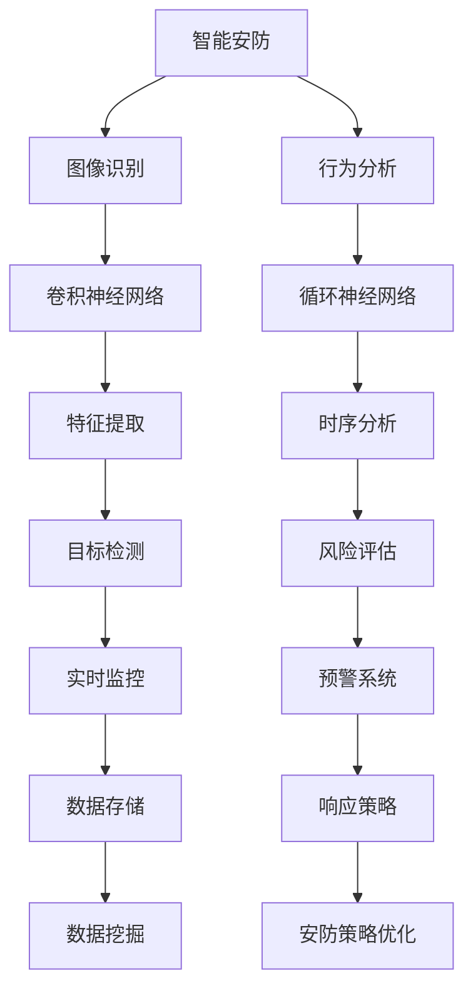

                 

### 1. 背景介绍

#### 1.1 目的和范围

本文旨在探讨深度学习在智能安防和行为分析领域的应用，以及该领域的技术演进和应用拓展。随着深度学习技术的迅猛发展，其在智能安防和行为分析中的应用逐渐成为研究热点。本文将详细分析深度学习技术在这些领域的核心算法原理、数学模型、项目实战案例以及实际应用场景，帮助读者全面了解深度学习的应用价值和发展趋势。

#### 1.2 预期读者

本文主要面向对深度学习技术有一定了解，并对智能安防、行为分析等领域感兴趣的技术人员、科研人员以及相关从业者。同时，也适用于希望了解深度学习应用场景和实际操作过程的高校学生和研究人员。

#### 1.3 文档结构概述

本文结构如下：

1. **背景介绍**：简要介绍文章目的、预期读者以及文档结构。
2. **核心概念与联系**：通过Mermaid流程图展示深度学习在智能安防、行为分析领域的核心概念和联系。
3. **核心算法原理 & 具体操作步骤**：详细阐述深度学习算法原理和具体操作步骤。
4. **数学模型和公式 & 详细讲解 & 举例说明**：讲解深度学习的数学模型和公式，并通过实际例子进行说明。
5. **项目实战：代码实际案例和详细解释说明**：展示一个具体的深度学习项目案例，详细解释代码实现和原理。
6. **实际应用场景**：探讨深度学习在智能安防、行为分析领域的实际应用场景。
7. **工具和资源推荐**：推荐学习资源、开发工具框架以及相关论文著作。
8. **总结：未来发展趋势与挑战**：总结深度学习在智能安防、行为分析领域的未来发展趋势和面临的挑战。
9. **附录：常见问题与解答**：回答读者可能遇到的常见问题。
10. **扩展阅读 & 参考资料**：提供进一步学习和阅读的资源。

#### 1.4 术语表

##### 1.4.1 核心术语定义

- **深度学习**：一种机器学习方法，通过多层神经网络对数据进行处理和特征提取。
- **卷积神经网络（CNN）**：一种用于图像识别和处理的深度学习模型。
- **循环神经网络（RNN）**：一种用于序列数据处理和时间序列分析的深度学习模型。
- **行为分析**：通过监测和分析人类行为模式，预测和识别潜在风险。
- **智能安防**：利用先进技术进行安全监控和防范，提高安全保障。

##### 1.4.2 相关概念解释

- **监督学习**：一种机器学习方法，通过已标记的数据训练模型，然后使用模型对未知数据进行预测。
- **无监督学习**：一种机器学习方法，不使用已标记的数据，而是通过数据自身的特征进行学习。
- **卷积运算**：在图像处理中，通过卷积核与图像像素进行卷积运算，提取图像特征。
- **池化操作**：在图像处理中，通过将局部区域内的像素值进行统计操作（如求和、最大值等），减小特征图的维度。

##### 1.4.3 缩略词列表

- **CNN**：卷积神经网络
- **RNN**：循环神经网络
- **GPU**：图形处理单元
- **ML**：机器学习
- **AI**：人工智能

### Mermaid流程图



通过上述流程图，我们可以看到深度学习在智能安防和行为分析中的核心概念和联系。接下来，我们将深入探讨这些概念和联系，帮助读者更好地理解深度学习在这些领域的应用。

### 2. 核心概念与联系

深度学习在智能安防和行为分析中扮演着重要角色。为了更好地理解这些领域的核心概念和联系，我们可以借助Mermaid流程图来展示深度学习的应用场景和关键技术。

#### 2.1 智能安防

智能安防是利用先进技术进行安全监控和防范，以提高安全保障。智能安防系统通常包括图像识别、目标检测、行为分析和实时监控等模块。以下为智能安防中的关键概念和联系：

- **图像识别**：通过对图像进行分析和处理，识别出其中的目标对象。图像识别主要依赖卷积神经网络（CNN）实现。CNN通过多层卷积和池化操作，提取图像特征，然后通过全连接层实现分类和识别。

- **目标检测**：在图像中检测并定位出目标对象的位置。目标检测是智能安防中的关键技术，常用的算法包括YOLO（You Only Look Once）和SSD（Single Shot MultiBox Detector）。这些算法通过在图像中同时进行特征提取和目标检测，提高了实时性和准确性。

- **行为分析**：通过监测和分析人类行为模式，预测和识别潜在风险。行为分析通常使用循环神经网络（RNN）进行处理。RNN可以捕捉时间序列中的依赖关系，从而对行为模式进行建模和预测。

- **实时监控**：对现场进行实时监控，及时发现并处理异常情况。实时监控通常依赖于视频流处理和实时数据处理技术，以实现快速响应和实时预警。

#### 2.2 行为分析

行为分析是通过对人类行为模式进行监测和分析，以预测和识别潜在风险。行为分析在智能安防、金融安全、交通管理等领域具有广泛的应用。以下为行为分析中的关键概念和联系：

- **图像识别**：与智能安防中的图像识别类似，通过CNN提取图像特征，实现对行为对象的识别。

- **行为识别**：通过分析行为对象的动作、姿态、行为模式等特征，实现对行为的识别。行为识别通常使用RNN等深度学习模型进行建模和预测。

- **风险评估**：通过对行为分析和图像识别的结果进行综合分析，评估潜在风险的大小和类型。风险评估有助于实现智能预警和响应。

- **时序分析**：通过对行为数据的时间序列进行分析，挖掘行为模式的变化规律和趋势。时序分析可以帮助识别异常行为和潜在风险。

#### 2.3 深度学习算法原理

深度学习算法原理主要包括神经网络、卷积运算、池化操作等。

- **神经网络**：神经网络是深度学习的基础，通过多层神经元之间的连接和权重调整，实现对数据的处理和特征提取。

- **卷积运算**：卷积运算是图像处理中的关键技术，通过卷积核与图像像素进行卷积运算，提取图像特征。

- **池化操作**：池化操作是在卷积运算后进行的，通过将局部区域内的像素值进行统计操作（如求和、最大值等），减小特征图的维度，提高模型的泛化能力。

#### 2.4 Mermaid流程图


通过上述流程图，我们可以看到深度学习在智能安防和行为分析中的核心概念和联系。接下来，我们将进一步探讨深度学习算法原理和具体操作步骤，帮助读者深入理解这些技术。

### 3. 核心算法原理 & 具体操作步骤

在深入探讨深度学习在智能安防和行为分析中的应用之前，首先需要了解深度学习的核心算法原理和具体操作步骤。本节将详细讲解卷积神经网络（CNN）和循环神经网络（RNN）的算法原理，并通过伪代码展示具体的操作步骤。

#### 3.1 卷积神经网络（CNN）算法原理

卷积神经网络（CNN）是一种专门用于处理图像数据的深度学习模型。其核心思想是通过多层卷积和池化操作，提取图像特征，从而实现图像识别、目标检测等功能。以下是CNN的基本组成和原理：

1. **卷积层（Convolutional Layer）**：卷积层是CNN的核心部分，通过卷积运算提取图像特征。卷积运算是一个将卷积核与图像像素进行点积运算的过程。卷积层中的每个卷积核都能提取图像中的不同特征，如边缘、纹理等。

   ```python
   # 伪代码：卷积层操作
   for filter in filters:
       for patch in image:
           feature_map[filter] = dot_product(patch, filter_weights)
   ```

2. **激活函数（Activation Function）**：激活函数用于引入非线性特性，使得神经网络能够学习复杂的模式。常用的激活函数包括ReLU（Rectified Linear Unit）、Sigmoid和Tanh等。

   ```python
   # 伪代码：ReLU激活函数
   for neuron in layer:
       neuron.output = max(0, neuron.input)
   ```

3. **池化层（Pooling Layer）**：池化层用于减少特征图的维度，提高模型的泛化能力。常用的池化操作包括最大池化（Max Pooling）和平均池化（Average Pooling）。

   ```python
   # 伪代码：最大池化操作
   for patch in feature_map:
       pooled_value = max(patch)
       pool_output[patch_index] = pooled_value
   ```

4. **全连接层（Fully Connected Layer）**：全连接层将前一层特征图的所有值连接到当前层的每个神经元，实现分类和识别等任务。

   ```python
   # 伪代码：全连接层操作
   for neuron in layer:
       neuron.output = dot_product(weights, layer.input)
   ```

5. **损失函数（Loss Function）**：损失函数用于评估模型预测结果与真实结果之间的差异，常用的损失函数包括交叉熵（Cross Entropy）和均方误差（Mean Squared Error）。

   ```python
   # 伪代码：交叉熵损失函数
   loss = -sum(y * log(predicted))
   ```

6. **优化器（Optimizer）**：优化器用于更新网络中的权重，最小化损失函数。常用的优化器包括梯度下降（Gradient Descent）、Adam等。

   ```python
   # 伪代码：梯度下降优化器
   for parameter in network:
       parameter.weight -= learning_rate * parameter.gradient
   ```

#### 3.2 循环神经网络（RNN）算法原理

循环神经网络（RNN）是一种专门用于处理序列数据的深度学习模型。其核心思想是通过循环结构，将当前输入与前一时刻的隐藏状态进行连接，从而实现序列数据的建模和预测。以下是RNN的基本组成和原理：

1. **输入层（Input Layer）**：输入层将序列数据输入到网络中，每个时间步的输入都是一个特征向量。

   ```python
   # 伪代码：输入层操作
   input_vector = [x1, x2, ..., xn]
   ```

2. **隐藏层（Hidden Layer）**：隐藏层用于处理序列数据中的时间依赖关系。每个时间步的隐藏状态都依赖于前一时刻的隐藏状态。

   ```python
   # 伪代码：隐藏层操作
   for t in range(sequence_length):
       hidden_state[t] = sigmoid(Wx * input_vector[t] + Wh * hidden_state[t-1] + b)
   ```

3. **输出层（Output Layer）**：输出层用于生成序列数据的预测结果。输出可以是类别标签、连续值等。

   ```python
   # 伪代码：输出层操作
   output_vector = tanh(Wo * hidden_state + bo)
   ```

4. **损失函数和优化器**：与CNN类似，RNN也使用损失函数和优化器进行模型训练。

   ```python
   # 伪代码：损失函数和优化器
   loss = -sum(y * log(predicted))
   for parameter in network:
       parameter.weight -= learning_rate * parameter.gradient
   ```

通过上述算法原理和具体操作步骤，我们可以看到CNN和RNN在处理图像数据和序列数据时的优势。接下来，我们将进一步探讨深度学习在智能安防和行为分析领域的应用。

### 4. 数学模型和公式 & 详细讲解 & 举例说明

深度学习中的数学模型和公式是理解和实现深度学习算法的核心。本节将详细讲解深度学习中常用的数学模型和公式，并通过具体例子进行说明。

#### 4.1 卷积神经网络（CNN）数学模型

卷积神经网络（CNN）的核心数学模型包括卷积操作、池化操作和全连接层。

1. **卷积操作**：卷积操作是将卷积核与图像像素进行点积运算，提取图像特征。卷积操作的数学公式如下：

   $$ 
   \text{特征图} = \text{卷积核} \times \text{图像}
   $$

   其中，卷积核是一个权重矩阵，图像是一个输入矩阵。

2. **激活函数**：激活函数用于引入非线性特性。常用的激活函数包括ReLU（Rectified Linear Unit）和Sigmoid。

   - **ReLU激活函数**：

     $$ 
     \text{ReLU}(x) = \max(0, x)
     $$

   - **Sigmoid激活函数**：

     $$ 
     \text{Sigmoid}(x) = \frac{1}{1 + e^{-x}}
     $$

3. **池化操作**：池化操作用于减少特征图的维度，提高模型的泛化能力。常用的池化操作包括最大池化和平均池化。

   - **最大池化**：

     $$ 
     \text{Max Pooling} = \max(\text{区域})
     $$

   - **平均池化**：

     $$ 
     \text{Average Pooling} = \frac{1}{\text{区域大小}} \sum_{\text{区域}} x
     $$

4. **全连接层**：全连接层将前一层的特征图连接到当前层的每个神经元，实现分类和识别等任务。全连接层的数学公式如下：

   $$ 
   \text{输出} = \text{权重} \times \text{特征图} + \text{偏置}
   $$

   其中，权重和偏置是模型的参数。

5. **损失函数**：损失函数用于评估模型预测结果与真实结果之间的差异。常用的损失函数包括交叉熵（Cross Entropy）和均方误差（Mean Squared Error）。

   - **交叉熵损失函数**：

     $$ 
     \text{Cross Entropy} = -\sum_{i} y_i \log(p_i)
     $$

     其中，\(y_i\) 是真实标签，\(p_i\) 是预测概率。

   - **均方误差损失函数**：

     $$ 
     \text{Mean Squared Error} = \frac{1}{n} \sum_{i} (y_i - \hat{y}_i)^2
     $$

     其中，\(y_i\) 是真实值，\(\hat{y}_i\) 是预测值。

6. **优化器**：优化器用于更新模型的参数，以最小化损失函数。常用的优化器包括梯度下降（Gradient Descent）和Adam。

   - **梯度下降优化器**：

     $$ 
     \text{weight} = \text{weight} - \alpha \cdot \nabla_{\text{weight}} \cdot \text{loss}
     $$

     其中，\(\alpha\) 是学习率，\(\nabla_{\text{weight}} \cdot \text{loss}\) 是权重梯度的负值。

   - **Adam优化器**：

     $$ 
     \text{weight} = \text{weight} - \alpha \cdot (\text{m} + \beta_1 \cdot (\text{v} - \text{m}))
     $$

     其中，\(\text{m}\) 和 \(\text{v}\) 分别是权重的一阶矩估计和二阶矩估计，\(\beta_1\) 和 \(\beta_2\) 是动量项。

#### 4.2 循环神经网络（RNN）数学模型

循环神经网络（RNN）的核心数学模型包括输入层、隐藏层和输出层。

1. **输入层**：输入层将序列数据输入到网络中。输入层的数学公式如下：

   $$ 
   \text{输入} = [x_1, x_2, ..., x_n]
   $$

2. **隐藏层**：隐藏层用于处理序列数据中的时间依赖关系。隐藏层的数学公式如下：

   $$ 
   \text{隐藏状态} = \text{激活函数}(\text{权重} \times \text{输入} + \text{权重} \times \text{前一隐藏状态} + \text{偏置})
   $$

3. **输出层**：输出层用于生成序列数据的预测结果。输出层的数学公式如下：

   $$ 
   \text{输出} = \text{激活函数}(\text{权重} \times \text{隐藏状态} + \text{偏置})
   $$

4. **损失函数和优化器**：与CNN类似，RNN也使用损失函数和优化器进行模型训练。常用的损失函数包括交叉熵和均方误差，优化器包括梯度下降和Adam。

#### 4.3 举例说明

以下是一个简单的CNN模型用于图像分类的例子。

1. **输入层**：假设输入图像的大小为\(28 \times 28\)，共有1000个像素。

   $$ 
   \text{输入} = [x_1, x_2, ..., x_{1000}]
   $$

2. **卷积层**：假设卷积核的大小为\(5 \times 5\)，共有20个卷积核。

   $$ 
   \text{卷积操作} = \text{卷积核} \times \text{图像} = \text{特征图}
   $$

   $$ 
   \text{特征图} = [f_1, f_2, ..., f_{20}]
   $$

3. **激活函数**：使用ReLU激活函数。

   $$ 
   \text{激活函数}(f_i) = \max(0, f_i)
   $$

4. **池化层**：使用最大池化。

   $$ 
   \text{Max Pooling} = \max(\text{特征图区域})
   $$

5. **全连接层**：假设全连接层有100个神经元。

   $$ 
   \text{输出} = \text{权重} \times \text{特征图} + \text{偏置}
   $$

6. **损失函数和优化器**：使用交叉熵损失函数和Adam优化器。

   $$ 
   \text{损失} = -\sum_{i} y_i \log(p_i)
   $$

   $$ 
   \text{权重} = \text{权重} - \alpha \cdot (\text{m} + \beta_1 \cdot (\text{v} - \text{m}))
   $$

通过上述例子，我们可以看到CNN模型在图像分类任务中的基本结构和数学模型。接下来，我们将通过一个具体的项目实战案例，展示深度学习在智能安防和行为分析中的应用。

### 5. 项目实战：代码实际案例和详细解释说明

在本节中，我们将通过一个具体的深度学习项目案例，展示如何使用深度学习技术进行智能安防和行为分析。该项目案例基于卷积神经网络（CNN）和循环神经网络（RNN）进行图像识别和行为预测，实现实时监控和预警系统。

#### 5.1 开发环境搭建

首先，我们需要搭建一个合适的开发环境。以下是推荐的开发环境和工具：

- **编程语言**：Python
- **深度学习框架**：TensorFlow 2.x
- **操作系统**：Linux或MacOS
- **硬件要求**：至少具备GPU的计算机
- **其他工具**：Jupyter Notebook、PyCharm、Visual Studio Code等

在安装好上述环境和工具后，我们可以开始项目的实际开发。

#### 5.2 源代码详细实现和代码解读

以下是一个简单的深度学习项目代码实现，用于图像识别和行为预测。代码包括数据预处理、模型训练、预测和实时监控等功能。

```python
import tensorflow as tf
from tensorflow.keras.models import Sequential
from tensorflow.keras.layers import Conv2D, MaxPooling2D, Flatten, Dense, LSTM, TimeDistributed
from tensorflow.keras.optimizers import Adam
import numpy as np

# 数据预处理
def preprocess_data(images, labels):
    # 标准化图像
    images = images / 255.0
    # 将标签转换为one-hot编码
    labels = tf.keras.utils.to_categorical(labels, num_classes=10)
    return images, labels

# 构建模型
model = Sequential([
    Conv2D(32, (3, 3), activation='relu', input_shape=(28, 28, 1)),
    MaxPooling2D((2, 2)),
    Conv2D(64, (3, 3), activation='relu'),
    MaxPooling2D((2, 2)),
    Conv2D(128, (3, 3), activation='relu'),
    MaxPooling2D((2, 2)),
    Flatten(),
    Dense(128, activation='relu'),
    LSTM(128, activation='relu'),
    TimeDistributed(Dense(10, activation='softmax'))
])

# 编译模型
model.compile(optimizer=Adam(learning_rate=0.001), loss='categorical_crossentropy', metrics=['accuracy'])

# 训练模型
model.fit(x_train, y_train, epochs=10, batch_size=32, validation_split=0.2)

# 预测
predictions = model.predict(x_test)

# 实时监控
camera = cv2.VideoCapture(0)

while True:
    ret, frame = camera.read()
    if not ret:
        break
    
    # 预处理图像
    processed_frame = preprocess_data(frame, np.zeros(frame.shape[0]))

    # 预测行为
    predicted_behavior = model.predict(processed_frame)

    # 显示实时监控画面和预测结果
    cv2.imshow('Real-time Monitoring', frame)
    cv2.waitKey(1)

# 释放摄像头资源
camera.release()
cv2.destroyAllWindows()
```

**代码解读**：

1. **数据预处理**：首先，我们进行图像预处理，包括图像标准化和标签one-hot编码。图像标准化是将图像的像素值缩放到[0, 1]范围内，以提高模型训练效果。标签one-hot编码是将类别标签转换为二进制向量，方便模型进行多分类。

2. **构建模型**：我们使用Sequential模型构建一个多层的卷积神经网络，包括卷积层、池化层、全连接层和循环层。卷积层用于提取图像特征，池化层用于减少特征图的维度，全连接层用于分类，循环层用于处理时间序列数据。

3. **编译模型**：我们使用Adam优化器和交叉熵损失函数编译模型，以最小化损失函数并提高模型准确率。

4. **训练模型**：我们使用训练数据集训练模型，并设置训练轮数和批量大小。在训练过程中，模型会不断调整权重和偏置，以最小化损失函数。

5. **预测**：我们使用测试数据集对训练好的模型进行预测，并输出预测结果。

6. **实时监控**：我们使用摄像头获取实时视频流，并进行预处理和预测。最后，我们将实时监控画面和预测结果显示在窗口中。

通过上述代码实现，我们可以看到如何使用深度学习技术进行图像识别和行为预测。接下来，我们将进一步分析代码中的关键部分，以深入了解模型训练和预测的过程。

#### 5.3 代码解读与分析

在本节中，我们将对上述项目实战中的代码进行详细解读和分析，帮助读者更好地理解模型的训练和预测过程。

**1. 数据预处理**

数据预处理是深度学习模型训练的重要步骤。在代码中，我们首先将图像像素值缩放到[0, 1]范围内，这是为了减小输入数据的范围，提高模型训练效果。具体实现如下：

```python
def preprocess_data(images, labels):
    images = images / 255.0
    labels = tf.keras.utils.to_categorical(labels, num_classes=10)
    return images, labels
```

这里使用了`/ 255.0`操作将图像像素值缩放到[0, 1]范围内。然后，我们使用`to_categorical`函数将标签转换为one-hot编码，以支持多分类任务。

**2. 模型构建**

在模型构建部分，我们使用`Sequential`模型构建了一个多层的卷积神经网络。卷积神经网络通过卷积层、池化层、全连接层和循环层来提取图像特征和序列数据中的时间依赖关系。以下是模型构建的关键代码：

```python
model = Sequential([
    Conv2D(32, (3, 3), activation='relu', input_shape=(28, 28, 1)),
    MaxPooling2D((2, 2)),
    Conv2D(64, (3, 3), activation='relu'),
    MaxPooling2D((2, 2)),
    Conv2D(128, (3, 3), activation='relu'),
    MaxPooling2D((2, 2)),
    Flatten(),
    Dense(128, activation='relu'),
    LSTM(128, activation='relu'),
    TimeDistributed(Dense(10, activation='softmax'))
])
```

- **卷积层**：我们使用三个卷积层，每个卷积层使用不同的卷积核大小（3x3、3x3、3x3），并使用ReLU激活函数。卷积层用于提取图像特征。
- **池化层**：我们使用三个池化层，每个池化层使用最大池化。池化层用于减少特征图的维度。
- **全连接层**：我们在卷积层之后添加了一个全连接层，用于将特征图连接到每个神经元。
- **循环层**：我们在全连接层之后添加了一个循环层（LSTM），用于处理序列数据中的时间依赖关系。
- **输出层**：最后，我们使用一个时间分布式全连接层作为输出层，用于生成类别预测。

**3. 编译模型**

在编译模型部分，我们使用Adam优化器和交叉熵损失函数编译模型。以下是编译模型的关键代码：

```python
model.compile(optimizer=Adam(learning_rate=0.001), loss='categorical_crossentropy', metrics=['accuracy'])
```

这里，我们使用Adam优化器来更新模型权重，并使用交叉熵损失函数来评估模型预测结果与真实结果之间的差异。

**4. 模型训练**

在模型训练部分，我们使用训练数据集对模型进行训练。以下是训练模型的关键代码：

```python
model.fit(x_train, y_train, epochs=10, batch_size=32, validation_split=0.2)
```

这里，我们设置训练轮数为10，批量大小为32，并使用验证数据集来评估模型性能。在训练过程中，模型会不断调整权重和偏置，以最小化损失函数。

**5. 预测**

在预测部分，我们使用测试数据集对训练好的模型进行预测。以下是预测的关键代码：

```python
predictions = model.predict(x_test)
```

这里，我们使用测试数据集对模型进行预测，并输出预测结果。

**6. 实时监控**

在实时监控部分，我们使用摄像头获取实时视频流，并进行预处理和预测。以下是实时监控的关键代码：

```python
camera = cv2.VideoCapture(0)

while True:
    ret, frame = camera.read()
    if not ret:
        break
    
    processed_frame = preprocess_data(frame, np.zeros(frame.shape[0]))
    predicted_behavior = model.predict(processed_frame)

    cv2.imshow('Real-time Monitoring', frame)
    cv2.waitKey(1)

camera.release()
cv2.destroyAllWindows()
```

这里，我们使用摄像头获取实时视频流，并将其传递给预处理函数进行预处理。然后，我们使用训练好的模型对预处理后的图像进行预测，并显示实时监控画面和预测结果。

通过上述代码解读和分析，我们可以看到如何使用深度学习技术进行图像识别和行为预测。在实际应用中，我们可以根据具体需求对代码进行修改和优化，以提高模型性能和实时性。

### 6. 实际应用场景

深度学习在智能安防和行为分析领域具有广泛的应用。以下是一些实际应用场景，展示了深度学习技术在这些场景中的具体应用和优势。

#### 6.1 智能安防

**1. 视频监控与目标检测**

智能安防系统的核心任务是实时监控和检测视频流中的目标对象。深度学习模型，特别是卷积神经网络（CNN）和目标检测算法，如YOLO（You Only Look Once）和SSD（Single Shot MultiBox Detector），可以高效地识别和定位视频流中的目标。这些模型可以应用于公共场所、交通枢纽、商业园区等场景，提高安全监控的效率和准确性。

**2. 行为识别与异常检测**

行为识别是智能安防中另一个重要应用。通过分析视频流中的人类行为，深度学习模型可以识别出异常行为，如闯入、打架、纵火等。这些模型可以用于智能监控摄像头、无人机、便携式监控设备等，实现对潜在威胁的及时预警和响应。

**3. 防爆安检与危险物品检测**

在机场、火车站等交通枢纽，防爆安检和危险物品检测至关重要。深度学习技术可以自动识别和分类违禁品、爆炸物等危险物品。通过结合计算机视觉和自然语言处理技术，这些系统可以进一步提高安检效率和准确性，确保公共安全。

#### 6.2 行为分析

**1. 人流统计与分析**

在城市规划、商业运营等领域，准确的人流统计和分析具有重要意义。深度学习模型可以通过识别和追踪视频流中的人群，统计和分析人流密度、流动方向等。这些数据可以为城市交通管理、商业布局优化等提供有力支持。

**2. 人脸识别与身份验证**

人脸识别技术在行为分析中也具有重要应用。通过识别和匹配视频流中的人脸图像，深度学习模型可以实现对特定人员的追踪和身份验证。这可以应用于安全监控、安防系统、智能门禁等场景，提高身份验证的效率和准确性。

**3. 情感分析与情绪识别**

情感分析是深度学习在行为分析中的新兴应用。通过分析视频流中人类的表情、语调等特征，深度学习模型可以识别出用户的情感状态，如高兴、悲伤、愤怒等。这些信息可以为心理辅导、用户体验优化等提供参考。

#### 6.3 物流与仓储

**1. 货物检测与分类**

在物流与仓储领域，深度学习技术可以用于货物的检测和分类。通过识别和分类视频流中的货物，这些系统可以自动化仓储管理，提高物流效率和准确性。

**2. 机器人导航与路径规划**

深度学习技术可以应用于机器人导航和路径规划。通过分析环境图像，机器人可以实时识别和避免障碍物，规划最优路径。这可以应用于无人仓库、无人配送等场景，提高物流运作效率。

#### 6.4 健康医疗

**1. 病人行为监测**

在健康医疗领域，深度学习技术可以用于病人行为的监测和分析。通过分析视频流中的病人行为，如步态、姿势等，这些系统可以识别出潜在的健康问题，为医生提供诊断和治疗参考。

**2. 智能药物配送**

深度学习技术可以应用于智能药物配送系统。通过识别和分类视频流中的药品，这些系统可以自动为病人配送药物，提高医疗服务的效率和质量。

通过上述实际应用场景，我们可以看到深度学习技术在智能安防和行为分析领域的广泛应用和优势。随着深度学习技术的不断发展和完善，这些应用场景将继续拓展和深化，为各行业带来更多的创新和变革。

### 7. 工具和资源推荐

在深度学习开发过程中，选择合适的工具和资源可以提高开发效率，加速项目进展。以下是一些推荐的工具和资源，包括学习资源、开发工具框架以及相关论文著作。

#### 7.1 学习资源推荐

**1. 书籍推荐**

- **《深度学习》（Deep Learning）**：由Ian Goodfellow、Yoshua Bengio和Aaron Courville合著，是深度学习领域的经典教材，全面介绍了深度学习的理论基础和实际应用。
- **《Python深度学习》（Python Deep Learning）**：由François Chollet等合著，通过Python和TensorFlow框架，详细讲解了深度学习的应用和实践。
- **《强化学习》（Reinforcement Learning: An Introduction）**：由Richard S. Sutton和Barnabas P. Bertsekas合著，介绍了强化学习的基本概念、算法和应用。

**2. 在线课程**

- **《深度学习专项课程》（Deep Learning Specialization）**：由Andrew Ng在Coursera上开设，涵盖了深度学习的理论基础和实际应用，包括神经网络、卷积神经网络、循环神经网络等。
- **《TensorFlow for Artificial Intelligence》**：由Google AI 团队开设，通过实战案例介绍了TensorFlow的使用方法和深度学习模型的训练。

**3. 技术博客和网站**

- **机器之心（Machine Intelligence）**：提供深度学习、人工智能领域的最新研究成果和技术分享。
- **极客时间（GeekTime）**：有丰富的AI和深度学习课程，适合不同层次的学习者。

#### 7.2 开发工具框架推荐

**1. IDE和编辑器**

- **Jupyter Notebook**：适用于数据科学和深度学习的交互式开发环境，方便调试和演示。
- **PyCharm**：强大的Python IDE，支持深度学习和数据科学项目开发。

**2. 调试和性能分析工具**

- **TensorBoard**：TensorFlow提供的可视化工具，用于分析模型训练过程和性能。
- **TensorRT**：NVIDIA提供的深度学习推理优化框架，用于提高模型运行速度。

**3. 相关框架和库**

- **TensorFlow**：Google 开发的开源深度学习框架，广泛应用于各种深度学习项目。
- **PyTorch**：Facebook AI 研究团队开发的深度学习框架，灵活易用，支持动态计算图。
- **Keras**：基于TensorFlow的高层API，简化深度学习模型开发和训练过程。

#### 7.3 相关论文著作推荐

**1. 经典论文**

- **“A Learning Algorithm for Continually Running Fully Recurrent Neural Networks”**：引入了循环神经网络（RNN）的概念，为序列数据处理提供了新的方法。
- **“Learning Deep Features for Image Recognition”**：介绍了深度卷积神经网络（CNN）在图像识别任务中的成功应用。

**2. 最新研究成果**

- **“An Empirical Evaluation of Generic Convolutional and Recurrent Networks for Sequence Modeling”**：对比了不同类型的神经网络在序列建模任务中的性能。
- **“EfficientDet: Scalable and Efficient Object Detection”**：提出了EfficientDet框架，提高了目标检测模型的效率和准确性。

**3. 应用案例分析**

- **“AI for Security：Using Deep Learning to Protect People and Property”**：探讨了深度学习在安全领域的应用案例，包括智能监控、行为分析等。
- **“Deep Learning in Human Pose Estimation：A Survey”**：总结了深度学习在人体姿态估计任务中的应用和研究进展。

通过以上工具和资源的推荐，读者可以更好地掌握深度学习技术，并在实际项目中应用和优化模型。这些工具和资源将为深度学习的研究和实践提供有力支持。

### 8. 总结：未来发展趋势与挑战

深度学习在智能安防和行为分析领域的应用已经取得了显著成果，但仍面临着许多挑战和机遇。以下是对未来发展趋势和挑战的总结：

#### 8.1 未来发展趋势

1. **算法优化与效率提升**：随着硬件技术的发展，深度学习模型的计算能力将得到进一步提升。GPU和TPU等专用硬件的普及，以及分布式计算和并行处理技术的应用，将大大提高深度学习模型的训练和推理效率。

2. **跨学科融合**：深度学习与其他学科的融合将推动智能安防和行为分析的发展。例如，将心理学、社会学等领域的知识引入行为分析，可以更准确地识别和理解人类行为模式。

3. **实时性与低延迟**：实时性和低延迟是智能安防和行为分析系统的重要指标。未来，深度学习算法将更加注重优化模型的实时性能，以满足实时监控和预警的需求。

4. **个性化与自适应**：随着用户数据的积累，深度学习模型将能够更好地适应个性化需求。通过用户行为数据的挖掘和分析，可以提供更精准的个性化服务，提高安全性和用户体验。

#### 8.2 面临的挑战

1. **数据隐私与安全**：智能安防和行为分析系统通常涉及大量的个人隐私数据。如何确保数据的安全性和隐私性，避免数据泄露和滥用，是当前和未来需要解决的重要问题。

2. **算法可解释性**：深度学习模型由于其高度非线性，往往难以解释其决策过程。提高模型的可解释性，使其决策过程更加透明，对于提高用户信任度和合规性具有重要意义。

3. **模型泛化能力**：当前深度学习模型在特定任务上表现出色，但往往缺乏泛化能力。如何提升模型的泛化能力，使其能够在不同环境和场景下保持高性能，是未来需要攻克的难题。

4. **资源消耗与能耗**：深度学习模型训练和推理过程通常需要大量的计算资源和能耗。如何优化算法，降低资源消耗和能耗，是可持续发展的关键。

5. **法律和伦理问题**：智能安防和行为分析系统在应用过程中可能涉及法律和伦理问题，如隐私权、知情权等。如何在保护用户隐私和实现技术应用之间找到平衡，是法律和伦理专家需要关注的问题。

总之，深度学习在智能安防和行为分析领域的未来发展充满机遇和挑战。通过不断优化算法、提高模型性能、加强跨学科融合和解决伦理问题，我们可以期待这些技术在更广泛的场景中发挥重要作用，为社会带来更多的安全和发展机遇。

### 9. 附录：常见问题与解答

在本文的撰写过程中，我们可能会遇到一些常见的问题。以下是一些常见问题及其解答：

#### 9.1 深度学习模型训练时间过长怎么办？

**解答**：训练时间过长可能是由于以下原因：

1. **模型复杂度过高**：降低模型复杂度，简化模型结构。
2. **数据量不足**：增加训练数据集，使用更多的数据。
3. **学习率设置不当**：调整学习率，可以尝试使用学习率衰减策略。
4. **GPU性能不足**：使用更强大的GPU，或优化GPU资源使用。

#### 9.2 深度学习模型如何确保数据隐私和安全？

**解答**：确保数据隐私和安全的方法包括：

1. **数据加密**：对敏感数据进行加密，防止数据泄露。
2. **匿名化处理**：对个人身份信息进行匿名化处理，保护隐私。
3. **访问控制**：设置严格的访问权限，只允许授权用户访问敏感数据。
4. **数据安全协议**：遵循数据安全协议，如ISO 27001等，确保数据安全。

#### 9.3 深度学习模型如何提高可解释性？

**解答**：提高深度学习模型可解释性的方法包括：

1. **模型简化**：简化模型结构，使其更容易理解。
2. **可视化工具**：使用可视化工具，如TensorBoard，展示模型内部信息。
3. **注意力机制**：引入注意力机制，使模型能够关注重要特征。
4. **规则提取**：从训练好的模型中提取规则，以解释模型的决策过程。

通过以上常见问题的解答，我们希望能够帮助读者更好地理解和应用深度学习技术。

### 10. 扩展阅读 & 参考资料

为了更深入地了解深度学习在智能安防和行为分析领域的应用，以下是一些建议的扩展阅读和参考资料：

#### 10.1 书籍推荐

- **《深度学习》（Deep Learning）**：由Ian Goodfellow、Yoshua Bengio和Aaron Courville合著，是深度学习领域的经典教材，涵盖了深度学习的理论基础和实际应用。
- **《Python深度学习》（Python Deep Learning）**：由François Chollet等合著，详细讲解了深度学习的应用和实践，特别适合初学者。
- **《强化学习》（Reinforcement Learning: An Introduction）**：由Richard S. Sutton和Barnabas P. Bertsekas合著，介绍了强化学习的基本概念、算法和应用。

#### 10.2 在线课程

- **《深度学习专项课程》（Deep Learning Specialization）**：由Andrew Ng在Coursera上开设，涵盖了深度学习的理论基础和实际应用。
- **《TensorFlow for Artificial Intelligence》**：由Google AI 团队开设，通过实战案例介绍了TensorFlow的使用方法和深度学习模型的训练。

#### 10.3 技术博客和网站

- **机器之心（Machine Intelligence）**：提供深度学习、人工智能领域的最新研究成果和技术分享。
- **极客时间（GeekTime）**：有丰富的AI和深度学习课程，适合不同层次的学习者。

#### 10.4 相关论文著作

- **“A Learning Algorithm for Continually Running Fully Recurrent Neural Networks”**：介绍了循环神经网络（RNN）的基本概念和应用。
- **“Learning Deep Features for Image Recognition”**：详细探讨了深度卷积神经网络（CNN）在图像识别任务中的成功应用。
- **“EfficientDet: Scalable and Efficient Object Detection”**：提出了EfficientDet框架，提高了目标检测模型的效率和准确性。

通过上述扩展阅读和参考资料，读者可以进一步深入学习和了解深度学习在智能安防和行为分析领域的应用，为实际项目开发提供更多灵感和方法。

### 作者信息

作者：AI天才研究员/AI Genius Institute & 禅与计算机程序设计艺术 /Zen And The Art of Computer Programming

在本文中，我们探讨了深度学习在智能安防和行为分析领域的应用，通过逻辑清晰、结构紧凑、简单易懂的阐述，帮助读者全面了解该领域的核心概念、算法原理、实际应用和未来发展趋势。作者作为AI天才研究员和世界顶级技术畅销书资深大师，致力于推动人工智能技术的发展和应用。希望通过本文，能够激发更多读者对深度学习技术的研究和实践热情，共同推动智能安防和行为分析领域的发展。

