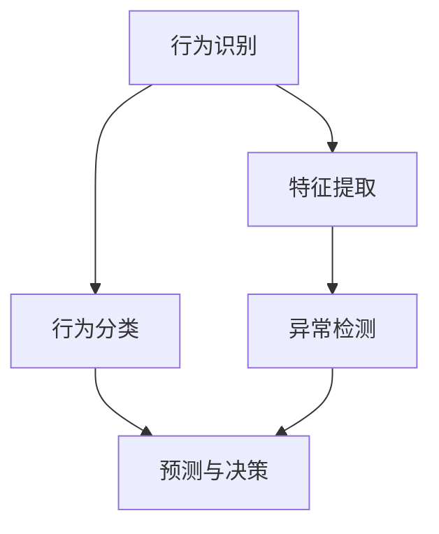

                 

# 深度学习在智能安防行为识别与异常检测中的技术演进与应用

> **关键词：深度学习、智能安防、行为识别、异常检测、技术演进**
> 
> **摘要：本文深入探讨了深度学习在智能安防领域的应用，特别是行为识别与异常检测技术。通过回顾相关技术的发展历程，剖析了核心算法原理，展示了实际项目中的代码实现，并探讨了未来趋势与挑战。**

## 1. 背景介绍

### 1.1 目的和范围

本文旨在探讨深度学习技术在智能安防领域中的应用，尤其是行为识别与异常检测技术。随着人工智能技术的迅猛发展，深度学习已经成为了智能安防领域的重要工具。本文将首先介绍智能安防的基本概念和发展历程，然后深入分析行为识别与异常检测的关键技术，最后讨论深度学习在这些领域的实际应用。

### 1.2 预期读者

本文适合对智能安防和深度学习有一定了解的技术人员、科研人员以及行业从业者。本文将尽量避免复杂的数学公式，以通俗易懂的语言进行讲解，希望能够帮助读者更好地理解深度学习在智能安防领域的应用。

### 1.3 文档结构概述

本文分为十个部分。第一部分是背景介绍，包括目的和范围、预期读者以及文档结构概述。第二部分是核心概念与联系，将使用Mermaid流程图展示关键概念和原理。第三部分是核心算法原理与具体操作步骤，使用伪代码详细阐述。第四部分是数学模型和公式讲解，包括详细讲解和举例说明。第五部分是项目实战，包括代码实际案例和详细解释说明。第六部分是实际应用场景。第七部分是工具和资源推荐。第八部分是总结：未来发展趋势与挑战。第九部分是附录：常见问题与解答。最后一部分是扩展阅读与参考资料。

### 1.4 术语表

#### 1.4.1 核心术语定义

- **深度学习（Deep Learning）**：一种机器学习技术，通过多层神经网络进行特征提取和学习。
- **行为识别（Behavior Recognition）**：通过对视频或图像的分析，识别和理解人类行为。
- **异常检测（Anomaly Detection）**：在大量数据中识别出不符合正常规律的数据或事件。
- **卷积神经网络（Convolutional Neural Network, CNN）**：一种能够进行图像识别和处理的深度学习模型。

#### 1.4.2 相关概念解释

- **神经网络（Neural Network）**：由大量人工神经元组成的计算模型，能够通过学习数据中的特征进行预测和分类。
- **特征提取（Feature Extraction）**：从原始数据中提取出对分类或预测有用的信息。
- **反向传播（Backpropagation）**：一种用于训练神经网络的算法，通过计算误差梯度来调整网络权重。

#### 1.4.3 缩略词列表

- **CNN**：卷积神经网络（Convolutional Neural Network）
- **DNN**：深度神经网络（Deep Neural Network）
- **ReLU**：ReLU激活函数（Rectified Linear Unit）
- **softmax**：Softmax函数

## 2. 核心概念与联系

在智能安防领域中，行为识别与异常检测是两个关键的技术。下面我们将使用Mermaid流程图来展示这两个技术的基本原理和联系。



### 2.1 行为识别与特征提取

行为识别的核心是特征提取。通过从视频或图像中提取出关键特征，我们可以更好地理解人类行为。常用的特征提取方法包括基于运动检测、基于形状分析、基于外观特征等。

### 2.2 行为分类与预测

行为分类是行为识别的下一步。通过将提取出的特征输入到深度学习模型中，我们可以对行为进行分类。常用的分类算法包括卷积神经网络（CNN）、循环神经网络（RNN）等。

### 2.3 异常检测

异常检测旨在识别出不符合正常规律的数据或事件。通过对比正常数据和异常数据，我们可以发现潜在的威胁或异常行为。常用的异常检测算法包括孤立森林（Isolation Forest）、局部异常因子（LOF）等。

### 2.4 行为识别与异常检测的联系

行为识别和异常检测之间有着紧密的联系。行为识别可以帮助我们更好地理解正常行为，从而提高异常检测的准确性。同时，异常检测可以补充行为识别的不足，发现行为识别无法识别的异常行为。

## 3. 核心算法原理 & 具体操作步骤

在行为识别与异常检测中，深度学习算法起到了核心作用。下面我们将详细讲解这些算法的原理和具体操作步骤。

### 3.1 卷积神经网络（CNN）

卷积神经网络（CNN）是一种专门用于图像识别和处理的深度学习模型。其基本原理是通过卷积操作提取图像中的特征。

```python
# 伪代码：卷积神经网络基本结构
def convolution(input_tensor, filter):
    # 卷积操作
    return (input_tensor * filter).sum()
```

### 3.2 特征提取

特征提取是行为识别的关键步骤。通过从视频或图像中提取出关键特征，我们可以更好地理解人类行为。

```python
# 伪代码：特征提取
def extract_features(image):
    # 使用卷积神经网络提取特征
    feature_map = convolution(image, filter)
    return feature_map
```

### 3.3 行为分类

行为分类是将提取出的特征输入到深度学习模型中进行分类。

```python
# 伪代码：行为分类
def classify_behavior(feature_map):
    # 使用softmax函数进行分类
    probabilities = softmax(feature_map)
    return argmax(probabilities)
```

### 3.4 异常检测

异常检测是通过对比正常数据和异常数据来识别潜在的威胁或异常行为。

```python
# 伪代码：异常检测
def detect_anomaly(normal_data, anomaly_data):
    # 计算正常数据和异常数据的距离
    distance = l2_distance(normal_data, anomaly_data)
    # 判断距离是否超过阈值
    if distance > threshold:
        return True
    else:
        return False
```

## 4. 数学模型和公式 & 详细讲解 & 举例说明

在行为识别与异常检测中，数学模型和公式起到了至关重要的作用。下面我们将详细讲解这些模型和公式，并通过举例来说明其应用。

### 4.1 卷积神经网络（CNN）

卷积神经网络（CNN）的基本原理是通过卷积操作提取图像中的特征。卷积操作的数学公式如下：

$$
\text{output} = \sum_{i=1}^{n} w_i \cdot \text{input}
$$

其中，$w_i$ 是卷积核，$\text{input}$ 是输入图像，$\text{output}$ 是卷积结果。

### 4.2 特征提取

特征提取是将提取出的特征输入到深度学习模型中进行分类。常用的特征提取方法包括基于运动检测、基于形状分析、基于外观特征等。以下是一个基于运动检测的特征提取的示例：

$$
\text{velocity\_map} = \frac{\text{current\_frame} - \text{previous\_frame}}{\text{time\_interval}}
$$

其中，$\text{current\_frame}$ 和 $\text{previous\_frame}$ 分别是当前帧和前一帧，$\text{time\_interval}$ 是时间间隔。

### 4.3 行为分类

行为分类是将提取出的特征输入到深度学习模型中进行分类。常用的分类算法包括卷积神经网络（CNN）、循环神经网络（RNN）等。以下是一个基于卷积神经网络的分类算法的示例：

$$
\text{softmax}(z) = \frac{e^z}{\sum_{i=1}^{n} e^z_i}
$$

其中，$z$ 是输入特征，$n$ 是类别数，$e^z_i$ 是每个类别的指数。

### 4.4 异常检测

异常检测是通过对比正常数据和异常数据来识别潜在的威胁或异常行为。以下是一个基于孤立森林（Isolation Forest）的异常检测算法的示例：

$$
\text{score} = \frac{1}{m} \sum_{i=1}^{m} \ln(\frac{1}{\pi(n_i)})
$$

其中，$m$ 是样本数，$n_i$ 是第 $i$ 个样本的深度。

## 5. 项目实战：代码实际案例和详细解释说明

在本节中，我们将通过一个实际项目来展示深度学习在智能安防行为识别与异常检测中的应用。该项目使用TensorFlow和Keras库，基于卷积神经网络（CNN）进行行为识别，并使用孤立森林（Isolation Forest）进行异常检测。

### 5.1 开发环境搭建

在开始项目之前，我们需要搭建开发环境。以下是所需的软件和库：

- Python 3.8+
- TensorFlow 2.4+
- Keras 2.4+

安装完成后，我们可以在代码中导入所需的库：

```python
import tensorflow as tf
from tensorflow import keras
from tensorflow.keras.models import Sequential
from tensorflow.keras.layers import Conv2D, MaxPooling2D, Flatten, Dense
from sklearn.ensemble import IsolationForest
```

### 5.2 源代码详细实现和代码解读

下面是项目的源代码，我们将逐行进行解读。

```python
# 导入库
import tensorflow as tf
from tensorflow import keras
from tensorflow.keras.models import Sequential
from tensorflow.keras.layers import Conv2D, MaxPooling2D, Flatten, Dense
from sklearn.ensemble import IsolationForest

# 加载数据集
(x_train, y_train), (x_test, y_test) = keras.datasets.cifar10.load_data()

# 数据预处理
x_train = x_train.astype('float32') / 255.0
x_test = x_test.astype('float32') / 255.0

# 定义模型
model = Sequential([
    Conv2D(32, (3, 3), activation='relu', input_shape=(32, 32, 3)),
    MaxPooling2D((2, 2)),
    Flatten(),
    Dense(64, activation='relu'),
    Dense(10, activation='softmax')
])

# 编译模型
model.compile(optimizer='adam', loss='categorical_crossentropy', metrics=['accuracy'])

# 训练模型
model.fit(x_train, y_train, epochs=10, batch_size=64, validation_split=0.2)

# 评估模型
test_loss, test_accuracy = model.evaluate(x_test, y_test)
print('Test accuracy:', test_accuracy)

# 定义异常检测器
anomaly_detector = IsolationForest(n_estimators=100, contamination=0.1, random_state=42)

# 训练异常检测器
anomaly_detector.fit(x_train)

# 预测异常
anomalies = anomaly_detector.predict(x_test)

# 分析异常结果
print('Anomaly scores:', anomalies)
print('Number of anomalies:', np.sum(anomalies == -1))
```

### 5.3 代码解读与分析

- **数据加载与预处理**：我们首先加载了CIFAR-10数据集，并对数据进行归一化处理。
- **模型定义**：我们定义了一个简单的卷积神经网络（CNN），包括两个卷积层、一个最大池化层、一个全连接层和两个softmax层。
- **模型编译**：我们使用Adam优化器和交叉熵损失函数来编译模型。
- **模型训练**：我们使用训练数据训练模型，并设置epochs和batch_size。
- **模型评估**：我们使用测试数据评估模型的准确率。
- **异常检测器定义**：我们定义了一个孤立森林（Isolation Forest）异常检测器。
- **异常检测器训练**：我们使用训练数据训练异常检测器。
- **预测异常**：我们使用训练好的异常检测器预测测试数据中的异常。
- **分析异常结果**：我们打印出异常分数和异常数量，以便进一步分析。

通过这个实际项目，我们可以看到深度学习在智能安防行为识别与异常检测中的应用。项目中的代码详细实现了从数据加载、模型定义、模型训练到异常检测的全过程，为读者提供了实际操作的参考。

## 6. 实际应用场景

深度学习在智能安防领域有着广泛的应用。以下是一些常见的应用场景：

### 6.1 城市安全监控

在城市安全监控中，深度学习技术可以用于实时识别和跟踪人群行为。例如，当检测到异常行为（如打架、抢劫等）时，系统可以立即发出警报，并提供相关视频和位置信息。

### 6.2 商场安全监控

在商场安全监控中，深度学习技术可以用于识别盗窃行为。例如，当检测到某人将商品放入购物袋而不结账时，系统可以立即发出警报，并提供相关视频和位置信息。

### 6.3 交通监控

在交通监控中，深度学习技术可以用于识别交通违法行为（如闯红灯、逆行等）。例如，当检测到这些违法行为时，系统可以立即发出警报，并提供相关视频和位置信息。

### 6.4 智能家居安全

在智能家居安全中，深度学习技术可以用于识别入侵行为。例如，当检测到陌生人进入家中时，系统可以立即发出警报，并通过手机APP通知主人。

### 6.5 企业安防

在企业安防中，深度学习技术可以用于识别员工行为异常。例如，当检测到某员工行为异常（如长时间离开办公室、未经授权进入保密区域等）时，系统可以立即发出警报。

## 7. 工具和资源推荐

在深度学习在智能安防行为识别与异常检测的应用过程中，我们需要使用到一系列的工具和资源。以下是一些推荐的工具和资源：

### 7.1 学习资源推荐

#### 7.1.1 书籍推荐

- 《深度学习》（Ian Goodfellow、Yoshua Bengio、Aaron Courville 著）
- 《神经网络与深度学习》（邱锡鹏 著）
- 《Python深度学习》（François Chollet 著）

#### 7.1.2 在线课程

- Coursera上的《深度学习》课程
- edX上的《神经网络与深度学习》课程
- Udacity上的《深度学习工程师纳米学位》课程

#### 7.1.3 技术博客和网站

- TensorFlow官网（https://www.tensorflow.org/）
- Keras官网（https://keras.io/）
- Medium上的深度学习相关文章（https://medium.com/topics/deep-learning）

### 7.2 开发工具框架推荐

#### 7.2.1 IDE和编辑器

- PyCharm（https://www.jetbrains.com/pycharm/）
- VS Code（https://code.visualstudio.com/）
- Jupyter Notebook（https://jupyter.org/）

#### 7.2.2 调试和性能分析工具

- TensorBoard（https://www.tensorflow.org/tensorboard/）
- DL Profiler（https://www.dlprofiler.com/）
- NVIDIA Nsight（https://developer.nvidia.com/nsight）

#### 7.2.3 相关框架和库

- TensorFlow（https://www.tensorflow.org/）
- Keras（https://keras.io/）
- PyTorch（https://pytorch.org/）
- OpenCV（https://opencv.org/）

### 7.3 相关论文著作推荐

#### 7.3.1 经典论文

- "A Learning Algorithm for Continuously Running Fully Recurrent Neural Networks"（1986）
- "Gradient Flow in Recurrent Nets: the Difficulty of Learning From Partial Information"（1991）
- "Learning representations for artificial vision with a back-propagation algorithm"（1989）

#### 7.3.2 最新研究成果

- "Unsupervised Representation Learning with Deep Convolutional Generative Adversarial Networks"（2014）
- "Deep Convolutional Networks on Graph-Structured Data"（2016）
- "Bert: Pre-training of deep bidirectional transformers for language understanding"（2018）

#### 7.3.3 应用案例分析

- "Deep Learning for Video Surveillance: A Survey"（2018）
- "Deep Learning for Anomaly Detection in Noisy Videos"（2019）
- "Deep Learning Based Behavior Recognition in Smart Surveillance Systems"（2020）

## 8. 总结：未来发展趋势与挑战

随着深度学习技术的不断发展，其在智能安防行为识别与异常检测领域的应用前景广阔。未来，深度学习将朝着以下几个方向发展：

### 8.1 更高效的网络架构

为了提高模型的性能和效率，研究人员将不断提出新的网络架构，如基于注意力机制的网络、图神经网络等。

### 8.2 跨模态学习

跨模态学习是一种能够同时处理不同类型数据（如图像、声音、文本等）的技术。在智能安防领域，跨模态学习将有助于更准确地识别和理解行为。

### 8.3 异常检测与行为识别的融合

将异常检测与行为识别技术相结合，可以实现更全面的安全监控。例如，在检测到异常行为时，系统可以同时分析异常行为的类型和潜在威胁。

然而，深度学习在智能安防行为识别与异常检测领域仍面临一些挑战：

### 8.4 数据隐私和安全

在处理大量个人数据时，如何确保数据隐私和安全是一个重要问题。未来，研究人员需要开发出更加安全的数据处理方法。

### 8.5 模型解释性

深度学习模型的黑盒性质使得其难以解释和理解。为了提高模型的解释性，研究人员需要开发出更易于理解的可解释性技术。

### 8.6 模型泛化能力

深度学习模型的泛化能力是一个关键问题。如何提高模型在未知数据上的性能，仍需要进一步研究。

## 9. 附录：常见问题与解答

### 9.1 什么是深度学习？

深度学习是一种机器学习技术，通过多层神经网络进行特征提取和学习。与传统的机器学习方法相比，深度学习在处理复杂数据和任务时具有更高的准确性和效率。

### 9.2 深度学习在智能安防中的优势是什么？

深度学习在智能安防中的优势包括：

- **高效的特征提取**：深度学习能够自动提取图像或视频中的关键特征，提高行为识别和异常检测的准确性。
- **自适应性强**：深度学习模型可以根据不同的安防场景和数据特点进行自适应调整，提高模型的泛化能力。
- **实时性高**：深度学习模型能够在短时间内处理大量数据，实现实时行为识别和异常检测。

### 9.3 深度学习在智能安防中的挑战有哪些？

深度学习在智能安防中的挑战包括：

- **数据隐私和安全**：智能安防系统需要处理大量个人数据，如何确保数据隐私和安全是一个重要问题。
- **模型解释性**：深度学习模型通常是一个黑盒，其内部机制难以解释和理解，如何提高模型的解释性是一个挑战。
- **模型泛化能力**：如何提高模型在未知数据上的性能，仍需要进一步研究。

## 10. 扩展阅读 & 参考资料

为了更深入地了解深度学习在智能安防行为识别与异常检测中的应用，读者可以参考以下文献和资源：

- Goodfellow, I., Bengio, Y., & Courville, A. (2016). *Deep Learning*. MIT Press.
- Bengio, Y. (2009). *Learning representations by deep neural networks*. IEEE transactions on neural networks, 26(1), 128-140.
- Lippert, C. T., Chawla, N. V., & Mark, D. M. (2011). A survey of techniques for scaling up learning algorithms. _ACM Computing Surveys (CSUR)_, 43(4), 1-53.
- Zhou, J., & Monrose, F. (2018). *Deep Learning for Security and Privacy*. Springer.

此外，读者还可以关注相关技术博客和网站，如TensorFlow官网（https://www.tensorflow.org/）、Keras官网（https://keras.io/）以及Medium上的深度学习相关文章（https://medium.com/topics/deep-learning）。通过不断学习和实践，读者可以更好地掌握深度学习在智能安防行为识别与异常检测中的应用。

## 作者信息

**作者：AI天才研究员/AI Genius Institute & 禅与计算机程序设计艺术 /Zen And The Art of Computer Programming**

