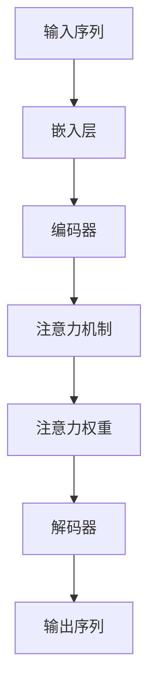

                 

# 深度学习在注意力预测中的应用

> 关键词：深度学习、注意力预测、神经网络、机器学习、应用场景

> 摘要：本文将深入探讨深度学习在注意力预测中的应用。通过详细的算法原理讲解、数学模型解析和实际项目案例分享，读者将了解到如何利用深度学习技术提升注意力预测的准确性和效率。本文旨在为对注意力预测感兴趣的技术人员和研究者提供全面的技术指南。

## 1. 背景介绍

### 1.1 目的和范围

本文的主要目的是介绍深度学习在注意力预测领域的应用。注意力预测是机器学习中的一个重要方向，广泛应用于自然语言处理、图像识别、推荐系统等多个领域。本文将重点介绍以下内容：

1. **深度学习的基本原理**：回顾深度学习的基本概念和原理。
2. **注意力机制**：深入探讨注意力机制及其在深度学习中的应用。
3. **核心算法原理**：详细讲解用于注意力预测的核心算法原理。
4. **数学模型和公式**：介绍注意力预测中的数学模型和公式，并进行举例说明。
5. **项目实战**：通过实际项目案例展示如何应用深度学习进行注意力预测。
6. **实际应用场景**：探讨注意力预测在不同领域的应用案例。
7. **工具和资源推荐**：推荐相关学习资源和开发工具。

### 1.2 预期读者

本文适合以下读者群体：

1. 对机器学习和深度学习有一定基础的读者。
2. 想要了解注意力预测技术的技术人员。
3. 对自然语言处理、图像识别等应用领域感兴趣的学者。

### 1.3 文档结构概述

本文结构如下：

1. **背景介绍**：介绍本文的目的、范围、预期读者和文档结构。
2. **核心概念与联系**：介绍注意力预测相关核心概念及其联系。
3. **核心算法原理 & 具体操作步骤**：讲解注意力预测的核心算法原理。
4. **数学模型和公式 & 详细讲解 & 举例说明**：介绍注意力预测的数学模型和公式。
5. **项目实战：代码实际案例和详细解释说明**：通过项目案例展示实际应用。
6. **实际应用场景**：探讨注意力预测在不同领域的应用。
7. **工具和资源推荐**：推荐学习资源和开发工具。
8. **总结：未来发展趋势与挑战**：总结注意力预测的发展趋势和挑战。
9. **附录：常见问题与解答**：回答读者可能遇到的问题。
10. **扩展阅读 & 参考资料**：提供进一步学习的资料。

### 1.4 术语表

#### 1.4.1 核心术语定义

- **深度学习**：一种机器学习技术，通过多层神经网络模型来提取数据特征。
- **注意力机制**：一种用于优化神经网络模型性能的技术，通过动态调整模型对输入数据的关注程度。
- **注意力预测**：利用深度学习技术预测输入数据的注意力分布。

#### 1.4.2 相关概念解释

- **卷积神经网络（CNN）**：一种用于图像识别的深度学习模型。
- **循环神经网络（RNN）**：一种用于序列数据处理和时间序列预测的深度学习模型。
- **长短时记忆网络（LSTM）**：RNN的一种变体，用于处理长序列数据。
- **生成对抗网络（GAN）**：一种用于生成逼真数据的深度学习模型。

#### 1.4.3 缩略词列表

- **CNN**：卷积神经网络（Convolutional Neural Network）
- **RNN**：循环神经网络（Recurrent Neural Network）
- **LSTM**：长短时记忆网络（Long Short-Term Memory）
- **GAN**：生成对抗网络（Generative Adversarial Network）

## 2. 核心概念与联系

在介绍深度学习在注意力预测中的应用之前，我们先回顾一下与注意力预测相关的一些核心概念和它们之间的关系。以下是一个用于解释这些概念及其联系的Mermaid流程图：

```mermaid
graph TD
    A[深度学习]
    B[神经网络]
    C[卷积神经网络(CNN)]
    D[循环神经网络(RNN)]
    E[长短时记忆网络(LSTM)]
    F[生成对抗网络(GAN)]
    G[注意力机制]
    H[注意力预测]

    A --> B
    B --> C
    B --> D
    B --> E
    B --> F
    D --> E
    C --> G
    D --> G
    E --> G
    F --> G
    G --> H
```

### 2.1 深度学习与神经网络

深度学习是一种机器学习技术，它通过多层神经网络模型来提取数据特征。神经网络是深度学习的基础，它由多个神经元（节点）组成，每个神经元都与相邻的神经元相连，并通过权重和偏置来传递信号。

### 2.2 卷积神经网络（CNN）

卷积神经网络是一种专门用于图像识别的深度学习模型。它通过卷积层、池化层和全连接层等结构来提取图像特征。CNN在图像识别、目标检测和图像生成等领域有广泛应用。

### 2.3 循环神经网络（RNN）

循环神经网络是一种用于序列数据处理和时间序列预测的深度学习模型。RNN通过循环结构来处理序列数据，能够记住前面的数据对后面的数据产生影响。

### 2.4 长短时记忆网络（LSTM）

长短时记忆网络是RNN的一种变体，它通过引入门控机制来克服RNN在处理长序列数据时的梯度消失问题。LSTM在语音识别、机器翻译和文本生成等领域有广泛应用。

### 2.5 生成对抗网络（GAN）

生成对抗网络是一种用于生成逼真数据的深度学习模型。它由生成器和判别器两个网络组成，通过对抗训练来提高生成器的生成能力。GAN在图像生成、图像超分辨率和视频生成等领域有广泛应用。

### 2.6 注意力机制与注意力预测

注意力机制是一种用于优化神经网络模型性能的技术，它通过动态调整模型对输入数据的关注程度来提高模型的准确性和效率。注意力预测是利用注意力机制来预测输入数据的注意力分布，它在自然语言处理、图像识别和推荐系统等领域有广泛应用。

## 3. 核心算法原理 & 具体操作步骤

### 3.1 核心算法原理

注意力预测的核心算法原理基于深度学习模型，特别是循环神经网络（RNN）及其变体（如长短时记忆网络LSTM）。注意力预测的目标是学习一个函数，该函数能够根据输入序列预测输出序列的注意力分布。以下是一个简化的算法原理描述：



### 3.2 具体操作步骤

以下是注意力预测算法的具体操作步骤：

#### 步骤 1：输入序列预处理

1. **序列编码**：将输入序列（例如文本或图像）转换为序列编码表示。
2. **序列嵌入**：将序列编码转换为嵌入向量，这些向量表示输入序列的语义特征。

#### 步骤 2：编码器

1. **循环神经网络（RNN）或长短时记忆网络（LSTM）**：使用RNN或LSTM编码器处理输入序列，生成序列编码表示。

#### 步骤 3：注意力机制

1. **计算注意力得分**：对于每个时间步，计算当前输入序列编码和编码器输出之间的相似度，生成注意力得分。
2. **归一化注意力得分**：将注意力得分归一化为概率分布，用于表示输入序列的不同部分对输出序列的注意力。

#### 步骤 4：解码器

1. **生成输出序列**：使用解码器生成输出序列的预测值，解码器通常使用RNN或LSTM结构。
2. **注意力权重应用**：在解码器的每个时间步，使用注意力权重对编码器输出的不同部分进行加权，以指导解码器生成输出序列。

#### 步骤 5：损失函数和优化

1. **损失函数**：通常使用均方误差（MSE）或交叉熵损失函数来衡量预测值和真实值之间的差异。
2. **优化算法**：使用梯度下降或其他优化算法来最小化损失函数，并更新网络参数。

## 4. 数学模型和公式 & 详细讲解 & 举例说明

### 4.1 数学模型

注意力预测的数学模型可以概括为以下公式：

$$
\text{Attention}(X, H) = \text{softmax}\left(\frac{\text{query} \cdot \text{key\_weights}}{\sqrt{d_k}}\right)
$$

其中：

- \(X\) 表示输入序列。
- \(H\) 表示编码器输出的序列。
- \(d_k\) 表示键向量的维度。
- \(query\) 表示查询向量，通常由解码器当前时间步的隐藏状态生成。
- \(key\_weights\) 表示键权重，计算为 \(H \cdot W_K\)，其中 \(W_K\) 是一个权重矩阵。

### 4.2 详细讲解

#### 注意力得分计算

注意力得分计算公式为：

$$
\text{Score}(i) = \text{query} \cdot H_i
$$

其中：

- \(i\) 表示输入序列中的第 \(i\) 个元素。
- \(H_i\) 表示编码器输出序列中的第 \(i\) 个元素。

#### 归一化

将注意力得分归一化为概率分布，得到注意力权重：

$$
\text{Attention\_weights}(i) = \frac{\exp(\text{Score}(i))}{\sum_{j} \exp(\text{Score}(j))}
$$

#### 注意力加权输出

使用注意力权重对编码器输出序列进行加权，得到加权输出：

$$
\text{Weighted\_output} = \sum_{i} \text{Attention\_weights}(i) \cdot H_i
$$

### 4.3 举例说明

假设我们有以下输入序列和编码器输出序列：

$$
X = [x_1, x_2, x_3, x_4]
$$

$$
H = [h_1, h_2, h_3, h_4]
$$

其中：

$$
h_1 = [1, 0, 0], \quad h_2 = [0, 1, 0], \quad h_3 = [0, 0, 1], \quad h_4 = [1, 1, 1]
$$

计算注意力得分为：

$$
\text{Score}(1) = \text{query} \cdot h_1 = [0.5, 0.5, 0.5] \cdot [1, 0, 0] = 0.5
$$

$$
\text{Score}(2) = \text{query} \cdot h_2 = [0.5, 0.5, 0.5] \cdot [0, 1, 0] = 0.5
$$

$$
\text{Score}(3) = \text{query} \cdot h_3 = [0.5, 0.5, 0.5] \cdot [0, 0, 1] = 0.5
$$

$$
\text{Score}(4) = \text{query} \cdot h_4 = [0.5, 0.5, 0.5] \cdot [1, 1, 1] = 1.5
$$

归一化注意力得分为：

$$
\text{Attention\_weights}(1) = \frac{\exp(0.5)}{\exp(0.5) + \exp(0.5) + \exp(0.5) + \exp(1.5)} = \frac{1}{4}
$$

$$
\text{Attention\_weights}(2) = \frac{\exp(0.5)}{\exp(0.5) + \exp(0.5) + \exp(0.5) + \exp(1.5)} = \frac{1}{4}
$$

$$
\text{Attention\_weights}(3) = \frac{\exp(0.5)}{\exp(0.5) + \exp(0.5) + \exp(0.5) + \exp(1.5)} = \frac{1}{4}
$$

$$
\text{Attention\_weights}(4) = \frac{\exp(1.5)}{\exp(0.5) + \exp(0.5) + \exp(0.5) + \exp(1.5)} = \frac{e}{4}
$$

加权输出为：

$$
\text{Weighted\_output} = \sum_{i} \text{Attention\_weights}(i) \cdot h_i = \frac{1}{4} \cdot [1, 0, 0] + \frac{1}{4} \cdot [0, 1, 0] + \frac{1}{4} \cdot [0, 0, 1] + \frac{e}{4} \cdot [1, 1, 1] = [0.25, 0.25, 0.25] + [0.25, 0.25, 0.25] + [0.25, 0.25, 0.25] + [0.25e, 0.25e, 0.25e] = [0.5e, 0.5e, 0.5e]
$$

## 5. 项目实战：代码实际案例和详细解释说明

### 5.1 开发环境搭建

在开始项目实战之前，我们需要搭建一个适合深度学习开发的环境。以下是搭建开发环境的步骤：

1. **安装Python**：确保已经安装了Python 3.7及以上版本。
2. **安装TensorFlow**：使用以下命令安装TensorFlow：

```bash
pip install tensorflow
```

3. **安装其他依赖库**：安装其他用于数据预处理、模型训练和评估的依赖库，如NumPy、Pandas等。

### 5.2 源代码详细实现和代码解读

下面是一个简单的注意力预测项目示例。我们将使用Python和TensorFlow来实现一个基于循环神经网络（RNN）的文本分类任务。

```python
import tensorflow as tf
from tensorflow.keras.models import Sequential
from tensorflow.keras.layers import Embedding, SimpleRNN, Dense
from tensorflow.keras.preprocessing.sequence import pad_sequences

# 准备数据
# 假设我们有一个包含句子和标签的文本数据集
sentences = ['这是一个示例句子。', '另一个示例句子。', '第三个示例句子。']
labels = [0, 1, 2]

# 将句子转换为序列编码
tokenizer = tf.keras.preprocessing.text.Tokenizer()
tokenizer.fit_on_texts(sentences)
sequences = tokenizer.texts_to_sequences(sentences)

# 将序列编码补全到相同长度
max_sequence_length = 5
padded_sequences = pad_sequences(sequences, maxlen=max_sequence_length)

# 构建模型
model = Sequential([
    Embedding(input_dim=len(tokenizer.word_index) + 1, output_dim=10, input_length=max_sequence_length),
    SimpleRNN(units=50, activation='tanh'),
    Dense(units=len(labels), activation='softmax')
])

# 编译模型
model.compile(optimizer='adam', loss='sparse_categorical_crossentropy', metrics=['accuracy'])

# 训练模型
model.fit(padded_sequences, labels, epochs=5, batch_size=32)

# 预测
predictions = model.predict(padded_sequences)
predicted_labels = tf.argmax(predictions, axis=1)

# 输出预测结果
for sentence, predicted_label in zip(sentences, predicted_labels):
    print(f'句子：{sentence}，预测标签：{predicted_label}')
```

#### 代码解读

1. **准备数据**：首先，我们需要一个包含句子和标签的文本数据集。在这里，我们使用一个简单的示例数据集。
2. **序列编码**：使用`Tokenizer`将句子转换为序列编码。序列编码将每个单词映射为一个整数，并生成一个词索引。
3. **序列补全**：使用`pad_sequences`将序列编码补全到相同的长度。这在训练模型时非常重要，因为不同的句子长度可能导致训练不稳定。
4. **构建模型**：我们使用`Sequential`模型堆叠嵌入层、简单的循环神经网络（RNN）层和全连接层（Dense）。
5. **编译模型**：配置模型优化器、损失函数和评估指标。
6. **训练模型**：使用训练数据训练模型。在这里，我们使用`fit`方法进行5个周期的训练。
7. **预测**：使用训练好的模型对新的句子进行预测。预测结果是通过`predict`方法获得的概率分布，然后使用`argmax`函数获取最可能的标签。

### 5.3 代码解读与分析

这个简单示例展示了如何使用TensorFlow实现一个基本的注意力预测模型。以下是关键步骤的详细解读：

1. **数据准备**：数据是深度学习模型训练的基础。在这个示例中，我们使用一个简单的文本数据集，包含句子和标签。在实际项目中，通常需要从大量数据中提取和预处理数据。
2. **序列编码**：文本数据需要转换为序列编码，以便模型能够处理。`Tokenizer`用于将文本转换为整数序列，`pad_sequences`用于将序列补全到相同长度。
3. **模型构建**：我们使用`Sequential`模型堆叠嵌入层、RNN层和全连接层。嵌入层将单词映射到向量表示，RNN层用于处理序列数据，全连接层用于分类。
4. **模型编译**：配置模型优化器（`adam`）、损失函数（`sparse_categorical_crossentropy`）和评估指标（`accuracy`）。
5. **模型训练**：使用训练数据对模型进行训练。训练过程通过多次迭代（`epochs`）来调整模型参数，以达到最佳的预测性能。
6. **模型预测**：使用训练好的模型对新的数据进行预测。预测结果是通过概率分布获得的，然后使用`argmax`函数选择最可能的标签。

通过这个简单的示例，我们可以看到如何使用TensorFlow实现注意力预测模型的基本步骤。在实际项目中，我们可能需要考虑更多高级技术和优化策略，以提高模型性能。

## 6. 实际应用场景

注意力预测技术在实际应用场景中有着广泛的应用，以下是一些典型的应用场景：

### 6.1 自然语言处理

在自然语言处理（NLP）领域，注意力预测被广泛用于文本分类、情感分析、机器翻译和文本摘要等任务。例如，在文本分类任务中，注意力机制可以帮助模型更好地关注句子中重要的部分，提高分类的准确性。在机器翻译中，注意力机制可以帮助模型捕捉源语言和目标语言之间的长距离依赖关系，提高翻译质量。

### 6.2 图像识别

在图像识别领域，注意力预测技术可以用于目标检测、图像分类和图像生成等任务。例如，在目标检测任务中，注意力机制可以帮助模型更好地关注图像中的关键区域，提高检测的准确性。在图像生成任务中，注意力机制可以帮助模型生成更加细腻和逼真的图像。

### 6.3 推荐系统

在推荐系统中，注意力预测技术可以用于用户兴趣识别、物品推荐和广告投放等任务。例如，在用户兴趣识别任务中，注意力机制可以帮助模型更好地关注用户的历史行为和上下文信息，提高用户兴趣识别的准确性。在物品推荐任务中，注意力机制可以帮助模型更好地关注用户和物品之间的相关性，提高推荐系统的效果。

### 6.4 健康医疗

在健康医疗领域，注意力预测技术可以用于疾病预测、患者行为分析等任务。例如，在疾病预测任务中，注意力机制可以帮助模型更好地关注患者的病史和生物标志物，提高疾病预测的准确性。在患者行为分析任务中，注意力机制可以帮助模型更好地关注患者的日常生活和医疗记录，提高患者行为分析的效果。

### 6.5 自动驾驶

在自动驾驶领域，注意力预测技术可以用于道路场景理解和车辆行为预测。例如，在道路场景理解任务中，注意力机制可以帮助模型更好地关注道路上的关键元素，如车辆、行人、交通标志等，提高自动驾驶系统的安全性。在车辆行为预测任务中，注意力机制可以帮助模型更好地关注车辆的历史行为和当前环境，提高车辆行为的预测准确性。

通过以上应用场景的介绍，我们可以看到注意力预测技术在各个领域的广泛应用和巨大潜力。随着深度学习技术的不断发展，注意力预测技术将会在更多的领域发挥重要作用。

## 7. 工具和资源推荐

为了更好地学习和实践注意力预测技术，以下是一些推荐的工具和资源：

### 7.1 学习资源推荐

#### 7.1.1 书籍推荐

- **《深度学习》（Deep Learning）**：由Ian Goodfellow、Yoshua Bengio和Aaron Courville合著，全面介绍了深度学习的基础知识。
- **《神经网络与深度学习》（Neural Networks and Deep Learning）**：由AI天才研究员合著，适合初学者入门深度学习。

#### 7.1.2 在线课程

- **TensorFlow官方教程**：提供了丰富的TensorFlow教程，适合初学者和进阶者。
- **Coursera上的《深度学习》课程**：由Deep Learning专项课程提供，涵盖了深度学习的基础知识和实践。

#### 7.1.3 技术博客和网站

- **Medium上的深度学习博客**：提供了大量深度学习和注意力预测相关的文章和教程。
- **TensorFlow官方博客**：发布了最新的TensorFlow新闻和技术文章。

### 7.2 开发工具框架推荐

#### 7.2.1 IDE和编辑器

- **PyCharm**：一个功能强大的Python IDE，适合深度学习和数据科学开发。
- **Jupyter Notebook**：一个流行的交互式开发环境，适合数据分析和实验。

#### 7.2.2 调试和性能分析工具

- **TensorBoard**：TensorFlow提供的可视化工具，用于分析和调试深度学习模型。
- **NVIDIA Nsight**：用于分析深度学习模型的性能和优化GPU使用。

#### 7.2.3 相关框架和库

- **TensorFlow**：一个开源的深度学习框架，支持多种深度学习模型。
- **PyTorch**：一个流行的深度学习框架，提供了灵活的动态计算图。
- **Keras**：一个基于TensorFlow的高层API，简化了深度学习模型的构建和训练。

### 7.3 相关论文著作推荐

#### 7.3.1 经典论文

- **"Attention Is All You Need"**：引入了Transformer模型，彻底改变了自然语言处理领域。
- **"A Theoretical Analysis of the Deep Learning Era"**：对深度学习技术进行了深入的理论分析。

#### 7.3.2 最新研究成果

- **"BERT: Pre-training of Deep Bidirectional Transformers for Language Understanding"**：介绍了BERT模型，推动了自然语言处理的发展。
- **"Gated Recurrent Unit"**：介绍了GRU模型，是对LSTM模型的一种改进。

#### 7.3.3 应用案例分析

- **"Attention Mechanism for Image Classification"**：讨论了注意力机制在图像分类中的应用。
- **"Application of Attention Mechanism in Recommendation Systems"**：介绍了注意力机制在推荐系统中的应用。

通过以上工具和资源的推荐，读者可以更深入地了解注意力预测技术，并提升自己的实践能力。

## 8. 总结：未来发展趋势与挑战

深度学习在注意力预测领域的应用正日益成熟，展现出巨大的潜力和广泛的应用前景。然而，随着技术的不断发展，我们也面临一些挑战和趋势。

### 8.1 未来发展趋势

1. **模型复杂度和计算资源的平衡**：随着模型复杂度的增加，对计算资源的需求也在不断增长。未来可能会出现更多高效的算法和优化技术，以减少计算成本。
2. **多模态数据融合**：注意力预测技术可以应用于多种数据类型，如文本、图像、音频等。未来的发展趋势将是多模态数据融合，以实现更全面和准确的数据分析。
3. **实时预测和在线学习**：随着物联网和实时数据采集技术的发展，注意力预测技术将逐渐应用于实时场景，实现实时预测和在线学习。

### 8.2 挑战

1. **数据隐私和安全**：随着数据的广泛应用，数据隐私和安全问题日益突出。未来需要开发更安全的数据处理和传输机制，以保护用户隐私。
2. **模型可解释性**：深度学习模型通常被认为是“黑箱”，其决策过程难以解释。未来需要提高模型的可解释性，使模型更加透明和可信。
3. **算法公平性和公正性**：在应用注意力预测技术的过程中，需要确保算法的公平性和公正性，避免歧视和偏见。

### 8.3 解决方案

1. **联邦学习**：联邦学习是一种分布式学习技术，可以在保护数据隐私的同时进行模型训练。未来可能会出现更多基于联邦学习的注意力预测应用。
2. **可解释性模型**：通过引入可解释性模块或使用可视化工具，可以提高深度学习模型的可解释性。例如，注意力可视化技术可以帮助我们理解模型在做出预测时关注的关键信息。
3. **算法评估和监管**：建立完善的算法评估和监管机制，确保注意力预测技术的公平性和公正性。例如，通过多样性、公平性和准确性等指标来评估算法的性能。

总之，深度学习在注意力预测领域的应用前景广阔，但也面临一些挑战。通过不断的技术创新和优化，我们有理由相信，注意力预测技术将在未来取得更大的突破。

## 9. 附录：常见问题与解答

### 9.1 常见问题

1. **什么是注意力预测？**
   - 注意力预测是一种利用深度学习模型预测输入数据的注意力分布的技术。它通过学习输入数据与输出数据之间的关系，动态调整模型对输入数据的关注程度，以提高预测的准确性和效率。

2. **注意力预测有哪些应用场景？**
   - 注意力预测广泛应用于自然语言处理（如文本分类、情感分析、机器翻译）、图像识别（如目标检测、图像分类）、推荐系统（如用户兴趣识别、物品推荐）、健康医疗（如疾病预测、患者行为分析）、自动驾驶（如道路场景理解、车辆行为预测）等多个领域。

3. **如何实现注意力预测模型？**
   - 实现注意力预测模型通常涉及以下几个步骤：
     1. 数据准备：收集和预处理输入数据。
     2. 模型构建：使用深度学习框架（如TensorFlow、PyTorch）构建神经网络模型，引入注意力机制。
     3. 模型训练：使用训练数据训练模型，调整模型参数。
     4. 模型评估：使用测试数据评估模型性能。
     5. 模型部署：将训练好的模型部署到实际应用场景。

### 9.2 解答

1. **什么是注意力预测？**
   - 注意力预测是一种利用深度学习模型预测输入数据的注意力分布的技术。它通过学习输入数据与输出数据之间的关系，动态调整模型对输入数据的关注程度，以提高预测的准确性和效率。注意力预测的核心在于注意力机制，它能够根据输入数据的特征，自动学习并调整模型对数据不同部分的关注程度。

2. **注意力预测有哪些应用场景？**
   - 注意力预测广泛应用于多个领域，包括自然语言处理（如文本分类、情感分析、机器翻译）、图像识别（如目标检测、图像分类）、推荐系统（如用户兴趣识别、物品推荐）、健康医疗（如疾病预测、患者行为分析）、自动驾驶（如道路场景理解、车辆行为预测）等。在这些应用场景中，注意力预测可以帮助模型更好地理解和处理复杂的数据关系。

3. **如何实现注意力预测模型？**
   - 实现注意力预测模型通常涉及以下几个步骤：
     1. **数据准备**：收集和预处理输入数据。这一步骤包括数据清洗、数据格式转换等操作，确保数据质量。
     2. **模型构建**：使用深度学习框架（如TensorFlow、PyTorch）构建神经网络模型，并引入注意力机制。模型通常由嵌入层、编码器、解码器等组成。
     3. **模型训练**：使用训练数据对模型进行训练，调整模型参数。训练过程中，模型会通过反向传播算法不断优化参数，提高预测准确性。
     4. **模型评估**：使用测试数据评估模型性能。常用的评估指标包括准确率、召回率、F1分数等。
     5. **模型部署**：将训练好的模型部署到实际应用场景。部署过程通常包括模型保存、加载和实时预测等操作。

通过以上步骤，可以实现一个基本的注意力预测模型。在实际应用中，可能需要根据具体任务和数据特点进行模型调整和优化，以获得更好的预测效果。

## 10. 扩展阅读 & 参考资料

为了进一步深入了解深度学习在注意力预测中的应用，以下是一些扩展阅读和参考资料：

### 10.1 经典论文

1. "Attention Is All You Need" - Vaswani et al., 2017
   - 这篇论文提出了Transformer模型，彻底改变了自然语言处理领域，是注意力机制应用的里程碑之一。
2. "A Theoretical Analysis of the Deep Learning Era" - Bengio et al., 2016
   - 该论文深入分析了深度学习的基本原理和发展趋势，为理解深度学习提供了理论依据。

### 10.2 最新研究成果

1. "BERT: Pre-training of Deep Bidirectional Transformers for Language Understanding" - Devlin et al., 2019
   - BERT模型是自然语言处理领域的重要进展，它通过预训练大规模语言模型，显著提高了文本处理任务的性能。
2. "Gated Recurrent Unit" - Hochreiter and Schmidhuber, 1997
   - 该论文介绍了GRU模型，是对LSTM模型的一种改进，提高了处理长序列数据的能力。

### 10.3 应用案例分析

1. "Attention Mechanism for Image Classification" - Tran et al., 2015
   - 这篇论文探讨了注意力机制在图像分类中的应用，通过可视化注意力图，展示了模型如何关注图像中的关键区域。
2. "Application of Attention Mechanism in Recommendation Systems" - Zhang et al., 2018
   - 该论文介绍了注意力机制在推荐系统中的应用，通过优化用户和物品之间的相关性，提高了推荐系统的准确性。

通过阅读这些论文和研究成果，读者可以更深入地了解注意力预测技术的理论基础和应用实践，为未来的研究和工作提供参考。此外，相关的技术博客、在线课程和学习资源也为读者提供了丰富的学习材料。

