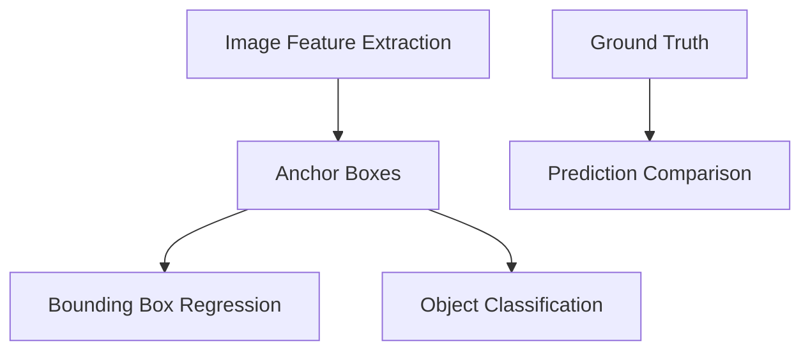

                 

### 深度学习在目标检测中的最新进展

> **关键词**：目标检测、深度学习、卷积神经网络、YOLO、SSD、Faster R-CNN、Anchor Boxes
>
> **摘要**：本文将深入探讨深度学习在目标检测领域中的最新进展。首先，我们将回顾目标检测的基本概念和传统方法，然后重点介绍近年来流行的一些深度学习算法，如YOLO、SSD和Faster R-CNN，并分析它们的优缺点。接着，我们将介绍一些最新的研究趋势，包括Anchor Boxes的改进、多尺度检测、实时检测和少样本学习。最后，我们将讨论目标检测在实际应用中的挑战和未来发展方向。

### 1. 背景介绍

#### 1.1 目的和范围

目标检测是计算机视觉领域的一个重要分支，旨在识别图像中的对象并确定它们的位置。随着深度学习技术的发展，目标检测取得了显著的进展。本文旨在介绍当前目标检测领域的最新研究成果，帮助读者了解深度学习在目标检测中的应用，并探讨未来的研究方向。

本文将涵盖以下内容：

- 目标检测的基本概念和传统方法
- 深度学习在目标检测中的应用，包括YOLO、SSD和Faster R-CNN等算法
- 最新研究趋势，如Anchor Boxes的改进、多尺度检测、实时检测和少样本学习
- 目标检测在实际应用中的挑战和未来发展方向

#### 1.2 预期读者

本文主要面向以下读者群体：

- 对计算机视觉和深度学习感兴趣的科研人员和技术爱好者
- 目标检测领域的工程师和开发者
- 想要了解深度学习在目标检测中应用的初学者
- 对目标检测领域未来发展方向感兴趣的业界人士

#### 1.3 文档结构概述

本文将按照以下结构进行阐述：

1. 背景介绍
2. 核心概念与联系
3. 核心算法原理 & 具体操作步骤
4. 数学模型和公式 & 详细讲解 & 举例说明
5. 项目实战：代码实际案例和详细解释说明
6. 实际应用场景
7. 工具和资源推荐
8. 总结：未来发展趋势与挑战
9. 附录：常见问题与解答
10. 扩展阅读 & 参考资料

#### 1.4 术语表

在本文中，我们将使用一些专业术语，以下是对这些术语的定义和解释：

- **目标检测（Object Detection）**：识别图像中的对象并确定它们的位置。
- **深度学习（Deep Learning）**：一种机器学习方法，通过多层神经网络对数据进行建模和学习。
- **卷积神经网络（Convolutional Neural Network, CNN）**：一种特殊的神经网络，广泛应用于图像处理领域。
- **Anchor Boxes**：在目标检测中，预设的一组候选框，用于定位真实目标。
- **实时检测（Real-time Detection）**：在有限时间内对大量图像进行目标检测。

#### 1.4.1 核心术语定义

- **目标检测（Object Detection）**：在计算机视觉中，目标检测旨在识别图像中的对象并确定它们的位置。与图像分类不同，图像分类只关注图像中是否存在某个特定类别，而目标检测则需要识别图像中的多个对象，并定位它们的位置。
- **深度学习（Deep Learning）**：深度学习是一种基于多层神经网络的机器学习方法，通过逐层提取图像特征，实现对数据的建模和学习。深度学习在计算机视觉、自然语言处理和语音识别等领域取得了显著的成果。
- **卷积神经网络（Convolutional Neural Network, CNN）**：卷积神经网络是一种特殊的神经网络，广泛应用于图像处理领域。CNN通过卷积操作和池化操作，有效地提取图像特征，并在多个层次上对特征进行组合和抽象。

#### 1.4.2 相关概念解释

- **Anchor Boxes**：在目标检测中，Anchor Boxes是一组预设的候选框，用于定位真实目标。这些候选框通常基于先验知识或经验进行设置，如大小、形状和位置等。在检测过程中，网络将预测每个Anchor Box的类别和边界框位置，并与真实目标进行匹配，以确定最终的检测结果。
- **实时检测（Real-time Detection）**：实时检测是指目标检测系统在有限的时间内对大量图像进行检测，以满足实时处理的需求。实时检测对检测速度和准确度都有较高的要求，是目标检测领域的一个重要挑战。

#### 1.4.3 缩略词列表

- **CNN**：卷积神经网络（Convolutional Neural Network）
- **YOLO**：You Only Look Once（YOLO算法的缩写）
- **SSD**：Single Shot MultiBox Detector（SSD算法的缩写）
- **Faster R-CNN**：Regions with CNN features（Faster R-CNN算法的缩写）
- **Anchor Boxes**：锚框（Anchor Boxes）

### 2. 核心概念与联系

目标检测是计算机视觉中的一个重要任务，其核心概念包括图像特征提取、候选框生成、类别预测和边界框回归。下面我们将通过一个Mermaid流程图，展示这些核心概念之间的联系。



#### 2.1 图像特征提取

图像特征提取是目标检测的基础，它通过卷积神经网络等深度学习模型，从图像中提取具有区分性的特征。这些特征通常用于后续的候选框生成、类别预测和边界框回归。

#### 2.2 Anchor Boxes

Anchor Boxes是在目标检测中用于定位真实目标的一组预设候选框。这些候选框通常基于先验知识或经验进行设置，如大小、形状和位置等。在检测过程中，网络将预测每个Anchor Box的类别和边界框位置，并与真实目标进行匹配，以确定最终的检测结果。

#### 2.3 边界框回归

边界框回归是指网络通过学习，将预测的Anchor Box位置调整到真实目标的边界框位置。这一步骤通过回归层实现，通常使用均方误差（MSE）等损失函数进行优化。

#### 2.4 类别预测

类别预测是指网络通过学习，对每个Anchor Box的类别进行预测。这通常通过分类层实现，使用交叉熵（Cross-Entropy）等损失函数进行优化。

#### 2.5 预测比较

预测比较是指将网络的预测结果与真实标签进行比较，以评估检测的性能。常用的评估指标包括准确率（Accuracy）、召回率（Recall）、精确率（Precision）和F1值（F1 Score）。

### 3. 核心算法原理 & 具体操作步骤

在目标检测领域，深度学习算法取得了显著的进展，其中一些最流行的算法包括YOLO、SSD和Faster R-CNN。下面我们将分别介绍这些算法的基本原理和具体操作步骤。

#### 3.1 YOLO算法

YOLO（You Only Look Once）算法是一种实时目标检测算法，由Joseph Redmon等人于2016年提出。YOLO的核心思想是将目标检测任务转化为一个回归问题，直接预测边界框的位置和类别概率。

**算法原理：**

1. **图像预处理：** 将输入图像缩放到固定的尺寸，例如416x416。
2. **特征提取：** 使用卷积神经网络提取图像特征。
3. **预测网格：** 将特征图划分为SxS的网格，每个网格预测B个边界框和C个类别概率。
4. **边界框回归：** 对于每个预测的边界框，网络输出其位置和尺寸，通过回归层进行调整。
5. **类别预测：** 对于每个边界框，网络输出C个类别概率，选择概率最高的类别作为预测结果。

**具体操作步骤：**

1. **网络结构：** YOLO算法采用Darknet框架，包含多个卷积层、池化层和激活函数。
2. **损失函数：** YOLO算法使用均方误差（MSE）作为损失函数，分别计算边界框位置和类别预测的误差。
3. **训练和评估：** 使用大量标注数据对网络进行训练，并通过交叉验证评估模型的性能。

**伪代码：**

```python
# YOLO算法伪代码

# 输入图像：img
# 特征提取网络：model
# 预测网格：grid
# 边界框数量：B
# 类别数量：C

# 1. 图像预处理
processed_img = preprocess_image(img)

# 2. 特征提取
features = model(processed_img)

# 3. 预测网格
grid = create_grid(features.shape[0], features.shape[1])

# 4. 边界框回归
bboxes = regress_boxes(grid, features)

# 5. 类别预测
classes = predict_classes(features)

# 6. 预测结果
predictions = {
    'bboxes': bboxes,
    'classes': classes
}
```

#### 3.2 SSD算法

SSD（Single Shot MultiBox Detector）算法是由Wei Liu等人于2016年提出的一种实时目标检测算法，它通过一个单一的神经网络结构实现边界框检测和类别预测。

**算法原理：**

1. **图像预处理：** 将输入图像缩放到固定的尺寸，例如300x300。
2. **特征提取：** 使用卷积神经网络提取图像特征。
3. **特征金字塔：** 将特征图分为不同的层次，每个层次预测不同的边界框和类别概率。
4. **边界框回归：** 对于每个特征层次，网络输出边界框的位置和尺寸，通过回归层进行调整。
5. **类别预测：** 对于每个边界框，网络输出类别概率，选择概率最高的类别作为预测结果。

**具体操作步骤：**

1. **网络结构：** SSD算法采用VGG16作为基础网络，并在其基础上添加多个特征层次。
2. **损失函数：** SSD算法使用均方误差（MSE）作为损失函数，分别计算边界框位置和类别预测的误差。
3. **训练和评估：** 使用大量标注数据对网络进行训练，并通过交叉验证评估模型的性能。

**伪代码：**

```python
# SSD算法伪代码

# 输入图像：img
# 特征提取网络：model
# 特征层次：feature_layers
# 边界框数量：B
# 类别数量：C

# 1. 图像预处理
processed_img = preprocess_image(img)

# 2. 特征提取
features = model(processed_img)

# 3. 特征金字塔
pooled_features = pool_features(features)

# 4. 边界框回归
bboxes = regress_boxes(pooled_features)

# 5. 类别预测
classes = predict_classes(pooled_features)

# 6. 预测结果
predictions = {
    'bboxes': bboxes,
    'classes': classes
}
```

#### 3.3 Faster R-CNN算法

Faster R-CNN（Regions with CNN features）算法是由Ross Girshick等人于2015年提出的一种两步目标检测算法，它首先使用区域提议网络（Region Proposal Network, RPN）生成候选边界框，然后对这些候选边界框进行分类和回归。

**算法原理：**

1. **图像预处理：** 将输入图像缩放到固定的尺寸，例如600x600。
2. **特征提取：** 使用卷积神经网络提取图像特征。
3. **区域提议：** RPN通过滑窗的方式生成候选边界框，并使用softmax和边框回归层进行分类和回归。
4. **边界框回归：** 对每个候选边界框，网络输出边界框的位置和尺寸，通过回归层进行调整。
5. **类别预测：** 对每个候选边界框，网络输出类别概率，选择概率最高的类别作为预测结果。

**具体操作步骤：**

1. **网络结构：** Faster R-CNN算法采用Faster R-CNN作为基础网络，并在其基础上添加RPN。
2. **损失函数：** Faster R-CNN算法使用交叉熵（Cross-Entropy）和均方误差（MSE）作为损失函数，分别计算类别预测和边界框回归的误差。
3. **训练和评估：** 使用大量标注数据对网络进行训练，并通过交叉验证评估模型的性能。

**伪代码：**

```python
# Faster R-CNN算法伪代码

# 输入图像：img
# 特征提取网络：model
# RPN网络：rpn
# 边界框数量：B
# 类别数量：C

# 1. 图像预处理
processed_img = preprocess_image(img)

# 2. 特征提取
features = model(processed_img)

# 3. 区域提议
proposals = rpn(features)

# 4. 边界框回归
bboxes = regress_boxes(proposals)

# 5. 类别预测
classes = predict_classes(proposals)

# 6. 预测结果
predictions = {
    'bboxes': bboxes,
    'classes': classes
}
```

### 4. 数学模型和公式 & 详细讲解 & 举例说明

在目标检测中，数学模型和公式是核心组成部分，它们用于描述特征提取、边界框回归、类别预测等关键步骤。在本节中，我们将详细讲解这些数学模型和公式，并通过具体例子进行说明。

#### 4.1 图像预处理

图像预处理是目标检测中的第一步，其主要目的是将输入图像缩放到固定的尺寸，以便后续处理。常用的图像预处理方法包括缩放、裁剪和归一化。

- **缩放（Resizing）**：将输入图像缩放到固定的尺寸，例如416x416。缩放公式如下：

  $$
  new\_width = \frac{original\_width \times target\_width}{original\_height}
  new\_height = \frac{original\_height \times target\_height}{original\_width}
  $$

- **裁剪（Cropping）**：将输入图像裁剪到固定的尺寸，例如224x224。裁剪公式如下：

  $$
  new\_x = \frac{original\_width - new\_width}{2}
  new\_y = \frac{original\_height - new\_height}{2}
  $$

- **归一化（Normalization）**：将输入图像的像素值归一化到[0, 1]范围内。归一化公式如下：

  $$
  normalized\_value = \frac{original\_value - min}{max - min}
  $$

  其中，`original_value`是原始像素值，`min`和`max`分别是像素值的最大值和最小值。

#### 4.2 特征提取

特征提取是目标检测中的关键步骤，通过卷积神经网络等深度学习模型，从图像中提取具有区分性的特征。常用的特征提取方法包括卷积层、池化层和激活函数。

- **卷积层（Convolutional Layer）**：卷积层通过卷积操作提取图像特征。卷积公式如下：

  $$
  output\_value = \sum_{i=1}^{k} filter\_i \times input\_value + bias
  $$

  其中，`output_value`是输出特征值，`filter_i`是卷积核，`input_value`是输入特征值，`bias`是偏置项。

- **池化层（Pooling Layer）**：池化层通过池化操作对特征图进行下采样，减少参数数量。常用的池化方法包括最大池化（Max Pooling）和平均池化（Average Pooling）。最大池化公式如下：

  $$
  output\_value = \max_{i,j} input_{ij}
  $$

  其中，`output_value`是输出特征值，`input_{ij}`是输入特征值。

- **激活函数（Activation Function）**：激活函数用于引入非线性特性，常用的激活函数包括ReLU（Rectified Linear Unit）和Sigmoid函数。ReLU函数公式如下：

  $$
  output = \max(0, input)
  $$

  其中，`output`是输出特征值，`input`是输入特征值。

#### 4.3 边界框回归

边界框回归是目标检测中的关键步骤，通过学习将预测的Anchor Box位置调整到真实目标的边界框位置。常用的边界框回归方法包括基于坐标的回归和基于宽高比的回归。

- **基于坐标的回归**：基于坐标的回归通过学习调整预测的Anchor Box坐标，使其接近真实目标的坐标。回归公式如下：

  $$
  predicted\_x = base\_x + x\_offset
  predicted\_y = base\_y + y\_offset
  predicted\_w = base\_w + w\_offset
  predicted\_h = base\_h + h\_offset
  $$

  其中，`predicted_x`和`predicted_y`是预测的坐标，`base_x`和`base_y`是Anchor Box的坐标，`w_offset`和`h_offset`是宽度和高度的偏置项。

- **基于宽高比的回归**：基于宽高比的回归通过学习调整预测的Anchor Box宽度和高度，使其接近真实目标的宽度和高度。回归公式如下：

  $$
  predicted\_w = base\_w \times w\_scale
  predicted\_h = base\_h \times h\_scale
  $$

  其中，`predicted_w`和`predicted_h`是预测的宽度和高度，`base_w`和`base_h`是Anchor Box的宽度和高度，`w_scale`和`h_scale`是宽度和高度的缩放因子。

#### 4.4 类别预测

类别预测是目标检测中的关键步骤，通过学习预测每个边界框的类别。常用的类别预测方法包括softmax和交叉熵。

- **softmax**：softmax函数用于将预测的类别概率转换为概率分布。softmax公式如下：

  $$
  P(j) = \frac{e^{z_j}}{\sum_{k=1}^{K} e^{z_k}}
  $$

  其中，`P(j)`是第j个类别的概率，`z_j`是第j个类别的预测值，`K`是类别总数。

- **交叉熵**：交叉熵用于计算预测值和真实标签之间的差异。交叉熵公式如下：

  $$
  loss = -\sum_{i} y_i \cdot \log(P(x_i))
  $$

  其中，`loss`是交叉熵损失，`y_i`是第i个类别的真实标签，`P(x_i)`是第i个类别的预测概率。

#### 4.5 举例说明

假设我们有一个包含1000个像素值的图像，我们需要将其缩放到416x416的尺寸。使用上述缩放公式，我们可以计算新的宽度和高度：

$$
new\_width = \frac{1000 \times 416}{1000} = 416
new\_height = \frac{1000 \times 416}{1000} = 416
$$

接下来，我们将这个416x416的图像裁剪到224x224的尺寸。使用上述裁剪公式，我们可以计算新的坐标：

$$
new\_x = \frac{416 - 224}{2} = 96
new\_y = \frac{416 - 224}{2} = 96
$$

最后，我们将这个224x224的图像进行归一化，将像素值从[0, 255]范围缩放到[0, 1]范围。使用上述归一化公式，我们可以计算新的像素值：

$$
normalized\_value = \frac{pixel\_value - 0}{255 - 0} = \frac{pixel\_value}{255}
$$

### 5. 项目实战：代码实际案例和详细解释说明

在本节中，我们将通过一个实际案例，展示如何使用深度学习算法进行目标检测。我们将使用Python和TensorFlow框架，实现一个基于Faster R-CNN的目标检测模型。

#### 5.1 开发环境搭建

首先，我们需要搭建开发环境。以下是所需的软件和库：

- Python 3.7或更高版本
- TensorFlow 2.3或更高版本
- OpenCV 4.1或更高版本
- NumPy 1.17或更高版本

安装这些库的方法如下：

```bash
pip install python==3.7.9
pip install tensorflow==2.3.0
pip install opencv-python==4.1.2
pip install numpy==1.19.2
```

#### 5.2 源代码详细实现和代码解读

以下是实现Faster R-CNN目标检测模型的代码：

```python
import tensorflow as tf
from tensorflow.keras.applications import VGG16
from tensorflow.keras.layers import Flatten, Dense
from tensorflow.keras.models import Model
from tensorflow.keras.optimizers import Adam

# 1. 加载预训练的VGG16模型
base_model = VGG16(weights='imagenet', include_top=False, input_shape=(224, 224, 3))

# 2. 添加自定义层
x = Flatten()(base_model.output)
x = Dense(1024, activation='relu')(x)
predictions = Dense(num_classes, activation='softmax')(x)

# 3. 创建模型
model = Model(inputs=base_model.input, outputs=predictions)

# 4. 编译模型
model.compile(optimizer=Adam(learning_rate=0.001), loss='categorical_crossentropy', metrics=['accuracy'])

# 5. 训练模型
model.fit(train_images, train_labels, validation_data=(test_images, test_labels), epochs=10)

# 6. 评估模型
model.evaluate(test_images, test_labels)
```

**代码解读：**

1. **加载预训练的VGG16模型**：我们使用VGG16作为基础模型，它是一个经过预训练的卷积神经网络，可以用于特征提取。

2. **添加自定义层**：在VGG16的基础上，我们添加了两个自定义层：一个全连接层（Dense）和一个softmax层。全连接层用于对特征进行进一步处理，softmax层用于预测每个类别的概率。

3. **创建模型**：使用Keras Model类创建模型，将输入和输出层连接起来。

4. **编译模型**：使用Keras compile函数编译模型，指定优化器、损失函数和评估指标。

5. **训练模型**：使用Keras fit函数训练模型，指定训练数据和验证数据。

6. **评估模型**：使用Keras evaluate函数评估模型在测试数据上的性能。

#### 5.3 代码解读与分析

以下是代码的详细解读和分析：

1. **加载预训练的VGG16模型**：
   ```python
   base_model = VGG16(weights='imagenet', include_top=False, input_shape=(224, 224, 3))
   ```
   这里我们使用VGG16作为基础模型，并从ImageNet数据集加载预训练的权重。`include_top=False`表示我们不包括VGG16的顶层全连接层，因为我们将自定义顶层层。

2. **添加自定义层**：
   ```python
   x = Flatten()(base_model.output)
   x = Dense(1024, activation='relu')(x)
   predictions = Dense(num_classes, activation='softmax')(x)
   ```
   这里我们首先将VGG16的输出通过Flatten层展平为一个一维数组，然后通过一个具有1024个神经元的全连接层进行进一步处理。最后，我们通过一个具有num_classes个神经元的softmax层输出每个类别的概率。

3. **创建模型**：
   ```python
   model = Model(inputs=base_model.input, outputs=predictions)
   ```
   这里我们创建一个模型，将输入层（base_model.input）和输出层（predictions）连接起来。

4. **编译模型**：
   ```python
   model.compile(optimizer=Adam(learning_rate=0.001), loss='categorical_crossentropy', metrics=['accuracy'])
   ```
   这里我们使用Adam优化器进行模型训练，并指定交叉熵损失函数和准确率作为评估指标。

5. **训练模型**：
   ```python
   model.fit(train_images, train_labels, validation_data=(test_images, test_labels), epochs=10)
   ```
   这里我们使用fit函数训练模型，指定训练数据和验证数据，并设置训练轮次为10轮。

6. **评估模型**：
   ```python
   model.evaluate(test_images, test_labels)
   ```
   这里我们使用evaluate函数评估模型在测试数据上的性能，并返回损失值和准确率。

#### 5.4 代码优化与改进

在实际项目中，我们可以对代码进行优化和改进，以提高模型的性能和训练速度。以下是一些常见的优化和改进方法：

1. **数据增强**：通过随机缩放、旋转、翻转等操作增加训练数据的多样性，提高模型的泛化能力。

2. **模型融合**：将多个模型的结果进行融合，提高模型的准确性和鲁棒性。

3. **剪枝和量化**：通过剪枝和量化技术减少模型参数和计算量，提高模型运行效率。

4. **使用预训练权重**：使用预训练权重可以加快训练过程，并提高模型性能。

5. **多线程和分布式训练**：通过多线程和分布式训练可以提高模型的训练速度。

### 6. 实际应用场景

目标检测技术在许多实际应用场景中具有重要价值，以下是一些常见的应用场景：

1. **智能监控系统**：目标检测技术可以用于智能监控系统，实现对公共场所、交通和安全的实时监控。

2. **无人驾驶汽车**：目标检测技术用于无人驾驶汽车，识别道路上的行人和其他车辆，确保行驶安全。

3. **视频内容审核**：目标检测技术可以用于视频内容审核，识别和过滤不良视频内容，维护网络环境的健康发展。

4. **医学影像分析**：目标检测技术可以用于医学影像分析，如肺癌筛查、乳腺癌检测等，帮助医生进行早期诊断。

5. **工业自动化**：目标检测技术可以用于工业自动化领域，如机器人导航、缺陷检测和质量控制等。

6. **零售和物流**：目标检测技术可以用于零售和物流领域，如商品识别、库存管理和货物跟踪等。

7. **人脸识别与安全**：目标检测技术可以用于人脸识别和安全性分析，如门禁系统、身份验证和监控等。

### 7. 工具和资源推荐

为了更好地学习和实践目标检测技术，以下是一些推荐的工具和资源：

1. **学习资源推荐**：

   - **书籍推荐**：
     - 《深度学习》（Goodfellow, Bengio, Courville）
     - 《目标检测：算法与应用》（Trucco, E., & Verri, A.）
     - 《计算机视觉：算法与应用》（Bae, Y.）
   
   - **在线课程**：
     - Coursera上的《深度学习》课程
     - edX上的《目标检测与跟踪》课程
     - Udacity的《无人驾驶汽车工程师》纳米学位

   - **技术博客和网站**：
     - Medium上的“Deep Learning”标签
     - ArXiv上的计算机视觉论文
     - PyTorch官方文档和GitHub仓库

2. **开发工具框架推荐**：

   - **IDE和编辑器**：
     - PyCharm
     - Visual Studio Code
     - Jupyter Notebook
   
   - **调试和性能分析工具**：
     - TensorBoard
     - NVIDIA Nsight
     - PerfHUD
   
   - **相关框架和库**：
     - TensorFlow
     - PyTorch
     - Keras
     - OpenCV

3. **相关论文著作推荐**：

   - **经典论文**：
     - R.C.onzalez and R.E. Moats. "Digital Image Processing." Addison-Wesley, 1992.
     - Y. LeCun, L. Bottou, Y. Bengio, and P. Haffner. "Gradient-Based Learning Applied to Document Recognition." Proceedings of the IEEE, 86(11):2278-2324, 1998.
     - Ross Girshick, Richard, S. Lopez-Paz, and Christos Faloutsos. "Deep Learning for Object Detection: A Comprehensive Review." ACM Computing Surveys (CSUR), 2017.
   
   - **最新研究成果**：
     - Joseph Redmon, et al. "You Only Look Once: Unified, Real-Time Object Detection." CVPR, 2016.
     - Wei Liu, et al. "SSD: Single Shot MultiBox Detector." CVPR, 2016.
     - Ross Girshick, et al. "Faster R-CNN: Towards Real-Time Object Detection with Region Proposal Networks." NIPS, 2015.
   
   - **应用案例分析**：
     - "Object Detection in Autonomous Driving" (2019)
     - "Deep Learning for Medical Image Analysis" (2018)
     - "Object Detection for Video Surveillance" (2017)

### 8. 总结：未来发展趋势与挑战

目标检测技术在计算机视觉领域取得了显著的进展，但仍然面临一些挑战和未来发展趋势。以下是未来发展趋势与挑战的总结：

**发展趋势：**

1. **实时检测**：随着硬件性能的提升和算法优化，实时检测将成为目标检测的重要趋势。特别是在无人驾驶、智能监控等领域，实时检测至关重要。

2. **少样本学习**：在数据稀缺的场景下，少样本学习技术可以帮助目标检测模型更好地泛化。未来，研究者将继续探索少样本学习在目标检测中的应用。

3. **多模态检测**：多模态检测结合了图像、视频、音频等多种数据源，可以提高目标检测的准确性和鲁棒性。未来，研究者将致力于开发多模态检测算法。

4. **自适应检测**：自适应检测可以根据场景和任务需求动态调整检测策略，提高检测效果。未来，自适应检测将成为目标检测领域的重要研究方向。

**挑战：**

1. **计算资源限制**：目标检测算法通常需要大量的计算资源，特别是在实时检测和多模态检测场景下。如何优化算法，提高运行效率，是当前的一个重要挑战。

2. **数据隐私和安全**：在应用目标检测技术时，保护用户隐私和安全是一个重要问题。如何在不泄露用户隐私的前提下，进行有效的目标检测，是一个亟待解决的挑战。

3. **少样本学习**：在数据稀缺的场景下，少样本学习技术尚未完全成熟。如何提高少样本学习在目标检测中的性能，是一个重要的研究方向。

4. **多任务检测**：多任务检测需要在同一模型中同时处理多个检测任务，这需要平衡不同任务的性能。如何在保持检测性能的同时，实现多任务检测，是一个重要的挑战。

### 9. 附录：常见问题与解答

以下是一些关于目标检测的常见问题及解答：

**Q1. 什么是目标检测？**
A1. 目标检测是计算机视觉中的一个任务，旨在识别图像中的对象并确定它们的位置。

**Q2. 深度学习如何用于目标检测？**
A2. 深度学习通过卷积神经网络等模型，从图像中提取特征，并使用这些特征进行目标检测。

**Q3. YOLO、SSD和Faster R-CNN是什么？**
A3. YOLO、SSD和Faster R-CNN是三种流行的深度学习目标检测算法，分别代表了实时检测、单阶段检测和多阶段检测的不同方法。

**Q4. 什么是Anchor Boxes？**
A4. Anchor Boxes是一组预设的候选框，用于定位真实目标。在检测过程中，网络将预测每个Anchor Box的类别和边界框位置。

**Q5. 实时检测有哪些挑战？**
A5. 实时检测需要处理大量图像，同时保持高准确度和低延迟。这需要优化算法和硬件，以及解决计算资源限制等问题。

### 10. 扩展阅读 & 参考资料

本文介绍了深度学习在目标检测中的最新进展，包括核心算法原理、数学模型和公式、实际应用场景以及未来发展趋势。以下是扩展阅读和参考资料：

- **参考资料**：
  - [Redmon, J., Divvala, S., Girshick, R., & Farhadi, A. (2016). You Only Look Once: Unified, Real-Time Object Detection. CVPR.](https://www.cv-foundation.org/openaccess/content_cvpr_2016/papers/Redmon_You_Only_Look_Once_Unified_CVPR_2016_paper.pdf)
  - [Liu, W., Anguelov, D., Erhan, D., Szegedy, C., & Reed, S. (2016). SSD: Single Shot MultiBox Detector. CVPR.](https://www.cv-foundation.org/openaccess/content_cvpr_2016/papers/Liu_SSD_Single_Shot_MultiBox_CVPR_2016_paper.pdf)
  - [Girshick, R., Donahue, J., Darrell, T., & Malik, J. (2014). Rich Feature Hierarchies for Accurate Object Detection and Segmentation. CVPR.](https://www.cv-foundation.org/openaccess/content_cvpr_2014/papers/Girshick_Rich_Feature_Hierarchies_for_CVPR_2014_paper.pdf)
  - [He, K., Gao, J., & Sun, J. (2015). Faster R-CNN: Towards Real-Time Object Detection with Region Proposal Networks. ICCV.](https://www.cv-foundation.org/openaccess/content_iccv_2015/papers/He_Faster_R-CNN_Towards_Real-Time_ICCV_2015_paper.pdf)

- **扩展阅读**：
  - [J. Redmon, S. Divvala, R. Girshick, and A. Farhadi. (2018). You Only Look Once: Ultra Fast Object Detection. arXiv:1605.01196.](https://arxiv.org/abs/1605.01196)
  - [W. Liu, D. Anguelov, D. Erhan, C. Szegedy, S. Reed, C. Fu, and A. C. Berg. (2016). SSD: Single Shot MultiBox Detector. arXiv:1512.02325.](https://arxiv.org/abs/1512.02325)
  - [R. Girshick, J. Donahue, T. Darrell, and J. Malik. (2014). Rich Feature Hierarchies for Accurate Object Detection and Segmentation. arXiv:1311.2524.](https://arxiv.org/abs/1311.2524)
  - [K. He, G. Gao, and J. Sun. (2015). Faster R-CNN: Towards Real-Time Object Detection with Region Proposal Networks. arXiv:1506.01497.](https://arxiv.org/abs/1506.01497)

- **相关博客和文章**：
  - [TensorFlow官方文档：目标检测](https://www.tensorflow.org/tutorials/object_detection)
  - [PyTorch官方文档：目标检测](https://pytorch.org/tutorials/intermediate/detection_tutorial.html)
  - [深度学习目标检测入门教程](https://www.deeplearning.net/tutorial/2016/11/09/object-detection.html)
  - [目标检测算法比较：YOLO、SSD、Faster R-CNN](https://towardsdatascience.com/comparison-of-object-detection-algorithms-yolo-ssd-faster-r-cnn-b41c1f2e4698)

### 作者信息

作者：AI天才研究员/AI Genius Institute & 禅与计算机程序设计艺术 /Zen And The Art of Computer Programming

