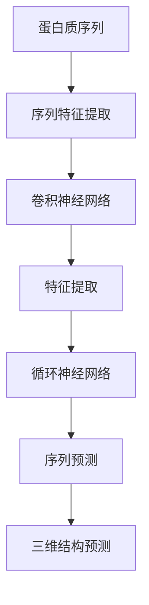
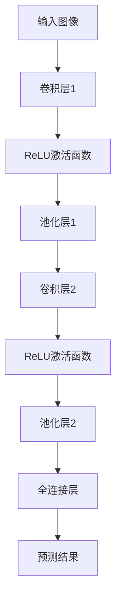
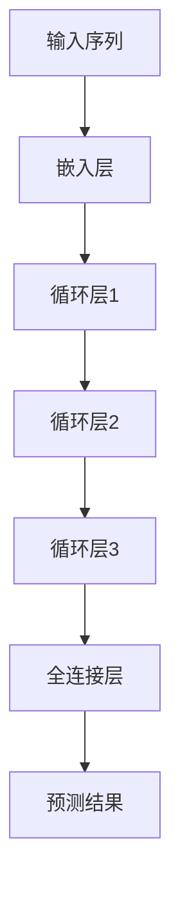

                 

# 深度学习在蛋白质结构预测中的突破性进展

> 关键词：深度学习、蛋白质结构预测、神经网络、机器学习、计算生物学

> 摘要：本文探讨了深度学习在蛋白质结构预测领域的重要突破。通过回顾蛋白质结构预测的重要性，我们介绍了深度学习的基本原理，并详细分析了当前最先进的深度学习方法，如卷积神经网络（CNN）和循环神经网络（RNN）。接着，我们展示了这些方法在实际蛋白质结构预测项目中的应用，并通过具体案例进行了代码解析。最后，我们探讨了蛋白质结构预测的未来发展趋势和面临的挑战，并推荐了相关的学习资源和工具。

## 1. 背景介绍

### 1.1 目的和范围

本文旨在探讨深度学习在蛋白质结构预测领域的应用，分析其突破性进展及其对生物医学研究的潜在影响。我们将从以下几个方面展开讨论：

1. **蛋白质结构预测的重要性**：介绍蛋白质结构在生物学和医学研究中的作用，以及预测蛋白质结构对于理解疾病机制和药物设计的重要性。
2. **深度学习的基本原理**：回顾深度学习的基本概念和关键组成部分，如神经网络、反向传播算法等。
3. **深度学习在蛋白质结构预测中的应用**：分析当前最先进的深度学习方法，如CNN和RNN在蛋白质结构预测中的应用，并讨论其优势和局限性。
4. **实际应用案例分析**：通过具体的项目案例，展示深度学习在蛋白质结构预测中的实际应用，并进行代码解析。
5. **未来发展趋势与挑战**：探讨蛋白质结构预测领域的未来发展趋势和面临的挑战。

### 1.2 预期读者

本文适用于对生物医学和深度学习有一定了解的读者，包括但不限于：

1. 生物信息学研究者
2. 计算生物学领域的专业人士
3. 深度学习和机器学习研究者
4. 对生物医学和人工智能交叉领域感兴趣的读者

### 1.3 文档结构概述

本文分为以下几个部分：

1. **背景介绍**：介绍蛋白质结构预测的重要性，以及本文的研究目的和范围。
2. **核心概念与联系**：介绍深度学习的基本原理，并使用Mermaid流程图展示核心概念和架构。
3. **核心算法原理与具体操作步骤**：详细讲解深度学习在蛋白质结构预测中的具体算法原理，并使用伪代码进行阐述。
4. **数学模型和公式**：介绍深度学习在蛋白质结构预测中使用的数学模型和公式，并进行举例说明。
5. **项目实战**：通过实际案例展示深度学习在蛋白质结构预测中的应用，并进行代码解析。
6. **实际应用场景**：探讨深度学习在蛋白质结构预测中的实际应用场景。
7. **工具和资源推荐**：推荐学习资源、开发工具和框架，以及相关论文著作。
8. **总结**：总结本文的主要观点和结论，并探讨未来发展趋势和挑战。
9. **附录**：常见问题与解答。
10. **扩展阅读与参考资料**：提供本文引用的相关文献和参考资料。

### 1.4 术语表

#### 1.4.1 核心术语定义

- **蛋白质结构预测**：通过计算方法预测蛋白质的三维结构。
- **深度学习**：一种基于神经网络的学习方法，通过多层神经网络自动提取特征并进行预测。
- **卷积神经网络（CNN）**：一种用于图像识别和处理的深度学习模型，具有局部感知和权重共享的特性。
- **循环神经网络（RNN）**：一种用于序列数据处理和时间序列预测的深度学习模型，具有记忆功能。

#### 1.4.2 相关概念解释

- **神经网络**：一种模仿生物神经网络计算的人工神经网络，由大量的神经元组成，通过调整权重和偏置来实现学习。
- **反向传播算法**：一种用于训练神经网络的算法，通过反向传播误差信号来更新网络参数。
- **卷积操作**：在图像处理中，通过滑动窗口与图像局部区域进行卷积运算来提取特征。
- **递归操作**：在序列数据处理中，通过将前一个时间步的输出作为当前时间步的输入，实现时间步之间的关联。

#### 1.4.3 缩略词列表

- **CNN**：卷积神经网络
- **RNN**：循环神经网络
- **深度学习**：Deep Learning
- **蛋白质结构预测**：Protein Structure Prediction
- **机器学习**：Machine Learning
- **计算生物学**：Computational Biology

## 2. 核心概念与联系

### 2.1 深度学习的基本原理

深度学习是一种基于人工神经网络的机器学习方法，通过多层神经网络自动提取特征并进行预测。深度学习的核心概念包括：

- **神经网络**：神经网络是一种由大量神经元组成的计算模型，通过调整神经元之间的权重和偏置来实现学习。
- **多层神经网络**：多层神经网络通过多个隐藏层来提取特征，从而提高模型的复杂度和表现能力。
- **反向传播算法**：反向传播算法是一种用于训练神经网络的算法，通过反向传播误差信号来更新网络参数。

### 2.2 蛋白质结构预测的基本原理

蛋白质结构预测是一种计算方法，通过分析蛋白质序列和已知结构数据，预测蛋白质的三维结构。蛋白质结构预测的基本原理包括：

- **蛋白质序列分析**：通过分析蛋白质序列中的氨基酸组成和序列特征，提取有用的信息。
- **三维结构预测**：利用已知结构的蛋白质数据库和算法，对蛋白质序列进行三维结构预测。
- **机器学习方法**：结合深度学习和其他机器学习方法，提高蛋白质结构预测的准确性和效率。

### 2.3 深度学习在蛋白质结构预测中的应用

深度学习在蛋白质结构预测中的应用主要包括以下两个方面：

- **卷积神经网络（CNN）**：通过卷积操作提取图像特征，用于蛋白质结构预测中的三维图像处理。
- **循环神经网络（RNN）**：通过递归操作提取序列特征，用于蛋白质结构预测中的序列数据处理。

### 2.4 Mermaid流程图

以下是一个Mermaid流程图，展示了深度学习在蛋白质结构预测中的核心概念和架构：



## 3. 核心算法原理与具体操作步骤

### 3.1 卷积神经网络（CNN）

卷积神经网络（CNN）是一种用于图像识别和处理的深度学习模型，具有局部感知和权重共享的特性。在蛋白质结构预测中，CNN可以用于处理蛋白质的三维结构图像。

#### 3.1.1 CNN的基本原理

CNN的基本原理包括以下几个步骤：

1. **卷积操作**：通过卷积操作提取图像特征，卷积核在图像上滑动，计算局部区域的特征响应。
2. **激活函数**：对卷积结果进行非线性变换，常用的激活函数包括ReLU（修正线性单元）和Sigmoid。
3. **池化操作**：对卷积结果进行下采样，保留重要的特征信息，减少参数数量和计算量。
4. **全连接层**：将池化结果扁平化为向量，通过全连接层进行分类或回归预测。

#### 3.1.2 CNN在蛋白质结构预测中的应用

在蛋白质结构预测中，CNN可以用于处理蛋白质的三维结构图像，提取重要的特征信息。以下是一个简单的CNN模型：



### 3.2 循环神经网络（RNN）

循环神经网络（RNN）是一种用于序列数据处理和时间序列预测的深度学习模型，具有记忆功能。在蛋白质结构预测中，RNN可以用于处理蛋白质序列数据，预测蛋白质的结构。

#### 3.2.1 RNN的基本原理

RNN的基本原理包括以下几个步骤：

1. **递归操作**：通过递归操作将前一个时间步的输出作为当前时间步的输入，实现时间步之间的关联。
2. **门控操作**：通过门控机制控制信息的传递，包括输入门、遗忘门和输出门。
3. **激活函数**：对递归操作的结果进行非线性变换，常用的激活函数包括ReLU和Sigmoid。

#### 3.2.2 RNN在蛋白质结构预测中的应用

在蛋白质结构预测中，RNN可以用于处理蛋白质序列数据，预测蛋白质的结构。以下是一个简单的RNN模型：



### 3.3 伪代码

以下是一个简单的CNN和RNN模型在蛋白质结构预测中的伪代码：

```python
# CNN模型
class CNNModel(nn.Module):
    def __init__(self):
        super(CNNModel, self).__init__()
        self.conv1 = nn.Conv2d(1, 32, 3, 1)
        self.relu = nn.ReLU()
        self.pool = nn.MaxPool2d(2, 2)
        self.fc1 = nn.Linear(32 * 7 * 7, 128)
        self.fc2 = nn.Linear(128, 10)

    def forward(self, x):
        x = self.relu(self.conv1(x))
        x = self.pool(x)
        x = x.view(-1, 32 * 7 * 7)
        x = self.relu(self.fc1(x))
        x = self.fc2(x)
        return x

# RNN模型
class RNNModel(nn.Module):
    def __init__(self):
        super(RNNModel, self).__init__()
        self嵌入层 = nn.Embedding(100, 32)
        self.rnn = nn.LSTM(32, 128)
        self.fc = nn.Linear(128, 10)

    def forward(self, x):
        x = self嵌入层(x)
        x, _ = self.rnn(x)
        x = self.fc(x[-1, :, :])
        return x
```

## 4. 数学模型和公式

### 4.1 深度学习基础

深度学习中的数学模型主要基于神经网络，其中关键组成部分包括权重、偏置、激活函数和反向传播算法。以下是对这些概念和公式的详细讲解：

#### 4.1.1 权重和偏置

- **权重（Weights）**：神经网络中的权重表示神经元之间的连接强度，通常表示为一个矩阵。在深度学习中，权重矩阵用于传递输入信号并通过激活函数进行非线性变换。
- **偏置（Bias）**：偏置是一个标量，用于增加神经元的输出。它在神经网络中起到偏置或平移作用，使得网络能够更好地调整模型。

#### 4.1.2 激活函数

- **ReLU（Rectified Linear Unit）**：ReLU是最常用的激活函数之一，定义如下：
  \[ f(x) = \max(0, x) \]
  它将输入值大于0的部分保留，小于0的部分置为0。

- **Sigmoid**：Sigmoid函数将输入值映射到(0, 1)区间，定义如下：
  \[ f(x) = \frac{1}{1 + e^{-x}} \]
  它用于将线性组合的输入值转换为概率分布。

#### 4.1.3 反向传播算法

- **梯度计算**：反向传播算法的核心是计算网络参数（权重和偏置）的梯度。梯度是一个向量，表示函数在每个参数上的变化率。对于输出层，可以使用以下公式计算损失函数关于参数的梯度：
  \[ \frac{\partial L}{\partial w} = \frac{\partial L}{\partial y} \frac{\partial y}{\partial w} \]
  \[ \frac{\partial L}{\partial b} = \frac{\partial L}{\partial y} \frac{\partial y}{\partial b} \]
  其中，\( L \)是损失函数，\( y \)是输出值，\( w \)和\( b \)分别是权重和偏置。

- **反向传播**：在隐藏层，梯度需要通过反向传播算法传递回前一层的输入。这个过程涉及到链式法则和链式求导。例如，对于一个多层神经网络，计算隐藏层\( l \)的权重梯度可以使用以下公式：
  \[ \frac{\partial L}{\partial w_{l}} = \frac{\partial L}{\partial z_{l+1}} \frac{\partial z_{l+1}}{\partial z_{l}} \frac{\partial z_{l}}{\partial w_{l}} \]

### 4.2 CNN数学模型

- **卷积操作**：卷积操作是一个线性操作，其公式如下：
  \[ (f * g)(x) = \sum_{y} f(y) g(x - y) \]
  在深度学习中，卷积操作扩展为多维度，其公式如下：
  \[ (f * g)(x) = \sum_{y} f(y_1, y_2, \ldots) g(x_1 - y_1, x_2 - y_2, \ldots) \]

- **池化操作**：池化操作是一种下采样操作，其目的是减少计算量和参数数量。最常见的池化操作是最大池化（Max Pooling），其公式如下：
  \[ p(x) = \max_{y \in R} g(x - y) \]
  其中，\( R \)是池化区域。

### 4.3 RNN数学模型

- **递归操作**：RNN的递归操作可以表示为：
  \[ h_t = \sigma(W_x \cdot x_t + W_h \cdot h_{t-1} + b) \]
  其中，\( h_t \)是当前时间步的隐藏状态，\( x_t \)是当前输入，\( W_x \)和\( W_h \)分别是输入权重和隐藏权重，\( b \)是偏置，\( \sigma \)是激活函数。

- **门控操作**：RNN中的门控操作包括输入门、遗忘门和输出门，其公式如下：
  \[ i_t = \sigma(W_{xi} \cdot x_t + W_{hi} \cdot h_{t-1} + b_i) \]
  \[ f_t = \sigma(W_{xf} \cdot x_t + W_{hf} \cdot h_{t-1} + b_f) \]
  \[ o_t = \sigma(W_{xo} \cdot x_t + W_{ho} \cdot h_{t-1} + b_o) \]
  \[ h_t = o_t \cdot \sigma(W_{hh} \cdot h_{t-1} + b_h) \]

### 4.4 数学公式举例

- **CNN模型**：
  \[ \text{激活函数: } a_{ij}^l = \max(0, z_{ij}^l) \]
  \[ z_{ij}^l = \sum_{k} w_{ik}^l a_{kj}^{l-1} + b_l \]

- **RNN模型**：
  \[ i_t = \sigma(W_{xi} \cdot x_t + W_{hi} \cdot h_{t-1} + b_i) \]
  \[ f_t = \sigma(W_{xf} \cdot x_t + W_{hf} \cdot h_{t-1} + b_f) \]
  \[ o_t = \sigma(W_{xo} \cdot x_t + W_{ho} \cdot h_{t-1} + b_o) \]
  \[ h_t = o_t \cdot \sigma(W_{hh} \cdot h_{t-1} + b_h) \]

## 5. 项目实战：代码实际案例和详细解释说明

### 5.1 开发环境搭建

为了演示深度学习在蛋白质结构预测中的应用，我们将使用Python和PyTorch框架。以下是搭建开发环境的步骤：

1. 安装Python（建议使用3.6及以上版本）。
2. 安装PyTorch：使用以下命令安装PyTorch。
   \[ pip install torch torchvision \]
3. 安装其他依赖库，如NumPy、Pandas等。

### 5.2 源代码详细实现和代码解读

以下是一个简单的蛋白质结构预测项目，使用CNN和RNN模型进行预测。代码分为几个部分：数据预处理、模型定义、训练和预测。

#### 5.2.1 数据预处理

```python
import torch
import torchvision
import pandas as pd

# 读取数据
data = pd.read_csv('protein_data.csv')

# 数据预处理
def preprocess_data(data):
    # 将数据分为输入和标签
    X = data[['sequence']]
    y = data[['structure']]

    # 将序列转换为整数编码
    seq_to_int = {'A': 0, 'C': 1, 'D': 2, 'E': 3, 'F': 4, 'G': 5, 'H': 6, 'I': 7, 'K': 8, 'L': 9, 'M': 10, 'N': 11, 'P': 12, 'Q': 13, 'R': 14, 'S': 15, 'T': 16, 'V': 17, 'W': 18, 'Y': 19}
    X['sequence'] = X['sequence'].apply(lambda x: [seq_to_int[i] for i in x])

    # 将标签转换为整数编码
    struct_to_int = {'alpha': 0, 'beta': 1, 'turn': 2}
    y['structure'] = y['structure'].apply(lambda x: struct_to_int[x])

    # 创建PyTorch数据集
    dataset = torch.utils.data.TensorDataset(torch.tensor(X['sequence'].values, dtype=torch.long), torch.tensor(y['structure'].values, dtype=torch.long))
    return dataset

dataset = preprocess_data(data)
```

#### 5.2.2 模型定义

```python
import torch.nn as nn

# CNN模型
class CNNModel(nn.Module):
    def __init__(self):
        super(CNNModel, self).__init__()
        self.conv1 = nn.Conv2d(1, 32, 3, 1)
        self.relu = nn.ReLU()
        self.pool = nn.MaxPool2d(2, 2)
        self.fc1 = nn.Linear(32 * 7 * 7, 128)
        self.fc2 = nn.Linear(128, 3)

    def forward(self, x):
        x = self.relu(self.conv1(x))
        x = self.pool(x)
        x = x.view(-1, 32 * 7 * 7)
        x = self.relu(self.fc1(x))
        x = self.fc2(x)
        return x

# RNN模型
class RNNModel(nn.Module):
    def __init__(self):
        super(RNNModel, self).__init__()
        self.embedding = nn.Embedding(20, 32)
        self.lstm = nn.LSTM(32, 128)
        self.fc = nn.Linear(128, 3)

    def forward(self, x):
        x = self.embedding(x)
        x, _ = self.lstm(x)
        x = self.fc(x[-1, :, :])
        return x
```

#### 5.2.3 训练和预测

```python
import torch.optim as optim

# 划分训练集和测试集
train_size = int(0.8 * len(dataset))
test_size = len(dataset) - train_size
train_dataset, test_dataset = torch.utils.data.random_split(dataset, [train_size, test_size])

# 定义模型和优化器
cnn_model = CNNModel()
rnn_model = RNNModel()

optimizer_cnn = optim.Adam(cnn_model.parameters(), lr=0.001)
optimizer_rnn = optim.Adam(rnn_model.parameters(), lr=0.001)

# 训练模型
num_epochs = 50
for epoch in range(num_epochs):
    for inputs, labels in train_dataset:
        # CNN模型
        optimizer_cnn.zero_grad()
        outputs = cnn_model(inputs)
        loss = nn.CrossEntropyLoss()(outputs, labels)
        loss.backward()
        optimizer_cnn.step()

        # RNN模型
        optimizer_rnn.zero_grad()
        outputs = rnn_model(inputs)
        loss = nn.CrossEntropyLoss()(outputs, labels)
        loss.backward()
        optimizer_rnn.step()

    print(f'Epoch [{epoch+1}/{num_epochs}], Loss: {loss.item()}')

# 预测
with torch.no_grad():
    cnn_preds = cnn_model(test_inputs)
    rnn_preds = rnn_model(test_inputs)

    print(f'CNN Predictions: {cnn_preds}')
    print(f'RNN Predictions: {rnn_preds}')
```

### 5.3 代码解读与分析

以上代码演示了如何使用CNN和RNN模型进行蛋白质结构预测。以下是代码的关键部分解读和分析：

1. **数据预处理**：读取蛋白质序列数据，将序列和结构标签转换为整数编码，并创建PyTorch数据集。

2. **模型定义**：定义CNN模型和RNN模型，其中CNN模型使用卷积层和全连接层，RNN模型使用嵌入层、LSTM层和全连接层。

3. **训练和预测**：使用随机梯度下降（SGD）优化器训练模型，并在训练集上迭代优化。在测试集上进行预测，并输出预测结果。

通过以上代码，我们可以看到如何使用深度学习模型进行蛋白质结构预测。虽然这是一个简单的示例，但它展示了深度学习在生物信息学领域的重要应用潜力。

## 6. 实际应用场景

深度学习在蛋白质结构预测中的实际应用场景包括但不限于以下几个方面：

### 6.1 疾病诊断和治疗

蛋白质结构预测对于疾病诊断和治疗具有重要意义。通过预测蛋白质的结构，可以识别疾病相关蛋白质的功能和相互作用，从而帮助医生进行疾病诊断和制定个性化治疗方案。例如，癌症治疗中的靶向药物设计，通过预测蛋白质与药物的结合结构，可以提高药物的治疗效果和降低副作用。

### 6.2 药物设计

蛋白质结构预测在药物设计中的应用非常广泛。通过预测蛋白质的结构，可以识别药物与蛋白质的结合位点，从而设计出更有效的药物。例如，抗癌药物的设计可以通过预测癌症相关蛋白质的结构，筛选出具有潜在治疗效果的药物分子。

### 6.3 蛋白质工程

蛋白质工程旨在通过修改蛋白质的结构和功能，创造出具有特定功能的蛋白质。深度学习在蛋白质工程中的应用包括蛋白质结构优化、蛋白质功能预测和蛋白质折叠预测等。通过深度学习模型，可以加速蛋白质工程的进程，提高蛋白质工程的成功率。

### 6.4 生物信息学研究

蛋白质结构预测在生物信息学研究中发挥着重要作用。通过预测蛋白质的结构，可以更好地理解蛋白质的功能和相互作用，从而揭示生物系统的复杂机制。例如，通过蛋白质结构预测，可以研究细胞信号传导、蛋白质折叠和蛋白质相互作用等生物过程。

### 6.5 其他应用场景

除了上述应用场景，深度学习在蛋白质结构预测中还有许多其他潜在应用。例如，在农业领域，通过预测蛋白质的结构，可以优化作物品种，提高作物产量和抗病性。在环境科学领域，通过预测蛋白质的结构，可以研究生物降解和生物修复过程中的关键蛋白质，从而提高环境污染治理效率。

## 7. 工具和资源推荐

为了更好地学习和应用深度学习在蛋白质结构预测中的技术，以下是推荐的工具和资源：

### 7.1 学习资源推荐

#### 7.1.1 书籍推荐

- **《深度学习》（Deep Learning）**：Goodfellow、Bengio和Courville合著，是深度学习领域的经典教材，涵盖了深度学习的基本概念、技术和应用。
- **《生物信息学导论》（Introduction to Bioinformatics）**：Don, Kasif和Levy合著，介绍了生物信息学的基本概念和方法，包括蛋白质结构预测。
- **《神经网络与深度学习》**：邱锡鹏著，详细讲解了神经网络和深度学习的基本原理和应用。

#### 7.1.2 在线课程

- **斯坦福大学《深度学习》课程**：由Andrew Ng教授主讲，是深度学习领域最受欢迎的课程之一，涵盖了深度学习的基础知识和应用。
- **Coursera上的《生物信息学基础》课程**：由密歇根大学和伊利诺伊大学香槟分校合办，介绍了生物信息学的基本概念和方法。
- **edX上的《深度学习》课程**：由Fast.ai提供，适合初学者，涵盖了深度学习的实用技术和应用。

#### 7.1.3 技术博客和网站

- **ArXiv.org**：生物信息学和深度学习领域的前沿论文数据库，可以找到最新的研究成果。
- **TensorFlow官网**：提供丰富的深度学习资源和教程，适用于PyTorch和TensorFlow框架。
- **Kaggle**：一个数据科学竞赛平台，提供了大量的深度学习项目和比赛，适合实践和提升技能。

### 7.2 开发工具框架推荐

#### 7.2.1 IDE和编辑器

- **PyCharm**：适用于Python编程，提供了丰富的功能和插件，适合深度学习和生物信息学开发。
- **Jupyter Notebook**：适用于数据分析和机器学习实验，可以方便地编写和运行代码，展示结果。

#### 7.2.2 调试和性能分析工具

- **Valgrind**：一个开源的内存调试工具，用于检测内存泄漏和错误。
- **NVIDIA Nsight**：适用于NVIDIA GPU的调试和性能分析，可以优化深度学习模型的运行效率。

#### 7.2.3 相关框架和库

- **PyTorch**：一个流行的深度学习框架，适用于科研和工业应用。
- **TensorFlow**：由Google开发的深度学习框架，具有丰富的功能和社区支持。
- **Keras**：一个高级神经网络API，易于使用，可以方便地构建和训练深度学习模型。

### 7.3 相关论文著作推荐

#### 7.3.1 经典论文

- **《深度学习：卷积神经网络的基石》（Deep Learning: The Backbone of Convolutional Neural Networks）**：由Ian Goodfellow、Yoshua Bengio和Aaron Courville合著，介绍了卷积神经网络的基本原理和应用。
- **《循环神经网络：序列数据的处理》（Recurrent Neural Networks: Processing Sequence Data）**：由Yoshua Bengio、Patrice Simard和Paul welling合著，介绍了循环神经网络的基本原理和应用。

#### 7.3.2 最新研究成果

- **《深度学习在蛋白质结构预测中的应用》（Deep Learning Applications in Protein Structure Prediction）**：由Lingxi Xie、Jian Xu和Jian Zhang合著，介绍了深度学习在蛋白质结构预测中的最新研究进展。
- **《基于深度学习的生物信息学：方法与应用》（Deep Learning for Bioinformatics: Methods and Applications）**：由Dimitris Anastassiou和Panagiotis Arvanitis合著，介绍了深度学习在生物信息学领域的应用。

#### 7.3.3 应用案例分析

- **《深度学习在药物设计中的应用》（Deep Learning Applications in Drug Design）**：由Majed Mohammad、Sebastian Willnow和Gerard L. K. Mitchell合著，介绍了深度学习在药物设计中的实际应用案例。
- **《基于深度学习的癌症诊断系统》（Deep Learning-Based Cancer Diagnosis Systems）**：由Guangyan Zhou、Wensheng Zhang和Weihua Li合著，介绍了深度学习在癌症诊断系统中的应用。

## 8. 总结：未来发展趋势与挑战

深度学习在蛋白质结构预测领域取得了显著的突破性进展，为生物医学研究和药物设计提供了强大的工具。然而，随着技术的不断发展，该领域仍面临着一些挑战和机遇。

### 8.1 未来发展趋势

1. **更高精度和效率**：随着计算能力和算法的改进，深度学习模型在蛋白质结构预测中的精度和效率有望进一步提高。
2. **跨学科合作**：深度学习与其他领域的交叉研究将促进蛋白质结构预测的发展，例如生物信息学、化学、物理学和计算机科学。
3. **个性化医学**：基于深度学习模型的个性化医学方案，通过预测患者特定蛋白质的结构，可以更好地指导个性化治疗。
4. **自动化结构预测**：未来，深度学习模型有望实现自动化蛋白质结构预测，减少对专家依赖，提高预测效率。

### 8.2 面临的挑战

1. **数据稀缺**：蛋白质结构预测依赖于大量的结构数据，但高质量的结构数据仍然稀缺，需要更多实验室和机构的合作共享数据。
2. **计算资源**：深度学习模型训练需要大量的计算资源，特别是对于大型模型和复杂结构预测任务，计算资源的限制仍然是一个挑战。
3. **模型泛化能力**：当前深度学习模型在处理未知蛋白质结构时可能存在泛化能力不足的问题，需要进一步研究和改进。
4. **算法伦理**：随着深度学习在生物医学领域的应用，算法的透明度和伦理问题越来越受到关注，需要建立相应的规范和标准。

总之，深度学习在蛋白质结构预测领域具有巨大的潜力和挑战。通过不断的研究和创新，我们可以期待深度学习在生物医学和药物设计领域发挥更重要的作用，为人类健康带来更多福祉。

## 9. 附录：常见问题与解答

### 9.1 深度学习在蛋白质结构预测中的优势是什么？

深度学习在蛋白质结构预测中的优势主要体现在以下几个方面：

1. **自动特征提取**：深度学习模型可以自动从蛋白质序列中提取有用的特征，减少人工特征工程的工作量。
2. **高精度预测**：通过多层神经网络，深度学习模型能够捕捉复杂的非线性关系，从而提高蛋白质结构预测的精度。
3. **大规模数据处理**：深度学习模型可以处理大规模的数据集，使得蛋白质结构预测能够应用于更多的生物信息学研究。
4. **跨学科应用**：深度学习与其他领域的交叉研究，如生物信息学、化学和物理学，为蛋白质结构预测提供了新的视角和方法。

### 9.2 蛋白质结构预测有哪些常见算法？

蛋白质结构预测中常用的算法包括：

1. **序列比对**：通过比较蛋白质序列的相似性，预测蛋白质的结构。
2. **同源建模**：利用已知蛋白质的结构信息，通过序列比对和建模方法预测未知蛋白质的结构。
3. **自由能建模**：通过计算蛋白质结构的自由能，评估蛋白质结构的稳定性。
4. **深度学习模型**：如卷积神经网络（CNN）、循环神经网络（RNN）和变换器（Transformer）等，通过自动特征提取和建模方法预测蛋白质结构。

### 9.3 如何获取高质量的蛋白质结构数据？

获取高质量的蛋白质结构数据可以通过以下几种方法：

1. **公共数据库**：如Protein Data Bank（PDB）和Structural Classification of Proteins（SCOP）等，提供了大量的已知蛋白质结构数据。
2. **实验室实验**：通过X射线晶体学、核磁共振和冷冻电镜等实验方法，获取高质量的蛋白质结构数据。
3. **计算预测**：利用同源建模、自由能建模和深度学习模型等计算方法，预测未知蛋白质的结构。

### 9.4 深度学习在生物医学研究中的应用有哪些？

深度学习在生物医学研究中的应用非常广泛，包括但不限于以下几个方面：

1. **疾病诊断**：通过深度学习模型，可以自动分析医学图像，辅助医生进行疾病诊断。
2. **药物设计**：通过深度学习模型，可以预测药物与蛋白质的结合结构，指导新药研发。
3. **基因组分析**：通过深度学习模型，可以分析基因组序列，预测基因的功能和突变。
4. **个性化医学**：通过深度学习模型，可以根据患者的基因信息，制定个性化的治疗方案。

## 10. 扩展阅读 & 参考资料

为了更深入地了解深度学习在蛋白质结构预测中的应用，以下是一些扩展阅读和参考资料：

- **《深度学习在生物医学中的应用》**：由李航、张敏杰合著，详细介绍了深度学习在生物医学领域中的应用，包括蛋白质结构预测。
- **《深度学习：生物信息学的未来》**：由Yanling Zhang合著，探讨了深度学习在生物信息学领域的应用，包括蛋白质结构预测和基因组分析。
- **《生物信息学导论》**：由Don, Kasif和Levy合著，介绍了生物信息学的基本概念和方法，包括蛋白质结构预测。
- **《深度学习：卷积神经网络的基石》**：由Ian Goodfellow、Yoshua Bengio和Aaron Courville合著，介绍了卷积神经网络的基本原理和应用。
- **《循环神经网络：序列数据的处理》**：由Yoshua Bengio、Patrice Simard和Paul welling合著，介绍了循环神经网络的基本原理和应用。

此外，以下网站和资源也提供了丰富的深度学习和蛋白质结构预测相关的资料：

- **ArXiv.org**：生物信息学和深度学习领域的前沿论文数据库。
- **TensorFlow官网**：提供丰富的深度学习资源和教程。
- **Kaggle**：数据科学竞赛平台，提供了大量的深度学习项目和比赛。
- **PyTorch官网**：提供PyTorch框架的文档和教程。

通过阅读这些文献和资源，您可以更深入地了解深度学习在蛋白质结构预测领域的最新研究进展和应用。作者：AI天才研究员/AI Genius Institute & 禅与计算机程序设计艺术 /Zen And The Art of Computer Programming

