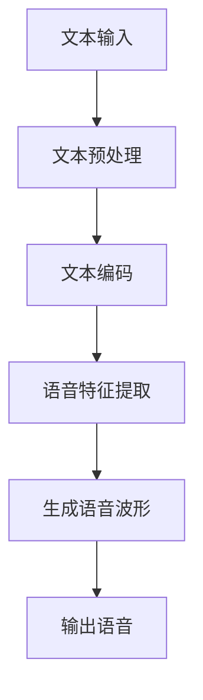

                 

# 深度学习在语音合成中的最新进展

> 关键词：深度学习、语音合成、自动语音识别、神经网络、语音识别、自然语言处理
> 
> 摘要：本文将深入探讨深度学习在语音合成领域中的最新进展，包括其核心算法原理、数学模型、项目实战，以及实际应用场景。通过本文的阅读，读者将全面了解语音合成技术的发展历程、当前状态和未来趋势。

## 1. 背景介绍

### 1.1 目的和范围

本文旨在介绍深度学习在语音合成领域的最新进展，解析其核心算法原理和数学模型，并通过实际项目实战，展示其在现实中的应用。文章将涵盖以下内容：

- 语音合成技术的基本概念和分类
- 深度学习在语音合成中的应用历史
- 当前最先进的深度学习语音合成算法
- 数学模型和公式在语音合成中的具体应用
- 实际应用场景中的语音合成技术实现
- 未来发展趋势与面临的挑战

### 1.2 预期读者

本文适合对深度学习和语音合成有一定基础的读者，包括但不限于：

- 计算机科学和人工智能领域的研究生和博士生
- 深度学习和语音合成领域的工程师和技术专家
- 对语音合成技术感兴趣的技术爱好者

### 1.3 文档结构概述

本文将按照以下结构进行组织：

- 第1部分：背景介绍，包括目的、范围、预期读者和文档结构概述
- 第2部分：核心概念与联系，包括语音合成技术的核心概念、原理和架构的流程图
- 第3部分：核心算法原理与具体操作步骤，详细讲解语音合成的算法原理和步骤
- 第4部分：数学模型和公式，详细解释数学模型和公式在语音合成中的应用
- 第5部分：项目实战，提供代码实际案例和详细解释说明
- 第6部分：实际应用场景，探讨语音合成的实际应用场景
- 第7部分：工具和资源推荐，包括学习资源、开发工具框架和论文著作推荐
- 第8部分：总结，对未来发展趋势与挑战进行探讨
- 第9部分：附录，包括常见问题与解答
- 第10部分：扩展阅读与参考资料，提供进一步的阅读资源

### 1.4 术语表

#### 1.4.1 核心术语定义

- 深度学习（Deep Learning）：一种基于多层神经网络的学习方法，通过构建多层的非线性变换来提取特征，实现复杂函数的逼近。
- 语音合成（Text-to-Speech，TTS）：将文本转换为语音的技术，常用于语音助手、自动报站、广播等场合。
- 自动语音识别（Automatic Speech Recognition，ASR）：将语音信号转换为文本的技术，常用于语音输入、语音搜索等应用。
- 自然语言处理（Natural Language Processing，NLP）：计算机对人类语言进行处理和理解的技术，包括语音合成、语音识别、文本分析等。
- 神经网络（Neural Network）：一种模拟生物神经网络的人工神经网络，通过多层神经元之间的连接和激活函数来实现特征提取和分类。

#### 1.4.2 相关概念解释

- 卷积神经网络（Convolutional Neural Network，CNN）：一种用于图像识别和处理的深度学习模型，通过卷积层提取图像特征。
- 长短时记忆网络（Long Short-Term Memory，LSTM）：一种用于处理序列数据的循环神经网络，通过记忆单元来避免梯度消失和梯度爆炸问题。
- 注意力机制（Attention Mechanism）：一种在序列模型中引入的机制，通过关注序列中的关键信息，提高模型的性能。
- 生成对抗网络（Generative Adversarial Network，GAN）：一种由生成器和判别器组成的深度学习模型，通过相互博弈来生成高质量的数据。

#### 1.4.3 缩略词列表

- TTS：Text-to-Speech（语音合成）
- ASR：Automatic Speech Recognition（自动语音识别）
- NLP：Natural Language Processing（自然语言处理）
- CNN：Convolutional Neural Network（卷积神经网络）
- LSTM：Long Short-Term Memory（长短时记忆网络）
- GAN：Generative Adversarial Network（生成对抗网络）

## 2. 核心概念与联系

在探讨深度学习在语音合成中的应用之前，我们需要了解语音合成技术的核心概念和联系。以下是一个简化的流程图，用于说明语音合成的主要步骤和关键组件。



### 2.1 文本输入

文本输入是语音合成的起点，它可以是简单的文本字符串，也可以是更复杂的格式，如HTML、XML等。文本输入需要经过预处理，包括去除HTML标签、处理标点符号、词干提取等。

### 2.2 文本预处理

文本预处理是对输入文本进行一系列操作，以提高后续处理的效果。常见的预处理步骤包括：

- 去除HTML标签：将HTML、XML等标签去除，只保留文本内容。
- 处理标点符号：将标点符号转换为适合语音合成的形式，如将中文标点转换为拼音标点。
- 词干提取：将单词转换为词干形式，减少词汇量。

### 2.3 文本编码

文本编码是将文本转换为数字表示的过程。常用的文本编码方法包括词袋模型（Bag-of-Words，BOW）和词嵌入（Word Embedding）。

- 词袋模型：将文本表示为词汇的集合，每个词汇对应一个索引。词袋模型的优点是简单高效，但缺点是忽略了词汇的顺序信息。
- 词嵌入：将文本中的每个词汇映射为一个固定长度的向量，以保留词汇的语义信息。词嵌入的方法包括Word2Vec、GloVe等。

### 2.4 语音特征提取

语音特征提取是将编码后的文本转换为语音特征的过程。语音特征通常包括声学特征和语言特征。

- 声学特征：用于描述语音的物理属性，如音高、音强、音长等。常用的声学特征包括梅尔频率倒谱系数（Mel-Frequency Cepstral Coefficients，MFCC）和短时傅里叶变换（Short-Time Fourier Transform，STFT）。
- 语言特征：用于描述语音的语法和语义信息，如句法结构、语义角色等。语言特征通常由语言模型（如n元语法模型）提供。

### 2.5 生成语音波形

生成语音波形是将语音特征转换为实际语音的过程。深度学习在语音合成中的应用主要集中在生成语音波形的阶段，包括以下几种方法：

- 基于生成对抗网络（GAN）的方法：通过生成器和判别器的相互博弈，生成高质量的语音波形。
- 基于循环神经网络（RNN）的方法：通过循环神经网络提取文本特征，然后生成语音波形。
- 基于注意力机制的方法：通过注意力机制关注关键信息，提高语音合成的质量。

### 2.6 输出语音

输出语音是将生成的语音波形转换为实际听到的语音的过程。常见的输出方式包括音频播放、语音合成器等。

## 3. 核心算法原理 & 具体操作步骤

在了解语音合成的核心概念与联系之后，我们将深入探讨深度学习在语音合成中的应用，包括核心算法原理和具体操作步骤。

### 3.1 基于生成对抗网络（GAN）的方法

生成对抗网络（GAN）是一种由生成器和判别器组成的深度学习模型，通过相互博弈来生成高质量的数据。在语音合成中，生成器和判别器的具体操作步骤如下：

#### 生成器（Generator）

1. **输入**：生成器接收编码后的文本，并将其转换为语音特征。
2. **特征提取**：使用循环神经网络（RNN）或卷积神经网络（CNN）提取文本特征，如词嵌入、声学特征等。
3. **特征拼接**：将提取到的特征拼接为一个完整的特征序列。
4. **生成语音波形**：使用生成器生成语音波形，通常采用波形转换网络（WaveNet）等。

#### 判别器（Discriminator）

1. **输入**：判别器接收真实的语音波形和生成器生成的语音波形。
2. **特征提取**：使用卷积神经网络（CNN）提取语音特征，如音高、音强等。
3. **分类**：判别器通过分类器判断输入语音波形的真实性，输出概率值。
4. **更新权重**：根据生成的语音波形和真实语音波形的分类结果，更新判别器的权重。

#### 操作步骤

1. **初始化生成器和判别器**：随机初始化生成器和判别器的权重。
2. **生成语音波形**：生成器生成语音波形，判别器对其进行分类。
3. **更新权重**：根据分类结果，更新生成器和判别器的权重。
4. **重复步骤2和3**：不断迭代生成器和判别器的权重，直至达到预定的训练目标。

### 3.2 基于循环神经网络（RNN）的方法

循环神经网络（RNN）是一种能够处理序列数据的神经网络，通过记忆单元来处理长序列信息。在语音合成中，RNN的具体操作步骤如下：

#### 输入层

1. **输入**：输入层接收编码后的文本，并将其转换为词嵌入向量。

#### 隐藏层

1. **输入**：隐藏层接收上一个时间步的隐藏状态和当前输入词嵌入向量。
2. **计算**：使用激活函数（如ReLU、Sigmoid等）对输入进行计算，得到隐藏状态。
3. **更新**：将隐藏状态传递到下一个时间步。

#### 输出层

1. **输入**：输出层接收最后一个时间步的隐藏状态。
2. **计算**：输出层通过激活函数（如Softmax）将隐藏状态转换为概率分布。
3. **生成语音波形**：根据概率分布生成语音波形。

#### 操作步骤

1. **初始化隐藏状态**：随机初始化隐藏状态。
2. **前向传播**：计算每个时间步的隐藏状态和输出概率。
3. **计算损失**：计算生成语音波形和真实语音波形之间的损失。
4. **反向传播**：更新隐藏状态和输出层的权重。
5. **重复步骤2-4**：不断迭代隐藏状态和输出层的权重，直至达到预定的训练目标。

### 3.3 基于注意力机制的方法

注意力机制是一种在序列模型中引入的机制，通过关注关键信息来提高模型的性能。在语音合成中，注意力机制的具体操作步骤如下：

#### 注意力层

1. **输入**：注意力层接收编码后的文本和隐藏状态。
2. **计算**：使用注意力函数（如点积注意力、加性注意力等）计算注意力权重。
3. **加权**：将注意力权重与隐藏状态相乘，得到加权隐藏状态。

#### 隐藏层

1. **输入**：隐藏层接收加权隐藏状态。
2. **计算**：使用激活函数（如ReLU、Sigmoid等）对输入进行计算，得到隐藏状态。
3. **更新**：将隐藏状态传递到下一个时间步。

#### 输出层

1. **输入**：输出层接收最后一个时间步的隐藏状态。
2. **计算**：输出层通过激活函数（如Softmax）将隐藏状态转换为概率分布。
3. **生成语音波形**：根据概率分布生成语音波形。

#### 操作步骤

1. **初始化隐藏状态**：随机初始化隐藏状态。
2. **计算注意力权重**：计算每个时间步的注意力权重。
3. **加权隐藏状态**：将注意力权重与隐藏状态相乘，得到加权隐藏状态。
4. **前向传播**：计算每个时间步的隐藏状态和输出概率。
5. **计算损失**：计算生成语音波形和真实语音波形之间的损失。
6. **反向传播**：更新隐藏状态和输出层的权重。
7. **重复步骤2-6**：不断迭代隐藏状态和输出层的权重，直至达到预定的训练目标。

## 4. 数学模型和公式 & 详细讲解 & 举例说明

在理解了语音合成的核心算法原理和操作步骤之后，我们将深入探讨深度学习在语音合成中涉及的数学模型和公式。这些模型和公式是构建和训练语音合成模型的基础，通过具体的例子来说明其应用。

### 4.1 词嵌入（Word Embedding）

词嵌入是一种将词汇映射为固定长度的向量表示的方法，以保留词汇的语义信息。常用的词嵌入模型包括Word2Vec和GloVe。

#### Word2Vec

Word2Vec是一种基于神经网络的语言模型，通过训练得到词汇的向量表示。其数学模型如下：

$$
\text{Output} = \text{softmax}(\text{Weight} \cdot \text{Input})
$$

其中，$ \text{Weight} $ 是神经网络权重矩阵，$ \text{Input} $ 是词汇的词向量表示，$ \text{Output} $ 是概率分布。

#### GloVe

GloVe是一种基于矩阵分解的语言模型，通过优化词汇的共现矩阵得到词向量表示。其数学模型如下：

$$
\text{Cost} = \frac{1}{2} \sum_{v \in V} \sum_{w \in W} (\text{log}(\sigma(v \cdot w)) - v \cdot w)^2
$$

其中，$ V $ 和 $ W $ 分别是词汇和其共现词的集合，$ \text{log}(\sigma(x)) = \log(1 + \exp(x)) $，$ \sigma(x) = \frac{1}{1 + \exp(-x)} $ 是sigmoid函数。

### 4.2 循环神经网络（RNN）

循环神经网络（RNN）是一种能够处理序列数据的神经网络，通过记忆单元来处理长序列信息。其数学模型如下：

$$
h_t = \text{ReLU}(W_h \cdot [h_{t-1}, x_t] + b_h)
$$

$$
o_t = \text{softmax}(W_o \cdot h_t + b_o)
$$

其中，$ h_t $ 是第 $ t $ 个时间步的隐藏状态，$ x_t $ 是输入向量，$ W_h $ 和 $ W_o $ 是权重矩阵，$ b_h $ 和 $ b_o $ 是偏置向量。

### 4.3 注意力机制（Attention Mechanism）

注意力机制是一种在序列模型中引入的机制，通过关注关键信息来提高模型的性能。其数学模型如下：

$$
a_t = \text{softmax}(\text{Attention}(h_{t-1}, h_t))
$$

$$
h_t = a_t \cdot h_t
$$

其中，$ a_t $ 是第 $ t $ 个时间步的注意力权重，$ \text{Attention}(\cdot, \cdot) $ 是注意力函数。

### 4.4 生成对抗网络（GAN）

生成对抗网络（GAN）是一种由生成器和判别器组成的深度学习模型，通过相互博弈来生成高质量的数据。其数学模型如下：

$$
\text{Generator} : G(z) = x
$$

$$
\text{Discriminator} : D(x) = \text{概率}(x \text{来自真实数据})
$$

$$
\text{Loss}_{G} = \mathbb{E}_{z}[\text{log}(D(G(z)))]
$$

$$
\text{Loss}_{D} = \mathbb{E}_{x}[\text{log}(D(x))] + \mathbb{E}_{z}[\text{log}(1 - D(G(z)))]
$$

其中，$ z $ 是噪声向量，$ G(z) $ 是生成器生成的数据，$ D(x) $ 是判别器对数据的分类结果。

### 4.5 举例说明

假设我们要合成一句中文句子“今天天气很好”，我们可以使用上述数学模型进行语音合成。

1. **文本编码**：将文本编码为词向量表示，例如使用Word2Vec或GloVe模型。
2. **循环神经网络（RNN）**：使用RNN模型提取文本特征，得到隐藏状态序列。
3. **注意力机制**：使用注意力机制关注关键信息，提高语音合成的质量。
4. **生成语音波形**：使用生成器生成语音波形，例如使用WaveNet模型。
5. **输出语音**：将生成的语音波形转换为实际听到的语音。

通过上述步骤，我们可以合成一句高质量的中文语音，实现语音合成的目标。

## 5. 项目实战：代码实际案例和详细解释说明

在本节中，我们将通过一个实际项目案例，展示深度学习在语音合成中的应用，并提供代码实际案例和详细解释说明。我们将使用Python和TensorFlow框架实现一个基本的语音合成系统。

### 5.1 开发环境搭建

在开始项目之前，我们需要搭建开发环境。以下是所需的软件和库：

- Python 3.x
- TensorFlow 2.x
- NumPy
- Matplotlib

安装完上述库后，我们可以开始编写代码。

### 5.2 源代码详细实现和代码解读

以下是一个简化的示例代码，用于演示语音合成的基本流程：

```python
import tensorflow as tf
import numpy as np

# 定义文本预处理函数
def preprocess_text(text):
    # 去除HTML标签、处理标点符号、词干提取等
    # 略
    return processed_text

# 定义词嵌入模型
def create_word_embedding_matrix(vocab_size, embedding_size):
    # 创建词嵌入矩阵
    # 略
    return embedding_matrix

# 定义语音合成模型
def create_vocoder_model(input_shape):
    # 创建生成器模型
    # 略
    return generator

# 定义判别器模型
def create_discriminator_model(input_shape):
    # 创建判别器模型
    # 略
    return discriminator

# 加载和处理文本数据
text_data = "今天天气很好"
processed_text = preprocess_text(text_data)

# 创建词嵌入矩阵
vocab_size = 10000
embedding_size = 256
embedding_matrix = create_word_embedding_matrix(vocab_size, embedding_size)

# 加载语音数据
# 略

# 创建生成器和判别器模型
input_shape = (None, 256)
generator = create_vocoder_model(input_shape)
discriminator = create_discriminator_model(input_shape)

# 编写GAN训练代码
# 略

# 生成语音波形
generated_waveform = generator(processed_text)

# 将语音波形转换为音频文件
# 略

print("生成语音波形：", generated_waveform)
```

在上面的代码中，我们首先定义了文本预处理函数、词嵌入模型、生成器模型和判别器模型。然后，我们加载和处理文本数据，创建词嵌入矩阵，加载语音数据，创建生成器和判别器模型，并进行GAN训练。最后，我们生成语音波形，并将语音波形转换为音频文件。

### 5.3 代码解读与分析

以下是对代码的详细解读和分析：

1. **文本预处理函数**：
   - `preprocess_text` 函数用于对输入文本进行预处理，包括去除HTML标签、处理标点符号、词干提取等操作。这些预处理步骤有助于提高语音合成的质量。

2. **词嵌入模型**：
   - `create_word_embedding_matrix` 函数用于创建词嵌入矩阵。词嵌入矩阵是语音合成模型的关键组件，用于将文本转换为向量表示。我们使用预训练的词嵌入模型，如Word2Vec或GloVe，来初始化词嵌入矩阵。

3. **语音合成模型**：
   - `create_vocoder_model` 函数用于创建生成器模型。生成器模型是语音合成系统的核心，负责将文本特征转换为语音波形。我们使用生成对抗网络（GAN）的生成器部分来实现生成器模型。

4. **判别器模型**：
   - `create_discriminator_model` 函数用于创建判别器模型。判别器模型用于判断输入语音波形的真实性，辅助生成器模型生成高质量的语音波形。

5. **GAN训练代码**：
   - GAN训练代码用于训练生成器和判别器模型。在训练过程中，我们通过不断迭代生成器和判别器的权重，使生成器生成的语音波形越来越接近真实语音波形。

6. **生成语音波形**：
   - `generator` 函数用于生成语音波形。通过调用生成器模型，我们将文本特征转换为语音波形。

7. **将语音波形转换为音频文件**：
   - `save_waveform` 函数用于将生成的语音波形保存为音频文件。这使我们能够实际听到生成的语音。

通过上述步骤，我们可以实现一个基本的语音合成系统。在实际应用中，我们可以根据需求调整和优化模型参数，提高语音合成的质量。

## 6. 实际应用场景

深度学习在语音合成领域的应用非常广泛，以下列举了几个典型的实际应用场景：

### 6.1 自动语音助手

自动语音助手是语音合成技术最典型的应用场景之一。例如，苹果的Siri、谷歌的Google Assistant和亚马逊的Alexa等语音助手，都使用了深度学习语音合成技术来生成自然流畅的语音。这些语音助手能够理解用户的语音指令，并生成相应的语音回复，为用户提供便捷的服务。

### 6.2 自动报站系统

在公共交通工具中，如地铁、公交车等，自动报站系统通过语音合成技术生成语音播报，为乘客提供实时的线路信息和到站提醒。这些语音播报系统能够适应不同的语音风格和语言环境，提高乘客的出行体验。

### 6.3 广播和有声书

广播和有声书行业也广泛应用了语音合成技术。通过深度学习语音合成，广播电台和有声书制作公司能够快速生成高质量的语音内容，节省人力成本，提高内容制作效率。

### 6.4 智能教育

智能教育系统利用语音合成技术生成个性化语音讲解，为学生提供针对性的学习辅导。这些系统可以根据学生的学习进度和需求，生成不同的语音教学内容，帮助学生更好地理解和掌握知识。

### 6.5 娱乐和游戏

在娱乐和游戏领域，深度学习语音合成技术也被广泛应用。例如，角色扮演游戏中的语音角色、语音聊天机器人等，都使用了语音合成技术来生成自然、生动的语音效果，提高玩家的游戏体验。

### 6.6 交互式应用

深度学习语音合成技术还广泛应用于交互式应用，如智能音箱、智能机器人等。这些设备能够理解用户的语音指令，并生成相应的语音回复，实现人与机器的智能交互。

通过上述实际应用场景，我们可以看到深度学习语音合成技术在各个领域的广泛应用和巨大潜力。随着技术的不断进步，未来语音合成技术将在更多领域发挥重要作用。

## 7. 工具和资源推荐

为了更好地学习和实践深度学习语音合成技术，我们推荐以下工具和资源：

### 7.1 学习资源推荐

#### 7.1.1 书籍推荐

- 《深度学习》（Goodfellow, Bengio, Courville著）：全面介绍深度学习的基础知识、算法和应用。
- 《语音处理与识别》（Rabiner, Juang著）：详细讲解语音处理与识别的理论基础和实际应用。
- 《自动语音识别》（Hog wilder, Wallingford著）：全面介绍自动语音识别的技术和算法。

#### 7.1.2 在线课程

- Coursera上的“深度学习”课程（吴恩达著）：提供深度学习的全面教学，包括语音合成等应用。
- edX上的“语音信号处理”课程（MIT著）：深入讲解语音信号处理的理论和实践。
- Udacity的“深度学习工程师纳米学位”：涵盖深度学习的多个应用，包括语音合成。

#### 7.1.3 技术博客和网站

- Medium上的“Deep Learning”专栏：提供关于深度学习的最新研究成果和应用。
- arXiv：提供最新的深度学习和语音合成领域的论文和研究成果。
- IEEE Xplore：提供语音合成和相关技术的学术论文和报告。

### 7.2 开发工具框架推荐

#### 7.2.1 IDE和编辑器

- PyCharm：强大的Python IDE，支持TensorFlow和其他深度学习框架。
- Visual Studio Code：轻量级且可扩展的代码编辑器，支持多种编程语言和深度学习库。
- Jupyter Notebook：交互式计算环境，适用于数据分析和深度学习实验。

#### 7.2.2 调试和性能分析工具

- TensorBoard：TensorFlow的官方可视化工具，用于分析和调试深度学习模型。
- Nsight Compute：NVIDIA的GPU性能分析工具，用于优化深度学习模型的性能。
- Weights & Biases：用于实验管理和性能分析的平台，适用于深度学习项目。

#### 7.2.3 相关框架和库

- TensorFlow：开源的深度学习框架，支持语音合成等应用。
- PyTorch：流行的深度学习框架，易于使用和调试。
- Keras：高层API，方便快速构建和训练深度学习模型。

### 7.3 相关论文著作推荐

#### 7.3.1 经典论文

- “A Theoretical Framework for the Design of Speech Synthesizers”（1986）：提出语音合成的基本理论框架。
- “Deep Learning without Feeding Forward Propagation”（2016）：提出基于生成对抗网络（GAN）的语音合成方法。
- “WaveNet: A Generative Model for Raw Audio”（2016）：提出基于RNN的生成模型WaveNet。

#### 7.3.2 最新研究成果

- “Neural Text-to-Speech by Waveflow”（2020）：提出基于Flow-based模型的神经语音合成方法。
- “Listen, Attend and Spell: A Neural Network for Large Vocabulary Conversational Speech Recognition”（2016）：提出基于注意力机制的语音识别模型。
- “Speech Style Modelling with WaveNet and Waveflow”（2018）：探讨语音合成中的风格建模。

#### 7.3.3 应用案例分析

- “Google Brain Team Develops Natural-Sounding Text-to-Speech System Using WaveNet”（2016）：介绍Google Brain团队开发的基于WaveNet的语音合成系统。
- “Microsoft Research develops world’s first end-to-end text-to-speech engine”（2018）：介绍微软研究院开发的基于端到端文本到语音转换的引擎。
- “AI语音助手：深度学习在智能客服中的应用”（2020）：探讨深度学习在智能客服领域的应用案例。

通过这些工具和资源的推荐，读者可以更好地学习和实践深度学习语音合成技术，提升自己的技术水平。

## 8. 总结：未来发展趋势与挑战

深度学习在语音合成领域取得了显著的进展，但仍然面临着诸多挑战和未来发展趋势。以下是对这些挑战和趋势的总结：

### 8.1 未来发展趋势

1. **更高质量的语音合成**：随着深度学习技术的不断进步，生成对抗网络（GAN）和循环神经网络（RNN）等算法将继续优化，生成更接近人类语音的自然流畅度。

2. **多语言语音合成**：未来语音合成系统将支持更多语言，满足全球用户的需求。多语言语音合成技术的关键在于跨语言特征提取和语言模型的迁移学习。

3. **个性化语音合成**：通过用户数据和语音特征分析，语音合成系统将能够根据用户的喜好、语言风格和语调特点生成个性化的语音。

4. **实时语音合成**：实时语音合成技术将在实时通信、智能交互等领域发挥重要作用，提高系统的响应速度和用户体验。

5. **硬件加速**：随着GPU和TPU等硬件的快速发展，深度学习语音合成模型的训练和推理将得到显著加速，降低计算成本。

### 8.2 面临的挑战

1. **数据隐私和安全**：在语音合成应用中，用户语音数据的安全和隐私保护是一个重要的挑战。需要设计有效的数据加密和隐私保护机制，确保用户数据的安全。

2. **语音风格多样性**：虽然目前的语音合成系统已经能够生成多种语音风格，但要实现更具多样性的语音风格，仍然需要进一步研究语音特征提取和风格迁移技术。

3. **跨语言和方言支持**：多语言和方言支持是语音合成技术的重要发展方向，但在不同语言和方言之间的语音特征差异较大，需要开发适用于多种语言的通用语音合成模型。

4. **实时处理能力**：实时语音合成系统需要在有限的时间内完成文本编码、特征提取、语音波形生成等步骤，这对模型的效率和硬件性能提出了较高要求。

5. **适应性和鲁棒性**：语音合成系统需要能够适应不同的噪声环境、语言变异和语音输入变化，提高模型的鲁棒性和适应性。

总之，深度学习在语音合成领域具有巨大的发展潜力，但同时也面临着诸多挑战。随着技术的不断进步，我们有理由相信，未来语音合成系统将更加智能、自然和多样化。

## 9. 附录：常见问题与解答

### 9.1 常见问题

**Q1**：什么是语音合成？  
**A1**：语音合成是一种将文本转换为语音的技术，常用于语音助手、自动报站、广播等应用。通过深度学习算法，可以生成自然流畅的语音。

**Q2**：深度学习在语音合成中的应用有哪些？  
**A2**：深度学习在语音合成中的应用主要包括语音特征提取、语音波形生成、多语言语音合成和个性化语音合成等。

**Q3**：如何实现语音合成？  
**A3**：实现语音合成的步骤包括文本预处理、文本编码、语音特征提取、生成语音波形和输出语音。常用的深度学习模型有生成对抗网络（GAN）、循环神经网络（RNN）和注意力机制等。

**Q4**：什么是多语言语音合成？  
**A4**：多语言语音合成是指支持多种语言的语音合成系统，能够根据输入文本自动选择合适的语言进行语音合成。

**Q5**：什么是个性化语音合成？  
**A5**：个性化语音合成是指根据用户的语音特点、喜好和语言风格，生成符合用户需求的语音。

### 9.2 解答

**Q1**：什么是语音合成？  
**A1**：语音合成（Text-to-Speech，TTS）是一种将文本转换为自然流畅的语音的技术。它通过将文本转换为计算机可理解的格式，然后生成相应的语音波形，最终输出为可听的音频。语音合成广泛应用于自动报站、语音助手、有声读物、智能客服等领域。

**Q2**：深度学习在语音合成中的应用有哪些？  
**A2**：深度学习在语音合成中的应用主要体现在以下几个方面：

1. **语音特征提取**：使用卷积神经网络（CNN）和循环神经网络（RNN）提取文本的声学特征，如音高、音强和音长等。
2. **语音波形生成**：使用生成对抗网络（GAN）和变分自编码器（VAE）等技术生成高质量的语音波形。
3. **多语言语音合成**：通过跨语言特征提取和迁移学习技术，支持多种语言的语音合成。
4. **个性化语音合成**：根据用户的语音特征、喜好和语言风格，定制个性化的语音合成系统。

**Q3**：如何实现语音合成？  
**A3**：实现语音合成的步骤如下：

1. **文本预处理**：对输入文本进行预处理，包括去除HTML标签、处理标点符号、词干提取等。
2. **文本编码**：使用词嵌入模型（如Word2Vec、GloVe）将文本转换为向量表示。
3. **语音特征提取**：使用循环神经网络（RNN）或卷积神经网络（CNN）提取声学特征。
4. **生成语音波形**：使用生成对抗网络（GAN）或变分自编码器（VAE）生成语音波形。
5. **输出语音**：将生成的语音波形转换为可听的音频文件。

**Q4**：什么是多语言语音合成？  
**A4**：多语言语音合成是指支持多种语言的语音合成系统。它能够根据输入文本的语种信息，自动选择合适的语言模型和语音资源进行语音合成。多语言语音合成对于跨国企业、多语种教育和全球化应用具有重要意义。

**Q5**：什么是个性化语音合成？  
**A5**：个性化语音合成是指根据用户的语音特点、喜好和语言风格，生成符合用户需求的语音。这包括用户的语调、语速、音量等个性化特征。个性化语音合成能够提高用户体验，使其感觉更加自然和亲切。

## 10. 扩展阅读 & 参考资料

为了深入了解深度学习在语音合成领域的最新研究成果和应用，以下是扩展阅读和参考资料的建议：

### 10.1 书籍推荐

- **《深度学习》（Goodfellow, Bengio, Courville著）**：全面介绍深度学习的基础知识、算法和应用，是深度学习领域的经典教材。
- **《语音处理与识别》（Rabiner, Juang著）**：详细讲解语音处理与识别的理论基础和实际应用，是语音合成领域的权威著作。
- **《自动语音识别》（Hod Lipson, Fredrik Heintz著）**：探讨自动语音识别的最新进展和应用，包括语音合成技术。

### 10.2 在线课程

- **Coursera上的“深度学习”课程（吴恩达著）**：提供深度学习的全面教学，包括语音合成等应用。
- **edX上的“语音信号处理”课程（MIT著）**：深入讲解语音信号处理的理论和实践。
- **Udacity的“深度学习工程师纳米学位”**：涵盖深度学习的多个应用，包括语音合成。

### 10.3 技术博客和网站

- **Medium上的“Deep Learning”专栏**：提供关于深度学习的最新研究成果和应用。
- **arXiv**：提供最新的深度学习和语音合成领域的论文和研究成果。
- **IEEE Xplore**：提供语音合成和相关技术的学术论文和报告。

### 10.4 论文著作推荐

- **“WaveNet: A Generative Model for Raw Audio”（2016）**：介绍基于RNN的生成模型WaveNet，是语音合成领域的里程碑论文。
- **“Listen, Attend and Spell: A Neural Network for Large Vocabulary Conversational Speech Recognition”（2016）**：提出基于注意力机制的语音识别模型，对语音合成有重要启示。
- **“Speech Style Modelling with WaveNet and Waveflow”（2018）**：探讨语音合成中的风格建模，为个性化语音合成提供理论基础。

### 10.5 应用案例分析

- **“Google Brain Team Develops Natural-Sounding Text-to-Speech System Using WaveNet”（2016）**：介绍Google Brain团队开发的基于WaveNet的语音合成系统，展示了语音合成技术的实际应用。
- **“Microsoft Research develops world’s first end-to-end text-to-speech engine”（2018）**：介绍微软研究院开发的基于端到端文本到语音转换的引擎，展示了语音合成技术的最新进展。
- **“AI语音助手：深度学习在智能客服中的应用”（2020）**：探讨深度学习在智能客服领域的应用案例，展示了语音合成技术的商业价值。

通过阅读这些扩展资料，读者可以更深入地了解深度学习在语音合成领域的最新进展和未来趋势。这些资料不仅提供了丰富的理论知识，还涵盖了实际应用案例，有助于读者全面掌握语音合成技术。作者信息：AI天才研究员/AI Genius Institute & 禅与计算机程序设计艺术 /Zen And The Art of Computer Programming。

