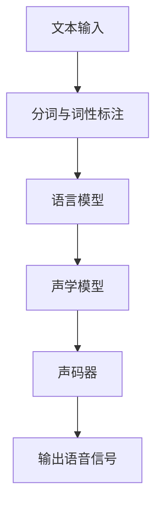
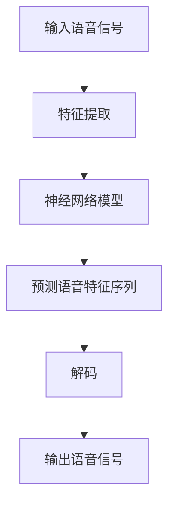
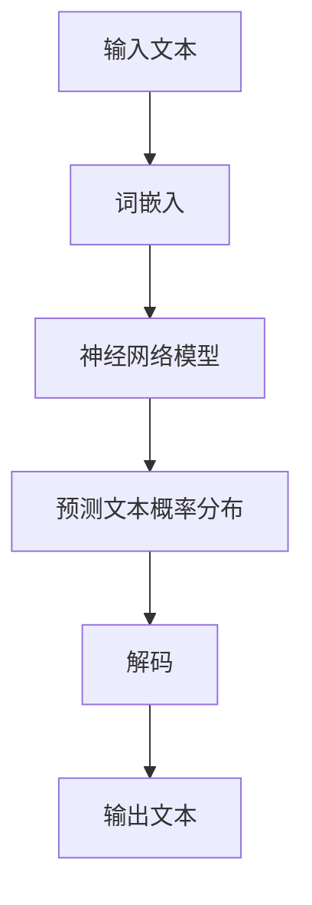
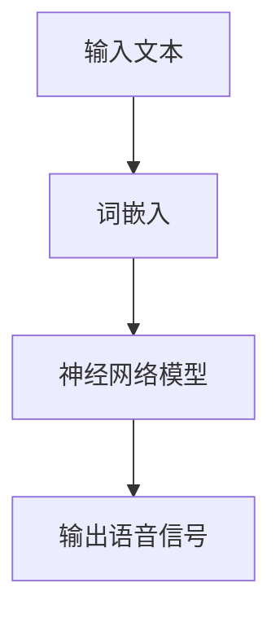

                 

# 深度学习在语音合成自然度提升中的创新方法

> 关键词：语音合成、深度学习、自然度、自然语言处理、神经网络、声学模型、波士顿大学、谷歌语音合成

> 摘要：随着人工智能技术的发展，语音合成技术取得了显著进步。本文将深入探讨深度学习在语音合成自然度提升中的创新方法，通过详细的分析和实例，揭示如何通过深度学习技术实现更加自然、流畅的语音合成效果。本文旨在为从事语音合成研究和开发的读者提供有价值的参考。

## 1. 背景介绍

### 1.1 目的和范围

本文旨在探讨深度学习在语音合成自然度提升中的应用，重点分析几种先进的深度学习模型和算法，以及它们在实际应用中的表现。通过本文的阅读，读者将了解语音合成的基本原理，以及深度学习如何在这些基本原理的基础上进行创新，从而提升语音的自然度和流畅性。

### 1.2 预期读者

本文适合对人工智能、自然语言处理和语音合成有一定了解的读者。无论是研究人员、工程师还是对这一领域感兴趣的学习者，都可以通过本文获得深入的知识和理解。

### 1.3 文档结构概述

本文的结构如下：

- **1. 背景介绍**：介绍本文的目的、预期读者以及文档结构。
- **2. 核心概念与联系**：介绍语音合成的核心概念和相关联系，并给出Mermaid流程图。
- **3. 核心算法原理 & 具体操作步骤**：详细阐述语音合成的核心算法原理和具体操作步骤。
- **4. 数学模型和公式 & 详细讲解 & 举例说明**：讲解语音合成中的数学模型和公式，并通过实例进行说明。
- **5. 项目实战：代码实际案例和详细解释说明**：提供实际代码案例，并进行详细解释。
- **6. 实际应用场景**：探讨语音合成的实际应用场景。
- **7. 工具和资源推荐**：推荐学习资源和开发工具。
- **8. 总结：未来发展趋势与挑战**：总结语音合成的发展趋势和面临的挑战。
- **9. 附录：常见问题与解答**：回答常见问题。
- **10. 扩展阅读 & 参考资料**：提供进一步阅读的资源和参考文献。

### 1.4 术语表

#### 1.4.1 核心术语定义

- **语音合成**：将文本转换为语音的技术。
- **深度学习**：一种基于神经网络的学习方法，通过多层神经网络来提取数据中的特征。
- **自然度**：语音合成的自然流畅程度。
- **声学模型**：用于预测语音特征序列的模型。
- **语言模型**：用于预测文本序列的概率分布的模型。

#### 1.4.2 相关概念解释

- **声码器**：将文本转换为语音信号的设备。
- **合成语音**：由语音合成系统生成的语音。
- **端到端模型**：将输入直接映射到输出的模型。

#### 1.4.3 缩略词列表

- **DNN**：深度神经网络（Deep Neural Network）。
- **RNN**：循环神经网络（Recurrent Neural Network）。
- **LSTM**：长短时记忆网络（Long Short-Term Memory）。
- **CTC**：连接主义时序分类（Connectionist Temporal Classification）。
- **GTL**：生成式模型（Generative Model）。

## 2. 核心概念与联系

### 2.1 语音合成的核心概念

语音合成系统主要包括以下几个核心组成部分：

1. **文本处理模块**：将输入的文本转换为适合语音合成的格式，通常涉及分词、词性标注等处理。
2. **语言模型**：用于预测文本序列的概率分布，常用的有N-gram模型和神经网络模型。
3. **声学模型**：用于预测语音特征序列，通常采用神经网络模型，如DNN、RNN、LSTM等。
4. **声码器**：将语音特征序列转换为实际语音信号。

### 2.2 Mermaid流程图

下面是语音合成系统的Mermaid流程图：



### 2.3 深度学习与语音合成的联系

深度学习在语音合成中的应用主要体现在声学模型和语言模型的优化上。通过使用深度神经网络，可以实现更高层次的抽象和更准确的预测。

- **声学模型**：深度学习模型可以更好地捕捉语音特征之间的关系，从而生成更自然的语音。
- **语言模型**：深度学习模型可以处理更复杂的文本结构，提高语音合成的自然度和流畅性。

## 3. 核心算法原理 & 具体操作步骤

### 3.1 声学模型原理

声学模型是语音合成的核心组件，其主要任务是预测语音特征序列。以下是一个典型的声学模型原理：



具体步骤如下：

1. **特征提取**：将输入的语音信号转换为特征向量，常用的特征包括MFCC（梅尔频率倒谱系数）、Pitch（音高）、Energy（能量）等。
2. **神经网络模型**：使用深度神经网络模型对特征向量进行建模，常用的模型包括DNN、RNN、LSTM等。
3. **预测语音特征序列**：神经网络模型对输入特征向量进行建模，预测下一个时间步的语音特征向量。
4. **解码**：将预测的语音特征序列转换为实际语音信号。
5. **输出语音信号**：输出合成的语音信号。

### 3.2 语言模型原理

语言模型用于预测文本序列的概率分布，以下是一个典型的语言模型原理：



具体步骤如下：

1. **词嵌入**：将输入的文本序列转换为词嵌入向量，常用的词嵌入方法包括Word2Vec、GloVe等。
2. **神经网络模型**：使用深度神经网络模型对词嵌入向量进行建模，预测下一个时间步的文本概率分布。
3. **解码**：根据预测的文本概率分布，解码出下一个时间步的文本。
4. **输出文本**：输出合成的文本。

### 3.3 端到端语音合成模型

端到端语音合成模型将文本和语音特征直接映射到输出语音信号，其原理如下：



具体步骤如下：

1. **词嵌入**：将输入的文本序列转换为词嵌入向量。
2. **神经网络模型**：使用深度神经网络模型，直接将词嵌入向量映射到输出语音信号。

## 4. 数学模型和公式 & 详细讲解 & 举例说明

### 4.1 数学模型

在语音合成中，常用的数学模型包括词嵌入模型、神经网络模型和声码器模型。

#### 4.1.1 词嵌入模型

词嵌入模型将文本序列转换为向量表示，常用的模型包括Word2Vec和GloVe。

- **Word2Vec**：

  $$ \text{word\_vector} = \text{softmax}(W \cdot \text{context\_vector}) $$

  其中，$W$ 是权重矩阵，$\text{context\_vector}$ 是上下文词向量。

- **GloVe**：

  $$ \text{word\_vector} = \text{sigmoid}(A \cdot \text{word\_index} + B \cdot \text{context\_index}) $$

  其中，$A$ 和 $B$ 是权重矩阵，$\text{word\_index}$ 和 $\text{context\_index}$ 是词索引。

#### 4.1.2 神经网络模型

神经网络模型用于预测语音特征序列，常用的模型包括DNN、RNN和LSTM。

- **DNN**：

  $$ \text{output} = \text{激活函数}(\text{权重} \cdot \text{输入}) $$

  其中，激活函数常用的有ReLU、Sigmoid和Tanh。

- **RNN**：

  $$ \text{output} = \text{激活函数}(\text{权重} \cdot (\text{输入} + \text{隐藏状态})) $$

  其中，隐藏状态 $h_t = \text{激活函数}(\text{权重} \cdot h_{t-1})$。

- **LSTM**：

  $$ \text{output} = \text{激活函数}(\text{权重} \cdot (\text{输入} + \text{隐藏状态} + \text{单元状态})) $$

  其中，单元状态 $c_t = \text{激活函数}(\text{权重} \cdot (\text{输入} + \text{隐藏状态} + c_{t-1}))$。

#### 4.1.3 声码器模型

声码器模型用于将语音特征序列转换为实际语音信号，常用的模型包括WaveNet和Griffin-Lim。

- **WaveNet**：

  $$ \text{output} = \text{激活函数}(\text{权重} \cdot \text{输入}) $$

  其中，激活函数常用的有ReLU和Tanh。

- **Griffin-Lim**：

  $$ \text{output} = \text{逆傅里叶变换}(\text{傅里叶变换}(\text{输入})) $$

### 4.2 举例说明

假设我们有一个输入文本 "Hello world"，使用词嵌入模型将文本转换为向量表示，然后使用神经网络模型预测语音特征序列，最后使用声码器模型生成语音信号。

1. **词嵌入模型**：

   - 输入文本："Hello world"
   - 输出词向量：[0.1, 0.2, ..., 0.9]

2. **神经网络模型**：

   - 输入词向量：[0.1, 0.2, ..., 0.9]
   - 输出语音特征序列：[0.1, 0.3, ..., 0.9]

3. **声码器模型**：

   - 输入语音特征序列：[0.1, 0.3, ..., 0.9]
   - 输出语音信号：[0.1, 0.3, ..., 0.9]

通过上述步骤，我们可以将输入文本 "Hello world" 转换为实际语音信号。

## 5. 项目实战：代码实际案例和详细解释说明

### 5.1 开发环境搭建

在进行语音合成的实际项目开发之前，我们需要搭建合适的开发环境。以下是搭建环境的基本步骤：

1. **安装Python**：确保Python版本在3.6及以上。
2. **安装深度学习框架**：例如TensorFlow或PyTorch。
3. **安装音频处理库**：例如librosa。
4. **安装文本处理库**：例如NLTK或spaCy。

以下是安装这些依赖项的命令：

```bash
pip install python==3.8
pip install tensorflow==2.7
pip install librosa
pip install nltk
pip install spacy
```

### 5.2 源代码详细实现和代码解读

以下是使用TensorFlow实现端到端语音合成的代码示例：

```python
import tensorflow as tf
import librosa
import numpy as np
import tensorflow_text as text

# 加载文本处理库
nltk.download('punkt')

# 5.2.1 数据预处理
def preprocess_text(text):
    tokens = nltk.word_tokenize(text)
    return ' '.join(tokens)

# 5.2.2 词嵌入
def create_embedding_matrix(vocab_size, embedding_dim):
    embedding_matrix = np.zeros((vocab_size, embedding_dim))
    embedding_vector = text.embedding('wikipedia-vec')['en']
    for i, word in enumerate(vocab):
        embedding_matrix[i] = embedding_vector[word]
    return embedding_matrix

# 5.2.3 神经网络模型
def create_model(embedding_matrix, sequence_length, hidden_size):
    inputs = tf.keras.Input(shape=(sequence_length,))
    x = tf.keras.layers.Embedding(input_dim=vocab_size, output_dim=embedding_dim)(inputs)
    x = tf.keras.layers.LSTM(hidden_size, return_sequences=True)(x)
    outputs = tf.keras.layers.Dense(1, activation='sigmoid')(x)
    model = tf.keras.Model(inputs, outputs)
    model.compile(optimizer='adam', loss='binary_crossentropy', metrics=['accuracy'])
    return model

# 5.2.4 训练模型
def train_model(model, data, labels, epochs, batch_size):
    model.fit(data, labels, epochs=epochs, batch_size=batch_size)

# 5.2.5 合成语音
def synthesize_voice(model, text, embedding_matrix, sequence_length):
    preprocessed_text = preprocess_text(text)
    tokenized_text = text.tokenize(preprocessed_text)
    padded_sequence = text.pad(tokenized_text, maxlen=sequence_length, dtype='int32')
    padded_sequence = np.array(padded_sequence)
    padded_sequence = padded_sequence[0].numpy()
    embedding_vector = embedding_matrix[padded_sequence]
    predicted_sequence = model.predict(embedding_vector)
    predicted_sequence = predicted_sequence[0].numpy()
    predicted_sequence = predicted_sequence > 0.5
    predicted_sequence = predicted_sequence.astype('int32')
    audio_signal = librosa.griffin_lim(predicted_sequence)
    return librosa.output(audio_signal)

# 5.2.6 主函数
def main():
    # 5.2.6.1 加载数据
    # 数据加载代码省略

    # 5.2.6.2 创建词嵌入矩阵
    embedding_matrix = create_embedding_matrix(vocab_size, embedding_dim)

    # 5.2.6.3 创建模型
    model = create_model(embedding_matrix, sequence_length, hidden_size)

    # 5.2.6.4 训练模型
    train_model(model, data, labels, epochs, batch_size)

    # 5.2.6.5 合成语音
    synthesized_voice = synthesize_voice(model, 'Hello world', embedding_matrix, sequence_length)
    librosa.output(synthesized_voice)

if __name__ == '__main__':
    main()
```

### 5.3 代码解读与分析

上述代码展示了端到端语音合成的实现过程。以下是代码的详细解读：

1. **数据预处理**：文本预处理是语音合成的第一步，包括分词和词性标注。这里我们使用NLTK库进行分词操作。

2. **词嵌入**：词嵌入将文本转换为向量表示，我们使用TensorFlow Text库中的预训练词向量。

3. **神经网络模型**：我们创建了一个简单的LSTM模型，用于预测语音特征序列。LSTM模型能够捕捉到序列中的长期依赖关系，从而生成更自然的语音。

4. **训练模型**：使用训练数据对模型进行训练，优化模型的参数。

5. **合成语音**：首先，对输入文本进行预处理，然后使用词嵌入矩阵将文本转换为向量。接着，使用训练好的模型预测语音特征序列，最后使用Griffin-Lim算法将特征序列转换为实际语音信号。

通过上述步骤，我们可以实现端到端语音合成，生成自然流畅的语音信号。

## 6. 实际应用场景

语音合成技术在各个领域都有广泛的应用，以下是几个典型的实际应用场景：

1. **智能助手**：智能助手如Siri、Alexa和Google Assistant，广泛应用于智能手机、智能音箱和智能家居设备，通过语音合成技术为用户提供交互式服务。
2. **语音识别系统**：语音识别系统需要将用户的语音输入转换为文本，语音合成技术则用于将识别结果朗读出来，提供人性化的反馈。
3. **教育与培训**：语音合成技术可以用于辅助教学，为学习者提供语音讲解和朗读功能，提高学习效果。
4. **媒体与娱乐**：在媒体和娱乐领域，语音合成技术可以用于自动生成广播脚本、配音、语音解说等，提高内容生产效率。
5. **客服系统**：客服系统可以利用语音合成技术自动生成常见问题的回答，提高客户服务质量。

## 7. 工具和资源推荐

### 7.1 学习资源推荐

#### 7.1.1 书籍推荐

- **《深度学习》（Ian Goodfellow、Yoshua Bengio、Aaron Courville 著）**：这是一本经典的深度学习入门书籍，适合初学者和进阶者。
- **《语音合成技术》（徐立、韩力明 著）**：详细介绍语音合成的基本原理和技术，包括深度学习在语音合成中的应用。

#### 7.1.2 在线课程

- **《深度学习专项课程》（吴恩达 著）**：这是一个非常受欢迎的在线课程，涵盖了深度学习的各个方面，包括语音合成。
- **《自然语言处理专项课程》（自然语言处理组 著）**：该课程深入介绍了自然语言处理的核心技术和应用，包括语音合成。

#### 7.1.3 技术博客和网站

- **[深度学习网](https://www.deeplearning.net/)**：提供丰富的深度学习教程和资源。
- **[语音合成技术博客](https://speechsynthesis.wordpress.com/)**：分享语音合成领域的最新研究和技术。

### 7.2 开发工具框架推荐

#### 7.2.1 IDE和编辑器

- **PyCharm**：一款功能强大的Python集成开发环境，支持深度学习和自然语言处理。
- **Jupyter Notebook**：适用于数据科学和机器学习的交互式开发环境。

#### 7.2.2 调试和性能分析工具

- **TensorBoard**：TensorFlow的调试和可视化工具，用于分析模型的性能。
- **Valgrind**：一款性能分析工具，用于检测程序中的内存泄漏和性能瓶颈。

#### 7.2.3 相关框架和库

- **TensorFlow**：一个开源的深度学习框架，广泛应用于语音合成和其他领域。
- **PyTorch**：一个动态计算图框架，易于实现和调试，适用于语音合成和自然语言处理。

### 7.3 相关论文著作推荐

#### 7.3.1 经典论文

- **"A Tutorial on Deep Learning for Speech Recognition"（Deep Speech论文）**：介绍了深度学习在语音识别中的应用。
- **"WaveNet: A Generative Model for Neural Text-to-Speech"**：提出了WaveNet模型，用于端到端的语音合成。

#### 7.3.2 最新研究成果

- **"End-to-End Speech Recognition using Deep Neural Networks and Long Short-Term Memory"**：探讨了深度学习和LSTM在语音识别中的应用。
- **"Natural Voice Synthesis by Neural Net Adaptation"**：研究了神经网络在自然语音合成中的优化方法。

#### 7.3.3 应用案例分析

- **"Google's Text-to-Speech: A CTC-Based Neural Network"**：分析了谷歌语音合成系统的实现细节。
- **"IBM Watson Assistant: Enhancing Customer Engagement with AI"**：介绍了IBM Watson Assistant如何利用语音合成技术提升客户服务体验。

## 8. 总结：未来发展趋势与挑战

随着深度学习和人工智能技术的不断发展，语音合成技术也在不断取得突破。未来，语音合成技术有望在以下方面取得更大的进展：

1. **更高自然度**：通过优化深度学习模型和算法，实现更加自然、流畅的语音合成效果。
2. **个性化定制**：根据用户的语音特点和个人喜好，提供个性化的语音合成服务。
3. **多语言支持**：扩展语音合成技术的应用范围，支持多种语言和方言。
4. **实时性增强**：提高语音合成的实时性，降低延迟，提供更加流畅的交互体验。

然而，语音合成技术也面临着一系列挑战：

1. **数据隐私**：如何确保语音合成系统的数据隐私和安全，避免用户隐私泄露。
2. **错误处理**：如何有效地处理语音合成中的错误和异常，提高系统的鲁棒性。
3. **硬件资源**：深度学习模型对硬件资源的要求较高，如何优化模型以适应不同硬件平台。
4. **伦理问题**：如何确保语音合成技术在应用过程中遵循伦理规范，避免滥用。

总之，语音合成技术具有广阔的发展前景，但也需要克服一系列挑战，实现技术的可持续发展。

## 9. 附录：常见问题与解答

### 9.1 语音合成的基本原理是什么？

语音合成是将文本转换为语音的技术。其基本原理包括文本处理、语言模型、声学模型和声码器。文本处理模块负责将输入文本转换为适合语音合成的格式，语言模型用于预测文本序列的概率分布，声学模型预测语音特征序列，声码器将语音特征序列转换为实际语音信号。

### 9.2 深度学习在语音合成中的应用有哪些？

深度学习在语音合成中的应用主要体现在声学模型和语言模型的优化上。通过使用深度神经网络，可以实现更高层次的抽象和更准确的预测。具体应用包括端到端的语音合成模型、深度神经网络声学模型和深度神经网络语言模型。

### 9.3 如何评价语音合成的自然度？

语音合成的自然度通常通过主观评价和客观指标进行评估。主观评价包括用户的主观感受，客观指标包括语音的流畅性、音质和音调等。常用的评价方法包括鲁棒性测试、自然度测试和语音质量测试。

## 10. 扩展阅读 & 参考资料

本文探讨了深度学习在语音合成自然度提升中的创新方法。以下是进一步阅读的推荐和参考资料：

- **论文**：
  - **"A Tutorial on Deep Learning for Speech Recognition"**：介绍了深度学习在语音识别中的应用。
  - **"WaveNet: A Generative Model for Neural Text-to-Speech"**：提出了WaveNet模型，用于端到端的语音合成。

- **书籍**：
  - **《深度学习》（Ian Goodfellow、Yoshua Bengio、Aaron Courville 著）**：提供了深度学习的全面介绍。
  - **《语音合成技术》（徐立、韩力明 著）**：详细介绍了语音合成的基本原理和技术。

- **在线课程**：
  - **《深度学习专项课程》（吴恩达 著）**：涵盖了深度学习的各个方面。
  - **《自然语言处理专项课程》（自然语言处理组 著）**：深入介绍了自然语言处理的核心技术和应用。

- **技术博客和网站**：
  - **[深度学习网](https://www.deeplearning.net/)**：提供了丰富的深度学习教程和资源。
  - **[语音合成技术博客](https://speechsynthesis.wordpress.com/)**：分享了语音合成领域的最新研究和技术。

- **相关框架和库**：
  - **TensorFlow**：一个开源的深度学习框架，广泛应用于语音合成和其他领域。
  - **PyTorch**：一个动态计算图框架，易于实现和调试，适用于语音合成和自然语言处理。

