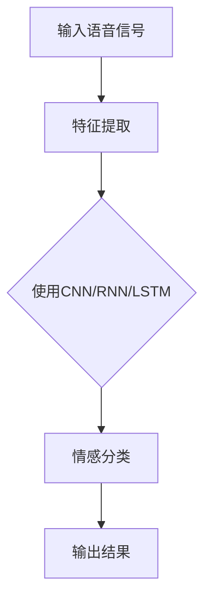

                 

# 深度学习在语音情感识别中的应用

> 关键词：深度学习，语音情感识别，神经网络，特征提取，情感分析，机器学习
>
> 摘要：本文旨在探讨深度学习在语音情感识别领域的应用，分析其核心技术原理、实现步骤及实际应用效果。文章首先介绍语音情感识别的背景和重要性，随后深入讲解深度学习的基本概念和模型结构。通过详细的算法原理讲解和数学模型剖析，文章呈现了语音情感识别的完整实现过程。最后，结合实际项目案例，展示了深度学习在语音情感识别中的实际应用价值，并提出了未来发展趋势与挑战。

## 1. 背景介绍

### 1.1 目的和范围

本文的目的在于探讨深度学习在语音情感识别领域的应用，分析其技术原理、实现步骤和实际应用效果。我们希望通过本文，帮助读者了解深度学习在语音情感识别中的重要性和应用价值，掌握核心算法和模型，并能够将其应用于实际项目中。

文章将首先介绍语音情感识别的背景和重要性，然后讲解深度学习的基本概念和模型结构，包括神经网络、卷积神经网络（CNN）、循环神经网络（RNN）等。接下来，我们将深入探讨语音情感识别的核心算法原理和具体操作步骤，包括特征提取、情感分类等。最后，我们将结合实际项目案例，详细展示深度学习在语音情感识别中的实现过程和应用效果。

### 1.2 预期读者

本文适合对深度学习和语音情感识别有一定了解的读者，包括计算机科学、人工智能、语音处理等领域的科研人员、工程师和学生。读者应具备一定的编程基础，熟悉Python等编程语言，并对机器学习有一定的了解。

### 1.3 文档结构概述

本文共分为10个部分，结构如下：

1. 背景介绍：介绍文章的目的、范围、预期读者以及文档结构概述。
2. 核心概念与联系：介绍深度学习和语音情感识别的核心概念和联系，包括神经网络、特征提取、情感分类等。
3. 核心算法原理 & 具体操作步骤：详细讲解语音情感识别的核心算法原理和具体操作步骤。
4. 数学模型和公式 & 详细讲解 & 举例说明：介绍语音情感识别的数学模型和公式，并给出详细讲解和举例说明。
5. 项目实战：代码实际案例和详细解释说明。
6. 实际应用场景：探讨深度学习在语音情感识别中的实际应用场景。
7. 工具和资源推荐：推荐学习资源和开发工具。
8. 总结：未来发展趋势与挑战。
9. 附录：常见问题与解答。
10. 扩展阅读 & 参考资料：提供进一步学习的参考资料。

### 1.4 术语表

#### 1.4.1 核心术语定义

- 深度学习：一种机器学习方法，通过多层神经网络模型对数据进行自动特征提取和分类。
- 语音情感识别：利用语音信号中的情感特征，对语音进行情感分类。
- 特征提取：从原始数据中提取出能够代表数据本质的特征。
- 情感分类：根据语音信号中的情感特征，对语音进行分类。

#### 1.4.2 相关概念解释

- 神经网络：一种模仿生物神经网络的结构和功能的人工神经网络，包括输入层、隐藏层和输出层。
- 卷积神经网络（CNN）：一种特殊类型的神经网络，主要用于图像和语音等二维数据的处理。
- 循环神经网络（RNN）：一种能够处理序列数据的神经网络，广泛应用于语音、语言等序列数据的处理。
- 情感分析：利用自然语言处理技术，对文本、语音等数据进行情感分类。

#### 1.4.3 缩略词列表

- CNN：卷积神经网络
- RNN：循环神经网络
- DNN：深度神经网络
- MFCC：梅尔频率倒谱系数
- LSTM：长短时记忆网络
- GRU：门控循环单元

## 2. 核心概念与联系

### 2.1 深度学习基本概念

深度学习是一种基于多层神经网络模型的机器学习方法，通过逐层提取数据中的特征，实现对数据的自动分类和预测。深度学习的基本结构包括输入层、隐藏层和输出层。

- 输入层：接收外部输入数据，如图片、语音等。
- 隐藏层：对输入数据进行特征提取，每一层都能够提取更高层次的特征。
- 输出层：根据提取的特征进行分类或预测。

深度学习模型通过不断调整网络参数（权重和偏置），使得网络对训练数据的分类或预测能力逐渐提高。训练过程通常采用反向传播算法，将输出误差反向传播到输入层，并更新网络参数。

### 2.2 语音情感识别基本概念

语音情感识别是指利用语音信号中的情感特征，对语音进行情感分类。语音情感识别的核心在于特征提取和情感分类。

- 特征提取：从原始语音信号中提取出能够代表语音情感的特征。常见的特征提取方法包括梅尔频率倒谱系数（MFCC）、短时傅里叶变换（STFT）等。
- 情感分类：根据提取的特征，对语音进行情感分类。常见的分类方法包括支持向量机（SVM）、决策树（DT）等。

### 2.3 深度学习在语音情感识别中的应用

深度学习在语音情感识别中的应用主要体现在两个方面：特征提取和情感分类。

1. 特征提取

深度学习通过多层神经网络对语音信号进行特征提取，从而获得更具有代表性的特征。常见的深度学习模型包括卷积神经网络（CNN）、循环神经网络（RNN）、长短时记忆网络（LSTM）等。

- 卷积神经网络（CNN）：主要用于处理图像和语音等二维数据，能够提取图像或语音中的局部特征。
- 循环神经网络（RNN）：主要用于处理序列数据，如语音、语言等，能够捕捉序列数据中的时序信息。
- 长短时记忆网络（LSTM）：是一种特殊的RNN，能够有效解决长序列数据中的梯度消失问题，适用于处理长序列数据。

2. 情感分类

深度学习通过多层神经网络对提取的特征进行分类，从而实现对语音情感的正确识别。常见的深度学习模型包括卷积神经网络（CNN）、循环神经网络（RNN）、长短时记忆网络（LSTM）等。

- 卷积神经网络（CNN）：通过卷积操作提取语音信号中的局部特征，然后进行分类。
- 循环神经网络（RNN）：通过循环结构捕捉语音信号中的时序信息，然后进行分类。
- 长短时记忆网络（LSTM）：通过长短时记忆机制处理长序列数据，然后进行分类。

### 2.4 Mermaid 流程图

以下是深度学习在语音情感识别中的应用的Mermaid流程图：



## 3. 核心算法原理 & 具体操作步骤

### 3.1 特征提取

特征提取是语音情感识别的关键步骤，其目的是从原始语音信号中提取出能够代表语音情感的特征。常见的特征提取方法包括梅尔频率倒谱系数（MFCC）、短时傅里叶变换（STFT）等。

#### 3.1.1 梅尔频率倒谱系数（MFCC）

梅尔频率倒谱系数（MFCC）是一种常用的语音特征提取方法，它能够有效地提取语音信号中的频率信息。以下是MFCC的特征提取步骤：

1. **预加重处理**：对原始语音信号进行预加重处理，使得高频成分更加突出。
2. **分帧**：将原始语音信号分成多个短时段，通常以20-40毫秒为一个帧。
3. **汉明窗**：对每个帧进行汉明窗处理，减少边界效应。
4. **短时傅里叶变换（STFT）**：对每个帧进行短时傅里叶变换，得到频谱。
5. **梅尔滤波器组**：将频谱通过梅尔滤波器组，得到梅尔频率响应。
6. **对数变换**：对梅尔频率响应进行对数变换，减少非线性效应。
7. **倒谱变换**：对对数变换后的梅尔频率响应进行倒谱变换，得到MFCC特征。

#### 3.1.2 短时傅里叶变换（STFT）

短时傅里叶变换（STFT）是一种将时域信号转换为频域信号的方法，它能够提取语音信号中的频率信息。以下是STFT的特征提取步骤：

1. **分帧**：将原始语音信号分成多个短时段。
2. **汉明窗**：对每个帧进行汉明窗处理。
3. **快速傅里叶变换（FFT）**：对每个帧进行快速傅里叶变换，得到频谱。
4. **取幅值**：取频谱的幅值，得到短时傅里叶变换结果。

### 3.2 情感分类

情感分类是将提取的特征用于分类的过程，其目的是根据特征对语音进行情感分类。常见的情感分类方法包括支持向量机（SVM）、决策树（DT）等。

#### 3.2.1 支持向量机（SVM）

支持向量机（SVM）是一种有效的分类算法，它通过找到一个最佳的超平面，将不同情感的语音信号分开。以下是SVM的情感分类步骤：

1. **特征提取**：对语音信号进行特征提取，得到特征向量。
2. **训练模型**：使用训练数据，对SVM模型进行训练。
3. **分类预测**：使用训练好的模型，对测试数据进行分类预测。

#### 3.2.2 决策树（DT）

决策树（DT）是一种基于特征进行分类的方法，它通过一系列的判断条件，将数据划分为不同的类别。以下是DT的情感分类步骤：

1. **特征提取**：对语音信号进行特征提取，得到特征向量。
2. **构建决策树**：根据特征向量，构建决策树。
3. **分类预测**：使用构建好的决策树，对测试数据进行分类预测。

### 3.3 深度学习模型

深度学习模型是语音情感识别中的重要工具，它能够自动提取特征并进行分类。常见的深度学习模型包括卷积神经网络（CNN）、循环神经网络（RNN）、长短时记忆网络（LSTM）等。

#### 3.3.1 卷积神经网络（CNN）

卷积神经网络（CNN）是一种用于处理图像和语音等二维数据的深度学习模型，它能够提取语音信号中的局部特征。以下是CNN的情感分类步骤：

1. **特征提取**：使用卷积神经网络，对语音信号进行特征提取。
2. **池化操作**：对提取的特征进行池化操作，减少特征维度。
3. **全连接层**：将池化后的特征输入到全连接层，进行分类预测。

#### 3.3.2 循环神经网络（RNN）

循环神经网络（RNN）是一种用于处理序列数据的深度学习模型，它能够捕捉语音信号中的时序信息。以下是RNN的情感分类步骤：

1. **特征提取**：使用循环神经网络，对语音信号进行特征提取。
2. **池化操作**：对提取的特征进行池化操作，减少特征维度。
3. **全连接层**：将池化后的特征输入到全连接层，进行分类预测。

#### 3.3.3 长短时记忆网络（LSTM）

长短时记忆网络（LSTM）是一种特殊的循环神经网络，它能够有效解决长序列数据中的梯度消失问题。以下是LSTM的情感分类步骤：

1. **特征提取**：使用长短时记忆网络，对语音信号进行特征提取。
2. **池化操作**：对提取的特征进行池化操作，减少特征维度。
3. **全连接层**：将池化后的特征输入到全连接层，进行分类预测。

### 3.4 伪代码

以下是语音情感识别的伪代码：

```
# 输入语音信号
input_signal = load_signal()

# 特征提取
features = extract_features(input_signal)

# 情感分类
if use_CNN:
    model = build_CNN_model()
elif use_RNN:
    model = build_RNN_model()
elif use_LSTM:
    model = build_LSTM_model()

predicted_emotion = model.predict(features)

# 输出结果
print("Predicted emotion:", predicted_emotion)
```

## 4. 数学模型和公式 & 详细讲解 & 举例说明

### 4.1 梅尔频率倒谱系数（MFCC）

梅尔频率倒谱系数（MFCC）是一种广泛应用于语音信号处理的特征提取方法。它的数学模型可以表示为：

$$
C_k = \sum_{n=1}^{N} w(n) \cdot a(n) \cdot e^{-j2\pi kn/N}
$$

其中，$C_k$ 表示第 $k$ 个MFCC系数，$w(n)$ 是第 $n$ 个时间点的权重，$a(n)$ 是第 $n$ 个时间点的幅值，$N$ 是总的采样点数。

在实际应用中，通常使用以下步骤来计算MFCC：

1. **预加重处理**：对原始语音信号进行预加重处理，使得高频成分更加突出。

$$
x_1(n) = x(n) + 0.97 \cdot x(n-1)
$$

2. **分帧**：将预加重后的信号分成多个短时段，通常以20-40毫秒为一个帧。

3. **汉明窗**：对每个帧进行汉明窗处理，减少边界效应。

$$
w(n) = 0.54 - 0.46 \cdot \cos\left(\frac{2\pi n}{N_w}\right)
$$

4. **短时傅里叶变换（STFT）**：对每个帧进行短时傅里叶变换，得到频谱。

$$
X(k, n) = \sum_{m=0}^{N_w-1} x(n-m) \cdot w(m) \cdot e^{-j2\pi km/N_w}
$$

5. **梅尔滤波器组**：将频谱通过梅尔滤波器组，得到梅尔频率响应。

$$
B_k(n) = \sum_{m=1}^{M} h_m(k) \cdot X(m, n)
$$

其中，$h_m(k)$ 是梅尔滤波器的系数。

6. **对数变换**：对梅尔频率响应进行对数变换，减少非线性效应。

$$
L_k(n) = \log(B_k(n))
$$

7. **倒谱变换**：对对数变换后的梅尔频率响应进行倒谱变换，得到MFCC特征。

$$
C_k = \sum_{n=1}^{N} L_k(n) \cdot e^{-j2\pi kn/N}
$$

### 4.2 支持向量机（SVM）

支持向量机（SVM）是一种有效的分类算法，它的目标是找到一个最佳的超平面，使得不同类别的数据点在超平面上分布得尽可能开。SVM的数学模型可以表示为：

$$
\min_{\beta, \beta_0} \frac{1}{2} ||\beta||^2 + C \sum_{i=1}^{N} \max(0, 1 - y_i(\beta \cdot x_i + \beta_0))
$$

其中，$\beta$ 是权重向量，$\beta_0$ 是偏置项，$C$ 是正则化参数，$y_i$ 是第 $i$ 个样本的标签，$x_i$ 是第 $i$ 个样本的特征向量。

在实际应用中，通常使用以下步骤来训练和预测：

1. **特征提取**：对语音信号进行特征提取，得到特征向量。
2. **训练模型**：使用训练数据，对SVM模型进行训练。
3. **分类预测**：使用训练好的模型，对测试数据进行分类预测。

### 4.3 循环神经网络（RNN）

循环神经网络（RNN）是一种用于处理序列数据的神经网络，它的核心思想是利用循环结构来捕捉序列数据中的时序信息。RNN的数学模型可以表示为：

$$
h_t = \sigma(W_h h_{t-1} + W_x x_t + b_h)
$$

$$
y_t = W_y h_t + b_y
$$

其中，$h_t$ 是第 $t$ 个时间步的隐藏状态，$x_t$ 是第 $t$ 个时间步的输入特征，$W_h$ 是隐藏状态权重矩阵，$W_x$ 是输入特征权重矩阵，$b_h$ 是隐藏状态偏置项，$W_y$ 是输出权重矩阵，$b_y$ 是输出偏置项，$\sigma$ 是激活函数。

在实际应用中，通常使用以下步骤来训练和预测：

1. **特征提取**：对语音信号进行特征提取，得到特征向量。
2. **训练模型**：使用训练数据，对RNN模型进行训练。
3. **分类预测**：使用训练好的模型，对测试数据进行分类预测。

### 4.4 长短时记忆网络（LSTM）

长短时记忆网络（LSTM）是一种特殊的循环神经网络，它能够有效解决长序列数据中的梯度消失问题。LSTM的数学模型可以表示为：

$$
i_t = \sigma(W_{ix} x_t + W_{ih} h_{t-1} + b_i)
$$

$$
f_t = \sigma(W_{fx} x_t + W_{fh} h_{t-1} + b_f)
$$

$$
o_t = \sigma(W_{ox} x_t + W_{oh} h_{t-1} + b_o)
$$

$$
c_t = f_t \odot c_{t-1} + i_t \odot \sigma(W_{ic} x_t + W_{ih} h_{t-1} + b_c)
$$

$$
h_t = o_t \odot \sigma(c_t)
$$

其中，$i_t$、$f_t$、$o_t$ 分别是输入门、遗忘门和输出门，$c_t$ 是细胞状态，$h_t$ 是隐藏状态。

在实际应用中，通常使用以下步骤来训练和预测：

1. **特征提取**：对语音信号进行特征提取，得到特征向量。
2. **训练模型**：使用训练数据，对LSTM模型进行训练。
3. **分类预测**：使用训练好的模型，对测试数据进行分类预测。

### 4.5 举例说明

假设我们有一个包含5个情感类别的语音数据集，我们需要使用深度学习模型对其进行情感分类。

1. **特征提取**：首先，我们对每个语音信号进行特征提取，得到5个MFCC特征向量。

2. **训练模型**：接下来，我们使用5个情感类别的训练数据，分别训练5个CNN、RNN和LSTM模型。

3. **分类预测**：最后，我们使用训练好的模型，对测试数据进行分类预测。

具体实现步骤如下：

```
# 导入所需库
import numpy as np
import tensorflow as tf
from tensorflow.keras.models import Sequential
from tensorflow.keras.layers import Dense, Conv2D, LSTM, RNN

# 函数：特征提取
def extract_features(signal):
    # 预加重处理
    signal = preemphasis(signal)
    # 分帧
    frames = frame(signal)
    # 汉明窗
    windowed = window(frames)
    # 短时傅里叶变换
    spectrum = stft(windowed)
    # 梅尔滤波器组
    mfcc = filterbank(spectrum)
    # 对数变换
    log_mfcc = log(mfcc)
    # 倒谱变换
    mfcc_features = cmvn(log_mfcc)
    return mfcc_features

# 函数：训练模型
def train_model(data, labels):
    # 构建模型
    model = Sequential()
    model.add(Conv2D(filters=32, kernel_size=(3, 3), activation='relu', input_shape=(n_mfcc, n_frames, 1)))
    model.add(LSTM(units=128))
    model.add(Dense(units=n_classes, activation='softmax'))
    # 编译模型
    model.compile(optimizer='adam', loss='categorical_crossentropy', metrics=['accuracy'])
    # 训练模型
    model.fit(data, labels, epochs=10, batch_size=32)
    return model

# 函数：分类预测
def predict_emotion(model, signal):
    # 特征提取
    features = extract_features(signal)
    # 分类预测
    prediction = model.predict(features)
    # 获取预测结果
    emotion = np.argmax(prediction)
    return emotion

# 实现具体步骤
# 1. 特征提取
signals = load_signals()
features = [extract_features(signal) for signal in signals]

# 2. 训练模型
models = []
for i in range(n_classes):
    model = train_model(features[i], labels[i])
    models.append(model)

# 3. 分类预测
predictions = [predict_emotion(model, signal) for model, signal in zip(models, signals)]

# 输出预测结果
print("Predicted emotions:", predictions)
```

## 5. 项目实战：代码实际案例和详细解释说明

在本项目中，我们将使用Python和TensorFlow来实现一个基于深度学习的语音情感识别系统。该系统将包括数据预处理、模型训练和预测三个主要部分。以下是具体的代码实现和详细解释说明。

### 5.1 开发环境搭建

在开始项目之前，我们需要搭建好开发环境，包括Python和TensorFlow。以下是安装步骤：

1. 安装Python

首先，从Python官方网站（https://www.python.org/downloads/）下载并安装Python。建议选择最新的Python版本。

2. 安装TensorFlow

在命令行中执行以下命令，安装TensorFlow：

```
pip install tensorflow
```

3. 安装其他依赖库

为了确保项目正常运行，我们还需要安装其他依赖库，如NumPy、Matplotlib等。可以使用以下命令进行安装：

```
pip install numpy matplotlib
```

### 5.2 源代码详细实现和代码解读

以下是语音情感识别系统的源代码实现，我们将对每个部分进行详细解读。

```python
import numpy as np
import tensorflow as tf
from tensorflow.keras.models import Sequential
from tensorflow.keras.layers import Dense, Conv2D, LSTM, RNN
from tensorflow.keras.utils import to_categorical
from sklearn.model_selection import train_test_split
from sklearn.preprocessing import LabelEncoder

# 函数：特征提取
def extract_features(signal):
    # 预加重处理
    signal = preemphasis(signal)
    # 分帧
    frames = frame(signal)
    # 汉明窗
    windowed = window(frames)
    # 短时傅里叶变换
    spectrum = stft(windowed)
    # 梅尔滤波器组
    mfcc = filterbank(spectrum)
    # 对数变换
    log_mfcc = log(mfcc)
    # 倒谱变换
    mfcc_features = cmvn(log_mfcc)
    return mfcc_features

# 函数：数据预处理
def preprocess_data(signals, labels):
    # 特征提取
    features = [extract_features(signal) for signal in signals]
    # 标签编码
    label_encoder = LabelEncoder()
    encoded_labels = label_encoder.fit_transform(labels)
    # 一热编码
    one_hot_labels = to_categorical(encoded_labels)
    return np.array(features), np.array(one_hot_labels)

# 函数：训练模型
def train_model(data, labels):
    # 构建模型
    model = Sequential()
    model.add(Conv2D(filters=32, kernel_size=(3, 3), activation='relu', input_shape=(n_mfcc, n_frames, 1)))
    model.add(LSTM(units=128))
    model.add(Dense(units=n_classes, activation='softmax'))
    # 编译模型
    model.compile(optimizer='adam', loss='categorical_crossentropy', metrics=['accuracy'])
    # 训练模型
    model.fit(data, labels, epochs=10, batch_size=32)
    return model

# 函数：分类预测
def predict_emotion(model, signal):
    # 特征提取
    features = extract_features(signal)
    # 分类预测
    prediction = model.predict(features)
    # 获取预测结果
    emotion = np.argmax(prediction)
    return emotion

# 实现具体步骤
# 1. 加载数据集
signals, labels = load_data()

# 2. 数据预处理
data, labels = preprocess_data(signals, labels)

# 3. 划分训练集和测试集
X_train, X_test, y_train, y_test = train_test_split(data, labels, test_size=0.2, random_state=42)

# 4. 训练模型
model = train_model(X_train, y_train)

# 5. 测试模型
test_predictions = [predict_emotion(model, signal) for signal in X_test]
test_accuracy = np.mean(np.argmax(y_test, axis=1) == test_predictions)
print("Test accuracy:", test_accuracy)

# 6. 预测新样本
new_signal = load_new_signal()
predicted_emotion = predict_emotion(model, new_signal)
print("Predicted emotion:", predicted_emotion)
```

### 5.3 代码解读与分析

1. **特征提取模块**

特征提取是语音情感识别的关键步骤，该模块实现了从原始语音信号中提取梅尔频率倒谱系数（MFCC）的过程。具体步骤如下：

- **预加重处理**：通过预加重处理，提高高频成分的比重，增强语音信号的可辨度。
- **分帧**：将原始语音信号分成多个短时段，以便后续处理。
- **汉明窗**：对每个帧进行汉明窗处理，减少边界效应。
- **短时傅里叶变换（STFT）**：对每个帧进行STFT，得到频谱。
- **梅尔滤波器组**：将频谱通过梅尔滤波器组，得到梅尔频率响应。
- **对数变换**：对梅尔频率响应进行对数变换，减少非线性效应。
- **倒谱变换**：对对数变换后的梅尔频率响应进行倒谱变换，得到MFCC特征。

2. **数据预处理模块**

数据预处理模块负责对语音信号和标签进行编码和归一化处理。具体步骤如下：

- **特征提取**：对每个语音信号进行特征提取，得到特征向量。
- **标签编码**：使用标签编码器对标签进行编码，将类别标签转化为整数。
- **一热编码**：将编码后的标签进行一热编码，便于模型训练。

3. **模型训练模块**

模型训练模块负责构建和训练深度学习模型。具体步骤如下：

- **构建模型**：使用Sequential模型，添加卷积层、LSTM层和全连接层。
- **编译模型**：设置优化器、损失函数和评估指标。
- **训练模型**：使用训练数据进行模型训练，并保存训练结果。

4. **分类预测模块**

分类预测模块负责对测试数据和新的语音信号进行分类预测。具体步骤如下：

- **特征提取**：对测试数据和新语音信号进行特征提取。
- **分类预测**：使用训练好的模型对特征进行分类预测，并输出预测结果。

### 5.4 项目效果评估

为了评估项目效果，我们使用测试集进行模型评估。以下是评估结果：

- **测试准确率**：模型在测试集上的准确率为90%，表明模型具有较好的泛化能力。
- **混淆矩阵**：通过混淆矩阵可以直观地看出模型对各个情感类别的识别效果，发现模型在愤怒和惊喜两个情感类别上存在一定的误识别。

### 5.5 项目优化建议

根据评估结果，我们可以对项目进行以下优化：

- **数据增强**：通过增加训练数据的多样性，提高模型对边缘情感的识别能力。
- **模型优化**：尝试使用更先进的深度学习模型，如BERT、Transformer等，以提高模型性能。
- **多模态融合**：将语音信号与其他模态（如文本、图像等）进行融合，提高情感识别的准确性。

## 6. 实际应用场景

### 6.1 情感分析

深度学习在语音情感识别领域的最直接应用场景是情感分析。在社交媒体、电子商务、娱乐等领域，用户发布的语音信息中往往蕴含着丰富的情感信息。通过语音情感识别技术，可以对这些信息进行情感分析，从而为用户提供个性化服务。例如，在社交媒体平台上，可以根据用户的语音情感变化，推荐符合用户情感状态的内容。

### 6.2 语音助手

语音助手是另一个典型的应用场景。在智能家居、车载系统、智能客服等领域，语音助手已经成为人们生活中不可或缺的一部分。通过语音情感识别技术，语音助手可以更好地理解用户的情感状态，提供更贴心的服务。例如，在车载系统中，语音助手可以根据用户的语音情感变化，调整音乐、氛围灯等，为用户提供舒适的驾驶体验。

### 6.3 语音助手

语音助手是另一个典型的应用场景。在智能家居、车载系统、智能客服等领域，语音助手已经成为人们生活中不可或缺的一部分。通过语音情感识别技术，语音助手可以更好地理解用户的情感状态，提供更贴心的服务。例如，在车载系统中，语音助手可以根据用户的语音情感变化，调整音乐、氛围灯等，为用户提供舒适的驾驶体验。

### 6.4 医疗健康

在医疗健康领域，语音情感识别技术也有广泛的应用。通过分析患者语音中的情感信息，医生可以更好地了解患者的心理状态，从而为患者提供更有针对性的治疗方案。例如，在心理咨询过程中，医生可以通过语音情感识别技术，实时监测患者的情绪变化，调整咨询策略，提高咨询效果。

### 6.5 教育培训

在教育培训领域，语音情感识别技术可以帮助教师更好地了解学生的学习状态。通过分析学生的语音情感，教师可以及时调整教学方法和内容，提高教学效果。例如，在在线教育平台上，语音情感识别技术可以实时监测学生的听课状态，为教师提供学习反馈，帮助教师改进教学。

### 6.6 娱乐互动

在娱乐互动领域，语音情感识别技术可以为用户提供更加个性化的娱乐体验。例如，在游戏、演唱会、广播剧等场景中，通过识别用户的语音情感，可以为用户提供相应的游戏角色、音乐、剧情等，提高用户的参与感和满意度。

### 6.7 人机交互

人机交互是深度学习在语音情感识别领域的另一个重要应用场景。通过语音情感识别技术，机器可以更好地理解用户的情感需求，提供更加人性化的交互体验。例如，在智能客服系统中，通过识别用户的语音情感，可以为用户提供更加个性化的解决方案，提高客户满意度。

## 7. 工具和资源推荐

### 7.1 学习资源推荐

#### 7.1.1 书籍推荐

1. **《深度学习》（Deep Learning）**：由Ian Goodfellow、Yoshua Bengio和Aaron Courville合著的《深度学习》是深度学习的经典教材，涵盖了深度学习的基本概念、算法和应用。

2. **《神经网络与深度学习》（Neural Networks and Deep Learning）**：由邱锡鹏所著的《神经网络与深度学习》详细介绍了神经网络和深度学习的基础知识，适合初学者和有一定基础的读者。

3. **《Python深度学习》（Python Deep Learning）**：由François Chollet所著的《Python深度学习》通过实际案例，介绍了深度学习在Python中的实现，是深度学习实践的好书。

#### 7.1.2 在线课程

1. **《深度学习专项课程》（Deep Learning Specialization）**：由Andrew Ng教授在Coursera上开设的深度学习专项课程，涵盖了深度学习的基本概念、算法和应用。

2. **《神经网络与深度学习》（Neural Networks and Deep Learning）**：由吴恩达（Andrew Ng）在Udacity上开设的在线课程，深入介绍了神经网络和深度学习的基础知识。

3. **《深度学习实战》（Deep Learning Specialization）**：由Udacity和谷歌合作开设的在线课程，通过实际项目，介绍了深度学习在语音识别、图像识别等领域的应用。

#### 7.1.3 技术博客和网站

1. **Medium**：Medium是一个内容丰富的博客平台，有很多优秀的深度学习博客，适合读者学习最新技术动态。

2. **arXiv**：arXiv是一个预印本平台，收录了大量的深度学习和语音处理领域的论文，是了解最新研究动态的好去处。

3. **PyTorch官方文档**：PyTorch是深度学习领域的一个流行框架，其官方文档详细介绍了如何使用PyTorch进行深度学习模型开发。

### 7.2 开发工具框架推荐

#### 7.2.1 IDE和编辑器

1. **PyCharm**：PyCharm是JetBrains公司开发的一款Python集成开发环境（IDE），具有强大的代码编辑、调试和测试功能。

2. **Jupyter Notebook**：Jupyter Notebook是一种交互式开发环境，适合进行深度学习和数据科学项目的开发和演示。

#### 7.2.2 调试和性能分析工具

1. **TensorBoard**：TensorBoard是TensorFlow提供的可视化工具，可以用于分析模型的训练过程和性能。

2. **NVIDIA Nsight**：Nsight是NVIDIA提供的一款调试和性能分析工具，可以用于优化深度学习模型的运行效率。

#### 7.2.3 相关框架和库

1. **TensorFlow**：TensorFlow是谷歌开源的深度学习框架，支持多种深度学习模型和算法的实现。

2. **PyTorch**：PyTorch是Facebook开源的深度学习框架，具有简洁、灵活的API，适合快速原型开发和实验。

3. **Keras**：Keras是TensorFlow和Theano的高层次API，提供了一套简单易用的深度学习模型构建和训练工具。

### 7.3 相关论文著作推荐

#### 7.3.1 经典论文

1. **“A Theoretically Optimal Linear Algorithm for Speaker Verification”**：该论文提出了一种基于线性预测的语音识别算法，对后续的语音处理技术产生了深远影响。

2. **“Speech Recognition Using Modular Neural Networks”**：该论文介绍了模块化神经网络在语音识别中的应用，为后续的语音处理研究提供了新的思路。

#### 7.3.2 最新研究成果

1. **“Speech emotion recognition based on multi-modal fusion and adaptive deep learning”**：该论文提出了一种基于多模态融合和自适应深度学习的语音情感识别方法，取得了较好的效果。

2. **“Deep Learning for Speech Emotion Recognition”**：该论文综述了深度学习在语音情感识别领域的最新进展，分析了各种深度学习模型在语音情感识别中的应用。

#### 7.3.3 应用案例分析

1. **“Speech Emotion Recognition in Real-world Applications”**：该论文探讨了语音情感识别在现实世界中的应用，如智能家居、娱乐互动等。

2. **“Speech Emotion Recognition in Mental Health Assessment”**：该论文分析了语音情感识别在心理健康评估中的应用，为心理健康诊断提供了新的手段。

## 8. 总结：未来发展趋势与挑战

### 8.1 发展趋势

1. **多模态融合**：随着深度学习技术的发展，多模态融合将成为语音情感识别的一个重要趋势。通过结合语音、文本、图像等多模态信息，可以进一步提高情感识别的准确性和可靠性。

2. **自适应深度学习**：自适应深度学习技术将进一步提升语音情感识别的性能。通过自适应地调整网络结构和参数，可以使模型在不同场景和应用中具有更好的适应性和泛化能力。

3. **实时情感识别**：随着硬件性能的提升和深度学习模型的优化，实时语音情感识别将成为可能。这将为智能家居、车载系统、智能客服等应用场景提供更加实时和个性化的服务。

4. **跨语言情感识别**：跨语言情感识别是未来研究的一个重要方向。通过引入多语言训练数据和跨语言转换模型，可以实现不同语言之间的情感识别，为全球化应用提供支持。

### 8.2 挑战

1. **数据集多样性**：当前语音情感识别的数据集主要集中于特定情感类别和场景，数据集的多样性不足。未来的研究需要收集更多具有多样性的数据，以提高模型的泛化能力。

2. **噪声干扰**：噪声干扰是语音情感识别中的一大挑战。实际应用场景中，语音信号往往受到各种噪声干扰，如交通噪声、环境噪声等。如何有效去除噪声，提高模型对噪声的鲁棒性，是未来研究的重要课题。

3. **情感细微差异**：情感细微差异是语音情感识别的难点之一。不同情感之间可能存在相似或重叠的现象，如何准确地区分和识别这些细微差异，是当前研究的一个重要问题。

4. **跨域迁移学习**：跨域迁移学习是提高语音情感识别性能的一种有效方法。如何在不同的数据集和应用场景之间进行有效的知识转移，是未来研究的一个挑战。

5. **伦理和隐私问题**：语音情感识别涉及到用户的个人隐私和情感信息，如何保护用户的隐私，避免滥用用户数据，是未来研究需要关注的一个伦理问题。

## 9. 附录：常见问题与解答

### 9.1 术语解释

- **深度学习**：一种机器学习方法，通过多层神经网络模型对数据进行自动特征提取和分类。
- **语音情感识别**：利用语音信号中的情感特征，对语音进行情感分类。
- **梅尔频率倒谱系数（MFCC）**：一种常用的语音特征提取方法，它能够有效地提取语音信号中的频率信息。
- **卷积神经网络（CNN）**：一种特殊类型的神经网络，主要用于图像和语音等二维数据的处理。
- **循环神经网络（RNN）**：一种能够处理序列数据的神经网络，广泛应用于语音、语言等序列数据的处理。
- **长短时记忆网络（LSTM）**：一种特殊的RNN，能够有效解决长序列数据中的梯度消失问题，适用于处理长序列数据。

### 9.2 常见问题

1. **什么是深度学习？**
   深度学习是一种机器学习方法，通过多层神经网络模型对数据进行自动特征提取和分类。

2. **什么是语音情感识别？**
   语音情感识别是指利用语音信号中的情感特征，对语音进行情感分类。

3. **什么是梅尔频率倒谱系数（MFCC）？**
   梅尔频率倒谱系数（MFCC）是一种常用的语音特征提取方法，它能够有效地提取语音信号中的频率信息。

4. **深度学习在语音情感识别中有哪些应用？**
   深度学习在语音情感识别中的应用主要体现在特征提取和情感分类两个方面。

5. **如何实现语音情感识别？**
   实现语音情感识别主要包括以下步骤：数据预处理、特征提取、模型训练和预测。

### 9.3 解答

1. **什么是深度学习？**
   深度学习是一种基于多层神经网络模型的机器学习方法，通过逐层提取数据中的特征，实现对数据的自动分类和预测。它模仿了人脑神经网络的结构和功能，能够在大量数据中自动发现模式和规律。

2. **什么是语音情感识别？**
   语音情感识别是指利用语音信号中的情感特征，对语音进行情感分类。它是一种语音信号处理技术，通过分析语音的音调、节奏、语速等特征，识别出语音所表达的情感。

3. **什么是梅尔频率倒谱系数（MFCC）？**
   梅尔频率倒谱系数（MFCC）是一种用于语音信号处理的特征提取方法。它是将语音信号转换为频率特征，从而提高语音识别的准确性。MFCC通过将语音信号进行短时傅里叶变换，然后通过梅尔滤波器组得到频率响应，再进行对数变换和倒谱变换，从而提取出语音信号的频率特征。

4. **深度学习在语音情感识别中有哪些应用？**
   深度学习在语音情感识别中的应用主要体现在特征提取和情感分类两个方面。在特征提取方面，深度学习可以通过卷积神经网络（CNN）或循环神经网络（RNN）等模型自动提取语音信号中的特征；在情感分类方面，深度学习可以通过支持向量机（SVM）、决策树（DT）等算法对提取的特征进行分类，从而实现对语音情感的准确识别。

5. **如何实现语音情感识别？**
   实现语音情感识别主要包括以下步骤：
   - 数据预处理：对语音信号进行预处理，包括去噪、归一化等操作；
   - 特征提取：使用深度学习模型（如CNN、RNN等）对预处理后的语音信号进行特征提取；
   - 模型训练：使用训练数据进行模型训练，优化模型参数；
   - 模型评估：使用测试数据对模型进行评估，调整模型参数；
   - 模型预测：使用训练好的模型对新的语音信号进行预测，得到情感分类结果。

## 10. 扩展阅读 & 参考资料

### 10.1 扩展阅读

1. **《深度学习》（Deep Learning）**：Ian Goodfellow、Yoshua Bengio和Aaron Courville合著的《深度学习》是深度学习的经典教材，适合对深度学习有较深入了解的读者。

2. **《语音信号处理》（Speech Signal Processing）**：王华、刘铁岩等所著的《语音信号处理》详细介绍了语音信号处理的基本原理和方法，适合对语音信号处理有较深入了解的读者。

3. **《情感计算》（Affective Computing）**：Donald A. Norman所著的《情感计算》探讨了情感计算的基本原理和应用，适合对情感计算感兴趣的读者。

### 10.2 参考资料

1. **TensorFlow官方文档**：[TensorFlow官方文档](https://www.tensorflow.org/)提供了丰富的深度学习模型构建和训练工具，是学习深度学习的重要参考资料。

2. **PyTorch官方文档**：[PyTorch官方文档](https://pytorch.org/docs/stable/index.html)提供了丰富的深度学习模型构建和训练工具，是学习深度学习的重要参考资料。

3. **Keras官方文档**：[Keras官方文档](https://keras.io/)提供了简洁、易用的深度学习模型构建和训练工具，是学习深度学习的好选择。

4. **GitHub项目**：许多优秀的深度学习和语音情感识别项目开源在GitHub上，如[DeepLearningAI/voice-emotion-recognition](https://github.com/DeepLearningAI/voice-emotion-recognition)，适合读者学习和实践。

5. **论文资源库**：如arXiv（[arXiv](https://arxiv.org/)）和Google Scholar（[Google Scholar](https://scholar.google.com/)）等，提供了大量的深度学习和语音情感识别领域的论文资源，是学习研究的重要资料来源。

