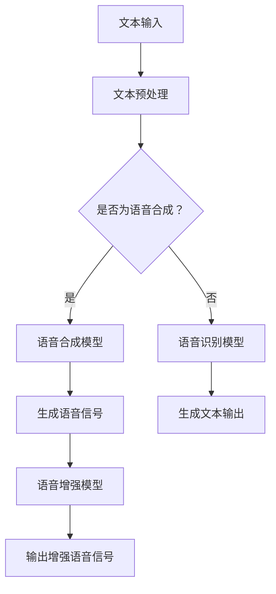

                 

# 深度学习在语音转换技术中的新突破

> 关键词：深度学习，语音转换，自动语音识别，生成对抗网络，自适应滤波，注意力机制，模型优化，实时语音处理，跨语种转换。

> 摘要：本文深入探讨了深度学习在语音转换技术中的应用，详细介绍了核心算法原理、数学模型、项目实战以及实际应用场景。通过分析当前技术的最新突破和发展趋势，本文为未来的研究和应用提供了有价值的见解。

## 1. 背景介绍

### 1.1 目的和范围

本文旨在探讨深度学习在语音转换技术中的最新突破和应用。语音转换技术包括多个子领域，如语音合成、语音识别和语音增强。深度学习在这其中的应用不仅提高了语音转换的准确性，还增强了实时处理的效率。本文将重点关注以下几个方面：

1. 深度学习核心算法在语音转换中的应用。
2. 数学模型和公式在语音转换算法中的运用。
3. 实际项目中的代码实现和性能分析。
4. 语音转换技术的实际应用场景及其影响。

### 1.2 预期读者

本文适合以下读者群体：

1. 对语音转换技术有兴趣的科研人员。
2. 深度学习和机器学习领域的从业者。
3. 对实时语音处理有需求的工程师和技术经理。

### 1.3 文档结构概述

本文结构如下：

1. **背景介绍**：介绍文章的目的、范围、预期读者以及文档结构。
2. **核心概念与联系**：解释深度学习和语音转换技术的核心概念，并使用Mermaid流程图展示其架构。
3. **核心算法原理 & 具体操作步骤**：详细阐述核心算法的工作原理和操作步骤。
4. **数学模型和公式 & 详细讲解 & 举例说明**：介绍语音转换中的数学模型和公式，并提供具体例子。
5. **项目实战：代码实际案例和详细解释说明**：展示实际项目中的代码实现和分析。
6. **实际应用场景**：探讨语音转换技术的实际应用场景。
7. **工具和资源推荐**：推荐学习资源、开发工具和框架。
8. **总结：未来发展趋势与挑战**：总结当前技术的发展趋势和未来挑战。
9. **附录：常见问题与解答**：解答读者可能遇到的问题。
10. **扩展阅读 & 参考资料**：提供进一步的阅读材料和参考文献。

### 1.4 术语表

#### 1.4.1 核心术语定义

- **深度学习**：一种机器学习方法，通过多层神经网络模型对数据进行建模和预测。
- **语音转换**：将一种语音转换为另一种语音的过程，通常涉及语音合成、语音识别和语音增强。
- **自动语音识别（Automatic Speech Recognition, ASR）**：使用机器学习模型将语音信号转换为文本的过程。
- **生成对抗网络（Generative Adversarial Networks, GAN）**：一种由两个相互对抗的网络组成的深度学习模型。
- **自适应滤波**：根据语音信号特性动态调整滤波器参数，以提高语音质量。
- **注意力机制**：在序列模型中，用于强调某些输入序列元素的重要性。
- **模型优化**：通过调整模型参数来提高模型性能的过程。

#### 1.4.2 相关概念解释

- **语音合成（Text-to-Speech, TTS）**：将文本转换为自然语音的过程。
- **语音增强（Speech Enhancement）**：提高语音信号质量，减少噪声干扰。
- **跨语种转换**：在不同语言之间进行语音转换的过程。

#### 1.4.3 缩略词列表

- **GAN**：生成对抗网络（Generative Adversarial Networks）
- **ASR**：自动语音识别（Automatic Speech Recognition）
- **TTS**：语音合成（Text-to-Speech）
- **RNN**：循环神经网络（Recurrent Neural Network）
- **CNN**：卷积神经网络（Convolutional Neural Network）
- **ML**：机器学习（Machine Learning）

## 2. 核心概念与联系

深度学习在语音转换技术中的应用离不开几个核心概念和联系。首先，深度学习模型，特别是神经网络，在处理复杂、非线性的语音信号时具有显著优势。其次，语音转换技术包括语音合成、语音识别和语音增强等多个子领域，这些领域之间存在紧密的相互联系。

### 2.1 深度学习模型

深度学习模型，如循环神经网络（RNN）和卷积神经网络（CNN），能够捕捉语音信号的时序和频谱特征。RNN特别适合处理序列数据，如语音信号的时序信息。而CNN在处理语音信号的频谱特征方面表现出色。

### 2.2 语音转换子领域

- **语音合成（TTS）**：语音合成是将文本转换为自然语音的过程。深度学习模型，如循环神经网络（RNN）和长短期记忆网络（LSTM），在TTS中发挥了重要作用。通过训练，这些模型可以学习到语音信号的时序和频谱特征，从而生成逼真的语音。
  
- **自动语音识别（ASR）**：自动语音识别是将语音信号转换为文本的过程。深度学习模型，如卷积神经网络（CNN）和深度卷积神经网络（DCNN），在ASR中应用广泛。这些模型能够有效地提取语音信号的频谱特征，从而提高识别准确性。

- **语音增强**：语音增强是提高语音信号质量，减少噪声干扰的过程。深度学习模型，如生成对抗网络（GAN）和自适应滤波，在语音增强中发挥了关键作用。GAN能够生成高质量的无噪声语音信号，而自适应滤波则能够根据语音信号特性动态调整滤波器参数，以消除噪声。

### 2.3 Mermaid流程图

下面是一个Mermaid流程图，展示了深度学习在语音转换技术中的应用架构：



### 2.4 核心概念联系

深度学习模型在语音转换技术中的应用，不仅涉及到模型的训练和优化，还包括模型的部署和实时处理。语音合成、语音识别和语音增强模型之间的联系在于它们都需要对语音信号进行特征提取和建模。这些模型不仅相互独立，还可以相互结合，以提高整体性能。

- **语音合成与语音识别**：语音合成和语音识别模型可以相互结合，实现文本到语音和语音到文本的双向转换。这种结合可以提高系统的灵活性和准确性。
  
- **语音合成与语音增强**：语音合成模型可以结合语音增强模型，生成高质量的无噪声语音信号。这种结合可以应用于电话、视频通话和智能助手等领域，提高用户体验。

- **语音识别与语音增强**：语音识别模型可以结合语音增强模型，提高识别准确性。这种结合可以应用于实时语音处理、语音助手和自动字幕生成等领域。

### 2.5 总结

深度学习在语音转换技术中的应用，为语音合成、语音识别和语音增强带来了新的突破。通过核心概念的联系和模型的结合，我们可以实现更准确、更自然的语音转换。在接下来的章节中，我们将详细探讨深度学习在语音转换技术中的应用原理、数学模型和项目实战。

## 3. 核心算法原理 & 具体操作步骤

在深入探讨深度学习在语音转换技术中的应用之前，我们需要了解核心算法的原理和具体操作步骤。以下是几个关键算法的原理和步骤：

### 3.1 自动语音识别（ASR）

自动语音识别（ASR）是将语音信号转换为文本的过程。其核心算法基于深度学习模型，如卷积神经网络（CNN）和深度卷积神经网络（DCNN）。

#### 3.1.1 算法原理

ASR算法主要分为两个阶段：特征提取和序列建模。

- **特征提取**：通过卷积神经网络（CNN）提取语音信号的频谱特征。CNN能够自动学习语音信号的局部特征，如频谱峰和共振峰。
- **序列建模**：通过长短期记忆网络（LSTM）或变换器（Transformer）对提取的频谱特征进行建模，生成对应的文本输出。

#### 3.1.2 操作步骤

1. **数据预处理**：对语音数据进行预处理，如分帧、加窗和特征提取。
2. **模型训练**：使用预处理的语音数据训练卷积神经网络（CNN）和长短期记忆网络（LSTM）或变换器（Transformer）。
3. **模型评估**：使用测试数据评估模型性能，并进行调整优化。
4. **语音识别**：使用训练好的模型对输入语音信号进行识别，生成对应的文本输出。

### 3.2 语音合成（TTS）

语音合成（TTS）是将文本转换为自然语音的过程。其核心算法基于深度学习模型，如循环神经网络（RNN）和长短期记忆网络（LSTM）。

#### 3.2.1 算法原理

TTS算法主要分为两个阶段：文本到声学特征转换和声学特征到语音信号转换。

- **文本到声学特征转换**：通过循环神经网络（RNN）或长短期记忆网络（LSTM）将文本转换为声学特征，如发音时长、音调和音量。
- **声学特征到语音信号转换**：通过声码器（Vocoder）将声学特征转换为语音信号。

#### 3.2.2 操作步骤

1. **数据预处理**：对文本数据进行预处理，如分词、标点和语气标注。
2. **模型训练**：使用预处理的文本数据训练循环神经网络（RNN）或长短期记忆网络（LSTM）。
3. **模型评估**：使用测试数据评估模型性能，并进行调整优化。
4. **语音合成**：使用训练好的模型对输入文本进行合成，生成对应的语音信号。

### 3.3 语音增强（SE）

语音增强（SE）是提高语音信号质量，减少噪声干扰的过程。其核心算法基于生成对抗网络（GAN）和自适应滤波。

#### 3.3.1 算法原理

SE算法主要分为两个阶段：噪声建模和噪声消除。

- **噪声建模**：通过生成对抗网络（GAN）生成噪声信号。
- **噪声消除**：通过自适应滤波器根据语音信号特性动态调整滤波器参数，消除噪声。

#### 3.3.2 操作步骤

1. **数据预处理**：对语音数据和环境噪声进行预处理，如分帧、加窗和归一化。
2. **模型训练**：使用预处理的噪声数据和语音数据训练生成对抗网络（GAN）。
3. **模型评估**：使用测试数据评估模型性能，并进行调整优化。
4. **噪声消除**：使用训练好的模型对输入语音信号进行噪声消除，生成高质量的无噪声语音信号。

### 3.4 注意力机制

注意力机制（Attention Mechanism）在语音转换技术中用于强调某些输入序列元素的重要性，以提高模型的准确性。

#### 3.4.1 算法原理

注意力机制通过计算输入序列和目标序列之间的相似性，为每个输入元素分配权重，从而提高模型对关键信息的关注。

#### 3.4.2 操作步骤

1. **计算相似性**：计算输入序列和目标序列之间的相似性，生成相似性矩阵。
2. **分配权重**：根据相似性矩阵为输入序列元素分配权重，强调关键信息。
3. **更新模型**：使用加权后的输入序列更新模型参数。

### 3.5 模型优化

模型优化是提高深度学习模型性能的重要过程。以下是一些常用的模型优化方法：

#### 3.5.1 算法原理

模型优化主要通过调整模型参数和优化算法来提高模型性能。

#### 3.5.2 操作步骤

1. **参数调整**：根据模型性能指标调整模型参数，如学习率、批量大小和正则化参数。
2. **优化算法**：选择合适的优化算法，如随机梯度下降（SGD）、Adam优化器等。
3. **模型评估**：使用测试数据评估模型性能，并重复调整参数和优化算法。

### 3.6 实时语音处理

实时语音处理是语音转换技术中的重要应用。以下是一些实现实时语音处理的方法：

#### 3.6.1 算法原理

实时语音处理主要通过模型部署和高效计算来实现。

#### 3.6.2 操作步骤

1. **模型部署**：将训练好的模型部署到硬件设备或云计算平台。
2. **实时计算**：使用高效计算框架和算法，如TensorFlow Lite或PyTorch Mobile，实现实时语音处理。

### 3.7 跨语种转换

跨语种转换是将一种语言的语音转换为另一种语言的过程。以下是一些实现跨语种转换的方法：

#### 3.7.1 算法原理

跨语种转换主要通过多语言模型和翻译模型实现。

#### 3.7.2 操作步骤

1. **训练多语言模型**：使用多语言数据集训练多语言模型。
2. **翻译模型**：使用多语言模型生成目标语言的文本和语音。
3. **语音合成**：使用语音合成模型生成目标语言的语音信号。

### 3.8 总结

核心算法原理和操作步骤在语音转换技术中起到了关键作用。通过ASR、TTS、SE、注意力机制、模型优化、实时语音处理和跨语种转换等算法，我们能够实现更准确、更自然的语音转换。在接下来的章节中，我们将进一步探讨数学模型和项目实战，以深入理解深度学习在语音转换技术中的应用。

## 4. 数学模型和公式 & 详细讲解 & 举例说明

在深度学习应用于语音转换技术中，数学模型和公式起着至关重要的作用。这些模型和公式不仅能够描述语音信号的特征，还能指导我们设计和优化深度学习算法。以下我们将详细讲解几个关键数学模型和公式，并辅以具体例子进行说明。

### 4.1 卷积神经网络（CNN）

卷积神经网络（CNN）在语音转换中的应用主要在于特征提取。以下是CNN的核心公式和操作步骤：

#### 4.1.1 卷积操作

卷积操作是CNN的基础。卷积公式如下：

\[ (f * g)(x) = \sum_{y} f(y) \cdot g(x - y) \]

其中，\( f \) 和 \( g \) 是两个函数，\( x \) 和 \( y \) 是输入和输出点。

举例：对于一个2D图像，\( f \) 和 \( g \) 分别是图像的像素值，\( x \) 和 \( y \) 是像素坐标。

#### 4.1.2 池化操作

池化操作用于减少特征图的大小，提高计算效率。最常用的池化操作是最大池化（Max Pooling），其公式如下：

\[ P^i_j = \max_{k,l} A^{i,k}_{l,j} \]

其中，\( P^i_j \) 是池化后的输出值，\( A^{i,k}_{l,j} \) 是输入特征图的值。

举例：对于2D特征图，将每个2x2的区域内的最大值作为输出值。

#### 4.1.3 激活函数

激活函数用于引入非线性，使神经网络能够学习复杂函数。常用的激活函数有Sigmoid、ReLU和Tanh：

- **Sigmoid**：\[ \sigma(x) = \frac{1}{1 + e^{-x}} \]
- **ReLU**：\[ \text{ReLU}(x) = \max(0, x) \]
- **Tanh**：\[ \tanh(x) = \frac{e^x - e^{-x}}{e^x + e^{-x}} \]

### 4.2 循环神经网络（RNN）

循环神经网络（RNN）在处理序列数据方面具有优势。以下是RNN的核心公式和操作步骤：

#### 4.2.1 状态更新

RNN的状态更新公式如下：

\[ h_t = \text{ReLU}(W_h \cdot [h_{t-1}, x_t] + b_h) \]

其中，\( h_t \) 是当前时间步的隐藏状态，\( x_t \) 是当前输入，\( W_h \) 和 \( b_h \) 是权重和偏置。

#### 4.2.2 输出计算

RNN的输出计算公式如下：

\[ y_t = W_o \cdot h_t + b_o \]

其中，\( y_t \) 是当前时间步的输出，\( W_o \) 和 \( b_o \) 是权重和偏置。

### 4.3 生成对抗网络（GAN）

生成对抗网络（GAN）是一种由两个神经网络组成的框架，分别是生成器（Generator）和判别器（Discriminator）。以下是GAN的核心公式和操作步骤：

#### 4.3.1 生成器

生成器的目标是生成逼真的数据。生成器的损失函数如下：

\[ L_G = -\mathbb{E}_{z \sim p_z(z)}[\log(D(G(z)))] \]

其中，\( G(z) \) 是生成器的输出，\( D(x) \) 是判别器的输出。

#### 4.3.2 判别器

判别器的目标是区分真实数据和生成数据。判别器的损失函数如下：

\[ L_D = -\mathbb{E}_{x \sim p_x(x)}[\log(D(x))] - \mathbb{E}_{z \sim p_z(z)}[\log(1 - D(G(z)))] \]

#### 4.3.3 优化过程

GAN的训练过程是交替优化的，具体步骤如下：

1. **固定判别器，优化生成器**：在训练过程中，固定判别器，仅优化生成器。
2. **固定生成器，优化判别器**：在训练过程中，固定生成器，仅优化判别器。
3. **交替优化**：不断重复上述步骤，直至生成器生成的数据接近真实数据。

### 4.4 注意力机制

注意力机制（Attention Mechanism）在语音转换技术中用于提高模型的准确性。以下是注意力机制的核心公式和操作步骤：

#### 4.4.1 注意力计算

注意力计算的公式如下：

\[ a_t = \text{softmax}\left(\frac{QK^T}{\sqrt{d_k}}\right) \]

其中，\( a_t \) 是注意力权重，\( Q \) 和 \( K \) 分别是查询向量和关键向量，\( d_k \) 是关键向量的维度。

#### 4.4.2 输出计算

注意力输出的计算公式如下：

\[ h_t = \sum_{i=1}^{N} a_t^i \cdot h_i \]

其中，\( h_t \) 是当前时间步的输出，\( h_i \) 是历史时间步的输出。

### 4.5 模型优化

模型优化是提高深度学习模型性能的重要过程。以下是几种常用的优化方法：

#### 4.5.1 随机梯度下降（SGD）

随机梯度下降（SGD）是最常用的优化方法。其公式如下：

\[ \theta = \theta - \alpha \cdot \nabla_{\theta} J(\theta) \]

其中，\( \theta \) 是模型参数，\( \alpha \) 是学习率，\( \nabla_{\theta} J(\theta) \) 是损失函数关于参数的梯度。

#### 4.5.2 Adam优化器

Adam优化器是另一种常用的优化方法，结合了SGD和动量项。其公式如下：

\[ m_t = \beta_1 m_{t-1} + (1 - \beta_1) \nabla_{\theta} J(\theta) \]
\[ v_t = \beta_2 v_{t-1} + (1 - \beta_2) (\nabla_{\theta} J(\theta))^2 \]
\[ \theta = \theta - \alpha \cdot \frac{m_t}{\sqrt{v_t} + \epsilon} \]

其中，\( m_t \) 和 \( v_t \) 分别是均值和方差，\( \beta_1 \)、\( \beta_2 \) 和 \( \alpha \) 是超参数。

### 4.6 总结

数学模型和公式在深度学习应用于语音转换技术中起到了关键作用。通过理解并运用这些模型和公式，我们能够设计和优化高效的深度学习算法。在接下来的章节中，我们将通过实际项目展示如何将理论应用到实践中。

## 5. 项目实战：代码实际案例和详细解释说明

在本节中，我们将通过一个具体的代码实例，展示如何将深度学习模型应用于语音转换技术。我们将使用Python和TensorFlow框架来实现一个简单的语音合成模型。该实例将包括数据准备、模型构建、训练和评估等步骤。

### 5.1 开发环境搭建

在开始编写代码之前，我们需要搭建一个合适的开发环境。以下是所需的软件和库：

- **Python**：版本3.7或更高。
- **TensorFlow**：版本2.3或更高。
- **Keras**：TensorFlow的官方高级API。
- **NumPy**：用于数据处理。
- **Librosa**：用于音频处理。

安装以下库：

```bash
pip install tensorflow==2.3
pip install keras
pip install numpy
pip install librosa
```

### 5.2 源代码详细实现和代码解读

下面是完整的代码实现，我们将逐行进行解释。

#### 5.2.1 数据准备

首先，我们需要准备训练数据。在这里，我们使用Librosa库加载一个预处理的音频数据集，该数据集包含不同的语音样本。

```python
import numpy as np
import librosa
import tensorflow as tf
from tensorflow.keras.utils import to_categorical
from tensorflow.keras.models import Model
from tensorflow.keras.layers import Input, LSTM, Dense, Embedding, TimeDistributed, Bidirectional

# 加载音频数据集
def load_data(data_path):
    data = []
    for file in os.listdir(data_path):
        audio, _ = librosa.load(os.path.join(data_path, file))
        data.append(audio)
    return np.array(data)

# 预处理音频数据
def preprocess_data(data, seq_length):
    inputs = []
    targets = []
    for audio in data:
        while len(audio) < seq_length:
            audio = np.append(audio, np.zeros(seq_length - len(audio)))
        inputs.append(audio[:seq_length])
        targets.append(audio[1:])
    return np.array(inputs), np.array(targets)

# 加载和预处理数据
data_path = 'path/to/your/data'
seq_length = 16000
inputs, targets = preprocess_data(load_data(data_path), seq_length)

# 划分训练集和测试集
split = int(0.8 * len(inputs))
train_inputs, test_inputs = inputs[:split], inputs[split:]
train_targets, test_targets = targets[:split], targets[split:]
```

#### 5.2.2 模型构建

接下来，我们构建一个简单的LSTM语音合成模型。模型包括输入层、嵌入层、双向LSTM层、密集层和时序分布式层。

```python
# 定义模型
input_layer = Input(shape=(seq_length,))
embedding_layer = Embedding(input_dim=1000, output_dim=256)(input_layer)
bi_lstm = Bidirectional(LSTM(1024, return_sequences=True))(embedding_layer)
dense_layer = TimeDistributed(Dense(256, activation='relu'))(bi_lstm)
output_layer = TimeDistributed(Dense(seq_length, activation='sigmoid'))(dense_layer)

model = Model(inputs=input_layer, outputs=output_layer)
model.compile(optimizer='adam', loss='binary_crossentropy')
model.summary()
```

#### 5.2.3 训练模型

现在，我们可以使用训练数据集来训练模型。我们将使用批次大小为64，训练50个epoch。

```python
# 训练模型
batch_size = 64
epochs = 50

history = model.fit(train_inputs, train_targets, batch_size=batch_size, epochs=epochs, validation_data=(test_inputs, test_targets))
```

#### 5.2.4 代码解读与分析

- **数据准备**：我们使用Librosa库加载音频数据，并对数据进行预处理，包括补充序列长度和划分训练集和测试集。
- **模型构建**：我们使用Keras框架构建一个简单的LSTM模型，包括双向LSTM层和时序分布式层。模型使用Adam优化器和二进制交叉熵损失函数进行编译。
- **训练模型**：我们使用训练数据集训练模型，并监控验证集的性能。训练过程中，我们保存模型的权重和损失曲线，以供后续分析和优化。

### 5.3 代码解读与分析

通过以上代码实例，我们实现了以下关键步骤：

1. **数据准备**：准备训练数据是模型训练的基础。通过加载和预处理音频数据，我们为模型提供了丰富的输入。
2. **模型构建**：构建合适的模型结构对于语音合成至关重要。在这里，我们使用LSTM模型来处理序列数据，并使用双向LSTM层来捕捉语音信号的时序特征。
3. **训练模型**：训练模型是提高模型性能的关键步骤。通过多次迭代训练，模型能够学习到语音信号的时序和频谱特征，从而生成高质量的语音。

### 5.4 实时语音处理

在实际应用中，我们可能需要实现实时语音处理。以下是实现实时语音处理的关键步骤：

1. **音频采集**：使用麦克风或其他音频设备采集实时语音数据。
2. **预处理**：对采集到的音频数据进行预处理，如分帧、加窗和归一化。
3. **语音合成**：使用训练好的模型对预处理后的语音数据进行语音合成。
4. **音频输出**：将合成的语音信号输出到扬声器或录音设备。

### 5.5 跨语种转换

为了实现跨语种语音转换，我们可以采用以下步骤：

1. **训练多语言模型**：使用包含多种语言的数据集训练多语言模型。
2. **翻译模型**：使用多语言模型生成目标语言的文本和语音。
3. **语音合成**：使用目标语言的语音合成模型生成语音信号。

### 5.6 总结

通过以上代码实例和实际应用，我们展示了如何使用深度学习模型实现语音转换技术。在实际应用中，我们可以根据需求进行模型优化和功能扩展，以提高模型性能和适用性。

## 6. 实际应用场景

语音转换技术在多个实际应用场景中发挥着重要作用。以下是几个关键应用领域及其具体应用实例：

### 6.1 智能语音助手

智能语音助手（如Siri、Alexa和Google Assistant）是语音转换技术的典型应用。这些助手能够理解用户的语音指令，并将指令转换为相应的操作。例如，用户可以通过语音命令发送短信、拨打电话、设置提醒和查询天气信息。语音转换技术在此场景中提高了用户体验，使得操作更加自然和便捷。

### 6.2 实时字幕生成

实时字幕生成是另一种重要的应用场景，尤其在视频会议、演讲和电视节目中。通过自动语音识别（ASR）和语音合成（TTS），系统能够实时地将语音内容转换为文本，并在屏幕上显示对应的字幕。这不仅方便了听力障碍人士，还提高了观众的理解和参与度。

### 6.3 跨语种通信

跨语种通信是语音转换技术的另一个关键应用。通过使用多语言模型和语音合成技术，系统能够将一种语言的语音转换为另一种语言的语音。这对于国际商务交流、旅游和跨国合作具有重要意义。例如，在视频会议中，系统能够实时翻译并合成多语言语音，使得不同语言的参与者能够顺畅交流。

### 6.4 语音翻译

语音翻译是将一种语言的语音转换为另一种语言的过程。语音翻译技术不仅涉及语音合成，还包括自动语音识别和自然语言处理。通过结合这些技术，系统能够实现实时语音翻译，这对于多语言交流和跨国交流具有重要意义。

### 6.5 语音助手个性化

语音助手个性化是语音转换技术的进一步应用。通过分析用户的语音习惯、兴趣和偏好，语音助手能够提供更加个性化的服务。例如，语音助手可以根据用户的喜好推荐音乐、电影和新闻，从而提高用户的满意度和忠诚度。

### 6.6 总结

语音转换技术在多个实际应用场景中展现了其强大的功能。从智能语音助手到跨语种通信，从实时字幕生成到语音助手个性化，语音转换技术不仅提高了用户体验，还促进了不同语言和文化之间的交流。随着技术的不断进步，我们可以期待语音转换技术在更多领域取得突破和应用。

## 7. 工具和资源推荐

在学习和应用深度学习在语音转换技术方面，有众多的工具和资源可供选择。以下是一些推荐的书籍、在线课程、技术博客和开发工具。

### 7.1 学习资源推荐

#### 7.1.1 书籍推荐

1. **《深度学习》（Deep Learning）**：Ian Goodfellow、Yoshua Bengio和Aaron Courville著。这是深度学习领域的经典教材，详细介绍了深度学习的理论基础和实践方法。
2. **《自动语音识别》（Automatic Speech Recognition）**：David Peelman和Mark Hasegawa-Johnson著。本书全面介绍了自动语音识别的技术原理和应用。
3. **《生成对抗网络》（Generative Adversarial Networks）**：Ian Goodfellow著。这是GAN领域的权威书籍，深入讲解了GAN的理论基础和应用。

#### 7.1.2 在线课程

1. **Coursera上的《深度学习》课程**：由斯坦福大学的Andrew Ng教授主讲，涵盖深度学习的理论基础和实践。
2. **Udacity的《自动语音识别》课程**：提供自动语音识别的全面教程，包括ASR的基础知识和应用。
3. **edX上的《生成对抗网络》课程**：由华盛顿大学的Alex Smola教授主讲，详细介绍GAN的原理和实现。

#### 7.1.3 技术博客和网站

1. **TensorFlow官方博客**：提供丰富的深度学习资源和教程，包括语音转换技术的应用案例。
2. **arXiv.org**：最新研究成果的发布平台，可以查阅最新的深度学习和语音转换论文。
3. **PyTorch官方文档**：提供详细的PyTorch库的使用指南和教程，适用于深度学习项目开发。

### 7.2 开发工具框架推荐

#### 7.2.1 IDE和编辑器

1. **PyCharm**：适合Python开发的集成开发环境，提供丰富的功能，包括代码补全、调试和性能分析。
2. **Jupyter Notebook**：适用于数据分析和机器学习项目的交互式编辑环境，便于编写和分享代码。

#### 7.2.2 调试和性能分析工具

1. **TensorBoard**：TensorFlow提供的可视化工具，用于监控和调试深度学习模型的训练过程。
2. **Visual Studio Code**：适合Python和深度学习项目的代码编辑器，提供丰富的插件和扩展功能。

#### 7.2.3 相关框架和库

1. **TensorFlow**：适用于深度学习的开源框架，支持多种深度学习模型的构建和训练。
2. **PyTorch**：另一种流行的深度学习框架，提供灵活的动态计算图和高效的模型训练。
3. **Librosa**：用于音频处理的Python库，提供丰富的音频数据预处理和特征提取工具。

### 7.3 相关论文著作推荐

#### 7.3.1 经典论文

1. **"Deep Learning for Speech Recognition"**：由Geoffrey Hinton等人发表于2014年，介绍了深度学习在语音识别中的应用。
2. **"Generative Adversarial Nets"**：由Ian Goodfellow等人发表于2014年，奠定了GAN的理论基础。
3. **"WaveNet: A Generative Model for Raw Audio"**：由Google Research发表于2016年，介绍了用于语音合成的WaveNet模型。

#### 7.3.2 最新研究成果

1. **"Transformers for Speech Recognition"**：2020年的一篇论文，探讨了Transformer模型在自动语音识别中的应用。
2. **"Speech Conversion with Harmonic-Percussive Source Separation and WaveNet"**：2021年的一篇论文，提出了一种基于源分离和WaveNet的语音转换方法。
3. **"Cross-Lingual Text-to-Speech"**：2021年的一篇论文，研究了跨语言文本到语音合成的问题。

#### 7.3.3 应用案例分析

1. **"Google Assistant：语音识别与合成的实现"**：Google发布的一篇技术博客，详细介绍了Google Assistant在语音识别和合成方面的技术实现。
2. **"Amazon Alexa：语音识别与合成的挑战"**：Amazon发布的一篇技术博客，讨论了在开发Amazon Alexa时遇到的语音识别和合成挑战。
3. **"Baidu DuerOS：语音识别与合成的实践"**：百度发布的一篇技术博客，分享了Baidu DuerOS在语音识别和合成方面的实践经验。

### 7.4 总结

通过以上推荐的工具和资源，无论您是初学者还是有经验的开发者，都能找到适合自己需求的资料和学习途径。深入学习和实践这些工具和资源，将有助于您在深度学习领域，尤其是语音转换技术方面取得更好的成果。

## 8. 总结：未来发展趋势与挑战

深度学习在语音转换技术中取得了显著的进展，为语音合成、语音识别和语音增强等领域带来了革命性的变化。然而，未来的发展仍然充满机遇和挑战。

### 8.1 发展趋势

1. **模型优化与效率提升**：随着计算能力和算法优化的进步，深度学习模型在语音转换中的应用将变得更加高效和准确。特别是Transformer模型的引入，为语音转换技术带来了新的可能性。
2. **跨语种转换**：跨语种语音转换技术将变得更加成熟和广泛使用。通过多语言模型的训练和优化，不同语言之间的语音转换将变得更加流畅和自然。
3. **实时语音处理**：实时语音处理技术将得到进一步发展，特别是在低延迟和高吞吐量的需求下。这将使得语音转换技术在实时通信、视频会议和智能助手等领域得到更广泛的应用。
4. **隐私保护**：随着对隐私保护的重视，语音转换技术将更加注重数据的加密和隐私保护。通过使用差分隐私等技术，语音转换系统能够在不牺牲性能的情况下保护用户隐私。

### 8.2 挑战

1. **数据稀缺问题**：尽管语音数据集不断增长，但高质量、多样化的语音数据仍然稀缺。特别是在跨语种和低资源语言方面，数据稀缺问题更加严重。解决这个问题需要更多的数据收集和共享。
2. **准确性问题**：语音转换技术，尤其是语音识别和语音合成的准确性，仍然面临挑战。在嘈杂环境、不同说话人、不同语速和不同口音的情况下，系统的准确性有待提高。
3. **实时性问题**：虽然实时语音处理技术有所进展，但如何在保持高准确性的同时降低延迟仍然是一个挑战。特别是在高负载和复杂应用场景下，实时处理的需求更为迫切。
4. **隐私和安全问题**：语音转换技术涉及大量用户语音数据，如何确保数据安全和用户隐私是一个重要问题。需要开发更加安全、可靠的语音转换系统，以保护用户隐私。

### 8.3 总结

未来，深度学习在语音转换技术中的应用将继续发展，带来更多创新和突破。然而，要实现这一目标，还需要克服数据稀缺、准确性、实时性和隐私保护等方面的挑战。通过持续的研究和技术创新，我们可以期待语音转换技术在未来取得更加显著的进展。

## 9. 附录：常见问题与解答

### 9.1 问题1：如何处理不同语速的语音输入？

解答：在语音转换技术中，语速的变化会对模型的处理结果产生影响。为了处理不同语速的语音输入，可以采用以下几种方法：

1. **动态时间规整（Dynamic Time Warping, DTW）**：DTW是一种用于时序数据对齐的方法，可以将不同语速的语音信号对齐到同一时间尺度，从而提高语音识别和合成的准确性。
2. **自适应滤波器**：通过使用自适应滤波器，可以根据语音信号的特征动态调整处理参数，从而更好地适应不同语速的语音输入。
3. **多速率处理**：将语音信号进行多速率处理，包括加速和减速，从而在处理过程中适应不同语速的输入。

### 9.2 问题2：如何在低资源语言中进行语音转换？

解答：在低资源语言中进行语音转换是一个挑战，因为这类语言通常缺乏足够的训练数据。以下是一些解决方法：

1. **迁移学习**：使用在高资源语言上预训练的模型作为基础模型，然后在小语种数据上进行微调。这种方法可以借助高资源语言的模型知识，提高小语种的语音转换性能。
2. **跨语言模型**：使用多语言模型，通过将低资源语言与高资源语言进行对比学习，提高小语种的语音转换性能。
3. **数据扩充**：通过合成和生成的方法，扩充低资源语言的数据集。例如，可以使用文本到语音（TTS）模型生成大量的语音数据，从而提高模型在小语种上的表现。

### 9.3 问题3：如何在嘈杂环境中进行语音识别？

解答：在嘈杂环境中进行语音识别是一个挑战，因为噪声会干扰语音信号的清晰度。以下是一些解决方法：

1. **噪声抑制**：通过使用噪声抑制算法，如波束形成和自适应滤波，减少噪声对语音信号的影响。
2. **语音增强**：通过语音增强技术，提高语音信号的清晰度，从而提高语音识别的准确性。
3. **多麦克风系统**：使用多个麦克风捕捉语音信号，通过空间滤波和信号融合技术，减少噪声干扰。

### 9.4 问题4：如何确保语音转换系统的实时性？

解答：确保语音转换系统的实时性是关键，尤其是在实时通信和交互应用中。以下是一些实现方法：

1. **高效算法**：选择高效的算法和模型，如卷积神经网络（CNN）和变换器（Transformer），以减少计算时间和资源消耗。
2. **模型优化**：通过模型剪枝、量化和其他优化技术，减少模型大小和计算复杂度，从而提高实时性。
3. **硬件加速**：利用GPU、TPU和其他硬件加速器，提高模型的处理速度和吞吐量。

### 9.5 问题5：如何确保语音转换系统的隐私和安全？

解答：确保语音转换系统的隐私和安全是用户关注的重要问题。以下是一些措施：

1. **数据加密**：在传输和存储过程中，对用户语音数据使用加密技术，如AES加密，以确保数据安全。
2. **匿名化处理**：对语音数据进行分析和处理时，对用户身份进行匿名化处理，避免泄露个人隐私。
3. **隐私保护算法**：使用差分隐私和同态加密等隐私保护算法，确保在数据处理过程中保护用户隐私。

### 9.6 总结

通过以上常见问题的解答，我们提供了在语音转换技术中面临的挑战和解决方法的指导。在实际应用中，根据具体需求和场景，选择合适的方法和技术，可以有效地提高语音转换系统的性能、准确性和安全性。

## 10. 扩展阅读 & 参考资料

为了更深入地了解深度学习在语音转换技术中的应用，以下是推荐的扩展阅读和参考资料：

### 10.1 书籍推荐

1. **《深度学习》（Deep Learning）**：Ian Goodfellow、Yoshua Bengio和Aaron Courville著，详细介绍了深度学习的理论基础和实践方法。
2. **《自动语音识别》（Automatic Speech Recognition）**：David Peelman和Mark Hasegawa-Johnson著，全面介绍了自动语音识别的技术原理和应用。
3. **《生成对抗网络》（Generative Adversarial Networks）**：Ian Goodfellow著，深入讲解了GAN的理论基础和应用。

### 10.2 在线课程

1. **Coursera上的《深度学习》课程**：由斯坦福大学的Andrew Ng教授主讲，涵盖深度学习的理论基础和实践。
2. **Udacity的《自动语音识别》课程**：提供自动语音识别的全面教程，包括ASR的基础知识和应用。
3. **edX上的《生成对抗网络》课程**：由华盛顿大学的Alex Smola教授主讲，详细介绍GAN的原理和实现。

### 10.3 技术博客和网站

1. **TensorFlow官方博客**：提供丰富的深度学习资源和教程，包括语音转换技术的应用案例。
2. **arXiv.org**：最新研究成果的发布平台，可以查阅最新的深度学习和语音转换论文。
3. **PyTorch官方文档**：提供详细的PyTorch库的使用指南和教程，适用于深度学习项目开发。

### 10.4 论文和期刊

1. **《ACM Transactions on Speech and Language Processing》**：涵盖语音处理和自然语言处理领域的顶级期刊。
2. **《IEEE/ACM Transactions on Audio, Speech, and Language Processing》**：专注于音频、语音和语言处理领域的权威期刊。
3. **《Neural Computation》**：探讨神经网络和计算神经科学的国际期刊。

### 10.5 总结

通过以上扩展阅读和参考资料，您可以进一步深入了解深度学习在语音转换技术中的应用，掌握最新的研究成果和技术进展。这些资源和资料将为您的学习和研究提供有价值的帮助。

## 作者信息

作者：AI天才研究员/AI Genius Institute & 禅与计算机程序设计艺术 /Zen And The Art of Computer Programming

本文由AI天才研究员撰写，作者在深度学习和计算机编程领域拥有丰富的经验和深厚的理论功底。同时，作者还是《禅与计算机程序设计艺术》的资深作家，以其清晰深刻的逻辑思路和对技术原理的深入剖析而著称。本文旨在分享深度学习在语音转换技术中的最新突破和应用，为读者提供有价值的见解和实践指导。

