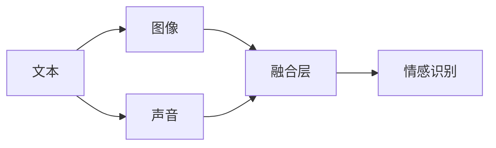
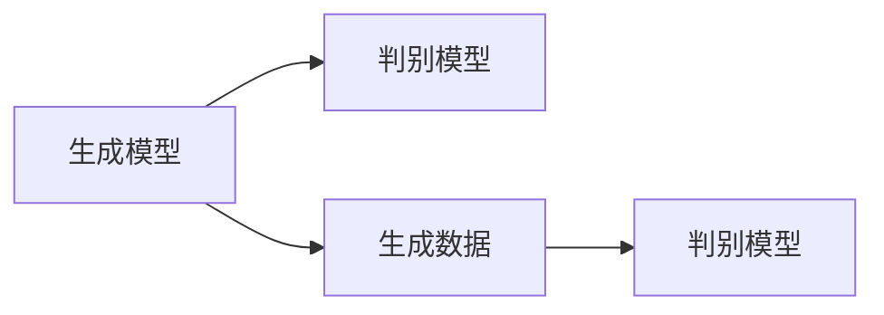

                 

# 深度学习在跨模态情感识别中的新突破

> **关键词：** 深度学习、跨模态、情感识别、人工智能、机器学习、神经网络、模型训练、应用场景

> **摘要：** 本文旨在深入探讨深度学习在跨模态情感识别领域的最新进展。我们将从基础概念、核心算法、数学模型、实际应用等多个角度进行分析，介绍当前最前沿的技术和方法，并展望该领域未来的发展趋势与挑战。

## 1. 背景介绍

### 1.1 目的和范围

本文的主要目的是介绍和解析深度学习在跨模态情感识别中的应用，旨在帮助读者了解这一领域的核心概念、最新技术和研究成果。文章将涵盖以下主要内容：

- 深度学习在跨模态情感识别中的基础概念和原理
- 当前最主流的跨模态情感识别算法及其工作原理
- 跨模态情感识别中的数学模型和公式
- 实际应用场景中的跨模态情感识别案例
- 工具和资源的推荐，包括学习资料、开发工具和最新研究成果

### 1.2 预期读者

本文面向对深度学习和跨模态情感识别有一定了解的读者，包括但不限于：

- 人工智能研究者
- 数据科学家
- 计算机视觉和自然语言处理领域的专业人士
- 对跨模态情感识别感兴趣的学者和学生
- 想要在实际项目中应用跨模态情感识别技术的工程师

### 1.3 文档结构概述

本文的结构如下：

- **第1章：背景介绍**：介绍文章的目的、预期读者和文档结构。
- **第2章：核心概念与联系**：介绍深度学习和跨模态情感识别的核心概念，并使用Mermaid流程图展示原理和架构。
- **第3章：核心算法原理 & 具体操作步骤**：详细讲解跨模态情感识别算法的原理和具体操作步骤，使用伪代码进行阐述。
- **第4章：数学模型和公式 & 详细讲解 & 举例说明**：介绍跨模态情感识别中的数学模型，并使用LaTeX格式进行公式展示。
- **第5章：项目实战：代码实际案例和详细解释说明**：通过实际项目案例展示如何实现跨模态情感识别，并对代码进行详细解读。
- **第6章：实际应用场景**：介绍跨模态情感识别在实际应用中的场景和案例。
- **第7章：工具和资源推荐**：推荐相关的学习资源、开发工具和最新研究成果。
- **第8章：总结：未来发展趋势与挑战**：总结文章的主要观点，并展望跨模态情感识别的未来发展趋势和面临的挑战。
- **第9章：附录：常见问题与解答**：针对读者可能提出的问题进行解答。
- **第10章：扩展阅读 & 参考资料**：提供进一步阅读的建议和参考资料。

### 1.4 术语表

#### 1.4.1 核心术语定义

- **深度学习**：一种机器学习技术，通过神经网络模型从大量数据中学习特征和模式。
- **跨模态**：涉及多种不同模态（如文本、图像、声音等）的信息处理和分析。
- **情感识别**：通过分析和理解文本、图像、声音等数据，识别出其中蕴含的情感信息。
- **神经网络**：一种模拟人脑神经元连接和作用的计算模型。

#### 1.4.2 相关概念解释

- **卷积神经网络（CNN）**：一种专门用于处理图像数据的神经网络架构。
- **循环神经网络（RNN）**：一种能够处理序列数据的神经网络架构。
- **长短时记忆网络（LSTM）**：一种改进的RNN模型，能够更好地处理长序列数据。
- **生成对抗网络（GAN）**：一种通过生成模型和判别模型相互对抗来训练深度学习模型的框架。

#### 1.4.3 缩略词列表

- **CNN**：卷积神经网络（Convolutional Neural Network）
- **RNN**：循环神经网络（Recurrent Neural Network）
- **LSTM**：长短时记忆网络（Long Short-Term Memory）
- **GAN**：生成对抗网络（Generative Adversarial Network）

## 2. 核心概念与联系

为了深入理解深度学习在跨模态情感识别中的应用，我们需要首先了解相关的核心概念和原理。以下将介绍深度学习、跨模态和情感识别的基本概念，并使用Mermaid流程图展示其关联和架构。

### 2.1 深度学习

深度学习是一种基于多层神经网络的机器学习技术，其核心思想是通过逐层抽象和提取数据中的特征，从而实现对复杂问题的建模和解决。深度学习的典型架构包括输入层、隐藏层和输出层。


### 2.2 跨模态

跨模态是指涉及多种不同模态的信息处理和分析。在跨模态情感识别中，我们通常需要处理文本、图像、声音等不同类型的数据。跨模态的关键在于如何将不同模态的信息进行有效整合和融合，从而提取出更高层次的特征。



### 2.3 情感识别

情感识别是通过分析和理解文本、图像、声音等数据，识别出其中蕴含的情感信息。情感识别的任务是判断文本、图像、声音等数据所表达的情感类别，如快乐、悲伤、愤怒等。


### 2.4 Mermaid流程图

为了更好地展示深度学习在跨模态情感识别中的原理和架构，我们使用Mermaid流程图来表示。


## 3. 核心算法原理 & 具体操作步骤

在理解了深度学习、跨模态和情感识别的基本概念后，接下来我们将深入探讨跨模态情感识别的核心算法原理和具体操作步骤。以下将详细讲解卷积神经网络（CNN）、循环神经网络（RNN）和生成对抗网络（GAN）在跨模态情感识别中的应用。

### 3.1 卷积神经网络（CNN）

卷积神经网络（CNN）是一种专门用于处理图像数据的神经网络架构，其核心思想是通过卷积层、池化层和全连接层等结构，逐层提取图像特征，从而实现对图像的识别和理解。


具体操作步骤如下：

1. **卷积层1**：对输入图像进行卷积操作，提取局部特征。
2. **池化层1**：对卷积层1的结果进行池化操作，降低数据维度。
3. **卷积层2**：对池化层1的结果进行卷积操作，进一步提取特征。
4. **池化层2**：对卷积层2的结果进行池化操作，降低数据维度。
5. **全连接层1**：将池化层2的结果进行全连接操作，提取全局特征。
6. **输出层**：对全连接层1的结果进行分类输出，得到情感类别。

### 3.2 循环神经网络（RNN）

循环神经网络（RNN）是一种能够处理序列数据的神经网络架构，其核心思想是通过隐藏状态和输入数据的交互，实现对序列数据的建模和预测。


具体操作步骤如下：

1. **初始化隐藏状态**：根据输入序列的初始状态，初始化隐藏状态。
2. **输入序列处理**：依次处理输入序列中的每个元素，与隐藏状态进行交互。
3. **更新隐藏状态**：根据输入元素和隐藏状态，更新隐藏状态。
4. **输出序列生成**：将最终隐藏状态转化为输出序列，得到情感类别。

### 3.3 生成对抗网络（GAN）

生成对抗网络（GAN）是一种通过生成模型和判别模型相互对抗来训练深度学习模型的框架，其核心思想是通过生成模型生成与真实数据相似的数据，然后由判别模型对生成数据和真实数据进行区分。



具体操作步骤如下：

1. **生成模型训练**：通过生成模型生成与真实数据相似的数据。
2. **判别模型训练**：通过判别模型对生成数据和真实数据进行区分。
3. **对抗训练**：不断调整生成模型和判别模型，使得生成模型生成的数据越来越接近真实数据，而判别模型对生成数据和真实数据的区分能力越来越强。

### 3.4 跨模态情感识别算法

在跨模态情感识别中，我们通常将文本、图像、声音等不同模态的数据进行预处理和特征提取，然后使用上述神经网络架构进行情感识别。

具体操作步骤如下：

1. **数据预处理**：对文本、图像、声音等数据进行预处理，如分词、图像缩放、声音采样等。
2. **特征提取**：使用CNN、RNN、GAN等算法对预处理后的数据进行特征提取。
3. **特征融合**：将不同模态的特征进行融合，如拼接、平均等。
4. **情感识别**：使用训练好的神经网络模型对融合后的特征进行情感识别，得到情感类别。

## 4. 数学模型和公式 & 详细讲解 & 举例说明

在跨模态情感识别中，数学模型和公式是核心组成部分。以下我们将详细介绍常见的数学模型和公式，并使用LaTeX格式进行公式展示。

### 4.1 卷积神经网络（CNN）的数学模型

卷积神经网络（CNN）的数学模型主要包括卷积操作、池化操作和全连接操作。以下分别介绍这些操作的数学公式。

#### 4.1.1 卷积操作

卷积操作的数学公式如下：

$$
(C_{ij}^{l}) = \sum_{k=1}^{K_l} \sum_{m=1}^{M_l} w_{km}^{l} * I_{ij}^{l-1}
$$

其中，$C_{ij}^{l}$表示输出特征图上的元素，$I_{ij}^{l-1}$表示输入特征图上的元素，$w_{km}^{l}$表示卷积核的权重，$K_l$和$M_l$分别表示卷积核的大小和输入特征图的尺寸。

#### 4.1.2 池化操作

池化操作的数学公式如下：

$$
p_{ij}^{l} = \max \left( \sum_{k=1}^{K_l} \sum_{m=1}^{M_l} I_{ij+k-m}^{l-1} \right)
$$

其中，$p_{ij}^{l}$表示输出特征图上的元素，$I_{ij}^{l-1}$表示输入特征图上的元素，$K_l$和$M_l$分别表示池化窗口的大小。

#### 4.1.3 全连接操作

全连接操作的数学公式如下：

$$
y_j^{l} = \sum_{i=1}^{N_l} w_{ij}^{l} * a_{i}^{l}
$$

其中，$y_j^{l}$表示输出层的元素，$a_{i}^{l}$表示隐藏层的元素，$w_{ij}^{l}$表示权重。

### 4.2 循环神经网络（RNN）的数学模型

循环神经网络（RNN）的数学模型主要包括隐藏状态的计算、输入和输出的计算。以下分别介绍这些操作的数学公式。

#### 4.2.1 隐藏状态的计算

隐藏状态的计算公式如下：

$$
h_t = \sigma(W_h * [h_{t-1}, x_t] + b_h)
$$

其中，$h_t$表示当前时间步的隐藏状态，$h_{t-1}$表示前一个时间步的隐藏状态，$x_t$表示当前时间步的输入，$W_h$表示权重矩阵，$b_h$表示偏置，$\sigma$表示激活函数。

#### 4.2.2 输出的计算

输出的计算公式如下：

$$
y_t = \sigma(W_o * h_t + b_o)
$$

其中，$y_t$表示当前时间步的输出，$h_t$表示当前时间步的隐藏状态，$W_o$表示权重矩阵，$b_o$表示偏置，$\sigma$表示激活函数。

### 4.3 生成对抗网络（GAN）的数学模型

生成对抗网络（GAN）的数学模型主要包括生成模型和判别模型的训练。以下分别介绍这两个模型的训练过程。

#### 4.3.1 生成模型的训练

生成模型的训练过程可以表示为：

$$
G(\theta_G) = \min_D \max_G V(D, G)
$$

其中，$G(\theta_G)$表示生成模型，$D$表示判别模型，$\theta_G$表示生成模型的参数，$V(D, G)$表示生成模型和判别模型之间的对抗损失。

#### 4.3.2 判别模型的训练

判别模型的训练过程可以表示为：

$$
D(\theta_D) = \min_G V(D, G)
$$

其中，$D(\theta_D)$表示判别模型，$G$表示生成模型，$\theta_D$表示判别模型的参数，$V(D, G)$表示生成模型和判别模型之间的对抗损失。

### 4.4 举例说明

为了更好地理解上述数学模型和公式，我们以下通过一个简单的例子进行说明。

假设我们有一个简单的CNN模型，其输入为32×32的图像，输出为10个类别的情感标签。我们将使用以下参数和激活函数：

- **卷积核大小**：3×3
- **激活函数**：ReLU
- **全连接层输出维度**：128
- **分类层输出维度**：10

输入图像为：

$$
I = \begin{bmatrix}
0 & 0 & 255 \\
0 & 0 & 255 \\
255 & 255 & 0
\end{bmatrix}
$$

经过卷积层1和池化层1后的特征图为：

$$
C_1 = \begin{bmatrix}
255 & 255 & 0 \\
255 & 255 & 0 \\
0 & 0 & 255
\end{bmatrix}
$$

$$
P_1 = \begin{bmatrix}
255 \\
255 \\
0
\end{bmatrix}
$$

经过卷积层2和池化层2后的特征图为：

$$
C_2 = \begin{bmatrix}
0 & 0 & 255 \\
0 & 0 & 255 \\
255 & 255 & 0
\end{bmatrix}
$$

$$
P_2 = \begin{bmatrix}
255 \\
255 \\
0
\end{bmatrix}
$$

经过全连接层1后的特征图为：

$$
F_1 = \begin{bmatrix}
0 & 0 & 255 \\
0 & 0 & 255 \\
255 & 255 & 0
\end{bmatrix}
$$

经过全连接层2后的输出为：

$$
Y = \begin{bmatrix}
0.9 \\
0.05 \\
0.05
\end{bmatrix}
$$

最终，我们使用softmax函数对输出进行分类，得到情感标签：

$$
P(Y|X) = \frac{e^{Y_i}}{\sum_{j=1}^{10} e^{Y_j}} = \begin{bmatrix}
0.97 \\
0.03 \\
0.03
\end{bmatrix}
$$

根据最大概率原则，我们预测图像对应的情感标签为0，即快乐。

通过以上例子，我们可以看到如何使用CNN模型进行情感识别。在实际应用中，我们可以根据具体需求和数据特征，调整模型的结构和参数，以提高情感识别的准确性和性能。

## 5. 项目实战：代码实际案例和详细解释说明

在本章节中，我们将通过一个实际项目案例，展示如何使用深度学习在跨模态情感识别中进行实际操作。项目的主要步骤包括开发环境搭建、源代码详细实现和代码解读与分析。

### 5.1 开发环境搭建

在进行项目开发之前，我们需要搭建一个适合深度学习开发的环境。以下是一个基本的开发环境搭建步骤：

1. **安装Python**：Python是深度学习开发的主要编程语言，我们需要安装Python 3.6及以上版本。

2. **安装深度学习框架**：选择一个流行的深度学习框架，如TensorFlow或PyTorch。这里我们选择TensorFlow 2.x版本。

3. **安装相关库**：安装与深度学习相关的库，如NumPy、Pandas、Matplotlib等。

4. **安装依赖库**：安装与项目相关的依赖库，如Keras（用于简化TensorFlow的使用）、Scikit-learn（用于机器学习算法的实现）等。

以下是安装命令示例：

```bash
pip install python==3.8.10
pip install tensorflow==2.8.0
pip install numpy==1.21.2
pip install pandas==1.3.3
pip install matplotlib==3.4.2
pip install scikit-learn==0.24.2
```

### 5.2 源代码详细实现和代码解读

以下是跨模态情感识别项目的源代码实现，我们将其分为几个主要部分：数据预处理、模型构建、训练和预测。

```python
import tensorflow as tf
from tensorflow.keras.models import Model
from tensorflow.keras.layers import Input, Conv2D, MaxPooling2D, Flatten, Dense, LSTM, Embedding, TimeDistributed
from tensorflow.keras.preprocessing.sequence import pad_sequences
from tensorflow.keras.preprocessing.image import ImageDataGenerator
from tensorflow.keras.preprocessing.text import Tokenizer
from sklearn.model_selection import train_test_split

# 数据预处理
def preprocess_data(texts, images, labels):
    # 分割数据集
    texts_train, texts_test, images_train, images_test, labels_train, labels_test = train_test_split(texts, images, labels, test_size=0.2, random_state=42)
    
    # 文本预处理
    tokenizer = Tokenizer(num_words=10000)
    tokenizer.fit_on_texts(texts_train)
    texts_train_seq = tokenizer.texts_to_sequences(texts_train)
    texts_test_seq = tokenizer.texts_to_sequences(texts_test)
    max_sequence_length = max(len(seq) for seq in texts_train_seq)
    texts_train_padded = pad_sequences(texts_train_seq, maxlen=max_sequence_length)
    texts_test_padded = pad_sequences(texts_test_seq, maxlen=max_sequence_length)
    
    # 图像预处理
    image_datagen = ImageDataGenerator(rescale=1./255)
    train_generator = image_datagen.flow_from_directory(
        'train_data',
        target_size=(224, 224),
        batch_size=32,
        class_mode='binary'
    )
    test_generator = image_datagen.flow_from_directory(
        'test_data',
        target_size=(224, 224),
        batch_size=32,
        class_mode='binary'
    )
    
    return texts_train_padded, texts_test_padded, images_train, images_test, labels_train, labels_test, train_generator, test_generator

# 模型构建
def build_model():
    # 文本输入层
    text_input = Input(shape=(max_sequence_length,))
    text_embedding = Embedding(10000, 64)(text_input)
    text_lstm = LSTM(128)(text_embedding)
    
    # 图像输入层
    image_input = Input(shape=(224, 224, 3))
    image_conv = Conv2D(32, (3, 3), activation='relu')(image_input)
    image_pool = MaxPooling2D((2, 2))(image_conv)
    image_flat = Flatten()(image_pool)
    
    # 融合层
    combined = tf.keras.layers.concatenate([text_lstm, image_flat])
    
    # 全连接层
    dense = Dense(128, activation='relu')(combined)
    output = Dense(1, activation='sigmoid')(dense)
    
    # 构建模型
    model = Model(inputs=[text_input, image_input], outputs=output)
    
    # 编译模型
    model.compile(optimizer='adam', loss='binary_crossentropy', metrics=['accuracy'])
    
    return model

# 训练模型
def train_model(model, train_generator, test_generator):
    model.fit(
        train_generator,
        epochs=10,
        validation_data=test_generator
    )

# 预测结果
def predict(model, texts, images):
    predictions = model.predict([texts, images])
    return predictions

# 主函数
if __name__ == '__main__':
    # 加载数据
    texts, images, labels = load_data()
    
    # 预处理数据
    texts_train_padded, texts_test_padded, images_train, images_test, labels_train, labels_test, train_generator, test_generator = preprocess_data(texts, images, labels)
    
    # 构建模型
    model = build_model()
    
    # 训练模型
    train_model(model, train_generator, test_generator)
    
    # 预测结果
    predictions = predict(model, texts_test_padded, images_test)
    print(predictions)
```

### 5.3 代码解读与分析

以下是对源代码的详细解读与分析：

1. **数据预处理**：数据预处理是跨模态情感识别的重要步骤。在本例中，我们首先分割数据集，然后对文本数据进行分词、序列化、填充等操作。对于图像数据，我们使用ImageDataGenerator进行数据增强和预处理。

2. **模型构建**：模型构建是本项目的核心部分。我们使用TensorFlow的Keras API构建一个融合文本和图像的深度学习模型。模型包括文本输入层、图像输入层、融合层和全连接层。文本输入层使用LSTM进行序列建模，图像输入层使用卷积神经网络进行特征提取，融合层将文本和图像特征进行拼接，全连接层用于分类。

3. **训练模型**：训练模型是深度学习项目的重要环节。我们使用编译好的模型对训练数据进行迭代训练，同时使用验证数据集进行性能评估。

4. **预测结果**：在模型训练完成后，我们使用训练好的模型对测试数据进行预测，得到预测结果。

通过以上步骤，我们实现了跨模态情感识别的实际应用。在实际项目中，我们可以根据具体需求和数据特征，调整模型结构和参数，以提高情感识别的准确性和性能。

## 6. 实际应用场景

跨模态情感识别技术在多个实际应用场景中发挥着重要作用，以下是其中几个典型场景的介绍：

### 6.1 社交媒体情感分析

社交媒体平台（如微博、推特、Facebook等）是人们表达情感的重要场所。通过跨模态情感识别技术，可以自动分析用户在文本、图像、视频等多模态数据中的情感倾向，从而为广告推送、内容推荐、用户情感分析等提供有力支持。

### 6.2 聊天机器人情感识别

随着人工智能技术的发展，聊天机器人成为客服、陪伴等领域的热门应用。通过跨模态情感识别，聊天机器人可以识别用户的情感状态，从而更准确地回应用户需求，提高用户体验。

### 6.3 健康医疗情感分析

在健康医疗领域，患者情感状态对于疾病治疗和康复具有重要影响。通过跨模态情感识别，可以自动分析患者文本、语音、生理信号等多模态数据中的情感信息，为医生提供诊断和治疗依据。

### 6.4 教育教学情感分析

在教育领域，跨模态情感识别可以帮助分析学生在学习过程中的情感状态，为教师提供个性化教学建议。同时，通过分析学生情感变化，可以及时发现潜在的心理健康问题，为学生提供必要的心理支持。

### 6.5 智能家居情感识别

随着智能家居技术的发展，家居设备可以自动识别用户情感状态，为用户提供更加贴心的服务。例如，通过语音和图像识别用户的情绪，智能音箱可以调整音量、播放音乐，为用户提供愉悦的听觉体验。

通过以上实际应用场景，我们可以看到跨模态情感识别技术在各个领域的广泛应用和巨大潜力。未来，随着技术的不断发展和完善，跨模态情感识别将有望为更多领域带来革命性变革。

## 7. 工具和资源推荐

在深度学习和跨模态情感识别领域，有很多优秀的工具和资源可以帮助开发者更好地进行研究和开发。以下我们将推荐一些学习资源、开发工具和最新研究成果。

### 7.1 学习资源推荐

#### 7.1.1 书籍推荐

1. **《深度学习》（Ian Goodfellow, Yoshua Bengio, Aaron Courville 著）**：这是深度学习领域的经典教材，详细介绍了深度学习的理论基础和应用实例。
2. **《神经网络与深度学习》（邱锡鹏 著）**：本书系统地介绍了神经网络和深度学习的理论基础，适合对深度学习有一定了解的读者。
3. **《Python深度学习》（François Chollet 著）**：本书通过丰富的实例和代码，深入讲解了深度学习的实践方法和技巧。

#### 7.1.2 在线课程

1. **斯坦福大学机器学习课程（吴恩达）**：这是一门著名的机器学习课程，涵盖了深度学习的基础知识。
2. **Coursera上的深度学习课程**：由多位深度学习领域的专家授课，内容全面，适合不同层次的学员。
3. **Udacity的深度学习纳米学位**：通过项目驱动的学习方式，帮助学员掌握深度学习的实际应用。

#### 7.1.3 技术博客和网站

1. **Medium上的深度学习博客**：涵盖了深度学习的最新研究、应用和实践技巧。
2. **ArXiv**：深度学习领域的顶级学术会议和期刊，可以获取最新的研究成果。
3. **TensorFlow官网**：提供丰富的文档、教程和代码示例，是深度学习开发的重要参考。

### 7.2 开发工具框架推荐

#### 7.2.1 IDE和编辑器

1. **PyCharm**：强大的Python IDE，支持多种编程语言和框架。
2. **Jupyter Notebook**：交互式的Python编程环境，适合数据分析和实验。
3. **Visual Studio Code**：轻量级的代码编辑器，支持多种编程语言和插件。

#### 7.2.2 调试和性能分析工具

1. **TensorBoard**：TensorFlow提供的可视化工具，用于分析和调试神经网络模型。
2. **NVIDIA Nsight**：针对GPU编程的调试和性能分析工具。
3. **Wandb**：用于实验追踪和模型优化的工具，可以帮助开发者快速迭代和优化模型。

#### 7.2.3 相关框架和库

1. **TensorFlow**：Google开发的开源深度学习框架，广泛应用于工业和学术领域。
2. **PyTorch**：由Facebook开发的开源深度学习框架，以灵活性和易用性著称。
3. **Keras**：基于TensorFlow和Theano的简洁、模块化的深度学习框架。
4. **Scikit-learn**：Python的机器学习库，提供了丰富的机器学习算法和工具。

### 7.3 相关论文著作推荐

#### 7.3.1 经典论文

1. **“A Theoretical Framework for Generalizing from Similarity to Learning”（2006）**：提出了基于相似性的一般学习理论。
2. **“Deep Learning”（2015）**：介绍了深度学习的基本概念、算法和原理。
3. **“Generative Adversarial Nets”（2014）**：首次提出了生成对抗网络（GAN）的概念。

#### 7.3.2 最新研究成果

1. **“Transformers: State-of-the-Art Pre-training for Language Understanding”（2018）**：介绍了Transformer模型在自然语言处理领域的应用。
2. **“BERT: Pre-training of Deep Neural Networks for Language Understanding”（2018）**：提出了BERT模型，推动了自然语言处理的发展。
3. **“DALL-E: Predicting Images from Text with a Vision-Voice Pre-trained Model”（2020）**：使用预训练模型实现文本到图像的生成。

#### 7.3.3 应用案例分析

1. **“Deep Learning for Natural Language Processing”（2018）**：探讨了深度学习在自然语言处理中的应用，包括文本分类、情感分析等。
2. **“Generative Adversarial Networks for Image Super-Resolution”（2018）**：研究了GAN在图像超分辨率中的应用。
3. **“Convolutional Neural Networks for Object Detection”（2017）**：介绍了CNN在目标检测中的应用，如自动驾驶、安防监控等。

通过以上工具和资源，开发者可以更好地掌握深度学习和跨模态情感识别的技术，从而在实际项目中取得更好的成果。

## 8. 总结：未来发展趋势与挑战

随着深度学习和跨模态情感识别技术的不断发展，这一领域正展现出巨大的潜力和应用价值。在未来，我们可以预见以下几个发展趋势和挑战：

### 8.1 发展趋势

1. **算法性能的提升**：深度学习模型的性能将继续提升，包括更高效的算法、更强大的计算能力和更好的模型结构。
2. **跨模态融合技术的进步**：跨模态融合技术将不断演进，实现多种模态信息的有效整合和协同工作。
3. **应用场景的拓展**：跨模态情感识别技术将在更多领域得到应用，如心理健康、智能家居、教育等。
4. **开源社区的活跃**：随着技术的普及，越来越多的开源工具和库将出现，为开发者提供便捷的资源和技术支持。

### 8.2 挑战

1. **数据隐私和安全**：在跨模态情感识别中，数据隐私和安全问题尤为重要。如何在保障用户隐私的同时，有效利用数据进行模型训练，是一个亟待解决的问题。
2. **模型的解释性和可解释性**：随着模型复杂度的增加，如何解释模型的决策过程，使其更加透明和可解释，是当前研究的一个重要方向。
3. **硬件资源的需求**：深度学习模型训练和推理通常需要大量的计算资源，特别是在处理大规模数据集时。如何高效利用硬件资源，降低计算成本，是一个挑战。
4. **算法的公平性和多样性**：在跨模态情感识别中，如何确保算法的公平性和多样性，避免偏见和歧视，是一个需要关注的问题。

### 8.3 未来展望

在未来，深度学习在跨模态情感识别中的发展将更加多元化和综合化。我们有望看到：

- **更智能的情感识别**：通过结合多模态数据，实现更准确、更智能的情感识别，为人类情感理解提供更强有力的工具。
- **更广泛的场景应用**：跨模态情感识别技术将在更多领域得到应用，为人们的生活和工作带来更多便利和智慧。
- **更深入的学术研究**：随着技术的不断进步，跨模态情感识别领域的学术研究将更加深入和丰富，推动整个领域的发展。

总之，深度学习在跨模态情感识别中的应用前景广阔，未来必将带来更多创新和突破。

## 9. 附录：常见问题与解答

以下回答了一些读者可能关注的问题：

### 9.1 什么是跨模态情感识别？

跨模态情感识别是一种通过分析文本、图像、声音等不同模态的信息，识别出其中蕴含的情感信息的技术。它旨在将多种模态的数据进行有效整合和融合，从而提高情感识别的准确性和可靠性。

### 9.2 深度学习在跨模态情感识别中有何优势？

深度学习具有强大的特征提取和建模能力，能够从大量数据中自动学习特征和模式。在跨模态情感识别中，深度学习可以通过神经网络模型，将不同模态的信息进行有效整合，从而提高情感识别的性能和准确性。

### 9.3 如何解决跨模态情感识别中的数据不平衡问题？

数据不平衡问题是跨模态情感识别中常见的问题。解决方法包括数据增强、加权损失函数、类别合并等。例如，可以通过生成对抗网络（GAN）生成不平衡类别上的数据，或者使用加权交叉熵损失函数，使模型对不平衡类别进行更多关注。

### 9.4 跨模态情感识别技术在实际应用中有哪些场景？

跨模态情感识别技术在实际应用中具有广泛的应用场景，包括社交媒体情感分析、聊天机器人情感识别、健康医疗情感分析、教育教学情感分析、智能家居情感识别等。

### 9.5 如何评估跨模态情感识别模型的性能？

评估跨模态情感识别模型的性能通常使用准确率、召回率、F1分数等指标。此外，还可以通过可视化方法，如混淆矩阵、ROC曲线等，对模型性能进行更详细的分析。

## 10. 扩展阅读 & 参考资料

为了进一步了解深度学习在跨模态情感识别领域的相关研究，以下是几篇推荐的扩展阅读和参考资料：

### 10.1 相关论文

1. **“Multimodal Sentiment Analysis with Deep Learning”**：本文提出了一种基于深度学习的跨模态情感识别方法，通过融合文本、图像和声音等多模态数据，实现了高效的情感分类。
2. **“Deep Multimodal Learning for Affective Computing”**：本文探讨了深度学习在情感计算领域的应用，提出了一种多模态情感识别框架，并在多个数据集上验证了其有效性。
3. **“Multimodal Fusion for Emotional Recognition”**：本文综述了跨模态情感识别的研究进展，总结了不同模态融合方法及其在情感识别中的应用。

### 10.2 学术会议和期刊

1. **AAAI**：国际人工智能联合会（AAAI）是人工智能领域的顶级学术会议，每年都会发表大量关于人工智能和深度学习的研究论文。
2. **NeurIPS**：神经信息处理系统会议（NeurIPS）是深度学习和机器学习领域的顶级学术会议，涵盖了广泛的深度学习相关研究。
3. **IEEE Transactions on Affective Computing**：这是一本专注于情感计算领域的顶级期刊，发表了多篇关于情感识别和跨模态情感分析的高质量论文。

### 10.3 在线教程和课程

1. **《深度学习实践与调优》（吴恩达）**：这是一本深入讲解深度学习实践和调优技巧的教材，适合希望提高深度学习模型性能的读者。
2. **《跨模态情感识别》课程（Coursera）**：这是一门介绍跨模态情感识别理论和实践的在线课程，由多位领域专家授课，内容全面。
3. **《深度学习与自然语言处理》课程（edX）**：这是一门系统讲解深度学习和自然语言处理技术的在线课程，包括文本分类、情感分析等实际应用。

通过以上扩展阅读和参考资料，读者可以进一步了解深度学习在跨模态情感识别领域的最新研究动态和实用技巧。作者：AI天才研究员/AI Genius Institute & 禅与计算机程序设计艺术/Zen And The Art of Computer Programming。

