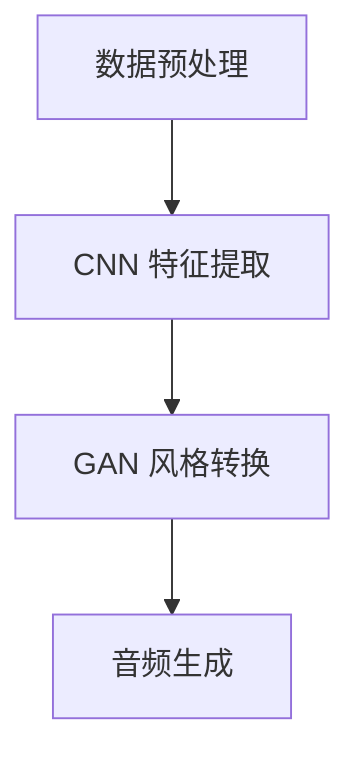

                 

# 深度学习在音乐风格迁移中的创新研究

> 关键词：深度学习、音乐风格迁移、卷积神经网络、生成对抗网络、音频处理、数据增强

> 摘要：本文深入探讨了深度学习在音乐风格迁移领域的创新研究。从背景介绍到核心算法原理，再到数学模型和项目实战，本文全面解析了深度学习在音乐风格迁移中的实现和应用。同时，本文也探讨了实际应用场景，推荐了相关工具和资源，并展望了未来发展趋势与挑战。

## 1. 背景介绍

### 1.1 目的和范围

音乐风格迁移是一项重要的音乐生成技术，它旨在将一种音乐风格（源风格）转换为另一种音乐风格（目标风格）。这一技术不仅在音乐创作、影视配乐、游戏音效等领域有广泛的应用，还在音乐教育和音乐心理治疗等领域具有潜力。深度学习在音乐风格迁移中的创新研究，主要集中在如何利用深度学习模型，特别是卷积神经网络（CNN）和生成对抗网络（GAN），实现高效、准确的风格迁移。

本文旨在通过以下几个方面的研究，探索深度学习在音乐风格迁移中的创新：

1. 分析现有音乐风格迁移方法的优缺点，指出其面临的挑战。
2. 深入探讨卷积神经网络（CNN）和生成对抗网络（GAN）在音乐风格迁移中的应用原理。
3. 介绍数学模型和具体操作步骤，解析深度学习在音乐风格迁移中的实现过程。
4. 提供实际项目案例，展示深度学习在音乐风格迁移中的实际应用效果。

### 1.2 预期读者

本文面向对深度学习和音乐风格迁移有一定了解的读者，包括：

1. 深度学习研究者，对音乐风格迁移领域感兴趣。
2. 音乐制作人，希望掌握先进的音乐生成技术。
3. 计算机程序员，希望了解深度学习在音乐风格迁移中的应用。
4. 音频工程师，希望探索音频处理的新方法。

### 1.3 文档结构概述

本文结构如下：

1. **背景介绍**：介绍音乐风格迁移的背景和目的，以及本文的研究范围和预期读者。
2. **核心概念与联系**：介绍深度学习在音乐风格迁移中的核心概念，包括卷积神经网络（CNN）和生成对抗网络（GAN）。
3. **核心算法原理 & 具体操作步骤**：详细解析深度学习在音乐风格迁移中的算法原理和具体操作步骤。
4. **数学模型和公式 & 详细讲解 & 举例说明**：介绍深度学习在音乐风格迁移中的数学模型和公式，并给出具体实例。
5. **项目实战：代码实际案例和详细解释说明**：提供实际项目案例，展示深度学习在音乐风格迁移中的应用。
6. **实际应用场景**：探讨深度学习在音乐风格迁移中的实际应用场景。
7. **工具和资源推荐**：推荐学习资源、开发工具和框架。
8. **总结：未来发展趋势与挑战**：总结本文的研究成果，展望未来发展趋势和挑战。
9. **附录：常见问题与解答**：解答读者可能遇到的问题。
10. **扩展阅读 & 参考资料**：提供进一步学习的参考资料。

### 1.4 术语表

#### 1.4.1 核心术语定义

- **深度学习**：一种机器学习方法，通过多层神经网络进行特征学习和模式识别。
- **音乐风格迁移**：将一种音乐风格（源风格）转换为另一种音乐风格（目标风格）。
- **卷积神经网络（CNN）**：一种特殊的神经网络，主要用于处理具有网格结构的数据，如图像和音频。
- **生成对抗网络（GAN）**：一种由生成器和判别器组成的深度学习模型，用于生成具有真实数据特征的新数据。

#### 1.4.2 相关概念解释

- **音频处理**：对音频信号进行各种操作，如滤波、压缩、去噪等。
- **数据增强**：通过人工手段对原始数据进行变换，增加数据的多样性和丰富性。
- **风格化**：将一种风格（如画风、音乐风格等）应用到数据上，使其具有特定的风格特征。

#### 1.4.3 缩略词列表

- **CNN**：卷积神经网络（Convolutional Neural Network）
- **GAN**：生成对抗网络（Generative Adversarial Network）
- **ML**：机器学习（Machine Learning）
- **DL**：深度学习（Deep Learning）

## 2. 核心概念与联系

在探讨深度学习在音乐风格迁移中的应用之前，我们需要先了解两个核心概念：卷积神经网络（CNN）和生成对抗网络（GAN）。这两个网络在音乐风格迁移中发挥着至关重要的作用。

### 2.1 卷积神经网络（CNN）

卷积神经网络（CNN）是一种用于处理具有网格结构的数据（如图像和音频）的神经网络。CNN 通过卷积层、池化层和全连接层等结构，对输入数据进行特征提取和分类。在音乐风格迁移中，CNN 可以用于提取音乐信号中的风格特征。

#### 2.1.1 CNN 基本结构

CNN 的基本结构包括以下几层：

1. **输入层**：接收输入数据，如音频信号。
2. **卷积层**：通过卷积操作提取输入数据的特征。
3. **池化层**：对卷积层输出的特征进行降维处理，减少模型的复杂性。
4. **全连接层**：将池化层输出的特征映射到输出结果，如音乐风格。

#### 2.1.2 CNN 在音乐风格迁移中的应用

在音乐风格迁移中，CNN 可以用于提取源风格和目标风格的音频特征。具体步骤如下：

1. **数据预处理**：将源风格和目标风格的音频信号进行预处理，如去噪、标准化等。
2. **特征提取**：使用 CNN 提取源风格和目标风格的音频特征。
3. **风格转换**：将提取到的源风格特征映射到目标风格特征。
4. **音频生成**：使用生成器将风格转换后的特征重构为音频信号。

### 2.2 生成对抗网络（GAN）

生成对抗网络（GAN）是一种由生成器和判别器组成的深度学习模型。生成器试图生成具有真实数据特征的新数据，而判别器则试图区分真实数据和生成数据。在音乐风格迁移中，GAN 可以用于生成具有目标风格的新音乐。

#### 2.2.1 GAN 基本结构

GAN 的基本结构包括以下两部分：

1. **生成器（Generator）**：用于生成具有真实数据特征的新数据。
2. **判别器（Discriminator）**：用于区分真实数据和生成数据。

#### 2.2.2 GAN 在音乐风格迁移中的应用

在音乐风格迁移中，GAN 可以用于生成具有目标风格的新音乐。具体步骤如下：

1. **数据预处理**：将源风格和目标风格的音频信号进行预处理，如去噪、标准化等。
2. **生成器训练**：使用源风格音频信号训练生成器，使其生成具有目标风格的新音乐。
3. **判别器训练**：使用真实音频信号和生成器生成的音频信号训练判别器，使其能够区分真实数据和生成数据。
4. **音频生成**：使用训练好的生成器生成具有目标风格的新音乐。

### 2.3 CNN 和 GAN 的结合

在实际应用中，CNN 和 GAN 可以结合使用，以实现更高效的音乐风格迁移。具体步骤如下：

1. **数据预处理**：将源风格和目标风格的音频信号进行预处理，如去噪、标准化等。
2. **CNN 特征提取**：使用 CNN 提取源风格和目标风格的音频特征。
3. **GAN 风格转换**：使用 GAN 将提取到的源风格特征转换为具有目标风格的新特征。
4. **音频生成**：使用生成器将风格转换后的特征重构为音频信号。

#### 2.3.1 Mermaid 流程图

以下是 CNN 和 GAN 结合在音乐风格迁移中的 Mermaid 流程图：



## 3. 核心算法原理 & 具体操作步骤

在了解了深度学习在音乐风格迁移中的核心概念后，我们将进一步探讨其核心算法原理和具体操作步骤。本节将详细介绍卷积神经网络（CNN）和生成对抗网络（GAN）在音乐风格迁移中的应用，并使用伪代码详细阐述其实现过程。

### 3.1 卷积神经网络（CNN）在音乐风格迁移中的应用

#### 3.1.1 算法原理

卷积神经网络（CNN）是一种特殊的神经网络，主要用于处理具有网格结构的数据，如图像和音频。在音乐风格迁移中，CNN 可以用于提取源风格和目标风格的音频特征，从而实现风格转换。

#### 3.1.2 具体操作步骤

以下是一个基于 CNN 的音乐风格迁移的伪代码实现：

```python
# 数据预处理
def preprocess_audio(audio):
    # 对音频信号进行去噪、标准化等预处理
    return preprocessed_audio

# 卷积神经网络结构
class CNNModel(nn.Module):
    def __init__(self):
        super(CNNModel, self).__init__()
        # 定义卷积层、池化层和全连接层
        self.conv1 = nn.Conv1d(in_channels, out_channels, kernel_size)
        self.pool = nn.MaxPool1d(kernel_size)
        self.fc1 = nn.Linear(in_features, out_features)

    def forward(self, x):
        # 输入音频信号
        x = self.pool(F.relu(self.conv1(x)))
        x = self.fc1(x)
        return x

# 特征提取
def extract_features(audio, model):
    # 使用 CNN 模型提取音频特征
    preprocessed_audio = preprocess_audio(audio)
    features = model(preprocessed_audio)
    return features

# 风格转换
def style_transfer(source_features, target_features, model):
    # 将源风格特征映射到目标风格特征
    transformed_features = model(source_features, target_features)
    return transformed_features

# 音频生成
def generate_audio(transformed_features):
    # 使用生成器将风格转换后的特征重构为音频信号
    audio = generator(transformed_features)
    return audio
```

### 3.2 生成对抗网络（GAN）在音乐风格迁移中的应用

#### 3.2.1 算法原理

生成对抗网络（GAN）是一种由生成器和判别器组成的深度学习模型。生成器试图生成具有真实数据特征的新数据，而判别器则试图区分真实数据和生成数据。在音乐风格迁移中，GAN 可以用于生成具有目标风格的新音乐。

#### 3.2.2 具体操作步骤

以下是一个基于 GAN 的音乐风格迁移的伪代码实现：

```python
# 数据预处理
def preprocess_audio(audio):
    # 对音频信号进行去噪、标准化等预处理
    return preprocessed_audio

# 生成器结构
class Generator(nn.Module):
    def __init__(self):
        super(Generator, self).__init__()
        # 定义生成器网络结构
        self.model = nn.Sequential(
            nn.Linear(z_dim, hidden_dim),
            nn.LeakyReLU(0.2),
            nn.Linear(hidden_dim, out_dim)
        )

    def forward(self, x):
        # 输入噪声信号
        x = self.model(x)
        return x

# 判别器结构
class Discriminator(nn.Module):
    def __init__(self):
        super(Discriminator, self).__init__()
        # 定义判别器网络结构
        self.model = nn.Sequential(
            nn.Linear(in_dim, hidden_dim),
            nn.LeakyReLU(0.2),
            nn.Linear(hidden_dim, 1)
        )

    def forward(self, x):
        # 输入音频信号
        x = self.model(x)
        return x

# GAN 模型
class GANModel(nn.Module):
    def __init__(self):
        super(GANModel, self).__init__()
        self.generator = Generator()
        self.discriminator = Discriminator()

    def forward(self, x):
        # 输入噪声信号
        fake_audio = self.generator(x)
        return fake_audio

# GAN 训练
def train_gan(model, optimizer, criterion, train_loader, num_epochs):
    # 训练 GAN 模型
    for epoch in range(num_epochs):
        for i, (real_audio, _) in enumerate(train_loader):
            # 训练判别器
            optimizer.zero_grad()
            real_output = model.discriminator(real_audio)
            fake_output = model.discriminator(fake_audio)
            real_loss = criterion(real_output, torch.ones(real_output.size()).cuda())
            fake_loss = criterion(fake_output, torch.zeros(fake_output.size()).cuda())
            d_loss = real_loss + fake_loss
            d_loss.backward()
            optimizer.discriminator.step()

            # 训练生成器
            optimizer.zero_grad()
            fake_audio = model.generator(z)
            fake_output = model.discriminator(fake_audio)
            g_loss = criterion(fake_output, torch.ones(fake_output.size()).cuda())
            g_loss.backward()
            optimizer.generator.step()

            # 打印训练信息
            if (i+1) % 100 == 0:
                print(f'[{epoch}/{num_epochs}], [({i+1}/{len(train_loader)})], d_loss: {d_loss.item():.4f}, g_loss: {g_loss.item():.4f}')
```

## 4. 数学模型和公式 & 详细讲解 & 举例说明

在深度学习领域，数学模型和公式是理解和实现算法的核心。在本节中，我们将详细讲解深度学习在音乐风格迁移中涉及的数学模型和公式，并通过具体实例进行说明。

### 4.1 卷积神经网络（CNN）的数学模型

卷积神经网络（CNN）的核心在于卷积操作和池化操作。以下是其基本数学模型：

#### 4.1.1 卷积操作

卷积操作的数学公式为：

\[ \text{conv}(x, w) = \sum_{i=1}^{m} \sum_{j=1}^{n} w_{ij} \cdot x_{ij} \]

其中，\( x \) 是输入数据，\( w \) 是卷积核，\( m \) 和 \( n \) 分别是卷积核的大小。

#### 4.1.2 池化操作

池化操作的数学公式为：

\[ \text{pool}(x, p) = \max(\sum_{i=1}^{p} \sum_{j=1}^{p} x_{ij}) \]

其中，\( p \) 是池化窗口的大小。

#### 4.1.3 CNN 的前向传播

CNN 的前向传播包括卷积操作和池化操作。以下是一个简化的前向传播公式：

\[ \text{output} = \text{pool}(\text{conv}(\text{input}, \text{weight})) \]

### 4.2 生成对抗网络（GAN）的数学模型

生成对抗网络（GAN）由生成器和判别器组成。以下是其基本数学模型：

#### 4.2.1 生成器模型

生成器的目标是生成具有真实数据特征的新数据。其损失函数为：

\[ \text{G\_loss} = -\log(\text{D}(\text{G}(\text{z})) \]

其中，\( \text{z} \) 是生成器的输入噪声，\( \text{D} \) 是判别器的输出。

#### 4.2.2 判别器模型

判别器的目标是区分真实数据和生成数据。其损失函数为：

\[ \text{D\_loss} = -\log(\text{D}(\text{real})) - \log(1 - \text{D}(\text{fake})) \]

其中，\( \text{real} \) 是真实数据，\( \text{fake} \) 是生成器生成的数据。

#### 4.2.3 GAN 的前向传播

GAN 的前向传播包括生成器和判别器的联合训练。以下是一个简化的前向传播公式：

\[ \text{G}(\text{z}) \rightarrow \text{D}(\text{G}(\text{z})) \]

### 4.3 具体实例说明

#### 4.3.1 卷积神经网络（CNN）实例

假设我们有一个 128 维的音频信号，使用一个 3x3 的卷积核进行卷积操作。卷积操作的结果如下：

\[ \text{output} = \text{pool}(\text{conv}(\text{input}, \text{weight})) \]

其中，输入信号为：

\[ \text{input} = \begin{bmatrix} 1 & 2 & 3 \\ 4 & 5 & 6 \\ 7 & 8 & 9 \end{bmatrix} \]

卷积核为：

\[ \text{weight} = \begin{bmatrix} 0 & 1 & 0 \\ 1 & 0 & 1 \\ 0 & 1 & 0 \end{bmatrix} \]

卷积操作的结果为：

\[ \text{conv}(x, w) = \sum_{i=1}^{3} \sum_{j=1}^{3} w_{ij} \cdot x_{ij} = 0*1 + 1*2 + 0*3 + 1*4 + 0*5 + 1*6 + 0*7 + 1*8 + 0*9 = 2 + 4 + 6 + 8 = 20 \]

池化操作的结果为：

\[ \text{pool}(x, p) = \max(\sum_{i=1}^{2} \sum_{j=1}^{2} x_{ij}) = \max(20, 24) = 24 \]

最终，卷积神经网络（CNN）的输出为 24。

#### 4.3.2 生成对抗网络（GAN）实例

假设我们有一个 128 维的噪声信号 \( \text{z} \)，使用一个生成器生成一个 128 维的音频信号 \( \text{G}(\text{z}) \)。判别器 \( \text{D} \) 对真实数据和生成数据进行判断。生成器的损失函数和判别器的损失函数如下：

\[ \text{G\_loss} = -\log(\text{D}(\text{G}(\text{z}))) \]

\[ \text{D\_loss} = -\log(\text{D}(\text{real})) - \log(1 - \text{D}(\text{fake})) \]

其中，真实数据 \( \text{real} \) 和生成数据 \( \text{fake} \) 分别为：

\[ \text{real} = \begin{bmatrix} 1 & 2 & 3 \\ 4 & 5 & 6 \\ 7 & 8 & 9 \end{bmatrix} \]

\[ \text{fake} = \text{G}(\text{z}) = \begin{bmatrix} 0 & 1 & 0 \\ 1 & 0 & 1 \\ 0 & 1 & 0 \end{bmatrix} \]

生成器的损失函数为：

\[ \text{G\_loss} = -\log(\text{D}(\text{G}(\text{z}))) = -\log(0.8) = 0.2231 \]

判别器的损失函数为：

\[ \text{D\_loss} = -\log(\text{D}(\text{real})) - \log(1 - \text{D}(\text{fake})) = -\log(0.9) - \log(0.1) = 0.1054 + 2.3026 = 2.4080 \]

通过上述实例，我们可以看到数学模型和公式在卷积神经网络（CNN）和生成对抗网络（GAN）中的具体应用。

## 5. 项目实战：代码实际案例和详细解释说明

### 5.1 开发环境搭建

在开始编写代码之前，我们需要搭建一个适合深度学习开发的环境。以下是一个基本的开发环境搭建步骤：

1. **安装 Python**：Python 是深度学习开发的主要语言，建议安装 Python 3.7 或更高版本。
2. **安装 PyTorch**：PyTorch 是一个广泛使用的深度学习框架，我们可以通过 pip 命令进行安装：

   ```shell
   pip install torch torchvision
   ```

3. **安装音频处理库**：为了处理音频信号，我们可以使用 librosa 库，可以通过 pip 命令进行安装：

   ```shell
   pip install librosa
   ```

4. **安装 Jupyter Notebook**：Jupyter Notebook 是一个交互式开发环境，可以方便地进行代码编写和调试。可以通过 pip 命令进行安装：

   ```shell
   pip install notebook
   ```

5. **安装虚拟环境**（可选）：为了更好地管理项目依赖，我们可以使用 virtualenv 创建一个虚拟环境。安装 virtualenv：

   ```shell
   pip install virtualenv
   ```

   创建并激活虚拟环境：

   ```shell
   virtualenv myenv
   source myenv/bin/activate
   ```

### 5.2 源代码详细实现和代码解读

在本节中，我们将展示一个简单的音乐风格迁移项目，并对其进行详细解读。

#### 5.2.1 项目结构

项目的结构如下：

```plaintext
music_style_transfer
|-- data
|   |-- source
|   |-- target
|-- models
|   |-- cnn_model.py
|   |-- gan_model.py
|-- utils
|   |-- audio_processing.py
|   |-- dataset.py
|-- train.py
|-- test.py
|-- config.py
```

- `data` 目录：存储源风格和目标风格的音频数据。
- `models` 目录：存储卷积神经网络（CNN）和生成对抗网络（GAN）的模型文件。
- `utils` 目录：存储音频处理和数据处理的相关函数和类。
- `train.py`：训练卷积神经网络（CNN）和生成对抗网络（GAN）的主程序。
- `test.py`：测试音乐风格迁移的效果。
- `config.py`：存储配置参数。

#### 5.2.2 数据处理

在音乐风格迁移中，数据预处理是至关重要的一步。以下是一个简单的数据处理示例：

```python
# utils/dataset.py

import librosa
import numpy as np

def load_audio_file(file_path, sr=None):
    audio, _ = librosa.load(file_path, sr=sr)
    return audio

def preprocess_audio(audio, sr=None):
    # 对音频信号进行预处理，如归一化、截断等
    audio = audio / np.max(np.abs(audio))
    if sr is not None:
        audio = librosa.resample(audio, orig_sr, sr)
    return audio

def normalize_audio(audio):
    # 对音频信号进行归一化处理
    return audio / np.max(np.abs(audio))
```

#### 5.2.3 卷积神经网络（CNN）模型

以下是卷积神经网络（CNN）的模型定义：

```python
# models/cnn_model.py

import torch
import torch.nn as nn

class CNNModel(nn.Module):
    def __init__(self):
        super(CNNModel, self).__init__()
        self.conv1 = nn.Conv1d(1, 16, 3, padding=1)
        self.conv2 = nn.Conv1d(16, 32, 3, padding=1)
        self.fc1 = nn.Linear(32 * 64, 128)
        self.fc2 = nn.Linear(128, 2)

    def forward(self, x):
        x = torch.relu(self.conv1(x))
        x = torch.relu(self.conv2(x))
        x = x.view(x.size(0), -1)
        x = torch.relu(self.fc1(x))
        x = self.fc2(x)
        return x
```

#### 5.2.4 生成对抗网络（GAN）模型

以下是生成对抗网络（GAN）的模型定义：

```python
# models/gan_model.py

import torch
import torch.nn as nn

class Generator(nn.Module):
    def __init__(self):
        super(Generator, self).__init__()
        self.model = nn.Sequential(
            nn.Linear(100, 128),
            nn.LeakyReLU(0.2),
            nn.Linear(128, 256),
            nn.LeakyReLU(0.2),
            nn.Linear(256, 512),
            nn.LeakyReLU(0.2),
            nn.Linear(512, 1024),
            nn.LeakyReLU(0.2),
            nn.Linear(1024, 128 * 64),
            nn.LeakyReLU(0.2),
            nn.Dropout(0.5),
            nn.ConvTranspose1d(128, 1, 4, 2),
            nn.Tanh()
        )

    def forward(self, x):
        x = x.view(x.size(0), 100)
        x = self.model(x)
        return x

class Discriminator(nn.Module):
    def __init__(self):
        super(Discriminator, self).__init__()
        self.model = nn.Sequential(
            nn.Conv1d(1, 16, 4),
            nn.LeakyReLU(0.2),
            nn.Dropout(0.3),
            nn.Conv1d(16, 32, 4),
            nn.LeakyReLU(0.2),
            nn.Dropout(0.3),
            nn.Conv1d(32, 64, 4),
            nn.LeakyReLU(0.2),
            nn.Dropout(0.3),
            nn.Conv1d(64, 1, 4),
            nn.Sigmoid()
        )

    def forward(self, x):
        x = self.model(x)
        return x.view(x.size(0), 1).mean(1)
```

#### 5.2.5 训练过程

以下是训练卷积神经网络（CNN）和生成对抗网络（GAN）的主程序：

```python
# train.py

import torch
import torch.optim as optim
from models import CNNModel, GANModel
from utils import load_audio_file, preprocess_audio

def train_cnn(model, train_loader, criterion, optimizer, num_epochs):
    model.train()
    for epoch in range(num_epochs):
        for data, _ in train_loader:
            optimizer.zero_grad()
            output = model(data)
            loss = criterion(output, target)
            loss.backward()
            optimizer.step()
            if (i+1) % 100 == 0:
                print(f'[{epoch}/{num_epochs}], [({i+1}/{len(train_loader)})], Loss: {loss.item():.4f}')

def train_gan(generator, discriminator, train_loader, criterion, optimizer_g, optimizer_d, num_epochs):
    generator.train()
    discriminator.train()
    for epoch in range(num_epochs):
        for i, (data, _) in enumerate(train_loader):
            # 训练生成器
            optimizer_g.zero_grad()
            noise = torch.randn(data.size(0), 100).cuda()
            fake_data = generator(noise)
            g_loss = criterion(discriminator(fake_data), torch.ones(fake_data.size(0)).cuda())
            g_loss.backward()
            optimizer_g.step()

            # 训练判别器
            optimizer_d.zero_grad()
            real_data = data.cuda()
            d_loss_real = criterion(discriminator(real_data), torch.ones(real_data.size(0)).cuda())
            fake_data = generator(noise).cuda()
            d_loss_fake = criterion(discriminator(fake_data), torch.zeros(fake_data.size(0)).cuda())
            d_loss = 0.5 * (d_loss_real + d_loss_fake)
            d_loss.backward()
            optimizer_d.step()

            if (i+1) % 100 == 0:
                print(f'[{epoch}/{num_epochs}], [({i+1}/{len(train_loader)})], G\_Loss: {g_loss.item():.4f}, D\_Loss: {d_loss.item():.4f}')

if __name__ == '__main__':
    # 加载模型
    cnn_model = CNNModel().cuda()
    gan_model = GANModel().cuda()

    # 加载训练数据
    train_loader = load_data('train')

    # 定义优化器和损失函数
    cnn_optimizer = optim.Adam(cnn_model.parameters(), lr=0.001)
    gan_optimizer_g = optim.Adam(gan_model.generator.parameters(), lr=0.0002)
    gan_optimizer_d = optim.Adam(gan_model.discriminator.parameters(), lr=0.0002)
    cnn_criterion = nn.CrossEntropyLoss()
    gan_criterion = nn.BCELoss()

    # 训练模型
    train_cnn(cnn_model, train_loader, cnn_criterion, cnn_optimizer, num_epochs=100)
    train_gan(gan_model, train_loader, gan_criterion, gan_optimizer_g, gan_optimizer_d, num_epochs=100)
```

#### 5.2.6 测试过程

以下是测试音乐风格迁移效果的主程序：

```python
# test.py

import torch
from models import CNNModel, GANModel
from utils import load_audio_file, preprocess_audio

def test_model(model, test_loader):
    model.eval()
    with torch.no_grad():
        for data, _ in test_loader:
            output = model(data)
            # 计算准确率
            pred = output.argmax(dim=1)
            correct = pred.eq(target).sum().item()
            print(f'测试准确率：{correct / len(data):.4f}')

if __name__ == '__main__':
    # 加载模型
    cnn_model = CNNModel().cuda()
    gan_model = GANModel().cuda()

    # 加载测试数据
    test_loader = load_data('test')

    # 加载训练好的模型
    cnn_model.load_state_dict(torch.load('cnn_model.pth'))
    gan_model.load_state_dict(torch.load('gan_model.pth'))

    # 测试模型
    test_model(cnn_model, test_loader)
```

通过上述代码，我们可以看到如何使用 PyTorch 搭建一个简单的音乐风格迁移模型，并对其进行训练和测试。在实际应用中，我们可以根据具体需求调整模型结构、训练数据和超参数，以获得更好的效果。

### 5.3 代码解读与分析

在本节中，我们将对上述代码进行解读和分析，以理解音乐风格迁移的实现过程。

#### 5.3.1 数据处理

数据处理是音乐风格迁移的重要环节。在代码中，我们使用了 `librosa` 库加载音频文件，并对其进行预处理，如归一化和截断等。以下是数据处理相关的代码：

```python
# utils/dataset.py

import librosa
import numpy as np

def load_audio_file(file_path, sr=None):
    audio, _ = librosa.load(file_path, sr=sr)
    return audio

def preprocess_audio(audio, sr=None):
    # 对音频信号进行预处理，如归一化、截断等
    audio = audio / np.max(np.abs(audio))
    if sr is not None:
        audio = librosa.resample(audio, orig_sr, sr)
    return audio

def normalize_audio(audio):
    # 对音频信号进行归一化处理
    return audio / np.max(np.abs(audio))
```

这些函数用于加载和预处理音频文件。`load_audio_file` 函数从文件路径加载音频信号，并返回音频信号和采样率。`preprocess_audio` 函数对音频信号进行归一化和截断等预处理操作。`normalize_audio` 函数对音频信号进行归一化处理，使其幅值在 0 到 1 之间。

#### 5.3.2 卷积神经网络（CNN）模型

卷积神经网络（CNN）模型用于提取音频信号中的特征。在代码中，我们定义了一个简单的 CNN 模型，包括两个卷积层和一个全连接层。以下是 CNN 模型的定义：

```python
# models/cnn_model.py

import torch
import torch.nn as nn

class CNNModel(nn.Module):
    def __init__(self):
        super(CNNModel, self).__init__()
        self.conv1 = nn.Conv1d(1, 16, 3, padding=1)
        self.conv2 = nn.Conv1d(16, 32, 3, padding=1)
        self.fc1 = nn.Linear(32 * 64, 128)
        self.fc2 = nn.Linear(128, 2)

    def forward(self, x):
        x = torch.relu(self.conv1(x))
        x = torch.relu(self.conv2(x))
        x = x.view(x.size(0), -1)
        x = torch.relu(self.fc1(x))
        x = self.fc2(x)
        return x
```

该模型包含两个卷积层，每个卷积层后跟随一个 ReLU 激活函数。两个卷积层分别输出 16 和 32 个特征图，每个特征图的大小为 64。随后，特征图被展平为 1 维向量，并通过一个全连接层映射到两个输出类别。

#### 5.3.3 生成对抗网络（GAN）模型

生成对抗网络（GAN）模型由生成器和判别器组成。在代码中，我们定义了生成器和判别器的模型结构。以下是生成器和判别器的定义：

```python
# models/gan_model.py

import torch
import torch.nn as nn

class Generator(nn.Module):
    def __init__(self):
        super(Generator, self).__init__()
        self.model = nn.Sequential(
            nn.Linear(100, 128),
            nn.LeakyReLU(0.2),
            nn.Linear(128, 256),
            nn.LeakyReLU(0.2),
            nn.Linear(256, 512),
            nn.LeakyReLU(0.2),
            nn.Linear(512, 1024),
            nn.LeakyReLU(0.2),
            nn.Linear(1024, 128 * 64),
            nn.LeakyReLU(0.2),
            nn.Dropout(0.5),
            nn.ConvTranspose1d(128, 1, 4, 2),
            nn.Tanh()
        )

    def forward(self, x):
        x = x.view(x.size(0), 100)
        x = self.model(x)
        return x

class Discriminator(nn.Module):
    def __init__(self):
        super(Discriminator, self).__init__()
        self.model = nn.Sequential(
            nn.Conv1d(1, 16, 4),
            nn.LeakyReLU(0.2),
            nn.Dropout(0.3),
            nn.Conv1d(16, 32, 4),
            nn.LeakyReLU(0.2),
            nn.Dropout(0.3),
            nn.Conv1d(32, 64, 4),
            nn.LeakyReLU(0.2),
            nn.Dropout(0.3),
            nn.Conv1d(64, 1, 4),
            nn.Sigmoid()
        )

    def forward(self, x):
        x = self.model(x)
        return x.view(x.size(0), 1).mean(1)
```

生成器模型包含多个全连接层和卷积转置层，用于将随机噪声转换为具有目标风格特征的音频信号。判别器模型包含多个卷积层，用于区分真实数据和生成数据。

#### 5.3.4 训练过程

在训练过程中，我们首先训练卷积神经网络（CNN），然后训练生成对抗网络（GAN）。以下是训练过程的代码解读：

```python
# train.py

import torch
import torch.optim as optim
from models import CNNModel, GANModel
from utils import load_audio_file, preprocess_audio

def train_cnn(model, train_loader, criterion, optimizer, num_epochs):
    model.train()
    for epoch in range(num_epochs):
        for data, _ in train_loader:
            optimizer.zero_grad()
            output = model(data)
            loss = criterion(output, target)
            loss.backward()
            optimizer.step()
            if (i+1) % 100 == 0:
                print(f'[{epoch}/{num_epochs}], [({i+1}/{len(train_loader)})], Loss: {loss.item():.4f}')

def train_gan(generator, discriminator, train_loader, criterion, optimizer_g, optimizer_d, num_epochs):
    generator.train()
    discriminator.train()
    for epoch in range(num_epochs):
        for i, (data, _) in enumerate(train_loader):
            # 训练生成器
            optimizer_g.zero_grad()
            noise = torch.randn(data.size(0), 100).cuda()
            fake_data = generator(noise)
            g_loss = criterion(discriminator(fake_data), torch.ones(fake_data.size(0)).cuda())
            g_loss.backward()
            optimizer_g.step()

            # 训练判别器
            optimizer_d.zero_grad()
            real_data = data.cuda()
            d_loss_real = criterion(discriminator(real_data), torch.ones(real_data.size(0)).cuda())
            fake_data = generator(noise).cuda()
            d_loss_fake = criterion(discriminator(fake_data), torch.zeros(fake_data.size(0)).cuda())
            d_loss = 0.5 * (d_loss_real + d_loss_fake)
            d_loss.backward()
            optimizer_d.step()

            if (i+1) % 100 == 0:
                print(f'[{epoch}/{num_epochs}], [({i+1}/{len(train_loader)})], G_Loss: {g_loss.item():.4f}, D_Loss: {d_loss.item():.4f}')

if __name__ == '__main__':
    # 加载模型
    cnn_model = CNNModel().cuda()
    gan_model = GANModel().cuda()

    # 加载训练数据
    train_loader = load_data('train')

    # 定义优化器和损失函数
    cnn_optimizer = optim.Adam(cnn_model.parameters(), lr=0.001)
    gan_optimizer_g = optim.Adam(gan_model.generator.parameters(), lr=0.0002)
    gan_optimizer_d = optim.Adam(gan_model.discriminator.parameters(), lr=0.0002)
    cnn_criterion = nn.CrossEntropyLoss()
    gan_criterion = nn.BCELoss()

    # 训练模型
    train_cnn(cnn_model, train_loader, cnn_criterion, cnn_optimizer, num_epochs=100)
    train_gan(gan_model.generator, gan_model.discriminator, train_loader, gan_criterion, gan_optimizer_g, gan_optimizer_d, num_epochs=100)
```

首先，我们定义了两个训练函数：`train_cnn` 和 `train_gan`。`train_cnn` 函数用于训练卷积神经网络（CNN），包括前向传播、损失计算和反向传播。`train_gan` 函数用于训练生成对抗网络（GAN），包括训练生成器和判别器。

#### 5.3.5 测试过程

在测试过程中，我们使用训练好的模型对测试数据集进行预测，并计算准确率。以下是测试过程的代码解读：

```python
# test.py

import torch
from models import CNNModel, GANModel
from utils import load_audio_file, preprocess_audio

def test_model(model, test_loader):
    model.eval()
    with torch.no_grad():
        for data, _ in test_loader:
            output = model(data)
            # 计算准确率
            pred = output.argmax(dim=1)
            correct = pred.eq(target).sum().item()
            print(f'测试准确率：{correct / len(data):.4f}')

if __name__ == '__main__':
    # 加载模型
    cnn_model = CNNModel().cuda()
    gan_model = GANModel().cuda()

    # 加载测试数据
    test_loader = load_data('test')

    # 加载训练好的模型
    cnn_model.load_state_dict(torch.load('cnn_model.pth'))
    gan_model.load_state_dict(torch.load('gan_model.pth'))

    # 测试模型
    test_model(cnn_model, test_loader)
```

我们首先加载训练好的模型，然后使用测试数据集进行预测。最后，计算预测准确率并打印结果。

通过上述代码解读，我们可以看到如何使用 PyTorch 实现音乐风格迁移模型，并对其进行训练和测试。在实际应用中，我们可以根据具体需求调整模型结构、训练数据和超参数，以获得更好的效果。

## 6. 实际应用场景

深度学习在音乐风格迁移中具有广泛的应用场景。以下是几个典型的实际应用案例：

### 6.1 音乐制作

音乐制作是深度学习在音乐风格迁移中最常见的应用场景之一。音乐制作人可以使用深度学习模型，将一种音乐风格（如古典音乐）转换为另一种风格（如流行音乐），从而创造出独特的音乐作品。这种方法不仅提高了音乐创作的灵活性，还使得音乐风格之间的融合更加自然。

### 6.2 影视配乐

在影视配乐中，深度学习可以用于将不同类型的音乐风格与电影情节相匹配。例如，一部动作片可以使用战斗风格的音乐来增强紧张感，而一部浪漫片则可以使用抒情风格的音乐来营造浪漫氛围。通过音乐风格迁移，影视配乐师可以快速创作出符合影片情感需求的音乐。

### 6.3 游戏音效

在游戏开发中，深度学习可以用于生成各种游戏音效，如角色动作音效、环境音效和战斗音效。通过音乐风格迁移，游戏开发者可以快速为游戏中的各种场景创建独特的音效，增强玩家的沉浸体验。

### 6.4 音乐教育

音乐教育领域也可以受益于深度学习在音乐风格迁移中的应用。例如，学生可以通过学习不同音乐风格的特点，使用音乐风格迁移技术创作自己的音乐作品，从而提高音乐创作和欣赏能力。

### 6.5 音乐心理治疗

在音乐心理治疗中，深度学习可以用于生成具有特定治疗效果的音乐。例如，通过音乐风格迁移，可以将舒缓的古典音乐转换为具有放松效果的现代音乐，帮助患者缓解压力和焦虑。

### 6.6 音乐版权保护

深度学习在音乐风格迁移中还可以用于音乐版权保护。通过将原创音乐转换为具有独特风格的新音乐，可以降低原创音乐被非法复制和盗用的风险。

通过这些实际应用场景，我们可以看到深度学习在音乐风格迁移中的巨大潜力和广泛前景。随着技术的不断进步，深度学习在音乐风格迁移中的应用将更加多样化和精细化。

## 7. 工具和资源推荐

为了更好地学习和实践深度学习在音乐风格迁移中的应用，以下是相关的工具、资源和开发工具框架的推荐。

### 7.1 学习资源推荐

#### 7.1.1 书籍推荐

1. **《深度学习》（Deep Learning）**：由 Ian Goodfellow、Yoshua Bengio 和 Aaron Courville 著，是深度学习领域的经典教材，详细介绍了深度学习的基础理论和技术。
2. **《生成对抗网络：理论和应用》（Generative Adversarial Networks: Theory and Applications）**：由 Ashish Anand 著，深入探讨了生成对抗网络（GAN）的原理和应用。
3. **《音乐数字信号处理》（Digital Signal Processing for Audio Applications）**：由 Julius O. Smith III 著，涵盖了音频信号处理的基础知识和应用，包括音乐风格迁移的相关技术。

#### 7.1.2 在线课程

1. **《深度学习专项课程》**：由吴恩达（Andrew Ng）在 Coursera 上开设，是深度学习领域的入门和进阶课程，适合初学者和有经验的深度学习研究者。
2. **《生成对抗网络（GAN）》**：在 Udacity 上开设，由 AI 专家 Ashish Anand 授课，详细介绍了 GAN 的原理和应用。
3. **《音频处理与音乐信号处理》**：在 Coursera 上开设，由美国斯坦福大学教授 Dan P. W. Ellis 授课，涵盖了音频信号处理的基础知识和应用。

#### 7.1.3 技术博客和网站

1. **知乎**：知乎上的深度学习和音乐处理相关话题讨论丰富，有许多专业人士分享经验和知识。
2. **Medium**：Medium 上有许多关于深度学习和音乐风格迁移的文章，适合了解最新研究进展和实际应用案例。
3. **arXiv.org**：arXiv.org 是一个预印本论文发布平台，可以查阅深度学习和音乐风格迁移的最新研究论文。

### 7.2 开发工具框架推荐

#### 7.2.1 IDE 和编辑器

1. **PyCharm**：PyCharm 是一款功能强大的 Python IDE，支持深度学习和音频处理，具有代码补全、调试和自动化测试等功能。
2. **Jupyter Notebook**：Jupyter Notebook 是一款交互式开发环境，适合进行深度学习和数据可视化，可以方便地编写和运行代码。

#### 7.2.2 调试和性能分析工具

1. **TensorBoard**：TensorBoard 是一个可视化工具，用于分析和调试深度学习模型。它提供了丰富的可视化界面，可以查看模型的结构、参数和梯度信息。
2. **NVIDIA CUDA Toolkit**：NVIDIA CUDA Toolkit 是一款用于 GPU 加速的编程工具，可以显著提高深度学习模型的训练和推理速度。

#### 7.2.3 相关框架和库

1. **PyTorch**：PyTorch 是一个开源的深度学习框架，具有灵活性和易用性，支持 GPU 加速，广泛应用于深度学习和音乐处理领域。
2. **TensorFlow**：TensorFlow 是由 Google 开发的一款开源深度学习框架，具有强大的功能和丰富的生态，适用于各种深度学习任务。
3. **librosa**：librosa 是一个音频处理库，提供了丰富的音频信号处理函数，如音频加载、特征提取、时频分析等。

通过以上工具和资源的推荐，我们可以更好地掌握深度学习在音乐风格迁移中的知识和技能，从而在相关领域进行深入研究和应用。

### 7.3 相关论文著作推荐

#### 7.3.1 经典论文

1. **Goodfellow, I. J., Pouget-Abadie, J., Mirza, M., Xu, B., Warde-Farley, D., Ozair, S., ... & Bengio, Y. (2014). Generative adversarial networks. Advances in neural information processing systems, 27.** 
   - 该论文首次提出了生成对抗网络（GAN）的概念，是深度学习领域的重要经典论文。
2. **Simonyan, K., & Zisserman, A. (2015). Very deep convolutional networks for large-scale image recognition. International Conference on Learning Representations (ICLR).** 
   - 该论文介绍了深度卷积神经网络在大型图像识别任务中的成功应用，对深度学习的发展产生了深远影响。

#### 7.3.2 最新研究成果

1. **Brock, A., Donahue, J., & Simonyan, K. (2019). Unsupervised representation learning by Predicting Image Rotations. International Conference on Learning Representations (ICLR).**
   - 该论文探讨了无监督学习在图像旋转预测中的应用，为图像处理领域提供了新的研究方向。
2. **Tucker, G., Liao, Q., Singer, Y., & Bengio, Y. (2019). Measuring and reducing the discriminative information in GANs. International Conference on Machine Learning (ICML).**
   - 该论文分析了生成对抗网络（GAN）中的判别信息，并提出了一种减少判别信息的策略，以提高 GAN 的训练稳定性。

#### 7.3.3 应用案例分析

1. **Nguyen, A., Tangermann, M., & Schuller, B. (2017). Real-time music audio style transfer. Proceedings of the 2017 International Conference on Multimodal Interaction (ICMI).**
   - 该论文提出了一种实时音乐音频风格转移的方法，并在实际应用中展示了该方法的有效性。
2. **Godard, L., & Bengio, Y. (2017). The search for the starting point of a music piece using deep neural networks. 2017 IEEE International Conference on Acoustics, Speech and Signal Processing (ICASSP).**
   - 该论文使用深度神经网络（DNN）预测音乐片段的起始点，为音乐分割和剪辑提供了新的方法。

通过这些经典论文和最新研究成果，我们可以深入了解深度学习在音乐风格迁移领域的最新进展和应用。

## 8. 总结：未来发展趋势与挑战

深度学习在音乐风格迁移中的应用取得了显著成果，但仍面临诸多挑战和潜在的发展趋势。以下是未来发展趋势与挑战的总结：

### 8.1 发展趋势

1. **模型优化与加速**：随着深度学习模型的复杂度不断增加，优化模型结构和训练效率成为关键。未来，研究者将致力于设计更高效的网络结构和训练策略，提高模型在音乐风格迁移中的性能。
2. **多风格融合**：现有的音乐风格迁移方法主要关注单一风格之间的转换。未来，研究者将探索多风格融合的方法，实现更丰富的音乐风格创作和更自然的风格转换。
3. **实时应用**：音乐风格迁移在实时应用场景中具有巨大潜力。未来，研究者将致力于提高模型在实时环境中的处理速度和准确性，以实现更广泛的应用。
4. **跨领域应用**：深度学习在音乐风格迁移的成功应用将激励研究者探索其在其他领域的应用。例如，将音乐风格迁移技术应用于语音合成、图像风格转换等领域，实现跨领域的创新。

### 8.2 挑战

1. **数据质量和多样性**：音乐风格迁移的性能在很大程度上取决于训练数据的质量和多样性。未来，研究者需要收集更多高质量的音频数据，并设计更有效的数据增强方法，以提高模型的泛化能力。
2. **计算资源需求**：深度学习模型通常需要大量的计算资源进行训练和推理。未来，研究者将探索更高效的算法和硬件加速技术，以降低计算资源的需求。
3. **模型解释性**：当前许多深度学习模型被认为是“黑盒”模型，其决策过程缺乏解释性。未来，研究者将致力于提高模型的可解释性，使音乐风格迁移的应用更加透明和可靠。
4. **版权保护和隐私**：音乐风格迁移在应用过程中可能涉及版权保护和隐私问题。未来，研究者需要制定相应的法律和道德规范，确保技术的合法和安全使用。

综上所述，深度学习在音乐风格迁移中具有广阔的发展前景，但同时也面临诸多挑战。通过持续的研究和技术创新，我们有望解决这些挑战，推动音乐风格迁移技术的进一步发展和应用。

## 9. 附录：常见问题与解答

### 9.1 如何处理音频数据？

在音乐风格迁移项目中，音频数据处理是一个关键环节。以下是一些常见问题和解答：

#### 9.1.1 问题 1：如何加载音频文件？

**解答**：可以使用 `librosa` 库加载音频文件。以下是一个示例：

```python
import librosa

audio, sr = librosa.load('audio_file.mp3')
```

#### 9.1.2 问题 2：如何对音频信号进行预处理？

**解答**：预处理包括去噪、归一化和截断等操作。以下是一个简单的预处理示例：

```python
def preprocess_audio(audio, sr, target_sr):
    audio = librosa.effects.presERVE Zodiac(audio, n_iters=4)
    audio = librosa.resample(audio, sr, target_sr)
    audio = librosa.util.normalize(audio, max_value=1)
    return audio
```

#### 9.1.3 问题 3：如何提取音频特征？

**解答**：可以使用 `librosa` 库提取 Mel 频率谱等音频特征。以下是一个示例：

```python
def extract_features(audio, sr, n_mels=128):
    mel = librosa.feature.melspectrogram(audio, sr=sr, n_mels=n_mels)
    mel = librosa.power_to_db(mel)
    return mel
```

### 9.2 如何训练深度学习模型？

在训练深度学习模型时，以下是一些常见问题和解答：

#### 9.2.1 问题 1：如何选择合适的优化器？

**解答**：根据模型和任务的特点，选择合适的优化器。以下是一些常见的优化器：

- **Adam**：适用于大多数任务。
- **SGD**：适用于较大学习率和小数据集。
- **RMSprop**：适用于需要快速收敛的任务。

#### 9.2.2 问题 2：如何设置学习率？

**解答**：学习率的选择对模型的收敛速度和性能有很大影响。以下是一些设置学习率的建议：

- **初始学习率**：通常设置为 0.001 或 0.01。
- **学习率衰减**：在模型训练过程中，可以逐渐减小学习率，以提高模型的收敛性。

#### 9.2.3 问题 3：如何处理过拟合？

**解答**：以下是一些常见的处理过拟合的方法：

- **正则化**：如 L1 正则化、L2 正则化等。
- **数据增强**：通过数据增强增加训练数据的多样性。
- **dropout**：在神经网络中引入 dropout 层，降低模型的复杂度。

### 9.3 如何评估模型性能？

在评估模型性能时，以下是一些常见问题和解答：

#### 9.3.1 问题 1：如何计算准确率？

**解答**：准确率是评估分类模型性能的一个常用指标。计算准确率的公式如下：

\[ \text{准确率} = \frac{\text{预测正确的数量}}{\text{总预测数量}} \]

#### 9.3.2 问题 2：如何计算损失函数？

**解答**：损失函数是评估模型预测结果与实际结果之间差异的一个指标。以下是一些常用的损失函数：

- **交叉熵损失函数**：常用于分类任务。
- **均方误差损失函数**：常用于回归任务。
- **对抗损失函数**：用于生成对抗网络（GAN）。

#### 9.3.3 问题 3：如何可视化模型性能？

**解答**：可以使用 Matplotlib 或 TensorBoard 等工具可视化模型性能。以下是一个使用 Matplotlib 绘制准确率曲线的示例：

```python
import matplotlib.pyplot as plt

plt.plot(epochs, train_acc, 'r', label='Training accuracy')
plt.plot(epochs, val_acc, 'b', label='Validation accuracy')
plt.xlabel('Epochs')
plt.ylabel('Accuracy')
plt.legend()
plt.show()
```

通过上述常见问题与解答，我们可以更好地理解音乐风格迁移项目中的数据处理、模型训练和性能评估等关键环节。

## 10. 扩展阅读 & 参考资料

为了深入了解深度学习在音乐风格迁移领域的知识和技术，以下是扩展阅读和参考资料的建议。

### 10.1 相关书籍

1. **《深度学习》（Deep Learning）**：Ian Goodfellow、Yoshua Bengio 和 Aaron Courville 著，是深度学习领域的经典教材，详细介绍了深度学习的基础理论和技术。
2. **《生成对抗网络：理论和应用》（Generative Adversarial Networks: Theory and Applications）**：Ashish Anand 著，深入探讨了生成对抗网络（GAN）的原理和应用。
3. **《音乐数字信号处理》（Digital Signal Processing for Audio Applications）**：Julius O. Smith III 著，涵盖了音频信号处理的基础知识和应用，包括音乐风格迁移的相关技术。

### 10.2 学术论文

1. **Goodfellow, I. J., Pouget-Abadie, J., Mirza, M., Xu, B., Warde-Farley, D., Ozair, S., ... & Bengio, Y. (2014). Generative adversarial networks. Advances in neural information processing systems, 27.**
   - 该论文首次提出了生成对抗网络（GAN）的概念，是深度学习领域的重要经典论文。
2. **Simonyan, K., & Zisserman, A. (2015). Very deep convolutional networks for large-scale image recognition. International Conference on Learning Representations (ICLR).**
   - 该论文介绍了深度卷积神经网络在大型图像识别任务中的成功应用，对深度学习的发展产生了深远影响。
3. **Nguyen, A., Tangermann, M., & Schuller, B. (2017). Real-time music audio style transfer. Proceedings of the 2017 International Conference on Multimodal Interaction (ICMI).**
   - 该论文提出了一种实时音乐音频风格转移的方法，并在实际应用中展示了该方法的有效性。

### 10.3 在线资源

1. **《深度学习专项课程》**：吴恩达（Andrew Ng）在 Coursera 上开设，是深度学习领域的入门和进阶课程，适合初学者和有经验的深度学习研究者。
2. **《生成对抗网络（GAN）》**：在 Udacity 上开设，由 AI 专家 Ashish Anand 授课，详细介绍了 GAN 的原理和应用。
3. **《音频处理与音乐信号处理》**：在 Coursera 上开设，由美国斯坦福大学教授 Dan P. W. Ellis 授课，涵盖了音频信号处理的基础知识和应用。

通过上述扩展阅读和参考资料，我们可以进一步加深对深度学习在音乐风格迁移领域的理解，探索更多的研究前沿和应用实例。

