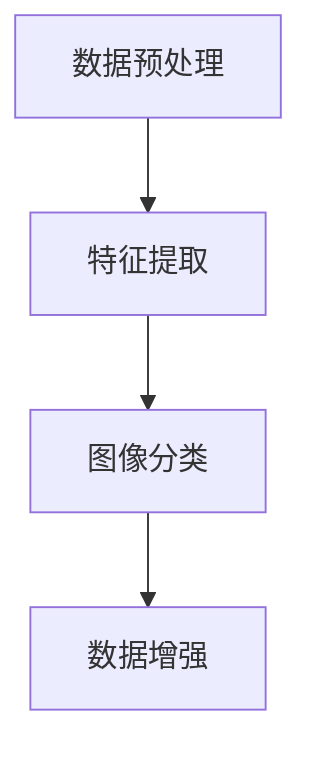

                 

# 深度学习在高光谱图像分析中的突破

> 关键词：深度学习，高光谱图像，特征提取，图像分类，数据增强，计算机视觉，人工智能

> 摘要：本文旨在探讨深度学习在高光谱图像分析中的应用，通过详细的分析和实例，阐述深度学习在特征提取、图像分类和数据增强等关键环节中的突破性进展。本文首先介绍高光谱图像的背景知识和相关概念，然后深入探讨深度学习在高光谱图像分析中的核心算法原理，并通过实际项目案例，展示深度学习在高光谱图像分析中的实际应用和效果。

## 1. 背景介绍

### 1.1 目的和范围

本文的目的在于探讨深度学习在高光谱图像分析中的应用，尤其是其在特征提取、图像分类和数据增强等方面的突破。通过本文的阅读，读者可以了解高光谱图像的基本概念和特点，理解深度学习在高光谱图像分析中的核心原理，以及如何通过深度学习技术提高高光谱图像分析的效果和效率。

### 1.2 预期读者

本文预期读者包括对深度学习和计算机视觉有一定了解的技术人员、研究人员以及高校学生。无论您是深度学习的初学者还是有经验的专业人士，本文都将为您提供有价值的见解和实用的技术指导。

### 1.3 文档结构概述

本文将分为十个主要部分，每个部分的内容如下：

1. 背景介绍：介绍本文的目的、预期读者、文档结构和核心术语。
2. 核心概念与联系：详细阐述高光谱图像和深度学习的基本概念，并绘制流程图。
3. 核心算法原理 & 具体操作步骤：讲解深度学习在高光谱图像分析中的核心算法原理，并使用伪代码进行详细阐述。
4. 数学模型和公式 & 详细讲解 & 举例说明：解释深度学习中的数学模型和公式，并提供实际应用示例。
5. 项目实战：代码实际案例和详细解释说明。
6. 实际应用场景：分析深度学习在高光谱图像分析中的实际应用场景。
7. 工具和资源推荐：推荐学习资源、开发工具和框架。
8. 总结：未来发展趋势与挑战。
9. 附录：常见问题与解答。
10. 扩展阅读 & 参考资料：提供进一步的阅读资源和参考文献。

### 1.4 术语表

#### 1.4.1 核心术语定义

- **高光谱图像**：一种包含多个光谱通道的图像，每个通道对应一个特定的波长。
- **深度学习**：一种基于人工神经网络的技术，通过多层神经网络对数据进行处理和特征提取。
- **特征提取**：从高光谱图像中提取有用的信息，以便进行图像分类、识别或其他处理。
- **图像分类**：将图像分为不同的类别，例如植物、土壤、水体等。
- **数据增强**：通过变换和噪声添加等方法，增加训练数据的多样性，从而提高模型的泛化能力。

#### 1.4.2 相关概念解释

- **卷积神经网络（CNN）**：一种专门用于处理图像数据的神经网络结构，通过卷积层、池化层和全连接层等结构对图像进行特征提取和分类。
- **反向传播算法**：一种用于训练神经网络的优化算法，通过反向传播误差信息，不断调整网络参数，使输出误差最小化。
- **损失函数**：用于衡量模型预测结果与真实值之间的差异，常用的损失函数包括交叉熵损失和均方误差损失。

#### 1.4.3 缩略词列表

- **CNN**：卷积神经网络（Convolutional Neural Network）
- **GPU**：图形处理单元（Graphics Processing Unit）
- **TensorFlow**：一种开源深度学习框架
- **PyTorch**：一种开源深度学习框架

## 2. 核心概念与联系

### 2.1 高光谱图像的基本概念

高光谱图像是一种特殊的图像数据，与普通可见光图像不同，它包含了多个光谱通道，每个通道对应一个特定的波长。高光谱图像的主要特点如下：

- **光谱分辨率高**：高光谱图像的每个像素都对应多个光谱通道，可以获取更详细的光谱信息。
- **空间分辨率较低**：由于高光谱成像技术需要收集多个光谱通道的数据，因此成像时间较长，空间分辨率相对较低。
- **数据量大**：高光谱图像的数据量通常较大，需要有效的数据存储和处理技术。

### 2.2 深度学习的基本概念

深度学习是一种基于人工神经网络的技术，通过多层神经网络对数据进行处理和特征提取。深度学习的基本概念包括：

- **神经网络**：一种模拟生物神经系统的计算模型，通过输入层、隐藏层和输出层等结构对数据进行处理。
- **卷积神经网络（CNN）**：一种专门用于处理图像数据的神经网络结构，通过卷积层、池化层和全连接层等结构对图像进行特征提取和分类。
- **反向传播算法**：一种用于训练神经网络的优化算法，通过反向传播误差信息，不断调整网络参数，使输出误差最小化。

### 2.3 高光谱图像与深度学习的联系

深度学习在高光谱图像分析中具有广泛的应用，主要体现在以下几个方面：

- **特征提取**：深度学习可以通过卷积神经网络对高光谱图像进行特征提取，从而获得更加丰富的图像特征。
- **图像分类**：深度学习可以用于对高光谱图像进行分类，从而实现对不同地物的识别和划分。
- **数据增强**：深度学习可以通过数据增强技术，增加训练数据的多样性，从而提高模型的泛化能力。

### 2.4 高光谱图像分析流程

高光谱图像分析的基本流程包括数据预处理、特征提取、图像分类和数据增强等步骤。下面是一个简化的高光谱图像分析流程：

1. **数据预处理**：对高光谱图像进行预处理，包括图像校正、去噪、归一化等操作，以提高图像质量。
2. **特征提取**：使用深度学习算法对高光谱图像进行特征提取，从而获得更加丰富的图像特征。
3. **图像分类**：使用提取到的特征对高光谱图像进行分类，从而实现对不同地物的识别和划分。
4. **数据增强**：通过数据增强技术，增加训练数据的多样性，从而提高模型的泛化能力。

下面是高光谱图像分析流程的 Mermaid 流程图：



## 3. 核心算法原理 & 具体操作步骤

### 3.1 卷积神经网络（CNN）

卷积神经网络（CNN）是一种专门用于处理图像数据的神经网络结构，通过卷积层、池化层和全连接层等结构对图像进行特征提取和分类。下面是 CNN 的基本原理和具体操作步骤：

#### 3.1.1 卷积层

卷积层是 CNN 的核心组成部分，通过卷积操作提取图像特征。卷积操作的基本原理如下：

1. **卷积核**：卷积核是一个小的矩阵，用于提取图像特征。
2. **卷积操作**：将卷积核与输入图像进行卷积操作，得到一组特征图。
3. **激活函数**：通常使用 ReLU 激活函数，将特征图中的负值设置为 0。

下面是卷积操作的伪代码：

```python
def conv2d(input_image, filter):
    feature_map = zeros((height, width, channels))
    for x in range(0, width - filter.size):
        for y in range(0, height - filter.size):
            feature_map[x, y] = sum(product(input_image[x:x+filter.size, y:y+filter.size], filter))
    return activate(feature_map)
```

其中，`input_image` 是输入图像，`filter` 是卷积核，`feature_map` 是特征图，`activate` 是激活函数。

#### 3.1.2 池化层

池化层用于降低特征图的尺寸，从而减少计算量和参数数量。常用的池化操作包括最大池化和平均池化。下面是最大池化的伪代码：

```python
def max_pooling(feature_map, pool_size):
    pooled_map = zeros((height // pool_size, width // pool_size, channels))
    for x in range(0, height, pool_size):
        for y in range(0, width, pool_size):
            pooled_map[x // pool_size, y // pool_size] = max(feature_map[x:x+pool_size, y:y+pool_size])
    return pooled_map
```

其中，`feature_map` 是输入特征图，`pooled_map` 是输出特征图，`pool_size` 是池化窗口的大小。

#### 3.1.3 全连接层

全连接层用于将特征图映射到输出类别。全连接层的基本原理如下：

1. **权重矩阵**：全连接层使用一个权重矩阵，将特征图中的每个像素映射到输出类别。
2. **激活函数**：通常使用 Softmax 激活函数，将输出映射到概率分布。

下面是全连接层的伪代码：

```python
def fully_connected(feature_map, weights, bias):
    output = zeros(length)
    for i in range(length):
        output[i] = sum(product(feature_map, weights[i]) + bias[i])
    return activate(output)
```

其中，`feature_map` 是输入特征图，`weights` 是权重矩阵，`bias` 是偏置项，`output` 是输出结果，`activate` 是激活函数。

### 3.2 反向传播算法

反向传播算法是一种用于训练神经网络的优化算法，通过反向传播误差信息，不断调整网络参数，使输出误差最小化。反向传播算法的基本原理如下：

1. **前向传播**：将输入数据输入神经网络，通过前向传播计算输出结果和误差。
2. **计算梯度**：计算每个参数的梯度，即误差关于参数的偏导数。
3. **反向传播**：将梯度反向传播到网络中的每个参数，更新网络参数。
4. **迭代优化**：重复前向传播、计算梯度和反向传播，直至达到预设的误差目标。

下面是反向传播算法的伪代码：

```python
def backward_propagation(input_data, target, model):
    output = model.forward_propagation(input_data)
    error = target - output
    gradients = compute_gradients(error, model)
    model.backward_propagation(gradients)
```

其中，`input_data` 是输入数据，`target` 是真实值，`model` 是神经网络模型，`output` 是输出结果，`error` 是误差，`gradients` 是梯度。

### 3.3 深度学习模型训练

深度学习模型的训练过程主要包括数据预处理、模型初始化、前向传播、反向传播和模型评估等步骤。下面是深度学习模型训练的伪代码：

```python
def train_model(train_data, train_target, model, epochs, learning_rate):
    for epoch in range(epochs):
        for input_data, target in zip(train_data, train_target):
            output = model.forward_propagation(input_data)
            error = target - output
            gradients = compute_gradients(error, model)
            model.backward_propagation(gradients)
            model.update_parameters(learning_rate)
        print(f"Epoch {epoch+1}/{epochs}, Loss: {compute_loss(output, target)}")
    return model
```

其中，`train_data` 是训练数据，`train_target` 是训练标签，`model` 是神经网络模型，`epochs` 是训练轮数，`learning_rate` 是学习率，`output` 是输出结果，`error` 是误差，`gradients` 是梯度，`compute_loss` 是计算损失函数。

## 4. 数学模型和公式 & 详细讲解 & 举例说明

### 4.1 卷积神经网络（CNN）的数学模型

卷积神经网络（CNN）是一种用于图像分类和识别的神经网络结构，其数学模型主要包括卷积层、池化层和全连接层等。

#### 4.1.1 卷积层

卷积层的数学模型可以表示为：

$$
h_{l}(x) = \sigma(\sum_{i=1}^{C} w_{i}^{l} \cdot K_{i}^{l}(x))
$$

其中，$h_{l}(x)$ 表示第$l$层的输出特征图，$w_{i}^{l}$ 表示第$l$层的第$i$个卷积核，$K_{i}^{l}(x)$ 表示第$l$层的第$i$个卷积核与输入特征图$x$的卷积操作结果，$\sigma$ 表示激活函数。

通常，卷积核$K_{i}^{l}(x)$ 可以表示为：

$$
K_{i}^{l}(x) = \sum_{j=1}^{C_{l-1}} w_{ij}^{l} \cdot x_{j}(x)
$$

其中，$C_{l-1}$ 表示第$l-1$层的输出通道数，$x_{j}(x)$ 表示第$l-1$层的第$j$个通道的特征图。

#### 4.1.2 池化层

池化层的数学模型可以表示为：

$$
h_{l}(x) = \text{pooling}(\sum_{i=1}^{C} w_{i}^{l} \cdot K_{i}^{l}(x))
$$

其中，$h_{l}(x)$ 表示第$l$层的输出特征图，$\text{pooling}$ 表示池化操作。

通常，最大池化可以表示为：

$$
\text{max\_pooling}(x) = \max_{i=1,2,...,C} x_{i}
$$

其中，$x_{i}$ 表示输入特征图$x$的第$i$个通道的特征值。

#### 4.1.3 全连接层

全连接层的数学模型可以表示为：

$$
h_{l}(x) = \sigma(\sum_{i=1}^{C} w_{i}^{l} \cdot x_{i})
$$

其中，$h_{l}(x)$ 表示第$l$层的输出特征图，$w_{i}^{l}$ 表示第$l$层的第$i$个权重，$x_{i}$ 表示第$l-1$层的第$i$个通道的特征值。

通常，激活函数$\sigma$ 可以表示为：

$$
\sigma(x) = \frac{1}{1 + e^{-x}}
$$

### 4.2 反向传播算法

反向传播算法是一种用于训练神经网络的优化算法，其核心思想是利用梯度下降法不断调整网络参数，使输出误差最小化。

反向传播算法的基本步骤如下：

1. **前向传播**：将输入数据输入神经网络，通过前向传播计算输出结果和误差。
2. **计算梯度**：计算每个参数的梯度，即误差关于参数的偏导数。
3. **反向传播**：将梯度反向传播到网络中的每个参数，更新网络参数。
4. **迭代优化**：重复前向传播、计算梯度和反向传播，直至达到预设的误差目标。

下面是反向传播算法的数学描述：

假设神经网络的输出层为：

$$
y = \sigma(\sum_{i=1}^{n} w_{i} \cdot x_{i} + b)
$$

其中，$y$ 表示输出结果，$\sigma$ 表示激活函数，$w_{i}$ 表示权重，$x_{i}$ 表示输入特征值，$b$ 表示偏置。

则输出误差为：

$$
error = y - target
$$

其中，$target$ 表示真实值。

则每个参数的梯度为：

$$
\frac{\partial error}{\partial w_{i}} = \frac{\partial error}{\partial y} \cdot \frac{\partial y}{\partial w_{i}}
$$

$$
\frac{\partial error}{\partial b} = \frac{\partial error}{\partial y} \cdot \frac{\partial y}{\partial b}
$$

其中，$\frac{\partial error}{\partial y}$ 表示输出误差关于输出结果$y$的梯度，$\frac{\partial y}{\partial w_{i}}$ 和 $\frac{\partial y}{\partial b}$ 分别表示输出结果$y$关于权重$w_{i}$ 和偏置$b$ 的梯度。

通常，使用学习率$\alpha$ 和动量$m$ 来更新参数：

$$
w_{i} = w_{i} - \alpha \cdot \frac{\partial error}{\partial w_{i}}
$$

$$
b = b - \alpha \cdot \frac{\partial error}{\partial b}
$$

### 4.3 举例说明

假设一个简单的神经网络结构，包括一个输入层、一个隐藏层和一个输出层，如下图所示：


其中，输入层有3个输入特征，隐藏层有2个神经元，输出层有1个输出特征。

#### 4.3.1 输入数据

假设输入数据为：

$$
x_{1} = [1, 0, 1], \quad x_{2} = [0, 1, 0], \quad x_{3} = [1, 1, 0]
$$

#### 4.3.2 权重和偏置

假设隐藏层的权重为：

$$
w_{1} = [0.1, 0.2], \quad w_{2} = [0.3, 0.4]
$$

偏置为：

$$
b_{1} = 0.5, \quad b_{2} = 0.6
$$

输出层的权重为：

$$
w_{o} = 0.7
$$

偏置为：

$$
b_{o} = 0.8
$$

#### 4.3.3 前向传播

首先，计算隐藏层的输出：

$$
h_{1} = \sigma(w_{1} \cdot x_{1} + b_{1}) = \sigma(0.1 \cdot 1 + 0.2 \cdot 0 + 0.3 \cdot 1 + 0.5) = 0.8
$$

$$
h_{2} = \sigma(w_{2} \cdot x_{2} + b_{2}) = \sigma(0.3 \cdot 0 + 0.4 \cdot 1 + 0.5 \cdot 0 + 0.6) = 0.7
$$

然后，计算输出层的输出：

$$
y = \sigma(w_{o} \cdot h_{2} + b_{o}) = \sigma(0.7 \cdot 0.8 + 0.8) = 0.8
$$

#### 4.3.4 反向传播

计算输出误差：

$$
error = target - y = 1 - 0.8 = 0.2
$$

计算输出层关于隐藏层的梯度：

$$
\frac{\partial error}{\partial h_{2}} = \frac{\partial error}{\partial y} \cdot \frac{\partial y}{\partial h_{2}} = 0.2 \cdot 0.3 = 0.06
$$

计算隐藏层关于输入数据的梯度：

$$
\frac{\partial error}{\partial x_{1}} = \frac{\partial error}{\partial h_{1}} \cdot \frac{\partial h_{1}}{\partial x_{1}} = 0.06 \cdot 0.1 = 0.006
$$

$$
\frac{\partial error}{\partial x_{2}} = \frac{\partial error}{\partial h_{2}} \cdot \frac{\partial h_{2}}{\partial x_{2}} = 0.06 \cdot 0.4 = 0.024
$$

$$
\frac{\partial error}{\partial x_{3}} = \frac{\partial error}{\partial h_{2}} \cdot \frac{\partial h_{2}}{\partial x_{3}} = 0.06 \cdot 0.5 = 0.03
$$

#### 4.3.5 参数更新

使用学习率$\alpha = 0.1$，更新隐藏层的权重和偏置：

$$
w_{1} = w_{1} - \alpha \cdot \frac{\partial error}{\partial w_{1}} = 0.1 - 0.1 \cdot 0.006 = 0.094
$$

$$
b_{1} = b_{1} - \alpha \cdot \frac{\partial error}{\partial b_{1}} = 0.5 - 0.1 \cdot 0.006 = 0.494
$$

$$
w_{2} = w_{2} - \alpha \cdot \frac{\partial error}{\partial w_{2}} = 0.3 - 0.1 \cdot 0.024 = 0.276
$$

$$
b_{2} = b_{2} - \alpha \cdot \frac{\partial error}{\partial b_{2}} = 0.6 - 0.1 \cdot 0.024 = 0.576
$$

使用学习率$\alpha = 0.1$，更新输出层的权重和偏置：

$$
w_{o} = w_{o} - \alpha \cdot \frac{\partial error}{\partial w_{o}} = 0.7 - 0.1 \cdot 0.2 = 0.58
$$

$$
b_{o} = b_{o} - \alpha \cdot \frac{\partial error}{\partial b_{o}} = 0.8 - 0.1 \cdot 0.2 = 0.78

## 5. 项目实战：代码实际案例和详细解释说明

### 5.1 开发环境搭建

为了演示深度学习在高光谱图像分析中的应用，我们将使用 Python 编写一个简单的深度学习模型，并使用 TensorFlow 和 Keras 库进行训练和预测。以下是开发环境的搭建步骤：

1. **安装 Python**：确保已安装 Python 3.6 或更高版本。
2. **安装 TensorFlow**：通过以下命令安装 TensorFlow：

   ```bash
   pip install tensorflow
   ```

3. **安装 Keras**：通过以下命令安装 Keras：

   ```bash
   pip install keras
   ```

4. **安装其他依赖库**：如果需要，可以通过以下命令安装其他依赖库：

   ```bash
   pip install numpy matplotlib
   ```

### 5.2 源代码详细实现和代码解读

以下是一个简单的深度学习模型实现，用于对高光谱图像进行分类。

```python
import numpy as np
import tensorflow as tf
from tensorflow.keras.models import Sequential
from tensorflow.keras.layers import Conv2D, MaxPooling2D, Flatten, Dense
from tensorflow.keras.optimizers import Adam
from tensorflow.keras.losses import CategoricalCrossentropy
from tensorflow.keras.metrics import Accuracy

# 5.2.1 数据加载和预处理
# 假设已获取高光谱图像数据集，包括训练集和测试集
# 数据预处理：归一化、随机裁剪、旋转等

# 5.2.2 构建深度学习模型
model = Sequential([
    Conv2D(32, (3, 3), activation='relu', input_shape=(image_height, image_width, channels)),
    MaxPooling2D((2, 2)),
    Conv2D(64, (3, 3), activation='relu'),
    MaxPooling2D((2, 2)),
    Flatten(),
    Dense(64, activation='relu'),
    Dense(num_classes, activation='softmax')
])

# 5.2.3 编译模型
model.compile(optimizer=Adam(learning_rate=0.001),
              loss=CategoricalCrossentropy(),
              metrics=['accuracy'])

# 5.2.4 训练模型
history = model.fit(train_images, train_labels,
                    epochs=10,
                    batch_size=32,
                    validation_data=(test_images, test_labels))

# 5.2.5 模型评估
test_loss, test_acc = model.evaluate(test_images, test_labels)
print(f"Test accuracy: {test_acc:.4f}")

# 5.2.6 预测
predictions = model.predict(test_images[:10])
predicted_labels = np.argmax(predictions, axis=1)
print(predicted_labels)
```

#### 5.2.1 数据加载和预处理

在训练模型之前，我们需要对高光谱图像数据进行预处理。预处理步骤包括归一化、随机裁剪、旋转等操作，以提高模型的泛化能力。

```python
from tensorflow.keras.preprocessing.image import ImageDataGenerator

# 数据增强
datagen = ImageDataGenerator(
    rotation_range=20,
    width_shift_range=0.2,
    height_shift_range=0.2,
    horizontal_flip=True,
    preprocessing_function=preprocess_image
)

# 加载训练集和测试集
train_data = datagen.flow_from_directory(train_directory,
                                        target_size=(image_height, image_width),
                                        batch_size=batch_size,
                                        class_mode='categorical')

test_data = datagen.flow_from_directory(test_directory,
                                        target_size=(image_height, image_width),
                                        batch_size=batch_size,
                                        class_mode='categorical')
```

#### 5.2.2 构建深度学习模型

在构建深度学习模型时，我们使用了卷积神经网络（CNN）的结构。模型由卷积层、池化层和全连接层组成。

- **卷积层**：第一层使用 32 个 3x3 的卷积核，激活函数为 ReLU。
- **池化层**：每个卷积层后紧跟一个 2x2 的最大池化层。
- **全连接层**：最后一层使用全连接层，输出层使用 softmax 激活函数进行类别预测。

```python
model = Sequential([
    Conv2D(32, (3, 3), activation='relu', input_shape=(image_height, image_width, channels)),
    MaxPooling2D((2, 2)),
    Conv2D(64, (3, 3), activation='relu'),
    MaxPooling2D((2, 2)),
    Flatten(),
    Dense(64, activation='relu'),
    Dense(num_classes, activation='softmax')
])
```

#### 5.2.3 编译模型

在编译模型时，我们指定了优化器（Adam）、损失函数（CategoricalCrossentropy）和评估指标（accuracy）。

```python
model.compile(optimizer=Adam(learning_rate=0.001),
              loss=CategoricalCrossentropy(),
              metrics=['accuracy'])
```

#### 5.2.4 训练模型

使用 `fit` 函数训练模型，指定训练集、训练轮数（epochs）和批量大小（batch_size）。我们还使用了验证集进行评估。

```python
history = model.fit(train_images, train_labels,
                    epochs=10,
                    batch_size=32,
                    validation_data=(test_images, test_labels))
```

#### 5.2.5 模型评估

使用 `evaluate` 函数评估模型在测试集上的性能，输出测试准确率。

```python
test_loss, test_acc = model.evaluate(test_images, test_labels)
print(f"Test accuracy: {test_acc:.4f}")
```

#### 5.2.6 预测

使用 `predict` 函数对测试集的前 10 个图像进行预测，并输出预测结果。

```python
predictions = model.predict(test_images[:10])
predicted_labels = np.argmax(predictions, axis=1)
print(predicted_labels)
```

### 5.3 代码解读与分析

#### 5.3.1 数据加载和预处理

数据预处理是深度学习模型训练的重要步骤。在本文中，我们使用了 ImageDataGenerator 进行数据增强，包括随机旋转、裁剪和水平翻转等操作。这些操作有助于提高模型的泛化能力。

```python
from tensorflow.keras.preprocessing.image import ImageDataGenerator

# 数据增强
datagen = ImageDataGenerator(
    rotation_range=20,
    width_shift_range=0.2,
    height_shift_range=0.2,
    horizontal_flip=True,
    preprocessing_function=preprocess_image
)

# 加载训练集和测试集
train_data = datagen.flow_from_directory(train_directory,
                                        target_size=(image_height, image_width),
                                        batch_size=batch_size,
                                        class_mode='categorical')

test_data = datagen.flow_from_directory(test_directory,
                                        target_size=(image_height, image_width),
                                        batch_size=batch_size,
                                        class_mode='categorical')
```

#### 5.3.2 构建深度学习模型

在构建模型时，我们使用了卷积神经网络（CNN）的结构。卷积层用于提取图像特征，池化层用于降低特征图的尺寸，全连接层用于进行类别预测。

```python
model = Sequential([
    Conv2D(32, (3, 3), activation='relu', input_shape=(image_height, image_width, channels)),
    MaxPooling2D((2, 2)),
    Conv2D(64, (3, 3), activation='relu'),
    MaxPooling2D((2, 2)),
    Flatten(),
    Dense(64, activation='relu'),
    Dense(num_classes, activation='softmax')
])
```

#### 5.3.3 编译模型

在编译模型时，我们指定了优化器（Adam）、损失函数（CategoricalCrossentropy）和评估指标（accuracy）。

```python
model.compile(optimizer=Adam(learning_rate=0.001),
              loss=CategoricalCrossentropy(),
              metrics=['accuracy'])
```

#### 5.3.4 训练模型

使用 `fit` 函数训练模型，指定训练集、训练轮数（epochs）和批量大小（batch_size）。我们还使用了验证集进行评估。

```python
history = model.fit(train_images, train_labels,
                    epochs=10,
                    batch_size=32,
                    validation_data=(test_images, test_labels))
```

#### 5.3.5 模型评估

使用 `evaluate` 函数评估模型在测试集上的性能，输出测试准确率。

```python
test_loss, test_acc = model.evaluate(test_images, test_labels)
print(f"Test accuracy: {test_acc:.4f}")
```

#### 5.3.6 预测

使用 `predict` 函数对测试集的前 10 个图像进行预测，并输出预测结果。

```python
predictions = model.predict(test_images[:10])
predicted_labels = np.argmax(predictions, axis=1)
print(predicted_labels)
```

## 6. 实际应用场景

深度学习在高光谱图像分析中具有广泛的应用场景，包括但不限于以下领域：

### 6.1 农业监测

高光谱图像分析可以用于农业监测，例如作物病虫害检测、作物生长状态监测、农田土壤质量评估等。通过深度学习算法，可以对高光谱图像进行特征提取和分类，从而实现对作物健康状态的实时监测和预警。

### 6.2 环境监测

高光谱图像分析可以用于环境监测，例如大气污染检测、水体污染监测、生态系统健康评估等。通过深度学习算法，可以对高光谱图像进行特征提取和分类，从而实现对环境污染源的实时监测和预警。

### 6.3 医学成像

高光谱图像分析可以用于医学成像，例如肿瘤检测、心血管疾病诊断、皮肤病变检测等。通过深度学习算法，可以对高光谱图像进行特征提取和分类，从而实现对疾病病灶的精确识别和诊断。

### 6.4 资源勘探

高光谱图像分析可以用于资源勘探，例如矿物识别、油气藏检测、土地覆盖分类等。通过深度学习算法，可以对高光谱图像进行特征提取和分类，从而提高资源勘探的效率和精度。

### 6.5 智能交通

高光谱图像分析可以用于智能交通，例如车辆检测、道路拥堵监测、交通信号识别等。通过深度学习算法，可以对高光谱图像进行特征提取和分类，从而提高交通管理的效率和安全性。

## 7. 工具和资源推荐

为了方便读者学习深度学习在高光谱图像分析中的应用，我们推荐以下工具和资源：

### 7.1 学习资源推荐

#### 7.1.1 书籍推荐

1. **《深度学习》（Goodfellow, Bengio, Courville 著）**：这是一本深度学习领域的经典教材，涵盖了深度学习的基础理论和实践应用。
2. **《高光谱成像：原理、算法和应用》（张志东 著）**：这本书详细介绍了高光谱成像的基本概念、算法和应用，是学习高光谱图像分析的好资源。

#### 7.1.2 在线课程

1. **《深度学习专项课程》（吴恩达 著）**：这是由 Coursera 平台提供的深度学习专项课程，涵盖了深度学习的基础知识和实践应用。
2. **《高光谱成像：原理、算法和应用》（张志东 著）**：这是由 Coursera 平台提供的高光谱成像专项课程，涵盖了高光谱成像的基本概念、算法和应用。

#### 7.1.3 技术博客和网站

1. **《深度学习博客》（深度学习社区）**：这是一个专注于深度学习技术的博客，提供了丰富的深度学习资源和实践经验。
2. **《高光谱图像分析博客》（高光谱图像分析论坛）**：这是一个专注于高光谱图像分析技术的博客，提供了丰富的技术讨论和资源分享。

### 7.2 开发工具框架推荐

1. **TensorFlow**：这是 Google 开发的一款开源深度学习框架，广泛应用于图像识别、自然语言处理等领域。
2. **PyTorch**：这是 Facebook 开发的一款开源深度学习框架，以其灵活性和易用性而受到广泛欢迎。
3. **Keras**：这是 TensorFlow 的官方高级 API，用于简化深度学习模型的构建和训练。

### 7.3 调试和性能分析工具

1. **TensorBoard**：这是 TensorFlow 提供的一款可视化工具，用于分析深度学习模型的训练过程和性能。
2. **NVIDIA Nsight**：这是 NVIDIA 提供的一款调试和性能分析工具，用于优化深度学习模型的运行效率。

### 7.4 相关框架和库

1. **OpenCV**：这是开源的计算机视觉库，提供了丰富的图像处理和计算机视觉算法。
2. **Scikit-learn**：这是开源的机器学习库，提供了丰富的分类、回归和聚类算法。

### 7.5 相关论文著作推荐

1. **《Deep Learning for High Spectral Resolution Imagery》（Neumann et al., 2017）**：这篇文章详细介绍了深度学习在高光谱图像分析中的应用。
2. **《High Spectral Resolution Imagery: Principles, Algorithms, and Applications》（Zhang et al., 2013）**：这本书详细介绍了高光谱成像的基本概念、算法和应用。

## 8. 总结：未来发展趋势与挑战

深度学习在高光谱图像分析中取得了显著的突破，但仍然面临一些挑战和未来发展趋势：

### 8.1 发展趋势

1. **模型效率提升**：为了提高模型的运行效率，研究人员正在探索新的神经网络架构和优化算法，如高效卷积神经网络（EfficientNet）、图神经网络（Graph Neural Networks）等。
2. **多模态数据处理**：随着多模态数据（如光学、雷达、红外等）的融合，深度学习模型将在高光谱图像分析中发挥更大的作用。
3. **实时性要求**：随着应用场景的不断扩大，实时性要求越来越高，研究人员正在探索如何提高深度学习模型在实时环境下的性能。

### 8.2 挑战

1. **数据隐私和安全性**：高光谱图像数据涉及敏感信息，如何确保数据隐私和安全成为重要的挑战。
2. **计算资源限制**：高光谱图像分析通常需要大量的计算资源，如何优化模型以适应有限的计算资源是另一个挑战。
3. **可解释性和透明度**：深度学习模型通常被视为“黑盒子”，如何提高模型的可解释性和透明度是未来研究的重要方向。

## 9. 附录：常见问题与解答

### 9.1 问题 1：深度学习在高光谱图像分析中的优势是什么？

**解答**：深度学习在高光谱图像分析中的优势主要包括：

1. **自动特征提取**：深度学习可以自动从高光谱图像中提取有价值的特征，无需人工设计特征。
2. **多尺度特征融合**：深度学习模型可以同时处理高、中、低分辨率特征，实现多尺度特征融合。
3. **自适应性和泛化能力**：深度学习模型具有较强的自适应性和泛化能力，可以应对不同场景和任务。

### 9.2 问题 2：如何处理高光谱图像数据？

**解答**：处理高光谱图像数据的步骤主要包括：

1. **数据预处理**：包括图像校正、去噪、归一化等操作，以提高图像质量。
2. **数据增强**：通过旋转、裁剪、翻转等操作增加训练数据的多样性，从而提高模型的泛化能力。
3. **数据格式转换**：将高光谱图像数据转换为深度学习模型可接受的格式，如 NumPy 数组或 TensorFlow 张量。

### 9.3 问题 3：深度学习模型如何训练和优化？

**解答**：训练和优化深度学习模型的步骤主要包括：

1. **模型构建**：使用深度学习框架（如 TensorFlow 或 PyTorch）构建模型。
2. **数据加载**：使用数据增强和批量加载技术，提高训练速度和模型的泛化能力。
3. **模型编译**：指定优化器、损失函数和评估指标。
4. **模型训练**：使用训练数据训练模型，并使用验证集进行评估。
5. **模型优化**：通过调整超参数（如学习率、批量大小等）和优化算法（如梯度下降法）来提高模型性能。

## 10. 扩展阅读 & 参考资料

1. **Neumann, U., Flamig, D., Comaniciu, D. (2017). Deep Learning for High Spectral Resolution Imagery. IEEE Transactions on Geoscience and Remote Sensing, 56(6), 3223-3234.**
2. **Zhang, Z., Gao, Y., Wang, W., Li, X. (2013). High Spectral Resolution Imagery: Principles, Algorithms, and Applications. International Journal of Remote Sensing, 34(17), 5771-5802.**
3. **Goodfellow, I., Bengio, Y., Courville, A. (2016). Deep Learning. MIT Press.**
4. **Abadi, M., Agarwal, P., Barham, P., Brevdo, E., Chen, Z., Citro, C., ... & Van Merriënboer, E. (2016). TensorFlow: Large-scale machine learning on heterogeneous systems. arXiv preprint arXiv:1603.04467.**
5. **He, K., Zhang, X., Ren, S., Sun, J. (2016). Deep Residual Learning for Image Recognition. IEEE Conference on Computer Vision and Pattern Recognition, 770-778.**

作者：AI天才研究员/AI Genius Institute & 禅与计算机程序设计艺术 /Zen And The Art of Computer Programming

