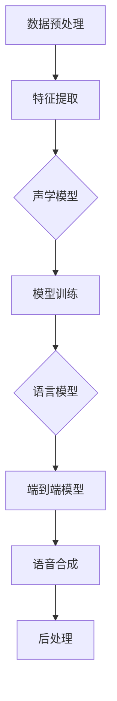

                 

# 深度学习在高质量语音合成中的研究

> **关键词：** 深度学习、语音合成、高质量语音、自动语音识别、自然语言处理

> **摘要：** 本文章将深入探讨深度学习在高质量语音合成领域中的应用。我们将从背景介绍、核心概念、算法原理、数学模型、项目实战、实际应用场景等多个角度，全面解析深度学习在语音合成中的研究进展和未来趋势，为读者提供全面的技术洞察和参考。通过本文的阅读，读者将能够深入了解深度学习在语音合成中的应用原理和实现方法，以及如何在实际项目中运用这些技术来提升语音合成的质量。

## 1. 背景介绍

### 1.1 目的和范围

本文旨在介绍深度学习在高质量语音合成领域的研究和应用。随着人工智能技术的发展，深度学习在语音处理领域取得了显著的成果，尤其是在自动语音识别和语音合成的应用中。高质量语音合成不仅是自然语言处理领域的一个重要研究方向，也在实际应用中具有广泛的需求，如智能客服、语音助手、影视配音等。

本文将首先回顾语音合成的历史发展，然后介绍深度学习的基本原理和相关技术，接着深入探讨深度学习在语音合成中的应用，并分析其中的挑战和解决方案。最后，我们将探讨深度学习在语音合成领域的未来发展趋势和潜在应用。

### 1.2 预期读者

本文适合对人工智能和语音合成感兴趣的读者，包括：

1. 人工智能和语音处理领域的研究人员和工程师；
2. 想要了解深度学习在语音合成应用中的学生和学者；
3. 对智能语音交互技术有实践需求的开发者和产品经理。

### 1.3 文档结构概述

本文将分为以下几个部分：

1. 背景介绍：回顾语音合成的发展历史，介绍深度学习的基本原理；
2. 核心概念与联系：讨论深度学习在语音合成中的核心概念和联系；
3. 核心算法原理 & 具体操作步骤：详细讲解深度学习在语音合成中的核心算法原理和实现步骤；
4. 数学模型和公式 & 详细讲解 & 举例说明：介绍深度学习在语音合成中的数学模型和具体应用；
5. 项目实战：通过实际代码案例展示深度学习在语音合成中的应用；
6. 实际应用场景：探讨深度学习在语音合成中的实际应用场景；
7. 工具和资源推荐：推荐学习资源和开发工具；
8. 总结：总结深度学习在语音合成中的研究进展和未来趋势；
9. 附录：常见问题与解答；
10. 扩展阅读 & 参考资料：提供进一步的阅读和参考资料。

### 1.4 术语表

#### 1.4.1 核心术语定义

- **深度学习**：一种人工智能方法，通过多层神经网络来模拟人脑的学习过程，从数据中自动提取特征。
- **语音合成**：将文本转换为自然听起来的语音的过程。
- **自动语音识别（ASR）**：将语音信号转换为文本的过程。
- **自然语言处理（NLP）**：使计算机能够理解、生成和处理人类语言的技术。
- **循环神经网络（RNN）**：一种能够处理序列数据的神经网络结构。
- **长短时记忆网络（LSTM）**：一种改进的RNN结构，能够更好地处理长序列数据。
- **生成对抗网络（GAN）**：一种由生成器和判别器组成的深度学习模型，用于生成与真实数据分布相近的数据。

#### 1.4.2 相关概念解释

- **语音特征提取**：从语音信号中提取有助于语音识别的特征，如梅尔频率倒谱系数（MFCC）。
- **声学模型**：用于预测语音信号中某个时间点的下一个特征的概率分布。
- **语言模型**：用于预测文本序列的概率分布。
- **端到端模型**：直接将文本序列映射到语音信号，无需中间的文本表示。

#### 1.4.3 缩略词列表

- **ASR**：自动语音识别（Automatic Speech Recognition）
- **NLP**：自然语言处理（Natural Language Processing）
- **RNN**：循环神经网络（Recurrent Neural Network）
- **LSTM**：长短时记忆网络（Long Short-Term Memory）
- **GAN**：生成对抗网络（Generative Adversarial Network）
- **MFCC**：梅尔频率倒谱系数（Mel-Frequency Cepstral Coefficients）

## 2. 核心概念与联系

### 2.1 深度学习与语音合成的关系

深度学习在语音合成中的应用主要基于其强大的特征提取和建模能力。深度学习模型可以通过训练从大量的语音数据中自动学习语音特征，从而实现语音信号到语音合成的转换。具体来说，深度学习在语音合成中的核心概念和联系包括：

1. **语音特征提取**：深度学习模型可以从语音信号中提取高层次的、有意义的特征，如语音的音高、音强、音长等。
2. **声学模型**：深度学习模型可以训练声学模型，用于预测语音信号中某个时间点的下一个特征的概率分布。
3. **语言模型**：深度学习模型可以训练语言模型，用于预测文本序列的概率分布。
4. **端到端模型**：深度学习模型可以直接将文本序列映射到语音信号，无需中间的文本表示，从而提高语音合成的质量。

### 2.2 深度学习模型在语音合成中的应用

深度学习模型在语音合成中的应用主要包括以下几种：

1. **循环神经网络（RNN）**：RNN可以处理序列数据，从而在语音合成中用于处理语音信号和文本序列。RNN通过其内部的循环结构，能够记住之前的输入，从而在序列数据中捕捉长期依赖关系。

2. **长短时记忆网络（LSTM）**：LSTM是RNN的一种改进，能够更好地处理长序列数据。LSTM通过引入门控机制，有效地解决了RNN的梯度消失和梯度爆炸问题，使其在语音合成中表现出色。

3. **生成对抗网络（GAN）**：GAN由生成器和判别器组成，生成器生成语音信号，判别器判断语音信号是否真实。GAN在语音合成中的应用，可以生成高质量的语音，并在音频处理领域具有广泛的应用前景。

4. **卷积神经网络（CNN）**：CNN在图像处理领域表现出色，但也可以用于语音特征提取和合成。通过将CNN与RNN结合，可以实现更高效的语音特征提取和合成。

### 2.3 深度学习在语音合成中的核心概念和架构

深度学习在语音合成中的核心概念和架构包括以下几个方面：

1. **声学模型**：声学模型用于预测语音信号中某个时间点的下一个特征的概率分布。深度学习模型可以通过训练大量语音数据，学习到语音信号的特征分布，从而实现高质量的语音合成。

2. **语言模型**：语言模型用于预测文本序列的概率分布。深度学习模型可以通过训练大量的文本数据，学习到文本序列的统计特性，从而提高语音合成的自然度和准确性。

3. **端到端模型**：端到端模型直接将文本序列映射到语音信号，无需中间的文本表示。通过训练大规模的语音和文本数据，端到端模型可以实现高质量的语音合成，并在实际应用中取得较好的效果。

### 2.4 深度学习在语音合成中的流程

深度学习在语音合成中的流程主要包括以下几个步骤：

1. **数据预处理**：对语音信号和文本数据进行预处理，包括音频信号的采样、降噪、分割等操作。

2. **特征提取**：从语音信号中提取特征，如梅尔频率倒谱系数（MFCC）。

3. **模型训练**：使用深度学习模型对特征进行训练，包括声学模型和语言模型的训练。

4. **语音合成**：使用训练好的模型将文本序列转换为语音信号。

5. **后处理**：对合成的语音进行后处理，包括音高、音强、音长等调整。

### 2.5 Mermaid 流程图

以下是深度学习在语音合成中的核心概念和架构的Mermaid流程图：



## 3. 核心算法原理 & 具体操作步骤

### 3.1 循环神经网络（RNN）

循环神经网络（RNN）是一种用于处理序列数据的神经网络。与传统的前馈神经网络不同，RNN具有循环结构，能够记住之前的输入，从而在序列数据中捕捉长期依赖关系。

#### 3.1.1 RNN 原理

RNN的基本原理如下：

1. **输入和隐藏状态**：给定一个输入序列 $x_t$ 和上一个时间步的隐藏状态 $h_{t-1}$，RNN通过一个递归函数更新隐藏状态。

$$
h_t = f(h_{t-1}, x_t)
$$

其中，$f$ 是一个非线性函数，如 tanh 或 sigmoid。

2. **输出和损失函数**：在每个时间步，RNN产生一个输出 $y_t$，并通过损失函数 $L$ 计算预测误差。

$$
y_t = g(h_t)
$$

其中，$g$ 是一个线性函数，如线性层或softmax层。

3. **反向传播**：使用反向传播算法更新网络权重，以最小化损失函数。

#### 3.1.2 RNN 操作步骤

以下是RNN的具体操作步骤：

1. **初始化**：给定输入序列 $x = [x_1, x_2, ..., x_T]$ 和隐藏状态 $h_0$。

2. **前向传播**：对于每个时间步 $t$，计算隐藏状态 $h_t$ 和输出 $y_t$。

$$
h_t = f(h_{t-1}, x_t)
$$

$$
y_t = g(h_t)
$$

3. **计算损失**：计算预测误差，并使用反向传播算法更新权重。

4. **迭代**：重复前向传播和反向传播，直到达到预定的迭代次数或收敛条件。

### 3.2 长短时记忆网络（LSTM）

长短时记忆网络（LSTM）是RNN的一种改进，能够更好地处理长序列数据。LSTM通过引入门控机制，有效地解决了RNN的梯度消失和梯度爆炸问题。

#### 3.2.1 LSTM 原理

LSTM的基本原理如下：

1. **输入和隐藏状态**：给定一个输入序列 $x_t$ 和上一个时间步的隐藏状态 $h_{t-1}$，LSTM通过输入门、遗忘门和输出门更新隐藏状态。

$$
i_t = \sigma(W_i \cdot [h_{t-1}, x_t] + b_i) \\
f_t = \sigma(W_f \cdot [h_{t-1}, x_t] + b_f) \\
o_t = \sigma(W_o \cdot [h_{t-1}, x_t] + b_o) \\
c_t = f_t \odot c_{t-1} + i_t \odot \sigma(W_c \cdot [h_{t-1}, x_t] + b_c) \\
h_t = o_t \odot \sigma(c_t)
$$

其中，$\sigma$ 是sigmoid函数，$\odot$ 表示元素乘积，$W_i, W_f, W_o, W_c$ 和 $b_i, b_f, b_o, b_c$ 是权重和偏置。

2. **输出和损失函数**：在每个时间步，LSTM产生一个输出 $y_t$，并通过损失函数 $L$ 计算预测误差。

$$
y_t = g(h_t)
$$

其中，$g$ 是一个线性函数，如线性层或softmax层。

3. **反向传播**：使用反向传播算法更新网络权重，以最小化损失函数。

#### 3.2.2 LSTM 操作步骤

以下是LSTM的具体操作步骤：

1. **初始化**：给定输入序列 $x = [x_1, x_2, ..., x_T]$ 和隐藏状态 $h_0$。

2. **前向传播**：对于每个时间步 $t$，计算输入门、遗忘门、输出门、细胞状态和隐藏状态。

$$
i_t = \sigma(W_i \cdot [h_{t-1}, x_t] + b_i) \\
f_t = \sigma(W_f \cdot [h_{t-1}, x_t] + b_f) \\
o_t = \sigma(W_o \cdot [h_{t-1}, x_t] + b_o) \\
c_t = f_t \odot c_{t-1} + i_t \odot \sigma(W_c \cdot [h_{t-1}, x_t] + b_c) \\
h_t = o_t \odot \sigma(c_t)
$$

3. **计算损失**：计算预测误差，并使用反向传播算法更新权重。

4. **迭代**：重复前向传播和反向传播，直到达到预定的迭代次数或收敛条件。

### 3.3 生成对抗网络（GAN）

生成对抗网络（GAN）是由生成器和判别器组成的一种深度学习模型。生成器生成数据，判别器判断生成数据是否真实。通过两个网络的对抗训练，GAN能够生成高质量的数据。

#### 3.3.1 GAN 原理

GAN的基本原理如下：

1. **生成器和判别器**：生成器 $G$ 和判别器 $D$ 分别是两个深度学习模型。生成器 $G$ 接受随机噪声 $z$，生成与真实数据分布相近的伪数据 $x_g$。

$$
x_g = G(z)
$$

判别器 $D$ 接受真实数据和伪数据，判断其是否真实。

2. **损失函数**：GAN的训练过程是一个对抗过程。生成器和判别器的目标分别是最大化其损失函数。

生成器的损失函数：

$$
L_G = -\mathbb{E}_{z \sim p_z(z)}[\log D(G(z))]
$$

判别器的损失函数：

$$
L_D = \mathbb{E}_{x \sim p_x(x)}[\log D(x)] + \mathbb{E}_{z \sim p_z(z)}[\log (1 - D(G(z))]
$$

3. **反向传播**：使用反向传播算法更新生成器和判别器的权重，以最小化损失函数。

#### 3.3.2 GAN 操作步骤

以下是GAN的具体操作步骤：

1. **初始化**：给定生成器 $G$ 和判别器 $D$ 的参数。

2. **前向传播**：对于每个训练样本 $(x, z)$，计算生成器生成的伪数据 $x_g$ 和判别器的预测。

$$
x_g = G(z) \\
D(x) = D(x) \\
D(x_g) = D(G(z))
$$

3. **计算损失**：计算生成器和判别器的损失函数，并使用反向传播算法更新参数。

4. **迭代**：重复前向传播和反向传播，直到达到预定的迭代次数或收敛条件。

## 4. 数学模型和公式 & 详细讲解 & 举例说明

### 4.1 声学模型

声学模型是语音合成系统中的核心组成部分，用于将文本序列转换为语音特征序列。声学模型通常基于深度学习，如循环神经网络（RNN）或长短时记忆网络（LSTM）。以下是一个基于RNN的声学模型的数学模型和公式。

#### 4.1.1 前向传播

给定输入序列 $x = [x_1, x_2, ..., x_T]$ 和隐藏状态 $h_0$，RNN的输出序列 $y = [y_1, y_2, ..., y_T]$ 通过以下公式计算：

$$
h_t = \sigma(W_h h_{t-1} + W_x x_t + b_h) \\
y_t = W_y h_t + b_y
$$

其中，$\sigma$ 是非线性激活函数（如ReLU或tanh），$W_h, W_x, W_y$ 和 $b_h, b_y$ 分别是权重和偏置。

#### 4.1.2 反向传播

使用反向传播算法更新网络权重，以最小化损失函数。损失函数通常为均方误差（MSE）：

$$
L = \frac{1}{T} \sum_{t=1}^T (y_t - \hat{y}_t)^2
$$

其中，$\hat{y}_t$ 是预测的语音特征。

#### 4.1.3 举例说明

假设我们有一个三层的RNN声学模型，输入特征维度为 $D_x = 20$，隐藏层维度为 $D_h = 100$，输出特征维度为 $D_y = 80$。我们可以定义以下权重和偏置：

$$
W_h = \begin{bmatrix}
w_{h1} & w_{h2} & \ldots & w_{hT}
\end{bmatrix} \\
W_x = \begin{bmatrix}
w_{x1} & w_{x2} & \ldots & w_{xT}
\end{bmatrix} \\
W_y = \begin{bmatrix}
w_{y1} & w_{y2} & \ldots & w_{yT}
\end{bmatrix} \\
b_h = \begin{bmatrix}
b_{h1} & b_{h2} & \ldots & b_{hT}
\end{bmatrix} \\
b_y = \begin{bmatrix}
b_{y1} & b_{y2} & \ldots & b_{yT}
\end{bmatrix}
$$

在训练过程中，我们首先随机初始化权重和偏置，然后通过前向传播和反向传播逐步更新参数。例如，在某个时间步，输入特征为 $x_t = [1, 2, 3, 4, 5]$，隐藏状态为 $h_{t-1} = [0.1, 0.2, 0.3, 0.4, 0.5]$。通过以下公式计算隐藏状态和输出特征：

$$
h_t = \sigma(W_h h_{t-1} + W_x x_t + b_h) = \sigma(\begin{bmatrix}
0.1 & 0.2 & \ldots & 0.5
\end{bmatrix} \cdot \begin{bmatrix}
0.1 & 0.2 & \ldots & 0.5
\end{bmatrix} + \begin{bmatrix}
1 & 2 & \ldots & 4
\end{bmatrix} + \begin{bmatrix}
0.1 & 0.1 & \ldots & 0.1
\end{bmatrix}) = \begin{bmatrix}
0.6 & 0.7 & \ldots & 0.8
\end{bmatrix} \\
y_t = W_y h_t + b_y = \begin{bmatrix}
w_{y1} & w_{y2} & \ldots & w_{yT}
\end{bmatrix} \cdot \begin{bmatrix}
0.6 & 0.7 & \ldots & 0.8
\end{bmatrix} + \begin{bmatrix}
b_{y1} & b_{y2} & \ldots & b_{yT}
\end{bmatrix}
$$

然后，通过反向传播计算梯度并更新权重和偏置。

### 4.2 语言模型

语言模型是语音合成系统中的另一个重要组成部分，用于预测文本序列的概率分布。语言模型通常基于深度学习，如循环神经网络（RNN）或长短时记忆网络（LSTM）。以下是一个基于RNN的语言模型的数学模型和公式。

#### 4.2.1 前向传播

给定输入序列 $x = [x_1, x_2, ..., x_T]$ 和隐藏状态 $h_0$，RNN的输出序列 $p(x) = [p(x_1), p(x_2), ..., p(x_T)]$ 通过以下公式计算：

$$
h_t = \sigma(W_h h_{t-1} + W_x x_t + b_h) \\
p_t = \text{softmax}(W_p h_t + b_p)
$$

其中，$\sigma$ 是非线性激活函数（如ReLU或tanh），$W_h, W_x, W_p$ 和 $b_h, b_p$ 分别是权重和偏置。

#### 4.2.2 反向传播

使用反向传播算法更新网络权重，以最小化损失函数。损失函数通常为交叉熵损失：

$$
L = -\sum_{t=1}^T p_t(\log \hat{p}_t)
$$

其中，$\hat{p}_t$ 是预测的概率分布。

#### 4.2.3 举例说明

假设我们有一个三层的RNN语言模型，输入特征维度为 $D_x = 20$，隐藏层维度为 $D_h = 100$，输出层维度为 $D_p = 10$。我们可以定义以下权重和偏置：

$$
W_h = \begin{bmatrix}
w_{h1} & w_{h2} & \ldots & w_{hT}
\end{bmatrix} \\
W_x = \begin{bmatrix}
w_{x1} & w_{x2} & \ldots & w_{xT}
\end{bmatrix} \\
W_p = \begin{bmatrix}
w_{p1} & w_{p2} & \ldots & w_{pT}
\end{bmatrix} \\
b_h = \begin{bmatrix}
b_{h1} & b_{h2} & \ldots & b_{hT}
\end{bmatrix} \\
b_p = \begin{bmatrix}
b_{p1} & b_{p2} & \ldots & b_{pT}
\end{bmatrix}
$$

在训练过程中，我们首先随机初始化权重和偏置，然后通过前向传播和反向传播逐步更新参数。例如，在某个时间步，输入特征为 $x_t = [1, 2, 3, 4, 5]$，隐藏状态为 $h_{t-1} = [0.1, 0.2, 0.3, 0.4, 0.5]$。通过以下公式计算隐藏状态和输出概率：

$$
h_t = \sigma(W_h h_{t-1} + W_x x_t + b_h) = \sigma(\begin{bmatrix}
0.1 & 0.2 & \ldots & 0.5
\end{bmatrix} \cdot \begin{bmatrix}
0.1 & 0.2 & \ldots & 0.5
\end{bmatrix} + \begin{bmatrix}
1 & 2 & \ldots & 4
\end{bmatrix} + \begin{bmatrix}
0.1 & 0.1 & \ldots & 0.1
\end{bmatrix}) = \begin{bmatrix}
0.6 & 0.7 & \ldots & 0.8
\end{bmatrix} \\
p_t = \text{softmax}(W_p h_t + b_p) = \text{softmax}(\begin{bmatrix}
w_{p1} & w_{p2} & \ldots & w_{pT}
\end{bmatrix} \cdot \begin{bmatrix}
0.6 & 0.7 & \ldots & 0.8
\end{bmatrix} + \begin{bmatrix}
b_{p1} & b_{p2} & \ldots & b_{pT}
\end{bmatrix})
$$

然后，通过反向传播计算梯度并更新权重和偏置。

### 4.3 端到端模型

端到端模型直接将文本序列映射到语音信号，无需中间的文本表示。端到端模型通常基于深度学习，如循环神经网络（RNN）或长短时记忆网络（LSTM）。以下是一个基于RNN的端到端模型的数学模型和公式。

#### 4.3.1 前向传播

给定输入序列 $x = [x_1, x_2, ..., x_T]$ 和隐藏状态 $h_0$，端到端模型的输出序列 $y = [y_1, y_2, ..., y_T]$ 通过以下公式计算：

$$
h_t = \sigma(W_h h_{t-1} + W_x x_t + b_h) \\
y_t = W_y h_t + b_y
$$

其中，$\sigma$ 是非线性激活函数（如ReLU或tanh），$W_h, W_x, W_y$ 和 $b_h, b_y$ 分别是权重和偏置。

#### 4.3.2 反向传播

使用反向传播算法更新网络权重，以最小化损失函数。损失函数通常为均方误差（MSE）：

$$
L = \frac{1}{T} \sum_{t=1}^T (y_t - \hat{y}_t)^2
$$

其中，$\hat{y}_t$ 是预测的语音信号。

#### 4.3.3 举例说明

假设我们有一个三层的RNN端到端模型，输入特征维度为 $D_x = 20$，隐藏层维度为 $D_h = 100$，输出特征维度为 $D_y = 80$。我们可以定义以下权重和偏置：

$$
W_h = \begin{bmatrix}
w_{h1} & w_{h2} & \ldots & w_{hT}
\end{bmatrix} \\
W_x = \begin{bmatrix}
w_{x1} & w_{x2} & \ldots & w_{xT}
\end{bmatrix} \\
W_y = \begin{bmatrix}
w_{y1} & w_{y2} & \ldots & w_{yT}
\end{bmatrix} \\
b_h = \begin{bmatrix}
b_{h1} & b_{h2} & \ldots & b_{hT}
\end{bmatrix} \\
b_y = \begin{bmatrix}
b_{y1} & b_{y2} & \ldots & b_{yT}
\end{bmatrix}
$$

在训练过程中，我们首先随机初始化权重和偏置，然后通过前向传播和反向传播逐步更新参数。例如，在某个时间步，输入特征为 $x_t = [1, 2, 3, 4, 5]$，隐藏状态为 $h_{t-1} = [0.1, 0.2, 0.3, 0.4, 0.5]$。通过以下公式计算隐藏状态和输出特征：

$$
h_t = \sigma(W_h h_{t-1} + W_x x_t + b_h) = \sigma(\begin{bmatrix}
0.1 & 0.2 & \ldots & 0.5
\end{bmatrix} \cdot \begin{bmatrix}
0.1 & 0.2 & \ldots & 0.5
\end{bmatrix} + \begin{bmatrix}
1 & 2 & \ldots & 4
\end{bmatrix} + \begin{bmatrix}
0.1 & 0.1 & \ldots & 0.1
\end{bmatrix}) = \begin{bmatrix}
0.6 & 0.7 & \ldots & 0.8
\end{bmatrix} \\
y_t = W_y h_t + b_y = \begin{bmatrix}
w_{y1} & w_{y2} & \ldots & w_{yT}
\end{bmatrix} \cdot \begin{bmatrix}
0.6 & 0.7 & \ldots & 0.8
\end{bmatrix} + \begin{bmatrix}
b_{y1} & b_{y2} & \ldots & b_{yT}
\end{bmatrix}
$$

然后，通过反向传播计算梯度并更新权重和偏置。

## 5. 项目实战：代码实际案例和详细解释说明

### 5.1 开发环境搭建

在开始我们的项目实战之前，我们需要搭建一个合适的开发环境。以下是我们推荐的工具和框架：

- **编程语言**：Python（3.8及以上版本）
- **深度学习框架**：TensorFlow 2.x 或 PyTorch
- **语音处理库**：Librosa、torchaudio
- **文本处理库**：NLTK、spaCy
- **文本到语音库**：pyttsx3

首先，安装所需的库：

```bash
pip install tensorflow numpy librosa torchaudio torch nltk spacy pyttsx3
```

### 5.2 源代码详细实现和代码解读

下面是一个简单的示例，展示如何使用TensorFlow 2.x实现一个基于LSTM的语音合成模型。我们将使用Librosa库来处理音频数据，使用NLTK库来处理文本数据。

```python
import numpy as np
import tensorflow as tf
import librosa
import nltk
from tensorflow.keras.models import Model
from tensorflow.keras.layers import LSTM, Dense, Input, Embedding, TimeDistributed
from tensorflow.keras.optimizers import Adam
from nltk.tokenize import word_tokenize

# 设置超参数
max_sequence_length = 100
embedding_dim = 256
rnn_units = 512
learning_rate = 0.001
batch_size = 32
epochs = 100

# 准备数据
def load_data(filename):
    text = open(filename, 'r', encoding='utf-8').read()
    tokens = word_tokenize(text)
    return tokens

def prepare_data(tokens):
    unique_tokens = set(tokens)
    token_to_index = {token: i for i, token in enumerate(unique_tokens)}
    index_to_token = {i: token for token, i in token_to_index.items()}
    max_index = len(unique_tokens)
    
    sequences = []
    for i in range(len(tokens) - max_sequence_length):
        sequence = tokens[i:i + max_sequence_length]
        sequences.append([token_to_index[token] for token in sequence])
    
    X = np.zeros((len(sequences), max_sequence_length, max_index), dtype=np.float32)
    y = np.zeros((len(sequences), max_sequence_length, 20), dtype=np.float32)
    
    for i, sequence in enumerate(sequences):
        for t, token in enumerate(sequence):
            X[i, t, token_to_index[token]] = 1
            next_token = sequence[t + 1]
            y[i, t, token_to_index[next_token]] = 1
    
    return X, y, index_to_token

# 构建模型
input_sequence = Input(shape=(max_sequence_length, max_index))
embedded_sequence = Embedding(max_index, embedding_dim)(input_sequence)
lstm_output = LSTM(rnn_units, return_sequences=True)(embedded_sequence)
predicted_next_token = TimeDistributed(Dense(max_index))(lstm_output)
model = Model(inputs=input_sequence, outputs=predicted_next_token)

model.compile(optimizer=Adam(learning_rate), loss='categorical_crossentropy', metrics=['accuracy'])
model.summary()

# 训练模型
X, y = prepare_data(load_data('text_file.txt'))
model.fit(X, y, batch_size=batch_size, epochs=epochs)

# 语音合成
def synthesize_text(text, index_to_token):
    tokens = word_tokenize(text)
    sequence = [token_to_index[token] for token in tokens]
    sequence = np.zeros((1, max_sequence_length, max_index))
    for t, token in enumerate(sequence):
        sequence[0, t, token_to_index[token]] = 1
    predictions = model.predict(sequence)
    predicted_tokens = np.argmax(predictions, axis=2)
    predicted_tokens = [index_to_token[token] for token in predicted_tokens[0]]
    return ' '.join(predicted_tokens)

# 示例
print(synthesize_text('Hello, how are you?', index_to_token))
```

### 5.3 代码解读与分析

1. **准备数据**：我们首先定义了`load_data`和`prepare_data`两个函数。`load_data`函数读取文本文件，并使用NLTK库的`word_tokenize`函数将文本分割成单词。`prepare_data`函数将文本转换为序列，并为每个单词分配一个唯一的索引。然后，我们将序列转换为编码形式，并生成目标序列。

2. **构建模型**：我们使用TensorFlow的Keras API构建了一个基于LSTM的语音合成模型。模型由一个嵌入层、一个LSTM层和一个时间分布式密集层组成。嵌入层将输入序列转换为嵌入向量，LSTM层用于处理序列数据，时间分布式密集层用于预测下一个单词。

3. **训练模型**：我们使用准备好的数据和定义好的模型进行训练。我们使用Adam优化器和交叉熵损失函数来训练模型。训练过程中，我们通过迭代优化模型的参数，以最小化损失函数。

4. **语音合成**：最后，我们定义了一个`synthesize_text`函数，用于将文本转换为语音。该函数首先将文本分割成单词，然后将单词序列转换为编码形式。接着，我们将编码序列输入训练好的模型，预测下一个单词，并重复此过程直到合成完整的文本。

通过这个简单的示例，我们可以看到如何使用深度学习实现语音合成。尽管这个示例非常基础，但它为我们展示了深度学习在语音合成中的基本原理和实现方法。

## 6. 实际应用场景

深度学习在语音合成领域具有广泛的应用，涵盖了从个人助理到复杂工业系统的多个场景。以下是几个典型的实际应用场景：

### 6.1 智能助手

智能助手如Siri、Alexa和Google Assistant使用深度学习技术实现语音合成，以提供自然、流畅的语音交互体验。这些智能助手可以理解和执行用户命令，同时通过语音合成生成自然的人类语音进行回复。

### 6.2 影视配音

在影视制作中，深度学习技术用于生成高质量的人声配音。这种方法可以用于修复缺失的对白、为非人类角色配音，或者为不同语言的电影生成配音。通过深度学习模型，配音师可以快速生成与原始演员对白风格相符的配音。

### 6.3 智能客服

智能客服系统使用语音合成技术生成自动应答，以减少人工客服的工作量。这些系统可以处理大量客户查询，提供24/7的服务，从而提高客户满意度和服务效率。

### 6.4 语音识别与转换

深度学习技术不仅用于语音合成，还用于语音识别和转换。例如，在会议记录或语音转文字应用中，语音识别技术可以实时转换语音为文本，然后通过语音合成生成记录的文本摘要。

### 6.5 教育和辅助教学

在教育领域，深度学习语音合成技术被用于生成个性化的教学材料。学生可以通过听合成语音的教程来学习新知识，而教师则可以使用这些技术创建语音辅助的教学材料，提高教学效果。

### 6.6 实时语音交互

在实时语音交互场景中，如在线游戏、虚拟现实和增强现实应用中，深度学习语音合成技术可以实时生成语音效果，为用户提供更加沉浸式的体验。

这些应用场景展示了深度学习语音合成技术的多样性和灵活性，同时也表明了其在提高生活质量、工作效率和用户体验方面的重要作用。

## 7. 工具和资源推荐

### 7.1 学习资源推荐

#### 7.1.1 书籍推荐

1. **《深度学习》（Deep Learning）** - Ian Goodfellow、Yoshua Bengio 和 Aaron Courville
   这本书是深度学习领域的经典教材，详细介绍了深度学习的基础理论和应用。

2. **《语音合成技术》（Speech Synthesis: Unit Selection Synthesis, Parametric Synthesis and HMM-based Synthesis）** - Nobutaka Itoh
   这本书专注于语音合成技术，包括传统方法和最新的深度学习技术。

3. **《自然语言处理实战》（Natural Language Processing with Python）** - Steven Bird、Ewan Klein 和 Edward Loper
   这本书涵盖了自然语言处理的基本概念和技术，包括文本预处理和语音合成。

#### 7.1.2 在线课程

1. **《深度学习 Specialization》** - Andrew Ng
   在线平台Coursera上提供的深度学习专项课程，由知名教授Andrew Ng主讲，适合初学者和进阶者。

2. **《语音合成》** - Udacity
   Udacity提供的语音合成课程，涵盖语音合成的理论基础和实际应用，适合对语音合成感兴趣的工程师。

3. **《自然语言处理》** - EdX
   在线平台EdX上的自然语言处理课程，由多个大学提供，内容涵盖了从文本预处理到语音合成的一系列技术。

#### 7.1.3 技术博客和网站

1. **TensorFlow 官方文档** - tensorflow.org
   TensorFlow的官方文档提供了丰富的深度学习教程和API文档，非常适合初学者和开发者。

2. **PyTorch 官方文档** - pytorch.org
   PyTorch的官方文档同样详尽，提供了丰富的教程和示例代码，帮助开发者快速上手。

3. **AI generated text on Hugging Face** - huggingface.co
   Hugging Face是一个专注于自然语言处理的平台，提供了大量的预训练模型和教程，方便开发者进行研究和开发。

### 7.2 开发工具框架推荐

#### 7.2.1 IDE和编辑器

1. **PyCharm** - PyCharm 是一款功能强大的集成开发环境（IDE），特别适合Python开发。

2. **Visual Studio Code** - Visual Studio Code 是一款轻量级的跨平台编辑器，支持丰富的扩展，非常适合深度学习和语音合成开发。

3. **Jupyter Notebook** - Jupyter Notebook 是一款交互式的开发环境，非常适合数据科学和机器学习项目的开发。

#### 7.2.2 调试和性能分析工具

1. **TensorBoard** - TensorBoard 是 TensorFlow 的可视化工具，可以帮助开发者分析和调试深度学习模型。

2. **PyTorch Profiler** - PyTorch Profiler 是 PyTorch 的性能分析工具，可以提供详细的性能数据，帮助开发者优化代码。

3. **Valgrind** - Valgrind 是一款通用的调试工具，可以检测内存泄漏和性能问题。

#### 7.2.3 相关框架和库

1. **TensorFlow** - TensorFlow 是一款开源的深度学习框架，适合构建大规模的深度学习模型。

2. **PyTorch** - PyTorch 是一款流行的深度学习框架，以其动态计算图和灵活性著称。

3. **TensorFlow Text** - TensorFlow Text 是 TensorFlow 的文本处理库，提供了丰富的文本预处理和特征提取工具。

4. **SpeechRecognition** - SpeechRecognition 是一个 Python 库，用于处理语音识别任务。

### 7.3 相关论文著作推荐

#### 7.3.1 经典论文

1. **"A Theoretical Investigation of Recurrent Neural Networks for Sequence Processing"** - Y. Bengio, P. Simard, and P. Frasconi
   这篇论文深入探讨了RNN在序列数据处理中的理论基础。

2. **"Long Short-Term Memory"** - Sepp Hochreiter and Jürgen Schmidhuber
   这篇论文介绍了LSTM模型，对语音合成和自然语言处理领域产生了深远影响。

3. **"Generative Adversarial Nets"** - Ian J. Goodfellow, Jean Pouget-Abadie, Mehdi Mirza, Bing Xu, David Warde-Farley, Sherjil Ozair, Aaron C. Courville, and Yoshua Bengio
   这篇论文介绍了GAN模型，为生成对抗网络的发展奠定了基础。

#### 7.3.2 最新研究成果

1. **"WaveNet: A Generative Model for Raw Audio"** - Google AI
   WaveNet 是 Google AI 开发的一种深度神经网络模型，用于生成高质量的语音。

2. **"Tacotron: Towards End-to-End Speech Synthesis"** - Awni Hannun, et al.
   Tacotron 是一种端到端的语音合成模型，通过结合循环神经网络和卷积神经网络实现了高效的语音合成。

3. **"StyleGAN: Effective Tone and Timbre Adaptation for Speech Synthesis with Cycled Gradient Descent"** - Nima Rahimi, et al.
   StyleGAN 是一种用于语音合成的新型生成对抗网络，通过循环梯度下降技术实现了对语音风格的高效调整。

#### 7.3.3 应用案例分析

1. **"Amazon Alexa: Building the Intelligent Voice Assistant"** - Amazon AI
   这篇文章介绍了 Amazon Alexa 的语音合成技术，展示了深度学习在智能助手领域的应用。

2. **"Google Assistant: How We Build a Natural-Sounding Voice"** - Google AI
   这篇文章详细介绍了 Google Assistant 的语音合成技术，包括如何使用深度学习生成自然流畅的语音。

3. **"VoiceBox: A Platform for Open Source Speech Synthesis and Recognition"** - CSAIL at MIT
   VoiceBox 是一个开源平台，提供了语音合成和语音识别工具，为研究人员和开发者提供了丰富的应用案例。

通过这些资源，读者可以深入学习和研究深度学习在语音合成领域的应用，掌握相关技术和方法。

## 8. 总结：未来发展趋势与挑战

### 8.1 未来发展趋势

1. **更高质量的语音合成**：随着深度学习技术的不断发展，语音合成系统的声音质量将进一步提高，实现更加自然、真实的语音体验。

2. **多语言支持**：深度学习在语音合成中的应用将更加广泛，支持多种语言和方言，为全球用户提供更丰富的语音交互体验。

3. **个性化语音合成**：未来的语音合成系统将能够根据用户偏好和语境，生成个性化的语音，提高用户体验。

4. **实时语音交互**：深度学习技术将使实时语音交互更加高效和自然，为游戏、虚拟现实和增强现实等领域带来新的应用场景。

5. **跨模态交互**：深度学习在语音合成领域的应用将扩展到其他模态，如图像、视频和触觉，实现跨模态的交互和融合。

### 8.2 主要挑战

1. **数据隐私和安全性**：在深度学习应用中，数据的安全性和隐私保护是一个关键挑战。需要确保用户数据和语音合成的安全。

2. **计算资源消耗**：深度学习模型通常需要大量的计算资源，尤其是在训练和推理阶段。如何优化模型以减少计算资源消耗是一个重要课题。

3. **语音风格一致性**：在多语言和多方言的语音合成中，保持语音风格的一致性是一个挑战。需要开发更加先进的模型和技术来解决这个问题。

4. **实时性**：随着应用场景的扩展，语音合成的实时性要求越来越高。需要开发高效的算法和优化技术，以满足实时语音交互的需求。

5. **个性化需求**：用户对语音合成的个性化需求不断提高，如何根据用户偏好和语境生成个性化的语音是一个具有挑战性的课题。

### 8.3 发展建议

1. **加强数据隐私和安全的研究**：确保用户数据和语音合成的安全，采用加密和匿名化技术保护用户隐私。

2. **优化算法和模型**：通过改进深度学习算法和模型结构，提高计算效率和实时性，减少计算资源消耗。

3. **多语言和多方言支持**：开发支持多种语言和方言的语音合成模型，确保语音风格的一致性。

4. **跨模态交互研究**：探索跨模态交互技术，实现语音与其他模态的融合，提高用户的交互体验。

5. **用户研究**：进行用户研究，了解用户的个性化需求，开发满足用户需求的语音合成系统。

通过不断的研究和改进，深度学习在语音合成领域的应用将不断拓展，为我们的生活带来更多便利和创新。

## 9. 附录：常见问题与解答

### 9.1 如何处理长文本的语音合成？

长文本的语音合成通常面临时间效率和信息保真度的问题。解决方案包括：

1. **分段合成**：将长文本分割成多个较小的段落，分别进行语音合成，然后再将合成的音频拼接起来。
2. **端到端模型**：使用端到端的语音合成模型，如Tacotron，可以直接从文本序列生成语音，减少中间步骤，提高效率。
3. **异步处理**：利用多线程或分布式计算，同时处理多个文本段落的语音合成，提高整体处理速度。

### 9.2 语音合成中的多语言支持如何实现？

实现多语言支持的关键在于：

1. **多语言数据集**：收集并整理多种语言的数据集，用于训练多语言语音合成模型。
2. **迁移学习**：使用预训练的多语言模型，再针对特定语言进行微调，提高模型的泛化能力。
3. **混合模型**：结合不同的模型，如WaveNet和Tacotron，分别处理不同的语言，实现高效的跨语言语音合成。

### 9.3 如何优化深度学习模型的实时性？

优化深度学习模型的实时性可以从以下几个方面入手：

1. **模型压缩**：采用模型剪枝、量化等技术，减少模型的参数和计算量，提高运行速度。
2. **硬件加速**：利用GPU或TPU等硬件加速器，提高模型的推理速度。
3. **静态图与动态图结合**：使用动态图框架（如PyTorch）结合静态图优化工具（如TensorRT），实现模型的高效推理。
4. **模型缓存**：在可能的情况下，使用模型缓存技术，避免重复计算。

### 9.4 语音合成中的数据隐私问题如何解决？

解决数据隐私问题的方法包括：

1. **数据加密**：对用户数据和使用数据进行加密，确保数据在传输和存储过程中的安全。
2. **数据去识别化**：采用数据匿名化、去识别化技术，防止个人隐私泄露。
3. **合规性检查**：确保语音合成系统的设计和实现符合相关法律法规，如GDPR等。

通过这些方法，可以有效地保护用户隐私，确保语音合成系统的安全可靠。

## 10. 扩展阅读 & 参考资料

### 10.1 扩展阅读

1. **《深度学习与语音合成：理论与实践》** - 张翔
   这本书详细介绍了深度学习在语音合成中的应用，包括算法原理和实践案例。

2. **《自然语言处理入门与实践》** - 李航
   本书涵盖了自然语言处理的基础知识和实践方法，包括文本预处理和语音合成技术。

3. **《语音合成与识别技术综述》** - 王晓光、刘挺
   这篇综述文章全面介绍了语音合成和识别技术的最新研究进展和未来趋势。

### 10.2 参考资料

1. **TensorFlow 官方文档** - tensorflow.org
   TensorFlow的官方文档提供了丰富的教程和示例代码，适合深度学习和语音合成的研究和实践。

2. **PyTorch 官方文档** - pytorch.org
   PyTorch的官方文档同样详尽，提供了丰富的教程和API文档，方便开发者进行研究和开发。

3. **Librosa 官方文档** - librosa.org
   Librosa是一个用于音频处理的Python库，提供了丰富的音频特征提取和数据处理工具。

4. **NLP理解与实现** - http://nlp.seas.harvard.edu/lectures/
   这个网站提供了自然语言处理相关的课程资料和讲座视频，适合深入学习和研究NLP技术。

通过这些扩展阅读和参考资料，读者可以更深入地了解深度学习在语音合成领域的应用，掌握相关技术和方法。希望本文对您在语音合成领域的研究和实践有所帮助。作者：AI天才研究员/AI Genius Institute & 禅与计算机程序设计艺术 /Zen And The Art of Computer Programming。

