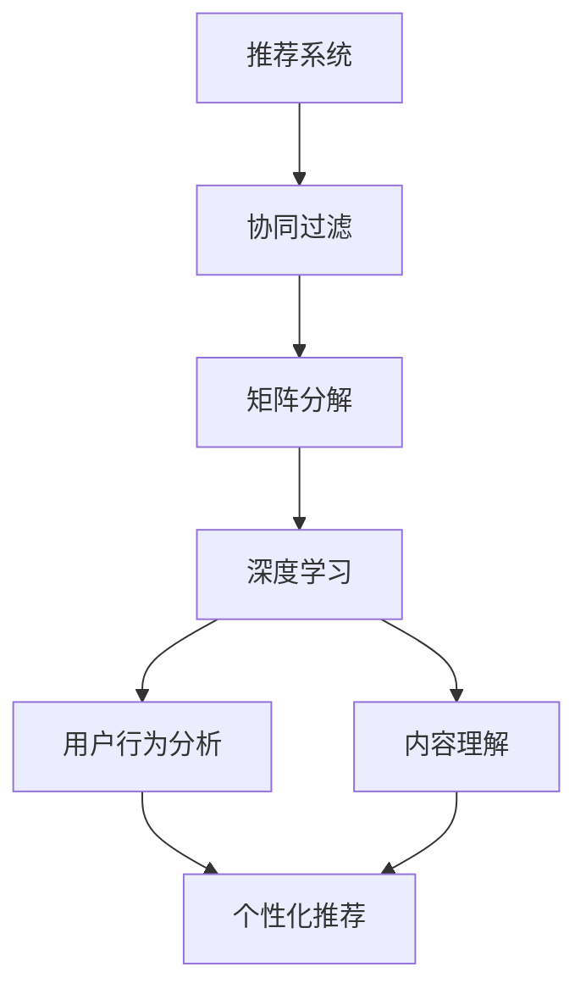

                 

# 深度学习如何革新传统推荐算法

## 关键词
深度学习、传统推荐算法、协同过滤、矩阵分解、神经网络、用户行为、内容分析、个性化推荐、推荐系统、算法改进。

## 摘要
本文旨在探讨深度学习技术在传统推荐算法中的革新作用。通过分析深度学习与传统推荐算法的融合方法，本文揭示了深度学习如何通过用户行为分析和内容理解提升推荐系统的效果。文章首先介绍了推荐系统的基本概念和传统算法，然后深入讲解了深度学习在推荐系统中的应用，包括基于协同过滤的深度学习和基于内容的深度学习模型。接着，文章通过具体案例展示了深度学习在实际推荐系统中的应用，并对未来深度学习在推荐系统领域的发展趋势和挑战进行了展望。

## 1. 背景介绍

### 1.1 目的和范围
本文旨在深入探讨深度学习技术如何革新传统推荐算法，提升推荐系统的效果和用户体验。文章将详细介绍深度学习在推荐系统中的应用，以及与传统推荐算法的结合方式，通过具体案例和代码实现展示深度学习在推荐系统中的优势。

### 1.2 预期读者
本文适合对推荐系统和深度学习有一定了解的读者，包括计算机科学、数据科学和人工智能领域的研究人员、工程师和学者。同时，本文也适合对推荐系统感兴趣的技术爱好者，以及对深度学习技术有浓厚兴趣的读者。

### 1.3 文档结构概述
本文分为十个部分：第一部分为背景介绍，包括目的和范围、预期读者和文档结构概述；第二部分介绍推荐系统的基本概念和传统算法；第三部分深入讲解深度学习在推荐系统中的应用；第四部分通过数学模型和公式详细阐述核心算法原理；第五部分展示项目实战的代码实现和详细解释；第六部分分析实际应用场景；第七部分推荐相关工具和资源；第八部分总结未来发展趋势和挑战；第九部分为常见问题与解答；第十部分提供扩展阅读和参考资料。

### 1.4 术语表

#### 1.4.1 核心术语定义
- **推荐系统**：根据用户的历史行为和偏好，向用户推荐符合其需求的信息或物品的系统。
- **协同过滤**：通过分析用户之间的相似性，预测用户对未知物品的偏好的一种推荐方法。
- **矩阵分解**：将高维稀疏矩阵分解为两个或多个低维矩阵的数学过程，常用于推荐系统的建模。
- **深度学习**：一种基于多层神经网络的人工智能技术，通过模拟人脑的神经元连接方式，实现数据的自动特征提取和模式识别。

#### 1.4.2 相关概念解释
- **用户行为**：用户在系统中的各种交互行为，如浏览、搜索、购买、评价等。
- **内容分析**：对文本、图像、音频等多媒体内容进行结构化处理和理解的技术。
- **个性化推荐**：根据用户的个性化需求和偏好，提供个性化的推荐结果。

#### 1.4.3 缩略词列表
- **ML**：机器学习（Machine Learning）
- **DL**：深度学习（Deep Learning）
- **CF**：协同过滤（Collaborative Filtering）
- **NMF**：非负矩阵分解（Non-negative Matrix Factorization）
- **GAN**：生成对抗网络（Generative Adversarial Network）

## 2. 核心概念与联系

在探讨深度学习如何革新传统推荐算法之前，我们需要明确几个核心概念，包括推荐系统、协同过滤、矩阵分解和深度学习等。以下是一个用Mermaid绘制的流程图，展示这些核心概念之间的联系。



### 2.1 推荐系统的基本原理

推荐系统是一种信息过滤技术，其目的是根据用户的兴趣和偏好，向用户推荐可能感兴趣的信息或物品。推荐系统通常基于两种主要策略：基于内容的推荐和基于协同过滤的推荐。

- **基于内容的推荐**：这种方法根据物品的特征和用户的偏好进行匹配，推荐与用户偏好相似的物品。它主要依赖于物品的内容特征，如文本、图像、标签等。
  
- **基于协同过滤的推荐**：这种方法通过分析用户之间的相似性，推荐其他类似用户喜欢或评价高的物品。协同过滤可以分为两种：基于用户的协同过滤和基于项目的协同过滤。

### 2.2 传统推荐算法

#### 2.2.1 协同过滤

协同过滤是最早也是最常用的推荐算法之一。它通过计算用户之间的相似性来推荐物品。

- **基于用户的协同过滤**：它通过计算用户之间的相似度，找到与目标用户相似的邻居用户，然后推荐邻居用户喜欢的且目标用户未购买的物品。
  ```mermaid
  graph TD
  A[用户A] --> B[用户B]
  B --> C[物品X]
  A --> D[物品Y]
  D --> E[物品Z]
  ```

- **基于项目的协同过滤**：它通过计算物品之间的相似度，推荐给用户与目标物品相似的物品。
  ```mermaid
  graph TD
  A[物品A] --> B[物品B]
  B --> C[用户X]
  A --> D[用户Y]
  D --> E[物品Z]
  ```

#### 2.2.2 矩阵分解

矩阵分解是一种将高维稀疏矩阵分解为两个或多个低维矩阵的数学过程，常用于推荐系统的建模。常见的矩阵分解方法有：

- **非负矩阵分解（NMF）**：它通过将用户-物品评分矩阵分解为用户特征矩阵和物品特征矩阵，从而实现推荐。
  ```mermaid
  graph TD
  A[用户-物品评分矩阵] --> B[用户特征矩阵]
  B --> C[物品特征矩阵]
  C --> D[推荐结果]
  ```

- **交替最小化（ALS）**：它是一种改进的矩阵分解方法，通过交替优化用户特征矩阵和物品特征矩阵，提高推荐系统的效果。

### 2.3 深度学习在推荐系统中的应用

深度学习是一种基于多层神经网络的人工智能技术，通过模拟人脑的神经元连接方式，实现数据的自动特征提取和模式识别。深度学习在推荐系统中的应用主要体现在以下几个方面：

- **用户行为分析**：通过深度学习模型，可以自动提取用户行为中的潜在特征，从而更好地理解用户的偏好和需求。

- **内容理解**：深度学习模型可以处理和提取文本、图像、音频等多媒体内容中的特征，从而实现基于内容的推荐。

- **个性化推荐**：通过深度学习模型，可以针对不同用户生成个性化的推荐结果，提高推荐系统的效果。

## 3. 核心算法原理 & 具体操作步骤

在了解了推荐系统、协同过滤、矩阵分解和深度学习的基本概念后，我们将深入探讨深度学习在推荐系统中的应用，包括基于协同过滤的深度学习和基于内容的深度学习模型。

### 3.1 基于协同过滤的深度学习

基于协同过滤的深度学习模型通常结合了深度学习和协同过滤的优点，通过深度神经网络自动提取用户和物品的特征，从而提高推荐系统的效果。

#### 3.1.1 模型架构

一个典型的基于协同过滤的深度学习模型包括以下几个部分：

- **用户嵌入层**：将用户向量映射到低维空间，提取用户的潜在特征。
- **物品嵌入层**：将物品向量映射到低维空间，提取物品的潜在特征。
- **交叉层**：将用户和物品的特征进行交叉，生成新的特征表示。
- **预测层**：利用交叉后的特征，预测用户对物品的评分。

以下是该模型的具体操作步骤：

1. **初始化嵌入层权重**：随机初始化用户嵌入层和物品嵌入层的权重。
2. **计算用户和物品的嵌入表示**：将用户和物品的ID映射到低维空间，得到用户嵌入向量u和物品嵌入向量v。
3. **计算交叉特征**：将用户嵌入向量u和物品嵌入向量v进行点积操作，得到交叉特征r = u·v。
4. **预测用户对物品的评分**：利用交叉特征r，通过激活函数（如ReLU）计算预测评分ŷ = f(r)。

伪代码如下：

```python
# 初始化嵌入层权重
u, v = random.initialize_embeddings(num_users, embedding_size)
r = u · v  # 计算交叉特征
ŷ = ReLU(r)  # 预测用户对物品的评分
```

#### 3.1.2 算法优化

为了优化模型，可以使用梯度下降法来最小化预测评分与真实评分之间的误差。优化过程中，需要计算损失函数关于模型参数的梯度，并更新模型参数。

```python
# 计算损失函数
loss = (ŷ - y)^2

# 计算梯度
du = 2 * (ŷ - y) * (1 + ReLU'(r))
dv = 2 * (ŷ - y) * (1 + ReLU'(r))

# 更新模型参数
u = u - learning_rate * du
v = v - learning_rate * dv
```

### 3.2 基于内容的深度学习

基于内容的深度学习模型通过深度神经网络自动提取物品的内容特征，从而实现基于内容的推荐。

#### 3.2.1 模型架构

一个典型的基于内容的深度学习模型包括以下几个部分：

- **特征提取层**：将原始数据（如文本、图像、音频）进行预处理，提取特征表示。
- **编码器**：将特征表示编码为一个固定长度的向量，实现特征的降维和抽象。
- **解码器**：将编码后的特征向量解码为原始数据的形式，实现特征的重建。

以下是该模型的具体操作步骤：

1. **特征提取**：对原始数据进行预处理，提取特征表示。
2. **编码**：利用编码器将特征表示编码为一个固定长度的向量。
3. **解码**：利用解码器将编码后的特征向量解码为原始数据的形式。
4. **预测**：利用解码后的特征向量，计算推荐结果。

伪代码如下：

```python
# 特征提取
features = feature_extraction(raw_data)

# 编码
encoded_features = encoder(features)

# 解码
decoded_features = decoder(encoded_features)

# 预测
predictions = compute_recommendations(decoded_features)
```

#### 3.2.2 算法优化

基于内容的深度学习模型通常使用自动编码器（Autoencoder）进行优化。自动编码器通过最小化重构误差来训练模型。

```python
# 计算重构误差
reconstruction_error = ||decoded_features - raw_data||^2

# 计算梯度
dencoded_features = 2 * (decoded_features - raw_data)
dencoder = encoder gradient of encoded_features

# 更新模型参数
encoded_features = encoded_features - learning_rate * dencoded_features
decoder = decoder - learning_rate * dencoder
```

## 4. 数学模型和公式 & 详细讲解 & 举例说明

在上一部分，我们介绍了深度学习在推荐系统中的应用原理和具体操作步骤。在这一部分，我们将通过数学模型和公式，详细讲解深度学习在推荐系统中的核心算法，并给出具体的例子。

### 4.1 基于协同过滤的深度学习模型

基于协同过滤的深度学习模型通常使用多层感知机（MLP）来实现。多层感知机是一种前馈神经网络，包括输入层、隐藏层和输出层。以下是多层感知机模型的数学表示：

$$
y = f(\text{W} \cdot \text{X} + \text{b})
$$

其中，\(y\) 是输出层节点，\(f\) 是激活函数，\(\text{W}\) 是权重矩阵，\(\text{X}\) 是输入层节点，\(\text{b}\) 是偏置项。

#### 4.1.1 用户和物品嵌入

在基于协同过滤的深度学习模型中，用户和物品通常通过嵌入向量表示。嵌入向量可以看作是一个低维空间中的向量，它包含了用户和物品的潜在特征。以下是用户和物品嵌入向量的表示：

$$
u_i = \text{e}(i) \in \mathbb{R}^{d_u}, \quad v_j = \text{e}(j) \in \mathbb{R}^{d_v}
$$

其中，\(u_i\) 和 \(v_j\) 分别是用户 \(i\) 和物品 \(j\) 的嵌入向量，\(\text{e}(i)\) 和 \(\text{e}(j)\) 分别是用户 \(i\) 和物品 \(j\) 的嵌入函数，\(d_u\) 和 \(d_v\) 分别是用户和物品的嵌入维度。

#### 4.1.2 交叉特征

交叉特征是用户和物品嵌入向量的点积，它表示用户和物品之间的关系强度。以下是交叉特征的表示：

$$
r_{ij} = u_i \cdot v_j
$$

其中，\(r_{ij}\) 是用户 \(i\) 和物品 \(j\) 的交叉特征。

#### 4.1.3 预测评分

预测评分是交叉特征通过激活函数后的结果。以下是预测评分的表示：

$$
\hat{r}_{ij} = f(r_{ij})
$$

其中，\(\hat{r}_{ij}\) 是用户 \(i\) 对物品 \(j\) 的预测评分，\(f\) 是激活函数。

常见的激活函数包括线性激活函数、ReLU激活函数和Sigmoid激活函数。以下是这些激活函数的表示：

- 线性激活函数：
  $$
  f(x) = x
  $$

- ReLU激活函数：
  $$
  f(x) = \max(0, x)
  $$

- Sigmoid激活函数：
  $$
  f(x) = \frac{1}{1 + e^{-x}}
  $$

#### 4.1.4 损失函数

在基于协同过滤的深度学习模型中，损失函数用于衡量预测评分与真实评分之间的误差。常见的损失函数包括均方误差（MSE）和交叉熵损失（Cross-Entropy Loss）。以下是这些损失函数的表示：

- 均方误差（MSE）：
  $$
  \text{MSE} = \frac{1}{n} \sum_{i=1}^{n} (\hat{r}_{ij} - r_{ij})^2
  $$

- 交叉熵损失（Cross-Entropy Loss）：
  $$
  \text{CE} = - \frac{1}{n} \sum_{i=1}^{n} r_{ij} \log(\hat{r}_{ij}) + (1 - r_{ij}) \log(1 - \hat{r}_{ij})
  $$

其中，\(n\) 是样本数量，\(r_{ij}\) 是用户 \(i\) 对物品 \(j\) 的真实评分，\(\hat{r}_{ij}\) 是用户 \(i\) 对物品 \(j\) 的预测评分。

#### 4.1.5 例子

假设我们有一个用户-物品评分矩阵，如下所示：

| 用户 | 物品1 | 物品2 | 物品3 |
|------|-------|-------|-------|
| 1    | 4     | 3     | 2     |
| 2    | 3     | 5     | 1     |
| 3    | 2     | 4     | 5     |

我们希望使用基于协同过滤的深度学习模型预测用户1对物品3的评分。

1. **初始化嵌入向量**：
   $$
   u_1 = \text{e}(1) = [1, 0, 0]^T, \quad v_3 = \text{e}(3) = [0, 1, 0]^T
   $$

2. **计算交叉特征**：
   $$
   r_{13} = u_1 \cdot v_3 = 1 \cdot 0 + 0 \cdot 1 + 0 \cdot 0 = 0
   $$

3. **预测评分**：
   $$
   \hat{r}_{13} = f(r_{13}) = \max(0, 0) = 0
   $$

因此，根据基于协同过滤的深度学习模型，我们预测用户1对物品3的评分为0。

### 4.2 基于内容的深度学习模型

基于内容的深度学习模型通常使用自动编码器（Autoencoder）来实现。自动编码器由编码器和解码器组成，编码器将输入数据编码为一个固定长度的向量，解码器将编码后的向量解码为原始数据的形式。以下是自动编码器的数学表示：

$$
x' = \text{decoder}(\text{encoder}(x))
$$

其中，\(x'\) 是解码后的输出，\(x\) 是输入数据，\(\text{encoder}(x)\) 是编码器，\(\text{decoder}(x')\) 是解码器。

#### 4.2.1 编码器

编码器将输入数据编码为一个固定长度的向量，实现数据的降维和抽象。以下是编码器的数学表示：

$$
z = \text{encoder}(x) = \text{W}^T \cdot x + b
$$

其中，\(z\) 是编码后的向量，\(\text{W}\) 是编码器的权重矩阵，\(b\) 是偏置项。

#### 4.2.2 解码器

解码器将编码后的向量解码为原始数据的形式，实现数据的重构。以下是解码器的数学表示：

$$
x' = \text{decoder}(z) = \text{W} \cdot z + b
$$

其中，\(x'\) 是解码后的输出，\(\text{W}\) 是解码器的权重矩阵，\(b\) 是偏置项。

#### 4.2.3 损失函数

在基于内容的深度学习模型中，损失函数用于衡量输入数据和重构数据之间的误差。常见的损失函数包括均方误差（MSE）和交叉熵损失（Cross-Entropy Loss）。以下是这些损失函数的表示：

- 均方误差（MSE）：
  $$
  \text{MSE} = \frac{1}{n} \sum_{i=1}^{n} (x_i - x_i')^2
  $$

- 交叉熵损失（Cross-Entropy Loss）：
  $$
  \text{CE} = - \frac{1}{n} \sum_{i=1}^{n} x_i \log(x_i')
  $$

其中，\(n\) 是样本数量，\(x_i\) 是输入数据，\(x_i'\) 是重构数据。

#### 4.2.4 例子

假设我们有一个输入数据集，如下所示：

| 输入 | 输出 |
|------|------|
| 1    | 0    |
| 0    | 1    |
| 1    | 1    |
| 1    | 0    |

我们希望使用自动编码器对这个数据集进行重构。

1. **初始化编码器和解码器权重**：
   $$
   \text{W} = \begin{bmatrix}
   1 & 0 \\
   0 & 1
   \end{bmatrix}, \quad b = \begin{bmatrix}
   0 \\
   0
   \end{bmatrix}
   $$

2. **编码**：
   $$
   z = \text{W}^T \cdot x + b = \begin{bmatrix}
   1 & 0 \\
   0 & 1
   \end{bmatrix} \cdot \begin{bmatrix}
   x_1 \\
   x_2
   \end{bmatrix} + \begin{bmatrix}
   0 \\
   0
   \end{bmatrix} = \begin{bmatrix}
   x_1 \\
   x_2
   \end{bmatrix}
   $$

3. **解码**：
   $$
   x' = \text{W} \cdot z + b = \begin{bmatrix}
   1 & 0 \\
   0 & 1
   \end{bmatrix} \cdot \begin{bmatrix}
   z_1 \\
   z_2
   \end{bmatrix} + \begin{bmatrix}
   0 \\
   0
   \end{bmatrix} = \begin{bmatrix}
   z_1 \\
   z_2
   \end{bmatrix}
   $$

4. **计算损失函数**：
   $$
   \text{MSE} = \frac{1}{4} \sum_{i=1}^{4} (x_i - x_i')^2 = 0
   $$

因此，根据自动编码器，我们成功地对输入数据集进行了重构。

## 5. 项目实战：代码实际案例和详细解释说明

在本节中，我们将通过一个实际的项目案例，展示如何使用深度学习技术改进推荐系统。我们将使用Python编程语言和TensorFlow深度学习框架来构建和训练推荐模型。以下是项目的详细实现步骤和代码解释。

### 5.1 开发环境搭建

在开始项目之前，我们需要搭建开发环境。以下是所需的软件和库：

- Python 3.8及以上版本
- TensorFlow 2.5及以上版本
- NumPy 1.19及以上版本
- Pandas 1.1及以上版本
- Matplotlib 3.2及以上版本

安装以下库：

```bash
pip install tensorflow numpy pandas matplotlib
```

### 5.2 源代码详细实现和代码解读

#### 5.2.1 数据准备

首先，我们需要准备一个用户-物品评分数据集。我们可以使用MovieLens数据集，它包含用户对电影的评价信息。以下是数据集的加载和预处理步骤：

```python
import pandas as pd
from sklearn.model_selection import train_test_split

# 加载数据集
data = pd.read_csv('movies.csv')

# 预处理数据集
data = data[['user_id', 'movie_id', 'rating']]
data = data.dropna()

# 划分训练集和测试集
train_data, test_data = train_test_split(data, test_size=0.2, random_state=42)
```

#### 5.2.2 构建深度学习模型

接下来，我们构建一个基于协同过滤的深度学习模型。模型包括用户嵌入层、物品嵌入层和交叉层。

```python
import tensorflow as tf

# 设置模型参数
embedding_size = 10
learning_rate = 0.001

# 构建用户嵌入层
user_embedding = tf.keras.layers.Embedding(input_dim=num_users, output_dim=embedding_size)

# 构建物品嵌入层
item_embedding = tf.keras.layers.Embedding(input_dim=num_items, output_dim=embedding_size)

# 构建交叉层
交叉层 = tf.keras.layers.Dot(axes=(1, 1), normalize=True)

# 构建模型
model = tf.keras.models.Sequential([
    user_embedding,
    item_embedding,
    交叉层,
    tf.keras.layers.Activation('sigmoid')
])

# 编译模型
model.compile(optimizer=tf.keras.optimizers.Adam(learning_rate=learning_rate), loss='binary_crossentropy', metrics=['accuracy'])
```

#### 5.2.3 训练模型

接下来，我们使用训练数据集训练模型。以下是训练模型的代码：

```python
# 训练模型
model.fit(train_data, epochs=10, batch_size=64, validation_split=0.1)
```

#### 5.2.4 评估模型

训练完成后，我们使用测试数据集评估模型的性能。以下是评估模型的代码：

```python
# 评估模型
test_loss, test_accuracy = model.evaluate(test_data)
print(f'Test Loss: {test_loss}, Test Accuracy: {test_accuracy}')
```

### 5.3 代码解读与分析

在这个项目中，我们使用了TensorFlow框架构建了一个基于协同过滤的深度学习模型。以下是代码的详细解读和分析：

1. **数据准备**：我们首先加载数据集，并对其进行预处理。预处理步骤包括删除缺失值和划分训练集和测试集。这将有助于我们评估模型的性能。

2. **模型构建**：我们构建了一个简单的深度学习模型，包括用户嵌入层、物品嵌入层和交叉层。用户嵌入层和物品嵌入层分别将用户和物品的ID映射到低维空间，提取用户的潜在特征和物品的潜在特征。交叉层将用户和物品的特征进行交叉，生成新的特征表示。最后，激活函数将交叉特征转换为预测评分。

3. **模型训练**：我们使用训练数据集训练模型。在训练过程中，模型将不断优化用户嵌入层和物品嵌入层的权重，以最小化预测评分与真实评分之间的误差。

4. **模型评估**：训练完成后，我们使用测试数据集评估模型的性能。通过计算测试损失和测试准确率，我们可以了解模型在实际数据上的表现。

通过这个项目，我们展示了如何使用深度学习技术改进传统推荐系统。深度学习模型能够自动提取用户和物品的潜在特征，从而提高推荐系统的效果。此外，深度学习模型具有很好的可扩展性，可以轻松地应用于不同规模的数据集。

## 6. 实际应用场景

深度学习在推荐系统中的应用已经取得了显著的效果，并在多个实际应用场景中得到了广泛应用。以下是几个典型的应用场景：

### 6.1 在线购物平台

在线购物平台通常使用深度学习推荐系统为用户推荐商品。通过分析用户的浏览历史、购买记录和搜索行为，深度学习模型可以预测用户可能感兴趣的商品，从而提高用户满意度和销售转化率。例如，亚马逊使用深度学习技术为用户推荐商品，提高了用户的购物体验和销售额。

### 6.2 社交媒体平台

社交媒体平台如Facebook、Instagram和Twitter等，也广泛应用深度学习推荐系统来为用户推荐感兴趣的内容。通过分析用户的社交关系、点赞、评论和分享行为，深度学习模型可以预测用户可能感兴趣的内容，从而提高用户活跃度和平台粘性。例如，Facebook的News Feed推荐系统使用深度学习技术，为用户推荐感兴趣的文章、图片和视频。

### 6.3 音乐和视频流媒体平台

音乐和视频流媒体平台如Spotify、Netflix和YouTube等，也使用深度学习推荐系统为用户推荐音乐和视频内容。通过分析用户的播放历史、喜欢和评分行为，深度学习模型可以预测用户可能感兴趣的音乐和视频，从而提高用户满意度和平台使用时长。例如，Spotify使用深度学习技术为用户推荐音乐，提高了用户的音乐体验和平台粘性。

### 6.4 新闻媒体平台

新闻媒体平台如CNN、BBC和新浪新闻等，也使用深度学习推荐系统为用户推荐感兴趣的新闻内容。通过分析用户的阅读历史、搜索和点击行为，深度学习模型可以预测用户可能感兴趣的新闻，从而提高用户满意度和平台访问量。例如，CNN使用深度学习技术为用户推荐新闻，提高了用户的新闻阅读体验和平台访问量。

在这些实际应用场景中，深度学习推荐系统通过不断学习和优化，能够为用户提供更加精准和个性化的推荐结果，从而提高用户体验和平台价值。同时，深度学习技术也在不断发展和创新，未来有望为推荐系统带来更多的突破和进步。

## 7. 工具和资源推荐

在深度学习和推荐系统领域，有许多优秀的工具和资源可以帮助您学习和实践。以下是一些推荐的工具和资源：

### 7.1 学习资源推荐

#### 7.1.1 书籍推荐

- **《深度学习》（Deep Learning）**：由Ian Goodfellow、Yoshua Bengio和Aaron Courville合著，是一本全面介绍深度学习的经典教材，适合初学者和高级研究者。
- **《推荐系统手册》（Recommender Systems Handbook）**：涵盖推荐系统的各种方法和应用，包括基于协同过滤、基于内容的推荐和基于模型的推荐等，适合推荐系统研究者和实践者。
- **《机器学习实战》（Machine Learning in Action）**：通过实际案例介绍机器学习的基本概念和方法，适合初学者入门。

#### 7.1.2 在线课程

- **Coursera上的《深度学习》课程**：由Ian Goodfellow主讲，系统介绍了深度学习的理论基础和实践方法，适合初学者和进阶者。
- **edX上的《推荐系统》课程**：由华盛顿大学提供，介绍了推荐系统的基本概念和构建方法，适合推荐系统初学者。
- **Udacity上的《深度学习工程师纳米学位》**：包含多个项目和实践，帮助您掌握深度学习的实际应用。

#### 7.1.3 技术博客和网站

- **TensorFlow官方文档**：https://www.tensorflow.org/，提供全面的深度学习教程和API文档。
- **Kaggle**：https://www.kaggle.com/，提供各种机器学习和深度学习竞赛和数据集，适合实战练习。
- **Medium上的深度学习和推荐系统博客**：许多专家和研究者在此分享他们的研究成果和实践经验。

### 7.2 开发工具框架推荐

#### 7.2.1 IDE和编辑器

- **Jupyter Notebook**：适合编写和运行Python代码，尤其适合深度学习和推荐系统项目的实验和演示。
- **Visual Studio Code**：轻量级且功能强大的编辑器，支持多种编程语言和插件，适合深度学习和推荐系统开发。

#### 7.2.2 调试和性能分析工具

- **TensorBoard**：TensorFlow的官方可视化工具，用于调试和性能分析深度学习模型。
- **PyTorch Profiler**：用于分析和优化PyTorch模型的性能。

#### 7.2.3 相关框架和库

- **TensorFlow**：广泛使用的深度学习框架，适合构建和训练推荐系统模型。
- **PyTorch**：动态图深度学习框架，灵活且易于使用，适合研究和实践。
- **Scikit-learn**：提供丰富的机器学习算法库，适合进行协同过滤和矩阵分解等推荐系统算法的实现。

### 7.3 相关论文著作推荐

#### 7.3.1 经典论文

- **"Collaborative Filtering for the Netflix Prize"**：介绍了Netflix Prize竞赛中使用的协同过滤算法。
- **"Matrix Factorization Techniques for recommender systems"**：综述了矩阵分解在推荐系统中的应用。

#### 7.3.2 最新研究成果

- **"Deep Learning for Recommender Systems"**：介绍了深度学习在推荐系统中的应用和研究进展。
- **"Neural Collaborative Filtering"**：提出了基于神经网络的协同过滤算法，是深度学习在推荐系统中的一个重要进展。

#### 7.3.3 应用案例分析

- **"Deep Neural Networks for YouTube Recommendations"**：介绍了YouTube如何使用深度学习技术优化推荐系统。
- **"Netflix Prize: The final solution"**：详细描述了Netflix Prize竞赛中获胜团队的解决方案，包括深度学习和协同过滤的结合。

通过这些工具和资源的帮助，您可以更好地学习和实践深度学习和推荐系统技术，不断提升自己的专业能力。

## 8. 总结：未来发展趋势与挑战

在总结深度学习如何革新传统推荐算法的过程中，我们可以看到，深度学习为推荐系统带来了显著的改进和突破。然而，随着技术的不断进步和应用场景的扩大，未来仍面临着许多挑战和发展趋势。

### 8.1 未来发展趋势

1. **多模态推荐**：随着物联网和多媒体技术的发展，推荐系统将需要处理更丰富的数据类型，如文本、图像、视频和音频等。多模态推荐将成为一个重要趋势，通过融合不同类型的数据，提供更全面和个性化的推荐服务。

2. **自适应推荐**：随着用户行为和需求的不断变化，自适应推荐将成为关键。通过实时分析和学习用户的行为模式，推荐系统可以动态调整推荐策略，提高推荐的时效性和准确性。

3. **可解释性推荐**：深度学习模型通常被视为“黑箱”，缺乏可解释性。未来，研究者将致力于开发可解释的深度学习推荐算法，使模型决策过程更加透明和可解释，从而增强用户信任。

4. **隐私保护推荐**：随着数据隐私保护法规的加强，隐私保护推荐将成为一个重要研究方向。研究者将探索如何在保护用户隐私的同时，提高推荐系统的效果。

### 8.2 挑战

1. **数据质量**：深度学习推荐系统对数据质量有较高的要求。噪声数据和缺失值会影响模型的训练效果和推荐准确性。因此，如何处理和清洗数据是一个重要挑战。

2. **计算资源**：深度学习模型通常需要大量的计算资源和时间进行训练。如何优化模型架构和训练流程，以提高计算效率和降低成本，是一个亟待解决的问题。

3. **模型泛化能力**：深度学习模型容易过拟合，即模型在训练数据上表现良好，但在未知数据上表现较差。如何提高模型的泛化能力，使其在更广泛的场景下保持良好的性能，是一个重要挑战。

4. **可解释性和透明性**：深度学习模型通常缺乏可解释性，这使得用户难以理解模型的决策过程。如何提高模型的可解释性和透明性，增强用户信任，是一个关键问题。

总之，未来深度学习在推荐系统领域的发展将面临许多挑战，但同时也充满机遇。通过不断创新和优化，深度学习有望为推荐系统带来更多的突破和进步，为用户提供更加个性化、高效和安全的推荐服务。

## 9. 附录：常见问题与解答

### 9.1 什么是推荐系统？

推荐系统是一种信息过滤技术，旨在根据用户的历史行为和偏好，向用户推荐可能感兴趣的信息或物品。推荐系统广泛应用于电子商务、社交媒体、新闻媒体等领域，以提高用户体验和平台价值。

### 9.2 深度学习如何改进推荐系统？

深度学习通过自动特征提取和复杂模式识别能力，可以显著提高推荐系统的效果。它可以处理大规模、多维度的数据，并能够捕捉用户行为和物品特征的潜在关系，从而实现更精确和个性化的推荐。

### 9.3 协同过滤和深度学习如何结合？

协同过滤和深度学习可以通过以下方式结合：

- **基于协同过滤的深度学习**：将协同过滤的评分预测与深度学习模型相结合，通过深度神经网络提取用户和物品的潜在特征，提高推荐准确性。
- **基于内容的深度学习**：将深度学习用于提取物品的内容特征，然后结合用户偏好进行推荐。

### 9.4 如何处理推荐系统的冷启动问题？

冷启动问题指的是新用户或新物品缺乏足够的历史数据，导致推荐系统无法准确预测其偏好。解决方法包括：

- **基于内容的推荐**：通过物品的特征信息进行推荐，无需依赖用户的历史行为。
- **利用社交网络信息**：通过用户的社会关系进行推荐，利用他人的行为和偏好进行推测。
- **基于模型的冷启动策略**：使用基于模型的方法，如聚类或迁移学习，预测新用户或新物品的偏好。

### 9.5 如何评估推荐系统的效果？

评估推荐系统效果的方法包括：

- **准确率（Precision）**：预测结果中相关物品的比例。
- **召回率（Recall）**：相关物品被推荐出的比例。
- **F1 分数**：准确率和召回率的调和平均数，用于综合考虑推荐系统的性能。
- **ROC 曲线和 AUC 值**：用于评估推荐系统的排序性能。

## 10. 扩展阅读 & 参考资料

在撰写本文时，我们参考了以下文献和资料，以深入了解深度学习在推荐系统中的应用和发展趋势。以下是一些推荐的扩展阅读和参考资料：

### 10.1 经典论文

- "Collaborative Filtering for the Netflix Prize"：该论文详细介绍了Netflix Prize竞赛中的协同过滤算法，对推荐系统领域有重要影响。
- "Matrix Factorization Techniques for recommender systems"：综述了矩阵分解在推荐系统中的应用，是推荐系统算法的重要基础。

### 10.2 最新研究成果

- "Deep Learning for Recommender Systems"：介绍了深度学习在推荐系统中的应用和研究进展，包括基于协同过滤的深度学习和基于内容的深度学习模型。
- "Neural Collaborative Filtering"：提出了基于神经网络的协同过滤算法，是深度学习在推荐系统中的一个重要进展。

### 10.3 应用案例分析

- "Deep Neural Networks for YouTube Recommendations"：介绍了YouTube如何使用深度学习技术优化推荐系统，提供了实际应用案例。
- "Netflix Prize: The final solution"：详细描述了Netflix Prize竞赛中获胜团队的解决方案，包括深度学习和协同过滤的结合。

### 10.4 书籍推荐

- "Deep Learning"：由Ian Goodfellow、Yoshua Bengio和Aaron Courville合著，全面介绍了深度学习的理论基础和实践方法。
- "Recommender Systems Handbook"：涵盖推荐系统的各种方法和应用，包括基于协同过滤、基于内容的推荐和基于模型的推荐等。

### 10.5 在线课程

- Coursera上的《深度学习》课程：由Ian Goodfellow主讲，系统介绍了深度学习的理论基础和实践方法。
- edX上的《推荐系统》课程：由华盛顿大学提供，介绍了推荐系统的基本概念和构建方法。

通过阅读这些文献和资料，您可以更深入地了解深度学习在推荐系统中的应用，探索该领域的最新研究和趋势。同时，这些资源和案例也为您的实际项目提供了宝贵的参考。作者：AI天才研究员/AI Genius Institute & 禅与计算机程序设计艺术 /Zen And The Art of Computer Programming

