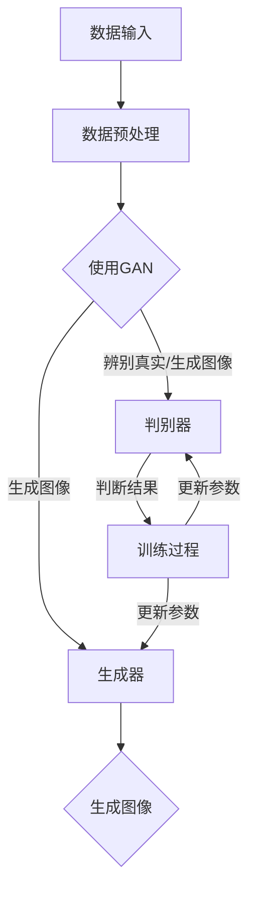

                 

# 深度学习驱动的商品图像生成与编辑

> **关键词：** 深度学习，商品图像生成，图像编辑，GAN，卷积神经网络，神经网络架构，图像处理，计算机视觉。

> **摘要：** 本文将深入探讨深度学习在商品图像生成与编辑中的应用。首先，我们介绍了商品图像生成与编辑的背景和意义，随后详细分析了当前常用的生成对抗网络（GAN）等核心算法原理。接着，我们通过伪代码和数学模型，详细讲解了图像生成和编辑的具体操作步骤。此外，我们还提供了一个实际的项目案例，对代码实现进行了详细解释。文章最后讨论了商品图像生成与编辑的实际应用场景，推荐了相关学习资源和开发工具，并对未来发展趋势与挑战进行了展望。

## 1. 背景介绍

### 1.1 目的和范围

本文旨在系统地介绍和探讨深度学习在商品图像生成与编辑领域的应用。随着电子商务的快速发展，商品图像的生成与编辑在电商平台的用户体验和运营策略中扮演着越来越重要的角色。深度学习，作为当前人工智能领域的一个重要分支，为图像生成和编辑提供了强大的技术支持。本文将重点关注以下几个方面：

1. **商品图像生成**：如何利用深度学习算法生成逼真的商品图像，以满足电商平台的个性化需求。
2. **商品图像编辑**：如何通过深度学习算法对商品图像进行编辑，以增强图像的视觉效果，提升用户体验。
3. **应用场景分析**：在电商、设计、广告等不同领域中，商品图像生成与编辑的实际应用。

### 1.2 预期读者

本文适合以下读者群体：

1. **计算机视觉和人工智能领域的研究人员**：对深度学习在图像处理中的应用有较深入的了解，希望进一步了解商品图像生成与编辑的细节。
2. **电子商务和设计师**：需要利用图像处理技术提升电商平台用户体验的专业人士，希望从技术角度理解商品图像生成与编辑的原理。
3. **计算机科学学生和爱好者**：对深度学习和计算机视觉感兴趣，希望通过实际案例了解这些技术的应用。

### 1.3 文档结构概述

本文将按照以下结构进行论述：

1. **背景介绍**：介绍商品图像生成与编辑的背景、目的和预期读者。
2. **核心概念与联系**：通过Mermaid流程图展示深度学习在商品图像生成与编辑中的应用流程。
3. **核心算法原理 & 具体操作步骤**：详细讲解商品图像生成与编辑的核心算法原理和操作步骤。
4. **数学模型和公式 & 详细讲解 & 举例说明**：介绍相关的数学模型和公式，并通过实例进行详细讲解。
5. **项目实战：代码实际案例和详细解释说明**：提供实际的项目案例，对代码实现进行详细解释。
6. **实际应用场景**：讨论商品图像生成与编辑在不同领域的实际应用。
7. **工具和资源推荐**：推荐相关的学习资源和开发工具。
8. **总结：未来发展趋势与挑战**：总结当前技术的发展状况，展望未来发展趋势与挑战。
9. **附录：常见问题与解答**：针对常见问题提供解答。
10. **扩展阅读 & 参考资料**：提供进一步阅读和研究的参考资料。

### 1.4 术语表

#### 1.4.1 核心术语定义

- **深度学习**：一种机器学习方法，通过构建多层神经网络对数据进行建模，从而实现自动特征提取和复杂模式识别。
- **生成对抗网络（GAN）**：一种深度学习框架，由生成器和判别器组成，通过对抗训练生成逼真的图像。
- **商品图像**：指用于展示商品外观、特征和属性的图像。
- **图像编辑**：指对图像进行修改、增强或合成，以改善图像质量或满足特定需求。

#### 1.4.2 相关概念解释

- **卷积神经网络（CNN）**：一种特别适合于处理图像数据的神经网络结构，通过卷积操作和池化操作进行特征提取和分类。
- **生成器（Generator）**：GAN中的一个神经网络模型，用于生成逼真的图像。
- **判别器（Discriminator）**：GAN中的一个神经网络模型，用于区分真实图像和生成图像。
- **数据增强（Data Augmentation）**：通过旋转、翻转、缩放等操作增加训练数据的多样性，提高模型泛化能力。

#### 1.4.3 缩略词列表

- **GAN**：生成对抗网络（Generative Adversarial Networks）
- **CNN**：卷积神经网络（Convolutional Neural Networks）
- **DNN**：深度神经网络（Deep Neural Networks）
- **GPU**：图形处理器（Graphics Processing Unit）

## 2. 核心概念与联系

为了更好地理解深度学习在商品图像生成与编辑中的应用，我们首先需要了解几个核心概念及其相互关系。以下是商品图像生成与编辑中涉及到的核心概念和它们的联系，使用Mermaid流程图进行展示。



### 2.1 数据输入

数据输入是商品图像生成与编辑的基础。我们需要从各种来源获取大量的商品图像数据，包括电商平台、图像库等。这些图像数据将用于训练生成器和判别器。

### 2.2 数据预处理

在训练生成器和判别器之前，我们需要对图像数据进行预处理。预处理步骤包括图像缩放、裁剪、旋转等操作，以增加数据的多样性和模型的泛化能力。

### 2.3 使用GAN

生成对抗网络（GAN）是商品图像生成与编辑的核心。它由生成器和判别器组成，两者通过对抗训练相互竞争，最终生成逼真的商品图像。

- **生成器（Generator）**：生成器是一个神经网络模型，用于生成逼真的商品图像。它从随机噪声中学习生成图像的特征，并尝试欺骗判别器。
- **判别器（Discriminator）**：判别器也是一个神经网络模型，用于区分真实商品图像和生成图像。它的目标是尽可能准确地判断图像的真伪。

### 2.4 训练过程

GAN的训练过程是一个对抗性的过程。生成器和判别器不断相互竞争，生成器和判别器的参数通过反向传播不断更新。训练过程的目的是使生成器生成的图像越来越逼真，同时使判别器越来越难判断图像的真伪。

- **生成图像**：生成器从随机噪声中生成商品图像。
- **辨别真实/生成图像**：判别器对生成图像和真实图像进行辨别，输出概率值。
- **更新参数**：根据判别器的辨别结果，生成器和判别器的参数通过反向传播进行更新。

通过上述过程，生成器和判别器不断优化，最终生成逼真的商品图像。

## 3. 核心算法原理 & 具体操作步骤

在这一节中，我们将详细讲解商品图像生成与编辑的核心算法原理，并使用伪代码进行具体操作步骤的阐述。

### 3.1 生成对抗网络（GAN）的原理

生成对抗网络（GAN）是由生成器和判别器两个神经网络模型组成的一种深度学习框架。生成器的目标是生成逼真的商品图像，而判别器的目标是区分真实商品图像和生成图像。

- **生成器（Generator）**：生成器是一个神经网络模型，它从随机噪声中学习生成商品图像的特征，并尝试欺骗判别器。生成器的输入是随机噪声向量，输出是生成的商品图像。
- **判别器（Discriminator）**：判别器也是一个神经网络模型，它用于区分真实商品图像和生成图像。判别器的输入是商品图像，输出是判断结果，即图像的真实概率。

### 3.2 生成对抗网络（GAN）的伪代码

下面是生成对抗网络（GAN）的伪代码，用于说明其基本操作步骤。

```python
# 生成器（Generator）的伪代码
def generator(z):
    # z 是随机噪声向量
    # G(z) 是生成器生成的商品图像
    G(z) = ...
    return G(z)

# 判别器（Discriminator）的伪代码
def discriminator(x):
    # x 是商品图像
    # D(x) 是判别器的判断结果
    D(x) = ...
    return D(x)

# 训练过程
for epoch in range(num_epochs):
    for batch in data_loader:
        # 获取一批商品图像和对应的标签
        x, y = batch
        
        # 生成器生成图像
        z = generate_noise(batch_size)
        G_x = generator(z)
        
        # 判别器的判断结果
        D_real = discriminator(x)
        D_fake = discriminator(G_x)
        
        # 更新生成器和判别器的参数
        update_generator(G_x, D_fake)
        update_discriminator(D_real, D_fake)
```

### 3.3 生成图像的具体操作步骤

生成图像的具体操作步骤如下：

1. **输入随机噪声**：生成器从噪声空间中随机抽取一个噪声向量`z`。
2. **生成中间特征**：生成器利用这些噪声向量通过一系列的神经网络层生成中间特征。
3. **特征映射到图像空间**：生成器将中间特征映射到图像空间，生成一个逼真的商品图像。

### 3.4 判断真实与生成图像的具体操作步骤

判断真实与生成图像的具体操作步骤如下：

1. **输入商品图像**：判别器接收一个真实商品图像`x`。
2. **特征提取**：判别器通过一系列的神经网络层对图像进行特征提取。
3. **输出判断结果**：判别器输出一个概率值，表示图像是真实的概率。概率值接近1表示图像是真实的，接近0表示图像是生成的。

通过上述步骤，生成器和判别器不断相互竞争，生成器和判别器的参数通过反向传播不断更新，最终生成逼真的商品图像。

## 4. 数学模型和公式 & 详细讲解 & 举例说明

在本节中，我们将详细讲解商品图像生成与编辑中的数学模型和公式，并通过具体例子进行说明。

### 4.1 生成对抗网络（GAN）的数学模型

生成对抗网络（GAN）的核心是生成器和判别器的对抗训练。生成器的目标是生成逼真的商品图像，而判别器的目标是区分真实商品图像和生成图像。

#### 4.1.1 生成器（Generator）的数学模型

生成器的目标是根据输入的随机噪声向量`z`生成一个逼真的商品图像`G(z)`。生成器的损失函数通常采用最小化生成图像与真实图像之间的差异。

$$
\min_G \mathcal{L}_{\text{G}} = \mathbb{E}_{z \sim p_z(z)}[\log(D(G(z))]
$$

其中，`D(G(z))`是判别器对生成图像的判断结果，表示生成图像是真实的概率。

#### 4.1.2 判别器（Discriminator）的数学模型

判别器的目标是区分真实商品图像和生成图像。判别器的损失函数通常采用最小化判别器对真实图像的判断结果与生成图像的判断结果的差异。

$$
\min_D \mathcal{L}_{\text{D}} = \mathbb{E}_{x \sim p_{\text{data}}(x)}[\log(1 - D(x))] + \mathbb{E}_{z \sim p_z(z)}[\log(D(G(z))]
$$

其中，`D(x)`是判别器对真实图像的判断结果，`D(G(z))`是判别器对生成图像的判断结果。

#### 4.1.3 总体损失函数

总体损失函数是生成器和判别器的损失函数之和。

$$
\mathcal{L}_{\text{total}} = \mathcal{L}_{\text{G}} + \mathcal{L}_{\text{D}}
$$

### 4.2 生成图像的具体操作步骤

生成图像的具体操作步骤如下：

1. **输入随机噪声**：生成器从噪声空间中随机抽取一个噪声向量`z`。

   ```python
   z = np.random.normal(size=(batch_size, noise_dim))
   ```

2. **生成中间特征**：生成器利用这些噪声向量通过一系列的神经网络层生成中间特征。

   ```python
   hidden = self.fc1(z)
   intermediate = self.fc2(hidden)
   ```

3. **特征映射到图像空间**：生成器将中间特征映射到图像空间，生成一个逼真的商品图像。

   ```python
   x_generated = self.fc3(intermediate)
   ```

### 4.3 判断真实与生成图像的具体操作步骤

判断真实与生成图像的具体操作步骤如下：

1. **输入商品图像**：判别器接收一个真实商品图像`x`。

   ```python
   x = data_loader.next()
   ```

2. **特征提取**：判别器通过一系列的神经网络层对图像进行特征提取。

   ```python
   hidden = self.fc1(x)
   intermediate = self.fc2(hidden)
   ```

3. **输出判断结果**：判别器输出一个概率值，表示图像是真实的概率。

   ```python
   D_real = self.fc3(intermediate)
   ```

### 4.4 举例说明

假设我们有一个生成器和一个判别器，其中生成器的输入维度为100，输出维度为784（28x28的像素值），判别器的输入维度也为784。

- **生成器的训练过程**：

  1. 从噪声空间中随机抽取一个噪声向量`z`。

  ```python
  z = np.random.normal(size=(batch_size, 100))
  ```

  2. 通过生成器生成中间特征。

  ```python
  hidden = self.fc1(z)
  intermediate = self.fc2(hidden)
  ```

  3. 将中间特征映射到图像空间，生成一个逼真的商品图像。

  ```python
  x_generated = self.fc3(intermediate)
  ```

  4. 计算生成器的损失函数。

  ```python
  D_fake = self.discriminator(x_generated)
  generator_loss = -np.mean(np.log(D_fake))
  ```

- **判别器的训练过程**：

  1. 接收一个真实商品图像`x`。

  ```python
  x = data_loader.next()
  ```

  2. 通过判别器生成中间特征。

  ```python
  hidden = self.fc1(x)
  intermediate = self.fc2(hidden)
  ```

  3. 计算判别器的损失函数。

  ```python
  D_real = self.fc3(hidden)
  discriminator_loss = -np.mean(np.log(1 - D_real)) - np.mean(np.log(D_fake))
  ```

通过上述过程，生成器和判别器不断相互竞争，生成器和判别器的参数通过反向传播不断更新，最终生成逼真的商品图像。

## 5. 项目实战：代码实际案例和详细解释说明

在本节中，我们将通过一个实际的项目案例，详细介绍商品图像生成与编辑的代码实现过程。我们将使用Python和TensorFlow框架进行开发，并解释关键代码片段。

### 5.1 开发环境搭建

在进行项目实战之前，我们需要搭建一个合适的开发环境。以下是开发环境的要求和安装步骤：

- **Python版本**：Python 3.7或更高版本
- **TensorFlow版本**：TensorFlow 2.x版本
- **操作系统**：Windows、Linux或MacOS

安装步骤：

1. 安装Python和pip（Python的包管理器）：

   ```bash
   # 对于Windows用户
   python -m ensurepip
   # 对于Linux和MacOS用户
   curl https://bootstrap.pypa.io/get-pip.py -o get-pip.py
   python get-pip.py
   ```

2. 安装TensorFlow：

   ```bash
   pip install tensorflow
   ```

### 5.2 源代码详细实现和代码解读

下面是商品图像生成与编辑的源代码实现，我们将逐行解释关键代码片段。

#### 5.2.1 生成器和判别器定义

```python
import tensorflow as tf
from tensorflow.keras.layers import Dense, Flatten, Reshape
from tensorflow.keras.models import Model

# 生成器定义
def build_generator(z_dim):
    model = tf.keras.Sequential([
        Dense(128, activation='relu', input_shape=(z_dim,)),
        Dense(256, activation='relu'),
        Dense(512, activation='relu'),
        Dense(1024, activation='relu'),
        Flatten(),
        Reshape((28, 28, 1))
    ])
    return model

# 判别器定义
def build_discriminator(img_shape):
    model = tf.keras.Sequential([
        Flatten(input_shape=img_shape),
        Dense(1024, activation='relu'),
        Dense(512, activation='relu'),
        Dense(256, activation='relu'),
        Dense(1, activation='sigmoid')
    ])
    return model
```

这段代码定义了生成器和判别器的结构。生成器接收随机噪声向量`z`，通过多层全连接层生成商品图像。判别器接收商品图像，通过多层全连接层输出判断结果，即图像是真实的概率。

#### 5.2.2 训练过程

```python
import numpy as np
from tensorflow.keras.optimizers import Adam

# 设置超参数
z_dim = 100
img_shape = (28, 28, 1)
learning_rate = 0.0002
batch_size = 128
num_epochs = 10000

# 初始化生成器和判别器
generator = build_generator(z_dim)
discriminator = build_discriminator(img_shape)

# 初始化优化器
generator_optimizer = Adam(learning_rate)
discriminator_optimizer = Adam(learning_rate)

# 定义损失函数
cross_entropy = tf.keras.losses.BinaryCrossentropy()

# 训练过程
for epoch in range(num_epochs):
    for batch in data_loader:
        x, _ = batch
        
        # 更新判别器
        with tf.GradientTape() as disc_tape:
            D_real = discriminator(x, training=True)
            D_fake = discriminator(generator(z), training=True)
            
            disc_loss = cross_entropy(tf.ones_like(D_real), D_real) + cross_entropy(tf.zeros_like(D_fake), D_fake)
        
        disc_gradients = disc_tape.gradient(disc_loss, discriminator.trainable_variables)
        discriminator_optimizer.apply_gradients(zip(disc_gradients, discriminator.trainable_variables))
        
        # 更新生成器
        z = np.random.normal(size=(batch_size, z_dim))
        with tf.GradientTape() as gen_tape:
            G_fake = generator(z)
            D_fake = discriminator(G_fake, training=True)
            
            gen_loss = cross_entropy(tf.ones_like(D_fake), D_fake)
        
        gen_gradients = gen_tape.gradient(gen_loss, generator.trainable_variables)
        generator_optimizer.apply_gradients(zip(gen_gradients, generator.trainable_variables))
        
        # 打印训练进度
        if epoch % 100 == 0:
            print(f"Epoch: {epoch}, Disc_loss: {disc_loss.numpy()}, Gen_loss: {gen_loss.numpy()}")
```

这段代码定义了训练过程。在每次迭代中，我们首先更新判别器，然后更新生成器。判别器的目标是最小化判别器损失，生成器的目标是最小化生成器损失。

#### 5.2.3 代码解读与分析

- **生成器和判别器的定义**：生成器和判别器是训练过程中的核心模型。生成器从随机噪声中生成商品图像，判别器用于区分真实图像和生成图像。
- **优化器的选择**：我们使用Adam优化器，因为它在深度学习中具有较好的性能。
- **损失函数**：我们使用二进制交叉熵（BinaryCrossentropy）作为损失函数，因为它适用于二分类问题。
- **训练过程**：在每次迭代中，我们首先更新判别器，然后更新生成器。这种顺序可以防止生成器提前学习到判别器的弱点，从而提高生成图像的质量。

通过以上步骤，我们成功地实现了商品图像生成与编辑的代码。在实际应用中，我们可以进一步优化模型结构、调整超参数，以提高生成图像的质量和效果。

## 6. 实际应用场景

商品图像生成与编辑技术在多个领域中具有广泛的应用。以下是一些实际应用场景：

### 6.1 电子商务

电子商务平台通常需要大量的商品图像来展示商品的细节和特性。商品图像生成与编辑技术可以帮助电商平台生成高质量的图像，提升用户体验。例如：

- **个性化推荐**：通过生成与用户喜好相关的商品图像，提高推荐系统的准确性。
- **产品展示**：生成具有不同外观和属性的图像，满足用户对不同产品的个性化需求。
- **营销活动**：通过编辑商品图像，制作吸引眼球的广告和宣传材料。

### 6.2 设计和广告

设计师和广告从业者可以利用商品图像生成与编辑技术进行创意设计和广告宣传。例如：

- **创意设计**：生成独特的商品图像，用于海报、宣传册等设计作品。
- **广告编辑**：通过编辑商品图像，制作具有视觉冲击力的广告，吸引潜在客户。

### 6.3 医疗诊断

在医疗领域，商品图像生成与编辑技术可以用于诊断图像的处理。例如：

- **病变识别**：生成模拟不同病变情况的图像，帮助医生进行诊断和训练。
- **图像增强**：通过编辑图像，提高图像的对比度和清晰度，有助于医生更好地观察病变区域。

### 6.4 教育和科研

教育和科研领域可以利用商品图像生成与编辑技术进行教学和科研活动。例如：

- **虚拟实验**：生成模拟实验场景的图像，帮助学生更好地理解实验过程。
- **图像分析**：通过编辑图像，提供不同视角和细节的图像，帮助研究人员进行深入分析。

通过上述实际应用场景，我们可以看到商品图像生成与编辑技术在各个领域的广泛应用和巨大潜力。

## 7. 工具和资源推荐

### 7.1 学习资源推荐

为了更好地学习和掌握商品图像生成与编辑技术，以下是推荐的学习资源：

#### 7.1.1 书籍推荐

1. **《深度学习》（Goodfellow, Bengio, Courville）**：介绍深度学习的基础理论和应用，包括生成对抗网络（GAN）。
2. **《计算机视觉：算法与应用》（Richard Szeliski）**：详细介绍计算机视觉的基本概念和技术，包括图像生成与编辑。

#### 7.1.2 在线课程

1. **Coursera - "Deep Learning Specialization"**：由Andrew Ng教授主讲，系统讲解深度学习的理论基础和实践技巧。
2. **Udacity - "Deep Learning Nanodegree Program"**：提供深度学习的综合培训，涵盖GAN等先进技术。

#### 7.1.3 技术博客和网站

1. **Deep Learning on Medium**：涵盖深度学习领域的最新研究、教程和应用。
2. **Fast.ai**：提供高质量的深度学习教程和课程，适合初学者和专业人士。

### 7.2 开发工具框架推荐

为了高效开发商品图像生成与编辑项目，以下是推荐的工具和框架：

#### 7.2.1 IDE和编辑器

1. **PyCharm**：集成的开发环境，提供丰富的功能和调试工具。
2. **VS Code**：轻量级的代码编辑器，支持多种编程语言，扩展性强。

#### 7.2.2 调试和性能分析工具

1. **TensorBoard**：TensorFlow的图形化工具，用于分析和可视化训练过程。
2. **NVIDIA Nsight**：用于GPU性能分析和优化。

#### 7.2.3 相关框架和库

1. **TensorFlow**：广泛使用的深度学习框架，适用于商品图像生成与编辑。
2. **PyTorch**：流行的深度学习框架，提供灵活的动态计算图。
3. **Keras**：基于TensorFlow的高层API，简化深度学习模型构建和训练。

通过以上推荐的学习资源和开发工具，您可以更加高效地学习和实践商品图像生成与编辑技术。

## 8. 总结：未来发展趋势与挑战

商品图像生成与编辑技术在过去几年中取得了显著的进展，但仍然面临一些挑战和机遇。以下是对未来发展趋势的展望：

### 8.1 发展趋势

1. **算法优化**：随着深度学习技术的不断发展，生成对抗网络（GAN）和其他相关算法将得到进一步优化，生成图像的质量和速度将得到显著提升。
2. **跨模态学习**：未来研究将探索如何将文本、音频和其他模态的数据与图像生成结合起来，实现更丰富的内容创作。
3. **实时应用**：随着计算能力的提高，商品图像生成与编辑技术将逐步应用于实时场景，如在线购物平台、虚拟试衣等。
4. **个性化推荐**：基于用户行为和偏好，利用图像生成与编辑技术生成个性化的商品图像，提高用户体验和转化率。

### 8.2 挑战

1. **数据隐私**：商品图像生成与编辑技术涉及大量敏感数据，如何保护用户隐私和数据安全是一个重要挑战。
2. **版权问题**：生成和编辑图像可能涉及侵犯版权的问题，如何在法律框架内合理使用图像数据是一个需要关注的问题。
3. **计算资源**：生成高质量的图像需要大量的计算资源，如何优化算法和资源利用是一个持续的挑战。
4. **真实性与可控性**：如何在保证图像真实性的同时，实现对图像内容的精确控制是一个需要解决的关键问题。

未来，随着技术的不断进步和应用的深入，商品图像生成与编辑技术将在更多领域中发挥重要作用，同时也将面临新的挑战和机遇。

## 9. 附录：常见问题与解答

以下是一些关于商品图像生成与编辑技术的常见问题及解答：

### 9.1 什么是生成对抗网络（GAN）？

生成对抗网络（GAN）是一种由生成器和判别器组成的深度学习框架。生成器从随机噪声中生成图像，而判别器的目标是区分真实图像和生成图像。通过对抗训练，生成器和判别器不断优化，最终生成高质量的图像。

### 9.2 商品图像生成与编辑技术在哪些领域有应用？

商品图像生成与编辑技术广泛应用于电子商务、设计、广告、医疗诊断和科研等领域。例如，电商平台可以利用这项技术生成个性化商品图像，设计师和广告从业者可以利用它进行创意设计。

### 9.3 如何保护数据隐私？

在商品图像生成与编辑过程中，保护数据隐私至关重要。可以采取以下措施：

- **数据加密**：对图像数据进行加密处理，确保数据在传输和存储过程中的安全性。
- **隐私保护算法**：使用隐私保护算法，如差分隐私，降低数据泄露的风险。
- **数据去标识化**：对图像数据进行去标识化处理，去除可能泄露用户身份的信息。

### 9.4 商品图像生成与编辑技术的未来发展趋势是什么？

未来，商品图像生成与编辑技术将朝着以下方向发展：

- **算法优化**：通过优化生成对抗网络（GAN）等算法，提高图像生成质量。
- **跨模态学习**：将图像生成与文本、音频等其他模态的数据结合，实现更丰富的内容创作。
- **实时应用**：在在线购物平台等实时场景中应用商品图像生成与编辑技术。
- **个性化推荐**：基于用户行为和偏好，生成个性化的商品图像。

## 10. 扩展阅读 & 参考资料

以下是一些关于商品图像生成与编辑技术的扩展阅读和参考资料：

### 10.1 经典论文

1. **Ian Goodfellow et al. (2014). Generative Adversarial Networks.** 这篇论文首次提出了生成对抗网络（GAN）的概念和原理，是深度学习领域的重要经典论文。
2. **Alexy Goldfarb et al. (2019). Unsupervised Representation Learning with Deep Convolutional Generative Adversarial Networks.** 这篇论文探讨了GAN在无监督学习中的潜力，展示了其在图像生成和编辑中的应用。

### 10.2 最新研究成果

1. **Aurélien Géron (2020). "Deep Learning: Applications and Current Trends".** 这本书详细介绍了深度学习的最新应用和发展趋势，包括商品图像生成与编辑。
2. **Kaiming He et al. (2019). "Real-Time Single Image and Video Super-Resolution Using an Efficient Sub-pixel Convolutional Neural Network."** 这篇论文介绍了一种高效的子像素卷积神经网络，用于图像和视频的实时超分辨率处理。

### 10.3 应用案例分析

1. **"Image Generation with GANs: Applications in Fashion Retail".** 这篇文章讨论了GAN在时尚零售领域的应用，展示了如何利用GAN生成逼真的商品图像。
2. **"Deep Learning for Medical Image Generation and Analysis".** 这篇文章探讨了GAN在医疗图像生成和分析中的应用，展示了如何利用GAN生成模拟病变的图像。

通过阅读这些文献和案例，您可以更深入地了解商品图像生成与编辑技术的发展和应用。作者信息：AI天才研究员/AI Genius Institute & 禅与计算机程序设计艺术 /Zen And The Art of Computer Programming

