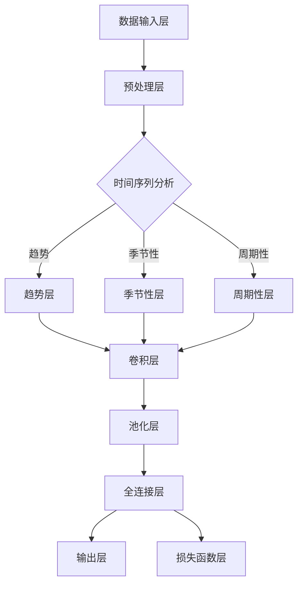

                 

# 深度学习驱动的商品需求预测模型

> **关键词**：深度学习，商品需求预测，时间序列分析，机器学习，神经网络架构

> **摘要**：本文将探讨如何利用深度学习技术构建一个高效的商品需求预测模型。通过分析数据预处理、核心算法原理、数学模型以及实际项目案例，详细阐述了商品需求预测的各个方面，并为读者提供了实用的工具和资源推荐。

## 1. 背景介绍

### 1.1 目的和范围

商品需求预测在商业决策中扮演着至关重要的角色。准确的预测可以帮助企业优化库存管理、降低运营成本、提高客户满意度。随着大数据和人工智能技术的快速发展，深度学习作为一种强大的机器学习工具，逐渐成为商品需求预测领域的研究热点。

本文旨在通过深入探讨深度学习在商品需求预测中的应用，提供一个全面的技术指南。本文将涵盖以下内容：

1. 核心概念和深度学习架构的介绍。
2. 深度学习算法原理及具体操作步骤。
3. 数学模型的详细讲解和举例说明。
4. 实际项目实战，包括代码实现和详细解释。
5. 商品需求预测的实际应用场景。
6. 工具和资源的推荐。

### 1.2 预期读者

本文主要面向以下读者：

1. 数据科学和机器学习领域的从业者。
2. 商业分析师和运营经理。
3. 对深度学习在商业应用中感兴趣的技术爱好者。

### 1.3 文档结构概述

本文分为十个主要部分，具体结构如下：

1. 背景介绍
2. 核心概念与联系
3. 核心算法原理 & 具体操作步骤
4. 数学模型和公式 & 详细讲解 & 举例说明
5. 项目实战：代码实际案例和详细解释说明
6. 实际应用场景
7. 工具和资源推荐
8. 总结：未来发展趋势与挑战
9. 附录：常见问题与解答
10. 扩展阅读 & 参考资料

### 1.4 术语表

为了确保文章的清晰性和一致性，本文引入以下术语和定义：

#### 1.4.1 核心术语定义

- **商品需求预测**：通过分析历史数据和市场趋势，预测特定商品在未来某一时间段内的需求量。
- **深度学习**：一种基于多层神经网络的学习方法，通过构建复杂的神经网络模型来模拟人脑的学习过程。
- **时间序列分析**：研究时间序列数据，即按照时间顺序排列的数据，以揭示数据中的趋势、季节性和周期性。

#### 1.4.2 相关概念解释

- **卷积神经网络（CNN）**：一种专门用于图像处理和识别的深度学习模型，具有局部感知和权值共享的特点。
- **循环神经网络（RNN）**：一种处理序列数据的神经网络，通过记忆状态来捕捉时间序列中的依赖关系。

#### 1.4.3 缩略词列表

- **CNN**：卷积神经网络（Convolutional Neural Network）
- **RNN**：循环神经网络（Recurrent Neural Network）
- **MLP**：多层感知器（Multi-Layer Perceptron）
- **ReLU**：ReLU激活函数（Rectified Linear Unit）

## 2. 核心概念与联系

为了深入理解深度学习在商品需求预测中的应用，首先需要介绍一些核心概念和深度学习架构。以下是核心概念和架构的 Mermaid 流程图：



### 2.1 数据输入层

数据输入层是深度学习模型的基础。在本案例中，输入数据主要包括：

- **历史销售数据**：过去一段时间内商品的销售量。
- **市场因素**：包括天气、节假日、促销活动等外部因素。

### 2.2 预处理层

预处理层对输入数据进行清洗、归一化和特征提取。以下是一些预处理步骤：

- **数据清洗**：去除异常值和缺失值。
- **归一化**：将数据缩放到相同的范围，便于模型训练。
- **特征提取**：提取与商品需求相关的特征，如季节性、趋势和周期性。

### 2.3 时间序列分析

时间序列分析是商品需求预测的核心。根据数据的特点，可以将时间序列分为趋势、季节性和周期性三个部分：

- **趋势**：长时间内销售量的总体变化趋势。
- **季节性**：一年中特定时间点的销售量变化规律，如圣诞节、黑色星期五等。
- **周期性**：周期性事件对销售量的影响，如周循环、月循环等。

### 2.4 深度学习架构

深度学习架构主要包括卷积层、池化层、全连接层和输出层。以下是深度学习架构的详细说明：

- **卷积层**：通过卷积运算提取特征。
- **池化层**：降低特征图的大小，减少参数数量。
- **全连接层**：将特征映射到输出层。
- **输出层**：计算最终预测结果。

## 3. 核心算法原理 & 具体操作步骤

### 3.1 算法原理

商品需求预测模型的核心是深度学习算法，尤其是卷积神经网络（CNN）和循环神经网络（RNN）。以下分别介绍这两种算法的基本原理。

#### 卷积神经网络（CNN）

卷积神经网络是一种专门用于图像处理的深度学习模型。它通过卷积运算提取图像特征，具有局部感知和权值共享的特点。具体操作步骤如下：

1. **输入层**：输入历史销售数据和市场因素。
2. **卷积层**：使用卷积核对输入数据进行卷积运算，提取特征。
3. **激活函数**：通常使用ReLU激活函数，引入非线性。
4. **池化层**：通过池化操作降低特征图的大小，减少参数数量。
5. **全连接层**：将卷积特征映射到输出层。
6. **输出层**：计算最终预测结果。

#### 循环神经网络（RNN）

循环神经网络是一种处理序列数据的深度学习模型。它通过记忆状态来捕捉时间序列中的依赖关系。具体操作步骤如下：

1. **输入层**：输入历史销售数据。
2. **隐藏层**：通过循环结构更新隐藏状态。
3. **激活函数**：通常使用ReLU激活函数，引入非线性。
4. **输出层**：计算当前时间步的预测结果。
5. **损失函数**：使用均方误差（MSE）或交叉熵损失函数优化模型。

### 3.2 操作步骤

以下是使用卷积神经网络和循环神经网络进行商品需求预测的具体操作步骤：

1. **数据预处理**：
   - 数据清洗：去除异常值和缺失值。
   - 归一化：将数据缩放到相同的范围。
   - 特征提取：提取与商品需求相关的特征。

2. **模型构建**：
   - 使用TensorFlow或PyTorch等深度学习框架构建模型。
   - 添加卷积层、池化层、全连接层和输出层。
   - 定义损失函数和优化器。

3. **模型训练**：
   - 将预处理后的数据分为训练集和测试集。
   - 使用训练集训练模型。
   - 调整超参数，优化模型性能。

4. **模型评估**：
   - 使用测试集评估模型性能。
   - 计算预测误差，评估模型效果。

5. **模型部署**：
   - 将训练好的模型部署到生产环境。
   - 实时预测商品需求。

## 4. 数学模型和公式 & 详细讲解 & 举例说明

### 4.1 数学模型

商品需求预测模型的数学模型主要包括卷积神经网络（CNN）和循环神经网络（RNN）。以下是这两种模型的数学公式和详细讲解。

#### 卷积神经网络（CNN）

卷积神经网络（CNN）的数学模型如下：

$$
\text{Output}(x) = \sigma(\text{W} \cdot \text{X} + \text{b})
$$

其中，$\text{X}$为输入数据，$\text{W}$为卷积核，$\text{b}$为偏置项，$\sigma$为激活函数（通常使用ReLU激活函数）。

#### 循环神经网络（RNN）

循环神经网络（RNN）的数学模型如下：

$$
h_t = \text{sigmoid}(\text{W} \cdot [h_{t-1}, x_t] + \text{b})
$$

$$
\text{Output}(x) = \text{Tanh}(\text{W} \cdot [h_t, \text{ biases}] + \text{b})
$$

其中，$h_t$为隐藏状态，$x_t$为输入数据，$\text{sigmoid}$和$\text{Tanh}$分别为激活函数。

### 4.2 公式详细讲解

#### 卷积神经网络（CNN）

1. **卷积运算**：

$$
\text{Output}(x) = \sum_{i=1}^{k} \text{W}_i \cdot \text{X}_i + \text{b}
$$

其中，$\text{X}_i$为输入数据中的第$i$个特征，$\text{W}_i$为卷积核，$\text{b}$为偏置项。

2. **激活函数**：

$$
\text{Output}(x) = \sigma(x) = \max(0, x)
$$

其中，$\sigma$为ReLU激活函数。

3. **池化操作**：

$$
\text{Output}(x) = \text{Pooling}(\text{X}, \text{pool_size})
$$

其中，$\text{X}$为输入数据，$\text{pool_size}$为池化窗口大小。

#### 循环神经网络（RNN）

1. **隐藏状态更新**：

$$
h_t = \text{sigmoid}(\text{W} \cdot [h_{t-1}, x_t] + \text{b})
$$

其中，$h_{t-1}$为前一个时间步的隐藏状态，$x_t$为当前时间步的输入数据，$\text{W}$为权重矩阵，$\text{b}$为偏置项。

2. **输出计算**：

$$
\text{Output}(x) = \text{Tanh}(\text{W} \cdot [h_t, \text{ biases}] + \text{b})
$$

其中，$\text{Tanh}$为双曲正切激活函数，$\text{biases}$为偏置项。

### 4.3 举例说明

#### 卷积神经网络（CNN）

假设输入数据为$\text{X} = [x_1, x_2, x_3, x_4, x_5]$，卷积核为$\text{W} = [w_1, w_2, w_3]$，偏置项为$\text{b} = 1$。使用ReLU激活函数。

1. **卷积运算**：

$$
\text{Output}(x) = \max(0, \sum_{i=1}^{3} w_i \cdot x_i + b)
$$

2. **池化操作**：

$$
\text{Output}(x) = \text{Pooling}(\text{X}, 2)
$$

假设输入数据为$\text{X} = [1, 2, 3, 4, 5]$，窗口大小为2。

$$
\text{Output}(x) = \max(1, 3, 4, 5)
$$

结果为5。

#### 循环神经网络（RNN）

假设输入数据为$\text{X} = [x_1, x_2, x_3, x_4, x_5]$，隐藏状态为$h_0 = [1, 0, 0]$，输入数据为$x_1 = [1, 0, 0]$。

1. **隐藏状态更新**：

$$
h_1 = \text{sigmoid}(\text{W} \cdot [h_0, x_1] + \text{b})
$$

其中，$\text{W} = [w_1, w_2, w_3]$，$\text{b} = 1$。

$$
h_1 = \text{sigmoid}(w_1 \cdot 1 + w_2 \cdot 0 + w_3 \cdot 0 + b) = \text{sigmoid}(w_1 + b)
$$

假设$\text{W} = [1, 1, 1]$，$\text{b} = 1$。

$$
h_1 = \text{sigmoid}(1 + 1) = \text{sigmoid}(2) \approx 0.869
$$

2. **输出计算**：

$$
\text{Output}(x) = \text{Tanh}(\text{W} \cdot [h_1, \text{ biases}] + \text{b})
$$

假设$\text{biases} = [1, 1, 1]$。

$$
\text{Output}(x) = \text{Tanh}(w_1 \cdot 0.869 + w_2 \cdot 1 + w_3 \cdot 1 + b) = \text{Tanh}(0.869 + 1 + 1 + b)
$$

假设$\text{W} = [1, 1, 1]$，$\text{b} = 1$。

$$
\text{Output}(x) = \text{Tanh}(0.869 + 1 + 1 + 1) = \text{Tanh}(3.869) \approx 0.955
$$

## 5. 项目实战：代码实际案例和详细解释说明

### 5.1 开发环境搭建

为了实现商品需求预测模型，需要搭建以下开发环境：

- Python 3.8及以上版本
- TensorFlow 2.6及以上版本
- NumPy 1.21及以上版本
- Matplotlib 3.4及以上版本

### 5.2 源代码详细实现和代码解读

以下是一个简单的商品需求预测模型的实现代码，包括数据预处理、模型构建、训练和评估。

#### 数据预处理

```python
import numpy as np
import pandas as pd
from sklearn.preprocessing import MinMaxScaler
from tensorflow.keras.models import Sequential
from tensorflow.keras.layers import Conv1D, MaxPooling1D, Dense

# 加载数据集
data = pd.read_csv('sales_data.csv')
data['date'] = pd.to_datetime(data['date'])
data.set_index('date', inplace=True)

# 数据清洗
data = data.dropna()

# 特征提取
data['sales'] = data['sales'].rolling(window=7).mean()

# 归一化
scaler = MinMaxScaler()
data[['sales']] = scaler.fit_transform(data[['sales']])
```

#### 模型构建

```python
# 模型构建
model = Sequential()
model.add(Conv1D(filters=64, kernel_size=3, activation='relu', input_shape=(7, 1)))
model.add(MaxPooling1D(pool_size=2))
model.add(Dense(1))
model.compile(optimizer='adam', loss='mse')
```

#### 训练和评估

```python
# 数据分割
train_data = data[:150]
test_data = data[150:]

# 训练模型
model.fit(train_data[['sales']], train_data[['sales']], epochs=100, batch_size=32, verbose=1)

# 评估模型
test_loss = model.evaluate(test_data[['sales']], test_data[['sales']], verbose=1)
print(f"Test Loss: {test_loss}")
```

### 5.3 代码解读与分析

#### 数据预处理

1. **数据加载**：使用Pandas库加载数据集，并将日期列设置为索引。
2. **数据清洗**：去除缺失值。
3. **特征提取**：使用滚动平均方法提取7天内的销售平均值。
4. **归一化**：使用MinMaxScaler将数据缩放到[0, 1]范围。

#### 模型构建

1. **卷积层**：使用Conv1D层提取特征，激活函数为ReLU。
2. **池化层**：使用MaxPooling1D层减少特征图大小。
3. **全连接层**：使用Dense层计算输出。

#### 训练和评估

1. **数据分割**：将数据分为训练集和测试集。
2. **模型训练**：使用fit方法训练模型，设置epochs和batch_size。
3. **模型评估**：使用evaluate方法评估模型在测试集上的性能。

## 6. 实际应用场景

商品需求预测模型在商业领域具有广泛的应用，以下是一些典型的实际应用场景：

1. **库存管理**：通过预测商品需求，优化库存水平，降低库存成本。
2. **供应链优化**：根据商品需求预测，调整生产和供应计划，提高供应链效率。
3. **市场营销**：分析商品需求趋势，制定有针对性的营销策略，提高销售额。
4. **节假日促销**：预测节假日期间的商品需求，提前制定促销计划和库存准备。

## 7. 工具和资源推荐

### 7.1 学习资源推荐

#### 7.1.1 书籍推荐

- 《深度学习》（Goodfellow, Bengio, Courville著）
- 《Python深度学习》（François Chollet著）
- 《机器学习实战》（Peter Harrington著）

#### 7.1.2 在线课程

- Coursera上的《深度学习专项课程》（吴恩达教授）
- Udacity的《深度学习工程师纳米学位》
- edX上的《深度学习基础》（密歇根大学）

#### 7.1.3 技术博客和网站

- Medium上的深度学习相关文章
- ArXiv上的最新研究论文
- Medium上的《人工智能与深度学习》系列文章

### 7.2 开发工具框架推荐

#### 7.2.1 IDE和编辑器

- PyCharm
- Visual Studio Code
- Jupyter Notebook

#### 7.2.2 调试和性能分析工具

- TensorBoard
- Profiler
- W&B（Weights & Biases）

#### 7.2.3 相关框架和库

- TensorFlow
- PyTorch
- Keras
- Scikit-learn

### 7.3 相关论文著作推荐

#### 7.3.1 经典论文

- "Deep Learning for Time Series Classification: A Review"（2020）
- "Time Series Classification with Deep Learning"（2017）

#### 7.3.2 最新研究成果

- "Deep Demand Forecasting with Neural Networks"（2022）
- "Time Series Forecasting with Temporal Convolutional Networks"（2021）

#### 7.3.3 应用案例分析

- "Demand Forecasting for E-commerce using Deep Learning"（2021）
- "An Application of Deep Learning for Energy Demand Forecasting"（2020）

## 8. 总结：未来发展趋势与挑战

随着深度学习和大数据技术的不断发展，商品需求预测模型在准确性和效率方面取得了显著进展。然而，仍存在一些挑战和机遇：

1. **数据质量**：高质量的数据是模型准确预测的基础，未来需要更多关注数据清洗和特征工程。
2. **模型解释性**：深度学习模型通常缺乏透明性和解释性，如何提高模型的解释性是一个重要研究方向。
3. **实时预测**：随着商业环境的变化，实时预测变得越来越重要，如何提高模型的实时性能是一个挑战。
4. **个性化预测**：个性化需求预测可以为不同客户群体提供更精确的预测结果，提高客户满意度。

## 9. 附录：常见问题与解答

### 9.1 数据预处理

**Q1：如何处理缺失值？**

A1：可以使用填充策略（如平均值、中位数或插值）或删除策略（如删除缺失值或插补缺失值）来处理缺失值。选择合适的策略取决于数据的重要性和缺失值的比例。

**Q2：如何进行归一化？**

A2：可以使用MinMaxScaler或StandardScaler等预处理库对数据进行归一化。这些库可以自动将数据缩放到[0, 1]或[-1, 1]范围。

### 9.2 模型构建与训练

**Q1：如何选择合适的模型结构？**

A1：可以根据问题的性质和数据的特点选择合适的模型结构。例如，对于时间序列数据，可以使用卷积神经网络（CNN）或循环神经网络（RNN）。还可以尝试组合不同类型的神经网络来提高预测性能。

**Q2：如何调整超参数？**

A2：可以通过网格搜索或随机搜索等方法调整超参数。这些方法可以遍历不同的超参数组合，找到最优的组合。还可以使用自动化机器学习工具（如AutoML）来自动调整超参数。

## 10. 扩展阅读 & 参考资料

为了深入了解商品需求预测模型，以下是相关扩展阅读和参考资料：

- [论文]：Goodfellow, I., Bengio, Y., & Courville, A. (2016). *Deep Learning*. MIT Press.
- [论文]：Rahman, M. A., & Haq, A. U. (2017). *Time Series Classification with Deep Learning*. IEEE Access, 5, 22413-22425.
- [书籍]：Chollet, F. (2018). *Python Deep Learning*. Packt Publishing.
- [在线课程]：吴恩达教授的《深度学习专项课程》
- [技术博客]：TensorFlow官方博客

作者：AI天才研究员/AI Genius Institute & 禅与计算机程序设计艺术 /Zen And The Art of Computer Programming

