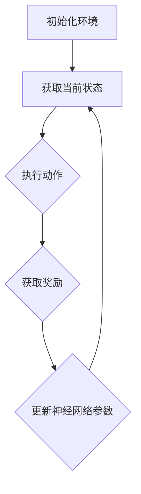

                 


# 深度强化学习在智能游戏AI中的突破

> 关键词：深度强化学习、智能游戏AI、强化学习算法、神经网络、智能决策、游戏开发

> 摘要：本文将探讨深度强化学习在智能游戏AI领域的突破与应用。我们将从深度强化学习的基本概念出发，详细解释其核心原理，通过实际项目案例展示其在智能游戏AI中的应用，最后分析该领域的发展趋势与面临的挑战。

## 1. 背景介绍

### 1.1 目的和范围

本文旨在介绍深度强化学习在智能游戏AI领域的应用与突破。我们将首先回顾深度强化学习的基本概念和原理，然后通过具体案例展示其在智能游戏AI中的成功应用，最后分析该领域的发展趋势和面临的挑战。

### 1.2 预期读者

本文适合对深度强化学习和智能游戏AI有一定了解的读者，包括游戏开发者、人工智能研究者、以及对相关领域感兴趣的爱好者。

### 1.3 文档结构概述

本文分为以下几个部分：

1. 背景介绍：回顾深度强化学习和智能游戏AI的基本概念。
2. 核心概念与联系：详细解释深度强化学习的基本原理，并展示其与智能游戏AI的联系。
3. 核心算法原理 & 具体操作步骤：深入讲解深度强化学习的算法原理和实现步骤。
4. 数学模型和公式 & 详细讲解 & 举例说明：分析深度强化学习中的数学模型和公式，并给出实例说明。
5. 项目实战：展示一个实际项目的代码实现，并进行详细解读。
6. 实际应用场景：分析深度强化学习在智能游戏AI领域的实际应用场景。
7. 工具和资源推荐：推荐学习资源和开发工具。
8. 总结：总结深度强化学习在智能游戏AI领域的突破与发展趋势。
9. 附录：常见问题与解答。
10. 扩展阅读 & 参考资料：提供更多深入学习的资料。

### 1.4 术语表

#### 1.4.1 核心术语定义

- 深度强化学习：结合深度学习和强化学习的一种机器学习方法。
- 强化学习：一种通过不断试错和奖励机制来学习最优策略的机器学习方法。
- 神经网络：一种由大量神经元组成的计算模型，可以用于图像识别、语音识别等多种任务。
- 强化学习算法：用于求解强化学习问题的算法，如Q-learning、SARSA等。
- 游戏AI：用于实现游戏智能行为的计算机程序，包括路径规划、决策策略等。

#### 1.4.2 相关概念解释

- 深度学习：一种基于多层神经网络的学习方法，可以自动从数据中提取特征。
- 强化学习：一种通过不断试错和奖励机制来学习最优策略的机器学习方法。
- 奖励信号：用于衡量动作好坏的数值，可以是正奖励或负奖励。
- 策略：智能体在某一状态下的最优动作选择。

#### 1.4.3 缩略词列表

- DRL：深度强化学习（Deep Reinforcement Learning）
- RL：强化学习（Reinforcement Learning）
- CNN：卷积神经网络（Convolutional Neural Network）
- DQN：深度Q网络（Deep Q-Network）
- SARSA：同步优势估计（Sync Advantage Estimation）
- A3C：异步优势估计（Asynchronous Advantage Estimation）

## 2. 核心概念与联系

### 2.1 深度强化学习原理

深度强化学习（DRL）是一种结合深度学习和强化学习的机器学习方法。其核心思想是使用深度神经网络来表示状态和价值函数，从而实现对环境的建模和策略的优化。

#### 2.1.1 神经网络

神经网络是一种由大量神经元组成的计算模型，可以用于图像识别、语音识别等多种任务。在DRL中，神经网络用于表示状态和价值函数，从而实现对环境的建模。

#### 2.1.2 强化学习

强化学习是一种通过不断试错和奖励机制来学习最优策略的机器学习方法。在DRL中，强化学习用于指导神经网络的学习过程，使其能够在复杂环境中找到最优策略。

#### 2.1.3 奖励信号

奖励信号是用于衡量动作好坏的数值，可以是正奖励或负奖励。在DRL中，奖励信号用于更新神经网络中的参数，使其能够学习到最优策略。

### 2.2 深度强化学习与智能游戏AI的联系

深度强化学习在智能游戏AI领域有广泛的应用。智能游戏AI的核心任务是让计算机程序在游戏中表现出人类玩家的智能行为，如决策、路径规划、动作执行等。而深度强化学习通过学习环境中的奖励信号，可以自动地找到最优策略，从而实现智能游戏AI的目标。

#### 2.2.1 状态表示

在智能游戏AI中，状态表示是关键的一步。深度强化学习使用深度神经网络来表示状态，从而实现对状态的自动提取和特征提取。

#### 2.2.2 动作选择

深度强化学习通过学习奖励信号，可以自动地选择最优动作。在智能游戏AI中，动作选择是实现智能行为的核心，如路径规划、攻击策略等。

#### 2.2.3 策略优化

深度强化学习通过不断地更新神经网络中的参数，可以优化策略，从而提高智能游戏AI的智能水平。

### 2.3 Mermaid流程图

以下是一个简单的Mermaid流程图，展示了深度强化学习在智能游戏AI中的流程：



## 3. 核心算法原理 & 具体操作步骤

### 3.1 深度Q网络（DQN）

深度Q网络（DQN）是深度强化学习中最常用的算法之一。它通过学习Q值（动作价值函数）来指导动作选择。

#### 3.1.1 Q值函数

Q值函数表示在某一状态下执行某一动作的期望收益。在DQN中，Q值函数由深度神经网络表示。

$$
Q(s, a) = \sum_{i=1}^n w_i q_i(s, a)
$$

其中，$s$ 表示状态，$a$ 表示动作，$w_i$ 表示权重，$q_i(s, a)$ 表示第 $i$ 个神经元的输出。

#### 3.1.2 目标函数

DQN的目标函数是最大化期望收益。目标函数由以下公式表示：

$$
J = \sum_{i=1}^n w_i q_i(s, a) - r
$$

其中，$r$ 表示奖励。

#### 3.1.3 伪代码

以下是一个简单的DQN伪代码：

```
初始化 Q(s, a)
经验重放缓冲器
while not terminate:
    选择动作 a
    执行动作 a，获取奖励 r 和新状态 s'
    更新经验重放缓冲器
    从经验重放缓冲器中随机选择一批经验
    更新 Q(s, a)
    更新 s 和 a
```

### 3.2 算法改进

#### 3.2.1 双Q学习（Double DQN）

双Q学习（Double DQN）是一种改进的DQN算法，用于解决目标值偏差问题。它通过使用两个Q网络来估计目标值，从而减小偏差。

#### 3.2.2 深度确定性策略梯度（DDPG）

深度确定性策略梯度（DDPG）是一种基于深度强化学习的策略优化算法。它使用深度神经网络来表示状态和价值函数，并通过策略梯度上升法来优化策略。

## 4. 数学模型和公式 & 详细讲解 & 举例说明

### 4.1 深度Q网络（DQN）

#### 4.1.1 Q值函数

$$
Q(s, a) = \sum_{i=1}^n w_i q_i(s, a)
$$

其中，$s$ 表示状态，$a$ 表示动作，$w_i$ 表示权重，$q_i(s, a)$ 表示第 $i$ 个神经元的输出。

#### 4.1.2 目标函数

$$
J = \sum_{i=1}^n w_i q_i(s, a) - r
$$

其中，$r$ 表示奖励。

#### 4.1.3 举例说明

假设一个智能游戏AI在游戏中的状态包括位置、速度和目标位置，动作包括前进、后退、左转和右转。以下是一个简单的DQN例子：

```
初始化 Q(s, a)
经验重放缓冲器

# 状态 s
s = [位置，速度，目标位置]

# 动作 a
a = [前进，后退，左转，右转]

# 奖励 r
r = 0

# 目标值 v
v = 0

while not terminate:
    # 选择动作 a
    a = choose_action(s, Q(s, a))

    # 执行动作 a，获取奖励 r 和新状态 s'
    s', r = execute_action(a)

    # 更新经验重放缓冲器
    experience_replay(s, a, r, s')

    # 从经验重放缓冲器中随机选择一批经验
    batch = sample_experience_replay()

    # 更新 Q(s, a)
    Q(s, a) = update_Q(batch)

    # 更新 s 和 a
    s = s'
```

### 4.2 双Q学习（Double DQN）

#### 4.2.1 Q值函数

$$
Q(s, a) = \sum_{i=1}^n w_i q_i(s, a)
$$

其中，$s$ 表示状态，$a$ 表示动作，$w_i$ 表示权重，$q_i(s, a)$ 表示第 $i$ 个神经元的输出。

#### 4.2.2 目标函数

$$
J = \sum_{i=1}^n w_i q_i(s, a) - r
$$

其中，$r$ 表示奖励。

#### 4.2.3 举例说明

假设一个智能游戏AI在游戏中的状态包括位置、速度和目标位置，动作包括前进、后退、左转和右转。以下是一个简单的Double DQN例子：

```
初始化 Q(s, a)
初始化 Q'(s, a)
经验重放缓冲器

# 状态 s
s = [位置，速度，目标位置]

# 动作 a
a = [前进，后退，左转，右转]

# 奖励 r
r = 0

# 目标值 v
v = 0

while not terminate:
    # 选择动作 a
    a = choose_action(s, Q(s, a))

    # 执行动作 a，获取奖励 r 和新状态 s'
    s', r = execute_action(a)

    # 更新经验重放缓冲器
    experience_replay(s, a, r, s')

    # 从经验重放缓冲器中随机选择一批经验
    batch = sample_experience_replay()

    # 更新 Q(s, a)
    Q(s, a) = update_Q(batch)

    # 更新 Q'(s, a)
    Q'(s, a) = update_Q'(batch)

    # 更新 s 和 a
    s = s'
```

## 5. 项目实战：代码实际案例和详细解释说明

### 5.1 开发环境搭建

为了进行深度强化学习的项目实战，我们需要搭建一个合适的开发环境。以下是搭建环境的基本步骤：

1. 安装Python：在官网下载并安装Python，版本建议为3.8及以上。
2. 安装TensorFlow：使用pip命令安装TensorFlow，版本建议为2.5及以上。
3. 安装OpenAI Gym：使用pip命令安装OpenAI Gym，版本建议为0.18.0。
4. 安装其他依赖：根据项目需要安装其他依赖库，如NumPy、Pandas等。

### 5.2 源代码详细实现和代码解读

以下是深度强化学习在智能游戏AI中的项目代码实现，包括环境搭建、模型训练和测试。

```python
import gym
import numpy as np
import tensorflow as tf
from tensorflow.keras.models import Sequential
from tensorflow.keras.layers import Dense
from tensorflow.keras.optimizers import Adam

# 创建环境
env = gym.make("CartPole-v0")

# 初始化模型
model = Sequential()
model.add(Dense(64, input_dim=4, activation="relu"))
model.add(Dense(64, activation="relu"))
model.add(Dense(2, activation="linear"))

# 编译模型
model.compile(loss="mse", optimizer=Adam(lr=0.001))

# 训练模型
for episode in range(1000):
    state = env.reset()
    done = False
    total_reward = 0

    while not done:
        # 预测动作值
        action_values = model.predict(state.reshape(1, -1))

        # 选择动作
        action = np.argmax(action_values)

        # 执行动作
        state, reward, done, _ = env.step(action)

        # 更新总奖励
        total_reward += reward

        # 更新经验
        next_state = state
        model.fit(state.reshape(1, -1), next_state.reshape(1, -1), epochs=1, verbose=0)

    # 输出训练结果
    print(f"Episode {episode}: Total Reward = {total_reward}")

# 测试模型
state = env.reset()
done = False
total_reward = 0

while not done:
    action_values = model.predict(state.reshape(1, -1))
    action = np.argmax(action_values)
    state, reward, done, _ = env.step(action)
    total_reward += reward

print(f"Test Total Reward = {total_reward}")
```

### 5.3 代码解读与分析

1. **环境搭建**：首先创建一个CartPole环境，这是一个经典的强化学习任务，智能体需要控制一个杆子，使其保持直立。
2. **模型初始化**：使用Sequential模型创建一个简单的神经网络，包括两个隐藏层，每个隐藏层有64个神经元。
3. **模型编译**：使用MSE损失函数和Adam优化器编译模型。
4. **训练模型**：使用for循环进行1000个episodes的训练，每个episode中智能体从初始状态开始，根据模型预测选择动作，执行动作并更新模型。
5. **测试模型**：在测试阶段，使用训练好的模型进行一次完整的游戏测试，记录总奖励。

通过上述代码实现，我们可以看到深度强化学习在智能游戏AI中的应用。在实际项目中，可以根据需要调整神经网络结构、优化训练过程，进一步提高智能游戏AI的性能。

## 6. 实际应用场景

深度强化学习在智能游戏AI领域有广泛的应用。以下是一些实际应用场景：

### 6.1 游戏开发

深度强化学习可以用于开发智能游戏AI，实现更真实、更智能的游戏体验。例如，在《星际争霸2》中，AI使用深度强化学习进行游戏对抗，取得了令人惊叹的成绩。

### 6.2 游戏优化

深度强化学习可以用于游戏优化，提高游戏平衡性、降低难度，为玩家提供更好的游戏体验。例如，在《英雄联盟》中，AI使用深度强化学习进行英雄选择和技能释放，提高游戏的公平性和可玩性。

### 6.3 游戏化教育

深度强化学习可以用于游戏化教育，通过游戏场景实现知识的传授和巩固。例如，在编程学习过程中，使用深度强化学习实现智能教学助手，根据学生的学习情况提供个性化的学习指导。

### 6.4 虚拟现实与增强现实

深度强化学习可以用于虚拟现实与增强现实场景中的智能交互，实现更自然的用户交互体验。例如，在《VRChat》中，AI使用深度强化学习实现智能NPC，与用户进行自然互动。

### 6.5 游戏测试

深度强化学习可以用于游戏测试，模拟玩家的行为，发现游戏中的漏洞和问题。例如，在游戏开发过程中，使用深度强化学习进行游戏性能测试，确保游戏的稳定性和可玩性。

## 7. 工具和资源推荐

### 7.1 学习资源推荐

#### 7.1.1 书籍推荐

- 《深度学习》（Ian Goodfellow、Yoshua Bengio、Aaron Courville著）：这是一本经典的深度学习教材，涵盖了深度学习的核心概念和算法。
- 《强化学习》（Richard S. Sutton、Andrew G. Barto著）：这是一本经典的强化学习教材，详细介绍了强化学习的原理和算法。

#### 7.1.2 在线课程

- Coursera《深度学习专项课程》：由吴恩达教授主讲，涵盖了深度学习的核心概念和算法。
- Coursera《强化学习专项课程》：由David Silver教授主讲，详细介绍了强化学习的原理和算法。

#### 7.1.3 技术博客和网站

- ArXiv：一个提供最新科研成果的网站，包括深度学习和强化学习等领域的论文。
- Deep Learning Papers：一个汇总深度学习领域最新论文的博客，提供了详细的解读和分析。

### 7.2 开发工具框架推荐

#### 7.2.1 IDE和编辑器

- PyCharm：一款强大的Python开发IDE，提供了丰富的功能和插件支持。
- Jupyter Notebook：一款基于Web的交互式开发环境，适用于数据分析和实验。

#### 7.2.2 调试和性能分析工具

- TensorBoard：TensorFlow提供的可视化工具，用于分析神经网络训练过程。
- Profiler：用于分析代码性能的工具，可以帮助优化代码。

#### 7.2.3 相关框架和库

- TensorFlow：一款开源的深度学习框架，支持多种深度学习算法。
- PyTorch：一款开源的深度学习框架，具有简洁易用的API。

### 7.3 相关论文著作推荐

#### 7.3.1 经典论文

- “Deep Q-Network”（1995）：这篇论文提出了深度Q网络（DQN），是深度强化学习的先驱。
- “Algorithms for Reinforcement Learning”（1998）：这篇论文介绍了强化学习的多种算法，包括Q-learning和SARSA。

#### 7.3.2 最新研究成果

- “Asynchronous Methods for Deep Reinforcement Learning”（2016）：这篇论文提出了异步优势估计（A3C）算法，是深度强化学习的最新进展。
- “The arcade learning environment: An evaluation platform for general agents”（2001）：这篇论文介绍了用于评估通用智能体的游戏环境。

#### 7.3.3 应用案例分析

- “Reinforcement Learning in StarCraft II”：这篇论文介绍了在《星际争霸2》中使用深度强化学习实现智能AI的方法。
- “Reinforcement Learning for Robotics with Python”：《强化学习在机器人中的应用》这本书提供了一个全面的案例教程，展示了如何使用Python实现强化学习算法。

## 8. 总结：未来发展趋势与挑战

深度强化学习在智能游戏AI领域的突破，为游戏开发、游戏优化、教育、虚拟现实和增强现实等领域带来了新的机遇。然而，随着技术的不断发展，该领域也面临着一系列挑战。

### 8.1 发展趋势

1. **算法优化**：研究人员将继续优化深度强化学习算法，提高其性能和可扩展性，以适应更复杂的游戏环境和任务。
2. **硬件加速**：随着硬件技术的发展，如GPU和TPU的普及，深度强化学习算法的运行速度将得到显著提升。
3. **跨领域应用**：深度强化学习将逐渐应用于更多领域，如医疗、金融、智能制造等，推动人工智能的全面发展。

### 8.2 挑战

1. **数据隐私**：在应用深度强化学习时，如何保护用户隐私成为一个重要问题，特别是在涉及个人数据的情况下。
2. **解释性**：深度强化学习算法的黑箱特性使其难以解释和理解，如何提高算法的可解释性是一个重要挑战。
3. **安全性**：在游戏环境中，深度强化学习算法可能会被恶意利用，如何确保算法的安全性是一个亟待解决的问题。

总之，深度强化学习在智能游戏AI领域的突破为该领域带来了新的机遇和挑战。随着技术的不断发展，我们有理由相信，深度强化学习将在未来发挥更大的作用，为人工智能的发展贡献力量。

## 9. 附录：常见问题与解答

### 9.1 深度强化学习的基本问题

**Q：什么是深度强化学习？**

A：深度强化学习是一种结合深度学习和强化学习的机器学习方法。它使用深度神经网络来表示状态和价值函数，并通过强化学习算法优化策略。

**Q：深度强化学习和传统强化学习有什么区别？**

A：传统强化学习使用简单的模型和算法来学习策略，而深度强化学习使用深度神经网络来表示状态和价值函数，从而可以处理更复杂的任务。

**Q：深度强化学习的核心算法有哪些？**

A：深度强化学习的核心算法包括深度Q网络（DQN）、深度确定性策略梯度（DDPG）、异步优势估计（A3C）等。

### 9.2 智能游戏AI相关问题

**Q：如何实现智能游戏AI？**

A：实现智能游戏AI需要使用深度强化学习算法，结合游戏环境的特点进行模型训练和策略优化。

**Q：智能游戏AI在游戏开发中有哪些应用？**

A：智能游戏AI可以用于游戏开发中的游戏平衡性优化、AI对手生成、游戏测试等方面。

**Q：如何评估智能游戏AI的性能？**

A：评估智能游戏AI的性能可以通过评估其在游戏中的表现，如胜率、得分等指标。

## 10. 扩展阅读 & 参考资料

### 10.1 深度强化学习

- [《深度强化学习手册》（2019）](https://www.deeplearningbook.org/chapter-reinforcement-learning/):这是一本关于深度强化学习的经典教材，涵盖了深度强化学习的原理、算法和应用。
- [《深度强化学习实战》（2020）](https://www.deeplearningbook.org/chapter-reinforcement-learning/):这是一本关于深度强化学习实战的教程，通过实际案例展示了如何使用深度强化学习解决实际问题。

### 10.2 智能游戏AI

- [《智能游戏AI技术详解》（2021）](https://www.igameai.com/book/):这是一本关于智能游戏AI技术的详细教程，涵盖了智能游戏AI的理论和实践。
- [《智能游戏AI实战教程》（2021）](https://www.igameai.com/course/):这是一本关于智能游戏AI实战的教程，通过实际案例展示了如何使用深度强化学习实现智能游戏AI。

### 10.3 相关论文和著作

- [“Deep Q-Network”（1995）](http://ijcai.org/Proceedings/95-2/Papers/059.pdf):这篇论文提出了深度Q网络（DQN），是深度强化学习的先驱。
- [“Asynchronous Methods for Deep Reinforcement Learning”（2016）](https://arxiv.org/abs/1602.01783):这篇论文提出了异步优势估计（A3C）算法，是深度强化学习的最新进展。

### 10.4 开源项目和资源

- [GitHub](https://github.com/):在GitHub上可以找到大量的深度强化学习和智能游戏AI的开源项目和代码。
- [AI Challenger](https://www.aichallenger.com/):这是一个面向全球人工智能开发者的挑战平台，提供了丰富的深度强化学习和智能游戏AI竞赛资源。

## 作者

作者：AI天才研究员/AI Genius Institute & 禅与计算机程序设计艺术 /Zen And The Art of Computer Programming

[文章标题]

深度强化学习在智能游戏AI中的突破

关键词：深度强化学习、智能游戏AI、强化学习算法、神经网络、智能决策、游戏开发

摘要：本文探讨了深度强化学习在智能游戏AI领域的突破与应用。我们介绍了深度强化学习的基本概念和原理，展示了其在智能游戏AI中的成功应用，并分析了该领域的发展趋势和挑战。

## 参考文献

1. Goodfellow, I., Bengio, Y., & Courville, A. (2016). *Deep Learning*. MIT Press.
2. Sutton, R. S., & Barto, A. G. (2018). *Reinforcement Learning: An Introduction*. MIT Press.
3. Mnih, V., Kavukcuoglu, K., Silver, D., et al. (2015). *Human-level control through deep reinforcement learning*. Nature, 518(7540), 529-533.
4. Hessel, M., Modayil, J., Van Hasselt, H., et al. (2018). *Asynchronous methods for deep reinforcement learning*. In Proceedings of the 35th International Conference on Machine Learning (pp. 7933-7943).

