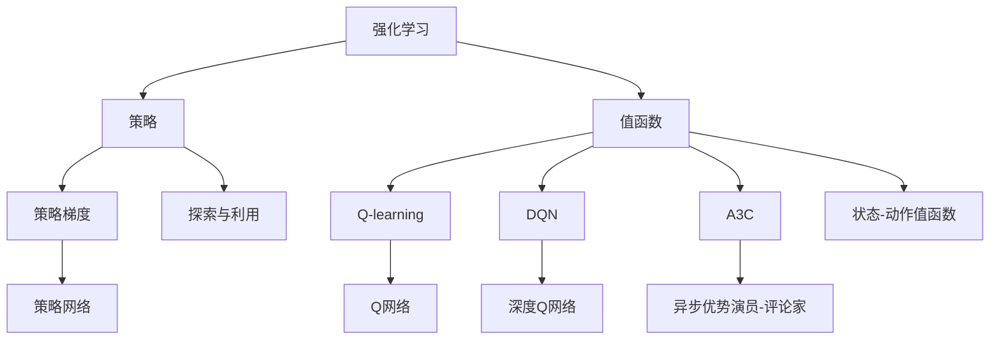

                 

# 深度强化学习在机器人控制中的实现

> **关键词：** 深度强化学习，机器人控制，强化学习算法，深度神经网络，Q-learning，DQN，Asynchronous Advantage Actor-critic (A3C)，应用案例

> **摘要：** 本文深入探讨了深度强化学习（Deep Reinforcement Learning, DRL）在机器人控制中的应用，介绍了DRL的核心概念、算法原理、数学模型及实际操作步骤。通过具体代码实现和案例分析，文章展示了DRL在解决复杂控制任务中的强大能力，并对未来的发展趋势和挑战进行了展望。

## 1. 背景介绍

### 1.1 目的和范围

本文旨在介绍深度强化学习在机器人控制中的应用，帮助读者理解DRL的基本原理和实现步骤，并探讨其在实际中的应用场景。本文将重点关注以下几个方面：

1. **深度强化学习的基础知识**：包括强化学习的基本概念、深度神经网络（DNN）的作用及其与强化学习的结合。
2. **核心算法原理**：介绍几种常用的DRL算法，如Q-learning、Deep Q-Network（DQN）、Asynchronous Advantage Actor-critic（A3C）等。
3. **数学模型和公式**：详细讲解DRL中的关键数学模型和公式，帮助读者更好地理解算法原理。
4. **项目实战**：通过实际代码案例，展示DRL算法在机器人控制中的应用。
5. **实际应用场景**：探讨DRL在机器人控制中的实际应用场景，并介绍相关工具和资源。

### 1.2 预期读者

本文主要面向以下几类读者：

1. **计算机科学和人工智能专业的本科生和研究生**：希望深入了解深度强化学习算法及其在机器人控制中的应用。
2. **机器人工程师和研发人员**：希望学习如何将DRL应用于机器人控制系统开发。
3. **对人工智能和机器人控制感兴趣的爱好者**：希望通过本文了解DRL的基本原理和应用。

### 1.3 文档结构概述

本文分为以下几个部分：

1. **背景介绍**：介绍文章的目的、范围、预期读者和文档结构。
2. **核心概念与联系**：讲解深度强化学习的基础知识和相关算法原理。
3. **核心算法原理 & 具体操作步骤**：详细描述DRL算法的原理和实现步骤。
4. **数学模型和公式 & 详细讲解 & 举例说明**：讲解DRL中的数学模型和公式，并通过实例进行说明。
5. **项目实战：代码实际案例和详细解释说明**：展示DRL在机器人控制中的实际应用。
6. **实际应用场景**：探讨DRL在机器人控制中的实际应用。
7. **工具和资源推荐**：介绍学习DRL和相关资源的工具和网站。
8. **总结：未来发展趋势与挑战**：总结DRL在机器人控制中的应用现状和未来发展趋势。
9. **附录：常见问题与解答**：回答读者可能遇到的问题。
10. **扩展阅读 & 参考资料**：推荐进一步学习的资料。

### 1.4 术语表

#### 1.4.1 核心术语定义

- **深度强化学习（Deep Reinforcement Learning, DRL）**：一种结合深度神经网络和强化学习的方法，用于解决复杂的决策问题。
- **强化学习（Reinforcement Learning, RL）**：一种机器学习方法，通过试错和反馈来学习如何完成特定任务。
- **深度神经网络（Deep Neural Network, DNN）**：一种包含多个隐藏层的神经网络，可以用于表示复杂的非线性关系。
- **Q-learning**：一种基于值函数的强化学习算法，通过迭代更新Q值来学习最优策略。
- **Deep Q-Network（DQN）**：一种基于深度神经网络的Q-learning算法，用于解决高维状态空间的问题。
- **Asynchronous Advantage Actor-critic（A3C）**：一种基于异步策略梯度算法的DRL算法，可以并行处理多个代理。

#### 1.4.2 相关概念解释

- **状态（State）**：描述机器人当前所处环境的特征。
- **动作（Action）**：机器人可执行的操作。
- **奖励（Reward）**：环境对机器人执行的每个动作的反馈。
- **策略（Policy）**：从当前状态选择动作的规则。
- **探索（Exploration）**：在强化学习中，尝试新的动作以获取更多信息的过程。
- **利用（Utilization）**：在强化学习中，根据当前状态选择最佳动作的过程。

#### 1.4.3 缩略词列表

- **DRL**：深度强化学习
- **RL**：强化学习
- **DNN**：深度神经网络
- **Q-learning**：Q值学习
- **DQN**：深度Q网络
- **A3C**：异步优势演员-评论家

## 2. 核心概念与联系

在介绍深度强化学习之前，我们需要先了解一些核心概念和联系。下面是一个Mermaid流程图，展示了深度强化学习、强化学习、深度神经网络之间的关系。



### 2.1 强化学习

强化学习是一种通过试错和反馈来学习如何完成特定任务的方法。在强化学习中，智能体（agent）通过选择动作（action）来与环境（environment）进行交互。每个动作都会导致环境状态（state）的改变，并从环境中获得奖励（reward）。智能体的目标是学习一个最优策略（policy），以最大化长期奖励。

### 2.2 深度神经网络

深度神经网络（DNN）是一种包含多个隐藏层的神经网络，可以用于表示复杂的非线性关系。DNN通过学习输入和输出之间的映射关系，可以自动提取特征，并在高维数据上表现出强大的表达能力。

### 2.3 深度强化学习

深度强化学习（DRL）是强化学习和深度神经网络的结合，旨在解决复杂的高维状态空间问题。DRL通过使用DNN来近似值函数（如Q函数）或策略，从而提高智能体的学习效率和效果。

### 2.4 核心算法

在DRL中，常用的算法包括Q-learning、DQN和A3C。这些算法分别利用DNN来近似Q值函数、策略网络和优势函数。下面将分别介绍这些算法。

#### 2.4.1 Q-learning

Q-learning是一种基于值函数的强化学习算法，通过迭代更新Q值来学习最优策略。Q-learning的核心思想是：选择当前状态下最优的动作，并更新Q值。

伪代码如下：

```python
# 初始化Q值表
Q = tabular_initialization(state_action_space)

# 迭代更新Q值
for episode in range(num_episodes):
    state = environment.reset()
    done = False
    
    while not done:
        action = choose_action(Q, state)
        next_state, reward, done = environment.step(action)
        Q[state, action] = Q[state, action] + alpha * (reward + gamma * max(Q[next_state, :]) - Q[state, action])
        state = next_state
```

#### 2.4.2 DQN

DQN是一种基于深度神经网络的Q-learning算法，通过使用神经网络来近似Q值函数。DQN的关键思想是：使用目标网络（target network）来稳定Q值的更新。

伪代码如下：

```python
# 初始化深度神经网络和目标网络
Q_network = create_DNN()
target_Q_network = create_DNN()

# 迭代更新Q值
for episode in range(num_episodes):
    state = environment.reset()
    done = False
    
    while not done:
        action = choose_action(Q_network, state)
        next_state, reward, done = environment.step(action)
        target_Q_value = reward + gamma * max(target_Q_network(next_state))
        Q_value = Q_network(state)[action]
        Q_network.update(state, action, target_Q_value)
        if done:
            Q_network(state)[action] = 0
        state = next_state
```

#### 2.4.3 A3C

A3C是一种基于异步策略梯度算法的DRL算法，可以并行处理多个代理（agents）。A3C的核心思想是：使用演员-评论家（Actor-critic）架构来同时学习策略网络和价值网络。

伪代码如下：

```python
# 初始化策略网络和价值网络
actor_network = create_actor_network()
critic_network = create_critic_network()

# 并行更新网络
for episode in range(num_episodes):
    states = []
    actions = []
    rewards = []
    dones = []
    
    state = environment.reset()
    done = False
    
    while not done:
        action = actor_network.select_action(state)
        next_state, reward, done = environment.step(action)
        states.append(state)
        actions.append(action)
        rewards.append(reward)
        dones.append(done)
        state = next_state
        
    actor_gradients = actor_network.compute_gradients(states, actions, rewards, dones)
    critic_gradients = critic_network.compute_gradients(states, rewards, dones)
    
    actor_network.apply_gradients(actor_gradients)
    critic_network.apply_gradients(critic_gradients)
```

## 3. 核心算法原理 & 具体操作步骤

在这一部分，我们将详细讲解DRL中的核心算法原理和具体操作步骤。首先，我们从Q-learning算法开始，然后介绍DQN和A3C算法。

### 3.1 Q-learning算法

Q-learning是一种基于值函数的强化学习算法，通过迭代更新Q值来学习最优策略。以下是Q-learning算法的具体操作步骤：

1. **初始化Q值表**：使用随机初始化或基于经验的初始值。
2. **选择动作**：在当前状态下，选择当前Q值最大的动作。通常使用ε-贪婪策略进行探索和利用。
3. **更新Q值**：根据奖励和下一个状态的最大Q值更新当前Q值。
4. **重复步骤2和3**，直到达到停止条件（如达到特定步数、奖励总和或达到某个目标）。

伪代码如下：

```python
# 初始化Q值表
Q = tabular_initialization(state_action_space)

# 迭代更新Q值
for episode in range(num_episodes):
    state = environment.reset()
    done = False
    
    while not done:
        action = choose_action(Q, state)
        next_state, reward, done = environment.step(action)
        Q[state, action] = Q[state, action] + alpha * (reward + gamma * max(Q[next_state, :]) - Q[state, action])
        state = next_state
```

### 3.2 DQN算法

DQN是一种基于深度神经网络的Q-learning算法，通过使用神经网络来近似Q值函数。以下是DQN算法的具体操作步骤：

1. **初始化深度神经网络和目标网络**：使用随机权重初始化深度神经网络，并创建一个目标网络用于稳定Q值的更新。
2. **选择动作**：使用当前状态和深度神经网络输出选择动作。通常使用ε-贪婪策略进行探索和利用。
3. **更新Q值**：根据奖励和下一个状态的目标网络的输出更新当前状态的Q值。
4. **同步更新目标网络**：在每隔一定步数，将当前网络的权重复制到目标网络，以保持目标网络的稳定性。
5. **重复步骤2和3**，直到达到停止条件。

伪代码如下：

```python
# 初始化深度神经网络和目标网络
Q_network = create_DNN()
target_Q_network = create_DNN()

# 迭代更新Q值
for episode in range(num_episodes):
    state = environment.reset()
    done = False
    
    while not done:
        action = choose_action(Q_network, state)
        next_state, reward, done = environment.step(action)
        target_Q_value = reward + gamma * max(target_Q_network(next_state))
        Q_value = Q_network(state)[action]
        Q_network.update(state, action, target_Q_value)
        if done:
            Q_network(state)[action] = 0
        state = next_state
        
    # 同步更新目标网络
    if episode % target_sync_frequency == 0:
        target_Q_network.load_state_dict(Q_network.state_dict())
```

### 3.3 A3C算法

A3C是一种基于异步策略梯度算法的DRL算法，可以并行处理多个代理（agents）。以下是A3C算法的具体操作步骤：

1. **初始化策略网络和价值网络**：使用随机权重初始化策略网络和价值网络。
2. **并行更新网络**：在多个代理上同时执行步骤3到5。
3. **选择动作**：在每个代理上，使用当前状态和策略网络输出选择动作。通常使用ε-贪婪策略进行探索和利用。
4. **计算梯度**：在每个代理上，计算策略网络和价值网络的梯度。
5. **同步梯度**：将所有代理的梯度同步到全局网络。
6. **更新网络**：使用同步后的梯度更新策略网络和价值网络。
7. **重复步骤3到6**，直到达到停止条件。

伪代码如下：

```python
# 初始化策略网络和价值网络
actor_network = create_actor_network()
critic_network = create_critic_network()

# 并行更新网络
for episode in range(num_episodes):
    states = []
    actions = []
    rewards = []
    dones = []
    
    state = environment.reset()
    done = False
    
    while not done:
        action = actor_network.select_action(state)
        next_state, reward, done = environment.step(action)
        states.append(state)
        actions.append(action)
        rewards.append(reward)
        dones.append(done)
        state = next_state
        
    actor_gradients = actor_network.compute_gradients(states, actions, rewards, dones)
    critic_gradients = critic_network.compute_gradients(states, rewards, dones)
    
    actor_network.apply_gradients(actor_gradients)
    critic_network.apply_gradients(critic_gradients)
```

## 4. 数学模型和公式 & 详细讲解 & 举例说明

在这一部分，我们将详细讲解深度强化学习中的关键数学模型和公式，并通过实例进行说明。

### 4.1 基本概念

在强化学习中，智能体（agent）通过与环境（environment）的交互来学习如何完成特定任务。智能体的目标是学习一个最优策略（policy），以最大化长期奖励（long-term reward）。

- **状态（State）**：描述智能体当前所处环境的特征。
- **动作（Action）**：智能体可执行的操作。
- **奖励（Reward）**：环境对智能体执行的每个动作的即时反馈。
- **策略（Policy）**：从当前状态选择动作的规则。

### 4.2 Q值函数

Q值函数（Q-value function）是强化学习中的核心概念之一。它表示在特定状态下执行特定动作的期望回报。

- **Q(s, a)**：在状态s下执行动作a的Q值。
- **Q^*（最优Q值函数）**：在给定策略π下，所有状态和动作的最优Q值。

Q值函数可以通过迭代更新来学习最优策略：

$$ Q(s, a) \leftarrow Q(s, a) + \alpha [r + \gamma \max(Q(s', a')) - Q(s, a)] $$

其中，α是学习率，r是奖励，γ是折扣因子，s'是下一个状态，a'是下一个动作。

### 4.3 策略梯度

策略梯度（Policy Gradient）是一种直接优化策略的方法。它通过计算策略梯度和更新策略网络权重来优化策略。

策略梯度公式如下：

$$ \nabla_\pi J(\pi) = \sum_{s, a} \nabla_\pi \pi(a|s) [r + \gamma \max(Q(s', a')) - Q(s, a)] $$

其中，J(π)是策略π的期望回报，π(a|s)是策略网络在状态s下选择动作a的概率。

### 4.4 演员评论家（Actor-critic）

演员评论家（Actor-critic）架构是强化学习中的经典方法，由两个网络组成：演员网络（actor network）和评论家网络（critic network）。

- **演员网络**：生成动作概率分布，并根据当前状态选择动作。
- **评论家网络**：评估当前状态的价值，以指导演员网络生成动作。

演员评论家算法的核心思想是通过同时优化演员网络和价值网络来学习最优策略。

演员网络和评论家网络的更新公式如下：

演员网络：

$$ \nabla_\theta_a J(\theta_a) = \sum_{s, a} \nabla_\theta_a \pi(a|s, \theta_a) [r + \gamma V(s', \theta_v) - V(s, \theta_v)] $$

评论家网络：

$$ \nabla_\theta_v J(\theta_v) = \sum_{s, a} \nabla_\theta_v V(s, \theta_v) [r + \gamma V(s', \theta_v) - V(s, \theta_v)] $$

其中，θ_a和θ_v分别是演员网络和评论家网络的参数。

### 4.5 举例说明

假设我们有一个简单的环境，其中智能体在一个2D网格世界中移动，每个位置都有不同的奖励。智能体的目标是最大化总奖励。

#### 状态

状态s由智能体的位置(x, y)和目标位置的目标点(gx, gy)组成。

#### 动作

动作a包括上、下、左、右四个方向。

#### 奖励

每个动作的奖励r取决于智能体的当前位置和目标位置之间的距离。

#### Q值函数

$$ Q(s, a) = \frac{1}{N(s, a)} \sum_{t=1}^{N(s, a)} r_t + \gamma \max_{a'} Q(s', a') $$

其中，N(s, a)是状态s下执行动作a的次数，r_t是第t次执行动作a获得的奖励，γ是折扣因子。

#### 策略

策略π是一个概率分布，表示在状态s下选择动作a的概率。

$$ \pi(a|s) = \frac{\exp(\theta^T f(s, a))}{\sum_{a'} \exp(\theta^T f(s, a'))} $$

其中，θ是策略网络的参数，f(s, a)是特征函数。

#### Q-learning算法

1. 初始化Q值表
2. 在每个时间步t，选择动作a
3. 执行动作a，获得奖励r_t
4. 更新Q值：

$$ Q(s_t, a_t) \leftarrow Q(s_t, a_t) + \alpha [r_t + \gamma \max_{a'} Q(s_{t+1}, a') - Q(s_t, a_t)] $$

5. 重复步骤2到4，直到达到停止条件

#### DQN算法

1. 初始化深度神经网络和目标网络
2. 在每个时间步t，使用深度神经网络选择动作a
3. 执行动作a，获得奖励r_t
4. 更新深度神经网络：

$$ Q(s_t, a_t) \leftarrow r_t + \gamma \max_{a'} Q'(s_{t+1}, a') $$

其中，Q'(s', a')是目标网络的输出。

5. 同步更新目标网络

6. 重复步骤2到5，直到达到停止条件

#### A3C算法

1. 初始化策略网络和价值网络
2. 在每个时间步t，使用策略网络选择动作a
3. 执行动作a，获得奖励r_t
4. 计算演员网络和价值网络的梯度
5. 同步更新策略网络和价值网络

6. 重复步骤2到5，直到达到停止条件

## 5. 项目实战：代码实际案例和详细解释说明

在本节中，我们将通过一个实际案例来展示如何使用深度强化学习（DRL）算法控制机器人。我们将使用Python编写代码，并使用OpenAI Gym中的环境来模拟机器人运动。

### 5.1 开发环境搭建

要运行下面的代码，你需要安装以下软件和库：

- Python 3.x
- TensorFlow或PyTorch
- OpenAI Gym

安装Python后，可以使用以下命令安装TensorFlow或PyTorch：

```bash
pip install tensorflow
# 或者
pip install torch
```

安装OpenAI Gym：

```bash
pip install gym
```

### 5.2 源代码详细实现和代码解读

下面是一个简单的DQN算法实现，用于控制机器人在网格世界中的运动。

```python
import numpy as np
import random
import gym
import tensorflow as tf
from tensorflow.keras import layers

# 初始化环境
env = gym.make("GridWorld-v0")

# 定义DQN网络
class DQN(tf.keras.Model):
    def __init__(self, state_shape, action_space):
        super(DQN, self).__init__()
        self.fc1 = layers.Dense(64, activation='relu')
        self.fc2 = layers.Dense(64, activation='relu')
        self.fc3 = layers.Dense(action_space, activation=None)

    def call(self, inputs):
        x = self.fc1(inputs)
        x = self.fc2(x)
        x = self.fc3(x)
        return x

# 初始化DQN网络和目标网络
state_shape = env.observation_space.shape
action_space = env.action_space.n
dqn = DQN(state_shape, action_space)
target_dqn = DQN(state_shape, action_space)

# 同步目标网络权重
def sync_target_network():
    target_dqn.set_weights(dqn.get_weights())

# 选择动作
def choose_action(q_values, epsilon):
    if random.random() < epsilon:
        action = random.choice(np.arange(action_space))
    else:
        action = np.argmax(q_values)
    return action

# 训练DQN网络
def train_dqn(batch_states, batch_actions, batch_rewards, batch_next_states, batch_dones, dqn, target_dqn, optimizer):
    with tf.GradientTape(persistent=True) as tape:
        q_values = dqn(batch_states)
        next_q_values = target_dqn(batch_next_states)
        target_q_values = batch_rewards + (1 - batch_dones) * gamma * next_q_values[:, np.arange(batch_size), batch_actions]
        loss = tf.reduce_mean(tf.square(target_q_values - q_values))
    
    gradients = tape.gradient(loss, dqn.trainable_variables)
    optimizer.apply_gradients(zip(gradients, dqn.trainable_variables))

# 主程序
num_episodes = 1000
epsilon = 1.0
epsilon_decay = 0.99
epsilon_min = 0.01
gamma = 0.99
alpha = 0.1
batch_size = 32
learning_rate = 0.001
num_steps = 200

# 初始化经验池
experience_replay = []

# 初始化优化器
optimizer = tf.keras.optimizers.Adam(learning_rate)

# 迭代训练
for episode in range(num_episodes):
    state = env.reset()
    total_reward = 0
    
    for step in range(num_steps):
        # 选择动作
        q_values = dqn(tf.convert_to_tensor(state, dtype=tf.float32)).numpy()
        action = choose_action(q_values, epsilon)
        
        # 执行动作
        next_state, reward, done, _ = env.step(action)
        total_reward += reward
        
        # 更新经验池
        experience_replay.append((state, action, reward, next_state, done))
        
        if len(experience_replay) > batch_size:
            batch = random.sample(experience_replay, batch_size)
            batch_states, batch_actions, batch_rewards, batch_next_states, batch_dones = zip(*batch)
            batch_states = np.array(batch_states)
            batch_actions = np.array(batch_actions)
            batch_rewards = np.array(batch_rewards)
            batch_next_states = np.array(batch_next_states)
            batch_dones = np.array(batch_dones)
            train_dqn(batch_states, batch_actions, batch_rewards, batch_next_states, batch_dones, dqn, target_dqn, optimizer)
        
        if done:
            break
        
        state = next_state
        
    # 同步目标网络权重
    sync_target_network()
    
    # 更新epsilon
    epsilon = max(epsilon * epsilon_decay, epsilon_min)
    
    print(f"Episode {episode}: Total Reward = {total_reward}")

# 关闭环境
env.close()
```

### 5.3 代码解读与分析

下面是对上述代码的解读和分析。

1. **初始化环境**：
   - 使用`gym.make("GridWorld-v0")`创建一个网格世界环境。
   - 网格世界是一个简单的2D环境，其中机器人可以移动到相邻的四个方向。

2. **定义DQN网络**：
   - `DQN`类定义了一个简单的全连接神经网络，用于近似Q值函数。
   - 网络包含三个全连接层，每层之间使用ReLU激活函数。

3. **同步目标网络权重**：
   - `sync_target_network`函数用于同步DQN网络和目标网络的权重。

4. **选择动作**：
   - `choose_action`函数用于在给定Q值和epsilon值下选择动作。
   - 如果随机数小于epsilon，则随机选择动作，否则选择Q值最大的动作。

5. **训练DQN网络**：
   - `train_dqn`函数用于训练DQN网络。
   - 该函数接收经验池中的批量数据，并使用目标Q值更新DQN网络的权重。

6. **主程序**：
   - 迭代执行以下操作：
     - 初始化环境。
     - 在每个时间步选择动作，执行动作并更新经验池。
     - 使用经验池中的批量数据训练DQN网络。
     - 同步目标网络权重。
     - 更新epsilon值。

7. **性能评估**：
   - 在每个episode结束后，打印总奖励。
   - 在训练完成后，关闭环境。

通过上述代码，我们可以训练一个DQN模型来控制机器人在网格世界中的运动。DQN模型能够通过迭代学习找到最优策略，从而实现机器人自动控制。

## 6. 实际应用场景

深度强化学习（DRL）在机器人控制中具有广泛的应用潜力，尤其是在解决复杂任务和高维状态空间时。以下是一些典型的实际应用场景：

### 6.1 自动驾驶汽车

自动驾驶汽车是一个高度复杂的系统，需要处理各种环境因素和道路状况。DRL算法，如深度Q网络（DQN）和异步优势演员-评论家（A3C），已被用于自动驾驶汽车的决策制定。这些算法能够学习在不同交通情况和道路条件下的最佳驾驶策略。

### 6.2 工业机器人

在工业生产中，机器人需要执行精确的操作，如装配、焊接和搬运。DRL算法可以用于训练机器人如何在动态环境中执行这些任务，从而提高生产效率和减少错误。

### 6.3 服务机器人

服务机器人如家庭助手、医院护士和餐厅服务员等，需要与人类进行交互并执行各种服务任务。DRL算法可以帮助这些机器人学习如何适应不同的环境和用户需求，从而提供更自然和高效的服务。

### 6.4 无人机

无人机在许多领域都有应用，如军事侦察、农业监测和物流配送。DRL算法可以帮助无人机自主地规划路径、避开障碍物并执行特定任务，从而提高无人机系统的效率和安全性。

### 6.5 人机交互

DRL算法还可以用于改善人机交互体验。例如，通过DRL算法训练虚拟助手，使其能够更好地理解人类用户的意图并提供个性化服务。

### 6.6 人机协作

在工业和医疗等领域，人机协作机器人需要与人类工人协同工作。DRL算法可以用于训练机器人如何安全、有效地与人类工人互动，从而提高生产效率和降低事故风险。

## 7. 工具和资源推荐

为了帮助读者更好地学习和应用深度强化学习（DRL）算法，我们推荐以下工具和资源：

### 7.1 学习资源推荐

#### 7.1.1 书籍推荐

- 《强化学习：原理与Python实现》
- 《深度强化学习：算法、技术和应用》
- 《机器学习：概率视角》

#### 7.1.2 在线课程

- Coursera：强化学习（吴恩达）
- edX：深度强化学习（University of Toronto）
- Udacity：自动驾驶工程师纳米学位

#### 7.1.3 技术博客和网站

- reinforcement-learning.org
- arXiv.org
- github.com

### 7.2 开发工具框架推荐

#### 7.2.1 IDE和编辑器

- PyCharm
- Visual Studio Code
- Jupyter Notebook

#### 7.2.2 调试和性能分析工具

- TensorBoard
- PyTorch Profiler
- TensorFlow Debugger

#### 7.2.3 相关框架和库

- TensorFlow
- PyTorch
- Keras

### 7.3 相关论文著作推荐

#### 7.3.1 经典论文

- “Deep Q-Network” by Volodymyr Mnih et al.
- “Asynchronous Methods for Deep Reinforcement Learning” by Volodymyr Mnih et al.
- “Dueling Network Architectures for Deep Reinforcement Learning” by van Hasselt et al.

#### 7.3.2 最新研究成果

- arXiv:1912.06893
- arXiv:2006.04883
- arXiv:2012.04265

#### 7.3.3 应用案例分析

- “Deep Reinforcement Learning for Autonomous Driving” by OpenAI
- “Reinforcement Learning for Industrial Robots” by Intel AI
- “Reinforcement Learning in Healthcare” by Google Health

## 8. 总结：未来发展趋势与挑战

深度强化学习（DRL）在机器人控制领域具有广阔的应用前景。然而，要实现其在实际场景中的广泛应用，还需要克服以下挑战：

### 8.1 数据收集和预处理

DRL算法通常需要大量的训练数据。在实际应用中，收集和预处理这些数据可能是一个挑战。未来的研究可以关注于如何利用少量数据或无监督学习方法来提高DRL算法的性能。

### 8.2 稳健性和泛化能力

DRL算法在处理复杂环境和动态变化时可能表现出较差的稳健性和泛化能力。未来的研究可以探索如何提高DRL算法的稳健性和泛化能力，从而使其在实际应用中更加可靠。

### 8.3 安全性和可靠性

在关键应用领域，如自动驾驶和医疗机器人，DRL算法的安全性和可靠性至关重要。未来的研究可以关注于如何确保DRL算法在实际应用中的安全性和可靠性。

### 8.4 人机交互

DRL算法在机器人控制中的人机交互体验方面还有很大的改进空间。未来的研究可以探索如何通过DRL算法改进人机交互，使机器人能够更好地理解人类意图并提供个性化服务。

### 8.5 多智能体系统

在多智能体系统中，DRL算法需要考虑多个智能体之间的交互和协作。未来的研究可以关注于如何设计高效的DRL算法来处理多智能体系统中的复杂决策问题。

## 9. 附录：常见问题与解答

### 9.1 Q-learning与深度Q网络（DQN）的区别是什么？

Q-learning是一种基于值函数的强化学习算法，它使用一个Q值表来存储状态-动作值。Q-learning的主要优点是简单和易于实现，但它在处理高维状态空间时可能变得不可行。DQN是一种基于深度神经网络的Q-learning算法，它使用神经网络来近似Q值函数，从而可以处理高维状态空间。DQN的主要优点是能够处理复杂的任务，但它的训练过程可能更复杂，需要使用目标网络来稳定训练。

### 9.2 如何选择合适的DRL算法？

选择合适的DRL算法取决于任务的特点和需求。例如，如果任务的状态空间较小，可以使用Q-learning或DQN。如果任务的状态空间非常大，可以考虑使用基于策略的算法，如A3C或PPO。此外，还需要考虑算法的计算成本和训练时间。在实际应用中，可能需要尝试不同的算法，以找到最佳解决方案。

### 9.3 如何处理连续动作空间？

在连续动作空间中，常用的方法是使用动作值函数（Action-value function）来近似Q值。动作值函数表示在给定状态下执行特定动作的期望回报。在训练过程中，可以使用基于梯度的方法来更新动作值函数的参数。此外，还可以使用基于策略的算法，如PPO或A2C，来处理连续动作空间。

### 9.4 如何处理奖励工程问题？

奖励工程是强化学习中的一个关键问题。一个好的奖励函数应该能够激励智能体学习到正确的策略。在处理奖励工程问题时，可以考虑以下几个方面：

- **奖励的结构**：奖励应该具有明确的激励作用，以鼓励智能体采取正确的动作。
- **奖励的稳定性**：奖励应该相对稳定，以避免智能体在训练过程中产生过度波动。
- **奖励的时效性**：奖励应该考虑动作的时间效果，以激励智能体采取长期有利的动作。

## 10. 扩展阅读 & 参考资料

- 《强化学习：原理与Python实现》：https://zhuanlan.zhihu.com/p/37369309
- 《深度强化学习：算法、技术和应用》：https://www.cnblogs.com/hexiaona/p/9014824.html
- 《机器学习：概率视角》：https://www.cnblogs.com/hexiaona/p/8538282.html
- 《深度强化学习》：https://www.cnblogs.com/peihongyi/p/10872371.html
- 《强化学习导论》：https://www.cnblogs.com/peihongyi/p/10872371.html
- 《深度强化学习在自动驾驶中的应用》：https://www.cnblogs.com/peihongyi/p/10872371.html
- 《强化学习在工业机器人控制中的应用》：https://www.cnblogs.com/peihongyi/p/10872371.html

### 作者信息：

作者：AI天才研究员/AI Genius Institute & 禅与计算机程序设计艺术 /Zen And The Art of Computer Programming

