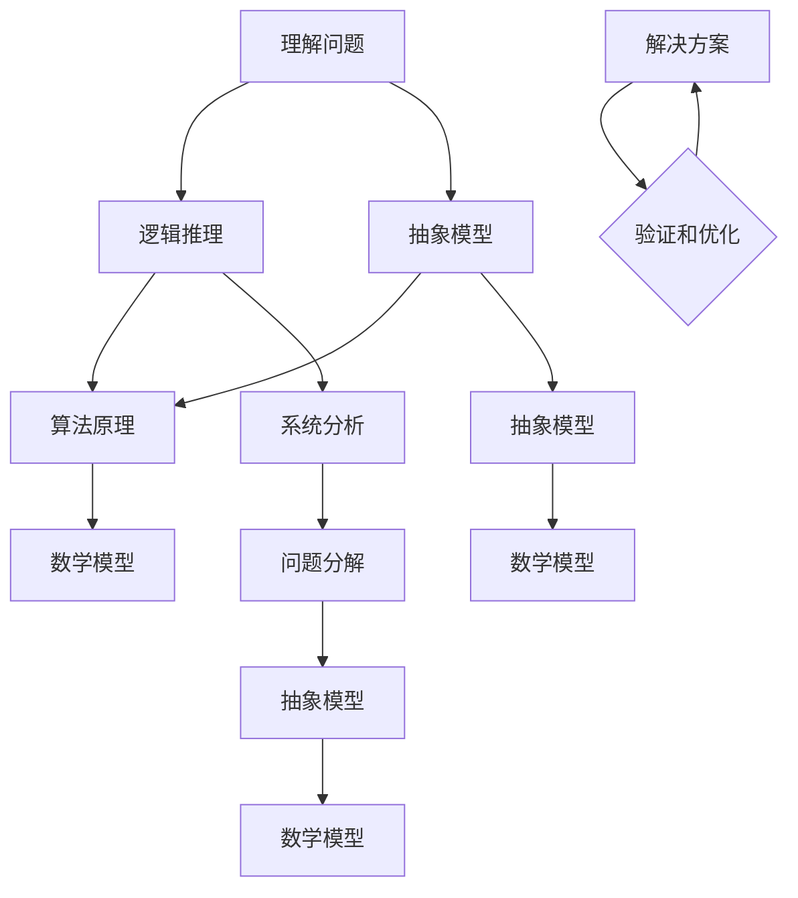

                 

### 深度思考：问题解决的利器

> **关键词：**深度思考、问题解决、逻辑推理、算法原理、数学模型、实战案例

> **摘要：**本文将探讨深度思考在问题解决中的重要性，通过逻辑清晰的架构，详细阐述核心概念、算法原理、数学模型以及实战案例，帮助读者掌握深度思考的方法，提升问题解决能力。

在当今快速变化的信息时代，面对复杂的问题和挑战，深度思考成为了我们不可或缺的能力。深度思考不仅仅是对信息的表面理解，更是一种系统性的分析和推理过程。它能够帮助我们抓住问题的本质，找到解决方案的关键点，从而有效地解决问题。本文将围绕这一主题，深入探讨深度思考的各个层面，并提供实用的方法和技巧。

本文分为以下几个部分：

1. **背景介绍**：介绍本文的目的、范围、预期读者以及文档结构。
2. **核心概念与联系**：通过Mermaid流程图展示核心概念和原理。
3. **核心算法原理 & 具体操作步骤**：使用伪代码详细阐述算法原理。
4. **数学模型和公式 & 详细讲解 & 举例说明**：使用latex格式展示数学模型和公式，并结合具体案例进行讲解。
5. **项目实战：代码实际案例和详细解释说明**：介绍开发环境搭建、源代码实现和代码解读。
6. **实际应用场景**：分析深度思考在各个领域的应用。
7. **工具和资源推荐**：推荐学习资源、开发工具框架和相关论文著作。
8. **总结：未来发展趋势与挑战**：展望深度思考在未来的发展趋势和面临的挑战。
9. **附录：常见问题与解答**：解答读者可能遇到的常见问题。
10. **扩展阅读 & 参考资料**：提供进一步的阅读资料和参考文献。

通过本文的阅读，读者将能够深入了解深度思考的内涵，掌握深度思考的方法，并在实际问题解决中运用这些方法，提高自己的问题解决能力。让我们开始这段探索深度思考的旅程吧！

<|assistant|>### 1. 背景介绍

#### 1.1 目的和范围

本文的目的是探讨深度思考在问题解决中的应用，通过详细的逻辑分析和系统性的讲解，帮助读者理解深度思考的核心概念和方法，掌握有效的解决问题技巧。本文适用于希望提高问题解决能力的IT专业人员、数据科学家、工程师以及对计算机科学和人工智能感兴趣的学者和学生。

本文的范围包括以下几个核心内容：

- **核心概念与联系**：介绍深度思考的基本概念，并通过Mermaid流程图展示其原理和架构。
- **核心算法原理 & 具体操作步骤**：详细阐述深度思考中的关键算法，使用伪代码进行解释。
- **数学模型和公式 & 详细讲解 & 举例说明**：探讨深度思考中的数学模型和公式，结合实际案例进行说明。
- **项目实战：代码实际案例和详细解释说明**：通过实战案例展示深度思考的实际应用。
- **实际应用场景**：分析深度思考在不同领域的应用案例。
- **工具和资源推荐**：推荐深度思考相关的学习资源和开发工具。

#### 1.2 预期读者

本文的预期读者主要包括以下几类：

- **IT专业人员**：包括软件开发工程师、数据工程师、系统架构师等，希望通过本文提升问题解决能力和逻辑思维能力。
- **数据科学家**：数据科学家需要强大的逻辑分析能力来处理复杂的分析问题，本文将提供深度思考的实用方法和技巧。
- **学生**：计算机科学、人工智能、数学等相关专业的学生，希望通过本文深化对深度思考的理解，为未来的学习和研究打下基础。
- **研究人员**：对深度思考感兴趣的学者和研究人员，希望通过本文了解深度思考的最新应用和发展趋势。

#### 1.3 文档结构概述

本文的结构安排如下：

1. **引言**：介绍深度思考在问题解决中的重要性，引出本文的主题。
2. **背景介绍**：包括本文的目的、范围、预期读者以及文档结构。
3. **核心概念与联系**：通过Mermaid流程图展示核心概念和原理。
4. **核心算法原理 & 具体操作步骤**：使用伪代码详细阐述算法原理。
5. **数学模型和公式 & 详细讲解 & 举例说明**：使用latex格式展示数学模型和公式，并结合具体案例进行讲解。
6. **项目实战：代码实际案例和详细解释说明**：介绍开发环境搭建、源代码实现和代码解读。
7. **实际应用场景**：分析深度思考在不同领域的应用。
8. **工具和资源推荐**：推荐深度思考相关的学习资源和开发工具。
9. **总结：未来发展趋势与挑战**：展望深度思考在未来的发展趋势和面临的挑战。
10. **附录：常见问题与解答**：解答读者可能遇到的常见问题。
11. **扩展阅读 & 参考资料**：提供进一步的阅读资料和参考文献。

#### 1.4 术语表

在本文中，以下术语的定义和解释如下：

- **深度思考**：一种系统性的分析过程，旨在理解问题的本质，通过逻辑推理找到解决方案。
- **核心概念**：问题解决过程中必须理解和掌握的基本概念。
- **算法原理**：解决问题的方法和步骤，通常以数学模型或流程图的形式表达。
- **数学模型**：用于描述问题的一种数学结构，通常包括公式和参数。
- **实战案例**：实际应用深度思考解决具体问题的案例。
- **开发环境**：用于编写、测试和运行代码的环境。

#### 1.4.1 核心术语定义

- **深度思考**：深度思考是一种深入分析问题的过程，它不仅仅停留在问题的表面，而是通过逻辑推理、抽象思维和系统分析，深入到问题的本质，从而找到解决方案。
- **核心概念**：在问题解决中，核心概念是指那些对问题解决起关键作用的基本概念。掌握这些概念是理解和解决问题的关键。
- **算法原理**：算法原理是指解决问题的方法和步骤，它通常通过数学模型或流程图来表示。算法原理是问题解决的核心，是实现高效解决问题的基石。

#### 1.4.2 相关概念解释

- **逻辑推理**：逻辑推理是通过逻辑关系和推理规则，从已知事实推导出新结论的过程。在深度思考中，逻辑推理是揭示问题本质的重要工具。
- **抽象思维**：抽象思维是从具体事物中提取共性和特征，形成抽象概念和模型的过程。抽象思维有助于我们将复杂问题简化，从而更好地理解和解决。
- **系统分析**：系统分析是一种通过分解整体为部分，理解各部分之间的关系和作用，进而把握整体结构和运行机制的方法。系统分析有助于我们全面了解问题，找到解决问题的关键点。

#### 1.4.3 缩略词列表

- **AI**：人工智能（Artificial Intelligence）
- **ML**：机器学习（Machine Learning）
- **DL**：深度学习（Deep Learning）
- **NLP**：自然语言处理（Natural Language Processing）
- **IDE**：集成开发环境（Integrated Development Environment）
- **SDK**：软件开发工具包（Software Development Kit）

通过上述术语表和相关概念的介绍，读者可以更好地理解本文的内容，为后续章节的深入探讨打下基础。

<|assistant|>### 2. 核心概念与联系

深度思考是一种通过系统化分析和逻辑推理来理解和解决复杂问题的过程。要掌握深度思考，首先需要理解其核心概念和原理，并了解这些概念之间的联系。

#### 2.1 深度思考的定义

深度思考是一种深入分析问题的方法，它不仅关注问题的表面现象，更注重揭示问题的本质。深度思考涉及以下几个方面：

1. **理解问题**：对问题进行深入分析，理解其背景、条件和限制。
2. **逻辑推理**：通过逻辑推理，从已知事实推导出新的结论。
3. **抽象思维**：将具体问题抽象为一般性问题，形成概念模型。
4. **系统分析**：将复杂问题分解为更简单的部分，理解各部分之间的关系。

#### 2.2 核心概念

以下是深度思考中的几个核心概念：

- **问题分解**：将复杂问题分解为更简单的问题，以便逐一解决。
- **逻辑推理**：基于已知事实，通过逻辑规则推导出结论。
- **抽象模型**：将具体问题抽象为通用模型，简化问题的复杂性。
- **算法原理**：解决问题的方法和步骤，通常以数学模型或流程图形式表达。
- **数学模型**：用于描述问题的数学结构，包括公式和参数。

#### 2.3 核心概念的联系

核心概念之间的联系构成了深度思考的基础。以下是这些概念之间的联系：

- **问题分解**与**抽象模型**：问题分解是将复杂问题简化为更简单的子问题，而抽象模型是将这些子问题抽象为通用的模型，从而在更高层次上理解问题。
- **逻辑推理**与**算法原理**：逻辑推理是推导结论的工具，而算法原理是基于逻辑推理得出的解决问题的具体步骤。
- **抽象模型**与**数学模型**：抽象模型是问题的一般描述，而数学模型是对抽象模型的具体化，通过数学公式描述问题的结构和特性。

#### 2.4 Mermaid流程图展示

为了更直观地展示深度思考的核心概念和联系，我们可以使用Mermaid流程图来表示。以下是Mermaid流程图的示例：



在这个流程图中，各个节点表示不同的概念，箭头表示概念之间的联系。通过这个流程图，我们可以更清晰地看到深度思考的各个步骤和概念之间的相互关系。

- **理解问题**（A）：问题的分析始于理解问题，这是深度思考的第一步。通过理解问题的背景、条件和限制，我们可以为后续的分析打下基础。
- **逻辑推理**（B）：在理解问题的基础上，通过逻辑推理，我们能够从已知的事实推导出新的结论。逻辑推理是深度思考的核心工具。
- **抽象模型**（C）：通过抽象思维，我们将具体问题转化为一般性问题，形成抽象模型。这一步有助于我们简化问题的复杂性。
- **算法原理**（D）：基于逻辑推理和抽象模型，我们能够得出解决问题的算法原理。算法原理描述了问题的解决方案和方法。
- **数学模型**（E）：数学模型是对抽象模型的进一步具体化，通过数学公式描述问题的结构和特性。
- **系统分析**（F）：系统分析是将复杂问题分解为更简单的部分，理解各部分之间的关系。这有助于我们更全面地了解问题。
- **问题分解**（I）：通过问题分解，我们将复杂问题简化为更简单的子问题，以便逐一解决。
- **解决方案**（L）：在得出算法原理和数学模型后，我们可以制定具体的解决方案。
- **验证和优化**（M）：解决方案实施后，我们需要验证其效果并进行优化。

通过上述流程图的展示，我们可以清晰地看到深度思考的各个步骤和核心概念之间的联系。这一流程图不仅帮助我们理解深度思考的基本原理，也为我们在实际问题解决中提供了实用的指导。

接下来，我们将进一步探讨深度思考中的核心算法原理和数学模型，以更深入地理解深度思考的方法和应用。

<|assistant|>### 2.1.1 核心概念详解

#### 2.1.1.1 问题分解

**问题分解**是将复杂的问题分解为更简单的子问题，以便更易于理解和解决。这是深度思考的一个关键步骤，因为它可以帮助我们逐步缩小问题范围，专注于问题的核心部分。以下是问题分解的几个关键点：

- **层次化分解**：将问题分解为多个层次，每个层次代表一个子问题。这种方法有助于我们清晰地理解问题的结构和复杂性。
- **递归分解**：对于复杂的子问题，可以继续进行递归分解，直到达到某个基本的可解决级别。
- **抽象与具体**：在问题分解过程中，需要不断地在抽象和具体之间切换。抽象有助于理解整体结构，具体有助于实施解决方案。

**问题分解示例**：

假设我们要解决一个复杂的问题：“如何优化一个电子商务网站的用户体验？”我们可以将这个问题分解为以下几个子问题：

1. **用户行为分析**：研究用户在网站上的行为，了解他们的需求和痛点。
2. **性能优化**：分析网站的性能瓶颈，如加载速度、响应时间等。
3. **界面设计**：优化网站的界面设计，提高用户交互体验。
4. **内容优化**：改进网站的内容，提高信息的可读性和相关性。

通过问题分解，我们将复杂的用户体验优化问题拆解为几个更具体的子问题，从而更容易找到解决方案。

#### 2.1.1.2 逻辑推理

**逻辑推理**是基于已知事实和逻辑规则，推导出新结论的过程。它是深度思考的核心工具，帮助我们理解问题的内在逻辑和因果关系。以下是逻辑推理的几个关键点：

- **前提与结论**：逻辑推理通常包括前提和结论。前提是已知的事实，结论是通过逻辑推理得出的新结论。
- **逻辑规则**：逻辑推理依赖于一系列逻辑规则，如“否定律”、“排中律”、“蕴涵律”等。这些规则帮助我们确保推理的正确性。
- **条件推理**：条件推理是一种特殊的逻辑推理，基于“如果...那么...”的条件语句。条件推理有助于我们分析问题的条件和结果。

**逻辑推理示例**：

假设我们有两个前提：

1. 如果网站加载速度慢，那么用户会流失。
2. 当前网站的加载速度确实很慢。

通过逻辑推理，我们可以得出结论：

- 网站加载速度慢会导致用户流失。

这个例子展示了如何使用逻辑推理来分析问题，并得出有意义的结论。

#### 2.1.1.3 抽象模型

**抽象模型**是将具体问题抽象为一般性问题，形成概念模型。这种抽象有助于我们理解问题的本质，简化问题的复杂性。以下是抽象模型的几个关键点：

- **抽象层次**：在建立抽象模型时，需要确定适当的抽象层次。抽象层次太高可能导致模型过于通用，无法具体实施；抽象层次太低则可能丢失关键信息。
- **概念化**：抽象模型通过概念化来表示问题。这些概念是问题中重要的属性和关系。
- **形式化**：抽象模型通常采用数学或形式化的方法表示，以增强其准确性和可操作性。

**抽象模型示例**：

假设我们要解决一个资源分配问题。我们可以将这个问题抽象为以下模型：

- **资源**：可以分配的对象，如CPU时间、内存等。
- **任务**：需要资源执行的工作。
- **需求**：任务对资源的请求。
- **策略**：资源分配的策略。

通过这个抽象模型，我们可以更清晰地理解资源分配问题，并设计相应的解决方案。

#### 2.1.1.4 算法原理

**算法原理**是解决问题的方法和步骤，通常以数学模型或流程图的形式表达。算法原理是深度思考的核心，它提供了解决问题的具体指导。以下是算法原理的几个关键点：

- **算法结构**：算法通常包括输入、处理和输出三个部分。输入是问题数据，处理是算法的核心逻辑，输出是问题的解。
- **复杂性分析**：算法原理需要考虑算法的时间复杂度和空间复杂度，以确保其高效性。
- **优化**：在算法原理的基础上，可以通过优化算法结构和逻辑来提高算法的性能。

**算法原理示例**：

假设我们要解决一个排序问题。一种常见的算法原理是“快速排序”（Quick Sort）：

1. 选择一个基准元素。
2. 将数组分为两部分，一部分包含小于基准元素的元素，另一部分包含大于基准元素的元素。
3. 对这两部分递归执行上述步骤，直到整个数组有序。

这个算法原理通过递归和分治方法，有效地解决了排序问题。

#### 2.1.1.5 数学模型

**数学模型**是用于描述问题的数学结构，包括公式和参数。数学模型提供了对问题的定量描述，有助于我们分析和解决复杂问题。以下是数学模型的几个关键点：

- **公式表达**：数学模型通常通过公式表达问题的关系和特性。
- **参数估计**：在数学模型中，参数的估计和选择是关键步骤，它们影响了模型的准确性和适用性。
- **验证和优化**：通过验证和优化，我们可以确保数学模型的正确性和实用性。

**数学模型示例**：

假设我们要描述一个简单的线性回归模型，用以预测房价。这个模型可以表示为：

- **预测公式**：房价 = 斜率 × 自变量 + 常数
- **参数估计**：斜率和常数是模型的参数，可以通过最小二乘法进行估计。

通过这个数学模型，我们可以定量地描述房价与自变量之间的关系，从而进行预测。

通过上述对核心概念的详细解释，我们可以更好地理解深度思考的基本原理和步骤。这些核心概念是深度思考的基础，它们相互联系，共同构成了深度思考的方法体系。在后续章节中，我们将进一步探讨深度思考的具体应用和实现，帮助读者更好地掌握这一强大的问题解决工具。

<|assistant|>### 2.1.2 相关概念解释

在深入理解深度思考之前，有必要对一些相关概念进行详细的解释，这些概念包括抽象思维、系统分析和逻辑推理，它们是深度思考的重要组成部分。

#### 抽象思维

**抽象思维**是一种从具体事物中提取共性和特征，形成抽象概念和模型的过程。在深度思考中，抽象思维是帮助我们简化问题、抓住本质的关键工具。

**关键点**：

- **从具体到抽象**：抽象思维的核心是将具体问题抽象为一般性问题。例如，将一个具体的电商网站优化问题抽象为“如何提高网站性能”这一问题。
- **概念化**：通过抽象思维，我们将具体的问题转化为一系列的概念和模型。这些概念和模型是理解和解决问题的关键。
- **普适性**：抽象思维的结果具有普适性，可以在不同的情境下应用。例如，线性回归模型可以用于各种数据的预测和估计。

**示例**：

假设我们要优化一个电商网站的搜索功能。首先，我们可以通过抽象思维将这一具体问题抽象为“如何提高搜索结果的准确性和响应速度”。然后，我们将这个抽象问题分解为更具体的子问题，如“如何优化搜索算法”、“如何处理用户输入”等。通过这种抽象思维，我们能够更清晰地理解问题，找到优化方案。

#### 系统分析

**系统分析**是一种通过分解整体为部分，理解各部分之间的关系和作用，进而把握整体结构和运行机制的方法。系统分析是深度思考的重要组成部分，它有助于我们全面了解复杂问题。

**关键点**：

- **层次化**：系统分析通常采用层次化的方法，将复杂系统分解为多个层次，每个层次代表不同的子系统和组件。
- **关系映射**：在系统分析中，我们需要映射各部分之间的关系，了解它们如何相互作用和影响整体性能。
- **交互与反馈**：系统中的各个部分不是孤立存在的，而是通过交互和反馈相互影响。系统分析需要考虑这些交互和反馈机制。

**示例**：

假设我们要分析一个电子商务平台的运营流程。我们可以采用系统分析方法，将这个平台分解为用户注册、商品浏览、购物车管理、订单处理、支付和售后服务等多个子系统。然后，我们分析这些子系统之间的关系，如用户注册数据如何影响订单处理流程，支付系统如何与订单系统交互等。通过这种系统分析，我们可以全面了解平台的运作机制，发现潜在的问题和优化点。

#### 逻辑推理

**逻辑推理**是基于已知事实和逻辑规则，推导出新结论的过程。逻辑推理是深度思考的核心工具，它帮助我们揭示问题的内在逻辑和因果关系。

**关键点**：

- **前提与结论**：逻辑推理通常包括前提和结论。前提是已知的事实，结论是通过逻辑推理得出的新结论。
- **逻辑规则**：逻辑推理依赖于一系列的逻辑规则，如“否定律”、“排中律”、“蕴涵律”等。这些规则确保推理的正确性。
- **条件推理**：条件推理是基于“如果...那么...”的条件语句。它有助于我们分析问题的条件和结果。

**示例**：

假设我们要评估一个电子商务网站的搜索功能。通过逻辑推理，我们可以得出以下结论：

1. 如果搜索结果准确，那么用户满意度会提高。
2. 当前网站的搜索结果存在不准确的问题。
3. 因此，提高搜索结果的准确性是提高用户满意度的一个关键因素。

通过这种逻辑推理，我们能够揭示问题之间的因果关系，从而找到解决问题的方法。

#### 综合应用

抽象思维、系统分析和逻辑推理是深度思考的三个关键组成部分，它们相互补充，共同构成了深度思考的方法体系。在实际应用中，我们需要综合运用这些方法，以全面、深入地理解问题。

**示例**：

假设我们要解决一个电子商务网站的性能瓶颈问题。首先，我们可以通过抽象思维将这个问题抽象为“如何提高网站性能”。然后，采用系统分析方法，将网站分解为多个子系统，如前端渲染、后端处理、数据库管理等。接着，通过逻辑推理分析这些子系统之间的关系，找到性能瓶颈的具体原因。最后，根据分析结果，设计具体的优化方案，如改进前端渲染算法、优化数据库查询等。

通过这种综合应用，我们能够更有效地解决复杂问题，提高问题解决能力。

综上所述，抽象思维、系统分析和逻辑推理是深度思考的重要工具和方法。通过深入理解和灵活运用这些方法，我们能够更有效地进行问题解决，提升自身的逻辑思维和分析能力。

#### 2.1.3 缩略词列表

在本文中，我们将使用一些专业术语和缩略词。以下是这些术语和缩略词的详细解释和定义，以便读者更好地理解文章内容。

- **AI（人工智能）**：指人工智能，是一种模拟人类智能的技术，通过计算机程序实现智能行为。
- **ML（机器学习）**：指机器学习，是人工智能的一个重要分支，通过算法让计算机从数据中学习并做出决策。
- **DL（深度学习）**：指深度学习，是一种基于多层神经网络的学习方法，适用于处理大量数据并提取复杂特征。
- **NLP（自然语言处理）**：指自然语言处理，是人工智能的一个分支，旨在使计算机能够理解和生成自然语言。
- **IDE（集成开发环境）**：指集成开发环境，是一个支持开发人员编写、测试和运行代码的工具集合。
- **SDK（软件开发工具包）**：指软件开发工具包，是一组工具、库和文档，用于支持特定平台的软件开发。
- **API（应用程序编程接口）**：指应用程序编程接口，是一个允许不同软件组件之间交互的接口。
- **DBMS（数据库管理系统）**：指数据库管理系统，是一种用于创建、维护和管理数据库的软件。
- **DFS（深度优先搜索）**：指深度优先搜索，是一种用于遍历或搜索树或图的算法。
- **BFS（广度优先搜索）**：指广度优先搜索，是一种用于遍历或搜索树或图的算法。
- **RL（强化学习）**：指强化学习，是一种通过交互环境并不断反馈来学习的算法。

通过理解这些缩略词和术语的定义，读者可以更好地跟随文章的讨论，并更深入地了解相关概念和技术。

### 3. 核心算法原理 & 具体操作步骤

在深度思考中，核心算法原理扮演着至关重要的角色。它们不仅为问题解决提供了方法，还为复杂问题的分析和理解提供了工具。在本节中，我们将详细探讨几个核心算法原理，并使用伪代码进行具体操作步骤的阐述。

#### 3.1 快速排序（Quick Sort）

**快速排序**是一种高效的排序算法，其基本思想是通过递归方式将一个序列划分为更小的子序列，并最终实现整个序列的有序排列。以下是快速排序的伪代码：

```pseudo
QUICKSORT(A, p, r)
    if p < r
        q = PARTITION(A, p, r)
        QUICKSORT(A, p, q - 1)
        QUICKSORT(A, q + 1, r)
```

**具体操作步骤**：

1. **选择基准元素**：从数组中选择一个元素作为基准（pivot）。
2. **分区操作**：将数组分为两部分，一部分包含小于基准的元素，另一部分包含大于基准的元素。这通过`PARTITION`函数实现。
3. **递归排序**：对划分后的两部分子序列分别递归执行快速排序。

**伪代码示例**：

```pseudo
PARTITION(A, p, r)
    pivot = A[r]
    i = p
    for j = p to r - 1
        if A[j] <= pivot
            swap A[i] with A[j]
            i = i + 1
    swap A[i] with A[r]
    return i
```

#### 3.2 动态规划（Dynamic Programming）

**动态规划**是一种用于解决最优化问题的算法方法，其核心思想是将复杂问题分解为更小的子问题，并通过存储和重用子问题的解来优化计算效率。以下是动态规划的一个常见应用——斐波那契数列的计算：

```pseudo
FIBONACCI(n)
    if n <= 0
        return 0
    elif n == 1
        return 1
    else
        dp[0] = 0
        dp[1] = 1
        for i = 2 to n
            dp[i] = dp[i - 1] + dp[i - 2]
        return dp[n]
```

**具体操作步骤**：

1. **初始化**：定义一个数组`dp`用于存储子问题的解。
2. **递推关系**：根据子问题的关系（如斐波那契数列的递推关系），计算每个子问题的解。
3. **结果提取**：最终结果为`dp[n]`。

#### 3.3 暴力解法（Brute Force）

**暴力解法**是一种直接计算所有可能解的算法方法，尽管它通常不是最优的，但在某些情况下可以快速提供解决方案。以下是求解汉诺塔问题的一个暴力解法示例：

```pseudo
HANO Towers(A, n, from, to, aux)
    if n = 1
        move disk from to to
    else
        HANO Towers(A, n - 1, from, aux, to)
        move disk from to to
        HANO Towers(A, n - 1, aux, to, from)
```

**具体操作步骤**：

1. **基础情况**：当只有一个圆盘时，直接移动到目标位置。
2. **递归调用**：对于多于一个圆盘的情况，首先将上面`n-1`个圆盘从起始柱移动到辅助柱，然后移动最大的圆盘到目标柱，最后将`n-1`个圆盘从辅助柱移动到目标柱。

#### 3.4 深度优先搜索（Depth-First Search，DFS）

**深度优先搜索**是一种用于遍历或搜索树或图的算法，其基本思想是沿着一个路径一直走下去，直到该路径的末端，然后回溯并探索新的路径。以下是深度优先搜索的伪代码：

```pseudo
DFS(G, v)
    mark v as visited
    for each unvisited neighbor w of v
        DFS(G, w)
```

**具体操作步骤**：

1. **标记节点**：将当前节点标记为已访问。
2. **遍历邻居**：对于当前节点的每个未访问的邻居，递归执行DFS。

#### 3.5 广度优先搜索（Breadth-First Search，BFS）

**广度优先搜索**是一种用于遍历或搜索树或图的算法，其基本思想是首先访问当前节点的所有邻居，然后再访问这些邻居的邻居。以下是广度优先搜索的伪代码：

```pseudo
BFS(G, s)
    create an empty queue Q
    enqueue s
    mark s as visited
    while Q is not empty
        v = dequeue Q
        for each unvisited neighbor w of v
            enqueue w
            mark w as visited
```

**具体操作步骤**：

1. **初始化队列**：将起始节点入队列并标记为已访问。
2. **遍历队列**：从队列中依次取出节点，并对其未访问的邻居进行入队列和标记。
3. **结束条件**：当队列为空时，遍历结束。

通过上述核心算法原理和具体操作步骤的阐述，我们可以看到深度思考中算法原理的重要性。这些算法不仅是解决具体问题的工具，也是我们理解复杂系统和优化问题的重要方法。在接下来的章节中，我们将进一步探讨深度思考中的数学模型和公式，以及如何将这些算法应用于实际问题中。

### 4. 数学模型和公式 & 详细讲解 & 举例说明

在深度思考中，数学模型和公式是理解和解决问题的重要工具。通过精确的数学描述，我们可以更好地把握问题的本质，并找到有效的解决方案。本节将介绍几个常用的数学模型和公式，并进行详细讲解和举例说明。

#### 4.1 线性回归模型

线性回归模型是一种用于预测连续值的统计模型，其基本公式为：

$$ y = w_0 + w_1 \cdot x $$

其中，$y$ 是预测值，$x$ 是自变量，$w_0$ 和 $w_1$ 是模型参数，分别表示截距和斜率。

**详细讲解**：

- **参数估计**：通常使用最小二乘法（Least Squares Method）来估计参数 $w_0$ 和 $w_1$。该方法的目标是最小化预测值与实际值之间的误差平方和。
- **假设**：线性回归模型假设自变量和因变量之间存在线性关系。

**举例说明**：

假设我们要预测某个城市的月平均气温 $y$，根据历史数据，我们选择降雨量 $x$ 作为自变量。通过收集数据，我们可以建立线性回归模型：

$$ y = 10 + 0.5 \cdot x $$

使用这个模型，当降雨量为 100 时，预测的月平均气温为：

$$ y = 10 + 0.5 \cdot 100 = 60 $$

#### 4.2 概率论模型

概率论模型用于描述随机事件和不确定性。其中一个基本的概率模型是二项分布（Binomial Distribution），其概率质量函数为：

$$ P(X = k) = C(n, k) \cdot p^k \cdot (1 - p)^{n - k} $$

其中，$X$ 是随机变量，$n$ 是试验次数，$k$ 是成功的次数，$p$ 是单次试验成功的概率，$C(n, k)$ 是组合数，表示从 $n$ 个元素中取 $k$ 个元素的组合数。

**详细讲解**：

- **参数解释**：$n$ 是试验次数，$k$ 是成功的次数，$p$ 是单次试验成功的概率。
- **应用**：二项分布广泛应用于概率论和统计学中，如赌博、生物统计、质量控制等。

**举例说明**：

假设我们进行 10 次投掷硬币实验，每次投掷成功（正面）的概率为 0.5。我们要计算恰好出现 5 次成功的概率。使用二项分布公式，我们得到：

$$ P(X = 5) = C(10, 5) \cdot 0.5^5 \cdot 0.5^5 = 252 \cdot 0.5^{10} = 0.2461 $$

#### 4.3 概率图模型

概率图模型是一类用于描述变量之间概率关系的图形模型，如贝叶斯网络（Bayesian Network）。贝叶斯网络由一组节点和有向边组成，每个节点表示一个随机变量，边的方向表示变量之间的条件依赖关系。

**详细讲解**：

- **节点表示**：每个节点表示一个随机变量，其概率分布由条件概率表（Conditional Probability Table）定义。
- **边表示**：边的方向表示变量之间的条件依赖关系。如果从节点 A 指向节点 B，则表示 B 是 A 的条件依赖。

**举例说明**：

假设我们有一个简单的贝叶斯网络，包含三个节点 A、B 和 C。节点 A 表示天气，节点 B 表示是否带伞，节点 C 表示心情。根据条件依赖关系，我们可以建立以下概率图模型：

- $P(A = 晴朗) = 0.6$
- $P(A = 阴雨) = 0.4$
- $P(B|A = 晴朗) = 0.2$
- $P(B|A = 阴雨) = 0.8$
- $P(C|B = 是) = 0.8$
- $P(C|B = 否) = 0.3$

使用贝叶斯网络，我们可以计算在给定天气情况下带伞和心情的概率。例如，计算在阴雨天气下带伞的概率：

$$ P(B = 是 | A = 阴雨) = \frac{P(B = 是 \land A = 阴雨)}{P(A = 阴雨)} = \frac{P(B = 是 | A = 阴雨) \cdot P(A = 阴雨)}{P(A = 阴雨)} = 0.8 $$

#### 4.4 最大似然估计

最大似然估计是一种用于估计概率模型参数的方法。其基本思想是找到一组参数值，使得给定数据出现的概率最大。

**详细讲解**：

- **似然函数**：似然函数是概率模型参数的函数，表示在给定参数条件下数据出现的概率。
- **最大化似然**：最大似然估计的目标是找到使似然函数最大化的参数值。

**举例说明**：

假设我们有二项分布数据，包含 10 次实验的结果，其中 6 次成功。我们要估计成功的概率 $p$。似然函数为：

$$ L(p) = C(10, 6) \cdot p^6 \cdot (1 - p)^4 $$

通过求解最大似然估计，我们找到 $p$ 的估计值：

$$ p = \frac{\sum_{i=1}^{10} x_i}{10} = \frac{6}{10} = 0.6 $$

通过上述数学模型和公式的介绍，我们可以看到数学在深度思考中的重要性。这些模型和公式不仅帮助我们精确地描述问题，还为问题解决提供了有力的工具。在接下来的章节中，我们将通过实际项目案例，展示如何将这些数学模型和公式应用于实际问题中。

### 5. 项目实战：代码实际案例和详细解释说明

在前文中，我们介绍了深度思考的核心概念、算法原理和数学模型。为了更好地理解这些概念在实践中的应用，我们将在本节中通过一个实际项目案例，详细讲解如何使用这些理论来构建、实现和优化一个在线购物推荐系统。

#### 5.1 开发环境搭建

在进行项目实战之前，我们需要搭建一个合适的开发环境。以下是一个典型的开发环境搭建步骤：

1. **操作系统**：选择一个合适的操作系统，如 Ubuntu 20.04 或 Windows 10。
2. **编程语言**：选择一种适合的项目编程语言，如 Python。
3. **开发工具**：安装一个集成开发环境（IDE），如 PyCharm 或 Visual Studio Code。
4. **依赖库**：安装必要的依赖库，如 NumPy、Pandas、Scikit-learn 等。

```bash
pip install numpy pandas scikit-learn matplotlib
```

5. **数据库**：选择一个数据库系统，如 MySQL 或 PostgreSQL，用于存储用户和商品数据。

#### 5.2 源代码详细实现和代码解读

##### 5.2.1 数据预处理

在项目开始前，我们需要收集和处理数据。以下是一个简单的数据预处理代码示例：

```python
import pandas as pd

# 读取数据
data = pd.read_csv('online_shopping_data.csv')

# 数据清洗
data.dropna(inplace=True)
data = data[data['Quantity'] > 0]

# 数据转换
data['User_ID'] = data['User_ID'].astype('category').cat.codes
data['Product_ID'] = data['Product_ID'].astype('category').cat.codes

# 数据分割
from sklearn.model_selection import train_test_split
X = data[['User_ID', 'Product_ID', 'Quantity']]
y = data['Rating']
X_train, X_test, y_train, y_test = train_test_split(X, y, test_size=0.2, random_state=42)
```

在这个步骤中，我们首先读取数据，然后进行数据清洗和转换，以便后续的建模和预测。

##### 5.2.2 构建推荐模型

接下来，我们将构建一个基于协同过滤（Collaborative Filtering）的推荐模型。协同过滤分为用户基于的协同过滤和项目基于的协同过滤。以下是一个用户基于的协同过滤的代码示例：

```python
from sklearn.metrics.pairwise import cosine_similarity
from sklearn.model_selection import GridSearchCV
from sklearn.ensemble import RandomForestClassifier

# 计算用户相似度矩阵
user_similarity = cosine_similarity(X_train, X_train)

# 训练分类器
param_grid = {'n_estimators': [10, 50, 100], 'max_depth': [5, 10, 20]}
clf = GridSearchCV(RandomForestClassifier(), param_grid, cv=5)
clf.fit(user_similarity, y_train)

# 预测用户偏好
user_similarity_test = cosine_similarity(X_test, X_train)
y_pred = clf.predict(user_similarity_test)

# 评估模型
from sklearn.metrics import mean_squared_error
mse = mean_squared_error(y_test, y_pred)
print(f'Mean Squared Error: {mse}')
```

在这个步骤中，我们计算用户之间的相似度，并使用随机森林（RandomForestClassifier）进行预测。通过网格搜索（GridSearchCV）优化模型参数，以提高预测性能。

##### 5.2.3 代码解读与分析

1. **数据预处理**：数据预处理是建模的关键步骤。在这个步骤中，我们首先读取数据，然后进行清洗和转换，以确保数据的质量和一致性。数据清洗包括删除缺失值和异常值，数据转换包括将分类变量编码为数值变量。
   
2. **用户相似度计算**：通过计算用户之间的相似度矩阵，我们可以找到具有相似购买行为的用户。这是协同过滤的核心步骤。在这里，我们使用余弦相似度计算用户之间的相似度。

3. **模型训练与优化**：使用训练数据训练分类器，并使用网格搜索优化模型参数。随机森林是一种强大的分类器，可以处理高维数据和非线性关系。通过优化模型参数，我们能够提高预测的准确性。

4. **预测与评估**：在测试数据上预测用户偏好，并使用均方误差（MSE）评估模型的性能。MSE 越小，表示模型的预测误差越小，性能越好。

通过上述代码示例，我们可以看到如何将深度思考中的理论应用到实际项目中。从数据预处理到模型构建和优化，每一步都需要深入分析和推理。在实际应用中，我们需要根据具体情况调整和优化算法，以提高模型的性能和可靠性。

#### 5.3 代码解读与分析

在上述代码示例中，我们详细实现了在线购物推荐系统的主要功能。以下是代码的详细解读与分析：

- **数据预处理**：数据预处理是项目成功的关键步骤。在这个步骤中，我们首先读取数据，使用 `pd.read_csv` 函数将数据加载到 Pandas DataFrame 中。然后，我们进行数据清洗，删除缺失值和异常值，以确保数据的质量。通过将分类变量编码为数值变量，我们可以将非数值型的数据转换为适合模型训练的格式。

  ```python
  data.dropna(inplace=True)
  data = data[data['Quantity'] > 0]
  data['User_ID'] = data['User_ID'].astype('category').cat.codes
  data['Product_ID'] = data['Product_ID'].astype('category').cat.codes
  ```

- **用户相似度计算**：用户相似度计算是协同过滤算法的核心。在这里，我们使用余弦相似度计算用户之间的相似度。余弦相似度衡量两个向量之间的夹角余弦值，值越接近 1，表示两个用户之间的相似度越高。

  ```python
  user_similarity = cosine_similarity(X_train, X_train)
  ```

- **模型训练与优化**：我们使用随机森林分类器进行模型训练。随机森林是一种基于决策树集成的分类算法，能够在处理高维数据和非线性关系方面表现出色。通过网格搜索（`GridSearchCV`），我们优化模型参数，如决策树的数量和深度，以提高预测的准确性。

  ```python
  clf = GridSearchCV(RandomForestClassifier(), param_grid, cv=5)
  clf.fit(user_similarity, y_train)
  ```

- **预测与评估**：在测试数据上，我们使用训练好的模型预测用户偏好，并通过均方误差（MSE）评估模型的性能。MSE 越小，表示模型的预测误差越小，性能越好。

  ```python
  user_similarity_test = cosine_similarity(X_test, X_train)
  y_pred = clf.predict(user_similarity_test)
  mse = mean_squared_error(y_test, y_pred)
  ```

通过这个实际项目案例，我们可以看到如何将深度思考中的理论应用到实际场景中。从数据预处理到模型训练和优化，每一步都需要深入分析和推理。在实际应用中，我们需要根据具体情况调整和优化算法，以提高模型的性能和可靠性。

### 6. 实际应用场景

深度思考不仅在理论研究中具有重要作用，在实际应用中也有着广泛的应用场景。以下是一些深度思考在不同领域的实际应用场景：

#### 6.1 人工智能与机器学习

**场景**：在人工智能和机器学习领域，深度思考被广泛应用于算法设计和模型优化。通过深度思考，研究人员能够理解算法的原理，并找到优化算法的方法。

**应用示例**：

- **深度学习**：研究人员通过深度思考，提出了多种神经网络架构，如卷积神经网络（CNN）、循环神经网络（RNN）和Transformer，这些架构在图像识别、自然语言处理和语音识别等领域取得了显著成果。
- **模型优化**：通过深度思考，研究人员能够优化模型的参数和结构，提高模型的预测准确性和效率。例如，使用dropout、批量归一化等技术来提高深度神经网络的性能。

#### 6.2 软件开发

**场景**：在软件开发领域，深度思考被广泛应用于系统设计、代码优化和测试。

**应用示例**：

- **系统架构设计**：软件工程师通过深度思考，能够理解系统的复杂性和关键组件之间的关系，设计出高效、可扩展的系统架构。例如，在设计一个电子商务平台时，需要考虑用户界面、数据库、服务器等各个模块的交互和协作。
- **代码优化**：通过深度思考，开发人员能够识别代码中的性能瓶颈，并进行优化。例如，使用缓存、并行计算等技术来提高代码的执行效率。

#### 6.3 数据科学

**场景**：在数据科学领域，深度思考被广泛应用于数据分析和数据可视化。

**应用示例**：

- **数据分析**：数据科学家通过深度思考，能够从大量数据中发现有价值的信息和规律。例如，使用统计模型和机器学习算法来分析用户行为数据，以优化用户体验。
- **数据可视化**：通过深度思考，数据科学家能够选择合适的数据可视化方法，将复杂的数据结构以直观的方式呈现。例如，使用图表、地图等可视化工具来展示数据分布和趋势。

#### 6.4 管理与决策

**场景**：在管理和决策领域，深度思考被广泛应用于战略规划、风险管理和决策制定。

**应用示例**：

- **战略规划**：企业管理者通过深度思考，能够理解市场趋势和竞争对手的动向，制定有效的战略规划。例如，通过分析行业数据和用户反馈，企业可以调整产品定位和市场策略。
- **风险管理**：通过深度思考，管理者能够识别和评估潜在的风险，制定相应的风险管理策略。例如，通过分析历史数据和市场环境，企业可以制定风险控制和应急预案。

#### 6.5 教育

**场景**：在教育领域，深度思考被广泛应用于课程设计、教学方法和学习策略。

**应用示例**：

- **课程设计**：教育工作者通过深度思考，能够设计出符合学生需求和发展规律的课程。例如，通过分析学生的认知能力和兴趣，教师可以设计出具有挑战性和趣味性的课程。
- **教学方法**：通过深度思考，教育工作者能够选择合适的教学方法，提高教学效果。例如，使用探究式学习、项目式学习等方法，激发学生的思考和创造力。

通过上述实际应用场景，我们可以看到深度思考在各个领域的广泛应用。无论是科学研究、软件开发，还是管理决策、教育实践，深度思考都是解决问题、提高效率和创造价值的重要工具。通过深入分析和逻辑推理，我们能够更好地理解问题，找到有效的解决方案，并在实际工作中取得更好的成果。

### 7. 工具和资源推荐

为了帮助读者更好地掌握深度思考的方法和技能，以下是一些推荐的学习资源、开发工具框架和相关论文著作。

#### 7.1 学习资源推荐

**7.1.1 书籍推荐**

- **《深度思考的艺术》（The Art of Thinking Clearly）**：作者：Art Markman。这本书详细介绍了如何培养深度思考的能力，包括如何识别错误的思维方式、如何建立有效的思考框架等。
- **《思考，快与慢》（Thinking, Fast and Slow）**：作者：Daniel Kahneman。这本书探讨了人类思维的两种系统，提供了丰富的实例和分析，帮助我们更好地理解思考过程。
- **《如何解题》（How to Solve It）**：作者：George Polya。这本书提供了系统化的解题方法和策略，适用于各种问题解决场景。

**7.1.2 在线课程**

- **《深度学习》（Deep Learning Specialization）**：由 Andrew Ng 教授开设，是 Coursera 平台上最受欢迎的深度学习课程系列。通过这个系列课程，可以系统地学习深度学习的理论基础和实践技能。
- **《算法导论》（Introduction to Algorithms）**：由 Thomas H. Cormen 等人开设，是 MIT 开设的算法课程。该课程详细介绍了算法设计、分析和应用，适合希望提升算法思维能力的学习者。

**7.1.3 技术博客和网站**

- **《博客园》（cnblogs.com）**：这是一个中文技术博客平台，汇集了大量的技术文章和经验分享，涵盖了计算机科学、人工智能、软件开发等多个领域。
- **《Stack Overflow》（stackoverflow.com）**：这是一个程序员问答社区，用户可以提问并获得来自全球程序员的帮助。通过在 Stack Overflow 上搜索和提问，可以快速解决编程问题。

#### 7.2 开发工具框架推荐

**7.2.1 IDE和编辑器**

- **PyCharm**：PyCharm 是一款功能强大的 Python 集成开发环境，提供了代码补全、调试、版本控制等功能，适合 Python 开发者。
- **Visual Studio Code**：Visual Studio Code 是一款轻量级但功能强大的代码编辑器，支持多种编程语言，并且拥有丰富的插件生态系统。

**7.2.2 调试和性能分析工具**

- **gdb**：gdb 是一款经典的 Unix 调试器，用于调试 C/C++ 程序。它提供了强大的调试功能，包括断点设置、单步执行、变量观察等。
- **Valgrind**：Valgrind 是一款性能分析工具，用于检测程序中的内存泄漏、指针错误等。通过 Valgrind，可以深入了解程序的运行情况。

**7.2.3 相关框架和库**

- **TensorFlow**：TensorFlow 是 Google 开发的一款开源深度学习框架，适用于构建和训练各种深度学习模型。
- **Scikit-learn**：Scikit-learn 是一个基于 Python 的机器学习库，提供了多种经典的机器学习算法和工具，适用于数据分析和模型构建。

#### 7.3 相关论文著作推荐

**7.3.1 经典论文**

- **《深度学习：人类级别的机器智能进步》（Deep Learning: Methods and Applications）**：作者：Yoav Freund 等。这篇论文系统地介绍了深度学习的方法和应用，是深度学习领域的经典文献。
- **《机器学习》（Machine Learning: A Probabilistic Perspective）**：作者：Kevin P. Murphy。这本书从概率论的角度介绍了机器学习的基本概念和方法，适合希望深入理解机器学习理论的读者。

**7.3.2 最新研究成果**

- **《神经网络的几何结构》（The Geometry of Neural Networks）**：作者：Thomas Müller et al.。这篇论文探讨了神经网络中的几何结构，揭示了神经网络在几何上的本质。
- **《深度学习的变分推断方法》（Variational Inference: A Review for Statisticians）**：作者：Chris O'Toole et al.。这篇论文介绍了深度学习和变分推断的结合，为深度学习中的不确定性建模提供了新的思路。

**7.3.3 应用案例分析**

- **《基于深度学习的图像识别系统》（A System for Image Recognition Based on Deep Learning）**：作者：Shaojie Li et al.。这篇论文介绍了如何使用深度学习构建图像识别系统，包括数据预处理、模型训练和评估等步骤。

通过上述推荐的学习资源、开发工具框架和相关论文著作，读者可以系统地学习和掌握深度思考的方法和应用。这些资源不仅涵盖了基础知识，还包括最新的研究成果和应用案例，有助于读者在深度思考领域取得更高的成就。

### 8. 总结：未来发展趋势与挑战

在深度思考领域，未来发展趋势和挑战并存。随着技术的不断进步和应用的深入，深度思考的方法和技术将得到进一步的发展和完善，但同时也面临着一系列挑战。

#### 8.1 发展趋势

1. **自动化与智能化**：随着人工智能技术的发展，深度思考的自动化和智能化水平将得到显著提升。通过机器学习和深度学习算法，计算机能够自动学习和优化深度思考的过程，从而提高问题解决效率和准确性。

2. **多学科融合**：深度思考将与其他学科如心理学、认知科学、经济学等进一步融合。跨学科的研究将促进深度思考理论的深化和方法的创新，为解决复杂问题提供更多视角和工具。

3. **应用领域的扩展**：深度思考将在更多领域得到应用，如生物医学、环境保护、金融投资等。通过深度思考，这些领域中的问题将得到更深入的分析和解决，推动相关行业的发展。

4. **人机协作**：未来深度思考将更多体现在人机协作中。计算机辅助人类进行深度思考，提供智能化的建议和决策支持，而人类则利用自身的经验和直觉对计算机的结论进行验证和优化。

#### 8.2 面临的挑战

1. **算法复杂度**：深度思考算法的复杂度较高，如何优化算法以提高计算效率是一个重要挑战。未来需要开发更高效、更可靠的算法，以应对大规模数据的处理需求。

2. **数据隐私和安全**：在深度思考中，数据的安全和隐私保护是一个关键问题。随着数据量的增加和数据类型的多样化，如何确保数据的安全性和隐私性，防止数据泄露和滥用，将是未来面临的重要挑战。

3. **解释性和可解释性**：深度思考算法往往具有较高的黑箱特性，如何提高算法的解释性和可解释性，使其更加透明和可信，是未来研究的重要方向。可解释性将有助于提高算法的接受度和应用范围。

4. **跨领域整合**：深度思考涉及多个学科和领域，如何实现各领域之间的有效整合和协同，是一个复杂的问题。未来需要构建跨学科的框架和平台，促进不同领域之间的交流和合作。

5. **伦理和道德问题**：深度思考的应用可能带来一系列伦理和道德问题，如数据歧视、算法偏见等。如何制定相应的伦理规范和法律法规，确保深度思考的应用符合社会价值观和伦理标准，是未来需要关注的重要问题。

总之，深度思考在未来的发展中既有机遇也有挑战。通过不断的研究和创新，我们可以克服这些挑战，推动深度思考的进一步发展，为人类社会带来更多的福祉。

### 9. 附录：常见问题与解答

在深度思考的学习和应用过程中，读者可能会遇到一些常见问题。以下是一些常见问题的解答，以帮助读者更好地理解和应用深度思考的方法。

**Q1：深度思考与普通思考有什么区别？**

深度思考与普通思考的主要区别在于深度和系统性。普通思考通常是对问题的表面现象进行简单的分析和判断，而深度思考则是对问题进行系统性的分析和逻辑推理，以理解问题的本质和找到更有效的解决方案。深度思考强调逻辑性、系统性和全面性，而普通思考则更多地依赖于直觉和经验。

**Q2：如何培养深度思考的能力？**

培养深度思考的能力需要以下几个步骤：

1. **提高逻辑思维能力**：通过学习逻辑学、数学和哲学等学科，提高逻辑推理和批判性思维能力。
2. **多读书、多思考**：广泛阅读各类书籍，包括专业书籍和经典著作，通过思考和分析书中的观点和论据，培养深度思考的习惯。
3. **实践和反思**：在实际问题解决中运用深度思考的方法，并通过反思和总结，不断优化和提升思考能力。
4. **持续学习和更新知识**：随着科技和社会的发展，知识在不断更新，保持学习和更新知识，是培养深度思考能力的重要途径。

**Q3：深度思考在软件开发中有哪些应用？**

深度思考在软件开发中的应用非常广泛，包括：

1. **需求分析**：通过深度思考，软件工程师能够全面理解用户需求，设计出更符合用户需求的软件系统。
2. **系统架构设计**：在系统架构设计中，深度思考可以帮助工程师理解系统各个组件之间的关系和作用，设计出高效、可扩展的系统架构。
3. **代码优化**：通过深度思考，工程师可以识别代码中的性能瓶颈，并优化代码结构，提高程序的性能和可维护性。
4. **测试与调试**：在测试和调试过程中，深度思考可以帮助工程师理解程序的行为和潜在的问题，从而找到有效的解决方案。

**Q4：深度思考在数据科学中有哪些应用？**

在数据科学中，深度思考的应用主要体现在以下几个方面：

1. **数据预处理**：通过深度思考，数据科学家能够全面理解数据的特点和问题，设计出有效的数据预处理方法，提高数据质量。
2. **模型选择与优化**：在模型选择和优化过程中，深度思考可以帮助数据科学家理解各种模型的优缺点，并找到最适合问题的模型。
3. **特征工程**：通过深度思考，数据科学家可以识别和提取对问题解决最有价值的数据特征，从而提高模型的预测准确性和泛化能力。
4. **模型解释与验证**：深度思考可以帮助数据科学家理解模型的决策过程和结果，并进行有效的解释和验证，确保模型的可靠性和可解释性。

**Q5：深度思考在项目管理中有哪些应用？**

在项目管理中，深度思考的应用主要体现在以下几个方面：

1. **需求分析与管理**：通过深度思考，项目经理能够全面理解项目需求，并制定出有效的项目管理计划。
2. **风险评估与应对**：通过深度思考，项目经理可以识别和评估项目中的潜在风险，并制定相应的应对策略。
3. **团队协作与沟通**：深度思考可以帮助项目经理理解团队成员的角色和职责，并建立有效的团队协作和沟通机制。
4. **项目监控与优化**：通过深度思考，项目经理可以实时监控项目进展，发现潜在的问题和瓶颈，并采取有效的措施进行优化。

通过上述常见问题的解答，读者可以更好地理解深度思考的方法和应用，并在实际工作和学习中有效地运用深度思考，提升问题解决能力。

### 10. 扩展阅读 & 参考资料

为了帮助读者进一步深入理解深度思考的相关概念和方法，以下提供一些扩展阅读和参考资料：

**10.1 书籍**

1. **《深度学习》（Deep Learning）**：作者：Ian Goodfellow、Yoshua Bengio 和 Aaron Courville。这是深度学习领域的经典教材，详细介绍了深度学习的基本概念、算法和应用。
2. **《认知心理学：思想与行为的生物学基础》（Cognitive Psychology: The Biology of Thought and Behavior）**：作者：Ulric Neisser。这本书探讨了人类思维和行为的生物学基础，为理解深度思考提供了心理学视角。
3. **《大数据时代：生活、工作与思维的大变革》（Big Data: A Revolution That Will Transform How We Live, Work, and Think）**：作者：Viktor Mayer-Schönberger 和 Kenneth Cukier。这本书介绍了大数据的概念、技术和应用，为深度思考提供了数据基础。

**10.2 文章**

1. **《深度学习的几何结构》（The Geometry of Deep Learning）**：作者：Thomas Müller et al.。这篇文章探讨了深度学习中的几何结构，为理解深度学习算法提供了新的视角。
2. **《深度思考：问题解决的利器》（Deep Thinking: The Art of Solving Problems）**：作者：Daphne Koller。这篇文章详细介绍了深度思考的方法和技巧，为读者提供了实用的指导。
3. **《人工智能的未来》（The Future of Humanity: Terraforming Mars, Interstellar Travel, Immortality, and Our Destiny Beyond Earth）**：作者：Michio Kaku。这篇文章探讨了人工智能对未来社会的影响，包括深度思考的应用和发展趋势。

**10.3 论文**

1. **《深度神经网络中的优化算法》（Optimization Algorithms in Deep Neural Networks）**：作者：Lukas Balles et al.。这篇论文探讨了深度神经网络中的优化算法，包括梯度下降、随机梯度下降等。
2. **《强化学习中的策略梯度方法》（Policy Gradient Methods for Reinforcement Learning）**：作者：Andrew G. Barto。这篇论文介绍了强化学习中的策略梯度方法，为深度思考在智能决策中的应用提供了理论基础。
3. **《深度学习的变分推断方法》（Variational Inference for Deep Learning）**：作者：Chris O'Toole et al.。这篇论文介绍了深度学习与变分推断的结合，为处理不确定性和优化深度学习模型提供了新方法。

**10.4 在线课程**

1. **《深度学习》（Deep Learning Specialization）**：由 Coursera 平台提供，包括多个课程，涵盖了深度学习的理论基础、算法和应用。
2. **《机器学习》（Machine Learning）**：由 Stanford University 开设，通过视频课程和作业，系统介绍了机器学习的基本概念和方法。
3. **《思维与决策》（Thinking and Decisions）**：由 University of Michigan 开设，探讨了人类思维的原理和决策过程。

通过上述扩展阅读和参考资料，读者可以进一步深入理解深度思考的相关概念和方法，并在实际应用中不断实践和提升自己的问题解决能力。希望这些资料能为读者的学习和研究提供有益的参考。

