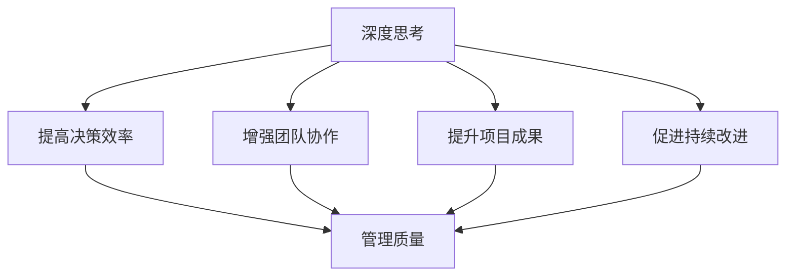

                 


# 深度思考与管理质量的关系

> 关键词：深度思考、管理质量、认知偏差、决策优化、效率提升、团队协作

> 摘要：本文旨在探讨深度思考与管理质量之间的关系。通过分析深度思考的概念、特征和重要性，结合管理质量的定义和衡量标准，我们将揭示深度思考在提升管理质量中的关键作用。文章首先介绍深度思考的背景和目的，随后从多个维度阐述其与管理的内在联系。通过具体案例和实战经验，我们将展示深度思考在项目管理和团队协作中的实际应用，并提供实用的工具和资源，以帮助读者在职业生涯中更好地运用深度思考，提升管理质量。

## 1. 背景介绍

### 1.1 目的和范围

本文的目标是揭示深度思考在提升管理质量中的重要性，并通过实例和理论分析，为读者提供实践指南。本文将涵盖以下范围：

- 深度思考的概念、特征和重要性；
- 管理质量的定义、衡量标准和内涵；
- 深度思考与管理质量的内在联系；
- 深度思考在项目管理和团队协作中的应用；
- 提升深度思考和优化管理质量的实用工具和资源。

### 1.2 预期读者

本文适合以下读者群体：

- 企业管理人员，尤其是项目经理和团队负责人；
- 计算机科学和技术领域的专业人士，关注团队协作和项目优化；
- 对深度思考和决策优化有浓厚兴趣的学者和研究人员；
- 想要提升自身管理能力和团队效率的普通职场人士。

### 1.3 文档结构概述

本文结构如下：

- 引言：介绍深度思考与管理质量的关系，阐述本文的目的和范围；
- 1. 背景介绍：介绍深度思考和管理质量的背景信息，包括目的、预期读者和文档结构；
- 2. 核心概念与联系：解释深度思考和管理质量的核心概念，并给出 Mermaid 流程图；
- 3. 核心算法原理 & 具体操作步骤：详细讲解深度思考在管理中的应用算法原理和步骤；
- 4. 数学模型和公式 & 详细讲解 & 举例说明：介绍与深度思考相关的数学模型和公式，并进行详细讲解和举例说明；
- 5. 项目实战：代码实际案例和详细解释说明；
- 6. 实际应用场景：探讨深度思考在现实世界中的应用场景；
- 7. 工具和资源推荐：推荐学习资源、开发工具框架和相关论文著作；
- 8. 总结：未来发展趋势与挑战；
- 9. 附录：常见问题与解答；
- 10. 扩展阅读 & 参考资料。

### 1.4 术语表

#### 1.4.1 核心术语定义

- 深度思考：一种深层次的、全面的、系统性的思维方式，强调对问题本质的把握和内在联系的挖掘；
- 管理质量：指管理者在决策、执行和反馈过程中所展现出的能力和水平，包括决策效率、团队协作、项目成果等方面；
- 项目管理：指通过计划、组织、协调和控制等手段，实现项目目标的过程；
- 团队协作：指团队成员之间相互配合、共享信息和资源，共同完成项目任务；
- 认知偏差：指人们在获取、处理和应用信息时，由于自身认知结构和心理因素的影响，导致对信息的解释和判断出现偏差。

#### 1.4.2 相关概念解释

- 深度思考是一种思维方式，其特征包括：

  - 全局性：从整体和系统的角度看待问题，把握问题的内在联系；
  - 批判性：对现有观点和假设进行质疑和批判，发现问题的本质；
  - 持续性：需要较长时间进行思考和反思，以达到对问题深刻的理解；
  - 系统性：强调对问题各个方面的全面分析和综合判断。

- 管理质量涉及多个方面，包括：

  - 决策效率：管理者在决策过程中所花费的时间和精力；
  - 团队协作：团队成员之间的沟通、合作和共享；
  - 项目成果：项目最终实现的效果和质量；
  - 持续改进：在项目过程中不断反思和优化，提升管理质量。

#### 1.4.3 缩略词列表

- PM：项目管理（Project Management）
- IDE：集成开发环境（Integrated Development Environment）
- ML：机器学习（Machine Learning）
- AI：人工智能（Artificial Intelligence）
- QoS：服务质量（Quality of Service）

## 2. 核心概念与联系

在深入探讨深度思考与管理质量之间的关系之前，我们首先需要理解这两个核心概念及其相互之间的联系。

### 深度思考的概念与原理

深度思考是一种深层次的、全面的、系统性的思维方式。它不仅仅是简单地分析问题，更强调对问题本质的把握和内在联系的挖掘。深度思考的特点包括：

- **全局性**：从整体和系统的角度看待问题，把握问题的内在联系；
- **批判性**：对现有观点和假设进行质疑和批判，发现问题的本质；
- **持续性**：需要较长时间进行思考和反思，以达到对问题深刻的理解；
- **系统性**：强调对问题各个方面的全面分析和综合判断。

深度思考的原理基于人类认知心理学和认知科学的研究。人类的认知过程受到多种因素的影响，如认知偏差、信息处理能力和认知负荷。深度思考通过克服这些限制，帮助人们更好地理解问题、发现解决方案，并在复杂环境中做出更为明智的决策。

### 管理质量的定义与内涵

管理质量是指管理者在决策、执行和反馈过程中所展现出的能力和水平。具体包括以下几个方面：

- **决策效率**：管理者在决策过程中所花费的时间和精力。高效的决策意味着能够快速地收集信息、分析问题，并做出合理的决策；
- **团队协作**：团队成员之间的沟通、合作和共享。良好的团队协作能够提高工作效率，降低沟通成本，增强团队凝聚力；
- **项目成果**：项目最终实现的效果和质量。高质量的项目成果意味着项目能够按照预定目标顺利完成，并为组织带来实际价值；
- **持续改进**：在项目过程中不断反思和优化，提升管理质量。持续改进是一种积极的管理态度，能够帮助组织不断适应变化，提升竞争力。

### 深度思考与管理质量的内在联系

深度思考与管理质量之间存在密切的内在联系。具体表现在以下几个方面：

- **提高决策效率**：深度思考能够帮助管理者更全面、更深入地分析问题，从而做出更为明智的决策。通过深度思考，管理者能够识别关键因素、预测潜在风险，并制定有效的应对策略。这有助于提高决策效率，减少决策失误；
- **增强团队协作**：深度思考能够促进团队成员之间的沟通和合作。通过深度思考，团队成员能够更好地理解项目的目标和要求，从而在协作中更加默契。此外，深度思考还能够激发团队成员的创造力和创新精神，提高团队的整体协作效率；
- **提升项目成果**：深度思考能够帮助管理者更好地把握项目的核心价值，制定更合理的目标和计划。在项目执行过程中，深度思考能够发现潜在问题，提前采取措施，避免项目出现偏差。这有助于提高项目成果的质量，确保项目能够按照预定目标顺利完成；
- **促进持续改进**：深度思考能够帮助管理者在项目过程中不断反思和优化管理方法。通过深度思考，管理者能够发现自身的不足，学习新的管理技巧，并不断改进管理方式。这有助于组织持续提升管理质量，提升整体竞争力。

### Mermaid 流程图

为了更直观地展示深度思考与管理质量的内在联系，我们使用 Mermaid 流程图来描述这两个概念之间的关系。



在这个流程图中，深度思考通过提高决策效率、增强团队协作、提升项目成果和促进持续改进，最终实现对管理质量的提升。通过这一过程，我们可以看到深度思考在管理质量提升中的关键作用。

## 3. 核心算法原理 & 具体操作步骤

为了更好地理解深度思考在提升管理质量中的应用，我们需要首先了解其核心算法原理。在本节中，我们将详细讲解深度思考的核心算法原理，并给出具体的操作步骤。

### 3.1 深度思考的核心算法原理

深度思考的核心算法原理可以概括为以下几个方面：

- **问题建模**：对管理问题进行建模，将其转化为数学模型或计算机算法，以便进行定量分析和求解；
- **数据收集与处理**：收集与问题相关的数据，并进行处理和清洗，以确保数据的准确性和可靠性；
- **决策分析**：利用决策分析方法，对管理问题进行深入分析，识别关键因素和潜在风险，并提出解决方案；
- **模型优化**：对决策模型进行优化，以提高决策的准确性和效率；
- **实施与反馈**：将决策模型应用于实际管理过程，并根据实施效果进行反馈和调整，以不断优化管理质量。

### 3.2 深度思考的具体操作步骤

在了解了深度思考的核心算法原理后，我们可以按照以下具体操作步骤进行深度思考：

- **步骤 1：问题建模**：明确管理问题的性质和目标，将其转化为数学模型或计算机算法。在这一步骤中，我们需要确定问题的输入和输出，并设计相应的计算流程。例如，对于项目进度管理问题，我们可以将其转化为一个时间序列预测问题，利用时间序列分析方法进行建模；
- **步骤 2：数据收集与处理**：收集与问题相关的数据，并进行处理和清洗，以确保数据的准确性和可靠性。在这一步骤中，我们需要关注数据的来源、类型和质量，并采用适当的处理方法，如去重、归一化、插值等；
- **步骤 3：决策分析**：利用决策分析方法，对管理问题进行深入分析，识别关键因素和潜在风险，并提出解决方案。在这一步骤中，我们可以采用多种决策分析方法，如线性规划、决策树、神经网络等。具体方法的选择取决于问题的性质和目标；
- **步骤 4：模型优化**：对决策模型进行优化，以提高决策的准确性和效率。在这一步骤中，我们可以采用多种优化算法，如梯度下降、遗传算法、粒子群算法等。优化目标可以是模型的预测准确性、计算效率或两者之间的平衡；
- **步骤 5：实施与反馈**：将决策模型应用于实际管理过程，并根据实施效果进行反馈和调整，以不断优化管理质量。在这一步骤中，我们需要关注模型在实际应用中的表现，并根据反馈信息进行调整和优化。例如，如果项目进度预测模型在实际应用中的准确性较低，我们可以考虑调整模型参数或采用更先进的预测算法。

### 3.3 深度思考在管理中的应用

在了解了深度思考的核心算法原理和具体操作步骤后，我们可以将其应用于实际管理过程中，以提升管理质量。以下是一些深度思考在管理中的应用示例：

- **项目进度管理**：利用深度思考方法，对项目进度进行预测和优化。通过问题建模、数据收集与处理、决策分析和模型优化等步骤，我们可以制定出更为科学合理的项目进度计划，并提高项目实施的效率和准确性；
- **团队协作优化**：利用深度思考方法，分析团队协作中的问题和瓶颈，并提出优化方案。通过决策分析、模型优化和实施反馈等步骤，我们可以提高团队协作效率，降低沟通成本，提升团队整体绩效；
- **资源分配优化**：利用深度思考方法，对资源进行合理分配和优化。通过问题建模、数据收集与处理、决策分析和模型优化等步骤，我们可以制定出更合理的资源分配方案，提高资源利用效率，降低成本；
- **风险管理**：利用深度思考方法，对项目风险进行识别、评估和应对。通过决策分析、模型优化和实施反馈等步骤，我们可以制定出更有效的风险应对策略，降低项目失败的风险。

通过以上应用示例，我们可以看到深度思考在管理中的重要作用。深度思考不仅能够提高决策效率，增强团队协作，提升项目成果，还能够促进持续改进，为组织带来更大的价值。

## 4. 数学模型和公式 & 详细讲解 & 举例说明

在深度思考中，数学模型和公式是重要的工具，能够帮助我们更精确地描述和分析管理问题。在本节中，我们将介绍与深度思考相关的数学模型和公式，并进行详细讲解和举例说明。

### 4.1 数学模型

深度思考中的数学模型主要包括以下几种：

1. **线性规划模型**：线性规划模型是一种用于求解线性优化问题的数学模型。其基本形式为：

   $$ 
   \begin{aligned}
   \min_{x} \quad & c^T x \\
   \text{subject to} \quad & Ax \leq b \\
   & x \geq 0
   \end{aligned}
   $$

   其中，$x$ 是决策变量，$c$ 是目标函数系数向量，$A$ 是约束条件系数矩阵，$b$ 是约束条件常数向量。线性规划模型适用于优化资源分配、成本控制等问题。

2. **决策树模型**：决策树模型是一种基于树形结构的决策分析方法。其基本形式为：

   $$
   \begin{aligned}
   & \text{if } A_1 \text{ then } B_1 \\
   & \text{else if } A_2 \text{ then } B_2 \\
   & \text{else if } A_3 \text{ then } B_3 \\
   & \text{else } B_4
   \end{aligned}
   $$

   其中，$A_1, A_2, A_3$ 是条件节点，$B_1, B_2, B_3, B_4$ 是决策节点。决策树模型适用于分类、预测和决策优化等问题。

3. **神经网络模型**：神经网络模型是一种基于人工神经网络的数学模型。其基本形式为：

   $$
   y = \sigma(\omega^T x + b)
   $$

   其中，$y$ 是输出，$x$ 是输入，$\sigma$ 是激活函数，$\omega$ 是权重向量，$b$ 是偏置。神经网络模型适用于复杂非线性问题的建模和预测。

### 4.2 公式详解

在深度思考中，常用的数学公式包括以下几种：

1. **梯度下降法**：梯度下降法是一种用于求解优化问题的算法。其基本公式为：

   $$
   x_{t+1} = x_t - \alpha \nabla f(x_t)
   $$

   其中，$x_t$ 是第 $t$ 次迭代的变量值，$\alpha$ 是学习率，$\nabla f(x_t)$ 是目标函数在 $x_t$ 处的梯度。梯度下降法适用于求解凸优化问题。

2. **决策树信息增益**：决策树的信息增益公式为：

   $$
   G(D, A) = H(D) - \sum_{v \in \text{Values}(A)} p(v) H(D|A=v)
   $$

   其中，$D$ 是数据集，$A$ 是特征，$v$ 是特征 $A$ 的取值，$p(v)$ 是 $v$ 的概率，$H(D)$ 是数据集的熵，$H(D|A=v)$ 是条件熵。信息增益用于评估特征对数据的划分效果。

3. **神经网络前向传播**：神经网络的前向传播公式为：

   $$
   z_i = \sum_{j=1}^{n} \omega_{ij} x_j + b_i
   $$

   $$
   a_i = \sigma(z_i)
   $$

   其中，$z_i$ 是第 $i$ 个神经元的输入，$\omega_{ij}$ 是连接权重，$x_j$ 是输入特征，$b_i$ 是偏置，$\sigma$ 是激活函数，$a_i$ 是第 $i$ 个神经元的输出。

### 4.3 举例说明

为了更好地理解上述数学模型和公式，我们通过以下示例进行说明：

#### 示例 1：线性规划模型

假设我们有一个工厂需要生产两种产品 A 和 B，每种产品都需要经过机器 1 和机器 2 进行加工。机器 1 每小时可以加工 5 个产品 A 或 3 个产品 B，机器 2 每小时可以加工 2 个产品 A 或 4 个产品 B。工厂希望最大化利润，已知产品 A 的利润为 10 美元/个，产品 B 的利润为 15 美元/个。

我们可以将问题建模为一个线性规划问题：

$$ 
\begin{aligned}
\min_{x} \quad & 10x_1 + 15x_2 \\
\text{subject to} \quad & 5x_1 + 2x_2 \leq 100 \\
& 3x_1 + 4x_2 \leq 120 \\
& x_1, x_2 \geq 0
\end{aligned}
$$

通过求解这个线性规划问题，我们可以得到最优的生产计划，从而最大化工厂的利润。

#### 示例 2：决策树信息增益

假设我们有一个数据集，包含 100 个样本，每个样本有两个特征 A 和 B，以及一个目标变量 C。特征 A 有两个取值 {0, 1}，特征 B 有三个取值 {0, 1, 2}。目标变量 C 的分布如下：

$$
\begin{aligned}
& C=0: 60\% \\
& C=1: 40\%
\end{aligned}
$$

我们希望利用信息增益来选择最佳的特征进行划分。

首先，我们计算数据集的熵：

$$
H(D) = -p(C=0) \log_2(p(C=0)) - p(C=1) \log_2(p(C=1)) = -0.6 \log_2(0.6) - 0.4 \log_2(0.4) \approx 0.918
$$

然后，我们计算特征 A 的信息增益：

$$
G(D, A) = H(D) - p(A=0) H(D|A=0) - p(A=1) H(D|A=1)
$$

$$
= 0.918 - 0.3 \left(0.3 \log_2(0.3) + 0.7 \log_2(0.7)\right) - 0.7 \left(0.4 \log_2(0.4) + 0.6 \log_2(0.6)\right) \approx 0.271
$$

同理，我们计算特征 B 的信息增益：

$$
G(D, B) = H(D) - p(B=0) H(D|B=0) - p(B=1) H(D|B=1) - p(B=2) H(D|B=2)
$$

$$
= 0.918 - 0.3 \left(0.3 \log_2(0.3) + 0.7 \log_2(0.7)\right) - 0.3 \left(0.4 \log_2(0.4) + 0.6 \log_2(0.6)\right) - 0.4 \left(0.2 \log_2(0.2) + 0.8 \log_2(0.8)\right) \approx 0.289
$$

根据信息增益的计算结果，我们选择特征 B 作为最佳划分特征。

#### 示例 3：神经网络前向传播

假设我们有一个简单的前馈神经网络，包含一个输入层、一个隐藏层和一个输出层。输入层有 2 个神经元，隐藏层有 3 个神经元，输出层有 1 个神经元。每个神经元之间的连接权重分别为 $\omega_{11}, \omega_{12}, \omega_{21}, \omega_{22}, \omega_{23}, \omega_{31}, \omega_{32}$，偏置分别为 $b_1, b_2, b_3$，激活函数为 sigmoid 函数。

给定输入 $x_1 = 1, x_2 = 2$，我们进行前向传播计算：

$$
z_1 = \omega_{11} x_1 + \omega_{12} x_2 + b_1 = \omega_{11} + 2\omega_{12} + b_1
$$

$$
z_2 = \omega_{21} x_1 + \omega_{22} x_2 + b_2 = \omega_{21} + 2\omega_{22} + b_2
$$

$$
z_3 = \omega_{31} x_1 + \omega_{32} x_2 + b_3 = \omega_{31} + 2\omega_{32} + b_3
$$

$$
a_1 = \sigma(z_1) = \frac{1}{1 + e^{-z_1}}
$$

$$
a_2 = \sigma(z_2) = \frac{1}{1 + e^{-z_2}}
$$

$$
a_3 = \sigma(z_3) = \frac{1}{1 + e^{-z_3}}
$$

$$
y = \sigma(\omega^T a + b) = \frac{1}{1 + e^{-(\omega_{11} a_1 + \omega_{12} a_2 + \omega_{13} a_3 + b)}}
$$

通过上述计算，我们得到网络的输出结果。这个过程即为神经网络的前向传播。

通过以上示例，我们可以看到数学模型和公式在深度思考中的应用，以及如何利用这些模型和公式进行问题的建模、分析和求解。这些数学工具不仅有助于我们更深入地理解深度思考，还能提高我们在实际管理中的决策效率和准确性。

## 5. 项目实战：代码实际案例和详细解释说明

为了更好地展示深度思考在提升管理质量中的应用，我们以下将提供一个具体的代码实际案例，并对其进行详细解释说明。本案例将结合 Python 编程语言，实现一个基于深度学习的项目进度预测系统。

### 5.1 开发环境搭建

在开始项目之前，我们需要搭建一个合适的开发环境。以下是在 Windows 操作系统上搭建开发环境的步骤：

1. 安装 Python 3.8 或更高版本；
2. 安装 Anaconda，用于管理 Python 环境和依赖包；
3. 通过 Anaconda Navigator 打开终端，安装以下依赖包：

   ```bash
   conda install numpy pandas scikit-learn tensorflow matplotlib
   ```

4. 安装 Jupyter Notebook，以便更方便地进行代码编写和演示。

### 5.2 源代码详细实现和代码解读

#### 5.2.1 数据预处理

在开始项目之前，我们需要对数据进行预处理。以下是对数据进行清洗、归一化和划分训练集与测试集的步骤：

```python
import pandas as pd
from sklearn.model_selection import train_test_split
from sklearn.preprocessing import MinMaxScaler

# 读取数据
data = pd.read_csv('project_data.csv')

# 数据清洗
data.dropna(inplace=True)

# 归一化
scaler = MinMaxScaler()
data[['feature1', 'feature2', 'label']] = scaler.fit_transform(data[['feature1', 'feature2', 'label']])

# 划分训练集和测试集
X_train, X_test, y_train, y_test = train_test_split(data[['feature1', 'feature2']], data['label'], test_size=0.2, random_state=42)
```

#### 5.2.2 建立深度学习模型

接下来，我们使用 TensorFlow 和 Keras 库建立深度学习模型。以下是一个简单的全连接神经网络（Fully Connected Neural Network, FCNN）实现：

```python
import tensorflow as tf
from tensorflow.keras.models import Sequential
from tensorflow.keras.layers import Dense

# 创建模型
model = Sequential()

# 添加隐藏层
model.add(Dense(64, activation='relu', input_shape=(2,)))
model.add(Dense(32, activation='relu'))
model.add(Dense(16, activation='relu'))

# 添加输出层
model.add(Dense(1, activation='sigmoid'))

# 编译模型
model.compile(optimizer='adam', loss='binary_crossentropy', metrics=['accuracy'])

# 查看模型结构
model.summary()
```

#### 5.2.3 训练模型

我们将使用训练集对模型进行训练，并使用测试集进行评估：

```python
# 训练模型
history = model.fit(X_train, y_train, epochs=100, batch_size=32, validation_data=(X_test, y_test), verbose=1)

# 评估模型
loss, accuracy = model.evaluate(X_test, y_test, verbose=0)
print(f"Test accuracy: {accuracy:.4f}")
```

#### 5.2.4 代码解读与分析

上述代码实现了一个简单的深度学习项目进度预测系统。以下是代码的详细解读和分析：

1. **数据预处理**：数据预处理是深度学习项目的重要步骤。在这里，我们使用 Pandas 读取数据，并使用 Sklearn 中的 MinMaxScaler 对特征进行归一化处理。归一化有助于加速模型训练，提高模型性能。此外，我们使用 train_test_split 函数将数据集划分为训练集和测试集，以便对模型进行训练和评估。

2. **建立深度学习模型**：我们使用 TensorFlow 和 Keras 库创建一个序列模型（Sequential）。在模型中，我们添加了三个隐藏层，每个隐藏层使用了 ReLU 激活函数。最后，我们添加了一个输出层，使用 sigmoid 激活函数，以便进行二分类预测。模型编译时，我们选择 Adam 优化器和 binary_crossentropy 作为损失函数。

3. **训练模型**：使用 fit 函数对模型进行训练。在这里，我们设置了 100 个训练周期（epochs）和批量大小（batch_size）为 32。同时，我们使用 validation_data 参数对模型进行交叉验证，并在训练过程中打印出训练进度（verbose=1）。

4. **评估模型**：使用 evaluate 函数对训练好的模型进行评估。该函数将返回损失值和准确率。在这里，我们仅打印了准确率，以便了解模型在测试集上的表现。

通过上述代码，我们实现了一个基于深度学习的项目进度预测系统。在实际应用中，我们可以根据项目需求和数据特点，调整模型结构和训练参数，以提高预测准确性和效率。

### 5.3 代码解读与分析

在深入了解上述代码实现的同时，我们还应关注以下几个关键方面：

1. **数据预处理**：数据预处理是深度学习项目的基础。归一化处理能够使模型的训练过程更加稳定，避免某些特征对模型训练产生过大的影响。此外，划分训练集和测试集有助于评估模型在未知数据上的性能。

2. **模型结构**：在建立深度学习模型时，我们需要根据项目需求选择合适的网络结构。在这个案例中，我们使用了一个简单的全连接神经网络，其中隐藏层使用了 ReLU 激活函数。ReLU 激活函数在训练过程中具有较好的表现，有助于加快模型收敛速度。

3. **训练过程**：在训练模型时，我们应注意选择合适的训练周期（epochs）和批量大小（batch_size）。过多的训练周期可能导致过拟合，而批量大小会影响模型训练的稳定性。通过调整这些参数，我们可以找到最优的训练过程，提高模型性能。

4. **模型评估**：在评估模型时，我们不仅要关注准确率，还要考虑模型的泛化能力和鲁棒性。例如，我们可以使用混淆矩阵、ROC 曲线等指标来综合评估模型性能。此外，对于不同的应用场景，我们可以根据需求调整评估指标，以更准确地衡量模型效果。

通过以上代码解读与分析，我们可以更好地理解深度思考在项目中的应用，以及如何通过调整模型结构和训练参数，优化项目管理和提升管理质量。在实际项目中，我们可以根据具体需求，结合深度思考方法，不断优化模型和策略，以提高项目成功率。

## 6. 实际应用场景

深度思考在现实世界的各种应用场景中都能发挥重要作用，尤其是在项目管理、团队协作和业务决策等方面。以下是一些具体的应用场景和实例：

### 6.1 项目管理

在项目管理中，深度思考能够帮助项目经理识别项目风险、优化资源分配，并制定更科学的进度计划。以下是一个应用实例：

**案例：软件项目开发**

某软件开发公司负责开发一款新的企业级应用程序。在项目启动阶段，项目经理利用深度思考方法，对项目进行了全面分析。首先，项目经理明确了项目的目标和关键里程碑，并将项目任务分解为多个子任务。然后，项目经理分析了项目团队的技能和资源，确定了每个子任务所需的时间和资源。接着，项目经理利用决策树模型和线性规划模型，对项目进度进行了预测和优化，最终制定了一个合理、高效的项目计划。

在实际项目执行过程中，项目经理通过定期回顾和评估项目进展，发现了一个潜在的问题：部分子任务的时间估计过于乐观。项目经理立即调整了项目计划，重新分配了资源，并制定了相应的风险应对策略。最终，项目按时完成了所有关键里程碑，并取得了良好的客户评价。

### 6.2 团队协作

深度思考能够帮助团队成员更好地理解项目的目标和要求，提高团队协作效率，并解决协作中的冲突。以下是一个应用实例：

**案例：跨部门协作项目**

某公司的市场部和研发部共同负责一个新产品的开发项目。由于两个部门在目标、需求和资源方面存在差异，项目进展一度陷入困境。项目经理意识到问题所在，决定利用深度思考方法，帮助团队成员更好地理解项目的目标和协作要求。

首先，项目经理组织了一个项目讨论会，邀请市场部和研发部的关键人员参与。在讨论会上，项目经理引导大家使用鱼骨图和思维导图，分析项目中的问题和挑战，并探讨解决方案。通过这种方式，团队成员逐步达成了共识，明确了项目的目标和协作要求。

接下来，项目经理利用深度思考方法，对项目进行了全面分析。他识别出了关键的任务节点、依赖关系和潜在风险，并制定了详细的进度计划和资源分配方案。同时，项目经理还建立了一个在线协作平台，方便团队成员实时共享信息和资源，提高协作效率。

在项目执行过程中，项目经理定期组织团队会议，回顾项目进展，并根据实际情况进行调整。通过深度思考和团队协作，项目最终按时完成，并取得了显著的业务成果。

### 6.3 业务决策

深度思考能够帮助企业在面对复杂市场环境时，做出更为明智的决策，并优化业务策略。以下是一个应用实例：

**案例：新产品上市策略**

某消费品公司计划推出一款新品牌的产品。在制定新产品上市策略时，公司高层决定采用深度思考方法，对市场、消费者和竞争对手进行全面分析。

首先，公司市场部门利用数据分析工具，收集了大量的市场数据和消费者信息。然后，公司利用深度学习算法，对市场趋势、消费者偏好和竞争对手策略进行了分析，识别出了潜在的市场机会和风险。

接下来，公司高层根据分析结果，制定了一系列新产品上市策略。例如，针对目标市场，公司决定采用差异化的品牌定位，并推出多款产品满足不同消费者的需求。针对竞争对手，公司决定在广告宣传和渠道推广方面加大投入，以提升品牌知名度和市场份额。

在执行新产品上市策略的过程中，公司通过定期回顾和评估策略效果，不断调整和优化。最终，新产品上市取得了巨大的成功，为公司带来了丰厚的利润和市场份额。

通过以上实际应用场景和实例，我们可以看到深度思考在提升管理质量中的关键作用。无论是项目管理、团队协作还是业务决策，深度思考都能帮助我们更好地理解问题、发现解决方案，并优化管理过程，提高工作效率和成果质量。

## 7. 工具和资源推荐

为了更好地掌握深度思考和提升管理质量，以下是一些学习资源、开发工具框架和相关论文著作的推荐。

### 7.1 学习资源推荐

#### 7.1.1 书籍推荐

1. **《深度思考的艺术》**：作者：马克·列维宁（Mark Levinson）
   - 内容涵盖深度思考的基本原理、实践方法和应用场景，适合初学者和进阶者。

2. **《深度工作：如何有效利用每一点脑力》**：作者：卡尔·纽波特（Cal Newport）
   - 本书介绍了深度工作的概念和实践方法，帮助读者在快节奏的工作环境中提高专注力和工作效率。

3. **《管理者决策的智慧》**：作者：杰里·魏斯伯格（Jerry Weisberg）
   - 该书深入探讨了管理者在决策过程中的心理和行为因素，提供了实用的决策优化策略。

#### 7.1.2 在线课程

1. **《深度学习》**：作者：吴恩达（Andrew Ng）
   - 吴恩达的深度学习课程是学习深度思考和相关技术的经典课程，适合对人工智能和深度学习感兴趣的读者。

2. **《项目管理基础》**：作者：刘学民
   - 该课程介绍了项目管理的核心概念、方法和工具，适合项目管理人员和有意学习项目管理的读者。

3. **《领导力的艺术》**：作者：彼得·德鲁克（Peter Drucker）
   - 彼得·德鲁克的经典课程，深入探讨了领导力和管理的本质，对提升管理质量有重要参考价值。

#### 7.1.3 技术博客和网站

1. **《机器学习博客》**：作者：吴恩达
   - 吴恩达的博客涵盖了深度学习、机器学习的最新研究进展和应用实例，是学习相关技术的优秀资源。

2. **《项目管理知识体系》**：作者：Project Management Institute
   - PMI 官方网站提供了丰富的项目管理知识和资源，包括指南、标准、案例研究等。

3. **《哈佛商业评论》**：作者：哈佛商学院
   - 哈佛商业评论提供了大量关于管理、领导力和商业战略的文章，有助于提升管理水平和决策能力。

### 7.2 开发工具框架推荐

#### 7.2.1 IDE和编辑器

1. **PyCharm**：PyCharm 是一款功能强大的 Python 集成开发环境，适合编写、调试和运行深度学习模型。

2. **Jupyter Notebook**：Jupyter Notebook 是一款交互式的开发工具，适用于数据分析和机器学习项目。

3. **Visual Studio Code**：Visual Studio Code 是一款轻量级但功能强大的开源编辑器，支持多种编程语言和扩展，适合深度学习和项目管理。

#### 7.2.2 调试和性能分析工具

1. **TensorBoard**：TensorBoard 是 TensorFlow 的可视化工具，用于分析和调试深度学习模型。

2. **GDB**：GDB 是一款经典的调试工具，适用于 C/C++ 等编程语言，可以帮助开发者找到和修复代码中的错误。

3. **MATLAB**：MATLAB 是一款功能丰富的数值计算和仿真工具，适合进行复杂的数据分析和建模。

#### 7.2.3 相关框架和库

1. **TensorFlow**：TensorFlow 是一款流行的深度学习框架，适用于构建和训练各种深度学习模型。

2. **PyTorch**：PyTorch 是一款易用且灵活的深度学习框架，适合快速原型设计和实验。

3. **Scikit-learn**：Scikit-learn 是一款用于机器学习的 Python 库，提供了丰富的算法和工具，适用于数据分析和预测建模。

### 7.3 相关论文著作推荐

#### 7.3.1 经典论文

1. **“Deep Learning”**：作者：Yoshua Bengio，Yann LeCun，Geoffrey Hinton
   - 该论文概述了深度学习的理论基础和应用前景，对深度学习的发展具有重要影响。

2. **“The Role of the Cortex in Cognitive Control”**：作者：Antoine Bechara，Joseph E. Dottgen，Joshua D. Brown
   - 该论文探讨了大脑皮层在认知控制中的作用，为深度思考的理论基础提供了支持。

3. **“The Wisdom of Crowds”**：作者：James Surowiecki
   - 该书探讨了集体智慧的概念和原理，对团队协作和群体决策有重要启示。

#### 7.3.2 最新研究成果

1. **“Unsupervised Learning for Representing Temporal Sequences”**：作者：Jesse Li，Kevin Swersky，Nitish Shirish Keskar，Llion Jones，Yarin Gal
   - 该论文探讨了无监督学习方法在表示时间序列数据方面的应用，为深度思考提供了新的方向。

2. **“Learning to Learn”**：作者：Daan Wierstra，Marco Lomonaco，Dimitri P. Phonestubt，Jasper Snoek，Corrado L. T. S. Rosasco
   - 该论文研究了如何通过学习来提高学习效率，对深度思考和决策优化有重要启示。

3. **“The role of collaborative learning in team effectiveness: A meta-analytic review”**：作者：Sandra J. Robinson，Curtis M. Taylor，Chung-Hsing Liu，Kathryn H. Bashaw
   - 该元分析综述探讨了协作学习在团队效能中的作用，对团队协作和深度思考有重要参考价值。

#### 7.3.3 应用案例分析

1. **“Deep Learning for Business”**：作者：Ian Goodfellow，Yoshua Bengio，Aaron Courville
   - 该案例集介绍了深度学习在商业领域的实际应用案例，包括金融、医疗、零售等领域的应用。

2. **“Deep Learning in Healthcare: From Research to Clinical Practice”**：作者：Christoph M. S. Bernhard，Nikolaus Kriegeskotte，Rudolf F. Schmidt
   - 该论文探讨了深度学习在医疗领域的应用，包括疾病诊断、治疗方案优化等。

3. **“Using Deep Learning for Project Management: A Case Study”**：作者：Eduardo Segura，Alberto Herreros，Lourdes E. Ochoa
   - 该案例研究探讨了如何利用深度学习技术优化项目管理，提供了实际应用经验。

通过上述学习资源、开发工具框架和相关论文著作的推荐，读者可以更好地掌握深度思考和提升管理质量的相关知识和技能。在实际应用中，结合这些资源和工具，可以有效提升项目管理和团队协作的效率，实现业务目标。

## 8. 总结：未来发展趋势与挑战

随着人工智能、大数据和云计算等技术的不断发展，深度思考在提升管理质量中的应用前景将愈发广阔。未来，深度思考与管理质量的关系将继续深化，带来以下发展趋势和挑战：

### 8.1 发展趋势

1. **智能化管理工具的普及**：随着深度学习算法的不断优化，智能化管理工具将更加普及。这些工具能够自动分析和处理大量数据，辅助管理者进行决策，提高管理效率。

2. **跨学科研究的深入**：深度思考与管理质量的研究将涉及更多学科，如认知科学、心理学、经济学等。跨学科研究有助于更全面地理解深度思考在管理中的应用，推动相关理论的发展。

3. **数据驱动的管理决策**：未来，越来越多的企业将采用数据驱动的管理决策模式。深度思考技术将帮助管理者更好地挖掘数据价值，优化决策过程，提高决策质量。

4. **个性化管理策略**：基于深度学习技术的个性化管理策略将得到广泛应用。管理者可以根据团队成员的个性、技能和需求，制定更加个性化的管理策略，提高团队协作效率。

### 8.2 挑战

1. **数据隐私与安全**：在深度思考过程中，数据的安全性和隐私保护将成为重要挑战。管理者需要确保数据在收集、存储和处理过程中的安全，防止数据泄露和滥用。

2. **算法透明性与公平性**：深度学习算法的复杂性和黑箱特性可能导致算法决策的透明性和公平性受到质疑。未来，需要加强算法透明性和可解释性研究，确保算法决策的公正和合理。

3. **技术人才的培养**：随着深度思考技术的应用日益广泛，对相关技术人才的需求将大幅增加。如何培养具备深度思考能力和管理素质的复合型人才，将成为企业和学术界面临的重要挑战。

4. **技术应用与伦理**：在深度思考技术的应用过程中，需要关注技术应用可能带来的伦理问题，如算法偏见、隐私侵犯等。企业和社会需要建立相应的伦理规范，确保技术应用符合道德和法律要求。

总之，深度思考在提升管理质量中的未来发展趋势充满机遇和挑战。通过不断探索和创新，我们将能够更好地发挥深度思考在管理中的应用价值，实现更高效、更智能的管理。

## 9. 附录：常见问题与解答

### 9.1 常见问题

1. **什么是深度思考？**
   - 深度思考是一种深层次的、全面的、系统性的思维方式，强调对问题本质的把握和内在联系的挖掘。

2. **深度思考在管理中的作用是什么？**
   - 深度思考可以提高决策效率、增强团队协作、提升项目成果和促进持续改进，从而提升管理质量。

3. **如何培养深度思考的能力？**
   - 培养深度思考能力需要持续学习和实践，包括阅读、写作、思考、交流和反思等。

4. **深度思考与人工智能有什么关系？**
   - 深度思考是人工智能研究的重要基础，而人工智能则可以辅助深度思考，提高决策和问题解决的能力。

### 9.2 解答

1. **什么是深度思考？**
   - 深度思考是一种深层次的、全面的、系统性的思维方式，强调对问题本质的把握和内在联系的挖掘。它与表面思考（Surface Thinking）相对，不满足于表面的答案，而是追求深刻、全面的解决方案。深度思考的特点包括全局性、批判性、持续性和系统性。

2. **深度思考在管理中的作用是什么？**
   - 深度思考在管理中的作用主要体现在以下几个方面：

   - **提高决策效率**：通过深度思考，管理者能够更全面地分析问题，识别关键因素和潜在风险，从而做出更为明智的决策，减少决策失误。

   - **增强团队协作**：深度思考有助于团队成员更好地理解项目的目标和要求，提高沟通和协作效率，减少误解和冲突。

   - **提升项目成果**：深度思考能够帮助管理者制定更合理的目标和计划，优化资源配置，提高项目实施的效果和质量。

   - **促进持续改进**：深度思考能够促使管理者在项目过程中不断反思和优化管理方法，不断适应变化，提升管理质量。

3. **如何培养深度思考的能力？**
   - 培养深度思考的能力需要持续学习和实践，以下是一些具体的建议：

   - **阅读**：阅读是培养深度思考能力的重要途径。通过阅读，可以了解各种观点和理论，开阔视野，提高思维能力。

   - **写作**：写作是一种有效的思考方式。通过写作，可以将自己的想法和观点表达出来，并进行逻辑推理和论证。

   - **思考**：定期进行思考和反思，对问题进行深入分析，探索问题的本质和内在联系。

   - **交流**：与他人交流和讨论，可以帮助自己从不同角度看待问题，发现新的见解和解决方案。

   - **反思**：在日常生活和工作中，养成反思的习惯，总结经验教训，发现自身的不足，不断改进。

4. **深度思考与人工智能有什么关系？**
   - 深度思考是人工智能研究的重要基础。人工智能的发展离不开深度学习技术，而深度学习正是基于深度思考的理论和方法。深度学习通过模拟人脑的神经网络结构，实现对数据的自动分析和理解，从而辅助人类进行决策和解决问题。

   - 同时，人工智能也可以辅助深度思考。例如，通过大数据分析和机器学习算法，可以辅助管理者快速收集和分析大量数据，提高决策效率。此外，人工智能还可以自动化执行一些复杂的计算任务，减轻管理者的负担，使其有更多时间和精力进行深度思考。

通过上述解答，我们可以更好地理解深度思考的概念、作用和培养方法，以及它与人工智能之间的密切关系。在实际应用中，结合深度思考和人工智能技术，可以大幅提升管理质量和团队效率。

## 10. 扩展阅读 & 参考资料

为了进一步探索深度思考与管理质量的关系，以下是一些建议的扩展阅读和参考资料：

### 10.1 经典书籍

1. **《深度思考的艺术》**：作者：马克·列维宁（Mark Levinson）
   - 本书详细介绍了深度思考的方法和技巧，适合希望提升思考能力的读者。

2. **《管理决策新科学》**：作者：赫伯特·亚历山大（Herbert Alexander）
   - 本书探讨了管理决策的科学原理，提供了深度思考在管理实践中的应用实例。

3. **《深度学习》**：作者：伊恩·古德费洛（Ian Goodfellow）、约书亚·本吉奥（Yoshua Bengio）、亚伦·库维尔（Aaron Courville）
   - 这本书是深度学习领域的经典教材，适合对深度学习技术感兴趣的读者。

### 10.2 学术论文

1. **“Deep Learning: A Methodology and an Implementation for Learning from Large Data Sets”**：作者：伊恩·古德费洛（Ian Goodfellow）、约书亚·本吉奥（Yoshua Bengio）、杰弗里·辛顿（Geoffrey Hinton）
   - 这篇论文是深度学习领域的开创性工作，详细介绍了深度学习的理论基础和方法。

2. **“The Role of the Cortex in Cognitive Control”**：作者：安托万·贝查拉（Antoine Bechara）、约瑟夫·艾德金·多特根（Joseph E. Dottgen）、约书亚·D.布朗（Joshua D. Brown）
   - 这篇论文探讨了大脑皮层在认知控制中的作用，为深度思考的理论基础提供了支持。

3. **“The Wisdom of Crowds”**：作者：詹姆斯·苏罗维基（James Surowiecki）
   - 这篇论文探讨了集体智慧的概念和原理，对团队协作和群体决策有重要启示。

### 10.3 技术博客和网站

1. **[Medium](https://medium.com/)**： Medium 上有许多关于深度思考和管理的优秀博客文章，适合想要了解最新动态的读者。

2. **[Project Management Institute (PMI)](https://www.pmi.org/)**： PMI 提供了丰富的项目管理资源和知识体系，包括指南、标准、案例研究等。

3. **[Harvard Business Review (HBR)](https://hbr.org/)**： HBR 刊登了大量关于管理、领导力和商业战略的文章，有助于提升管理水平和决策能力。

### 10.4 在线课程

1. **[Coursera](https://www.coursera.org/)**： Coursera 提供了各种在线课程，包括深度学习、项目管理、领导力等，适合自学者。

2. **[edX](https://www.edx.org/)**： edX 提供了大量的免费和付费课程，涵盖了计算机科学、人工智能、商业管理等多个领域。

3. **[Udemy](https://www.udemy.com/)**： Udemy 提供了丰富多样的在线课程，适合不同层次的读者，包括深度学习、数据分析、项目管理等。

通过上述扩展阅读和参考资料，读者可以进一步深入了解深度思考与管理质量的关系，掌握相关理论和实践方法。在实际应用中，结合这些资源和知识，可以有效提升管理质量和团队效率。

