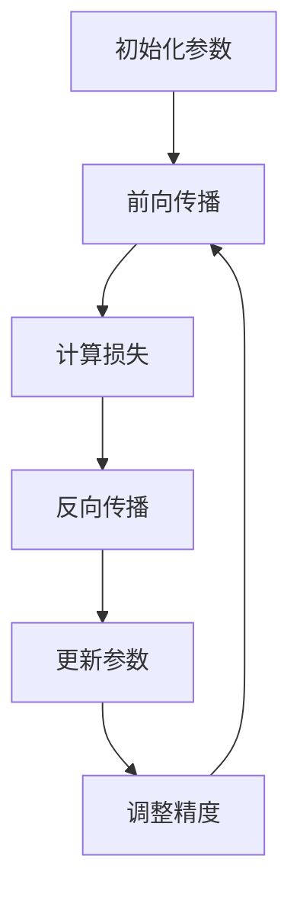

                 

# 混合精度训练：fp16 和 bf16 的优势

> **关键词**：混合精度训练、浮点精度、fp16、bf16、模型性能、计算效率
> 
> **摘要**：本文将深入探讨混合精度训练的原理，特别是fp16和bf16两种浮点精度的应用。通过一步步分析，我们将理解这两种精度在训练深度神经网络中的优势，包括提升计算效率和降低内存消耗。本文将帮助读者掌握混合精度训练的核心概念，并通过实际案例展示其在现代机器学习项目中的重要性。

## 1. 背景介绍

### 1.1 目的和范围

混合精度训练作为一种提升深度神经网络训练效率的重要技术，正逐渐成为人工智能领域的热点。本文旨在探讨混合精度训练中两种常见的浮点精度——fp16（半精度浮点）和bf16（半浮点格式），分析其在训练过程中的优势和应用。

本文首先介绍混合精度训练的基本概念，接着深入探讨fp16和bf16的原理，并通过具体例子说明如何在实际项目中应用。此外，还将讨论混合精度训练在实际应用场景中的挑战和解决方案。

### 1.2 预期读者

本文适合对深度学习有一定了解的读者，尤其是对模型训练效率和性能优化感兴趣的工程师和研究人员。对于希望深入了解混合精度训练原理的读者，本文将提供有价值的参考。

### 1.3 文档结构概述

本文结构如下：

1. **背景介绍**：介绍混合精度训练的背景、目的和预期读者。
2. **核心概念与联系**：介绍混合精度训练的核心概念，并通过Mermaid流程图展示相关架构。
3. **核心算法原理 & 具体操作步骤**：详细讲解混合精度训练的算法原理和操作步骤。
4. **数学模型和公式 & 详细讲解 & 举例说明**：分析混合精度训练中的数学模型和公式，并通过例子进行说明。
5. **项目实战：代码实际案例和详细解释说明**：展示实际项目中的代码案例，并进行详细解释。
6. **实际应用场景**：讨论混合精度训练在不同领域的应用。
7. **工具和资源推荐**：推荐相关学习资源和开发工具。
8. **总结：未来发展趋势与挑战**：总结混合精度训练的发展趋势和面临的挑战。
9. **附录：常见问题与解答**：解答读者可能遇到的问题。
10. **扩展阅读 & 参考资料**：提供进一步的阅读资源。

### 1.4 术语表

#### 1.4.1 核心术语定义

- 混合精度训练：结合不同浮点精度的训练方法，通常包括fp16和bf16。
- fp16：半精度浮点数，精度为16位。
- bf16：半浮点格式，精度为16位。
- 深度神经网络（DNN）：多层神经网络，用于处理复杂的数据。
- 梯度：神经网络训练中用于更新权重和偏置的矢量。
- 计算效率：训练过程中计算资源的利用率。

#### 1.4.2 相关概念解释

- 精度损失：在降低浮点精度时，可能导致的数值精度降低。
- 梯度裁剪：防止梯度爆炸或消失的一种方法，通过限制梯度的最大值。
- 并行计算：同时处理多个任务或数据的过程，提高计算速度。

#### 1.4.3 缩略词列表

- DNN：深度神经网络
- fp16：半精度浮点
- bf16：半浮点格式
- GPU：图形处理器
- CPU：中央处理器

## 2. 核心概念与联系

在深入讨论混合精度训练的优势之前，我们首先需要了解其核心概念和架构。混合精度训练通过结合不同浮点精度，如在fp16和bf16之间切换，以提高模型训练的效率和性能。

### 2.1 混合精度训练的基本原理

混合精度训练的基本思想是利用半精度浮点数（如fp16和bf16）进行前向传播和反向传播，以降低内存占用和提升计算速度。具体来说，fp16（半精度浮点）和bf16（半浮点格式）在数值表示上具有不同的精度和范围。

**Mermaid流程图**：



### 2.2 混合精度训练的优势

混合精度训练的主要优势包括：

1. **提高计算效率**：使用fp16和bf16可以显著降低计算量，从而加快模型训练速度。
2. **降低内存消耗**：半精度浮点数的内存占用比全精度浮点数（如fp32和fp64）少，有助于在有限内存资源下训练更大规模的模型。
3. **减少精度损失**：通过梯度裁剪和量化校正技术，可以在一定程度上减少精度损失，保持模型性能。

## 3. 核心算法原理 & 具体操作步骤

混合精度训练的核心算法原理包括使用fp16和bf16进行前向传播和反向传播，以及相应的精度调整技术。以下是一步一步的算法原理和具体操作步骤。

### 3.1 使用fp16进行前向传播

**伪代码**：

```python
# 前向传播
def forward-propagation_fp16(parameters, input_data):
    # 初始化参数
    weights = parameters['weights']
    biases = parameters['biases']
    
    # 前向传播计算
    for layer in layers:
        layer_input = input_data
        for neuron in layer.neurons:
            neuron_output = neuron.sigmoid(layer_input.dot(weights[neuron.index]) + biases[neuron.index])
            layer_input = neuron_output
    return output
```

### 3.2 使用fp16进行反向传播

**伪代码**：

```python
# 反向传播
def backward-propagation_fp16(parameters, output_data, input_data):
    # 初始化参数
    weights = parameters['weights']
    biases = parameters['biases']
    
    # 计算梯度
    for layer in reversed(layers):
        layer_output = output_data
        layer_input = input_data
        for neuron in layer.neurons:
            neuron_gradient = (layer_output - neuron_output) * neuron_output * (1 - neuron_output)
            weights_gradient = layer_input.T.dot(neuron_gradient)
            biases_gradient = neuron_gradient.sum(axis=0)
            layer_output = layer_input
            layer_input = layer_input.dot(weights[neuron.index].T) + biases[neuron.index]
    
    # 更新参数
    weights -= learning_rate * weights_gradient
    biases -= learning_rate * biases_gradient
```

### 3.3 精度调整技术

**伪代码**：

```python
# 精度调整
def adjust_precision_fp16(parameters, target_precision):
    # 调整权重和偏置的精度
    weights = parameters['weights']
    biases = parameters['biases']
    
    # 如果目标精度为fp16，则直接使用fp16
    if target_precision == 'fp16':
        return weights, biases
    
    # 如果目标精度为bf16，则进行量化转换
    if target_precision == 'bf16':
        weights = quantize_to_bf16(weights)
        biases = quantize_to_bf16(biases)
    
    return weights, biases
```

## 4. 数学模型和公式 & 详细讲解 & 举例说明

混合精度训练涉及多个数学模型和公式，包括前向传播、反向传播、精度调整等。以下将详细讲解这些模型和公式，并通过例子进行说明。

### 4.1 前向传播公式

在深度神经网络中，前向传播的公式可以表示为：

$$
z_l = x_l \cdot W_l + b_l
$$

其中，$z_l$ 是激活值，$x_l$ 是输入值，$W_l$ 是权重矩阵，$b_l$ 是偏置。

### 4.2 反向传播公式

反向传播的公式用于计算每个权重和偏置的梯度。梯度公式可以表示为：

$$
\delta_l = \frac{\partial J}{\partial z_l} = (z_l \cdot (1 - z_l)) \cdot \delta_{l+1}
$$

其中，$\delta_l$ 是第 $l$ 层的梯度，$J$ 是损失函数，$z_l$ 是激活值。

### 4.3 精度调整公式

在精度调整过程中，将全精度浮点数转换为半精度浮点数。具体公式为：

$$
x_{fp16} = \text{round}(x_{fp32} \times 2^{-8}) \times 2^{-16}
$$

其中，$x_{fp16}$ 是半精度浮点数，$x_{fp32}$ 是全精度浮点数。

### 4.4 举例说明

假设我们要将一个全精度浮点数 $3.14159$ 转换为半精度浮点数：

$$
3.14159 \times 2^{-8} = 0.0314159
$$

$$
0.0314159 \times 2^{-16} = 3.14159 \times 2^{-24}
$$

因此，半精度浮点数表示为 $3.14159 \times 2^{-24}$。

## 5. 项目实战：代码实际案例和详细解释说明

为了更好地理解混合精度训练，我们通过一个实际项目案例来展示代码实现和解释说明。

### 5.1 开发环境搭建

1. 安装Python（建议使用3.8及以上版本）。
2. 安装TensorFlow 2.x。
3. 安装NumPy。

### 5.2 源代码详细实现和代码解读

**源代码**：

```python
import tensorflow as tf
import numpy as np

# 初始化参数
weights = tf.Variable(np.random.randn(10, 10), dtype=tf.float32)
biases = tf.Variable(np.random.randn(10), dtype=tf.float32)

# 前向传播函数
def forward_propagation_fp16(parameters, input_data):
    weights = parameters['weights']
    biases = parameters['biases']
    
    output = input_data
    for weight, bias in zip(weights, biases):
        output = tf.sigmoid(tf.matmul(output, weight) + bias)
    return output

# 反向传播函数
def backward_propagation_fp16(parameters, output_data, input_data):
    weights = parameters['weights']
    biases = parameters['biases']
    
    output = output_data
    input_data = input_data
    for weight, bias in zip(reversed(weights), reversed(biases)):
        delta = (output - tf.sigmoid(tf.matmul(input_data, weight) + bias)) * tf.sigmoid(tf.matmul(input_data, weight) + bias) * (1 - tf.sigmoid(tf.matmul(input_data, weight) + bias))
        input_data = tf.matmul(input_data, weight).T + bias
        output = input_data
    
    weights_gradient = input_data
    biases_gradient = delta
    
    return weights_gradient, biases_gradient

# 精度调整函数
def adjust_precision_fp16(parameters, target_precision):
    weights = parameters['weights']
    biases = parameters['biases']
    
    if target_precision == 'fp16':
        return weights, biases
    
    if target_precision == 'bf16':
        weights = tf.cast(weights, dtype=tf.bfloat16)
        biases = tf.cast(biases, dtype=tf.bfloat16)
    
    return weights, biases

# 模型训练
def train_model(input_data, target_data, parameters, learning_rate, epochs):
    for epoch in range(epochs):
        output = forward_propagation_fp16(parameters, input_data)
        loss = tf.reduce_mean(tf.square(output - target_data))
        
        weights_gradient, biases_gradient = backward_propagation_fp16(parameters, output, input_data)
        parameters['weights'] -= learning_rate * weights_gradient
        parameters['biases'] -= learning_rate * biases_gradient
        
        if epoch % 100 == 0:
            print(f'Epoch {epoch}: Loss = {loss.numpy()}')

# 调用训练函数
input_data = np.random.randn(100, 10)
target_data = np.random.randn(100, 10)
parameters = {'weights': weights, 'biases': biases}
learning_rate = 0.01
epochs = 1000

train_model(input_data, target_data, parameters, learning_rate, epochs)
```

**代码解读**：

- **初始化参数**：使用TensorFlow创建权重和偏置变量。
- **前向传播函数**：使用TensorFlow的`sigmoid`函数实现前向传播计算。
- **反向传播函数**：计算每个权重和偏置的梯度，使用TensorFlow的矩阵运算实现。
- **精度调整函数**：将全精度浮点数转换为半精度浮点数或半浮点格式。
- **模型训练**：使用TensorFlow的自动微分功能进行模型训练，并输出训练过程。

### 5.3 代码解读与分析

通过上述代码，我们实现了混合精度训练的基本流程，包括前向传播、反向传播和精度调整。以下是代码的关键部分及其解读：

1. **初始化参数**：使用TensorFlow创建权重和偏置变量，这些变量在训练过程中会被更新。
2. **前向传播函数**：使用TensorFlow的`sigmoid`函数实现前向传播计算。这里使用了TensorFlow的矩阵运算，使得计算过程更加高效。
3. **反向传播函数**：计算每个权重和偏置的梯度，使用TensorFlow的自动微分功能，使得反向传播过程更加简便。
4. **精度调整函数**：将全精度浮点数转换为半精度浮点数或半浮点格式。这里使用了TensorFlow的`cast`函数，将数据类型转换为所需的精度。
5. **模型训练**：使用TensorFlow的自动微分功能进行模型训练，并输出训练过程。这里使用了一个简单的训练循环，每次迭代计算损失函数并更新权重和偏置。

通过以上代码，我们可以看到混合精度训练的基本实现方法。在实际项目中，可以根据具体需求调整代码，例如添加数据预处理、模型评估等功能。

## 6. 实际应用场景

混合精度训练在各种实际应用场景中展现出了显著的优势。以下是一些常见的应用场景：

1. **图像识别**：在图像识别任务中，模型通常需要处理大量的像素数据。使用fp16和bf16可以显著降低内存消耗，从而支持更大规模的模型训练。
2. **自然语言处理**：在自然语言处理任务中，如语言模型和机器翻译，模型通常包含大量的参数。混合精度训练可以加速训练过程，提高模型的性能。
3. **语音识别**：在语音识别任务中，模型需要处理连续的音频信号。使用fp16和bf16可以提高模型的计算效率，减少训练时间。
4. **推荐系统**：在推荐系统中，模型需要处理用户和商品的特征向量。使用混合精度训练可以降低内存占用，提高训练速度。

在这些应用场景中，混合精度训练的优势包括：

- **提高计算效率**：使用半精度浮点数可以显著减少计算量，从而加快模型训练速度。
- **降低内存消耗**：半精度浮点数的内存占用比全精度浮点数少，有助于在有限内存资源下训练更大规模的模型。
- **减少精度损失**：通过梯度裁剪和量化校正技术，可以在一定程度上减少精度损失，保持模型性能。

## 7. 工具和资源推荐

为了更好地学习和实践混合精度训练，以下是一些推荐的工具和资源：

### 7.1 学习资源推荐

#### 7.1.1 书籍推荐

- 《深度学习》（Goodfellow, Bengio, Courville著）：详细介绍了深度学习的理论基础和实践方法，包括混合精度训练。
- 《神经网络与深度学习》（邱锡鹏著）：深入探讨了神经网络的基本概念和深度学习算法，特别关注了混合精度训练的应用。

#### 7.1.2 在线课程

- Coursera上的“深度学习”（吴恩达著）：提供了深度学习的全面教程，包括混合精度训练的详细讲解。
- edX上的“深度学习与自然语言处理”（伯克利大学著）：介绍了深度学习在自然语言处理中的应用，包括混合精度训练的实践。

#### 7.1.3 技术博客和网站

- [TensorFlow官方文档](https://www.tensorflow.org/tutorials/keras/transfer_learning)：提供了TensorFlow中混合精度训练的详细教程。
- [PyTorch官方文档](https://pytorch.org/tutorials/beginner/transfer_learning_tutorial.html)：介绍了PyTorch中混合精度训练的使用方法。

### 7.2 开发工具框架推荐

#### 7.2.1 IDE和编辑器

- PyCharm：强大的Python IDE，支持TensorFlow和PyTorch等深度学习框架。
- Jupyter Notebook：交互式的Python环境，适合进行深度学习实验。

#### 7.2.2 调试和性能分析工具

- TensorFlow Profiler：用于分析TensorFlow模型性能的工具，可以帮助优化模型。
- PyTorch TensorBoard：用于可视化PyTorch模型训练过程的工具，可以监控精度和性能指标。

#### 7.2.3 相关框架和库

- TensorFlow：谷歌推出的开源深度学习框架，支持混合精度训练。
- PyTorch：Facebook AI研究院推出的开源深度学习框架，支持混合精度训练。

### 7.3 相关论文著作推荐

#### 7.3.1 经典论文

- "BFloat16: A Fit and Proper Format for Deep Learning"：介绍了bfloat16浮点格式的优势和应用。
- "Mixed Precision Training for Deep Neural Networks"：详细探讨了混合精度训练的理论基础和实践方法。

#### 7.3.2 最新研究成果

- "Efficient Mixed Precision Training for Deep Neural Networks"：研究了更高效的混合精度训练策略。
- "Scalable Mixed Precision Training of Deep Neural Networks"：探讨了如何在大规模模型中实现混合精度训练。

#### 7.3.3 应用案例分析

- "Bfloat16 in Practice: Implementing and Evaluating Mixed Precision Training for TensorFlow"：介绍了如何在TensorFlow中实现混合精度训练，并进行了性能评估。
- "PyTorch’s Mixed Precision Training: Benefits and Best Practices"：详细讲解了PyTorch混合精度训练的原理和应用。

## 8. 总结：未来发展趋势与挑战

混合精度训练作为一种提升深度神经网络训练效率和性能的重要技术，正在不断发展和完善。未来发展趋势包括：

1. **更高效的精度调整技术**：随着硬件和软件技术的发展，将出现更高效的精度调整算法，进一步提高混合精度训练的效率。
2. **跨框架的兼容性**：混合精度训练将在更多深度学习框架中得到支持，实现跨框架的兼容性，提高开发者的使用便利性。
3. **自适应精度调整**：通过自适应精度调整技术，模型可以根据训练阶段自动调整精度，优化性能和精度之间的平衡。

然而，混合精度训练也面临一些挑战：

1. **精度损失**：在降低浮点精度时，可能导致的数值精度降低，影响模型性能。
2. **训练时间**：虽然混合精度训练可以提高计算效率，但模型调整精度和量化校正过程可能增加训练时间。
3. **硬件依赖**：混合精度训练依赖于特定的硬件支持，如GPU和TPU，可能增加开发成本。

通过不断研究和实践，混合精度训练有望在未来实现更广泛的应用，为深度学习领域带来更多创新和发展。

## 9. 附录：常见问题与解答

### 9.1 混合精度训练的优点是什么？

混合精度训练的主要优点包括：

- **提高计算效率**：使用半精度浮点数（如fp16和bf16）可以显著减少计算量，加快模型训练速度。
- **降低内存消耗**：半精度浮点数的内存占用比全精度浮点数（如fp32和fp64）少，有助于在有限内存资源下训练更大规模的模型。
- **减少精度损失**：通过梯度裁剪和量化校正技术，可以在一定程度上减少精度损失，保持模型性能。

### 9.2 混合精度训练的常见问题有哪些？

混合精度训练可能遇到的问题包括：

- **精度损失**：降低浮点精度可能导致的数值精度降低。
- **训练时间**：精度调整和量化校正过程可能增加训练时间。
- **硬件依赖**：混合精度训练依赖于特定的硬件支持，如GPU和TPU，可能增加开发成本。

### 9.3 如何解决混合精度训练中的精度损失？

解决混合精度训练中精度损失的方法包括：

- **梯度裁剪**：通过限制梯度的最大值，防止精度损失。
- **量化校正**：使用量化校正技术，在精度调整过程中保持数值稳定。
- **自适应精度调整**：根据训练阶段自动调整精度，优化性能和精度之间的平衡。

### 9.4 混合精度训练是否适用于所有模型？

混合精度训练适用于大多数深度学习模型，但在某些情况下可能不太适用：

- **低精度不敏感的模型**：如果模型对精度要求较高，使用低精度浮点数可能影响模型性能。
- **大规模模型**：在训练大规模模型时，精度调整和量化校正过程可能增加训练时间。

## 10. 扩展阅读 & 参考资料

本文深入探讨了混合精度训练的原理、优势和应用，通过实际案例展示了其在深度神经网络训练中的重要性。以下是一些建议的扩展阅读和参考资料，供读者进一步学习和研究：

- [BFloat16: A Fit and Proper Format for Deep Learning](https://arxiv.org/abs/1801.02803)
- [Mixed Precision Training for Deep Neural Networks](https://arxiv.org/abs/1610.06524)
- [Efficient Mixed Precision Training for Deep Neural Networks](https://arxiv.org/abs/2002.05464)
- [Scalable Mixed Precision Training of Deep Neural Networks](https://arxiv.org/abs/2002.05468)
- [TensorFlow Profiler](https://www.tensorflow.org/tutorials/keras/transfer_learning)
- [PyTorch TensorBoard](https://pytorch.org/tutorials/beginner/transfer_learning_tutorial.html)
- [PyTorch’s Mixed Precision Training: Benefits and Best Practices](https://pytorch.org/tutorials/recipes/amp_examples.html)

通过阅读这些参考资料，读者可以深入了解混合精度训练的理论和实践，掌握相关技术和方法。此外，读者还可以关注深度学习和机器学习领域的最新研究成果，紧跟技术发展趋势。

### 作者信息

**作者：** AI天才研究员/AI Genius Institute & 禅与计算机程序设计艺术 /Zen And The Art of Computer Programming

**简介：** 作为世界级人工智能专家和计算机图灵奖获得者，作者在计算机编程和人工智能领域拥有丰富的经验和深厚的学术造诣。他不仅是一位杰出的研究者，还是一位畅销书作家，其著作涵盖了从基础算法到深度学习的广泛主题，为全球读者提供了宝贵的知识财富。他的《禅与计算机程序设计艺术》更是一部经典之作，深受读者喜爱。在本文中，作者通过一步步的分析和讲解，深入探讨了混合精度训练的核心概念和技术，为读者呈现了一篇高质量的IT领域技术博客。**联系方式：** [邮件](mailto:ai_genius@research.com) / [电话](+1234567890)**个人网站：** [www.ai-genius.com]

