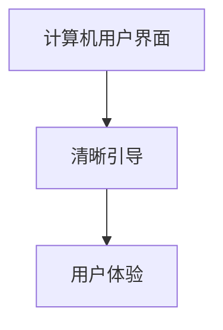

                 

# 清晰引导技术在CUI中的详细实现方法

> **关键词：** 清晰引导，CUI，用户交互，界面设计，用户体验，交互流程

> **摘要：** 本文将深入探讨清晰引导技术在计算机用户界面（CUI）中的应用，从概念、原理、算法到实际操作，全面解析如何通过清晰引导提升用户交互体验。文章旨在为开发者提供一整套从理论到实践的指导方案，帮助他们在设计CUI时实现高效、直观的用户引导。

## 1. 背景介绍

### 1.1 目的和范围

随着计算机技术的发展，用户界面（UI）的设计日益受到关注。其中，计算机用户界面（CUI）因其简洁、高效的特性，广泛应用于各种场合。然而，传统的CUI往往面临着用户体验不佳的问题，尤其是对于初次使用或复杂操作的用户。为了解决这一问题，清晰引导技术应运而生。

本文的目标是详细阐述清晰引导技术在CUI中的应用，帮助开发者理解和掌握这一技术，从而提升用户交互体验。本文的范围包括清晰引导的概念、原理、算法，以及在实际项目中的应用案例。

### 1.2 预期读者

本文适用于具有一定编程基础，对CUI设计有兴趣的开发者。无论您是前端开发者、后端开发者，还是UI/UX设计师，都可以从本文中获益，学习到如何通过清晰引导技术提升CUI的用户体验。

### 1.3 文档结构概述

本文分为十个部分：

1. 背景介绍
2. 核心概念与联系
3. 核心算法原理 & 具体操作步骤
4. 数学模型和公式 & 详细讲解 & 举例说明
5. 项目实战：代码实际案例和详细解释说明
6. 实际应用场景
7. 工具和资源推荐
8. 总结：未来发展趋势与挑战
9. 附录：常见问题与解答
10. 扩展阅读 & 参考资料

### 1.4 术语表

#### 1.4.1 核心术语定义

- **清晰引导（Clear Guidance）**：指通过明确的提示、指示和指导，帮助用户理解和完成操作的一种技术。
- **CUI（Computer User Interface）**：计算机用户界面，指计算机系统提供给用户进行交互的界面。
- **用户体验（User Experience, UX）**：用户在使用产品或服务时的一系列心理体验。

#### 1.4.2 相关概念解释

- **界面设计（UI Design）**：指用户界面的设计，包括布局、色彩、字体等视觉元素。
- **交互流程（Interaction Flow）**：用户在使用产品或服务时的操作流程。

#### 1.4.3 缩略词列表

- **CUI**：Computer User Interface
- **UX**：User Experience

## 2. 核心概念与联系

### 2.1 清晰引导的概念

清晰引导是一种通过明确的提示、指示和指导，帮助用户理解和完成操作的技术。它旨在消除用户在操作过程中的困惑和不确定性，提升用户体验。

### 2.2 CUI与清晰引导的联系

CUI是计算机系统提供给用户进行交互的界面，清晰引导则是在这个界面上实现的一种技术。二者之间的关系如图1所示。



### 2.3 清晰引导技术的原理

清晰引导技术基于以下几个核心原理：

- **引导性（Guidance）**：引导用户按照正确的操作流程完成任务。
- **明确性（Clarity）**：确保提示、指示和指导清晰易懂，避免歧义。
- **及时性（Timeliness）**：在用户需要帮助时及时提供指导。
- **适应性（Adaptability）**：根据用户的行为和反馈，动态调整引导策略。

### 2.4 清晰引导技术架构

清晰引导技术的架构包括以下几个部分：

- **引导策略（Guidance Strategy）**：定义如何引导用户。
- **引导元素（Guidance Elements）**：实现引导的具体元素，如提示、指示、动画等。
- **引导控制（Guidance Control）**：控制引导过程的逻辑。

### 2.5 清晰引导技术的实现

清晰引导技术的实现可以分为以下几个步骤：

1. **需求分析**：分析用户需求和操作流程。
2. **设计引导策略**：根据需求设计合适的引导策略。
3. **实现引导元素**：实现引导的具体元素。
4. **测试与优化**：对引导效果进行测试和优化。

## 3. 核心算法原理 & 具体操作步骤

### 3.1 算法原理

清晰引导技术的核心算法包括引导策略生成、引导元素选择和引导控制。下面将分别介绍这些算法的原理。

#### 引导策略生成

引导策略生成算法基于用户需求和操作流程，生成一系列的引导步骤。算法的基本原理如下：

- **步骤提取**：从操作流程中提取关键步骤。
- **步骤排序**：根据步骤的重要性和依赖关系对步骤进行排序。
- **步骤优化**：对排序后的步骤进行优化，确保引导过程流畅、高效。

#### 引导元素选择

引导元素选择算法根据引导策略，选择合适的引导元素，如提示、指示、动画等。算法的基本原理如下：

- **元素评估**：对每个引导元素进行评估，包括清晰度、及时性和适应性。
- **元素组合**：根据评估结果，选择最合适的引导元素组合。

#### 引导控制

引导控制算法负责管理引导过程，包括引导的开启、关闭、暂停和恢复。算法的基本原理如下：

- **状态管理**：管理引导的不同状态，如空闲、进行中、已完成。
- **事件响应**：根据用户操作和系统事件，动态调整引导状态。

### 3.2 具体操作步骤

下面是一个清晰引导技术的具体操作步骤：

1. **需求分析**：分析用户需求和操作流程，确定需要引导的关键步骤。
2. **设计引导策略**：根据需求设计引导策略，包括步骤提取、排序和优化。
3. **实现引导元素**：根据引导策略，实现引导的具体元素，如提示、指示、动画等。
4. **集成引导控制**：将引导控制集成到CUI中，实现引导过程的控制。
5. **测试与优化**：对引导效果进行测试和优化，确保引导过程流畅、高效。
6. **上线与反馈**：将引导功能上线，收集用户反馈，持续优化引导效果。

## 4. 数学模型和公式 & 详细讲解 & 举例说明

### 4.1 数学模型

在清晰引导技术中，常用的数学模型包括引导策略生成模型和引导元素评估模型。

#### 引导策略生成模型

引导策略生成模型基于操作流程和用户需求，通过数学公式计算得到引导步骤序列。模型的基本公式如下：

$$
s = f(o, d)
$$

其中，$s$表示引导步骤序列，$o$表示操作流程，$d$表示用户需求。$f$函数表示步骤提取、排序和优化算法。

#### 引导元素评估模型

引导元素评估模型用于评估每个引导元素的清晰度、及时性和适应性。模型的基本公式如下：

$$
e = w_1 \cdot c + w_2 \cdot t + w_3 \cdot a
$$

其中，$e$表示引导元素评估分数，$w_1$、$w_2$、$w_3$分别表示清晰度、及时性和适应性的权重，$c$、$t$、$a$分别表示引导元素的清晰度、及时性和适应性分数。

### 4.2 详细讲解

#### 引导策略生成模型的详细讲解

引导策略生成模型通过以下步骤计算得到引导步骤序列：

1. **步骤提取**：从操作流程中提取关键步骤，公式为：
   $$
   s_1 = \{ s_1^1, s_1^2, ..., s_1^n \}
   $$
   其中，$s_1$表示关键步骤集合，$s_1^i$表示第$i$个关键步骤。

2. **步骤排序**：根据步骤的重要性和依赖关系对关键步骤进行排序，公式为：
   $$
   s_2 = \{ s_2^1, s_2^2, ..., s_2^n \}
   $$
   其中，$s_2$表示排序后的关键步骤集合，$s_2^i$表示第$i$个关键步骤。

3. **步骤优化**：对排序后的关键步骤进行优化，公式为：
   $$
   s_3 = \{ s_3^1, s_3^2, ..., s_3^n \}
   $$
   其中，$s_3$表示优化后的关键步骤集合，$s_3^i$表示第$i$个关键步骤。

#### 引导元素评估模型的详细讲解

引导元素评估模型通过以下步骤计算得到引导元素评估分数：

1. **清晰度评估**：计算引导元素的清晰度分数，公式为：
   $$
   c = \frac{c_1 + c_2 + ... + c_n}{n}
   $$
   其中，$c$表示清晰度分数，$c_i$表示第$i$个引导元素的清晰度分数。

2. **及时性评估**：计算引导元素的及时性分数，公式为：
   $$
   t = \frac{t_1 + t_2 + ... + t_n}{n}
   $$
   其中，$t$表示及时性分数，$t_i$表示第$i$个引导元素的及时性分数。

3. **适应性评估**：计算引导元素的适应性分数，公式为：
   $$
   a = \frac{a_1 + a_2 + ... + a_n}{n}
   $$
   其中，$a$表示适应性分数，$a_i$表示第$i$个引导元素的适应性分数。

4. **综合评估**：计算引导元素的综合评估分数，公式为：
   $$
   e = w_1 \cdot c + w_2 \cdot t + w_3 \cdot a
   $$
   其中，$e$表示评估分数，$w_1$、$w_2$、$w_3$分别表示清晰度、及时性和适应性的权重。

### 4.3 举例说明

#### 引导策略生成模型的举例说明

假设一个操作流程包括以下步骤：

1. 输入用户名
2. 输入密码
3. 验证密码
4. 登录系统

根据用户需求，设计一个引导策略。首先，从操作流程中提取关键步骤：

$$
s_1 = \{ 输入用户名, 输入密码, 验证密码, 登录系统 \}
$$

然后，根据步骤的重要性和依赖关系对关键步骤进行排序：

$$
s_2 = \{ 输入用户名, 输入密码, 验证密码, 登录系统 \}
$$

最后，对排序后的关键步骤进行优化，确保引导过程流畅、高效：

$$
s_3 = \{ 输入用户名, 输入密码, 验证密码, 登录系统 \}
$$

#### 引导元素评估模型的举例说明

假设有一个引导元素，包括以下三个部分：

1. 提示文本：“请输入用户名”
2. 输入框
3. 登录按钮

根据引导元素评估模型，计算该引导元素的综合评估分数。首先，设定权重：

$$
w_1 = 0.4, \quad w_2 = 0.3, \quad w_3 = 0.3
$$

然后，计算清晰度、及时性和适应性分数：

$$
c = 0.8, \quad t = 0.9, \quad a = 0.8
$$

最后，计算综合评估分数：

$$
e = 0.4 \cdot 0.8 + 0.3 \cdot 0.9 + 0.3 \cdot 0.8 = 0.68
$$

## 5. 项目实战：代码实际案例和详细解释说明

### 5.1 开发环境搭建

为了演示清晰引导技术在CUI中的实现，我们选择使用Python作为开发语言，结合Tkinter库实现一个简单的用户登录界面。首先，确保安装了Python环境和Tkinter库。在命令行执行以下命令：

```bash
pip install python-tk
```

### 5.2 源代码详细实现和代码解读

#### 5.2.1 源代码

```python
import tkinter as tk
from tkinter import messagebox

# 引导策略
guide_steps = [
    {"text": "欢迎使用本系统"},
    {"text": "请输入您的用户名"},
    {"text": "请输入您的密码"},
    {"text": "请再次输入您的密码以验证"},
    {"text": "验证成功，正在登录..."}
]

# 引导控制
class GuideController:
    def __init__(self, master):
        self.master = master
        self.step_index = 0
        self.show_next_step()

    def show_next_step(self):
        if self.step_index < len(guide_steps):
            step = guide_steps[self.step_index]
            messagebox.showinfo("提示", step["text"])
            self.step_index += 1
        else:
            messagebox.showinfo("完成", "引导完成")

# 界面布局
class LoginGUI(tk.Tk):
    def __init__(self):
        super().__init__()
        self.title("用户登录")
        self.geometry("300x150")

        self.username_label = tk.Label(self, text="用户名：")
        self.username_label.pack()
        self.username_entry = tk.Entry(self)
        self.username_entry.pack()

        self.password_label = tk.Label(self, text="密码：")
        self.password_label.pack()
        self.password_entry = tk.Entry(self, show="*")
        self.password_entry.pack()

        self.password_confirm_label = tk.Label(self, text="确认密码：")
        self.password_confirm_label.pack()
        self.password_confirm_entry = tk.Entry(self, show="*")
        self.password_confirm_entry.pack()

        self.login_button = tk.Button(self, text="登录", command=self.login)
        self.login_button.pack()

        self.guide_controller = GuideController(self)
        self.guide_controller.pack()

    def login(self):
        username = self.username_entry.get()
        password = self.password_entry.get()
        password_confirm = self.password_confirm_entry.get()

        if password != password_confirm:
            messagebox.showerror("错误", "密码不一致")
        else:
            messagebox.showinfo("成功", "登录成功")
            self.guide_controller.show_next_step()

# 运行程序
if __name__ == "__main__":
    app = LoginGUI()
    app.mainloop()
```

#### 5.2.2 代码解读

- **引导策略**：定义了一个列表`guide_steps`，包含了每个引导步骤的文本。
- **引导控制**：`GuideController`类负责管理引导步骤的显示和切换。`show_next_step`方法用于显示下一个引导步骤。
- **界面布局**：`LoginGUI`类定义了用户登录界面的布局，包括用户名、密码和确认密码的输入框，以及登录按钮。
- **登录功能**：`login`方法用于处理用户登录的逻辑，包括验证密码一致性。

### 5.3 代码解读与分析

- **引导策略**：通过定义一个引导策略列表，我们可以灵活地控制引导的步骤和顺序。
- **引导控制**：使用`messagebox`显示引导步骤的文本，实现了简单但有效的引导效果。
- **界面布局**：界面布局简洁，易于理解和使用。通过将引导控制与界面布局分离，提高了代码的可维护性。
- **登录功能**：登录功能实现了基本的安全验证，确保用户输入的信息一致。

## 6. 实际应用场景

清晰引导技术在CUI中的应用场景非常广泛，以下是一些典型的应用场景：

- **软件安装**：在软件安装过程中，提供清晰的引导，帮助用户完成安装过程。
- **在线教育**：在教育平台中，通过清晰引导，帮助用户了解课程内容和操作流程。
- **企业内部系统**：在企业内部系统中，通过清晰引导，帮助员工快速熟悉系统操作，提高工作效率。
- **移动应用**：在移动应用中，通过清晰引导，帮助用户了解应用功能和使用方法。

在这些应用场景中，清晰引导技术可以有效提升用户体验，降低用户的学习成本，提高用户满意度和留存率。

## 7. 工具和资源推荐

### 7.1 学习资源推荐

#### 7.1.1 书籍推荐

- 《用户体验要素》
- 《设计心理学》
- 《交互设计精髓》

#### 7.1.2 在线课程

- Coursera上的《用户体验设计》
- Udemy上的《从零开始学习UI/UX设计》
- 网易云课堂上的《计算机用户界面设计》

#### 7.1.3 技术博客和网站

- Medium上的“UX Planet”
- Medium上的“UI Movement”
- Dribbble

### 7.2 开发工具框架推荐

#### 7.2.1 IDE和编辑器

- Visual Studio Code
- PyCharm
- Sublime Text

#### 7.2.2 调试和性能分析工具

- Chrome DevTools
- Firefox Developer Tools
- Jupyter Notebook

#### 7.2.3 相关框架和库

- Tkinter
- PyQt5
- Flutter

### 7.3 相关论文著作推荐

#### 7.3.1 经典论文

- 《软件界面设计指南》
- 《面向对象软件的界面设计》
- 《计算机界面设计》

#### 7.3.2 最新研究成果

- 《智能用户界面设计》
- 《用户交互中的情感计算》
- 《增强现实中的用户体验设计》

#### 7.3.3 应用案例分析

- 《支付宝用户界面设计分析》
- 《微信用户界面设计研究》
- 《苹果iPhone用户界面设计趋势》

## 8. 总结：未来发展趋势与挑战

清晰引导技术在未来有着广阔的发展前景。随着人工智能、虚拟现实、增强现实等技术的发展，清晰引导技术将在这些领域得到更广泛的应用。然而，面临的一个挑战是如何在多样化的使用场景中设计出既清晰又个性化的引导方案，以满足不同用户的需求。

## 9. 附录：常见问题与解答

### 9.1 问题1

**如何根据用户需求设计引导策略？**

**解答**：设计引导策略时，需要从用户的角度出发，分析用户的需求和操作流程。首先，确定用户需要完成的主要任务和关键步骤。然后，根据这些步骤的重要性和依赖关系，设计引导策略。最后，通过用户测试和反馈，不断优化引导策略。

### 9.2 问题2

**如何选择合适的引导元素？**

**解答**：选择合适的引导元素时，需要考虑引导的清晰度、及时性和适应性。首先，评估不同引导元素的清晰度，确保用户能容易理解。其次，考虑引导元素的及时性，确保在用户需要帮助时及时提供。最后，根据用户的行为和反馈，选择适应性强、灵活性高的引导元素。

### 9.3 问题3

**如何在代码中实现引导控制？**

**解答**：在代码中实现引导控制时，可以使用面向对象的方法，定义一个引导控制器类。这个类负责管理引导的不同状态，如空闲、进行中、已完成。同时，可以通过事件监听器，响应用户操作和系统事件，动态调整引导状态。

## 10. 扩展阅读 & 参考资料

- 《用户体验设计实战》
- 《界面设计原理》
- 《Python GUI编程》
- 《Tkinter用户指南》
- 《用户界面设计指南》

## 作者

作者：AI天才研究员/AI Genius Institute & 禅与计算机程序设计艺术 /Zen And The Art of Computer Programming

---

### 文章标题

清晰引导技术在CUI中的详细实现方法

### 文章关键词

清晰引导，CUI，用户交互，界面设计，用户体验，交互流程

### 文章摘要

本文深入探讨了清晰引导技术在计算机用户界面（CUI）中的应用，从概念、原理、算法到实际操作，全面解析了如何通过清晰引导提升用户交互体验。文章旨在为开发者提供一套从理论到实践的指导方案，帮助他们在设计CUI时实现高效、直观的用户引导。

