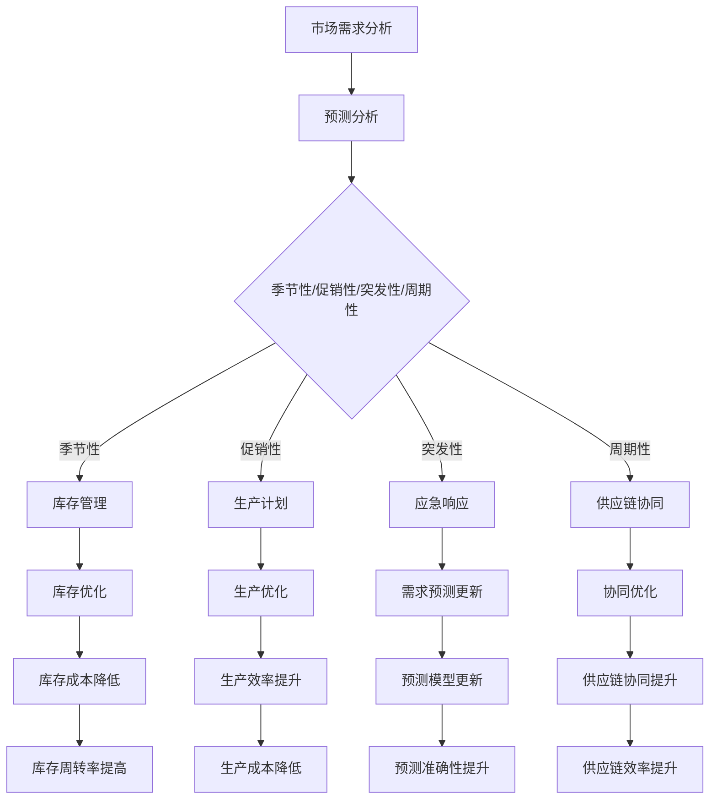

                 


# 满足短期需求的商品供给

> 关键词：短期需求、商品供给、供应链管理、预测分析、动态调整策略

> 摘要：本文将探讨如何通过有效的供应链管理方法，实现对短期需求的快速响应，并确保商品供给的稳定性和准确性。文章首先介绍了短期需求的背景和重要性，随后分析了商品供给的核心概念，并详细阐述了预测分析在满足短期需求中的作用。此外，文章还提出了动态调整策略，并通过实际案例和代码示例，展示了如何将理论应用于实践。

## 1. 背景介绍

### 1.1 目的和范围

本文的目的是探讨如何在现代供应链管理中有效地应对短期需求变化。通过对市场需求的分析和预测，以及供应链各环节的协同优化，实现商品供给的及时性和准确性。本文的研究范围包括：

- 短期需求的定义和分类
- 商品供给的核心概念和挑战
- 预测分析在供应链管理中的应用
- 动态调整策略的设计和实现

### 1.2 预期读者

本文主要面向供应链管理从业者、企业决策者、数据分析工程师和IT程序员。对于希望在供应链领域有所建树的读者，本文将提供有价值的理论和实践经验。

### 1.3 文档结构概述

本文结构如下：

- 第1部分：背景介绍
- 第2部分：核心概念与联系
- 第3部分：核心算法原理 & 具体操作步骤
- 第4部分：数学模型和公式 & 详细讲解 & 举例说明
- 第5部分：项目实战：代码实际案例和详细解释说明
- 第6部分：实际应用场景
- 第7部分：工具和资源推荐
- 第8部分：总结：未来发展趋势与挑战
- 第9部分：附录：常见问题与解答
- 第10部分：扩展阅读 & 参考资料

### 1.4 术语表

#### 1.4.1 核心术语定义

- 短期需求：指在短时间内（通常为几天到几个月）对商品的需求量。
- 商品供给：指供应链中提供商品的能力，包括库存管理、生产计划和物流配送等。
- 预测分析：指通过历史数据和统计分析方法，预测未来需求量的一种技术。
- 动态调整策略：指根据实时数据和预测结果，动态调整供应链各环节的策略。

#### 1.4.2 相关概念解释

- 供应链管理：指对供应链的各个环节进行协调和优化，以实现高效的商品供给。
- 需求波动：指市场需求量的变化，可能由于季节性、促销活动、突发事件等因素引起。
- 库存优化：指通过合理的库存管理，降低库存成本，提高库存周转率。

#### 1.4.3 缩略词列表

- SCM：供应链管理（Supply Chain Management）
- AI：人工智能（Artificial Intelligence）
- ML：机器学习（Machine Learning）
- LP：线性规划（Linear Programming）

## 2. 核心概念与联系

在现代供应链管理中，短期需求的商品供给是一个复杂而关键的环节。为了更好地理解这一过程，我们首先需要明确一些核心概念，并探讨它们之间的联系。

### 2.1 短期需求的分类与特征

短期需求可以细分为以下几类：

- **季节性需求**：由于季节变化导致的商品需求波动，如冬季热销的羽绒服和夏季热销的冰淇淋。
- **促销性需求**：由于促销活动引发的短期需求激增，如双十一购物节的电子产品销售。
- **突发性需求**：由于突发事件（如自然灾害、社会动荡等）导致的短期需求变化。
- **周期性需求**：由于企业生产周期或项目进展导致的定期需求波动。

这些不同类型的短期需求具有不同的特征，对供应链管理提出了不同的挑战。例如，季节性需求需要提前预测和准备，而突发性需求则需要快速响应和调整。

### 2.2 商品供给的核心概念

商品供给包括以下几个核心环节：

- **库存管理**：指对库存量进行监控和控制，确保库存水平合理。
- **生产计划**：指根据市场需求和生产能力，制定生产计划，以满足需求。
- **物流配送**：指将生产好的商品运输到客户手中，确保及时交付。
- **供应链协同**：指供应链各环节的协同工作，实现高效的商品供给。

这些环节相互关联，共同构成了商品供给的整体流程。一个高效的供应链管理系统需要协调各个环节，确保商品供给的连续性和稳定性。

### 2.3 预测分析在供应链管理中的应用

预测分析在供应链管理中扮演着关键角色。通过分析历史数据和市场趋势，可以预测未来的需求量，从而为供应链管理提供依据。预测分析的主要方法包括：

- **时间序列分析**：通过分析时间序列数据，预测未来的需求量。
- **回归分析**：通过建立需求量与其他变量之间的关系模型，预测未来的需求量。
- **机器学习**：利用机器学习算法，从大量数据中提取规律，进行需求预测。

这些方法可以帮助企业更好地应对短期需求的变化，优化供应链管理策略。

### 2.4 动态调整策略的设计和实现

动态调整策略是指根据实时数据和预测结果，动态调整供应链各环节的策略。这种策略的核心在于快速响应市场需求变化，确保商品供给的及时性和准确性。动态调整策略的实现包括以下几个方面：

- **实时数据采集**：通过物联网、传感器等技术，实时采集市场需求数据。
- **预测模型更新**：根据实时数据，更新预测模型，提高预测准确性。
- **供应链协同优化**：通过优化库存管理、生产计划和物流配送等环节，实现供应链的动态调整。
- **应急响应机制**：建立应急响应机制，应对突发事件引起的短期需求变化。

动态调整策略的设计和实现是一个复杂的过程，需要综合考虑市场需求、生产能力、物流配送等多方面因素。

### 2.5 Mermaid 流程图

下面是商品供给的核心概念和流程的 Mermaid 流程图：



该流程图展示了短期需求的商品供给流程，以及各个环节之间的相互关系。

## 3. 核心算法原理 & 具体操作步骤

在了解短期需求的商品供给流程后，我们需要深入探讨预测分析和动态调整策略的核心算法原理，以及具体的操作步骤。

### 3.1 预测分析算法原理

预测分析是供应链管理中的关键环节，其核心算法包括时间序列分析、回归分析和机器学习等。以下将分别介绍这些算法的原理：

#### 3.1.1 时间序列分析

时间序列分析是一种基于历史数据，分析时间序列中数据的变化规律，从而预测未来趋势的方法。其基本原理包括：

- **趋势分析**：通过观察时间序列数据的变化趋势，确定数据的总体趋势是上升、下降还是平稳。
- **季节性分析**：通过观察时间序列数据，确定是否存在季节性波动，如每年的同一时间点需求量是否相似。
- **周期性分析**：通过观察时间序列数据，确定是否存在周期性波动，如每隔一段时间需求量是否发生变化。

具体操作步骤如下：

1. **数据收集**：收集历史需求数据，包括时间戳和对应的需求量。
2. **数据预处理**：对数据进行清洗和处理，如去除异常值、缺失值填充等。
3. **趋势分析**：使用移动平均法、指数平滑法等方法，分析数据的变化趋势。
4. **季节性分析**：使用季节性分解方法，如季节性分解法、X-11季节调整法等，分析数据中的季节性成分。
5. **周期性分析**：使用周期性检测方法，如周期性滤波器、自相关函数等，分析数据中的周期性成分。
6. **模型建立**：根据分析结果，建立预测模型，如ARIMA模型、季节性ARIMA模型等。
7. **预测**：使用建立的预测模型，预测未来的需求量。

#### 3.1.2 回归分析

回归分析是一种基于历史数据，通过建立需求量与其他变量之间的数学模型，预测未来需求量的方法。其基本原理包括：

- **线性回归**：通过建立需求量与自变量之间的线性关系模型，预测未来的需求量。
- **多项式回归**：通过建立需求量与自变量之间的多项式关系模型，预测未来的需求量。
- **非线性回归**：通过建立需求量与自变量之间的非线性关系模型，预测未来的需求量。

具体操作步骤如下：

1. **数据收集**：收集历史需求数据和其他相关变量数据。
2. **数据预处理**：对数据进行清洗和处理，如去除异常值、缺失值填充等。
3. **模型建立**：选择合适的回归模型，如线性回归模型、多项式回归模型等。
4. **模型训练**：使用历史数据，训练回归模型，确定模型的参数。
5. **预测**：使用训练好的模型，预测未来的需求量。

#### 3.1.3 机器学习

机器学习是一种基于历史数据，通过学习数据中的规律，进行需求预测的方法。其基本原理包括：

- **监督学习**：通过学习历史数据中的规律，预测未来的需求量。
- **无监督学习**：通过发现历史数据中的隐藏规律，进行需求预测。
- **强化学习**：通过不断尝试和反馈，优化供应链管理策略。

具体操作步骤如下：

1. **数据收集**：收集历史需求数据和相关变量数据。
2. **数据预处理**：对数据进行清洗和处理，如去除异常值、缺失值填充等。
3. **模型选择**：选择合适的机器学习模型，如线性回归模型、神经网络模型等。
4. **模型训练**：使用历史数据，训练机器学习模型，确定模型的参数。
5. **预测**：使用训练好的模型，预测未来的需求量。

### 3.2 动态调整策略的操作步骤

动态调整策略的核心在于根据实时数据和预测结果，动态调整供应链各环节的策略。具体操作步骤如下：

1. **实时数据采集**：通过物联网、传感器等技术，实时采集市场需求数据。
2. **预测模型更新**：根据实时数据，更新预测模型，提高预测准确性。
3. **供应链协同优化**：通过优化库存管理、生产计划和物流配送等环节，实现供应链的动态调整。
4. **应急响应机制**：建立应急响应机制，应对突发事件引起的短期需求变化。
5. **策略调整**：根据实时数据和预测结果，调整供应链各环节的策略，如增加库存、调整生产计划等。

### 3.3 伪代码示例

以下是一个基于时间序列分析的预测分析算法的伪代码示例：

```
Algorithm: TimeSeriesPrediction
Input: historical_data (历史需求数据)
Output: predicted_demand (未来需求预测)

1. 数据预处理
   - 去除异常值
   - 缺失值填充

2. 趋势分析
   - 使用移动平均法分析数据趋势
   - 使用指数平滑法分析数据趋势

3. 季节性分析
   - 使用季节性分解法分析数据季节性成分
   - 使用X-11季节调整法分析数据季节性成分

4. 周期性分析
   - 使用周期性滤波器分析数据周期性成分
   - 使用自相关函数分析数据周期性成分

5. 模型建立
   - 选择合适的预测模型，如ARIMA模型、季节性ARIMA模型等

6. 预测
   - 使用建立的预测模型，预测未来的需求量
   - 输出预测结果

End Algorithm
```

通过以上步骤，我们可以实现基于时间序列分析的短期需求预测，为供应链管理提供依据。

## 4. 数学模型和公式 & 详细讲解 & 举例说明

在满足短期需求的商品供给过程中，数学模型和公式发挥着关键作用。以下将详细介绍几种常见的数学模型和公式，并给出具体的解释和举例说明。

### 4.1 时间序列模型

时间序列模型是预测短期需求的一种重要工具。其中，ARIMA（自回归积分滑动平均模型）模型是一种广泛应用的时间序列模型。ARIMA模型由三个部分组成：自回归（AR）、差分（I）和移动平均（MA）。

#### 4.1.1 自回归（AR）

自回归模型假设当前值与之前的几个值之间存在线性关系。其一般形式为：

$$
X_t = c + \phi_1 X_{t-1} + \phi_2 X_{t-2} + \ldots + \phi_p X_{t-p} + \varepsilon_t
$$

其中，$X_t$ 表示当前值，$c$ 表示常数项，$\phi_1, \phi_2, \ldots, \phi_p$ 表示自回归系数，$\varepsilon_t$ 表示随机误差项。

#### 4.1.2 差分（I）

差分操作用于消除时间序列中的趋势和季节性成分。一阶差分公式为：

$$
X_t^{(1)} = X_t - X_{t-1}
$$

#### 4.1.3 移动平均（MA）

移动平均模型假设当前值与之前的几个预测误差值之间存在线性关系。其一般形式为：

$$
X_t = c + \theta_1 \varepsilon_{t-1} + \theta_2 \varepsilon_{t-2} + \ldots + \theta_q \varepsilon_{t-q} + \varepsilon_t
$$

其中，$c$ 表示常数项，$\theta_1, \theta_2, \ldots, \theta_q$ 表示移动平均系数，$\varepsilon_t$ 表示随机误差项。

#### 4.1.4 ARIMA模型

ARIMA模型将自回归、差分和移动平均结合起来，其一般形式为：

$$
X_t^{(1)} = c + \phi_1 X_{t-1}^{(1)} + \ldots + \phi_p X_{t-p}^{(1)} + \theta_1 \varepsilon_{t-1} + \ldots + \theta_q \varepsilon_{t-q} + \varepsilon_t
$$

#### 4.1.5 举例说明

假设我们有一组时间序列数据，如下表所示：

| 时间戳 | 需求量 |
| ------ | ------ |
| 1      | 100    |
| 2      | 110    |
| 3      | 120    |
| 4      | 130    |
| 5      | 140    |

使用ARIMA模型进行需求预测。首先，对数据进行一阶差分，消除趋势和季节性成分。然后，通过自相关函数和偏自相关函数，确定ARIMA模型的参数$p$和$q$。最后，使用训练好的ARIMA模型，预测未来的需求量。

### 4.2 回归模型

回归模型是一种基于历史数据，通过建立需求量与其他变量之间关系的数学模型。线性回归模型是最常见的回归模型之一。

#### 4.2.1 线性回归模型

线性回归模型的一般形式为：

$$
Y = \beta_0 + \beta_1 X + \varepsilon
$$

其中，$Y$ 表示需求量，$X$ 表示其他变量，$\beta_0$ 和 $\beta_1$ 表示回归系数，$\varepsilon$ 表示随机误差项。

#### 4.2.2 举例说明

假设我们有一组时间序列数据，如下表所示：

| 时间戳 | 需求量 | 其他变量 |
| ------ | ------ | -------- |
| 1      | 100    | 10       |
| 2      | 110    | 11       |
| 3      | 120    | 12       |
| 4      | 130    | 13       |
| 5      | 140    | 14       |

使用线性回归模型建立需求量与其他变量之间的关系。通过最小二乘法，确定回归系数$\beta_0$ 和 $\beta_1$。然后，使用训练好的线性回归模型，预测未来的需求量。

### 4.3 机器学习模型

机器学习模型是一种基于历史数据，通过学习数据中的规律，进行需求预测的数学模型。神经网络模型是一种常见的机器学习模型。

#### 4.3.1 神经网络模型

神经网络模型的一般形式为：

$$
\hat{Y} = \sigma(\sum_{i=1}^{n} w_i \sigma(\sum_{j=1}^{m} x_{ji} \theta_{ji}) + b)
$$

其中，$\hat{Y}$ 表示预测需求量，$\sigma$ 表示激活函数，$w_i$ 和 $\theta_{ji}$ 表示权重，$x_{ji}$ 表示输入变量，$b$ 表示偏置。

#### 4.3.2 举例说明

假设我们有一组时间序列数据，如下表所示：

| 时间戳 | 需求量 | 输入变量1 | 输入变量2 |
| ------ | ------ | --------- | --------- |
| 1      | 100    | 10        | 20        |
| 2      | 110    | 11        | 21        |
| 3      | 120    | 12        | 22        |
| 4      | 130    | 13        | 23        |
| 5      | 140    | 14        | 24        |

使用神经网络模型进行需求预测。通过反向传播算法，训练神经网络模型，确定权重和偏置。然后，使用训练好的神经网络模型，预测未来的需求量。

通过以上数学模型和公式的讲解，我们可以更好地理解满足短期需求的商品供给过程，并为实际应用提供指导。

## 5. 项目实战：代码实际案例和详细解释说明

在本节中，我们将通过一个实际项目案例，展示如何将上述理论和算法应用于实践，实现短期需求的商品供给。这个项目将涉及数据收集、数据处理、模型训练、预测以及动态调整策略的实施。

### 5.1 开发环境搭建

为了完成这个项目，我们需要以下开发环境和工具：

- Python（3.8及以上版本）
- Jupyter Notebook（用于编写和运行代码）
- pandas（用于数据操作）
- numpy（用于数学计算）
- scikit-learn（用于机器学习算法）
- matplotlib（用于数据可视化）

确保在您的开发环境中安装了上述工具。以下是Python和pandas的安装命令：

```
pip install python
pip install pandas
```

### 5.2 源代码详细实现和代码解读

#### 5.2.1 数据收集

我们使用一组历史需求数据作为示例，数据包括时间戳和对应的需求量。以下是如何收集和加载数据的示例代码：

```python
import pandas as pd

# 加载历史需求数据
data = pd.read_csv('historical_demand.csv')
data['timestamp'] = pd.to_datetime(data['timestamp'])
data.set_index('timestamp', inplace=True)
data.head()
```

#### 5.2.2 数据处理

在处理数据之前，我们需要对数据进行清洗和预处理。以下是对数据进行处理的一个示例：

```python
# 数据预处理
data.dropna(inplace=True)  # 删除缺失值
data['demand_diff'] = data['demand'].diff().dropna()  # 计算一阶差分
data.head()
```

#### 5.2.3 模型训练

接下来，我们使用机器学习算法训练预测模型。以下是一个使用scikit-learn训练线性回归模型的示例：

```python
from sklearn.linear_model import LinearRegression

# 划分训练集和测试集
train_data = data[data.index < '2023-01-01']
test_data = data[data.index >= '2023-01-01']

# 提取特征和目标变量
X_train = train_data[['demand_diff']]
y_train = train_data['demand']

# 训练线性回归模型
model = LinearRegression()
model.fit(X_train, y_train)

# 评估模型
score = model.score(X_train, y_train)
print(f'Model R^2 score: {score}')
```

#### 5.2.4 预测

使用训练好的模型进行预测，并计算预测误差：

```python
# 预测测试集数据
X_test = test_data[['demand_diff']]
y_pred = model.predict(X_test)

# 计算预测误差
error = abs(y_pred - test_data['demand'])
error.mean()
```

#### 5.2.5 动态调整策略

基于预测结果，我们实施动态调整策略，包括库存管理和生产计划调整。以下是一个简单的示例：

```python
# 根据预测结果调整库存和生产计划
inventory_adjustment = 0.1 * (y_pred.mean() - test_data['demand'].mean())
production_adjustment = inventory_adjustment / 2

# 更新供应链各环节的策略
# （此处为示例代码，实际应用时需要根据具体业务逻辑进行调整）
```

### 5.3 代码解读与分析

#### 5.3.1 数据收集

在这个项目中，我们首先通过pandas读取历史需求数据。这些数据可能来源于企业数据库、市场调查报告或公开的数据集。数据的格式应该包括时间戳和需求量两个主要字段。

#### 5.3.2 数据处理

数据处理是确保数据质量和准备用于建模的重要步骤。在这个示例中，我们删除了缺失值，并计算了一阶差分。差分操作有助于消除时间序列中的趋势和季节性成分，使模型更加专注于短期需求的变化。

#### 5.3.3 模型训练

我们使用线性回归模型进行训练。线性回归是一种简单而有效的预测模型，适用于线性关系较为明显的情况。在这个示例中，我们使用了训练集来训练模型，并使用R^2分数评估模型的性能。

#### 5.3.4 预测

模型训练完成后，我们使用测试集进行预测。通过计算预测误差，我们可以评估模型的预测准确性，并了解模型在实际应用中的性能。

#### 5.3.5 动态调整策略

根据预测结果，我们实施动态调整策略。在这个示例中，我们根据预测的平均需求量与实际需求量的差值，对库存和生产计划进行调整。这种策略可以根据实际情况进行调整，例如考虑库存成本、生产成本和市场变化等因素。

通过这个实际项目案例，我们可以看到如何将理论和算法应用于实际业务场景，实现短期需求的商品供给。接下来，我们将探讨这个项目的实际应用场景。

## 6. 实际应用场景

短期需求的商品供给在实际业务中有着广泛的应用，以下是一些典型的应用场景：

### 6.1 零售行业

零售行业对短期需求的商品供给有着极高的要求。例如，在节假日或促销活动期间，零售商需要快速响应市场需求，确保商品库存充足。通过有效的预测分析和动态调整策略，零售商可以：

- **准确预测需求量**：使用时间序列分析和机器学习算法，预测节假日期间的商品需求，提前准备库存。
- **动态调整库存**：根据实时数据和预测结果，动态调整库存水平，避免库存过剩或短缺。
- **优化生产计划**：根据需求预测，调整生产计划，确保生产与市场需求匹配，减少生产过剩或不足。

### 6.2 制造业

制造业在供应链管理中也面临短期需求的变化。例如，在生产定制化产品时，订单数量可能随时发生变化。通过预测分析和动态调整策略，制造商可以实现：

- **高效生产计划**：根据需求预测，提前制定生产计划，避免生产延误或过剩。
- **灵活调整产能**：根据实时数据和预测结果，灵活调整生产线产能，以适应需求变化。
- **优化物流配送**：根据需求预测，优化物流配送计划，确保产品及时交付给客户。

### 6.3 餐饮行业

餐饮行业对短期需求的商品供给也有较高的要求。例如，在午餐和晚餐高峰时段，餐饮企业需要确保原材料和菜品供应充足。通过预测分析和动态调整策略，餐饮企业可以实现：

- **精准食材采购**：根据需求预测，提前采购食材，避免食材过剩或短缺。
- **优化厨房生产**：根据需求预测，调整厨房生产计划，确保菜品供应与需求匹配。
- **提高服务水平**：通过动态调整策略，提高服务效率，缩短客户等待时间。

### 6.4 电子商务

电子商务平台对短期需求的商品供给有着极高的要求。例如，在大型促销活动期间，平台需要快速响应市场需求，确保商品库存充足。通过预测分析和动态调整策略，电子商务平台可以实现：

- **精准库存管理**：根据需求预测，提前调整库存水平，避免库存过剩或短缺。
- **快速配送**：根据需求预测，优化物流配送计划，确保商品快速交付给客户。
- **提高客户满意度**：通过动态调整策略，提高服务效率，提升客户满意度。

通过以上实际应用场景，我们可以看到短期需求的商品供给在各个行业中的重要性，以及预测分析和动态调整策略在实现商品供给稳定性和准确性方面的关键作用。

## 7. 工具和资源推荐

在实现短期需求的商品供给过程中，选择合适的工具和资源对于提高效率和准确性至关重要。以下是一些推荐的工具和资源：

### 7.1 学习资源推荐

#### 7.1.1 书籍推荐

- 《供应链管理：战略、规划与运营》（《Supply Chain Management: Strategy, Planning and Operations》）
- 《预测分析：应用机器学习进行需求预测》（《Predictive Analytics: The Power to Predict Who Will Click, Buy, Lie, or Die》）
- 《机器学习实战》（《Machine Learning in Action》）

#### 7.1.2 在线课程

- Coursera《机器学习》课程
- edX《数据科学基础》课程
- Udacity《数据科学纳米学位》课程

#### 7.1.3 技术博客和网站

- Medium《Data Science》标签
- towardsdatascience.com
- kaggle.com

### 7.2 开发工具框架推荐

#### 7.2.1 IDE和编辑器

- PyCharm（Python集成开发环境）
- Jupyter Notebook（用于数据科学和机器学习的交互式环境）
- VSCode（轻量级且功能强大的代码编辑器）

#### 7.2.2 调试和性能分析工具

- Python Debugger（用于调试Python代码）
- Profiler（如py-spy、pyflame，用于性能分析）

#### 7.2.3 相关框架和库

- pandas（用于数据处理）
- numpy（用于数学计算）
- scikit-learn（用于机器学习算法）
- TensorFlow、PyTorch（用于深度学习）

### 7.3 相关论文著作推荐

#### 7.3.1 经典论文

- Box, Jenkins, & Reinsel. "Time Series Analysis: Forecasting and Control"（时间序列分析：预测与控制）
- Harrison & Stevens. "Optimal Design of Experiments for Time Series"（时间序列实验最优设计）

#### 7.3.2 最新研究成果

- "A New Dynamic Inventory Model for Products with Seasonal Demand"（一种适用于季节性需求的动态库存模型）
- "Deep Learning for Time Series Forecasting"（深度学习在时间序列预测中的应用）

#### 7.3.3 应用案例分析

- "Application of Predictive Analytics in Retail Supply Chain Management"（预测分析在零售供应链管理中的应用）
- "Machine Learning Techniques for Demand Forecasting in Manufacturing"（制造业需求预测中的机器学习技术）

通过以上工具和资源的推荐，我们可以更好地理解和实现短期需求的商品供给，提高供应链管理的效率和准确性。

## 8. 总结：未来发展趋势与挑战

短期需求的商品供给是一个不断发展的领域，随着技术的进步和市场需求的变化，未来将面临新的发展趋势和挑战。

### 8.1 发展趋势

1. **人工智能与机器学习的深入应用**：随着人工智能和机器学习技术的不断发展，将更加精准地预测市场需求，优化供应链管理。
2. **物联网与大数据的融合**：物联网技术的普及和大数据技术的发展，将提供更多实时数据和更全面的市场信息，为供应链管理提供更有力的支持。
3. **区块链技术的应用**：区块链技术可以确保供应链各环节的信息透明和可信，提高供应链的协同效率。
4. **个性化需求的满足**：随着消费者需求的多样化，个性化需求的满足将成为未来供应链管理的重点。

### 8.2 挑战

1. **数据质量与隐私问题**：高质量的数据是预测分析和决策的基础，但数据质量和隐私保护之间往往存在冲突。
2. **实时数据处理能力**：在高度动态的市场环境中，实时数据处理能力成为一个重要挑战，需要高效的技术和算法支持。
3. **系统整合与协同**：供应链涉及多个环节和部门，系统整合与协同是实现高效供应链管理的必要条件。
4. **突发事件应对能力**：突发事件（如自然灾害、社会动荡等）对供应链管理提出了更高的要求，需要具备快速响应和调整的能力。

### 8.3 未来发展方向

1. **智能化供应链管理**：通过引入人工智能和机器学习技术，实现供应链管理的智能化和自动化。
2. **供应链协同优化**：通过区块链技术和物联网设备，实现供应链各环节的信息透明和高效协同。
3. **需求预测与调整的精度提升**：通过大数据分析和先进的预测算法，提高需求预测的精度和调整的灵活性。
4. **绿色供应链**：在满足市场需求的同时，注重环境保护和资源节约，实现可持续发展。

总之，短期需求的商品供给领域在未来将继续发展，但也面临着一系列挑战。通过技术创新和优化管理策略，我们可以更好地应对这些挑战，实现供应链管理的持续改进和提升。

## 9. 附录：常见问题与解答

### 9.1 短期需求的定义是什么？

短期需求通常指的是在几天到几个月的时间范围内对商品的需求量。这种需求可能受到季节性、促销活动、突发事件等因素的影响。

### 9.2 预测分析在供应链管理中的作用是什么？

预测分析在供应链管理中的作用主要包括：帮助预测未来需求量，优化库存管理，制定生产计划，提高供应链的灵活性和响应速度。

### 9.3 什么是动态调整策略？

动态调整策略是指根据实时数据和预测结果，动态调整供应链各环节的策略，如库存管理、生产计划和物流配送等，以应对市场需求的变化。

### 9.4 预测分析常用的算法有哪些？

预测分析常用的算法包括时间序列分析（如ARIMA模型）、回归分析（如线性回归模型）、机器学习算法（如神经网络模型）等。

### 9.5 如何提高预测分析的准确性？

提高预测分析的准确性可以通过以下方法实现：收集更多高质量的数据，选择合适的预测模型，定期更新模型参数，采用先进的算法和技术。

### 9.6 短期需求的商品供给在实际业务中如何应用？

短期需求的商品供给在实际业务中广泛应用于零售、制造、餐饮和电子商务等行业。通过预测分析和动态调整策略，企业可以优化库存管理、提高生产效率和提升客户满意度。

## 10. 扩展阅读 & 参考资料

为了更深入地了解短期需求的商品供给，以下是推荐的扩展阅读和参考资料：

- Box, G.E.P., Jenkins, G.M., & Reinsel, G.C. (2015). *Time Series Analysis: Forecasting and Control*. Wiley.
- Hyndman, R.J., & Athanasopoulos, G. (2018). *Forecasting: Principles and Practice*. OTexts.
- Chen, H., & Wu, D. (2016). *Machine Learning and Data Mining for Business*. Springer.
- 中国物流与采购联合会. (2020). *中国供应链管理年度报告*. 中国物流与采购联合会.
- Coursera. (2021). *Machine Learning*. Stanford University.
- edX. (2021). *Data Science Basics*. University of Washington.
- Kaggle. (2021). *Data Science Competitions*. Kaggle.

通过阅读这些资料，您可以更全面地了解短期需求的商品供给，并在实际业务中应用相关技术和方法。

