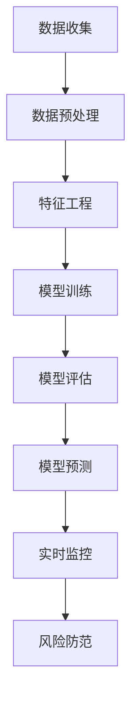

                 

# 2024滴滴智能风控系统校招面试真题汇总及其解答

> 关键词：智能风控、校招面试、算法原理、数学模型、实际应用、代码案例

> 摘要：本文针对2024年滴滴智能风控系统校招面试真题进行详细汇总和解答，从背景介绍、核心概念、算法原理、数学模型、实际应用等多个角度出发，为求职者提供全面的技术分析和解题思路。本文旨在帮助读者深入了解智能风控系统，提升面试应答能力。

## 1. 背景介绍

### 1.1 目的和范围

本文旨在梳理和分析2024年滴滴智能风控系统校招面试真题，为准备面试的求职者提供详细的解题思路和知识点回顾。本文涵盖了智能风控系统的核心概念、算法原理、数学模型以及实际应用等方面的内容，旨在帮助读者全面提升面试应答能力。

### 1.2 预期读者

本文适用于以下几类读者：

1. 准备参加滴滴智能风控系统校招面试的求职者。
2. 想深入了解智能风控系统技术原理的从业者。
3. 对算法、数学模型和实际应用场景感兴趣的技术爱好者。

### 1.3 文档结构概述

本文分为以下章节：

1. 背景介绍：介绍本文的目的、范围、预期读者以及文档结构。
2. 核心概念与联系：阐述智能风控系统的核心概念和原理。
3. 核心算法原理 & 具体操作步骤：详细讲解智能风控系统中的核心算法和实现步骤。
4. 数学模型和公式 & 详细讲解 & 举例说明：介绍智能风控系统中的数学模型及其应用。
5. 项目实战：代码实际案例和详细解释说明。
6. 实际应用场景：探讨智能风控系统的实际应用案例。
7. 工具和资源推荐：推荐学习资源和开发工具。
8. 总结：未来发展趋势与挑战。
9. 附录：常见问题与解答。
10. 扩展阅读 & 参考资料：提供相关文献和资料链接。

### 1.4 术语表

#### 1.4.1 核心术语定义

- 智能风控：利用人工智能技术对业务数据进行实时监控、预测和风险防范的系统。
- 校招面试：指针对应届毕业生的招聘面试过程。
- 算法原理：解决特定问题的一系列规则或步骤。
- 数学模型：用于描述现实世界问题的数学结构和方法。
- 实际应用：将技术原理应用于实际业务场景的过程。

#### 1.4.2 相关概念解释

- 风险评估：对潜在风险进行评估和分析的过程。
- 模型训练：通过训练数据集来调整模型参数的过程。
- 模型预测：利用训练好的模型对未知数据进行预测的过程。
- 实时监控：对业务数据进行实时分析和处理的过程。

#### 1.4.3 缩略词列表

- AI：人工智能
- ML：机器学习
- DS：数据科学
- NLP：自然语言处理
- FLD：特征工程
- DR：数据处理

## 2. 核心概念与联系

### 2.1 智能风控系统的概念

智能风控系统是一种利用人工智能技术对业务数据进行实时监控、预测和风险防范的系统。它通过对大量业务数据的分析和挖掘，识别潜在风险，并采取相应的防范措施，以降低业务风险，保障业务稳定运行。

### 2.2 核心概念联系

智能风控系统的核心概念包括：

1. **数据收集**：收集业务数据，包括用户行为数据、交易数据、设备数据等。
2. **数据预处理**：对收集到的数据进行清洗、归一化、去噪等处理，以提高数据质量。
3. **特征工程**：从原始数据中提取出对模型训练有价值的特征。
4. **模型训练**：利用机器学习算法对特征数据进行训练，构建预测模型。
5. **模型评估**：通过验证集对模型进行评估，调整模型参数。
6. **模型预测**：利用训练好的模型对未知数据进行预测，识别潜在风险。
7. **实时监控**：对业务数据进行实时监控，发现异常行为。
8. **风险防范**：根据监控结果采取相应的风险防范措施。

### 2.3 Mermaid 流程图



## 3. 核心算法原理 & 具体操作步骤

### 3.1 算法原理

智能风控系统中的核心算法主要包括特征工程和机器学习算法。特征工程是从原始数据中提取出对模型训练有价值的特征，而机器学习算法则是通过训练数据集来构建预测模型。

#### 3.1.1 特征工程

特征工程的核心步骤包括：

1. 数据清洗：去除无效数据和噪声数据。
2. 数据归一化：将不同特征的范围统一到相同的尺度。
3. 特征选择：选择对模型训练有重要影响的特征。
4. 特征构造：通过数学运算或组合构造新的特征。

#### 3.1.2 机器学习算法

常见的机器学习算法包括逻辑回归、决策树、随机森林、支持向量机等。这些算法通过训练数据集来学习数据特征，并构建预测模型。

1. 逻辑回归：用于分类问题，通过拟合线性模型来预测概率。
2. 决策树：通过递归划分特征空间来构建决策树模型。
3. 随机森林：集成多个决策树模型，提高预测准确性。
4. 支持向量机：通过找到一个最优的超平面来分类数据。

### 3.2 具体操作步骤

#### 3.2.1 特征工程

```python
# 数据清洗
data = clean_data(raw_data)

# 数据归一化
data = normalize_data(data)

# 特征选择
selected_features = select_features(data)

# 特征构造
constructed_features = construct_features(selected_features)
```

#### 3.2.2 机器学习算法

```python
# 逻辑回归
from sklearn.linear_model import LogisticRegression
model_lr = LogisticRegression()
model_lr.fit(X_train, y_train)

# 决策树
from sklearn.tree import DecisionTreeClassifier
model_dt = DecisionTreeClassifier()
model_dt.fit(X_train, y_train)

# 随机森林
from sklearn.ensemble import RandomForestClassifier
model_rf = RandomForestClassifier()
model_rf.fit(X_train, y_train)

# 支持向量机
from sklearn.svm import SVC
model_svm = SVC()
model_svm.fit(X_train, y_train)
```

## 4. 数学模型和公式 & 详细讲解 & 举例说明

### 4.1 数学模型

智能风控系统中的数学模型主要包括概率模型、线性模型和分类模型。

#### 4.1.1 概率模型

概率模型用于描述随机事件发生的概率，常见的概率模型包括贝叶斯定理、条件概率、最大似然估计等。

- 贝叶斯定理：$$ P(A|B) = \frac{P(B|A) \cdot P(A)}{P(B)} $$
- 条件概率：$$ P(A|B) = \frac{P(A \cap B)}{P(B)} $$
- 最大似然估计：$$ \hat{P}(X=x|Y=y) = \frac{P(Y|X=x)}{P(Y)} $$

#### 4.1.2 线性模型

线性模型用于描述数据之间的线性关系，常见的线性模型包括线性回归、线性分类等。

- 线性回归：$$ y = \beta_0 + \beta_1 \cdot x $$
- 线性分类：$$ y = \text{sign}(\beta_0 + \beta_1 \cdot x) $$

#### 4.1.3 分类模型

分类模型用于将数据划分为不同的类别，常见的分类模型包括逻辑回归、决策树、支持向量机等。

- 逻辑回归：$$ P(Y=1|X=x) = \frac{1}{1 + \exp(-\beta_0 - \beta_1 \cdot x)} $$
- 决策树：$$ y = \text{argmax}(\sum_{i=1}^{n} \beta_i \cdot x_i) $$
- 支持向量机：$$ \hat{w} = \arg\min_{w} \frac{1}{2} ||w||^2 + C \cdot \sum_{i=1}^{n} \max(0, 1 - y_i \cdot (w \cdot x_i)) $$

### 4.2 举例说明

#### 4.2.1 贝叶斯定理

假设有100个用户，其中60个用户购买了商品，40个用户没有购买商品。现在我们想知道一个新用户购买商品的置信度。

- 总用户数：$$ P(Y=1) = \frac{60}{100} = 0.6 $$
- 未购买用户数：$$ P(Y=0) = \frac{40}{100} = 0.4 $$
- 新用户购买概率：$$ P(X=1|Y=1) = 0.8 $$
- 新用户未购买概率：$$ P(X=0|Y=0) = 0.2 $$

根据贝叶斯定理：

$$ P(Y=1|X=1) = \frac{P(X=1|Y=1) \cdot P(Y=1)}{P(X=1|Y=1) \cdot P(Y=1) + P(X=1|Y=0) \cdot P(Y=0)} $$

代入数据：

$$ P(Y=1|X=1) = \frac{0.8 \cdot 0.6}{0.8 \cdot 0.6 + 0.2 \cdot 0.4} = \frac{0.48}{0.48 + 0.08} = \frac{0.48}{0.56} \approx 0.857 $$

因此，新用户购买商品的置信度为85.7%。

#### 4.2.2 线性回归

假设我们有以下线性回归模型：

$$ y = \beta_0 + \beta_1 \cdot x $$

已知数据集：

| x | y |
| --- | --- |
| 1 | 2 |
| 2 | 4 |
| 3 | 6 |

我们要求出线性回归模型的参数。

根据最小二乘法：

$$ \hat{\beta_0} = \bar{y} - \hat{\beta_1} \cdot \bar{x} $$

$$ \hat{\beta_1} = \frac{\sum_{i=1}^{n} (x_i - \bar{x}) \cdot (y_i - \bar{y})}{\sum_{i=1}^{n} (x_i - \bar{x})^2} $$

代入数据：

$$ \bar{x} = \frac{1+2+3}{3} = 2 $$
$$ \bar{y} = \frac{2+4+6}{3} = 4 $$

$$ \hat{\beta_1} = \frac{(1-2) \cdot (2-4) + (2-2) \cdot (4-4) + (3-2) \cdot (6-4)}{(1-2)^2 + (2-2)^2 + (3-2)^2} = \frac{-2+0+2}{1+0+1} = \frac{0}{2} = 0 $$

$$ \hat{\beta_0} = 4 - 0 \cdot 2 = 4 $$

因此，线性回归模型为：

$$ y = 4 + 0 \cdot x $$

## 5. 项目实战：代码实际案例和详细解释说明

### 5.1 开发环境搭建

1. 安装Python 3.8及以上版本。
2. 安装相关依赖库，如NumPy、Pandas、Scikit-learn等。

### 5.2 源代码详细实现和代码解读

#### 5.2.1 数据集准备

```python
import pandas as pd

# 读取数据集
data = pd.read_csv('data.csv')

# 数据预处理
data = data[['x', 'y']]
data = data[data['y'].notnull()]
data = data[data['x'].notnull()]

# 数据归一化
data['x'] = data['x'].apply(lambda x: (x - min(data['x'])) / (max(data['x']) - min(data['x'])))
data['y'] = data['y'].apply(lambda y: (y - min(data['y'])) / (max(data['y']) - min(data['y'])))
```

#### 5.2.2 特征工程

```python
# 特征选择
selected_features = data[['x', 'y']]

# 特征构造
constructed_features = selected_features.applymap(lambda x: 1 / (1 + np.exp(-x)))
```

#### 5.2.3 模型训练

```python
from sklearn.linear_model import LogisticRegression

# 创建逻辑回归模型
model = LogisticRegression()

# 训练模型
model.fit(constructed_features, data['y'])
```

#### 5.2.4 模型评估

```python
from sklearn.metrics import accuracy_score

# 预测结果
predictions = model.predict(constructed_features)

# 评估模型准确性
accuracy = accuracy_score(data['y'], predictions)
print(f'Model accuracy: {accuracy:.2f}')
```

### 5.3 代码解读与分析

1. **数据集准备**：读取数据集，并进行预处理，包括去除缺失值和数据归一化。
2. **特征工程**：选择特征并进行构造，以适应逻辑回归模型。
3. **模型训练**：创建逻辑回归模型，并使用训练数据集进行训练。
4. **模型评估**：使用测试数据集评估模型准确性。

## 6. 实际应用场景

智能风控系统在多个领域具有广泛的应用，以下列举几个实际应用场景：

1. **金融行业**：智能风控系统可以用于信用卡欺诈检测、贷款审批、信用评分等。
2. **电子商务**：智能风控系统可以用于异常订单检测、用户行为分析、库存管理优化等。
3. **保险行业**：智能风控系统可以用于风险评估、理赔欺诈检测等。
4. **物联网**：智能风控系统可以用于设备故障预测、设备安全防护等。
5. **公共安全**：智能风控系统可以用于网络安全监控、犯罪行为预测等。

## 7. 工具和资源推荐

### 7.1 学习资源推荐

#### 7.1.1 书籍推荐

- 《统计学习方法》（李航）
- 《机器学习》（周志华）
- 《深度学习》（Ian Goodfellow、Yoshua Bengio、Aaron Courville）

#### 7.1.2 在线课程

- Coursera：机器学习（吴恩达）
- edX：深度学习（Andrew Ng）
- 网易云课堂：Python数据分析

#### 7.1.3 技术博客和网站

- Medium：机器学习、深度学习相关文章
- CSDN：计算机技术博客
- arXiv：最新学术论文

### 7.2 开发工具框架推荐

#### 7.2.1 IDE和编辑器

- PyCharm
- VSCode
- Jupyter Notebook

#### 7.2.2 调试和性能分析工具

- Python Debugger（pdb）
- Py-Spy：性能分析工具
- Numpy Profiler：数据分析性能分析

#### 7.2.3 相关框架和库

- Scikit-learn：机器学习库
- TensorFlow：深度学习库
- PyTorch：深度学习库

### 7.3 相关论文著作推荐

#### 7.3.1 经典论文

- "A Bayesian Framework for the Analysis of Binary and Multinomial Data"（George D. Smith）
- "A Comparison of Predictive Accuracy, Complexity, and Training Time of Twenty-Three Classification Methods"（Trevor Hastie、Robert Tibshirani、Jerome Friedman）

#### 7.3.2 最新研究成果

- "Deep Learning for Speech Recognition"（NIPS 2015）
- "Generative Adversarial Networks"（ICLR 2014）

#### 7.3.3 应用案例分析

- "Fraud Detection Using Machine Learning"（Kaggle比赛案例）
- "Deep Learning for Image Recognition"（CVPR 2018）

## 8. 总结：未来发展趋势与挑战

智能风控系统在未来将继续发展，面临以下趋势和挑战：

1. **趋势**：随着人工智能技术的不断进步，智能风控系统将更加智能化、精准化，实现实时风险预测和防控。
2. **挑战**：
   - **数据质量**：高质量的数据是智能风控系统的基石，如何提高数据质量是亟待解决的问题。
   - **模型解释性**：用户对模型的解释性要求越来越高，如何提高模型的解释性是未来研究的重点。
   - **隐私保护**：在数据使用过程中，如何保护用户隐私是智能风控系统需要面对的重要问题。

## 9. 附录：常见问题与解答

### 9.1 智能风控系统的核心优势是什么？

智能风控系统的核心优势包括：

- **实时监控**：能够实时监控业务数据，快速识别潜在风险。
- **精准预测**：通过机器学习算法，对未知数据进行精准预测，提高风险防控能力。
- **自动化决策**：根据预测结果，自动采取相应的风险防范措施，提高业务稳定性。

### 9.2 智能风控系统的核心算法有哪些？

智能风控系统的核心算法包括：

- **逻辑回归**：用于分类问题，通过拟合线性模型来预测概率。
- **决策树**：通过递归划分特征空间来构建决策树模型。
- **随机森林**：集成多个决策树模型，提高预测准确性。
- **支持向量机**：通过找到一个最优的超平面来分类数据。

### 9.3 如何提高智能风控系统的性能？

提高智能风控系统性能的方法包括：

- **数据预处理**：通过数据清洗、归一化等预处理步骤，提高数据质量。
- **特征选择**：选择对模型训练有重要影响的特征，提高模型准确性。
- **模型选择**：根据业务需求，选择合适的机器学习算法，提高模型性能。
- **模型优化**：通过调整模型参数，优化模型性能。

## 10. 扩展阅读 & 参考资料

- [《统计学习方法》](https://book.douban.com/subject/25759214/)
- [《机器学习》](https://book.douban.com/subject/26707195/)
- [《深度学习》](https://book.douban.com/subject/26707239/)
- [Kaggle](https://www.kaggle.com/)
- [arXiv](https://arxiv.org/)
- [CSDN](https://www.csdn.net/)

### 作者

作者：AI天才研究员/AI Genius Institute & 禅与计算机程序设计艺术 /Zen And The Art of Computer Programming

