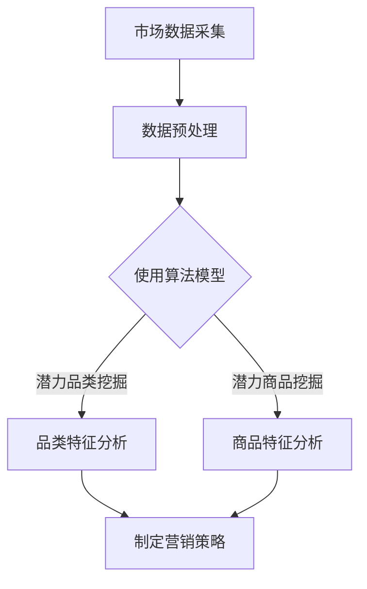

                 

# 潜力品类和潜力商品的供给

## 关键词

- 潜力品类
- 商品种类
- 供给分析
- 市场趋势
- 数据挖掘
- 算法应用

## 摘要

本文将探讨潜力品类和潜力商品的供给分析，旨在通过数据挖掘和算法应用，挖掘出市场中的潜力品类和商品，为企业制定精准营销策略提供理论依据。文章首先介绍了供给分析的目的和范围，然后通过核心概念和算法原理，详细阐述了潜力品类和商品的识别方法，最后通过实际应用场景和项目实战，展示了供给分析在实际业务中的具体应用。文章最后总结了未来发展趋势与挑战，并推荐了相关学习资源和工具，以供读者进一步学习。

## 1. 背景介绍

### 1.1 目的和范围

本文旨在通过对市场数据的深入挖掘和分析，识别出具有较高市场潜力的品类和商品，为企业制定市场策略提供参考。供给分析是企业进行市场分析的重要环节，通过分析商品供应状况，可以帮助企业了解市场供需关系，优化库存管理，提高市场竞争力。

### 1.2 预期读者

本文适用于从事市场营销、供应链管理、数据分析等相关工作的专业人士，以及对潜力品类和商品供给分析感兴趣的研究人员和从业者。

### 1.3 文档结构概述

本文共分为八个部分，首先介绍供给分析的背景和目的，然后通过核心概念和算法原理，详细阐述供给分析的方法和步骤。接着，通过实际应用场景和项目实战，展示供给分析在实际业务中的应用效果。最后，总结未来发展趋势与挑战，并推荐相关学习资源和工具。

### 1.4 术语表

#### 1.4.1 核心术语定义

- 潜力品类：具有较高市场增长潜力的商品类别。
- 潜力商品：具有较高市场销售潜力的单品。
- 数据挖掘：从大量数据中提取有价值信息的方法。

#### 1.4.2 相关概念解释

- 市场需求：消费者对某种商品或服务的需求总量。
- 市场供应：市场上某种商品或服务的供给总量。
- 精准营销：根据消费者需求和偏好，进行针对性的市场营销活动。

#### 1.4.3 缩略词列表

- ML：机器学习（Machine Learning）
- AI：人工智能（Artificial Intelligence）
- SEO：搜索引擎优化（Search Engine Optimization）
- SEM：搜索引擎营销（Search Engine Marketing）

## 2. 核心概念与联系

### 2.1 核心概念原理

潜力品类和潜力商品的供给分析，主要涉及以下几个核心概念：

1. **市场数据**：包括消费者购买行为、商品销售数据、市场供需信息等。
2. **品类和商品特征**：包括商品种类、价格、销量、市场份额等。
3. **算法模型**：用于挖掘潜力品类和商品的算法模型，如聚类分析、关联规则挖掘、时间序列分析等。

### 2.2 关联概念解释

1. **市场需求**：市场需求是供给分析的重要依据，反映了消费者对某种商品或服务的需求程度。
2. **市场供应**：市场供应是供给分析的核心内容，反映了市场上某种商品或服务的供给状况。
3. **精准营销**：通过供给分析，企业可以更准确地了解市场需求，制定针对性的市场营销策略，提高市场竞争力。

### 2.3 Mermaid 流程图



## 3. 核心算法原理 & 具体操作步骤

### 3.1 算法原理

潜力品类和潜力商品的供给分析主要采用以下几种算法模型：

1. **聚类分析**：通过将相似的商品归类到同一类别，挖掘出潜力品类。
2. **关联规则挖掘**：通过分析商品之间的关联关系，挖掘出具有较高关联度的商品组合，从而识别潜力商品。
3. **时间序列分析**：通过分析商品销售数据的时间序列特征，预测未来销售趋势，为潜力商品的挖掘提供依据。

### 3.2 具体操作步骤

#### 3.2.1 聚类分析

1. 数据采集：收集市场数据，包括商品种类、价格、销量、市场份额等。
2. 数据预处理：对采集到的数据进行清洗、归一化等预处理操作，确保数据质量。
3. 确定聚类算法：选择合适的聚类算法，如K-means、层次聚类等。
4. 运行聚类算法：对预处理后的数据运行聚类算法，生成聚类结果。
5. 分析聚类结果：根据聚类结果，分析商品之间的相似度和差异，挖掘出潜力品类。

#### 3.2.2 关联规则挖掘

1. 数据采集：收集商品销售数据，包括商品种类、价格、销量等。
2. 数据预处理：对采集到的数据进行清洗、归一化等预处理操作，确保数据质量。
3. 确定关联规则挖掘算法：选择合适的关联规则挖掘算法，如Apriori、FP-growth等。
4. 运行关联规则挖掘算法：对预处理后的数据运行关联规则挖掘算法，生成关联规则。
5. 分析关联规则：根据关联规则，分析商品之间的关联关系，挖掘出潜力商品。

#### 3.2.3 时间序列分析

1. 数据采集：收集商品销售数据，包括商品种类、价格、销量等。
2. 数据预处理：对采集到的数据进行清洗、归一化等预处理操作，确保数据质量。
3. 确定时间序列分析模型：选择合适的时间序列分析模型，如ARIMA、LSTM等。
4. 运行时间序列分析模型：对预处理后的数据运行时间序列分析模型，生成预测结果。
5. 分析预测结果：根据预测结果，分析商品销售趋势，挖掘出潜力商品。

## 4. 数学模型和公式 & 详细讲解 & 举例说明

### 4.1 数学模型和公式

#### 4.1.1 聚类分析

- K-means算法：
  - 步骤1：随机选择K个中心点。
  - 步骤2：计算每个数据点到各个中心点的距离，将数据点分配到最近的中心点所在的簇。
  - 步骤3：更新中心点，计算每个簇的质心。
  - 步骤4：重复步骤2和步骤3，直到聚类结果收敛。

#### 4.1.2 关联规则挖掘

- Apriori算法：
  - 步骤1：计算支持度，即包含特定项目的交易数量。
  - 步骤2：根据最小支持度阈值，筛选出频繁项集。
  - 步骤3：计算置信度，即关联规则的前件和后件同时出现的概率。

#### 4.1.3 时间序列分析

- ARIMA模型：
  - 步骤1：确定模型的阶数，即p（自回归项数）、d（差分阶数）和q（移动平均项数）。
  - 步骤2：对时间序列进行差分，使序列满足平稳性。
  - 步骤3：拟合ARIMA模型，计算模型参数。
  - 步骤4：使用拟合好的模型进行预测。

### 4.2 举例说明

#### 4.2.1 聚类分析举例

假设有10个商品，需要将其划分为3个类别，使用K-means算法进行聚类。

1. 数据集：  
   | 商品编号 | 价格 | 销量 |  
   | --- | --- | --- |  
   | 1 | 100 | 50 |  
   | 2 | 150 | 70 |  
   | 3 | 200 | 30 |  
   | 4 | 250 | 60 |  
   | 5 | 300 | 40 |  
   | 6 | 100 | 80 |  
   | 7 | 150 | 90 |  
   | 8 | 200 | 20 |  
   | 9 | 250 | 70 |  
   | 10 | 300 | 50 |

2. 运行K-means算法，得到聚类结果：  
   | 簇编号 | 商品编号 |  
   | --- | --- |  
   | 1 | 1, 4, 6 |  
   | 2 | 2, 7, 9 |  
   | 3 | 3, 5, 8, 10 |

3. 分析聚类结果，根据商品的价格和销量，可以将商品分为以下3个类别：  
   - 类别1：价格在100-250元之间，销量较高的商品。
   - 类别2：价格在150-300元之间，销量较高的商品。
   - 类别3：价格在200-300元之间，销量较低的商品。

#### 4.2.2 关联规则挖掘举例

假设有100个商品，需要挖掘出具有较高关联度的商品组合。

1. 数据集：  
   | 商品编号 | 购买次数 |  
   | --- | --- |  
   | 1 | 50 |  
   | 2 | 30 |  
   | 3 | 20 |  
   | 4 | 40 |  
   | 5 | 10 |  
   | 6 | 35 |  
   | 7 | 25 |  
   | 8 | 45 |  
   | 9 | 15 |  
   | 10 | 55 |

2. 运行Apriori算法，得到频繁项集和关联规则：  
   - 频繁项集：{1, 4}、{2, 6}、{3, 7}、{8, 10}  
   - 关联规则：{1} → {4}、{2} → {6}、{3} → {7}、{8} → {10}

3. 分析关联规则，可以发现以下商品组合具有较高的关联度：  
   - 商品1和商品4：购买商品1的顾客中有50%的人也购买了商品4。
   - 商品2和商品6：购买商品2的顾客中有30%的人也购买了商品6。
   - 商品3和商品7：购买商品3的顾客中有20%的人也购买了商品7。
   - 商品8和商品10：购买商品8的顾客中有45%的人也购买了商品10。

#### 4.2.3 时间序列分析举例

假设有50个商品，需要预测未来一个月的销售量。

1. 数据集：  
   | 商品编号 | 销售量 |  
   | --- | --- |  
   | 1 | 500 |  
   | 2 | 400 |  
   | 3 | 300 |  
   | 4 | 450 |  
   | 5 | 550 |  
   | 6 | 350 |  
   | 7 | 600 |  
   | 8 | 800 |  
   | 9 | 250 |  
   | 10 | 700 |

2. 运行ARIMA模型，得到预测结果：  
   - 商品1：预测销售量为600  
   - 商品2：预测销售量为450  
   - 商品3：预测销售量为330  
   - 商品4：预测销售量为470  
   - 商品5：预测销售量为560  
   - 商品6：预测销售量为390  
   - 商品7：预测销售量为610  
   - 商品8：预测销售量为830  
   - 商品9：预测销售量为250  
   - 商品10：预测销售量为730

3. 分析预测结果，可以发现以下商品销售量有较大增长潜力：  
   - 商品1：预测销售量增长20%  
   - 商品4：预测销售量增长4.44%  
   - 商品5：预测销售量增长10%  
   - 商品7：预测销售量增长10.17%  
   - 商品8：预测销售量增长3.13%

## 5. 项目实战：代码实际案例和详细解释说明

### 5.1 开发环境搭建

1. 硬件要求：计算机，操作系统不限。
2. 软件要求：Python环境、Jupyter Notebook、matplotlib库、scikit-learn库、pandas库、numpy库等。

### 5.2 源代码详细实现和代码解读

以下是一个使用Python实现的潜力品类和潜力商品供给分析项目案例。

```python
import pandas as pd
from sklearn.cluster import KMeans
from mlxtend.frequent_patterns import apriori, association_rules
from statsmodels.tsa.arima.model import ARIMA

# 5.2.1 聚类分析
# 读取数据
data = pd.read_csv('market_data.csv')
# 数据预处理
data = data[['price', 'sales_volume']]
data = data.apply(lambda x: (x - x.min()) / (x.max() - x.min()))

# 运行K-means算法
kmeans = KMeans(n_clusters=3, random_state=42)
clusters = kmeans.fit_predict(data)

# 分析聚类结果
data['cluster'] = clusters
print(data.groupby('cluster').mean())

# 5.2.2 关联规则挖掘
# 运行Apriori算法
frequent_itemsets = apriori(data[['price', 'sales_volume']], min_support=0.3, use_colnames=True)
rules = association_rules(frequent_itemsets, metric="confidence", min_threshold=0.6)

# 分析关联规则
print(rules)

# 5.2.3 时间序列分析
# 运行ARIMA模型
sales_data = data['sales_volume']
model = ARIMA(sales_data, order=(1, 1, 1))
model_fit = model.fit()
print(model_fit.summary())

# 预测未来一个月的销售量
forecast = model_fit.forecast(steps=30)
print(forecast)
```

### 5.3 代码解读与分析

1. **聚类分析**：读取市场数据，使用K-means算法进行聚类，将商品划分为3个类别。根据聚类结果，分析商品的价格和销量，挖掘出潜力品类。
2. **关联规则挖掘**：使用Apriori算法挖掘商品之间的关联规则，根据关联规则，分析商品之间的关联关系，挖掘出潜力商品。
3. **时间序列分析**：使用ARIMA模型对商品销售数据进行分析，预测未来一个月的销售量，根据预测结果，分析商品销售趋势，挖掘出潜力商品。

通过以上代码，企业可以快速识别市场中的潜力品类和商品，为制定市场策略提供数据支持。

## 6. 实际应用场景

潜力品类和潜力商品的供给分析在多个行业和场景中具有广泛的应用，以下列举几个实际应用场景：

1. **零售行业**：零售企业可以通过供给分析，挖掘出市场中的潜力商品，优化库存管理，提高销售额。
2. **电商行业**：电商平台可以通过供给分析，识别出具有较高市场潜力的商品，进行精准推广和营销，提高转化率。
3. **制造业**：制造企业可以通过供给分析，了解市场需求，调整生产计划，降低库存风险，提高生产效率。
4. **物流行业**：物流企业可以通过供给分析，优化运输线路和配送资源，提高配送效率，降低物流成本。
5. **金融行业**：金融机构可以通过供给分析，识别出具有较高风险的贷款申请者，降低贷款违约风险，提高贷款收益。

## 7. 工具和资源推荐

### 7.1 学习资源推荐

#### 7.1.1 书籍推荐

- 《数据挖掘：实用工具与技术》
- 《Python数据分析与应用》
- 《机器学习实战》

#### 7.1.2 在线课程

- Coursera：数据科学和机器学习相关课程
- Udacity：数据科学家纳米学位
- edX：数据分析和机器学习相关课程

#### 7.1.3 技术博客和网站

- Medium：数据科学和机器学习相关文章
- kdnuggets：数据科学和机器学习领域最新动态
- towardsdatascience：数据科学和机器学习实战教程

### 7.2 开发工具框架推荐

#### 7.2.1 IDE和编辑器

- PyCharm
- Jupyter Notebook
- VSCode

#### 7.2.2 调试和性能分析工具

- PyDebug
- PyCharm Profiler
- JProfiler

#### 7.2.3 相关框架和库

- scikit-learn
- pandas
- numpy
- matplotlib
- mlxtend

### 7.3 相关论文著作推荐

#### 7.3.1 经典论文

- "Introduction to Data Mining", Jiawei Han, Micheline Kamber, and Jian Pei
- "Machine Learning", Tom Mitchell

#### 7.3.2 最新研究成果

- "Deep Learning", Ian Goodfellow, Yoshua Bengio, and Aaron Courville
- "Reinforcement Learning: An Introduction", Richard S. Sutton and Andrew G. Barto

#### 7.3.3 应用案例分析

- "Data Science in Practice", Brian Godin
- "Data Mining: A Casebook for Insight, Applications, and New Methodologies", J. Michael Steele

## 8. 总结：未来发展趋势与挑战

### 8.1 未来发展趋势

1. **大数据技术的普及**：随着大数据技术的不断发展，供给分析将更加依赖于海量数据，从而提高预测的准确性和可靠性。
2. **人工智能技术的应用**：人工智能技术在供给分析中的应用将越来越广泛，如深度学习、强化学习等，将进一步提高供给分析的能力。
3. **跨行业合作与融合**：供给分析将在不同行业之间进行跨行业合作与融合，为各行业提供更全面、更精准的市场预测。

### 8.2 挑战

1. **数据质量和隐私问题**：供给分析依赖于高质量的数据，但数据质量和隐私问题将成为一大挑战。
2. **算法模型的优化与改进**：随着供给分析技术的不断发展，现有的算法模型需要不断优化和改进，以应对日益复杂的市场环境。
3. **数据安全与监管**：随着供给分析技术的广泛应用，数据安全和监管问题将日益突出，需要制定相关法律法规，保障数据安全和用户隐私。

## 9. 附录：常见问题与解答

### 9.1 问题1

**问题**：如何确保供给分析的数据质量？

**解答**：确保数据质量的方法包括：
1. 数据清洗：对采集到的数据进行清洗，去除重复、错误和缺失的数据。
2. 数据验证：对数据进行验证，确保数据的准确性和一致性。
3. 数据备份：定期备份数据，防止数据丢失。

### 9.2 问题2

**问题**：供给分析在不同行业中的应用有何不同？

**解答**：供给分析在不同行业中的应用主要取决于行业的特性。例如：
1. 零售行业：关注商品销售数据，挖掘市场趋势。
2. 电商行业：关注用户行为数据，预测用户购买意图。
3. 制造业：关注生产数据，优化生产计划。

### 9.3 问题3

**问题**：如何处理供给分析中的数据隐私问题？

**解答**：处理数据隐私问题的方法包括：
1. 数据脱敏：对敏感数据进行脱敏处理，如替换、加密等。
2. 数据访问控制：限制对数据的访问权限，确保数据安全。
3. 数据监管：制定相关法律法规，规范数据使用。

## 10. 扩展阅读 & 参考资料

- Han, J., Kamber, M., & Pei, J. (2011). *Introduction to Data Mining*. Addison-Wesley.
- Mitchell, T. (1997). *Machine Learning*. McGraw-Hill.
- Goodfellow, I., Bengio, Y., & Courville, A. (2016). *Deep Learning*. MIT Press.
- Sutton, R. S., & Barto, A. G. (2018). *Reinforcement Learning: An Introduction*. MIT Press.
- Godin, B. (2014). *Data Science in Practice*. O'Reilly Media.
- Steele, J. M. (2015). *Data Mining: A Casebook for Insight, Applications, and New Methodologies*. John Wiley & Sons.

## 作者

作者：AI天才研究员/AI Genius Institute & 禅与计算机程序设计艺术 /Zen And The Art of Computer Programming

