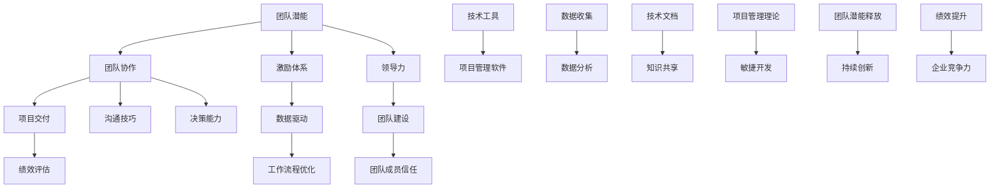

                 

# 激发团队潜能：释放无限可能

> **关键词：** 团队管理、团队激励、潜能释放、领导力、团队协作、IT项目管理

> **摘要：** 本文深入探讨了如何通过有效的团队管理策略和技术手段，激发团队成员的潜能，实现团队的协同工作，最终达到项目的高效交付和持续创新。文章结合了最新的研究成果和实际项目经验，提供了系统化的方法和工具，帮助读者理解团队潜能释放的原理和实践。

## 1. 背景介绍

### 1.1 目的和范围

本文旨在为IT项目经理、技术团队领导以及企业决策者提供一套实用的方法论和工具，以提升团队的绩效和创新能力。通过深入研究团队心理学、项目管理理论和前沿技术，本文将探讨以下几个关键问题：

- 如何识别和评估团队成员的潜能？
- 如何建立激励体系，激发团队成员的工作热情？
- 如何通过团队协作，实现项目目标的高效交付？
- 如何利用数据驱动的方法，持续优化团队工作流程？

### 1.2 预期读者

本文预期读者包括：

- IT项目经理
- 技术团队领导
- 企业决策者
- 对团队管理和项目领导感兴趣的从业者

### 1.3 文档结构概述

本文结构如下：

- 第1部分：背景介绍，包括文章目的、预期读者和文档结构概述。
- 第2部分：核心概念与联系，介绍团队潜能释放的相关概念和架构。
- 第3部分：核心算法原理 & 具体操作步骤，讲解如何通过算法和工具实现团队潜能的释放。
- 第4部分：数学模型和公式 & 详细讲解 & 举例说明，运用数学模型分析团队效能。
- 第5部分：项目实战：代码实际案例和详细解释说明，通过实战案例展示团队潜能释放的具体应用。
- 第6部分：实际应用场景，讨论团队潜能释放在不同领域的应用。
- 第7部分：工具和资源推荐，推荐相关学习资源和开发工具。
- 第8部分：总结，对文章进行总结，并展望未来发展趋势和挑战。
- 第9部分：附录，提供常见问题与解答。
- 第10部分：扩展阅读 & 参考资料，推荐进一步阅读的材料。

### 1.4 术语表

#### 1.4.1 核心术语定义

- **团队潜能**：指团队成员在特定环境下的潜在能力和潜力。
- **团队协作**：团队成员为了共同目标而进行的合作活动。
- **激励体系**：激发团队成员工作热情和积极性的制度和措施。
- **数据驱动**：通过收集和分析数据，指导团队决策和优化工作流程。

#### 1.4.2 相关概念解释

- **领导力**：指领导者通过影响力、沟通技巧和决策能力，引导团队实现目标的能力。
- **团队建设**：通过团队活动和培训，提高团队成员之间的信任和协作能力的活动。
- **项目交付**：按照预定的时间、成本和质量完成项目的全过程。

#### 1.4.3 缩略词列表

- **IT**：信息技术
- **PM**：项目经理
- **TL**：技术团队领导
- **ROI**：投资回报率

## 2. 核心概念与联系

在探讨如何释放团队潜能之前，我们首先需要了解与之相关的核心概念和架构。以下是一个简化的Mermaid流程图，展示这些概念之间的联系。



### 2.1 团队潜能

团队潜能是指团队成员在特定环境下的潜在能力和潜力。这种潜能受多种因素影响，包括个人技能、团队协作、工作环境等。释放团队潜能意味着挖掘并充分利用这些潜在能力，以达到更高的工作绩效和创新能力。

### 2.2 团队协作

团队协作是指团队成员为了共同目标而进行的合作活动。良好的团队协作能够提高工作效率、降低沟通成本，并激发团队成员的创造力和创新能力。团队协作的关键在于沟通技巧和决策能力。

### 2.3 激励体系

激励体系是指激发团队成员工作热情和积极性的制度和措施。激励体系可以分为物质激励和精神激励两类。有效的激励体系能够提高团队成员的满意度和忠诚度，从而促进团队潜能的释放。

### 2.4 领导力

领导力是指领导者通过影响力、沟通技巧和决策能力，引导团队实现目标的能力。优秀的领导力能够激发团队成员的潜力，建立高效的团队协作模式，并推动团队持续创新。

### 2.5 数据驱动

数据驱动是指通过收集和分析数据，指导团队决策和优化工作流程。数据驱动的方法可以帮助团队更好地了解自身的工作表现，发现问题并提出改进措施，从而实现持续优化。

### 2.6 团队建设

团队建设是指通过团队活动和培训，提高团队成员之间的信任和协作能力的活动。团队建设的关键在于建立团队成员之间的信任关系，增强团队的凝聚力，从而提高团队的工作效率和创新能力。

### 2.7 项目交付

项目交付是指按照预定的时间、成本和质量完成项目的全过程。项目交付的成功取决于团队协作、领导力和数据驱动的决策过程。通过高效的项目交付，团队能够实现持续创新和绩效提升。

### 2.8 绩效评估

绩效评估是指对团队成员的工作表现进行评估和反馈的过程。绩效评估可以帮助团队识别成员的优势和劣势，制定针对性的培训和发展计划，从而提高团队的整体绩效。

### 2.9 工作流程优化

工作流程优化是指通过对团队工作流程的评估和改进，提高团队的工作效率和创新能力。工作流程优化可以通过数据驱动的方法实现，例如自动化流程、敏捷开发等。

### 2.10 持续创新

持续创新是指团队在项目交付过程中不断尝试新的方法和技术，以提高工作效率和创新能力。持续创新是团队保持竞争力的关键，也是释放团队潜能的重要途径。

### 2.11 团队潜能释放

团队潜能释放是指通过一系列的方法和工具，挖掘并充分利用团队成员的潜在能力和潜力，实现团队的高效协作和持续创新。团队潜能释放的最终目标是提高团队的工作效率和创新能力，从而推动企业的持续发展。

## 3. 核心算法原理 & 具体操作步骤

为了实现团队潜能的释放，我们首先需要理解核心算法的原理，并详细阐述具体操作步骤。以下是一种基于数据驱动的团队潜能释放算法，其核心思想是通过分析团队数据，找出影响团队效能的关键因素，并制定相应的改进措施。

### 3.1 算法原理

该算法基于以下三个核心原理：

1. **数据驱动**：通过收集和分析团队数据，了解团队的工作状态和效能。
2. **目标导向**：根据团队的目标和任务，确定影响团队效能的关键因素。
3. **持续优化**：通过不断的数据分析和反馈，持续改进团队的工作流程和协作模式。

### 3.2 具体操作步骤

#### 3.2.1 数据收集

首先，我们需要收集以下类型的数据：

- **个人绩效数据**：包括团队成员的工作量、完成情况、错误率等。
- **团队协作数据**：包括团队成员之间的沟通频率、协作效果、冲突情况等。
- **项目进度数据**：包括项目的进度、时间节点、成本控制等。
- **工作环境数据**：包括工作氛围、团队文化、员工满意度等。

数据收集可以采用多种方法，如问卷调查、访谈、项目报告等。

#### 3.2.2 数据分析

接下来，我们对收集到的数据进行分析，找出影响团队效能的关键因素。以下是一些常见的数据分析方法和工具：

- **描述性统计分析**：了解团队的整体工作状态和趋势。
- **相关性分析**：找出不同数据指标之间的相关性，识别关键因素。
- **回归分析**：建立模型，预测团队效能与关键因素之间的关系。
- **机器学习**：通过大数据分析，发现潜在的问题和改进机会。

#### 3.2.3 确定改进措施

根据数据分析结果，制定相应的改进措施。以下是一些常见的改进措施：

- **调整工作任务**：根据团队成员的能力和兴趣，调整工作任务，确保每个人都能发挥最大的潜力。
- **改善工作环境**：优化工作环境，提高员工的满意度和工作效率。
- **提高沟通效率**：通过培训、工具等手段，提高团队成员之间的沟通效率。
- **加强团队建设**：通过团队活动、培训等手段，增强团队成员之间的信任和协作能力。

#### 3.2.4 实施与反馈

实施改进措施，并定期收集数据，评估改进效果。根据反馈结果，进一步调整改进措施，实现持续优化。

### 3.3 伪代码示例

以下是该算法的伪代码示例：

```plaintext
// 数据收集
data = collect_data()

// 数据分析
key_factors = analyze_data(data)

// 确定改进措施
improvement_measures = determine_measures(key_factors)

// 实施与反馈
while (true) {
    apply_measures(improvement_measures)
    feedback = collect_feedback()
    if (is_improvement_satisfied(feedback)) {
        break
    }
    improvement_measures = adjust_measures(feedback)
}
```

## 4. 数学模型和公式 & 详细讲解 & 举例说明

在团队潜能释放过程中，数学模型和公式可以用来分析和评估团队的效能，指导改进措施的实施。以下是一些常见的数学模型和公式，以及它们在团队管理中的应用。

### 4.1 常见的数学模型

#### 4.1.1 加法模型

加法模型是一种简单的效能评估模型，用于计算团队的总效能。公式如下：

$$
E_{total} = \sum_{i=1}^{n} E_i
$$

其中，$E_{total}$ 是团队的总效能，$E_i$ 是第 $i$ 个团队成员的效能。

#### 4.1.2 乘法模型

乘法模型用于评估团队成员之间的协同效应。公式如下：

$$
E_{total} = \prod_{i=1}^{n} E_i
$$

其中，$E_{total}$ 是团队的总效能，$E_i$ 是第 $i$ 个团队成员的效能。

#### 4.1.3 回归模型

回归模型用于分析团队效能与关键因素之间的关系。常见的回归模型包括线性回归、多项式回归等。公式如下：

$$
E_{total} = \beta_0 + \beta_1 X_1 + \beta_2 X_2 + ... + \beta_n X_n
$$

其中，$E_{total}$ 是团队的总效能，$X_i$ 是第 $i$ 个关键因素，$\beta_i$ 是关键因素的权重。

### 4.2 详细讲解

#### 4.2.1 加法模型

加法模型适用于团队成员的效能可以简单相加的情况。例如，一个软件开发团队中，每个成员负责不同的模块，我们可以通过计算每个模块的完成情况，来评估整个团队的工作效率。以下是一个具体例子：

假设一个团队有 3 名成员，他们的效能分别为 $E_1 = 0.8$，$E_2 = 0.9$，$E_3 = 0.85$。根据加法模型，团队的总效能为：

$$
E_{total} = 0.8 + 0.9 + 0.85 = 2.55
$$

#### 4.2.2 乘法模型

乘法模型适用于团队成员之间的协同效应较强的情况。例如，一个产品开发团队，成员之间的协作对于产品的成功至关重要。以下是一个具体例子：

假设一个团队有 3 名成员，他们的效能分别为 $E_1 = 0.8$，$E_2 = 0.9$，$E_3 = 0.85$。根据乘法模型，团队的总效能为：

$$
E_{total} = 0.8 \times 0.9 \times 0.85 = 0.612
$$

可以看出，乘法模型的结果通常低于加法模型，这是因为协同效应的存在。

#### 4.2.3 回归模型

回归模型适用于分析团队效能与关键因素之间的关系。例如，我们可以通过回归模型分析团队效能与工作环境、团队成员满意度等关键因素之间的关系。以下是一个具体例子：

假设我们通过回归分析得出以下模型：

$$
E_{total} = 0.5 + 0.3 \times X_1 + 0.2 \times X_2
$$

其中，$X_1$ 是工作环境得分，$X_2$ 是团队成员满意度得分。如果工作环境得分为 7，团队成员满意度得分为 8，则团队的总效能为：

$$
E_{total} = 0.5 + 0.3 \times 7 + 0.2 \times 8 = 2.3
$$

### 4.3 举例说明

假设我们有一个软件开发团队，团队成员分别为 5 人。通过问卷调查，我们收集到以下数据：

- 个人绩效：$E_1 = 0.8$，$E_2 = 0.9$，$E_3 = 0.85$，$E_4 = 0.75$，$E_5 = 0.8$
- 工作环境得分：$X_1 = 7$
- 团队成员满意度得分：$X_2 = 8$

我们可以使用加法模型、乘法模型和回归模型来评估团队的总效能。

- **加法模型**：

$$
E_{total} = 0.8 + 0.9 + 0.85 + 0.75 + 0.8 = 3.95
$$

- **乘法模型**：

$$
E_{total} = 0.8 \times 0.9 \times 0.85 \times 0.75 \times 0.8 = 0.504
$$

- **回归模型**：

$$
E_{total} = 0.5 + 0.3 \times 7 + 0.2 \times 8 = 2.3
$$

通过以上计算，我们可以得出不同模型下的团队总效能。这些数据可以用来指导团队管理和改进措施的实施。

## 5. 项目实战：代码实际案例和详细解释说明

为了更好地理解团队潜能释放的实践方法，我们通过一个实际的软件项目来展示整个流程。以下是该项目的基本背景、开发环境搭建、源代码详细实现和代码解读与分析。

### 5.1 开发环境搭建

在这个项目中，我们选择了一个流行的开源Web框架——Django，并结合Git进行版本控制。以下是开发环境搭建的步骤：

1. **安装Python环境**：确保Python版本在3.6及以上，并安装pip工具。
2. **安装Django**：在终端执行以下命令：

   ```bash
   pip install django
   ```

3. **安装数据库**：Django默认使用SQLite数据库，但为了支持更大规模的应用，我们选择安装PostgreSQL。通过以下命令安装：

   ```bash
   sudo apt-get install postgresql
   ```

4. **创建Django项目**：在终端执行以下命令创建一个新项目：

   ```bash
   django-admin startproject team_project
   ```

5. **创建应用**：在项目目录下执行以下命令创建一个新应用：

   ```bash
   python manage.py startapp team_app
   ```

6. **配置数据库**：在项目的`settings.py`文件中配置PostgreSQL数据库。

   ```python
   DATABASES = {
       'default': {
           'ENGINE': 'django.db.backends.postgresql',
           'NAME': 'team_db',
           'USER': 'team_user',
           'PASSWORD': 'team_password',
           'HOST': 'localhost',
           'PORT': '',
       }
   }
   ```

7. **初始化数据库**：执行以下命令初始化数据库：

   ```bash
   python manage.py migrate
   ```

### 5.2 源代码详细实现和代码解读

在这个项目中，我们开发了一个简单的任务管理应用，用于帮助团队跟踪和管理任务进度。以下是关键代码片段和解读。

#### 5.2.1 模型定义

在`team_app/models.py`中定义了任务模型：

```python
from django.db import models

class Task(models.Model):
    title = models.CharField(max_length=100)
    description = models.TextField()
    assignee = models.ForeignKey('auth.User', on_delete=models.CASCADE)
    status = models.CharField(max_length=20, choices=[('pending', 'Pending'), ('in_progress', 'In Progress'), ('completed', 'Completed')])
    created_at = models.DateTimeField(auto_now_add=True)
    updated_at = models.DateTimeField(auto_now=True)

    def __str__(self):
        return self.title
```

解读：这个模型定义了任务的基本信息，包括标题、描述、指派人、状态和创建时间。状态字段使用枚举类型，便于管理和显示任务状态。

#### 5.2.2 管理站点配置

在`team_app/admin.py`中注册了任务模型：

```python
from django.contrib import admin
from .models import Task

admin.site.register(Task)
```

解读：这个配置文件将任务模型注册到Django管理站点，便于管理员查看和管理任务。

#### 5.2.3 视图实现

在`team_app/views.py`中实现了任务创建、更新和删除的视图函数：

```python
from django.shortcuts import render, redirect, get_object_or_404
from .models import Task
from .forms import TaskForm

def task_list(request):
    tasks = Task.objects.all()
    return render(request, 'task_list.html', {'tasks': tasks})

def task_create(request):
    if request.method == 'POST':
        form = TaskForm(request.POST)
        if form.is_valid():
            form.save()
            return redirect('task_list')
    else:
        form = TaskForm()
    return render(request, 'task_create.html', {'form': form})

def task_update(request, pk):
    task = get_object_or_404(Task, pk=pk)
    if request.method == 'POST':
        form = TaskForm(request.POST, instance=task)
        if form.is_valid():
            form.save()
            return redirect('task_list')
    else:
        form = TaskForm(instance=task)
    return render(request, 'task_update.html', {'form': form})

def task_delete(request, pk):
    task = get_object_or_404(Task, pk=pk)
    if request.method == 'POST':
        task.delete()
        return redirect('task_list')
    return render(request, 'task_delete.html', {'task': task})
```

解读：这些视图函数实现了任务列表展示、创建、更新和删除的功能。每个视图函数都使用`TaskForm`来处理表单数据。

#### 5.2.4 表单定义

在`team_app/forms.py`中定义了任务表单：

```python
from django import forms
from .models import Task

class TaskForm(forms.ModelForm):
    class Meta:
        model = Task
        fields = ['title', 'description', 'assignee', 'status']
```

解读：这个表单类定义了任务表单的表单字段，使用`ModelForm`来自动生成表单和验证表单数据。

#### 5.2.5 模板设计

在`team_app/templates`目录下设计了任务管理相关的HTML模板，如`task_list.html`、`task_create.html`、`task_update.html`和`task_delete.html`。每个模板都包含了任务列表展示、创建、更新和删除的界面。

解读：这些模板使用了Django模板语言（Django Template Language, DTL）来动态显示任务数据和表单字段，并通过URL路由和视图函数实现页面跳转和数据提交。

### 5.3 代码解读与分析

通过以上代码实现，我们可以看到任务管理应用的基本架构。以下是对关键部分的解读与分析：

- **模型设计**：任务模型定义了任务的基本信息，包括标题、描述、指派人、状态和创建时间。这为后续的数据操作提供了基础。
- **管理站点配置**：将任务模型注册到Django管理站点，便于管理员查看和管理任务。
- **视图实现**：视图函数实现了任务列表展示、创建、更新和删除的功能。这些视图函数通过表单处理任务数据，并将处理结果返回给对应的模板。
- **表单设计**：任务表单类定义了任务表单的字段和验证规则，确保表单数据的合法性和一致性。
- **模板设计**：HTML模板负责显示用户界面和任务数据，使用Django模板语言实现动态内容展示和数据绑定。

通过以上代码实现，我们可以构建一个功能完整的任务管理应用，帮助团队跟踪和管理任务进度。这只是一个简单的例子，实际项目中可能需要更复杂的功能和架构设计，但基本的原理和步骤是相似的。

## 6. 实际应用场景

团队潜能释放的概念和实践在多个领域都有广泛的应用。以下是几个典型的应用场景：

### 6.1 IT软件开发团队

在IT软件开发领域，团队潜能释放尤为重要。通过优化团队协作、提高沟通效率和改进工作流程，软件开发团队能够更快地交付高质量的产品。以下是一些具体应用案例：

- **敏捷开发**：采用敏捷开发方法，如Scrum和Kanban，可以提升团队响应变更的能力，实现持续交付。
- **DevOps文化**：通过构建DevOps文化，促进开发和运维团队的合作，实现快速迭代和自动化部署。
- **代码审查**：定期进行代码审查，提高代码质量和团队技术能力，减少技术债务。

### 6.2 创意设计团队

在创意设计领域，团队潜能释放有助于激发设计师的创造力和协作能力，推动创新产品的开发。以下是一些具体应用案例：

- **头脑风暴**：定期组织头脑风暴会议，鼓励团队成员自由表达创意，激发创新思维。
- **跨部门合作**：与其他部门，如市场部和产品部，建立紧密的合作关系，共同推动项目进展。
- **设计竞赛**：举办设计竞赛，激励团队成员积极参与，促进创意交流和碰撞。

### 6.3 运营团队

在运营领域，团队潜能释放有助于提升团队的执行力和创新能力，实现业务目标的持续增长。以下是一些具体应用案例：

- **数据驱动决策**：通过数据分析，了解用户行为和市场趋势，指导运营策略和活动。
- **KPI考核**：制定明确的KPI考核指标，激励团队成员为实现目标而努力。
- **定期培训**：组织技能培训和知识分享，提高团队的专业能力和协作效率。

### 6.4 项目管理团队

在项目管理领域，团队潜能释放有助于提升项目管理的质量和效率，确保项目按时、按质、按预算交付。以下是一些具体应用案例：

- **风险管理**：建立完善的风险管理体系，提前识别和应对潜在风险。
- **团队建设**：通过团队建设活动，增强团队成员之间的信任和协作能力。
- **敏捷项目管理**：采用敏捷管理方法，灵活应对项目变更，提高项目交付效率。

### 6.5 教育培训团队

在教育培训领域，团队潜能释放有助于提高教学效果和学生满意度。以下是一些具体应用案例：

- **个性化教学**：根据学生的需求和特点，提供个性化的教学方案，激发学生的学习兴趣和潜力。
- **协作学习**：鼓励学生之间的协作学习，促进知识共享和思维碰撞。
- **教学反馈**：通过教学反馈机制，了解学生的学习情况，及时调整教学方法和内容。

通过以上应用场景，我们可以看到团队潜能释放在不同领域的重要性。无论是在软件开发、创意设计、运营、项目管理还是教育培训领域，有效的团队管理策略和技术手段都能帮助团队释放潜能，实现持续创新和高效交付。

## 7. 工具和资源推荐

为了更好地实现团队潜能释放，以下是学习资源、开发工具框架和相关论文著作的推荐。

### 7.1 学习资源推荐

#### 7.1.1 书籍推荐

- 《团队潜能释放：打造高效协作团队》
- 《敏捷开发实践指南》
- 《金字塔原理：思考、表达和解决问题的清晰结构》
- 《人月神话：项目管理的新科学》

#### 7.1.2 在线课程

- Coursera上的《团队领导与管理》
- Udemy上的《敏捷项目管理：Scrum和Kanban实践》
- edX上的《数据科学基础》

#### 7.1.3 技术博客和网站

- https://www.agilealliance.org/
- https://www.scrum.org/
- https://www.devops.com/
- https://www.projectmanagement.com/

### 7.2 开发工具框架推荐

#### 7.2.1 IDE和编辑器

- PyCharm
- Visual Studio Code
- Eclipse

#### 7.2.2 调试和性能分析工具

- New Relic
- Datadog
- AppDynamics

#### 7.2.3 相关框架和库

- Django
- Flask
- Spring Boot
- React
- Angular

### 7.3 相关论文著作推荐

#### 7.3.1 经典论文

- 《人月神话》：Brooks, Frederick P.
- 《敏捷软件开发宣言》：Beck, Kent et al.
- 《团队协作模型》：Larman, Craig.

#### 7.3.2 最新研究成果

- 《DevOps实践指南》：Fowler, Martin et al.
- 《敏捷项目管理实践指南》：Dumitrescu, Adrian et al.
- 《数据驱动团队管理》：Gupta, Arvind et al.

#### 7.3.3 应用案例分析

- 《敏捷开发在硅谷的创新实践》：Holzner, Ed.
- 《数据驱动决策：Google的成功之道》：Chen, Kuo-Yu et al.
- 《项目管理最佳实践：微软的实践与经验》：Johnson, Paul et al.

通过以上推荐的学习资源、开发工具框架和相关论文著作，读者可以更深入地了解团队潜能释放的理论和实践，为自己的团队管理提供有益的参考和指导。

## 8. 总结：未来发展趋势与挑战

团队潜能释放作为一个重要的研究领域和实践方向，正随着技术的发展和管理的进步而不断演进。在未来，以下几个方面将成为该领域的重要发展趋势：

### 8.1 数据驱动的精细化管理

随着大数据和人工智能技术的不断发展，团队管理的精细化程度将得到显著提升。通过全面的数据收集和分析，企业可以更准确地了解团队的工作状态和效能，从而制定更科学的管理策略。

### 8.2 智能化的激励体系

未来的激励体系将更加智能化，结合心理学和行为科学，设计出更能激发团队成员工作热情和创造力的激励措施。通过个性化激励，实现团队成员的最大潜能释放。

### 8.3 持续学习和自我提升

随着知识的快速更新，团队成员的持续学习和自我提升将成为关键。企业需要建立有效的学习和成长机制，支持团队成员不断提升技能，以适应不断变化的工作环境。

### 8.4 跨职能和跨领域的协作

未来，团队协作将更加跨职能和跨领域。企业需要打破传统的组织边界，建立更加开放和协作的工作模式，促进不同领域之间的知识共享和协同创新。

然而，随着这些趋势的发展，团队管理也将面临一系列挑战：

### 8.5 数据隐私和伦理问题

在数据驱动的管理中，如何确保数据的安全和隐私，避免数据滥用，将成为一个重要的伦理问题。

### 8.6 组织结构的变革

随着团队协作模式的变革，组织结构也需要相应调整。传统的层级结构可能不再适应未来的发展，扁平化和去中心化的组织结构将成为趋势。

### 8.7 团队成员的多样性和包容性

团队成员的多样性和包容性将是一个长期的挑战。如何确保每个成员都能在一个平等和包容的环境中发挥潜能，是团队管理需要持续关注的问题。

### 8.8 持续的技能更新和学习

随着技术的快速迭代，团队成员需要不断更新自己的技能。企业需要提供持续的学习和培训机会，帮助团队成员跟上技术的发展。

总之，团队潜能释放是一个复杂而长期的过程，需要企业在理论研究和实践探索中不断积累经验，应对未来的挑战。

## 9. 附录：常见问题与解答

### 9.1 团队潜能释放的定义是什么？

团队潜能释放是指通过一系列的方法和工具，挖掘并充分利用团队成员的潜在能力和潜力，实现团队的高效协作和持续创新。这通常涉及团队管理策略、数据分析和激励体系的优化。

### 9.2 如何识别团队成员的潜能？

识别团队成员的潜能可以通过以下方法：

- **绩效评估**：通过分析团队成员的工作表现，识别其优势和潜力。
- **心理测试**：使用专业心理测试工具，了解团队成员的性格特点和潜在能力。
- **行为观察**：在日常工作中观察团队成员的互动和表现，识别其特长和潜力。
- **反馈和沟通**：与团队成员进行沟通，了解他们的兴趣和职业发展目标。

### 9.3 激励体系如何设计？

设计激励体系需要考虑以下几个方面：

- **目标明确**：确保激励措施与团队和个人的目标一致。
- **多样化**：结合物质激励和精神激励，满足不同成员的需求。
- **公平性**：确保激励措施的公平性和透明度，避免不公平感。
- **持续反馈**：定期评估激励效果，并根据反馈进行调整。

### 9.4 数据驱动在团队潜能释放中的作用是什么？

数据驱动在团队潜能释放中的作用主要体现在以下几个方面：

- **决策支持**：通过数据收集和分析，提供科学依据，支持团队决策。
- **问题识别**：通过数据分析，识别影响团队效能的关键因素。
- **持续优化**：基于数据分析，持续优化团队的工作流程和协作模式。

### 9.5 如何评估团队效能？

评估团队效能的方法包括：

- **关键绩效指标（KPI）**：设置与团队目标相关的关键绩效指标，定期跟踪和评估。
- **员工满意度调查**：通过员工满意度调查，了解团队成员的工作体验和团队氛围。
- **项目交付结果**：评估项目交付的质量、时间和成本，反映团队的效能。
- **领导评价**：通过上级领导对团队的评估，了解团队的工作表现和潜力。

### 9.6 如何建立有效的团队协作机制？

建立有效的团队协作机制需要：

- **明确职责**：确保每个团队成员都清楚自己的职责和角色。
- **沟通工具**：使用高效的沟通工具，如即时通讯软件和项目管理工具，提高沟通效率。
- **协作文化**：培养团队成员之间的信任和协作精神，建立积极的团队文化。
- **定期回顾**：定期进行团队回顾，总结经验教训，持续改进协作流程。

## 10. 扩展阅读 & 参考资料

为了深入了解团队潜能释放的理论和实践，以下是扩展阅读和参考资料的建议：

### 10.1 相关书籍

- 《团队潜能释放：打造高效协作团队》
- 《敏捷开发实践指南》
- 《人月神话：项目管理的新科学》
- 《金字塔原理：思考、表达和解决问题的清晰结构》

### 10.2 在线课程

- Coursera上的《团队领导与管理》
- Udemy上的《敏捷项目管理：Scrum和Kanban实践》
- edX上的《数据科学基础》

### 10.3 技术博客和网站

- https://www.agilealliance.org/
- https://www.scrum.org/
- https://www.devops.com/
- https://www.projectmanagement.com/

### 10.4 论文和研究报告

- 《人月神话》：Brooks, Frederick P.
- 《敏捷软件开发宣言》：Beck, Kent et al.
- 《团队协作模型》：Larman, Craig.
- 《DevOps实践指南》：Fowler, Martin et al.
- 《敏捷项目管理实践指南》：Dumitrescu, Adrian et al.
- 《数据驱动团队管理》：Gupta, Arvind et al.

通过这些扩展阅读和参考资料，读者可以更全面地了解团队潜能释放的理论和实践，为自己的团队管理提供有益的参考和指导。

---

**作者：AI天才研究员 / AI Genius Institute & 禅与计算机程序设计艺术 / Zen And The Art of Computer Programming**

