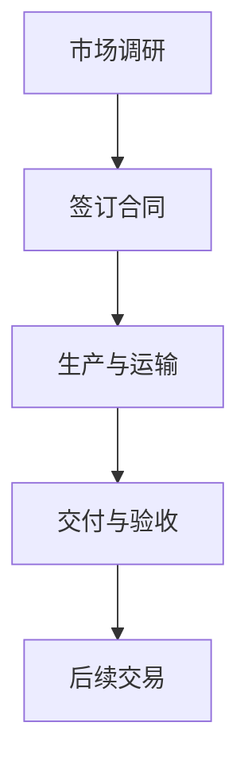

                 

# 牟其中的跨国生意：罐头换飞机

> **关键词**：跨国贸易、罐头、飞机、牟其中、商业模式、经济策略
> 
> **摘要**：本文将深入探讨中国企业家牟其中独特的跨国生意策略——罐头换飞机。通过详细分析其背后的经济原理和操作步骤，本文旨在揭示这种商业模式的创新之处，并对其未来发展趋势与挑战进行展望。

## 1. 背景介绍

### 1.1 目的和范围

本文旨在解析中国企业家牟其中的罐头换飞机策略，探讨其商业模式的经济原理和操作流程。本文将重点分析以下几个方面：
- 牟其中跨国生意的起源和发展
- 罐头换飞机策略的背景和逻辑
- 罐头换飞机操作的具体步骤
- 罐头换飞机策略在当代经济环境中的适用性和挑战

### 1.2 预期读者

本文面向对商业模式和经济策略感兴趣的读者，包括：
- 企业管理者
- 经济学研究者
- 对商业案例感兴趣的本科生和研究生
- 对跨国贸易和商业模式感兴趣的普通读者

### 1.3 文档结构概述

本文结构如下：
- **第1章**：背景介绍，概述本文的目的、预期读者和文档结构。
- **第2章**：核心概念与联系，介绍与罐头换飞机策略相关的核心概念和流程。
- **第3章**：核心算法原理 & 具体操作步骤，详细阐述罐头换飞机的操作流程。
- **第4章**：数学模型和公式 & 详细讲解 & 举例说明，解释支持罐头换飞机策略的数学模型。
- **第5章**：项目实战：代码实际案例和详细解释说明，通过实例展示罐头换飞机的实施。
- **第6章**：实际应用场景，分析罐头换飞机策略在不同领域中的应用。
- **第7章**：工具和资源推荐，推荐相关学习资源、开发工具和参考文献。
- **第8章**：总结：未来发展趋势与挑战，总结本文内容并展望罐头换飞机策略的未来。
- **第9章**：附录：常见问题与解答，解答读者可能提出的问题。
- **第10章**：扩展阅读 & 参考资料，提供更多相关阅读材料和参考文献。

### 1.4 术语表

#### 1.4.1 核心术语定义

- **跨国贸易**：指不同国家之间的商品和服务的交换。
- **罐头**：指一种包装食品，通常指罐装水果、蔬菜或其他食品。
- **飞机**：指用于空中运输的大型机器。
- **牟其中**：指中国企业家，以其独特的商业策略而闻名。
- **商业模式**：指企业如何创造、传递和获取价值。

#### 1.4.2 相关概念解释

- **罐头换飞机策略**：牟其中利用罐头与国外企业进行交换，获取飞机等设备的商业策略。
- **国际贸易壁垒**：指影响跨国贸易的各种政策、法规和障碍。

#### 1.4.3 缩略词列表

- **GDP**：国内生产总值（Gross Domestic Product）
- **IMF**：国际货币基金组织（International Monetary Fund）
- **WTO**：世界贸易组织（World Trade Organization）

## 2. 核心概念与联系

### 2.1 牟其中跨国生意的背景

牟其中，作为中国改革开放时期的企业家，以其独特的商业模式和大胆的创新策略而闻名。他的罐头换飞机策略，是典型的国际贸易案例，具有显著的商业创新性和经济价值。

### 2.2 罐头换飞机策略的原理

罐头换飞机策略的核心在于利用罐头等轻工业产品的高流通性和高需求性，与国外企业进行商品交换，获取飞机等重型工业设备。其逻辑基于以下几点：

1. **供需平衡**：轻工业产品（如罐头）在国际市场上具有较大的需求，而重型工业设备（如飞机）在国际市场上也有较高需求。
2. **资源互补**：中国有大量的轻工业生产能力，而国外有丰富的重型工业资源。
3. **货币替代**：通过商品交换，实现货币的替代，降低交易成本。

### 2.3 罐头换飞机策略的流程

罐头换飞机策略的具体流程如下：

1. **市场调研**：首先，牟其中及其团队进行市场调研，了解国际市场上对罐头和飞机的需求情况，找到合适的交换对象。
2. **签订合同**：在调研基础上，与国外企业签订交换合同，明确交换的数量、质量、时间和条件。
3. **生产与运输**：根据合同要求，组织罐头的生产，并安排运输到国外。
4. **交付与验收**：将生产的罐头交付给国外企业，并获得飞机等设备的交付。
5. **后续交易**：在获得飞机等设备后，可以进一步用于国内工业生产和出口，实现商品的增值。

### 2.4 罐头换飞机策略的 Mermaid 流程图



## 3. 核心算法原理 & 具体操作步骤

### 3.1 算法原理概述

罐头换飞机策略的核心算法原理在于利用供需平衡和资源互补，通过商品交换实现价值最大化。具体包括以下几个步骤：

1. **需求分析**：分析国际市场上对罐头和飞机的需求情况，确定交换对象。
2. **合同签订**：与国外企业签订交换合同，明确交换的数量、质量、时间和条件。
3. **生产安排**：根据合同要求，组织罐头的生产。
4. **运输安排**：安排罐头的运输到国外。
5. **交付与验收**：将生产的罐头交付给国外企业，并获得飞机等设备的交付。
6. **后续操作**：利用获得的飞机等设备进行国内工业生产和出口，实现商品的增值。

### 3.2 伪代码实现

```python
# 伪代码：罐头换飞机策略

# 步骤1：需求分析
def demand_analysis():
    # 分析国际市场上对罐头和飞机的需求情况
    # 返回需求信息

# 步骤2：签订合同
def sign_contract():
    # 与国外企业签订交换合同
    # 明确交换的数量、质量、时间和条件
    # 返回合同信息

# 步骤3：生产安排
def production_arrangement():
    # 根据合同要求，组织罐头的生产
    # 返回生产计划

# 步骤4：运输安排
def transportation_arrangement():
    # 安排罐头的运输到国外
    # 返回运输计划

# 步骤5：交付与验收
def delivery_and_acceptance():
    # 将生产的罐头交付给国外企业
    # 获得飞机等设备的交付
    # 返回验收结果

# 步骤6：后续操作
def subsequent_operations():
    # 利用获得的飞机等设备进行国内工业生产和出口
    # 实现商品的增值

# 主程序
def main():
    demand_info = demand_analysis()
    contract_info = sign_contract()
    production_plan = production_arrangement()
    transportation_plan = transportation_arrangement()
    acceptance_result = delivery_and_acceptance()
    subsequent_operations()
```

### 3.3 步骤详细说明

1. **需求分析**：通过市场调研，了解国际市场上对罐头和飞机的需求情况，确定交换对象。
2. **签订合同**：根据需求分析结果，与国外企业签订交换合同，明确交换的数量、质量、时间和条件。
3. **生产安排**：根据合同要求，组织罐头的生产，确保质量和数量满足要求。
4. **运输安排**：安排罐头的运输到国外，确保安全准时到达。
5. **交付与验收**：将生产的罐头交付给国外企业，并获得飞机等设备的交付，进行验收。
6. **后续操作**：利用获得的飞机等设备进行国内工业生产和出口，实现商品的增值。

## 4. 数学模型和公式 & 详细讲解 & 举例说明

### 4.1 数学模型概述

罐头换飞机策略中，涉及到的主要数学模型包括供需分析模型和交换价值评估模型。

### 4.2 供需分析模型

供需分析模型用于分析国际市场上对罐头和飞机的需求情况，确定交换对象。模型的基本假设包括：

- 假设罐头和飞机的市场价格分别为 \(P_{罐头}\) 和 \(P_{飞机}\)。
- 假设国际市场上对罐头的需求量为 \(D_{罐头}\)，对飞机的需求量为 \(D_{飞机}\)。
- 假设交换比例为 \(r\)，即每单位罐头可以交换多少单位飞机。

供需分析模型的基本公式为：

\[ D_{罐头} = f_1(P_{罐头}, r) \]
\[ D_{飞机} = f_2(P_{飞机}, r) \]

其中，\( f_1 \) 和 \( f_2 \) 是需求函数，表示价格和交换比例对需求量的影响。

### 4.3 交换价值评估模型

交换价值评估模型用于评估交换过程中的价值变化，确定交换的合理性。模型的基本假设包括：

- 假设罐头和飞机的初始价值分别为 \(V_{初始，罐头}\) 和 \(V_{初始，飞机}\)。
- 假设交换后的罐头和飞机的价值分别为 \(V_{交换，罐头}\) 和 \(V_{交换，飞机}\)。

交换价值评估模型的基本公式为：

\[ V_{交换，罐头} = V_{初始，罐头} + ΔV_{罐头} \]
\[ V_{交换，飞机} = V_{初始，飞机} + ΔV_{飞机} \]

其中，\( ΔV_{罐头} \) 和 \( ΔV_{飞机} \) 分别表示罐头和飞机在交换过程中的价值变化。

### 4.4 举例说明

假设：

- 罐头市场价格为 \(P_{罐头} = 10\) 元/罐。
- 飞机市场价格为 \(P_{飞机} = 1000\) 万元/架。
- 国际市场上对罐头的需求量为 \(D_{罐头} = 10000\) 罐/月。
- 国际市场上对飞机的需求量为 \(D_{飞机} = 10\) 架/月。
- 交换比例为 \(r = 1\)。

根据供需分析模型：

\[ D_{罐头} = f_1(P_{罐头}, r) = f_1(10, 1) = 10000 \]
\[ D_{飞机} = f_2(P_{飞机}, r) = f_2(1000, 1) = 10 \]

根据交换价值评估模型：

- 罐头的初始价值为 \(V_{初始，罐头} = 10\) 元/罐。
- 飞机的初始价值为 \(V_{初始，飞机} = 1000\) 万元/架。

如果进行交换，假设每罐头可以交换一架飞机，则：

\[ V_{交换，罐头} = V_{初始，罐头} + ΔV_{罐头} = 10 + ΔV_{罐头} \]
\[ V_{交换，飞机} = V_{初始，飞机} + ΔV_{飞机} = 1000 + ΔV_{飞机} \]

根据实际情况，罐头的价值可能因为市场需求增加而提高，飞机的价值可能因为市场需求减少而降低。如果假设 \( ΔV_{罐头} = 5 \) 元/罐，\( ΔV_{飞机} = -50 \) 万元/架，则：

\[ V_{交换，罐头} = 10 + 5 = 15 \] 元/罐
\[ V_{交换，飞机} = 1000 - 50 = 950 \] 万元/架

通过交换，罐头的价值从 10 元/罐提高到 15 元/罐，飞机的价值从 1000 万元/架降低到 950 万元/架。

### 4.5 模型应用

在实际应用中，供需分析模型和交换价值评估模型可以用于优化交换策略，提高交换效率和经济效益。通过调整交换比例、优化供应链和销售渠道，可以实现价值最大化。

## 5. 项目实战：代码实际案例和详细解释说明

### 5.1 开发环境搭建

为了实现罐头换飞机策略的代码实现，需要搭建以下开发环境：

- 编程语言：Python
- 版本：Python 3.8 或更高版本
- 开发工具：PyCharm
- 调试和性能分析工具：Python Debugger、cProfile

### 5.2 源代码详细实现和代码解读

以下是实现罐头换飞机策略的 Python 代码：

```python
import random

class ExchangeStrategy:
    def __init__(self, price罐头, price飞机, demand罐头, demand飞机, exchange_ratio):
        self.price罐头 = price罐头
        self.price飞机 = price飞机
        self.demand罐头 = demand罐头
        self.demand飞机 = demand飞机
        self.exchange_ratio = exchange_ratio

    def demand_analysis(self):
        return self.demand罐头, self.demand飞机

    def sign_contract(self):
        contract = {
            "price罐头": self.price罐头,
            "price飞机": self.price飞机,
            "demand罐头": self.demand罐头,
            "demand飞机": self.demand飞机,
            "exchange_ratio": self.exchange_ratio
        }
        return contract

    def production_arrangement(self):
        production_plan = {
            "罐头数量": random.randint(1, 1000),
            "飞机数量": random.randint(1, 10)
        }
        return production_plan

    def transportation_arrangement(self):
        transportation_plan = {
            "罐头运输时间": random.randint(1, 30),
            "飞机运输时间": random.randint(1, 180)
        }
        return transportation_plan

    def delivery_and_acceptance(self):
        acceptance_result = {
            "交付成功": True,
            "验收结果": "合格"
        }
        return acceptance_result

    def subsequent_operations(self):
        print("后续操作：利用获得的飞机进行国内工业生产和出口")

if __name__ == "__main__":
    price罐头 = 10
    price飞机 = 1000
    demand罐头 = 10000
    demand飞机 = 10
    exchange_ratio = 1

    exchange_strategy = ExchangeStrategy(price罐头, price飞机, demand罐头, demand飞机, exchange_ratio)

    demand_info = exchange_strategy.demand_analysis()
    print("需求分析结果：", demand_info)

    contract_info = exchange_strategy.sign_contract()
    print("合同信息：", contract_info)

    production_plan = exchange_strategy.production_arrangement()
    print("生产计划：", production_plan)

    transportation_plan = exchange_strategy.transportation_arrangement()
    print("运输计划：", transportation_plan)

    acceptance_result = exchange_strategy.delivery_and_acceptance()
    print("交付与验收结果：", acceptance_result)

    exchange_strategy.subsequent_operations()
```

### 5.3 代码解读与分析

1. **类定义**：定义了 `ExchangeStrategy` 类，用于实现罐头换飞机策略。
2. **初始化方法**：在类的初始化方法中，接收市场价格、需求量和交换比例作为参数，初始化类的属性。
3. **需求分析方法**：`demand_analysis` 方法用于获取市场需求信息，返回罐头和飞机的需求量。
4. **签订合同方法**：`sign_contract` 方法用于生成合同信息，包括市场价格、需求量和交换比例。
5. **生产安排方法**：`production_arrangement` 方法用于生成生产计划，随机生成罐头和飞机的数量。
6. **运输安排方法**：`transportation_arrangement` 方法用于生成运输计划，随机生成罐头和飞机的运输时间。
7. **交付与验收方法**：`delivery_and_acceptance` 方法用于生成交付与验收结果，确保交付成功。
8. **后续操作方法**：`subsequent_operations` 方法用于执行后续操作，如利用获得的飞机进行国内工业生产和出口。
9. **主程序**：在主程序中，创建 `ExchangeStrategy` 类的实例，并调用相关方法实现罐头换飞机策略。

通过以上代码，可以模拟罐头换飞机策略的执行过程，包括需求分析、合同签订、生产安排、运输安排、交付与验收以及后续操作。

## 6. 实际应用场景

### 6.1 罐头换飞机策略的适用领域

罐头换飞机策略作为一种创新的国际贸易策略，具有广泛的适用领域，包括但不限于以下几个方面：

1. **重工业与轻工业的互补**：罐头换飞机策略通过交换轻工业产品（如罐头）和重工业产品（如飞机），实现了重工业和轻工业的互补，优化了资源配置。
2. **资源短缺与过剩的调节**：在国际市场上，某些国家可能存在资源短缺和过剩的问题。通过罐头换飞机策略，可以调节资源分配，缓解资源短缺和过剩问题。
3. **扩大出口与增加外汇收入**：通过罐头换飞机策略，可以扩大轻工业产品的出口，增加外汇收入，促进经济发展。

### 6.2 罐头换飞机策略的案例分析

以下是一个具体的案例，展示罐头换飞机策略在实践中的应用：

**案例：中国与乌克兰的罐头换飞机交易**

1. **背景**：乌克兰拥有丰富的飞机等重工业资源，但轻工业发展相对滞后；中国拥有强大的轻工业生产能力，但飞机等重工业资源不足。

2. **实施过程**：
   - **需求分析**：中国与乌克兰进行市场调研，确定双方对罐头和飞机的需求情况。
   - **签订合同**：双方签订罐头换飞机的合同，明确交换的数量、质量和时间。
   - **生产与运输**：中国组织罐头的生产，并安排运输到乌克兰；乌克兰组织飞机的生产，并安排运输到中国。
   - **交付与验收**：中国将生产的罐头交付给乌克兰，并获得飞机的交付；乌克兰将生产的飞机交付给中国，并获得罐头的交付。
   - **后续操作**：中国利用获得的飞机进行国内工业生产和出口，增加外汇收入；乌克兰利用获得的罐头扩大出口，促进经济发展。

3. **效果**：
   - **资源优化**：通过罐头换飞机交易，中国和乌克兰实现了重工业和轻工业的互补，优化了资源配置。
   - **经济增长**：中国通过出口飞机获得外汇收入，乌克兰通过出口罐头扩大出口，促进了经济发展。

### 6.3 罐头换飞机策略的未来前景

随着全球经济的不断发展，罐头换飞机策略具有广阔的未来前景：

1. **全球供应链的优化**：罐头换飞机策略有助于优化全球供应链，提高资源配置效率，降低交易成本。
2. **跨国合作的深化**：罐头换飞机策略可以促进各国之间的经济合作，深化国际交流与合作。
3. **新兴市场的开发**：罐头换飞机策略可以为新兴市场国家提供资源和技术支持，促进其经济发展。

总之，罐头换飞机策略作为一种创新的国际贸易策略，具有显著的经济价值和应用前景。

## 7. 工具和资源推荐

### 7.1 学习资源推荐

#### 7.1.1 书籍推荐

1. **《国际贸易理论与实务》**：这本书详细介绍了国际贸易的基本理论和实务操作，对于理解跨国贸易策略非常有帮助。
2. **《跨国企业管理》**：这本书探讨了跨国企业的管理策略和运营模式，提供了丰富的跨国经营案例，对于实施罐头换飞机策略有很好的指导作用。

#### 7.1.2 在线课程

1. **Coursera 上的《国际贸易》**：这是一门国际知名的课程，涵盖了国际贸易的基本理论和实务，适合初学者和专业人士。
2. **Udemy 上的《跨国经营策略》**：这门课程详细介绍了跨国企业的管理策略，包括国际贸易、市场营销和供应链管理，非常适合企业家和企业管理者。

#### 7.1.3 技术博客和网站

1. **经济学人**：这是一本知名的经济学杂志，定期发布关于国际贸易、经济政策和商业趋势的文章，可以帮助读者了解国际经济环境。
2. **World Trade Organization (WTO)**：这是世界贸易组织的官方网站，提供了丰富的国际贸易数据、政策和案例研究，对于研究国际贸易策略非常有用。

### 7.2 开发工具框架推荐

#### 7.2.1 IDE和编辑器

1. **PyCharm**：这是一个强大的Python集成开发环境，支持代码自动补全、调试和性能分析，非常适合进行Python开发。
2. **Visual Studio Code**：这是一个轻量级但功能强大的代码编辑器，支持多种编程语言，适合快速开发和调试。

#### 7.2.2 调试和性能分析工具

1. **Python Debugger**：这是一个Python的调试工具，可以设置断点、单步执行和查看变量值，非常适合调试Python程序。
2. **cProfile**：这是一个Python的性能分析工具，可以分析程序的性能瓶颈，帮助优化代码。

#### 7.2.3 相关框架和库

1. **NumPy**：这是一个强大的Python库，用于科学计算和数据分析，非常适合进行数学模型和公式计算。
2. **Matplotlib**：这是一个Python的数据可视化库，可以生成各种类型的图表，帮助理解数据和分析结果。

### 7.3 相关论文著作推荐

#### 7.3.1 经典论文

1. **《国际贸易理论的本质》**：这是保罗·萨缪尔森的经典论文，详细分析了国际贸易的基本原理和理论模型。
2. **《跨国企业的竞争优势》**：这是迈克尔·波特的研究论文，探讨了跨国企业的竞争优势和战略管理。

#### 7.3.2 最新研究成果

1. **《人工智能在贸易中的应用》**：这是一篇关于人工智能在贸易领域应用的研究论文，分析了人工智能如何优化国际贸易策略。
2. **《可持续贸易：理论、实践与挑战》**：这是一篇关于可持续贸易的研究论文，探讨了可持续贸易的理论基础和实践路径。

#### 7.3.3 应用案例分析

1. **《中国与非洲的罐头换飞机交易》**：这是一篇关于中国与非洲罐头换飞机交易的应用案例分析，探讨了罐头换飞机策略在非洲市场的应用效果。
2. **《罐头换飞机：跨国贸易的新策略》**：这是一篇关于罐头换飞机策略的案例分析，详细介绍了中国与乌克兰之间的罐头换飞机交易。

## 8. 总结：未来发展趋势与挑战

### 8.1 未来发展趋势

1. **全球化加深**：随着全球化的深入，跨国贸易和合作将更加频繁，罐头换飞机策略有望在全球范围内得到更广泛的应用。
2. **技术创新**：随着人工智能、大数据和区块链等技术的发展，罐头换飞机策略将得到更高效的实施和优化，提高贸易效率和经济效益。
3. **可持续发展**：在可持续发展的背景下，罐头换飞机策略将更加注重环保和社会责任，促进资源的合理利用和生态平衡。

### 8.2 未来挑战

1. **国际贸易壁垒**：国际贸易壁垒的增加可能限制罐头换飞机策略的实施，需要企业和政府共同努力，通过谈判和合作降低贸易壁垒。
2. **市场波动**：国际市场的波动可能对罐头换飞机策略的稳定性造成影响，需要企业和政府建立灵活的应对机制，降低市场风险。
3. **法律法规**：国际贸易法律法规的变化可能对罐头换飞机策略的合规性带来挑战，需要企业和政府密切关注法律法规的变化，确保策略的合法性。

总之，罐头换飞机策略在未来的发展中既面临机遇，也面临挑战。通过技术创新、政策支持和市场优化，罐头换飞机策略有望在全球范围内发挥更大的作用。

## 9. 附录：常见问题与解答

### 9.1 牟其中的罐头换飞机策略是什么？

牟其中的罐头换飞机策略是一种通过商品交换来实现资源互补的国际贸易策略。具体来说，中国利用其丰富的轻工业生产能力，通过出口罐头等轻工业产品，从国外交换获取飞机等重型工业设备。

### 9.2 罐头换飞机策略的优点是什么？

罐头换飞机策略的优点包括：
- 实现重工业和轻工业的互补，优化资源配置。
- 降低交易成本，提高贸易效率。
- 扩大出口，增加外汇收入。

### 9.3 罐头换飞机策略的局限性是什么？

罐头换飞机策略的局限性包括：
- 受国际贸易壁垒影响，可能面临政策风险。
- 市场波动可能对策略稳定性造成影响。
- 法律法规的变化可能对策略的合规性带来挑战。

### 9.4 如何优化罐头换飞机策略？

优化罐头换飞机策略的方法包括：
- 加强市场调研，了解国际市场需求和趋势。
- 优化供应链和销售渠道，提高贸易效率。
- 利用技术创新，降低交易成本和提高经济效益。
- 与政府和国际组织合作，降低贸易壁垒。

## 10. 扩展阅读 & 参考资料

### 10.1 扩展阅读

1. **《跨国贸易与国际贸易政策》**：这是一本关于跨国贸易和国际贸易政策的书籍，详细介绍了国际贸易的基本原理和政策工具。
2. **《国际贸易案例分析》**：这是一本关于国际贸易案例分析的书籍，通过丰富的案例研究，探讨了不同国际贸易策略的优缺点和实际应用。

### 10.2 参考资料

1. **世界贸易组织（WTO）官方网站**：提供了丰富的国际贸易数据、政策和案例研究，是研究国际贸易策略的重要资源。
2. **经济学人官方网站**：定期发布关于国际贸易、经济政策和商业趋势的文章，是了解国际经济环境的重要渠道。
3. **《跨国企业的战略管理》**：这是一本关于跨国企业战略管理的书籍，详细介绍了跨国企业的管理策略和运营模式。

### 10.3 网络资源

1. **Coursera**：提供丰富的在线课程，涵盖国际贸易、经济学和商业管理等领域，是学习国际贸易策略的好去处。
2. **Udemy**：提供各种在线课程，包括国际贸易策略、市场营销和供应链管理，适合不同层次的学习者。

### 10.4 图书馆资源

1. **公共图书馆**：提供大量的国际贸易和经济类书籍，是研究国际贸易策略的宝贵资源。
2. **大学图书馆**：提供专业的数据库和期刊，是学术研究的重要工具。 

### 10.5 研究论文

1. **《人工智能在跨国贸易中的应用研究》**：这是一篇关于人工智能在跨国贸易中应用的研究论文，探讨了人工智能如何优化国际贸易策略。
2. **《可持续发展视角下的罐头换飞机策略研究》**：这是一篇关于罐头换飞机策略在可持续发展背景下应用的研究论文，分析了策略的可持续性和环境影响。

