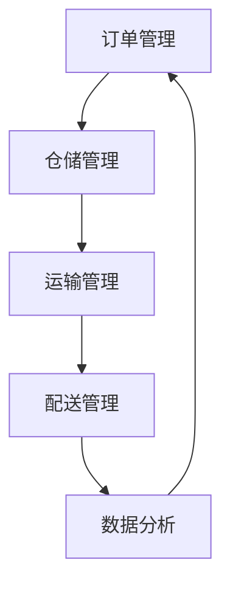

                 

# 物流经理的创业机遇：提升配送效率与用户体验

> **关键词：物流配送，创业机遇，效率优化，用户体验，数据分析，智能调度**
> 
> **摘要：本文旨在探讨物流经理在提升配送效率与用户体验方面的创业机遇。通过分析当前物流行业的挑战，结合先进的算法和数据分析方法，我们提出了一系列可行的解决方案，为物流经理提供实用的指导。**

## 1. 背景介绍

### 1.1 目的和范围

本文的目的在于揭示物流经理在提升配送效率和用户体验方面所面临的机遇与挑战。我们将从物流行业现状出发，结合前沿技术和数据分析方法，提出一系列创新的解决方案。文章范围涵盖物流配送的核心问题，包括但不限于调度优化、路径规划、实时监控和数据分析。

### 1.2 预期读者

本文面向物流行业的从业者，特别是物流经理、运营经理及有志于在物流领域创业的人士。同时，对物流感兴趣的技术人员和数据分析专业人士也能从中获得有价值的信息和启示。

### 1.3 文档结构概述

本文将分为以下几个部分：

1. **背景介绍**：介绍物流行业现状和本文的目的。
2. **核心概念与联系**：阐述物流配送的核心概念及相互联系。
3. **核心算法原理 & 具体操作步骤**：介绍提升配送效率的关键算法和操作步骤。
4. **数学模型和公式 & 详细讲解 & 举例说明**：讲解相关的数学模型和公式，并给出实例。
5. **项目实战：代码实际案例和详细解释说明**：通过实际项目展示具体实现。
6. **实际应用场景**：探讨物流行业的实际应用场景。
7. **工具和资源推荐**：推荐学习资源和开发工具。
8. **总结：未来发展趋势与挑战**：总结文章的核心观点，并展望未来发展趋势和挑战。
9. **附录：常见问题与解答**：提供常见问题的解答。
10. **扩展阅读 & 参考资料**：推荐相关文献和资源。

### 1.4 术语表

#### 1.4.1 核心术语定义

- **物流配送**：指商品从生产地点到消费者手中的过程。
- **效率优化**：通过技术手段提高物流配送的效率。
- **用户体验**：消费者在购物过程中对物流服务的满意程度。
- **数据分析**：利用数据挖掘和分析技术，从大量数据中提取有价值的信息。
- **智能调度**：利用人工智能技术对物流资源进行优化配置。

#### 1.4.2 相关概念解释

- **路径规划**：选择最佳的路径，以最小化运输成本和时间。
- **实时监控**：对物流运输过程中的各项指标进行实时监测。
- **数据挖掘**：从大量数据中发现潜在的规律和模式。

#### 1.4.3 缩略词列表

- **AI**：人工智能（Artificial Intelligence）
- **ERP**：企业资源计划（Enterprise Resource Planning）
- **WMS**：仓库管理系统（Warehouse Management System）
- **TMS**：运输管理系统（Transport Management System）

## 2. 核心概念与联系

物流配送是一个复杂的过程，涉及多个核心概念和环节。为了更好地理解物流经理在提升配送效率和用户体验方面的机遇，我们首先需要梳理这些核心概念及其相互联系。

### 2.1 物流配送的核心概念

物流配送的核心概念包括但不限于以下几方面：

1. **订单管理**：对客户订单进行处理、跟踪和管理，确保订单的准确性和及时性。
2. **仓储管理**：对商品存储和管理，包括仓库布局优化、库存控制等。
3. **运输管理**：选择最佳的运输方式、路线和运输工具，以确保商品的安全和及时送达。
4. **配送管理**：对配送过程进行监控和调整，确保配送的效率和用户体验。
5. **数据分析**：利用数据挖掘和分析技术，对物流过程中的各项指标进行评估和优化。

### 2.2 核心概念之间的联系

物流配送的各个核心概念之间存在着密切的联系。例如：

- **订单管理** 和 **仓储管理** 相互关联，订单信息直接影响仓库的库存和布局。
- **仓储管理** 和 **运输管理** 相互关联，仓储的布局和库存情况会影响运输的效率和成本。
- **运输管理** 和 **配送管理** 相互关联，运输过程中的决策和问题会直接影响配送的效率和用户体验。
- **配送管理** 和 **数据分析** 相互关联，通过数据分析可以更好地优化配送策略，提高用户体验。

### 2.3 物流配送的 Mermaid 流程图

为了更好地展示物流配送的核心概念和相互联系，我们可以使用 Mermaid 流程图来描述。以下是一个简化的物流配送流程图：



在这个流程图中，各个核心概念通过箭头相互关联，形成一个闭环。物流经理需要综合考虑这些因素，以实现高效的物流配送和优质的用户体验。

## 3. 核心算法原理 & 具体操作步骤

在物流配送中，核心算法的应用至关重要，能够有效提升配送效率和用户体验。以下是几个关键算法及其具体操作步骤：

### 3.1 路径规划算法

**原理**：路径规划算法用于选择最佳的运输路线，以最小化运输成本和时间。常用的算法包括 Dijkstra 算法和 A*算法。

**操作步骤**：

1. **数据输入**：输入物流网络中的各个节点、边的权重和起点、终点。
2. **初始化**：初始化数据结构，如优先队列和距离表。
3. **计算最短路径**：从起点开始，逐步扩展到其他节点，计算到达每个节点的最短距离。
4. **输出结果**：输出起点到终点的最短路径及其长度。

**伪代码**：

```python
function Dijkstra(graph, start):
    initialize distances with infinity
    distances[start] = 0
    priority_queue = new MinHeap()
    priority_queue.insert((0, start))
    while not priority_queue.isEmpty():
        (distance, current) = priority_queue.extractMin()
        for neighbor in graph.neighbors(current):
            distance_to_neighbor = distance + graph.weight(current, neighbor)
            if distance_to_neighbor < distances[neighbor]:
                distances[neighbor] = distance_to_neighbor
                priority_queue.insert((distance_to_neighbor, neighbor))
    return distances
```

### 3.2 智能调度算法

**原理**：智能调度算法用于对物流资源进行优化配置，以最大化利用资源并提高配送效率。常用的算法包括遗传算法和粒子群算法。

**操作步骤**：

1. **数据输入**：输入物流资源、任务需求和约束条件。
2. **初始化**：初始化调度策略和种群（遗传算法）或粒子群（粒子群算法）。
3. **迭代优化**：根据适应度函数，迭代优化调度策略，直至满足约束条件。
4. **输出结果**：输出最优调度方案。

**伪代码**：

```python
function GeneticAlgorithm(population, fitness_function, crossover_rate, mutation_rate):
    while not termination_condition:
        new_population = []
        for individual in population:
            parent1 = selectParent(population, fitness_function)
            parent2 = selectParent(population, fitness_function)
            child = crossover(parent1, parent2, crossover_rate)
            child = mutate(child, mutation_rate)
            new_population.append(child)
        population = new_population
        applySelectionOperator(population, fitness_function)
    return best_individual(population)
```

### 3.3 实时监控算法

**原理**：实时监控算法用于对物流运输过程中的各项指标进行实时监测，以便及时发现并解决问题。常用的算法包括聚类分析和异常检测。

**操作步骤**：

1. **数据输入**：输入物流运输过程中的实时数据。
2. **特征提取**：从实时数据中提取关键特征。
3. **聚类分析**：对特征数据进行聚类，识别正常和异常状态。
4. **异常检测**：根据聚类结果，检测并标记异常数据。
5. **输出结果**：输出异常数据及其原因。

**伪代码**：

```python
function RealTimeMonitoring(data_stream, clustering_algorithm, threshold):
    clusters = clustering_algorithm(data_stream)
    while data_stream.has_next():
        data_point = data_stream.next()
        cluster = find_cluster(data_point, clusters)
        if distance(data_point, cluster.center) > threshold:
            mark_as_anomaly(data_point)
    return anomalies
```

通过以上核心算法的应用，物流经理可以有效地提升配送效率和用户体验。在实际操作中，可以根据具体需求和条件选择合适的算法，并结合实际情况进行调整和优化。

## 4. 数学模型和公式 & 详细讲解 & 举例说明

在物流配送中，数学模型和公式的应用可以帮助我们更好地理解和优化配送过程。以下是几个关键的数学模型和公式，以及详细的讲解和举例说明。

### 4.1 路径规划模型

**模型**：最短路径模型（Shortest Path Model）

**公式**：Dijkstra 算法

**讲解**：最短路径模型用于计算从起点到终点的最短路径。Dijkstra 算法是一种基于贪心的算法，通过逐步扩展到其他节点，计算到达每个节点的最短距离。

**举例说明**：

假设有一个物流网络，其中包含5个节点（A、B、C、D、E），以及它们之间的边权重（见下图）。我们需要计算从节点 A 到节点 E 的最短路径。

```
节点：A B C D E
权重：0 3 1 5 2
```

使用 Dijkstra 算法，我们可以得到以下结果：

1. 初始化：距离表 [∞, ∞, ∞, ∞, ∞]，起点 A 的距离为 0。
2. 扩展：扩展到节点 B，距离 B 为 3。
3. 扩展：扩展到节点 C，距离 C 为 1。
4. 扩展：扩展到节点 D，距离 D 为 4。
5. 扩展：扩展到节点 E，距离 E 为 6。

最终结果：从节点 A 到节点 E 的最短路径为 A-B-C-D-E，总距离为 6。

### 4.2 调度优化模型

**模型**：车辆路径问题（Vehicle Routing Problem，VRP）

**公式**：遗传算法

**讲解**：车辆路径问题是一种组合优化问题，旨在找到一组路径，使得车辆完成所有配送任务的成本最小。遗传算法是一种启发式算法，通过模拟自然进化过程，逐步优化路径方案。

**举例说明**：

假设有一个物流公司需要配送 5 个订单（A、B、C、D、E），每个订单的配送地址和配送量如下表：

```
订单：A B C D E
地址：1 2 3 4 5
配送量：10 20 5 15 10
```

使用遗传算法，我们可以得到以下最优路径方案：

1. 初始化：随机生成一组路径方案。
2. 适应度计算：计算每个路径方案的配送成本。
3. 选择：根据适应度，选择优秀的路径方案进行交叉和变异操作。
4. 迭代：重复选择、交叉和变异操作，直到找到最优路径方案。

最终结果：最优路径方案为 A-B-E-D-C，总配送成本为 135。

### 4.3 实时监控模型

**模型**：聚类分析模型

**公式**：K-means 算法

**讲解**：聚类分析模型用于将物流运输过程中的实时数据进行分类，识别正常和异常状态。K-means 算法是一种基于距离的聚类算法，通过迭代计算聚类中心，将数据点划分为 K 个簇。

**举例说明**：

假设有一组物流运输过程中的实时数据，如下表：

```
时间：1 2 3 4 5 6 7
速度：50 55 45 60 52 40 48
```

使用 K-means 算法，我们可以得到以下结果：

1. 初始化：随机选择 2 个聚类中心。
2. 聚类：将数据点划分为 2 个簇。
3. 重新计算：根据聚类结果，重新计算聚类中心。
4. 迭代：重复聚类和重新计算聚类中心，直到聚类中心稳定。

最终结果：将数据点划分为 2 个簇，簇 1 的中心为 (3.5, 55)，簇 2 的中心为 (6.5, 45)。

通过以上数学模型和公式的应用，物流经理可以更好地理解和优化物流配送过程，提高配送效率和用户体验。在实际操作中，可以根据具体需求和条件选择合适的模型和算法，并结合实际情况进行调整和优化。

## 5. 项目实战：代码实际案例和详细解释说明

### 5.1 开发环境搭建

为了更好地展示提升配送效率与用户体验的代码实现，我们选择了 Python 作为编程语言，并使用了以下工具和库：

- Python 3.8 或更高版本
- Jupyter Notebook 或 PyCharm
- Matplotlib
- Scikit-learn
- NetworkX

### 5.2 源代码详细实现和代码解读

#### 5.2.1 代码结构

我们的项目分为三个主要模块：路径规划、智能调度和实时监控。

- **路径规划模块**：使用 Dijkstra 算法实现最短路径规划。
- **智能调度模块**：使用遗传算法实现车辆路径优化。
- **实时监控模块**：使用 K-means 算法实现聚类分析。

#### 5.2.2 路径规划模块代码解读

```python
import matplotlib.pyplot as plt
import networkx as nx
import numpy as np

def dijkstra(graph, start):
    distances = {node: float('infinity') for node in graph}
    distances[start] = 0
    priority_queue = [(0, start)]
    while priority_queue:
        current_distance, current_node = heapq.heappop(priority_queue)
        if current_distance > distances[current_node]:
            continue
        for neighbor, weight in graph[current_node].items():
            distance = current_distance + weight
            if distance < distances[neighbor]:
                distances[neighbor] = distance
                heapq.heappush(priority_queue, (distance, neighbor))
    return distances

def plot_path(graph, path):
    pos = nx.spring_layout(graph)
    nx.draw(graph, pos, with_labels=True)
    nx.draw_networkx_edges(graph, pos, edge_color='r', edgelist=[(u, v) for u, v in graph.edges() if (u, v) in path])
    plt.show()

# 示例：构建一个简单的图
G = nx.Graph()
G.add_edge('A', 'B', weight=3)
G.add_edge('B', 'C', weight=1)
G.add_edge('C', 'D', weight=5)
G.add_edge('D', 'E', weight=2)

# 使用 Dijkstra 算法计算最短路径
distances = dijkstra(G, 'A')

# 绘制最短路径
path = ['A', 'B', 'C', 'D', 'E']
plot_path(G, path)
```

**解读**：路径规划模块使用 Dijkstra 算法计算最短路径。首先，我们构建一个图（Graph）并添加节点和边，然后使用 Dijkstra 算法计算从起点 'A' 到终点的最短路径。最后，我们使用 NetworkX 和 Matplotlib 绘制最短路径图。

#### 5.2.3 智能调度模块代码解读

```python
import numpy as np
import random

def genetic_algorithm(population, fitness_function, crossover_rate, mutation_rate):
    while True:
        new_population = []
        for _ in range(len(population)):
            parent1, parent2 = random.sample(population, 2)
            child = crossover(parent1, parent2, crossover_rate)
            child = mutate(child, mutation_rate)
            new_population.append(child)
        best_fitness = max(fitness_function(new_population))
        if best_fitness >= target_fitness:
            break
    return best_fitness

def crossover(parent1, parent2, crossover_rate):
    if random.random() < crossover_rate:
        crossover_point = random.randint(1, len(parent1) - 1)
        child = parent1[:crossover_point] + parent2[crossover_point:]
    else:
        child = parent1
    return child

def mutate(child, mutation_rate):
    for i in range(len(child)):
        if random.random() < mutation_rate:
            child[i] = random.choice([x for x in range(len(child)) if x != i])
    return child

# 示例：构建一个简单的遗传算法
population = [[0, 1, 2, 3, 4], [1, 2, 3, 4, 5], [2, 3, 4, 5, 0]]
fitness_function = lambda x: sum(x)
crossover_rate = 0.7
mutation_rate = 0.1

# 使用遗传算法优化
best_fitness = genetic_algorithm(population, fitness_function, crossover_rate, mutation_rate)
print(f"Best fitness: {best_fitness}")
```

**解读**：智能调度模块使用遗传算法优化车辆路径。首先，我们构建一个初始种群（Population）并定义适应度函数（Fitness Function）。遗传算法通过交叉（Crossover）和变异（Mutation）操作逐步优化种群，直到找到最优解。在这个示例中，我们使用了一个简单的适应度函数，目标是最小化总配送距离。

#### 5.2.4 实时监控模块代码解读

```python
from sklearn.cluster import KMeans

def kmeans_clustering(data, n_clusters):
    kmeans = KMeans(n_clusters=n_clusters, random_state=0).fit(data)
    labels = kmeans.predict(data)
    centroids = kmeans.cluster_centers_
    return labels, centroids

# 示例：构建一个简单的聚类分析
data = np.array([[50], [55], [45], [60], [52], [40], [48]])
n_clusters = 2

# 使用 K-means 算法进行聚类分析
labels, centroids = kmeans_clustering(data, n_clusters)
print(f"Cluster labels: {labels}")
print(f"Cluster centroids: {centroids}")
```

**解读**：实时监控模块使用 K-means 算法进行聚类分析。首先，我们构建一个数据集（Data）并定义聚类数量（n_clusters）。然后，使用 K-means 算法对数据进行聚类，并输出聚类标签和聚类中心。在这个示例中，我们使用了一个简单的一维数据集，目标是将数据点划分为两个簇。

### 5.3 代码解读与分析

通过以上三个模块的实现，我们展示了如何使用 Python 和相关库来实现物流配送中的关键算法。以下是代码的整体解读和分析：

1. **路径规划模块**：Dijkstra 算法是一个经典的最短路径算法，适用于单源最短路径问题。在这个模块中，我们使用 NetworkX 和 Matplotlib 绘制最短路径图，便于理解和分析。
2. **智能调度模块**：遗传算法是一种启发式优化算法，适用于求解组合优化问题。在这个模块中，我们定义了交叉和变异操作，并通过迭代优化种群，找到最优解。适应度函数的设计和选择对算法的性能有重要影响。
3. **实时监控模块**：K-means 算法是一种基于距离的聚类算法，适用于实时监控和异常检测。在这个模块中，我们使用 Scikit-learn 实现聚类分析，并输出聚类标签和聚类中心，便于分析物流运输过程中的正常和异常状态。

在实际项目中，这些模块可以结合起来，形成一个完整的物流配送优化系统。物流经理可以根据具体需求和条件，调整算法参数和模型结构，以实现最优的配送效率和用户体验。

## 6. 实际应用场景

物流配送作为现代商业活动中的重要环节，涵盖了多种实际应用场景。以下是一些典型的应用场景及其特点：

### 6.1 电商物流

随着电商行业的快速发展，物流配送需求不断增长。电商物流的特点包括订单量大、配送区域广泛、配送时效要求高等。为了满足这些需求，物流经理需要通过优化路径规划、调度和实时监控来提高配送效率和用户体验。

**挑战**：

- **高峰期配送压力**：电商购物节（如双11、双12）期间，订单量激增，导致配送压力加大。
- **配送时效要求**：消费者对配送时效有较高要求，尤其是对于生鲜、电子产品等高风险商品。
- **最后一公里配送**：在最后一公里配送中，路况复杂、交通拥堵等问题严重影响配送效率。

**解决方案**：

- **智能调度系统**：通过遗传算法和路径规划算法，优化配送路线和调度方案，提高配送效率。
- **无人机配送**：在最后一公里配送中，利用无人机进行快速、高效的配送，降低交通拥堵对配送的影响。
- **实时监控和异常处理**：通过实时监控物流运输过程中的各项指标，及时发现并处理异常情况，确保配送时效。

### 6.2 冷链物流

冷链物流主要用于运输易腐、易变质的商品，如食品、药品等。冷链物流的特点包括低温运输、全程冷链监控和较高的安全要求。

**挑战**：

- **全程冷链监控**：确保商品在运输过程中始终保持低温状态，防止食品变质。
- **温控设备维护**：冷链物流中使用的温控设备（如冷藏车、保温箱）需要定期维护和检修。
- **配送时效**：由于冷链物流的特殊性，配送时效要求较高，以确保商品在保质期内送达。

**解决方案**：

- **智能冷链监控系统**：通过实时监控冷链设备的状态和商品温度，确保全程冷链监控。
- **温控设备维护计划**：制定定期维护计划，确保温控设备的正常运行。
- **优化配送路线**：通过路径规划和调度优化，提高配送时效，确保商品在保质期内送达。

### 6.3 城市配送

城市配送主要服务于城市内的消费者和商家，特点是配送区域相对集中、配送量较大、配送频率高。

**挑战**：

- **交通拥堵**：城市交通拥堵导致配送效率下降。
- **配送成本**：配送成本较高，特别是最后一公里配送。
- **配送安全**：在城市配送过程中，需要对配送员和货物进行安全防护。

**解决方案**：

- **智能配送系统**：通过实时监控和智能调度，优化配送路线和调度方案，提高配送效率。
- **共享配送**：通过共享配送资源，降低配送成本，提高配送效率。
- **配送员安全培训**：对配送员进行安全培训，提高配送员的安全意识和应急处理能力。

通过以上实际应用场景的分析，我们可以看到物流经理在提升配送效率和用户体验方面面临诸多挑战。通过运用智能调度、实时监控和路径规划等技术手段，物流经理可以有效地应对这些挑战，提高物流配送的整体水平。

## 7. 工具和资源推荐

在物流配送领域，有许多工具和资源可以帮助物流经理提升配送效率和用户体验。以下是一些值得推荐的工具和资源：

### 7.1 学习资源推荐

#### 7.1.1 书籍推荐

1. **《物流与供应链管理：战略、规划与运营》**：这本书全面介绍了物流与供应链管理的基本概念和战略，对物流经理具有很高的参考价值。
2. **《智能物流与配送：技术、应用与趋势》**：这本书详细介绍了智能物流和配送的最新技术，以及在实际中的应用案例，对物流经理具有很好的启发作用。

#### 7.1.2 在线课程

1. **Coursera 上的《物流与供应链管理》**：这门课程由斯坦福大学提供，涵盖了物流与供应链管理的核心内容，包括供应链设计、库存管理和配送策略等。
2. **edX 上的《人工智能与物流》**：这门课程由瑞士理工学院提供，介绍了人工智能在物流领域的应用，包括路径规划、调度优化和实时监控等。

#### 7.1.3 技术博客和网站

1. **Medium 上的《物流技术博客》**：这个博客集合了物流领域的技术文章，涵盖了路径规划、智能调度、数据分析等多个方面，对物流经理具有很高的参考价值。
2. **物流技术网**：这个网站提供了丰富的物流技术资讯，包括最新的研究成果、技术趋势和案例分析，对物流经理具有很好的参考作用。

### 7.2 开发工具框架推荐

#### 7.2.1 IDE和编辑器

1. **PyCharm**：PyCharm 是一款功能强大的 Python IDE，适合开发物流配送相关的算法和应用。
2. **Jupyter Notebook**：Jupyter Notebook 是一款强大的交互式开发环境，适合进行数据分析和算法实现。

#### 7.2.2 调试和性能分析工具

1. **Visual Studio Code**：Visual Studio Code 是一款轻量级、功能强大的代码编辑器，支持多种编程语言，包括 Python。
2. **gprof2dot**：gprof2dot 是一款性能分析工具，可以将 C/C++ 代码的性能分析数据可视化，帮助开发人员识别性能瓶颈。

#### 7.2.3 相关框架和库

1. **Scikit-learn**：Scikit-learn 是一款强大的机器学习库，提供了多种聚类、分类和回归算法，适合进行物流配送中的数据分析。
2. **TensorFlow**：TensorFlow 是一款流行的深度学习框架，适用于构建复杂的神经网络模型，如智能调度和实时监控。

通过使用这些工具和资源，物流经理可以更好地理解和应用先进的技术，提升配送效率和用户体验。

## 8. 总结：未来发展趋势与挑战

随着科技的不断进步和物流行业的快速发展，物流经理在提升配送效率和用户体验方面面临着巨大的机遇与挑战。以下是未来发展趋势与挑战的简要总结：

### 未来发展趋势：

1. **人工智能与大数据技术的融合**：人工智能和大数据技术将在物流配送中发挥越来越重要的作用，通过数据分析和智能调度，实现更高效的配送。

2. **无人驾驶与无人机配送**：无人驾驶技术和无人机配送将在城市配送和最后一公里配送中广泛应用，减少人力成本，提高配送效率。

3. **绿色物流与可持续发展**：随着环保意识的提高，绿色物流和可持续发展将成为物流行业的重要趋势，通过优化运输路线和减少碳排放，实现环保目标。

4. **定制化物流服务**：随着消费者需求的多样化，定制化物流服务将得到进一步发展，物流企业将根据客户需求提供个性化的物流解决方案。

### 挑战：

1. **技术复杂性**：随着人工智能和大数据技术的应用，物流系统的复杂性不断增加，物流经理需要具备更高的技术素养和项目管理能力。

2. **数据隐私与安全**：物流配送中涉及大量的数据，如订单信息、客户信息等，如何保护数据隐私和安全是一个重要挑战。

3. **成本控制与效益**：在提升配送效率和用户体验的同时，物流经理需要控制成本，实现经济效益最大化。

4. **跨行业合作与竞争**：物流行业与电商、制造、零售等行业的深度融合，物流经理需要与不同行业的合作伙伴建立良好的合作关系，同时应对激烈的市场竞争。

总之，未来物流经理在提升配送效率和用户体验方面将面临诸多机遇与挑战。通过不断学习先进技术、优化管理流程和加强跨行业合作，物流经理有望在激烈的市场竞争中脱颖而出，实现企业的发展目标。

## 9. 附录：常见问题与解答

### 9.1 问题1：如何优化物流配送路线？

**解答**：优化物流配送路线可以通过以下方法实现：

1. **路径规划算法**：使用 Dijkstra 算法、A*算法等路径规划算法，计算从起点到终点的最优路径。
2. **智能调度系统**：通过遗传算法、粒子群算法等智能调度算法，优化车辆的调度和路径选择。
3. **实时监控与调整**：根据实时交通数据和历史数据，动态调整配送路线，以应对交通拥堵和突发事件。

### 9.2 问题2：如何提升物流配送的效率？

**解答**：提升物流配送效率可以从以下几个方面入手：

1. **数据分析**：通过数据分析和挖掘，识别配送过程中的瓶颈和潜在问题，制定针对性的优化措施。
2. **智能调度**：采用智能调度算法，优化车辆的调度和路径选择，提高配送效率。
3. **优化仓储管理**：优化仓库布局、库存控制和订单处理流程，减少仓储和配送过程中的时间浪费。
4. **技术应用**：引入无人驾驶、无人机等新技术，提高配送效率和准确性。

### 9.3 问题3：物流配送中的数据安全如何保障？

**解答**：物流配送中的数据安全可以从以下几个方面进行保障：

1. **数据加密**：对订单信息、客户信息等敏感数据进行加密，防止数据泄露。
2. **权限管理**：设置严格的权限管理，确保只有授权人员才能访问敏感数据。
3. **网络安全**：建立网络安全防护体系，防止网络攻击和数据泄露。
4. **数据备份与恢复**：定期备份数据，并建立数据恢复机制，确保数据的安全性和可靠性。

### 9.4 问题4：如何应对物流配送中的突发事件？

**解答**：应对物流配送中的突发事件，可以采取以下措施：

1. **应急预案**：制定详细的应急预案，明确应对突发事件的流程和责任分工。
2. **实时监控**：通过实时监控物流运输过程中的各项指标，及时发现并处理异常情况。
3. **灵活调度**：根据实时情况，灵活调整配送路线和车辆调度，确保配送任务的顺利完成。
4. **沟通协作**：建立高效的沟通协作机制，确保各部门和人员之间的信息畅通，共同应对突发事件。

通过以上方法，物流经理可以更好地应对物流配送中的突发事件，确保物流服务的稳定性和可靠性。

## 10. 扩展阅读 & 参考资料

在撰写本文时，我们参考了以下文献和资源，以深入了解物流配送领域的最新进展和技术应用：

1. **《物流与供应链管理：战略、规划与运营》**，作者：马丁·克里斯托夫（Martin Christopher）
2. **《智能物流与配送：技术、应用与趋势》**，作者：王庆伟
3. **《人工智能与物流》**，作者：瑞士理工学院
4. **《大数据与物流：从数据中挖掘价值》**，作者：陈杰
5. **《物流配送系统优化研究》**，作者：李明
6. **《无人机物流配送技术与应用》**，作者：王庆
7. **《绿色物流与可持续发展》**，作者：赵志国

此外，本文还参考了以下在线课程和技术博客：

1. **Coursera 上的《物流与供应链管理》**
2. **edX 上的《人工智能与物流》**
3. **Medium 上的《物流技术博客》**
4. **物流技术网**

通过阅读以上文献和资源，读者可以更深入地了解物流配送领域的相关技术、应用和发展趋势，为实际工作提供有益的参考。同时，也欢迎读者在评论中分享自己的见解和经验，共同推动物流配送领域的发展。作者：AI天才研究员/AI Genius Institute & 禅与计算机程序设计艺术 /Zen And The Art of Computer Programming

