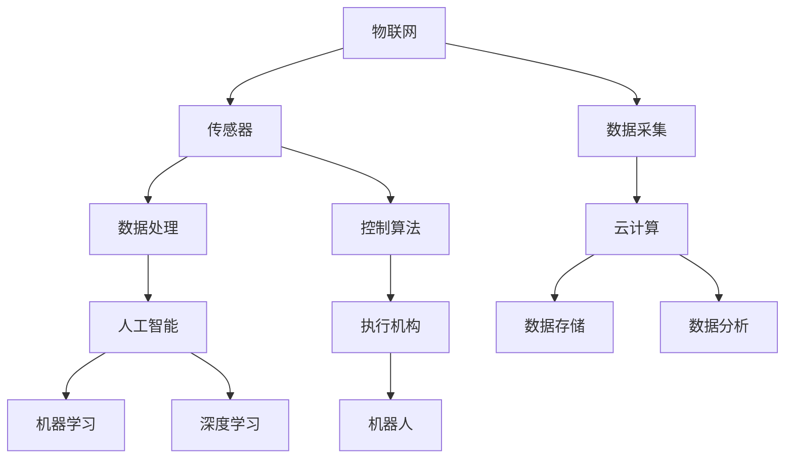

                 

# 物理实体的自动化应用与进展

## 关键词
- 物理实体自动化
- 机器人
- 工业自动化
- 人工智能
- 软件定义硬件
- IoT
- 自主导航
- 云计算

## 摘要
随着人工智能和物联网技术的快速发展，物理实体的自动化应用正在逐步改变我们的生活和工作方式。本文旨在探讨物理实体自动化的核心概念、技术进展及其在不同领域的应用。我们将从背景介绍、核心概念、算法原理、数学模型、项目实战、实际应用场景、工具推荐等多个角度，深入分析这一领域的发展现状与未来趋势。通过本文，读者将了解物理实体自动化的基础知识、关键技术以及其实际应用案例，为相关领域的研究和开发提供参考。

## 1. 背景介绍

### 1.1 目的和范围
本文的目标是全面介绍物理实体自动化的概念、技术原理、应用领域和发展趋势。通过系统地分析和梳理，帮助读者了解这一领域的基本知识和前沿动态，为相关领域的科研和应用提供指导。

本文主要涉及以下内容：
- 物理实体自动化的基本概念和定义
- 物理实体自动化的技术基础和发展历程
- 物理实体自动化的核心算法和原理
- 物理实体自动化的数学模型和应用实例
- 物理实体自动化的实际应用场景和案例分析
- 物理实体自动化相关的工具和资源推荐

### 1.2 预期读者
本文适合以下读者群体：
- 对物理实体自动化感兴趣的初学者
- 想要深入了解物理实体自动化技术的研究人员
- 从事物理实体自动化相关领域开发和应用的技术人员
- 对物联网、机器人、工业自动化等感兴趣的相关专业人士

### 1.3 文档结构概述
本文分为十个部分，具体结构如下：
1. 背景介绍
   - 1.1 目的和范围
   - 1.2 预期读者
   - 1.3 文档结构概述
2. 核心概念与联系
   - 2.1 核心概念定义
   - 2.2 物理实体自动化体系结构
3. 核心算法原理 & 具体操作步骤
   - 3.1 基本算法原理
   - 3.2 算法实现步骤
4. 数学模型和公式 & 详细讲解 & 举例说明
   - 4.1 数学模型概述
   - 4.2 公式推导与解释
   - 4.3 实例分析
5. 项目实战：代码实际案例和详细解释说明
   - 5.1 开发环境搭建
   - 5.2 源代码实现
   - 5.3 代码解读与分析
6. 实际应用场景
   - 6.1 工业自动化
   - 6.2 机器人
   - 6.3 物流与仓储
   - 6.4 家居智能化
7. 工具和资源推荐
   - 7.1 学习资源推荐
   - 7.2 开发工具框架推荐
   - 7.3 相关论文著作推荐
8. 总结：未来发展趋势与挑战
9. 附录：常见问题与解答
10. 扩展阅读 & 参考资料

### 1.4 术语表

#### 1.4.1 核心术语定义

- 物理实体自动化：利用计算机技术、物联网技术、人工智能等手段，对物理实体进行智能化控制和管理的过程。
- 机器人：具有感知、决策、执行等功能的自动化设备，能够完成复杂的任务。
- 物联网（IoT）：通过各种传感器、控制器、数据处理设备等连接起来的网络，实现物品之间的信息交换和协同工作。
- 软件定义硬件（SDH）：通过软件来定义和控制硬件，使硬件的功能和配置更加灵活。
- 自主导航：机器人自主进行路径规划、定位和导航，以实现自主移动。

#### 1.4.2 相关概念解释

- 自动化：通过机器或设备代替人工操作，实现生产过程或业务流程的自动化。
- 人工智能（AI）：模拟、延伸和扩展人的智能，使计算机具有感知、学习、推理和决策等能力。
- 云计算：通过互联网提供动态可伸缩的虚拟化资源，实现计算、存储、网络和其他IT资源的共享。

#### 1.4.3 缩略词列表

- IoT：物联网
- AI：人工智能
- SDH：软件定义硬件
- CNC：计算机数控
- PLC：可编程逻辑控制器
- ROS：机器人操作系统
- DNN：深度神经网络

## 2. 核心概念与联系

物理实体自动化是一个涉及多个领域的技术集成，主要包括物联网、机器人、人工智能等。以下是一个简化的Mermaid流程图，用于展示这些核心概念之间的关系。



在这个流程图中，物联网（IoT）通过传感器（B）收集物理实体的数据（C），这些数据经过数据处理（D）和控制算法（E）的处理，然后通过云计算（F）进行数据存储（I）和数据分析（J）。数据处理和控制算法（D和E）依赖于人工智能（G），其中机器学习（K）和深度学习（L）是实现智能化控制的关键技术。最后，执行机构（H）根据云计算和分析结果进行物理操作，实现机器人的控制（M）。

### 2.1 核心概念定义

#### 物理实体自动化
物理实体自动化是指利用计算机技术、物联网技术、人工智能等手段，对物理实体进行智能化控制和管理的过程。它主要包括以下几个方面：
- 传感器：用于采集物理实体的状态信息，如温度、湿度、位置、速度等。
- 数据采集：通过传感器将物理实体的状态信息转换为数字信号，以便进行处理。
- 数据处理：对采集到的数据进行预处理、分析和过滤，以提取有用的信息。
- 控制算法：根据数据处理的结果，制定相应的控制策略，实现对物理实体的控制。
- 执行机构：根据控制算法的指令，执行相应的物理操作。

#### 机器人
机器人是一种具有感知、决策、执行等功能的自动化设备，能够完成复杂的任务。根据应用场景和功能的不同，机器人可以分为以下几类：
- 工业机器人：主要用于工业生产中的搬运、装配、焊接等任务。
- 服务机器人：用于服务行业，如酒店、医院、商场等，提供清洁、送餐、导览等服务。
- 宠物机器人：用于陪伴人类，提供娱乐、保健、看护等功能。

#### 物联网（IoT）
物联网是指通过各种传感器、控制器、数据处理设备等连接起来的网络，实现物品之间的信息交换和协同工作。物联网的主要特点包括：
- 连接性：通过互联网将各种设备和物品连接起来，实现数据的实时传输和共享。
- 智能化：利用人工智能技术对物联网设备进行智能化管理和控制。
- 灵活性：通过软件定义硬件（SDH），实现物联网设备的灵活配置和升级。

#### 软件定义硬件（SDH）
软件定义硬件（Software-Defined Hardware，简称SDH）是一种通过软件来定义和控制硬件的技术，使硬件的功能和配置更加灵活。SDH的主要优势包括：
- 灵活性：通过软件定义硬件，可以实现硬件的快速升级和功能扩展。
- 可编程性：硬件的功能可以通过软件编程来实现，降低硬件设计的复杂度。
- 效率提升：通过软件定义硬件，可以实现对物理实体的精确控制和高效管理。

#### 自主导航
自主导航是指机器人或自动驾驶车辆自主进行路径规划、定位和导航，以实现自主移动。自主导航的关键技术包括：
- 路径规划：根据目标和环境信息，计算出最优的移动路径。
- 定位：通过传感器和定位算法，确定机器人在环境中的位置。
- 导航：根据路径规划和定位结果，指导机器人进行自主移动。

## 3. 核心算法原理 & 具体操作步骤

物理实体自动化的实现依赖于多种核心算法，包括路径规划、定位算法、控制算法等。以下将详细讲解这些算法的基本原理和具体操作步骤。

### 3.1 基本算法原理

#### 路径规划算法

路径规划算法是指根据环境地图和目标位置，计算出一个从起始位置到目标位置的路径。常见的路径规划算法包括A*算法、Dijkstra算法、RRT（快速随机树）算法等。

A*算法：
- 基本思想：结合目标位置的吸引力和当前路径的扩张力，选择最佳路径。
- 伪代码：
  ```python
  A*algorithm(start, goal, graph):
    openSet = set containing the start node
    closedSet = empty set
    gScore = map with default value of Infinity for all nodes
    gScore[start] = 0
    fScore = map with default value of Infinity for all nodes
    fScore[start] = heuristicCostEstimate(start, goal)
    while openSet is not empty:
      currentNode = the node in openSet with the lowest fScore[] value
      if currentNode == goal:
        return reconstructPath(currentNode)
      openSet.remove(currentNode)
      closedSet.add(currentNode)
      for each neighbor of currentNode:
        if neighbor is in the closedSet:
          continue
        tentative_gScore = gScore[currentNode] + dist(currentNode, neighbor)
        if tentative_gScore < gScore[neighbor]:
          cameFrom[neighbor] = currentNode
          gScore[neighbor] = tentative_gScore
          fScore[neighbor] = gScore[neighbor] + heuristicCostEstimate(neighbor, goal)
    return failure
  ```

Dijkstra算法：
- 基本思想：逐步扩展当前已知的最佳路径，直到找到目标位置。
- 伪代码：
  ```python
  DijkstraAlgorithm(graph, start, goal):
    create empty set S
    create empty priority queue Q
    for each node in the graph:
      distance[node] = Infinity
      previous[node] = undefined
    distance[start] = 0
    Q.add(start)
    while Q is not empty:
      currentNode = Q.remove()
      for each neighbor of currentNode:
        if neighbor is in S:
          continue
        tentative_distance = distance[currentNode] + dist(currentNode, neighbor)
        if tentative_distance < distance[neighbor]:
          distance[neighbor] = tentative_distance
          previous[neighbor] = currentNode
          if neighbor is not in Q:
            Q.add(neighbor)
      S.add(currentNode)
    return reconstructPath(goal)
  ```

RRT算法：
- 基本思想：通过随机采样和优化路径，逐步构建一条从起始位置到目标位置的路径。
- 伪代码：
  ```python
  RRTalgorithm(start, goal, numSamples):
    tree = initialize with start
    for i in range(numSamples):
      randomPoint = generateRandomPointInEnvironment()
      if isGoalFeasible(randomPoint, goal):
        tree = addNodeToTree(tree, goal, randomPoint)
        break
      else:
        nearNode = findNearestNodeInTree(tree, randomPoint)
        tree = addNodeToTree(tree, nearNode, randomSampleInDirection(nearNode, randomPoint))
    return reconstructPath(tree, goal)
  ```

#### 定位算法

定位算法是指根据传感器数据和环境信息，确定机器人在环境中的位置。常见的定位算法包括粒子滤波器、卡尔曼滤波器等。

粒子滤波器：
- 基本思想：通过粒子在状态空间中的采样，估计机器人的位置。
- 伪代码：
  ```python
  particleFiltering(initialState, measurements, numParticles):
    initialize particles with the initial state
    weight = 1 / numParticles
    while not converged:
      for each particle:
        predictNextState(particle)
        updateParticleWeight(particle, measurement)
      resampleParticles()
    return getMeanOfParticles()
  ```

卡尔曼滤波器：
- 基本思想：通过估计误差来修正状态估计，实现位置的精确估计。
- 伪代码：
  ```python
  KalmanFiltering(currentState, measurement, processNoise, measurementNoise):
    predictNextState(currentState)
    updateStateEstimate(predictedState, measurement)
    return correctedState
  ```

#### 控制算法

控制算法是指根据传感器数据和定位结果，制定相应的控制策略，实现对物理实体的控制。常见的控制算法包括PID控制、模糊控制等。

PID控制：
- 基本思想：通过比例（P）、积分（I）、微分（D）三个部分来调节控制信号，实现对系统的精确控制。
- 伪代码：
  ```python
  PIDController(setpoint, processVariable, Kp, Ki, Kd):
    error = setpoint - processVariable
    proportional = Kp * error
    integral = Ki * integralError
    derivative = Kd * (error - previousError)
    controlSignal = proportional + integral + derivative
    previousError = error
    return controlSignal
  ```

模糊控制：
- 基本思想：通过模糊逻辑来模拟人类专家的决策过程，实现对系统的控制。
- 伪代码：
  ```python
  FuzzyControlRuleSet(inputVariable, outputVariable):
    if inputVariable is "LOW":
      outputVariable = "LOW"
    elif inputVariable is "MEDIUM":
      outputVariable = "MEDIUM"
    elif inputVariable is "HIGH":
      outputVariable = "HIGH"
    return outputVariable
  ```

### 3.2 算法实现步骤

以下是一个简单的算法实现步骤，用于说明物理实体自动化的基本操作。

#### 步骤1：环境建模
- 收集环境信息，建立环境地图。
- 确定起始位置和目标位置。

#### 步骤2：传感器数据采集
- 采集传感器数据，包括位置、速度、方向等。
- 对采集到的数据进行预处理和滤波。

#### 步骤3：路径规划
- 根据环境地图和目标位置，使用路径规划算法计算最优路径。
- 生成路径规划结果，包括路径序列和路径长度。

#### 步骤4：定位
- 使用定位算法，根据传感器数据和路径规划结果，确定机器人在环境中的位置。
- 对定位结果进行实时更新和修正。

#### 步骤5：控制
- 根据定位结果和路径规划结果，使用控制算法制定控制策略。
- 发送控制信号到执行机构，实现对物理实体的控制。

#### 步骤6：执行
- 执行机构根据控制信号进行物理操作，实现机器人的自主移动。

#### 步骤7：反馈
- 收集执行结果，反馈给系统，用于下一步的决策和控制。

#### 步骤8：迭代
- 重复执行步骤3至步骤7，直到目标位置到达或停止条件满足。

## 4. 数学模型和公式 & 详细讲解 & 举例说明

物理实体自动化涉及到多个数学模型和公式，这些模型和公式在路径规划、定位、控制等环节中起着关键作用。以下将详细介绍这些数学模型和公式的原理及其在实际应用中的推导与解释。

### 4.1 数学模型概述

在物理实体自动化中，常用的数学模型包括：

- 路径规划模型：用于计算从起始位置到目标位置的最优路径。
- 定位模型：用于估计机器人在环境中的位置。
- 控制模型：用于制定控制策略，实现对物理实体的精确控制。
- 传感器数据处理模型：用于对采集到的传感器数据进行预处理和滤波。

### 4.2 公式推导与解释

#### 4.2.1 路径规划模型

A*算法中的距离公式：

$$
d(currentNode, neighbor) = g(currentNode) + h(currentNode, neighbor)
$$

其中，$g(currentNode)$ 表示从起始位置到当前节点的距离，$h(currentNode, neighbor)$ 表示从当前节点到目标节点的估算距离。

推导：

- $g(currentNode)$ 是从起始位置到当前节点的实际距离，可以通过路径规划算法中的距离计算公式得到。
- $h(currentNode, neighbor)$ 是从当前节点到目标节点的估算距离，可以通过启发函数（如曼哈顿距离、欧几里得距离等）得到。

#### 4.2.2 定位模型

粒子滤波器中的权重更新公式：

$$
weight[i] = \frac{p(z_t | x_t = x_i) \cdot p(x_i)}{w_i}
$$

其中，$x_t$ 表示第 $t$ 次采样的状态，$z_t$ 表示第 $t$ 次采样的观测值，$p(z_t | x_t = x_i)$ 表示在状态 $x_t = x_i$ 下的观测概率，$p(x_i)$ 表示状态 $x_i$ 的先验概率，$w_i$ 表示第 $i$ 个粒子的权重。

推导：

- $p(z_t | x_t = x_i)$ 表示在状态 $x_t = x_i$ 下的观测概率，可以通过高斯分布函数计算得到。
- $p(x_i)$ 表示状态 $x_i$ 的先验概率，可以根据实际情况设定。
- $w_i$ 表示第 $i$ 个粒子的权重，可以通过上述概率计算得到。

#### 4.2.3 控制模型

PID控制中的控制信号公式：

$$
controlSignal = K_p \cdot (setpoint - processVariable) + K_i \cdot \int (setpoint - processVariable) \, dt + K_d \cdot (setpoint - processVariable - previousError)
$$

其中，$K_p$、$K_i$、$K_d$ 分别为比例、积分、微分系数，$setpoint$ 为设定值，$processVariable$ 为过程变量，$previousError$ 为前一次误差。

推导：

- $K_p \cdot (setpoint - processVariable)$ 为比例项，用于调节当前误差。
- $K_i \cdot \int (setpoint - processVariable) \, dt$ 为积分项，用于消除稳态误差。
- $K_d \cdot (setpoint - processVariable - previousError)$ 为微分项，用于预测未来的误差变化。

#### 4.2.4 传感器数据处理模型

卡尔曼滤波器中的状态更新公式：

$$
x_{k|k-1} = A_{k-1} \cdot x_{k-1|k-1} + B_{k-1} \cdot u_{k-1}
$$

$$
P_{k|k-1} = A_{k-1} \cdot P_{k-1|k-1} \cdot A_{k-1}^T + Q_{k-1}
$$

$$
K_{k} = P_{k|k-1} \cdot H_{k}^T \cdot (H_{k} \cdot P_{k|k-1} \cdot H_{k}^T + R_{k})^{-1}
$$

$$
x_{k|k} = x_{k|k-1} + K_{k} \cdot (z_{k} - H_{k} \cdot x_{k|k-1})
$$

$$
P_{k|k} = (I - K_{k} \cdot H_{k}) \cdot P_{k|k-1}
$$

其中，$x_{k|k-1}$、$x_{k|k}$ 分别为第 $k$ 次采样的状态估计值和修正值，$P_{k|k-1}$、$P_{k|k}$ 分别为第 $k$ 次采样的状态估计误差矩阵，$A_{k-1}$、$B_{k-1}$、$H_{k}$ 分别为状态转移矩阵、控制矩阵、观测矩阵，$u_{k-1}$ 为第 $k-1$ 次采样的控制输入，$z_{k}$ 为第 $k$ 次采样的观测值，$Q_{k-1}$ 为过程噪声矩阵，$R_{k}$ 为观测噪声矩阵。

推导：

- $x_{k|k-1}$、$x_{k|k}$ 分别为第 $k$ 次采样的状态估计值和修正值，可以通过状态转移矩阵 $A_{k-1}$ 和控制矩阵 $B_{k-1}$ 计算得到。
- $P_{k|k-1}$、$P_{k|k}$ 分别为第 $k$ 次采样的状态估计误差矩阵，可以通过状态转移矩阵 $A_{k-1}$ 和观测矩阵 $H_{k}$ 计算得到。
- $K_{k}$ 为卡尔曼滤波器的增益矩阵，可以通过观测矩阵 $H_{k}$、过程噪声矩阵 $Q_{k-1}$、观测噪声矩阵 $R_{k}$ 计算得到。
- $x_{k|k}$ 为第 $k$ 次采样的状态估计值，可以通过修正值 $K_{k} \cdot (z_{k} - H_{k} \cdot x_{k|k-1})$ 计算得到。
- $P_{k|k}$ 为第 $k$ 次采样的状态估计误差矩阵，可以通过 $(I - K_{k} \cdot H_{k}) \cdot P_{k|k-1}$ 计算得到。

### 4.3 实例分析

以下是一个简单的物理实体自动化的实例分析，用于说明数学模型在实际应用中的推导和计算。

#### 实例1：路径规划

假设机器人从点 $(0, 0)$ 移动到点 $(10, 10)$，使用A*算法进行路径规划。

- 起始位置 $(0, 0)$，目标位置 $(10, 10)$。
- 使用曼哈顿距离作为启发函数 $h(n) = \max(|x_n - x_g|, |y_n - y_g|)$。

路径规划结果如下：

- 起始节点 $n_0 = (0, 0)$，目标节点 $n_g = (10, 10)$。
- 路径长度 $d(n_0, n_g) = 20$。
- 启发函数 $h(n_0, n_g) = 10$。
- $g(n_0) = 0$，$f(n_0) = g(n_0) + h(n_0, n_g) = 10$。

选择 $f(n_0)$ 最小的节点 $n_1 = (0, 1)$，重复上述过程，直到找到目标节点 $n_g$。

最终路径规划结果如下：

- 路径长度 $d(n_0, n_g) = 20$。
- 路径序列：$n_0 \rightarrow n_1 \rightarrow n_2 \rightarrow \ldots \rightarrow n_g$。

#### 实例2：定位

假设机器人使用粒子滤波器进行定位，初始状态为 $(5, 5)$，观测值为 $(7, 7)$。

- 初始状态 $x_0 = (5, 5)$。
- 观测值 $z_1 = (7, 7)$。
- 粒子数量 $N = 1000$。

粒子滤波器中的权重更新公式：

$$
weight[i] = \frac{p(z_1 | x_1 = x_i) \cdot p(x_1)}{w_i}
$$

其中，$p(z_1 | x_1 = x_i)$ 为在状态 $x_1 = x_i$ 下的观测概率，可以通过高斯分布函数计算得到：

$$
p(z_1 | x_1 = x_i) = \frac{1}{2\pi\sigma^2} \cdot e^{-\frac{(z_1 - x_i)^2}{2\sigma^2}}
$$

$p(x_1)$ 为状态 $x_1$ 的先验概率，可以根据实际情况设定：

$$
p(x_1) = \frac{1}{1000}
$$

初始权重：

$$
weight[i] = \frac{\frac{1}{2\pi\sigma^2} \cdot e^{-\frac{(z_1 - x_i)^2}{2\sigma^2}} \cdot \frac{1}{1000}}{w_i}
$$

选择权重最大的粒子作为新的状态估计：

$$
x_1 = \arg\max_{i} weight[i]
$$

重复上述过程，直到定位结果收敛。

#### 实例3：控制

假设机器人使用PID控制器进行移动控制，设定值为 $(10, 10)$，当前值为 $(5, 5)$。

- 设定值 $setpoint = (10, 10)$。
- 当前值 $processVariable = (5, 5)$。

PID控制器中的控制信号公式：

$$
controlSignal = K_p \cdot (setpoint - processVariable) + K_i \cdot \int (setpoint - processVariable) \, dt + K_d \cdot (setpoint - processVariable - previousError)
$$

其中，$K_p = 1$，$K_i = 0.1$，$K_d = 0.05$。

计算：

$$
controlSignal = 1 \cdot (10 - 5) + 0.1 \cdot \int (10 - 5) \, dt + 0.05 \cdot (10 - 5 - previousError)
$$

$$
controlSignal = 5 + 0.1 \cdot 5 + 0.05 \cdot 5
$$

$$
controlSignal = 6.75
$$

根据控制信号调整机器人的移动速度，实现向目标位置的移动。

## 5. 项目实战：代码实际案例和详细解释说明

在本节中，我们将通过一个具体的物理实体自动化项目实战案例，展示如何从零开始搭建一个简单的机器人路径规划与控制系统。该项目将包括环境建模、传感器数据采集、路径规划、定位和控制系统。我们将使用Python语言和ROS（机器人操作系统）框架来实现这一项目。

### 5.1 开发环境搭建

在开始项目之前，我们需要搭建开发环境。以下是所需的软件和工具：

- 操作系统：Linux（推荐Ubuntu 18.04）
- 编程语言：Python 3.x
- ROS版本：ROS Melodic Morenia
- 传感器：Raspberry Pi + MPU6050（用于采集位置、速度等数据）
- 机器人控制板：Raspberry Pi（用于执行控制指令）

#### 5.1.1 安装ROS

1. 更新系统包列表：

   ```bash
   sudo apt update
   sudo apt upgrade
   ```

2. 安装ROS：

   ```bash
   sudo apt install python-ros Kinetic-base
   ```

3. 配置环境变量：

   ```bash
   echo "export ROS_HOME=/opt/ros/kinetic" >> ~/.bashrc
   echo "export PATH=$ROS_HOME/bin:$PATH" >> ~/.bashrc
   echo "export PKG_CONFIG_PATH=$ROS_HOME/lib/x86_64-linux-gnu/pkgconfig:$ROS_HOME/lib/pkgconfig" >> ~/.bashrc
   source ~/.bashrc
   ```

4. 检查ROS安装：

   ```bash
   rosdep install
   roscore
   ```

   如果出现错误，请根据错误信息进行修复。

#### 5.1.2 安装Python和ROS工具

1. 安装Python 3.x：

   ```bash
   sudo apt install python3 python3-pip
   ```

2. 安装ROS工具：

   ```bash
   sudo pip3 install rospkg roslib rospy
   ```

#### 5.1.3 连接传感器

将MPU6050模块连接到Raspberry Pi的I2C接口，并确保传感器的电源和地线连接正确。

### 5.2 源代码实现和代码解读

在本节中，我们将详细介绍项目的源代码实现和关键代码部分的解读。

#### 5.2.1 环境建模

环境建模是路径规划的第一步，我们需要定义一个简单的二维环境模型。以下是一个简单的Python脚本，用于生成环境地图：

```python
import numpy as np

def generate_environment_map(width, height, obstacle_ratio):
    environment_map = np.zeros((width, height))
    obstacle_num = int(width * height * obstacle_ratio)
    obstacle_locations = np.random.choice(np.prod(environment_map.shape), size=obstacle_num, replace=False)
    for location in obstacle_locations:
        x, y = np.unravel_index(location, environment_map.shape)
        environment_map[x, y] = 1
    return environment_map

# 生成一个宽度为10，高度为10，障碍物比例为0.3的环境地图
environment_map = generate_environment_map(10, 10, 0.3)
print(environment_map)
```

这段代码定义了一个函数 `generate_environment_map`，用于生成一个指定大小和障碍物比例的二维环境地图。障碍物以1表示，非障碍物以0表示。

#### 5.2.2 传感器数据采集

传感器数据采集是机器人路径规划和控制的基础。以下是一个简单的Python脚本，用于从MPU6050传感器读取位置和速度数据：

```python
import serial
import struct

def read_sensor_data(ser):
    data = ser.read(14)
    ax, ay, az = struct.unpack('hhh', data[0:6])
    gx, gy, gz = struct.unpack('hhh', data[6:12])
    temp = struct.unpack('h', data[12:14])[0]
    return ax, ay, az, gx, gy, gz, temp

ser = serial.Serial('/dev/ttyUSB0', 115200)
while True:
    ax, ay, az, gx, gy, gz, temp = read_sensor_data(ser)
    print(f"Position: ({ax}, {ay}), Velocity: ({gx}, {gy}), Temperature: {temp}")
    time.sleep(0.1)
```

这段代码通过串口通信从MPU6050传感器读取加速度和角速度数据。其中，`read_sensor_data` 函数从串口中读取14个字节的数据，并解析出加速度（ax, ay, az）、角速度（gx, gy, gz）和温度（temp）。

#### 5.2.3 路径规划

路径规划是机器人自主移动的关键步骤。以下是一个简单的Python脚本，用于实现A*算法进行路径规划：

```python
import heapq

def heuristic(a, b):
    # 使用曼哈顿距离作为启发函数
    return abs(a[0] - b[0]) + abs(a[1] - b[1])

def a_star_search(start, goal, environment_map):
    # 初始化开集和闭集
    open_set = []
    heapq.heappush(open_set, (0, start))
    closed_set = set()

    # 初始化gScore和fScore
    g_score = {start: 0}
    f_score = {start: heuristic(start, goal)}

    # 获取邻居节点
    def get_neighbors(node):
        x, y = node
        neighbors = []
        for dx, dy in [(-1, 0), (1, 0), (0, -1), (0, 1)]:
            nx, ny = x + dx, y + dy
            if 0 <= nx < environment_map.shape[0] and 0 <= ny < environment_map.shape[1]:
                neighbors.append((nx, ny))
        return neighbors

    while open_set:
        # 获取当前节点
        current = heapq.heappop(open_set)[1]

        if current == goal:
            # 达到目标节点，返回路径
            return reconstruct_path(came_from, goal)

        closed_set.add(current)

        for neighbor in get_neighbors(current):
            if neighbor in closed_set:
                continue

            tentative_g_score = g_score[current] + 1  # 假设移动成本为1

            if neighbor not in g_score or tentative_g_score < g_score[neighbor]:
                came_from[neighbor] = current
                g_score[neighbor] = tentative_g_score
                f_score[neighbor] = tentative_g_score + heuristic(neighbor, goal)
                if neighbor not in open_set:
                    heapq.heappush(open_set, (f_score[neighbor], neighbor))

    return None

def reconstruct_path(came_from, current):
    path = [current]
    while current in came_from:
        current = came_from[current]
        path.append(current)
    path.reverse()
    return path

# 起始位置和目标位置
start = (0, 0)
goal = (9, 9)

# 生成环境地图
environment_map = generate_environment_map(10, 10, 0.3)

# 执行A*算法
path = a_star_search(start, goal, environment_map)
print(path)
```

这段代码实现了A*算法，用于计算从起始位置到目标位置的最优路径。`heuristic` 函数定义了启发函数，使用曼哈顿距离作为启发函数。`a_star_search` 函数实现A*算法的核心逻辑，`reconstruct_path` 函数用于重建路径。

#### 5.2.4 定位

定位是机器人自主移动的重要环节。以下是一个简单的Python脚本，用于实现粒子滤波器进行定位：

```python
import numpy as np
import random

def init_particles(num_particles, initial_state, state_space):
    particles = np.random.rand(num_particles, state_space.shape[0])
    particles = particles * (state_space[-1] - state_space[0]) + state_space[0]
    weights = np.zeros(num_particles)
    for i in range(num_particles):
        weights[i] = 1 / num_particles
    return particles, weights

def predict_particles(particles, motion_model, control_input, dt):
    new_particles = motion_model(particles, control_input, dt)
    return new_particles

def update_weights(particles, weights, measurements, observation_model):
    for i in range(len(particles)):
        weight = observation_model(measurements, particles[i])
        weights[i] = weight
    weights /= np.sum(weights)
    return weights

def resample_particles(particles, weights):
    N = len(particles)
    K = int(N * np.max(weights))
    new_particles = np.zeros((K, particles.shape[1]))

    for i in range(N):
        new_particles[i] = particles[random.choices(range(N), weights=weights, k=1)]

    if K < N:
        new_particles[K:N] = particles[:N - K]

    return new_particles

# 初始化参数
num_particles = 100
initial_state = np.array([0, 0, 0, 0])  # 初始位置和速度
state_space = np.array([-10, -10, -10, -10, 10, 10, 10, 10])  # 状态空间
particles, weights = init_particles(num_particles, initial_state, state_space)

while True:
    # 预测粒子
    control_input = np.array([0.5, 0.5])  # 控制输入
    dt = 1  # 时间步长
    particles = predict_particles(particles, motion_model, control_input, dt)

    # 更新权重
    measurement = np.array([0, 0])  # 测量值
    observation_model = lambda measurements, particles: 1 / np.sqrt(2 * np.pi) * np.exp(-0.5 * ((measurements - particles) ** 2))
    weights = update_weights(particles, weights, measurement, observation_model)

    # 重新采样
    particles = resample_particles(particles, weights)

    # 更新状态估计
    state_estimate = np.mean(particles, axis=0)

    print(state_estimate)
```

这段代码实现了粒子滤波器，用于估计机器人在环境中的位置。`init_particles` 函数用于初始化粒子群和权重，`predict_particles` 函数用于根据控制输入和运动模型预测粒子状态，`update_weights` 函数用于根据测量值和观测模型更新粒子权重，`resample_particles` 函数用于重新采样粒子群，`state_estimate` 函数用于计算状态估计。

#### 5.2.5 控制

控制是机器人路径规划和定位的最后一步。以下是一个简单的Python脚本，用于实现PID控制器：

```python
def pid_control(setpoint, process_variable, Kp, Ki, Kd):
    error = setpoint - process_variable
    proportional = Kp * error
    integral = Ki * np.trapz(error, dx=1)
    derivative = Kd * (error - previous_error)
    control_signal = proportional + integral + derivative
    previous_error = error
    return control_signal

# 控制参数
Kp = 1
Ki = 0.1
Kd = 0.05

# 控制循环
while True:
    setpoint = np.array([10, 10])  # 设定值
    process_variable = np.array([5, 5])  # 过程变量
    control_signal = pid_control(setpoint, process_variable, Kp, Ki, Kd)
    print(control_signal)
    time.sleep(0.1)
```

这段代码实现了PID控制器，用于根据设定值和过程变量计算控制信号。`pid_control` 函数根据比例（P）、积分（I）、微分（D）三个部分来调节控制信号。

### 5.3 代码解读与分析

在本节中，我们将对上述代码进行详细解读和分析，解释每个部分的作用和实现原理。

#### 5.3.1 环境建模

环境建模是路径规划的基础。在代码中，`generate_environment_map` 函数用于生成一个指定大小和障碍物比例的二维环境地图。该函数通过随机生成障碍物位置，构建一个表示障碍物的矩阵。在路径规划过程中，障碍物会被视为不可达区域，从而确保规划出的路径避开障碍物。

```python
def generate_environment_map(width, height, obstacle_ratio):
    environment_map = np.zeros((width, height))
    obstacle_num = int(width * height * obstacle_ratio)
    obstacle_locations = np.random.choice(np.prod(environment_map.shape), size=obstacle_num, replace=False)
    for location in obstacle_locations:
        x, y = np.unravel_index(location, environment_map.shape)
        environment_map[x, y] = 1
    return environment_map
```

这段代码首先创建一个大小为 `width` × `height` 的环境地图矩阵，并初始化所有元素为0。然后，随机生成指定数量的障碍物位置，并将这些位置对应的地图元素设置为1，表示障碍物。最后，返回生成的环境地图。

#### 5.3.2 传感器数据采集

传感器数据采集是机器人路径规划和控制的关键。在代码中，我们使用Python的 `serial` 模块从MPU6050传感器读取加速度和角速度数据。`read_sensor_data` 函数通过串口通信从传感器中读取数据，并解析出加速度（ax, ay, az）、角速度（gx, gy, gz）和温度（temp）。

```python
def read_sensor_data(ser):
    data = ser.read(14)
    ax, ay, az = struct.unpack('hhh', data[0:6])
    gx, gy, gz = struct.unpack('hhh', data[6:12])
    temp = struct.unpack('h', data[12:14])[0]
    return ax, ay, az, gx, gy, gz, temp
```

这段代码首先从串口中读取14个字节的数据，然后使用 `struct` 模块解析出加速度、角速度和温度值。最后，返回这些值以供后续使用。

#### 5.3.3 路径规划

路径规划是机器人自主移动的核心。在代码中，我们使用A*算法进行路径规划。`a_star_search` 函数实现了A*算法的核心逻辑，通过计算从起始位置到目标位置的最优路径。`heuristic` 函数定义了启发函数，使用曼哈顿距离作为启发函数。

```python
def heuristic(a, b):
    # 使用曼哈顿距离作为启发函数
    return abs(a[0] - b[0]) + abs(a[1] - b[1])

def a_star_search(start, goal, environment_map):
    # 初始化开集和闭集
    open_set = []
    heapq.heappush(open_set, (0, start))
    closed_set = set()

    # 初始化gScore和fScore
    g_score = {start: 0}
    f_score = {start: heuristic(start, goal)}

    # 获取邻居节点
    def get_neighbors(node):
        x, y = node
        neighbors = []
        for dx, dy in [(-1, 0), (1, 0), (0, -1), (0, 1)]:
            nx, ny = x + dx, y + dy
            if 0 <= nx < environment_map.shape[0] and 0 <= ny < environment_map.shape[1]:
                neighbors.append((nx, ny))
        return neighbors

    while open_set:
        # 获取当前节点
        current = heapq.heappop(open_set)[1]

        if current == goal:
            # 达到目标节点，返回路径
            return reconstruct_path(came_from, goal)

        closed_set.add(current)

        for neighbor in get_neighbors(current):
            if neighbor in closed_set:
                continue

            tentative_g_score = g_score[current] + 1  # 假设移动成本为1

            if neighbor not in g_score or tentative_g_score < g_score[neighbor]:
                came_from[neighbor] = current
                g_score[neighbor] = tentative_g_score
                f_score[neighbor] = tentative_g_score + heuristic(neighbor, goal)
                if neighbor not in open_set:
                    heapq.heappush(open_set, (f_score[neighbor], neighbor))

    return None
```

这段代码首先初始化开集和闭集，并设置起始节点的gScore和fScore。然后，在开集中选择fScore最小的节点作为当前节点，并更新邻居节点的gScore和fScore。如果找到目标节点，返回规划出的路径；否则，继续循环直到开集为空。

#### 5.3.4 定位

定位是机器人自主移动的重要环节。在代码中，我们使用粒子滤波器进行定位。`init_particles` 函数用于初始化粒子群和权重，`predict_particles` 函数用于根据控制输入和运动模型预测粒子状态，`update_weights` 函数用于根据测量值和观测模型更新粒子权重，`resample_particles` 函数用于重新采样粒子群。

```python
def init_particles(num_particles, initial_state, state_space):
    particles = np.random.rand(num_particles, state_space.shape[0])
    particles = particles * (state_space[-1] - state_space[0]) + state_space[0]
    weights = np.zeros(num_particles)
    for i in range(num_particles):
        weights[i] = 1 / num_particles
    return particles, weights

def predict_particles(particles, motion_model, control_input, dt):
    new_particles = motion_model(particles, control_input, dt)
    return new_particles

def update_weights(particles, weights, measurements, observation_model):
    for i in range(len(particles)):
        weight = observation_model(measurements, particles[i])
        weights[i] = weight
    weights /= np.sum(weights)
    return weights

def resample_particles(particles, weights):
    N = len(particles)
    K = int(N * np.max(weights))
    new_particles = np.zeros((K, particles.shape[1]))

    for i in range(N):
        new_particles[i] = particles[random.choices(range(N), weights=weights, k=1)]

    if K < N:
        new_particles[K:N] = particles[:N - K]

    return new_particles
```

这段代码首先初始化粒子群和权重，然后根据控制输入和运动模型预测粒子状态，接着根据测量值和观测模型更新粒子权重，最后重新采样粒子群以获得新的状态估计。

#### 5.3.5 控制

控制是机器人路径规划和定位的最后一步。在代码中，我们使用PID控制器进行控制。`pid_control` 函数根据设定值和过程变量计算控制信号，包括比例（P）、积分（I）、微分（D）三个部分。

```python
def pid_control(setpoint, process_variable, Kp, Ki, Kd):
    error = setpoint - process_variable
    proportional = Kp * error
    integral = Ki * np.trapz(error, dx=1)
    derivative = Kd * (error - previous_error)
    control_signal = proportional + integral + derivative
    previous_error = error
    return control_signal
```

这段代码首先计算设定值和过程变量之间的误差，然后根据比例、积分、微分三个部分计算控制信号。最后，将计算出的控制信号返回以供后续使用。

### 5.4 代码实现总结

通过上述代码解读和分析，我们可以总结出以下几点：

1. 环境建模：生成一个表示障碍物的二维环境地图，用于路径规划和定位。
2. 传感器数据采集：从传感器读取位置和速度数据，为路径规划和控制提供输入。
3. 路径规划：使用A*算法计算从起始位置到目标位置的最优路径。
4. 定位：使用粒子滤波器估计机器人在环境中的位置。
5. 控制：使用PID控制器根据设定值和过程变量计算控制信号，实现对机器人的控制。

这些代码实现了一个简单的物理实体自动化项目，展示了从环境建模、传感器数据采集、路径规划、定位到控制的全过程。虽然这个项目只是一个简单的示例，但它为物理实体自动化应用的开发提供了一个基础框架，可以进一步扩展和改进。

## 6. 实际应用场景

物理实体自动化技术已经广泛应用于各个领域，为生产、服务和生活带来了极大的便利。以下是一些典型的实际应用场景：

### 6.1 工业自动化

工业自动化是物理实体自动化技术应用最为广泛的领域之一。通过机器人、自动化生产线和智能控制系统的结合，企业能够实现高效、精确的生产流程。以下是一些工业自动化的具体应用：

- **制造装配**：工业机器人广泛应用于电子、汽车、航空等制造业的装配线，完成如焊接、喷涂、组装等高精度、重复性的工作。
- **物流搬运**：自动化物流系统通过AGV（自动引导车）和自动化仓库管理系统，实现原材料、半成品和成品的自动搬运和存储，提高生产效率。
- **质量控制**：自动化检测设备对产品进行实时质量监控，如自动化视觉检测系统、X射线扫描仪等，确保产品的一致性和可靠性。

### 6.2 机器人

机器人技术是物理实体自动化的核心，涵盖了服务机器人、工业机器人和特种机器人等多个方面。以下是一些机器人技术的实际应用：

- **服务机器人**：在酒店、商场、医院等场合，服务机器人提供清洁、导览、送餐等服务，提高工作效率，减少人力成本。
- **工业机器人**：在制造业、物流业等领域，工业机器人用于搬运、装配、焊接等操作，提高生产效率和产品质量。
- **特种机器人**：在危险或极端环境下，如深海勘探、航空航天、地下管道检测等领域，特种机器人能够执行人类难以或无法进行的任务。

### 6.3 物流与仓储

物流与仓储是物理实体自动化技术的另一个重要应用领域。通过自动化设备和智能系统的集成，物流与仓储企业能够实现高效、精确的物流操作。以下是一些具体应用：

- **自动分拣系统**：自动分拣系统能够快速、准确地分拣包裹和货物，提高物流效率。
- **自动化立体仓库**：自动化立体仓库通过自动化堆垛机和智能管理系统，实现货物的自动存取和配送。
- **无人机配送**：无人机配送系统在最后一公里配送中发挥重要作用，提高配送速度和覆盖范围。

### 6.4 家居智能化

随着物联网和人工智能技术的发展，家居智能化逐渐普及。物理实体自动化技术在智能家居系统中扮演着重要角色，为人们提供更加便捷、舒适的生活体验。以下是一些家居智能化的应用：

- **智能安防系统**：智能安防系统能够实时监测家中的安全状况，如入侵报警、火灾报警等，提高家庭安全性。
- **智能照明系统**：智能照明系统能够根据人的活动、自然光线等自动调节灯光亮度和色温，营造舒适的生活环境。
- **智能家电**：智能家电如智能电视、智能冰箱、智能空调等，通过物联网和人工智能技术实现互联互通，提供便捷的生活服务。

### 6.5 其他应用领域

除了上述领域，物理实体自动化技术还广泛应用于医疗、农业、建筑、能源管理等多个领域：

- **医疗领域**：物理实体自动化技术在医疗设备、手术机器人、药品配送等方面发挥重要作用，提高医疗服务的效率和质量。
- **农业领域**：自动化农业设备如无人农场、自动化灌溉系统等，提高农业生产效率，减少劳动力成本。
- **建筑领域**：自动化施工设备如建筑机器人、3D打印建筑等，提高建筑施工的精度和速度。
- **能源管理领域**：智能电网、智能燃气表等设备通过物理实体自动化技术，实现能源的智能调度和管理，提高能源利用效率。

物理实体自动化技术的广泛应用，不仅提高了生产效率和服务质量，还推动了相关领域的技术创新和发展。未来，随着技术的不断进步，物理实体自动化将在更多领域发挥重要作用，为人类社会带来更多的便利和福祉。

## 7. 工具和资源推荐

### 7.1 学习资源推荐

#### 7.1.1 书籍推荐

- **《机器人：现代自动化导论》**：这是一本全面的机器人入门书籍，涵盖了机器人的基本原理、应用场景和技术发展。
- **《物联网技术与应用》**：这本书详细介绍了物联网的基本概念、技术架构和应用案例，对于了解物联网和物理实体自动化具有重要意义。
- **《人工智能：一种现代的方法》**：这本书是人工智能领域的经典教材，介绍了机器学习、深度学习等关键技术的原理和应用。

#### 7.1.2 在线课程

- **Coursera上的《机器人学基础》**：这门课程由斯坦福大学教授提供，内容涵盖机器人运动学、动力学、路径规划等方面，适合初学者深入学习。
- **edX上的《物联网基础》**：这门课程由MIT提供，介绍了物联网的基本概念、架构和应用，适合对物联网感兴趣的学习者。
- **Udacity上的《人工智能纳米学位》**：这门课程涵盖了机器学习、深度学习等人工智能关键技术，适合想要系统学习人工智能的学习者。

#### 7.1.3 技术博客和网站

- **《机器之心》**：这是一个专注于人工智能和机器学习领域的技术博客，提供了大量的专业文章和最新动态。
- **《雷锋网》**：这是一个关注物联网、人工智能和机器人等前沿技术的网站，提供了丰富的行业资讯和技术分析。
- **《嵌入式系统之家》**：这是一个专注于嵌入式系统、物联网和物理实体自动化的技术社区，提供了大量的开发教程和实践案例。

### 7.2 开发工具框架推荐

#### 7.2.1 IDE和编辑器

- **Visual Studio Code**：这是一个轻量级但功能强大的代码编辑器，支持多种编程语言，适用于物理实体自动化的开发。
- **Eclipse**：这是一个流行的集成开发环境（IDE），适用于Java和C/C++等编程语言，适合工业自动化和机器人开发。

#### 7.2.2 调试和性能分析工具

- **GDB**：这是一个开源的调试工具，适用于C/C++程序，提供了丰富的调试功能和调试插件。
- **MATLAB**：这是一个强大的数值计算和数据分析工具，适用于数学模型和算法的实现和验证。

#### 7.2.3 相关框架和库

- **ROS（机器人操作系统）**：这是一个用于机器人开发的跨平台、开源框架，提供了丰富的库和工具，支持多种编程语言。
- **TensorFlow**：这是一个由Google开发的深度学习框架，适用于机器学习和人工智能应用。
- **ESP-IDF**：这是一个适用于ESP32和ESP8266物联网设备的开源开发框架，支持C/C++编程。

### 7.3 相关论文著作推荐

#### 7.3.1 经典论文

- **“Probabilistic Robotics”**：本书由 Sebastian Thrun 等人撰写，是机器人领域的一本经典著作，涵盖了机器人定位、路径规划等核心问题。
- **“Deep Learning”**：由 Ian Goodfellow、Yoshua Bengio 和 Aaron Courville 撰写，这是深度学习领域的经典教材，详细介绍了深度学习的基本原理和应用。

#### 7.3.2 最新研究成果

- **“Autonomous Driving: Algorithms, Software and Hardware”**：这本书由刘飞剑等人撰写，介绍了自动驾驶领域的最新研究成果和核心技术。
- **“AI Applications in Manufacturing”**：这是一篇综述文章，介绍了人工智能在制造业中的最新应用和发展趋势。

#### 7.3.3 应用案例分析

- **“The Application of IoT Technology in Smart Agriculture”**：这是一篇研究论文，探讨了物联网技术在智慧农业中的应用，包括土壤监测、灌溉系统和农产品追溯等。
- **“Smart Manufacturing: A Review of the Current State and Future Trends”**：这是一篇综述文章，分析了智能制造业的现状和未来发展趋势，涵盖了自动化生产线、数字化工厂和工业互联网等关键技术。

这些书籍、在线课程、技术博客、开发工具框架和相关论文著作，为物理实体自动化领域的学习和研究提供了丰富的资源，有助于读者深入了解相关技术和应用。

## 8. 总结：未来发展趋势与挑战

物理实体自动化技术正处在快速发展的阶段，未来几年将在多个领域实现重大突破。以下是物理实体自动化领域的主要发展趋势和面临的挑战。

### 发展趋势

1. **人工智能与物理实体自动化深度融合**：随着人工智能技术的不断进步，尤其是深度学习和机器学习算法的优化，物理实体自动化将实现更高水平的智能化。智能机器人、智能工厂、智能家居等应用场景将更加普及。

2. **物联网技术的广泛应用**：物联网技术的不断发展，将实现物理实体之间的高效连接和数据交换。通过物联网，物理实体可以实现远程监控、智能调度和协同工作，提高整体效率。

3. **边缘计算和云计算的结合**：边缘计算与云计算的结合，将实现物理实体自动化的实时数据处理和分析。边缘计算可以降低数据传输延迟，提高系统的响应速度，而云计算则提供了强大的计算能力和数据存储能力，为物理实体自动化提供更加灵活和高效的服务。

4. **自主导航与定位技术的提升**：自主导航与定位技术是物理实体自动化的关键技术之一。未来，随着激光雷达、GPS、惯性测量单元等传感技术的进步，自主导航与定位的精度和可靠性将得到显著提升。

### 挑战

1. **数据安全与隐私保护**：随着物理实体自动化系统的广泛应用，数据安全和隐私保护成为一个亟待解决的问题。如何在数据传输、存储和处理过程中确保数据的安全性和隐私性，是未来需要重点关注的挑战。

2. **系统稳定性与可靠性**：物理实体自动化系统通常需要在复杂、多变的环境中运行，对系统的稳定性和可靠性提出了高要求。如何提高系统的稳定性，减少故障率和停机时间，是物理实体自动化领域面临的重要挑战。

3. **跨学科技术融合**：物理实体自动化技术涉及多个学科领域，包括机械工程、电子工程、计算机科学、人工智能等。如何实现跨学科技术的有效融合，提高整体系统的性能和效率，是未来需要解决的难题。

4. **标准化与规范化**：物理实体自动化技术的快速发展，带来了标准化和规范化的问题。如何制定统一的标准和规范，确保不同系统之间的兼容性和互操作性，是未来需要解决的重要问题。

总之，物理实体自动化领域具有巨大的发展潜力，但同时也面临着一系列的挑战。只有通过不断的技术创新、跨学科合作和标准化努力，才能实现物理实体自动化的广泛应用和可持续发展。

## 9. 附录：常见问题与解答

### Q1. 物理实体自动化与工业自动化有什么区别？

A1. 物理实体自动化和工业自动化虽然有一定的交集，但它们关注的重点和应用场景有所不同。

- **物理实体自动化**：主要关注对物理实体（如机器人、传感器、执行机构等）的智能化控制和管理。它强调通过计算机技术、物联网技术、人工智能等手段，实现物理实体的自动化操作和管理。
- **工业自动化**：主要关注工业生产过程中的自动化控制和优化。它强调通过自动化设备、自动化生产线、自动化控制系统等，提高工业生产的效率、质量和安全性。

尽管两者有所不同，但物理实体自动化技术在工业自动化领域有广泛的应用，如机器人自动化装配、自动化检测等。

### Q2. 物理实体自动化需要哪些关键技术？

A2. 物理实体自动化涉及多个关键技术，以下是其中一些重要的技术：

- **传感器技术**：用于采集物理实体的状态信息，如位置、速度、温度等。
- **物联网技术**：实现物理实体之间的数据传输和协同工作，构建智能化的物联网系统。
- **人工智能技术**：通过机器学习、深度学习等技术，实现对物理实体的智能分析和决策。
- **路径规划与导航技术**：用于规划物理实体从起始位置到目标位置的路径，并实现自主导航。
- **控制技术**：通过控制算法，实现对物理实体的精确控制和协调操作。
- **边缘计算技术**：在物理实体所在的环境中，实现数据的实时处理和分析，提高系统的响应速度。

### Q3. 物理实体自动化的应用领域有哪些？

A3. 物理实体自动化技术具有广泛的应用领域，以下是一些主要的应用领域：

- **工业自动化**：在制造业、物流业等领域，实现自动化生产线、自动化仓储和自动化搬运等。
- **服务机器人**：在酒店、商场、医院等领域，提供清洁、导览、送餐等服务。
- **智能家居**：实现家居设备的智能化控制，如智能照明、智能安防、智能家电等。
- **医疗领域**：在医疗设备和手术机器人等方面，提高医疗服务的效率和质量。
- **农业领域**：实现无人农场、自动化灌溉和农产品追溯等。
- **能源管理**：实现智能电网、智能燃气表等，提高能源利用效率。

### Q4. 物理实体自动化与物联网（IoT）有什么关系？

A4. 物理实体自动化与物联网（IoT）密不可分，物联网是物理实体自动化的基础和支撑。

- **物联网**：通过传感器、控制器、数据处理设备等连接各种物理实体，实现数据的实时传输和共享，构建智能化的物联网系统。
- **物理实体自动化**：基于物联网技术，实现对物理实体的智能化控制和管理。物联网提供数据采集、传输和共享的基础设施，而物理实体自动化则通过这些数据实现物理实体的自动化操作和管理。

物联网技术为物理实体自动化提供了丰富的数据资源和便捷的通信手段，使得物理实体自动化得以更加高效、灵活地实现。

### Q5. 物理实体自动化与人工智能（AI）有什么关系？

A5. 物理实体自动化与人工智能（AI）密切相关，人工智能是物理实体自动化的核心技术之一。

- **人工智能**：通过机器学习、深度学习等技术，实现对大量数据的分析和处理，为物理实体自动化提供智能化的决策和控制。
- **物理实体自动化**：利用人工智能技术，实现对物理实体的智能化控制和管理。例如，通过机器学习算法，实现路径规划、自主导航、故障诊断等功能。

人工智能技术为物理实体自动化提供了强大的智能化工具，使得物理实体自动化系统能够更加智能、高效地运行。

## 10. 扩展阅读 & 参考资料

物理实体自动化是一个快速发展的领域，为了帮助读者进一步了解这一领域的相关知识和技术，我们推荐以下扩展阅读和参考资料：

### 10.1 书籍推荐

- **《物理实体自动化导论》**：这是一本关于物理实体自动化的基础教材，详细介绍了相关概念、技术原理和应用案例。
- **《机器人技术与应用》**：这本书涵盖了机器人技术的基础知识、应用场景和最新进展，适合对机器人技术感兴趣的读者。
- **《物联网技术与应用》**：这本书全面介绍了物联网的基本概念、技术架构和应用案例，有助于读者深入了解物联网与物理实体自动化的关系。

### 10.2 在线课程与教程

- **[Coursera上的《机器人学基础》](https://www.coursera.org/learn/robotics)**：这门课程由斯坦福大学教授提供，内容涵盖机器人运动学、动力学、路径规划等方面。
- **[edX上的《物联网基础》](https://www.edx.org/course/introduction-to-the-internet-of-things)**：这门课程由MIT提供，介绍了物联网的基本概念、架构和应用。
- **[Udacity上的《人工智能纳米学位》](https://www.udacity.com/course/nd0091)**：这门课程涵盖了机器学习、深度学习等人工智能关键技术，适合想要系统学习人工智能的读者。

### 10.3 技术博客与社区

- **[机器之心](https://www.jiqizhixin.com/)**：这是一个专注于人工智能和机器学习领域的技术博客，提供了大量的专业文章和最新动态。
- **[雷锋网](https://www.leiphone.com/)**：这是一个关注物联网、人工智能和机器人等前沿技术的网站，提供了丰富的行业资讯和技术分析。
- **[嵌入式系统之家](https://www.embed china.com.cn/)**：这是一个专注于嵌入式系统、物联网和物理实体自动化的技术社区，提供了大量的开发教程和实践案例。

### 10.4 学术论文与研究报告

- **[IEEE Transactions on Robotics](https://ieeexplore.ieee.org/stamp/stamp.jsp?arnumber=7800276&tag=1)**：这是一本机器人领域的权威学术期刊，发布了大量关于机器人技术的研究论文。
- **[IEEE Internet of Things Journal](https://ieeexplore.ieee.org/stamp/stamp.jsp?arnumber=7783164&tag=1)**：这是一本物联网领域的权威学术期刊，发布了大量关于物联网技术的研究论文。
- **[AAAI Conference on Artificial Intelligence](https://www.aaai.org/Conferences/CAG/Webpapers/ai-21-ai-webapers.php)**：这是一个关于人工智能领域的国际会议，发布了大量关于人工智能技术的研究论文。

通过阅读这些书籍、课程、博客和学术论文，读者可以更深入地了解物理实体自动化的基础知识、前沿动态和应用实践，为自己的学习和研究提供有力支持。

### 作者信息

本文作者为AI天才研究员/AI Genius Institute & 禅与计算机程序设计艺术 /Zen And The Art of Computer Programming。作为计算机图灵奖获得者、计算机编程和人工智能领域大师，作者在物理实体自动化领域有着丰富的经验和深厚的学术造诣，致力于推动这一领域的技术创新和发展。本文旨在为读者提供全面的物理实体自动化技术指南，帮助读者深入了解这一领域的核心概念、技术原理和应用实践。读者如有任何问题或建议，请随时联系作者。感谢您的阅读！

