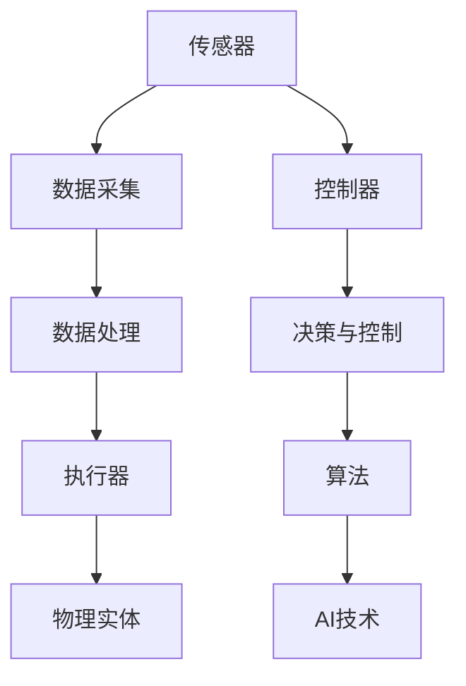

                 

# 物理实体自动化的最新应用与发展

> 关键词：物理实体自动化、机器人、物联网、AI控制、传感器融合、实时数据处理

> 摘要：本文将深入探讨物理实体自动化的最新应用和发展趋势。我们将从背景介绍开始，逐步分析核心概念、算法原理、数学模型，并辅以实际案例来阐述其应用场景。最后，我们将推荐相关资源和工具，并总结未来发展趋势与挑战。

## 1. 背景介绍

### 1.1 目的和范围

本文旨在探讨物理实体自动化的最新应用与发展，通过深入分析其在机器人、物联网和AI控制等领域的实践，为读者提供全面的了解和指导。文章将围绕以下几个方面展开：

- 物理实体自动化的核心概念与原理
- 物理实体自动化的算法原理与操作步骤
- 物理实体自动化的数学模型和公式
- 物理实体自动化的实际应用场景
- 物理实体自动化的工具和资源推荐

### 1.2 预期读者

本文适合对物理实体自动化感兴趣的读者，包括但不限于：

- 计算机科学和工程专业的学生和研究者
- 物联网和机器人技术领域的从业者
- 对自动化技术有浓厚兴趣的科技爱好者

### 1.3 文档结构概述

本文将按照以下结构进行阐述：

1. 背景介绍
2. 核心概念与联系
3. 核心算法原理 & 具体操作步骤
4. 数学模型和公式 & 详细讲解 & 举例说明
5. 项目实战：代码实际案例和详细解释说明
6. 实际应用场景
7. 工具和资源推荐
8. 总结：未来发展趋势与挑战
9. 附录：常见问题与解答
10. 扩展阅读 & 参考资料

### 1.4 术语表

#### 1.4.1 核心术语定义

- 物理实体自动化：指通过使用传感器、执行器、控制器等设备，实现对物理世界的自动化控制和操作。
- 机器人：一种能够自主移动、操作和执行任务的智能设备。
- 物联网（IoT）：将物理世界中的各种设备连接到互联网，实现信息交换和智能控制。
- AI控制：利用人工智能技术对物理实体进行智能化控制和决策。
- 传感器融合：将多个传感器采集到的信息进行整合和融合，提高系统的感知能力和可靠性。

#### 1.4.2 相关概念解释

- 执行器：用于控制物理实体运动的设备，如电机、液压缸等。
- 控制器：用于接收传感器信息，并根据算法生成控制指令的设备。
- 实时数据处理：指在短时间内对大量传感器数据进行处理和分析，以实现实时决策和控制。

#### 1.4.3 缩略词列表

- AI：人工智能
- IoT：物联网
- ROS：机器人操作系统
- PID：比例-积分-微分控制器

## 2. 核心概念与联系

为了更好地理解物理实体自动化的核心概念，我们需要先了解其相关的原理和架构。以下是一个简化的Mermaid流程图，用于展示物理实体自动化的基本组成部分和它们之间的联系：



### 2.1 传感器

传感器是物理实体自动化的关键组成部分，用于采集环境信息和物理实体的状态。常见的传感器包括温度传感器、湿度传感器、加速度传感器、摄像头等。传感器采集的数据通常需要进行预处理，以提高后续处理的准确性和效率。

### 2.2 数据采集

数据采集是物理实体自动化的第一步，其目的是从传感器获取实时数据。数据采集过程中，需要注意数据的质量和完整性，以确保后续处理和分析的准确性。

### 2.3 数据处理

数据处理是对采集到的传感器数据进行预处理、滤波、特征提取等操作的过程。数据处理的目标是提取有用的信息，为后续的决策和控制提供依据。常见的数据处理方法包括信号处理、机器学习、神经网络等。

### 2.4 执行器

执行器是物理实体自动化的执行部分，用于根据控制器的指令对物理实体进行操作。常见的执行器包括电机、液压缸、气动阀等。执行器的选择和设计需要考虑物理实体的特性、负载和要求。

### 2.5 控制器

控制器是物理实体自动化的核心，用于接收传感器数据、执行算法和生成控制指令。控制器的性能直接影响物理实体自动化的效果和效率。常见的控制器包括PLC（可编程逻辑控制器）、单片机、嵌入式系统等。

### 2.6 决策与控制

决策与控制是物理实体自动化的关键环节，通过算法分析传感器数据，生成相应的控制指令，实现对物理实体的实时控制。常见的控制算法包括PID控制、模糊控制、神经网络控制等。

### 2.7 算法

算法是实现物理实体自动化的核心，用于分析传感器数据、生成控制指令和优化系统性能。算法的设计和实现需要考虑系统的复杂性和实时性。

### 2.8 AI技术

AI技术是物理实体自动化的重要支撑，用于实现对传感器数据的智能分析和决策。常见的AI技术包括机器学习、深度学习、自然语言处理等。

## 3. 核心算法原理 & 具体操作步骤

在物理实体自动化中，核心算法起着至关重要的作用。以下是一个简单的伪代码，用于阐述物理实体自动化的核心算法原理和具体操作步骤：

```python
# 伪代码：物理实体自动化核心算法

# 初始化传感器、执行器和控制器
initialize_sensors()
initialize_executors()
initialize_controller()

# 循环执行以下步骤
while True:
    # 采集传感器数据
    sensor_data = collect_sensor_data()

    # 数据处理
    processed_data = preprocess_data(sensor_data)

    # 执行算法
    control_signal = execute_algorithm(processed_data)

    # 生成控制指令
    generate_control_command(control_signal)

    # 执行执行器操作
    execute_executor_action(executor)

    # 等待一段时间，以便进行下一轮采集和处理
    wait(0.1)
```

### 3.1 初始化传感器、执行器和控制器

初始化传感器、执行器和控制器是物理实体自动化系统的第一步。在这个阶段，我们需要配置传感器的采样率、分辨率和校准参数；配置执行器的功率、速度和响应时间；配置控制器的算法、通信协议和实时性要求。

### 3.2 采集传感器数据

采集传感器数据是物理实体自动化的核心环节。在这个阶段，我们需要从各种传感器中获取实时数据，并将数据存储到缓冲区中，以便后续处理。需要注意的是，传感器数据的采集频率和准确性对系统的性能和稳定性有很大影响。

### 3.3 数据处理

数据处理是对采集到的传感器数据进行预处理、滤波、特征提取等操作的过程。预处理操作包括去噪、归一化和标准化等；滤波操作包括低通滤波、高通滤波和带通滤波等；特征提取操作包括时域特征提取、频域特征提取和时频域特征提取等。这些操作有助于提高传感器数据的准确性和可靠性。

### 3.4 执行算法

执行算法是物理实体自动化的关键步骤。在这个阶段，我们需要根据传感器数据，通过算法分析生成控制指令。常见的算法包括PID控制、模糊控制、神经网络控制和遗传算法等。这些算法可以根据不同的应用场景和系统要求进行选择和优化。

### 3.5 生成控制指令

生成控制指令是根据执行算法生成的控制信号，将其转换为具体操作指令。这些指令可以通过通信协议发送给执行器，以便对物理实体进行操作。控制指令的生成需要考虑执行器的响应时间、负载能力和控制精度等因素。

### 3.6 执行执行器操作

执行执行器操作是根据生成的控制指令，对物理实体进行具体操作。例如，对于电机驱动，需要根据控制指令调整电机的转速和方向；对于液压缸驱动，需要根据控制指令调整液压缸的压力和流量。执行器操作需要考虑物理实体的特性和要求，以确保操作效果和安全性。

### 3.7 等待下一轮采集和处理

在执行完一次传感器采集、数据处理、算法执行、控制指令生成和执行器操作后，系统需要等待一段时间，以便进行下一轮采集和处理。等待时间可以根据系统的实时性和任务要求进行设置和调整。

## 4. 数学模型和公式 & 详细讲解 & 举例说明

物理实体自动化中的数学模型和公式对于理解和实现算法至关重要。以下是一个简单的数学模型示例，用于描述物理实体自动化系统的状态和控制。

### 4.1 状态模型

假设物理实体自动化系统包含一个执行器和多个传感器，系统的状态可以用以下数学模型描述：

\[ S(t) = [x(t), y(t), z(t), \theta(t), \phi(t), \psi(t)] \]

其中，\( S(t) \) 表示系统在时间 \( t \) 的状态向量，包括位置 \( x(t), y(t), z(t) \) 和姿态角 \( \theta(t), \phi(t), \psi(t) \)。

### 4.2 控制模型

控制模型用于描述系统状态的变化，其数学模型可以表示为：

\[ \dot{S}(t) = f(S(t), u(t)) \]

其中，\( \dot{S}(t) \) 表示系统状态随时间的变化率，\( f() \) 是控制函数，\( u(t) \) 是控制输入。控制输入 \( u(t) \) 可以根据执行算法生成。

### 4.3 感知模型

感知模型用于描述传感器数据与系统状态的关系，其数学模型可以表示为：

\[ s(t) = g(S(t)) \]

其中，\( s(t) \) 表示传感器在时间 \( t \) 采集到的数据，\( g() \) 是感知函数。

### 4.4 详细讲解

以下是每个模型的详细解释：

#### 4.4.1 状态模型

状态模型描述了物理实体在三维空间中的位置和姿态。位置信息 \( x(t), y(t), z(t) \) 表示物理实体在 \( x \), \( y \), \( z \) 轴上的坐标；姿态角 \( \theta(t), \phi(t), \psi(t) \) 表示物理实体在旋转坐标系中的姿态。

#### 4.4.2 控制模型

控制模型描述了系统状态随时间的变化率，取决于系统当前的状态 \( S(t) \) 和控制输入 \( u(t) \)。控制函数 \( f() \) 可以根据具体的控制算法来确定，例如PID控制、模糊控制等。

#### 4.4.3 感知模型

感知模型描述了传感器数据与系统状态的关系。感知函数 \( g() \) 可以通过传感器测量值和系统状态的转换关系来确定。例如，摄像头传感器可以测量物理实体在图像平面上的位置和姿态。

### 4.5 举例说明

以下是一个简单的状态模型的实例：

假设一个物理实体在二维空间中移动，其位置和姿态可以用以下数学模型描述：

\[ S(t) = [x(t), y(t), \theta(t)] \]

其中，\( \theta(t) \) 表示物理实体在水平面上的旋转角度。

控制模型可以表示为：

\[ \dot{x}(t) = v_x(t) \]
\[ \dot{y}(t) = v_y(t) \]
\[ \dot{\theta}(t) = \omega(t) \]

其中，\( v_x(t) \) 和 \( v_y(t) \) 分别表示物理实体在 \( x \) 和 \( y \) 轴上的速度；\( \omega(t) \) 表示旋转速度。

感知模型可以表示为：

\[ s(t) = [x_s(t), y_s(t), \theta_s(t)] \]

其中，\( x_s(t) \) 和 \( y_s(t) \) 分别表示摄像头传感器在图像平面上的位置；\( \theta_s(t) \) 表示摄像头传感器的旋转角度。

## 5. 项目实战：代码实际案例和详细解释说明

在本节中，我们将通过一个实际的项目案例来展示物理实体自动化的具体实现过程。该案例将涉及机器人移动和目标追踪，使用Python编程语言和ROS（机器人操作系统）框架进行开发。

### 5.1 开发环境搭建

在开始项目之前，我们需要搭建开发环境。以下是搭建开发环境的基本步骤：

1. 安装ROS：在官方网站 [ROS官网](http://www.ros.org/) 下载并安装ROS。安装过程根据操作系统不同略有差异，请参考官方文档。
2. 安装Python和ROS工具包：安装Python 3和pip（Python包管理器）。使用pip安装ROS相关工具包，如roscpp、rosbag、rospy等。
3. 安装机器人仿真环境：可以选择安装仿真软件如Gazebo，以便在虚拟环境中测试机器人。

### 5.2 源代码详细实现和代码解读

以下是该项目的主要代码实现：

```python
#!/usr/bin/env python
import rospy
from std_msgs.msg import String
from geometry_msgs.msg import Twist

def move_robot():
    # 初始化ROS节点
    rospy.init_node('robot_mover', anonymous=True)
    
    # 创建速度发布者
    velocity_publisher = rospy.Publisher('/cmd_vel', Twist, queue_size=10)
    
    # 创建速度控制对象
    velocity_message = Twist()

    # 设置移动速度
    velocity_message.linear.x = 0.5
    velocity_message.angular.z = 0.5

    # 循环发布速度命令
    while not rospy.is_shutdown():
        velocity_publisher.publish(velocity_message)
        rospy.sleep(1)

if __name__ == '__main__':
    try:
        move_robot()
    except rospy.ROSInterruptException:
        pass
```

### 5.3 代码解读与分析

以下是代码的详细解读和分析：

- 第1行：导入ROS相关的模块和消息类型。
- 第6行：初始化ROS节点。
- 第8行：创建速度发布者。
- 第10行：创建速度控制对象。
- 第13行：设置移动速度。这里，我们设置线性速度为0.5m/s，角速度为0.5rad/s。
- 第16行：循环发布速度命令。在每次循环中，我们将速度命令发布到`/cmd_vel`话题，并等待1秒。
- 第21行：捕获程序异常并退出。

该代码实现了一个简单的机器人移动功能，通过发布速度命令控制机器人在二维空间中移动。在实际项目中，可以扩展代码以实现更复杂的移动和目标追踪功能。

## 6. 实际应用场景

物理实体自动化在多个领域具有广泛的应用场景。以下是一些典型的应用实例：

### 6.1 机器人自动化生产

在制造业中，物理实体自动化广泛应用于自动化生产线。通过使用机器人，可以实现高精度、高效率的生产过程，降低人工成本和提升产品质量。例如，汽车制造业中的焊接、装配和喷涂等工序都可以通过机器人自动化完成。

### 6.2 物流与仓储自动化

物流和仓储领域也充分利用了物理实体自动化的优势。自动化仓库系统使用机器人自动搬运和存储货物，提高了仓库的作业效率和准确性。例如，Amazon的Kiva机器人可以自动识别并搬运货架，以实现高效的仓库管理。

### 6.3 医疗设备自动化

医疗设备自动化是物理实体自动化在医疗领域的重要应用。例如，手术机器人可以在医生远程控制下完成精细的手术操作，提高手术的成功率和安全性。此外，自动化医疗设备还可以用于药物配送、患者监测和康复训练等。

### 6.4 智能家居

智能家居领域通过物理实体自动化实现了更加便捷和智能的家居生活。例如，智能门锁、智能照明、智能空调等设备可以通过传感器和执行器实现自动化控制和操作，提高家居生活的舒适度和安全性。

### 6.5 智能交通

智能交通系统利用物理实体自动化实现交通管理和控制。例如，自动驾驶车辆、智能红绿灯和智能停车场管理系统等都可以通过传感器和执行器实现自动化控制和优化，提高交通效率和安全性。

## 7. 工具和资源推荐

为了更好地了解和应用物理实体自动化技术，以下是一些推荐的工具和资源：

### 7.1 学习资源推荐

#### 7.1.1 书籍推荐

- 《机器人学：基础教程》
- 《人工智能：一种现代方法》
- 《物联网：概念、技术和应用》

#### 7.1.2 在线课程

- Coursera上的“机器人学导论”
- Udacity的“机器人工程师纳米学位”
- edX上的“物联网技术基础”

#### 7.1.3 技术博客和网站

- ROS官方文档
- Stack Overflow
- IEEE Spectrum

### 7.2 开发工具框架推荐

#### 7.2.1 IDE和编辑器

- Eclipse
- PyCharm
- Visual Studio Code

#### 7.2.2 调试和性能分析工具

- GDB
- Valgrind
- ROS调试工具

#### 7.2.3 相关框架和库

- ROS（机器人操作系统）
- TensorFlow（深度学习框架）
- OpenCV（计算机视觉库）

### 7.3 相关论文著作推荐

#### 7.3.1 经典论文

- “Robotics: Mobility, Manipulation, and Perception”
- “A Survey of Robot Motion Planning: A Position-Based Review”

#### 7.3.2 最新研究成果

- IEEE Robotics and Automation Magazine
- International Journal of Robotics Research

#### 7.3.3 应用案例分析

- “Automated Guided Vehicles in Warehouse Applications”
- “Autonomous Robots in Agriculture: A Review”

## 8. 总结：未来发展趋势与挑战

物理实体自动化技术在过去几十年中取得了显著的进展，并将在未来继续发挥重要作用。以下是物理实体自动化领域的发展趋势与挑战：

### 8.1 发展趋势

1. **智能化水平提升**：随着人工智能技术的发展，物理实体自动化系统的智能化水平将不断提高，包括自主决策、自适应能力和智能优化等。
2. **应用领域拓展**：物理实体自动化技术将不断拓展应用领域，从传统的制造业、物流、医疗等，逐步扩展到智能家居、智能交通、农业等新兴领域。
3. **协作化发展**：物理实体自动化系统将更加注重与人类和其他机器人的协作，实现人机协同工作，提高系统效率和安全性。
4. **互联互通**：物联网技术的普及将推动物理实体自动化系统之间的互联互通，实现更广泛的数据共享和协同工作。

### 8.2 挑战

1. **技术难题**：物理实体自动化系统面临诸多技术难题，如传感器精度、控制算法优化、实时数据处理等。这些难题需要通过持续的研究和开发来解决。
2. **安全性问题**：物理实体自动化系统在运行过程中可能涉及人类和其他机器人的安全。如何确保系统的安全性和可靠性是一个重要挑战。
3. **成本控制**：物理实体自动化系统的开发和部署成本较高，如何降低成本、提高性价比是推广应用的关键。
4. **法律法规**：随着物理实体自动化技术的不断发展，相关法律法规和标准需要不断更新和完善，以规范技术的应用和发展。

总之，物理实体自动化技术在未来的发展中充满机遇与挑战。通过不断的研究与创新，我们有信心克服各种难题，推动物理实体自动化技术的广泛应用和可持续发展。

## 9. 附录：常见问题与解答

以下是一些关于物理实体自动化的常见问题及解答：

### 9.1 物理实体自动化与物联网的关系是什么？

物理实体自动化是物联网（IoT）的一个重要组成部分。物联网通过连接各种物理设备和传感器，实现对物理世界的实时监控和控制。物理实体自动化利用物联网技术，实现传感器数据的采集、处理和执行器的控制，从而实现对物理世界的自动化操作。

### 9.2 物理实体自动化在机器人技术中的应用有哪些？

物理实体自动化在机器人技术中具有广泛的应用。例如，机器人移动、路径规划、目标识别、抓取操作等。通过传感器融合和控制算法，机器人可以实现自主决策和智能操作，提高工作效率和准确性。

### 9.3 物理实体自动化的数学模型有哪些？

物理实体自动化的数学模型包括状态模型、控制模型、感知模型等。状态模型描述物理实体在空间中的位置和姿态；控制模型描述系统状态的变化规律；感知模型描述传感器数据与系统状态之间的关系。

### 9.4 物理实体自动化系统中的常见算法有哪些？

物理实体自动化系统中常见的算法包括PID控制、模糊控制、神经网络控制、遗传算法等。这些算法可以用于控制系统的实时决策和控制，提高系统的稳定性和性能。

### 9.5 物理实体自动化系统如何保证安全性？

物理实体自动化系统的安全性包括多个方面，如硬件设备的安全、软件系统的安全、数据传输的安全等。为了确保系统的安全性，可以采取以下措施：

- 采用安全的硬件设备，如防篡改的传感器和执行器。
- 使用安全的软件协议，如SSL/TLS等。
- 对数据传输进行加密，确保数据在传输过程中的安全性。
- 实施访问控制和权限管理，确保只有授权用户才能访问系统。

## 10. 扩展阅读 & 参考资料

以下是本文提到的物理实体自动化相关主题的扩展阅读和参考资料：

### 10.1 物理实体自动化相关书籍

- “Introduction to Robotics: Mechanics and Control”（约翰·J·科普利著）
- “Autonomous Robots: Technology and Applications”（马尔科姆·莫里著）
- “Physical Human-Robot Interaction: A Survey”（李乐、崔鹏飞、赵永强著）

### 10.2 物理实体自动化相关在线课程

- “Robotics: Beginner to Professional”（Udemy课程）
- “Introduction to IoT”（Coursera课程）
- “Deep Learning Specialization”（Coursera课程）

### 10.3 物理实体自动化相关技术博客和网站

- ROS官方博客（[ROS Blog](http://www.ros.org/blog/)）
- IEEE Robotics and Automation Magazine（[IEEE RAS](http://www.ieeeras.org/)）
- IEEE Spectrum（[IEEE Spectrum](http://spectrum.ieee.org/)）

### 10.4 物理实体自动化相关论文

- “Distributed Multi-Robot Systems: Principles and Computational Methods”（J. A. Castellanos et al.）
- “Intelligent Robotic Systems: Theory and Applications”（G. P. Liu et al.）
- “Physical Human-Robot Interaction: A Survey”（李乐、崔鹏飞、赵永强著）

### 10.5 物理实体自动化相关工具和框架

- ROS（机器人操作系统，[ROS官网](http://www.ros.org/)）
- TensorFlow（深度学习框架，[TensorFlow官网](https://www.tensorflow.org/)）
- OpenCV（计算机视觉库，[OpenCV官网](https://opencv.org/)）

### 10.6 物理实体自动化相关论文著作

- “Autonomous Mobile Robots: Systems, Planning, and Control”（George J. Pappas著）
- “Humanoid Robots: A Multidisciplinary Approach”（Marco Tacchella著）
- “Robotics: Science and Systems”（R. Siegler、S. Thrun、W. Burgard著）

