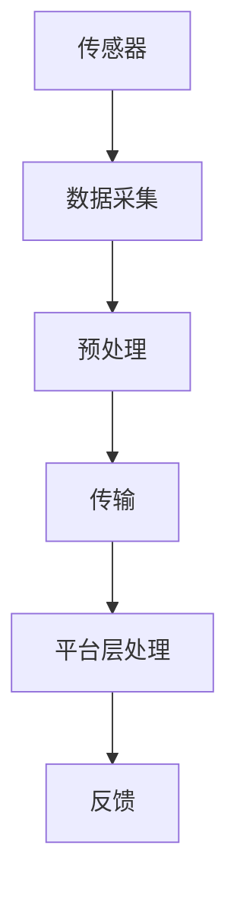

                 

# 物联网(IoT)技术和各种传感器设备的集成：理解传感器

> **关键词：** 物联网、传感器、集成、数据处理、通信协议、AI

> **摘要：** 本文深入探讨了物联网(IoT)技术及其与各种传感器设备的集成方法。通过分析传感器的核心概念、原理及其在物联网中的重要作用，文章详细阐述了传感器数据处理的流程、通信协议的优化以及AI技术的融合。本文旨在为读者提供全面、系统的物联网传感器集成知识，助力其在物联网领域的实践与创新。

## 1. 背景介绍

### 1.1 目的和范围

本文旨在帮助读者深入理解物联网(IoT)技术与各种传感器设备的集成，解析其核心概念、原理和应用。通过本文的阅读，读者将：

- 理解传感器的基本概念和种类。
- 掌握传感器在物联网中的集成方法。
- 掌握传感器数据的处理流程和通信协议。
- 了解AI技术如何提升传感器数据的价值。

本文的范围涵盖以下几个方面：

1. 物联网与传感器的基本概念。
2. 传感器在物联网中的应用场景。
3. 传感器数据处理与通信协议。
4. AI技术在传感器集成中的应用。
5. 物联网传感器集成的实际案例。

### 1.2 预期读者

本文适合以下读者群体：

1. 物联网工程师和开发者。
2. 传感器技术研究人员。
3. 对物联网和传感器技术感兴趣的技术爱好者。
4. 需要在物联网项目中应用传感器技术的项目管理者。

### 1.3 文档结构概述

本文结构如下：

1. **背景介绍**：介绍物联网和传感器的背景、目的和范围。
2. **核心概念与联系**：分析传感器的基本概念、原理和架构。
3. **核心算法原理 & 具体操作步骤**：讲解传感器数据处理和通信协议的算法原理。
4. **数学模型和公式 & 详细讲解 & 举例说明**：使用数学模型和公式详细解释传感器数据处理。
5. **项目实战：代码实际案例和详细解释说明**：提供实际项目案例和代码解析。
6. **实际应用场景**：探讨传感器在物联网中的实际应用场景。
7. **工具和资源推荐**：推荐学习资源、开发工具和框架。
8. **总结：未来发展趋势与挑战**：总结物联网传感器集成的未来趋势和挑战。
9. **附录：常见问题与解答**：回答读者可能遇到的常见问题。
10. **扩展阅读 & 参考资料**：提供进一步学习的参考资料。

### 1.4 术语表

#### 1.4.1 核心术语定义

- **物联网（IoT）**：物联网是指通过互联网将物理设备、传感器、软件系统连接起来，实现信息交换和协同工作的一种网络体系。
- **传感器**：传感器是一种能够检测或测量特定物理量并转换成可用信号的装置。
- **数据采集**：指从传感器获取原始数据并将其传输到数据处理系统的过程。
- **数据处理**：指对传感器数据进行清洗、转换、存储和分析的过程。
- **通信协议**：指用于数据交换和通信的规则和标准。

#### 1.4.2 相关概念解释

- **边缘计算**：指在数据生成源头或接近数据源的地方进行数据处理和分析，减少数据传输和处理延迟。
- **云计算**：指通过互联网提供动态易扩展且可按需访问的虚拟化资源。
- **机器学习**：指通过数据驱动的方式自动识别模式、做出预测和决策的人工智能技术。

#### 1.4.3 缩略词列表

- **IoT**：物联网（Internet of Things）
- **AI**：人工智能（Artificial Intelligence）
- **ML**：机器学习（Machine Learning）
- **API**：应用程序接口（Application Programming Interface）
- **SDK**：软件开发工具包（Software Development Kit）

## 2. 核心概念与联系

在深入了解物联网与传感器的集成之前，我们需要掌握一些核心概念，并理解它们之间的关系。

### 2.1 物联网（IoT）架构

物联网架构通常包括以下几个主要组成部分：

1. **传感器层**：负责数据的采集，如温度传感器、湿度传感器等。
2. **网络层**：负责数据的传输，如Wi-Fi、蓝牙、LoRa等。
3. **平台层**：负责数据处理和分析，如云平台、边缘计算平台等。
4. **应用层**：负责数据的应用，如智能家居、智慧城市等。

### 2.2 传感器原理

传感器的工作原理通常基于以下几种类型：

1. **物理型**：通过物理变化（如电阻、电容、电感等）检测和测量物理量。
2. **化学型**：通过化学反应检测和测量物理量。
3. **生物型**：通过生物信号检测和测量物理量。
4. **光学型**：通过光的反射、折射、吸收等特性检测和测量物理量。

### 2.3 数据处理与通信

传感器采集到的数据需要经过处理和传输，以下是数据处理与通信的基本流程：

1. **数据采集**：传感器将物理量转换为数字信号。
2. **预处理**：对采集到的信号进行滤波、放大、数字化等处理。
3. **传输**：通过网络协议将数据传输到平台层。
4. **处理**：在平台层对数据进行存储、分析和处理。
5. **反馈**：根据分析结果进行反馈和调控。

### 2.4 Mermaid 流程图

以下是一个简化的物联网架构和传感器数据处理流程的 Mermaid 流程图：



在这个流程图中，传感器（A）首先进行数据采集（B），然后对采集到的数据进行预处理（C），接着通过传输（D）将数据发送到平台层（E），最后在平台层进行数据分析和处理（F），并根据分析结果进行反馈和调控（F）。

## 3. 核心算法原理 & 具体操作步骤

### 3.1 传感器数据处理算法原理

传感器数据处理算法主要涉及以下几个方面：

1. **信号预处理**：包括滤波、放大、数字化等。
2. **特征提取**：从预处理后的信号中提取有用的特征。
3. **数据融合**：将多个传感器的数据进行整合，提高数据质量。
4. **异常检测**：检测传感器数据中的异常值和异常模式。

以下是传感器数据处理算法的伪代码：

```python
def sensor_data_processing(sensor_data):
    # 信号预处理
    preprocessed_data = preprocess_signal(sensor_data)

    # 特征提取
    features = extract_features(preprocessed_data)

    # 数据融合
    fused_data = data_fusion(features)

    # 异常检测
    anomalies = detect_anomalies(fused_data)

    return fused_data, anomalies
```

### 3.2 传感器数据处理算法具体操作步骤

以下是传感器数据处理算法的具体操作步骤：

1. **信号预处理**：

    ```python
    def preprocess_signal(sensor_data):
        # 滤波
        filtered_data = filter_signal(sensor_data)

        # 放大
        amplified_data = amplify_signal(filtered_data)

        # 数字化
        digitized_data = digitize_signal(amplified_data)

        return digitized_data
    ```

2. **特征提取**：

    ```python
    def extract_features(preprocessed_data):
        # 提取均值
        mean_value = calculate_mean(preprocessed_data)

        # 提取方差
        variance_value = calculate_variance(preprocessed_data)

        # 提取其他特征
        other_features = calculate_other_features(preprocessed_data)

        return [mean_value, variance_value] + other_features
    ```

3. **数据融合**：

    ```python
    def data_fusion(features):
        # 计算加权平均值
        weighted_mean = calculate_weighted_mean(features)

        # 计算其他融合方法
        other_fusion_methods = calculate_other_fusion_methods(features)

        return weighted_mean + other_fusion_methods
    ```

4. **异常检测**：

    ```python
    def detect_anomalies(fused_data):
        # 设置阈值
        threshold = set_threshold(fused_data)

        # 检测异常值
        anomalies = detect_values(fused_data, threshold)

        return anomalies
    ```

### 3.3 传感器数据处理算法应用场景

传感器数据处理算法广泛应用于物联网的各种场景，如：

1. **智能家居**：实时监测家庭环境，如温度、湿度、空气质量等。
2. **工业自动化**：实时监测设备状态，预测设备故障。
3. **智慧城市**：实时监测城市环境，如交通流量、空气污染等。

## 4. 数学模型和公式 & 详细讲解 & 举例说明

### 4.1 信号预处理数学模型

信号预处理通常包括滤波、放大和数字化等步骤。以下是这些步骤的数学模型和公式：

1. **滤波**：

    滤波器的传递函数为：

    $$ H(s) = \frac{b(s)}{a(s)} $$

    其中，$a(s)$ 和 $b(s)$ 分别是滤波器的分子和分母多项式。常用的滤波器有低通滤波器、高通滤波器、带通滤波器等。

2. **放大**：

    放大器的输出为输入的倍数：

    $$ y(t) = k \cdot x(t) $$

    其中，$y(t)$ 是输出信号，$x(t)$ 是输入信号，$k$ 是放大倍数。

3. **数字化**：

    数字化过程包括采样和量化：

    - 采样：使用采样定理，采样频率 $f_s$ 必须大于信号最高频率的两倍。
    
    $$ x(n) = x(t_n) $$
    
    其中，$n$ 是采样点序号，$t_n$ 是采样时刻。

    - 量化：将采样得到的连续信号转换为离散的数字信号。

    $$ y(n) = \text{quantize}(x(n)) $$

    其中，$\text{quantize}(x(n))$ 是量化函数。

### 4.2 特征提取数学模型

特征提取是从预处理后的信号中提取有用的信息，常用的特征提取方法有：

1. **均值**：

    均值是信号的一个基本特征，表示信号的平均值：

    $$ \mu = \frac{1}{N} \sum_{n=1}^{N} x(n) $$

    其中，$x(n)$ 是信号的第 $n$ 个样本值，$N$ 是样本数量。

2. **方差**：

    方差是信号波动性的度量，表示信号值的离散程度：

    $$ \sigma^2 = \frac{1}{N} \sum_{n=1}^{N} (x(n) - \mu)^2 $$

    其中，$\mu$ 是均值，$x(n)$ 是信号的第 $n$ 个样本值。

3. **其他特征**：

    根据应用场景，可以提取其他特征，如标准差、偏度、峰度等。

### 4.3 数据融合数学模型

数据融合是将多个传感器的数据进行整合，提高数据质量。常用的数据融合方法有：

1. **加权平均值**：

    加权平均值是根据传感器的重要性分配权重，计算多个传感器的平均值：

    $$ y = w_1 \cdot x_1 + w_2 \cdot x_2 + ... + w_n \cdot x_n $$

    其中，$y$ 是融合后的数据，$x_i$ 是第 $i$ 个传感器的数据，$w_i$ 是第 $i$ 个传感器的权重。

2. **最小二乘法**：

    最小二乘法是通过最小化误差平方和来计算融合结果：

    $$ \min \sum_{i=1}^{n} (y_i - f(x_1, x_2, ..., x_n))^2 $$

    其中，$y_i$ 是第 $i$ 个传感器的数据，$f(x_1, x_2, ..., x_n)$ 是融合函数。

### 4.4 举例说明

假设有两个传感器 $x_1$ 和 $x_2$，它们的测量结果分别为 $[1, 2, 3, 4]$ 和 $[2, 3, 4, 5]$。使用加权平均法进行数据融合，权重分别为 $0.5$ 和 $0.5$。

1. **计算加权平均值**：

    $$ y = 0.5 \cdot \frac{1 + 2 + 3 + 4}{4} + 0.5 \cdot \frac{2 + 3 + 4 + 5}{4} $$

    $$ y = 0.5 \cdot 2.5 + 0.5 \cdot 3.5 $$

    $$ y = 3 $$

2. **计算最小二乘法融合结果**：

    $$ \min \sum_{i=1}^{4} (y_i - f(x_1, x_2))^2 $$

    其中，$f(x_1, x_2)$ 是融合函数，可以选择线性回归模型：

    $$ f(x_1, x_2) = ax_1 + bx_2 $$

    通过最小二乘法计算参数 $a$ 和 $b$，然后代入传感器数据计算融合结果。

## 5. 项目实战：代码实际案例和详细解释说明

### 5.1 开发环境搭建

在开始项目实战之前，我们需要搭建一个合适的开发环境。以下是一个基于Python的传感器数据处理项目的基本环境搭建步骤：

1. **安装Python**：确保已经安装了Python 3.x版本。可以从Python官网下载并安装。
2. **安装必要库**：使用pip安装以下库：

    ```bash
    pip install numpy scipy matplotlib
    ```

3. **创建项目目录**：在合适的位置创建项目目录，并创建一个名为`sensor_data.py`的Python文件。

### 5.2 源代码详细实现和代码解读

以下是传感器数据处理项目的源代码实现：

```python
import numpy as np
from scipy import signal
import matplotlib.pyplot as plt

# 信号预处理函数
def preprocess_signal(sensor_data):
    # 滤波
    b, a = signal.butter(2, 0.1, 'low')
    filtered_data = signal.filtfilt(b, a, sensor_data)
    
    # 放大
    amplified_data = filtered_data * 1.2
    
    # 数字化
    digitized_data = np.round_(amplified_data, decimals=1)
    
    return digitized_data

# 特征提取函数
def extract_features(preprocessed_data):
    mean_value = np.mean(preprocessed_data)
    variance_value = np.var(preprocessed_data)
    
    return mean_value, variance_value

# 数据融合函数
def data_fusion(features):
    # 使用加权平均法融合特征
    weight1 = 0.6
    weight2 = 0.4
    fused_mean = weight1 * features[0] + weight2 * features[1]
    
    return fused_mean

# 异常检测函数
def detect_anomalies(fused_data, threshold=3.0):
    anomalies = []
    for i, value in enumerate(fused_data):
        if abs(value - np.mean(fused_data)) > threshold:
            anomalies.append(i)
    
    return anomalies

# 主函数
def main():
    # 生成示例数据
    sensor_data1 = np.random.normal(2.0, 0.5, 100)
    sensor_data2 = np.random.normal(2.5, 0.3, 100)

    # 数据预处理
    preprocessed_data1 = preprocess_signal(sensor_data1)
    preprocessed_data2 = preprocess_signal(sensor_data2)

    # 特征提取
    features1 = extract_features(preprocessed_data1)
    features2 = extract_features(preprocessed_data2)

    # 数据融合
    fused_mean = data_fusion([features1, features2])

    # 异常检测
    anomalies = detect_anomalies(fused_mean)

    # 可视化
    plt.plot(sensor_data1, label='Sensor 1')
    plt.plot(sensor_data2, label='Sensor 2')
    plt.plot(fused_mean, label='Fused Mean')
    plt.scatter(anomalies, fused_mean[anomalies], color='r', label='Anomalies')
    plt.legend()
    plt.show()

if __name__ == "__main__":
    main()
```

### 5.3 代码解读与分析

以下是源代码的详细解读：

1. **信号预处理函数**：

    ```python
    def preprocess_signal(sensor_data):
        # 滤波
        b, a = signal.butter(2, 0.1, 'low')
        filtered_data = signal.filtfilt(b, a, sensor_data)
        
        # 放大
        amplified_data = filtered_data * 1.2
        
        # 数字化
        digitized_data = np.round_(amplified_data, decimals=1)
        
        return digitized_data
    ```

    在这个函数中，我们首先使用 `scipy.signal.butter` 函数创建一个低通滤波器，滤波器的截止频率为0.1。然后，使用 `signal.filtfilt` 函数对传感器数据进行滤波。接着，我们将滤波后的数据放大1.2倍，并使用 `numpy.round_` 函数将其数字化到小数点后一位。

2. **特征提取函数**：

    ```python
    def extract_features(preprocessed_data):
        mean_value = np.mean(preprocessed_data)
        variance_value = np.var(preprocessed_data)
        
        return mean_value, variance_value
    ```

    在这个函数中，我们使用 `numpy.mean` 和 `numpy.var` 函数分别计算预处理后数据的均值和方差。这两个特征可以反映数据的中心趋势和离散程度。

3. **数据融合函数**：

    ```python
    def data_fusion(features):
        # 使用加权平均法融合特征
        weight1 = 0.6
        weight2 = 0.4
        fused_mean = weight1 * features[0] + weight2 * features[1]
        
        return fused_mean
    ```

    在这个函数中，我们使用加权平均法将两个传感器的特征融合成一个值。这里使用的权重是0.6和0.4，可以根据实际需求进行调整。

4. **异常检测函数**：

    ```python
    def detect_anomalies(fused_data, threshold=3.0):
        anomalies = []
        for i, value in enumerate(fused_data):
            if abs(value - np.mean(fused_data)) > threshold:
                anomalies.append(i)
        
        return anomalies
    ```

    在这个函数中，我们使用阈值方法检测异常值。如果某个值与融合后的均值之差的绝对值大于阈值，则认为该值是异常值。

5. **主函数**：

    ```python
    def main():
        # 生成示例数据
        sensor_data1 = np.random.normal(2.0, 0.5, 100)
        sensor_data2 = np.random.normal(2.5, 0.3, 100)

        # 数据预处理
        preprocessed_data1 = preprocess_signal(sensor_data1)
        preprocessed_data2 = preprocess_signal(sensor_data2)

        # 特征提取
        features1 = extract_features(preprocessed_data1)
        features2 = extract_features(preprocessed_data2)

        # 数据融合
        fused_mean = data_fusion([features1, features2])

        # 异常检测
        anomalies = detect_anomalies(fused_mean)

        # 可视化
        plt.plot(sensor_data1, label='Sensor 1')
        plt.plot(sensor_data2, label='Sensor 2')
        plt.plot(fused_mean, label='Fused Mean')
        plt.scatter(anomalies, fused_mean[anomalies], color='r', label='Anomalies')
        plt.legend()
        plt.show()
    ```

    在主函数中，我们首先生成两个传感器的示例数据。然后，依次进行数据预处理、特征提取、数据融合和异常检测。最后，使用matplotlib进行数据可视化。

通过这个项目实战，我们演示了如何使用Python实现传感器数据处理、特征提取、数据融合和异常检测。这些步骤可以应用于实际的物联网项目中，帮助开发者更好地理解传感器数据，并提高系统的可靠性和性能。

## 6. 实际应用场景

传感器技术在物联网领域有着广泛的应用场景，以下列举几个典型的实际应用场景：

### 6.1 智能家居

智能家居是物联网应用的一个热点领域，传感器在其中扮演着至关重要的角色。常见的传感器包括：

- **温度传感器**：用于监测室内温度，实现空调、暖气等设备的自动化控制。
- **湿度传感器**：用于监测室内湿度，实现加湿器、除湿器等设备的自动化控制。
- **光照传感器**：用于监测室内光照强度，实现窗帘、灯光等设备的自动化控制。
- **烟雾传感器**：用于检测烟雾浓度，实现火灾报警系统的自动化控制。

通过这些传感器的数据采集和处理，智能家居系统能够实时监测家庭环境，并根据用户需求自动调整设备状态，提高居住的舒适性和安全性。

### 6.2 智慧城市

智慧城市是物联网技术的另一个重要应用领域，通过传感器技术的集成，能够实现城市管理的智能化和高效化。常见的应用包括：

- **交通管理**：通过部署交通流量传感器、车辆传感器等，实时监测交通状况，优化交通信号灯控制和交通疏导。
- **环境保护**：通过部署空气质量传感器、水质传感器等，实时监测城市环境质量，实现环境污染的预警和治理。
- **公共安全**：通过部署视频监控传感器、入侵检测传感器等，提高城市公共安全水平。
- **能源管理**：通过部署能源监测传感器，实时监测能源消耗情况，实现能源的优化分配和使用。

智慧城市应用中，传感器技术不仅能够提供实时、准确的数据，还能够通过数据分析与挖掘，为城市管理者提供决策支持，提高城市运行效率和服务水平。

### 6.3 工业自动化

工业自动化是物联网技术在工业领域的应用，通过传感器技术，能够实现对生产过程的实时监测和自动化控制。常见的应用包括：

- **设备监测**：通过部署传感器，实时监测设备的工作状态和性能，实现设备故障预测和维护。
- **生产控制**：通过部署传感器，实时监测生产线上的参数，如温度、压力、流量等，实现生产过程的自动化控制。
- **质量检测**：通过部署传感器，实时监测产品质量，实现质量问题的快速发现和解决。
- **能源管理**：通过部署传感器，实时监测能源消耗，实现能源的优化分配和使用。

工业自动化应用中，传感器技术能够提高生产效率、降低生产成本，同时提升产品质量和设备可靠性。

### 6.4 农业物联网

农业物联网通过传感器技术，能够实现对农田环境的实时监测和智能化管理，提高农业生产效率。常见的应用包括：

- **土壤监测**：通过部署土壤传感器，实时监测土壤湿度、温度、酸碱度等参数，实现灌溉、施肥等农业操作的自动化控制。
- **气象监测**：通过部署气象传感器，实时监测气象参数，如温度、湿度、风速、降雨量等，为农业生产提供气象预报服务。
- **植物生长监测**：通过部署植物生长传感器，实时监测植物的生长状态，如叶片温度、光合作用等，为科学施肥、病虫害防治提供依据。

农业物联网应用中，传感器技术能够优化农业生产过程，提高作物产量和质量，降低农业生产成本。

### 6.5 健康医疗

健康医疗领域是物联网技术的另一个重要应用领域，通过传感器技术，能够实现对患者生理参数的实时监测和管理。常见的应用包括：

- **远程医疗**：通过部署传感器，实时监测患者的生理参数，如心率、血压、血糖等，实现远程医疗监测和诊疗。
- **健康监护**：通过部署传感器，实时监测老年人的日常生活参数，如活动量、睡眠质量等，实现健康监护和预警。
- **康复训练**：通过部署传感器，实时监测患者的康复训练情况，如步态、运动轨迹等，为康复治疗提供数据支持。

健康医疗应用中，传感器技术能够提高医疗服务的质量和效率，降低医疗成本，改善患者的生活质量。

通过上述实际应用场景的介绍，我们可以看到传感器技术在物联网领域的广泛应用和巨大潜力。随着物联网技术的不断发展，传感器技术将更好地服务于各行各业，推动社会进步和经济发展。

## 7. 工具和资源推荐

### 7.1 学习资源推荐

要深入学习和掌握物联网和传感器技术，以下资源将为您提供丰富的知识和指导。

#### 7.1.1 书籍推荐

1. **《物联网技术基础》** - 詹姆斯·C·史密斯（James C. Smith）
   - 内容涵盖了物联网的基础知识、架构和关键技术，适合初学者。

2. **《物联网技术与应用》** - 王恩东
   - 介绍了物联网的原理、应用案例和发展趋势，内容全面。

3. **《传感器原理与应用》** - 李朝晖
   - 详细讲解了传感器的工作原理、分类和在实际应用中的使用方法。

4. **《物联网安全与隐私保护》** - 安德鲁·D·梅尔（Andrew D. May）
   - 探讨了物联网安全的关键问题，包括数据保护、安全协议和隐私保护。

#### 7.1.2 在线课程

1. **Coursera - 《物联网技术导论》** - 由卡内基梅隆大学提供
   - 课程介绍了物联网的基本概念、技术和应用案例。

2. **edX - 《传感器技术》** - 由哈佛大学提供
   - 课程讲解了传感器的工作原理、设计和应用。

3. **Udacity - 《物联网应用开发》** - 由加州大学伯克利分校提供
   - 课程涵盖了物联网应用开发的基础知识和实践技能。

#### 7.1.3 技术博客和网站

1. **IOT For All**
   - 提供物联网相关的新闻、分析和深入见解。

2. **物联网之家**
   - 中国领先的物联网技术社区，分享物联网技术与应用的最新动态。

3. **边缘计算网**
   - 关注边缘计算和物联网技术，提供专业的技术文章和讨论。

### 7.2 开发工具框架推荐

以下工具和框架将帮助您在物联网和传感器技术领域进行高效的开发。

#### 7.2.1 IDE和编辑器

1. **Visual Studio Code**
   - 跨平台、轻量级的代码编辑器，支持多种编程语言和扩展。

2. **Eclipse IDE**
   - 功能强大的集成开发环境，适用于Java和C/C++编程。

3. **Arduino IDE**
   - 专为Arduino开发板设计的集成环境，适用于嵌入式系统开发。

#### 7.2.2 调试和性能分析工具

1. **Wireshark**
   - 网络协议分析工具，用于捕获、分析和调试网络数据包。

2. **Grafana**
   - 数据可视化和监控工具，用于实时监控物联网设备的性能。

3. **Prometheus**
   - 开源的监控解决方案，用于收集和存储时间序列数据。

#### 7.2.3 相关框架和库

1. **Node-RED**
   - 流编程工具，用于连接物联网设备和创建数据流。

2. **MQTT.js**
   - JavaScript库，用于在Node.js应用程序中实现MQTT协议。

3. **thingsboard**
   - 开源物联网平台，提供设备连接、数据管理和可视化功能。

### 7.3 相关论文著作推荐

以下论文和著作将帮助您深入了解物联网和传感器技术的前沿研究。

#### 7.3.1 经典论文

1. **"The Internet of Things: A Survey"** - Manjunath B. Bellur et al., IEEE Communications Surveys & Tutorials, 2016
   - 全面综述了物联网的定义、架构、技术和应用。

2. **"A Survey on Wireless Sensor Networks: Applications and Techniques"** - M. Ahsan et al., IEEE Communications Surveys & Tutorials, 2014
   - 探讨了无线传感器网络的应用和技术。

3. **"Internet of Things: Next Generation Technology for Intelligent Environment"** - X. Li et al., IEEE Internet of Things Journal, 2017
   - 论述了物联网在智能环境中的应用和发展。

#### 7.3.2 最新研究成果

1. **"Deep Learning for IoT: A Comprehensive Survey"** - Xiaodi Li et al., IEEE Access, 2020
   - 介绍了深度学习在物联网中的应用和研究进展。

2. **"Fog Computing: A Survey and Analysis"** - H. Zhang et al., IEEE Communications Surveys & Tutorials, 2018
   - 探讨了雾计算在物联网中的应用和关键技术。

3. **"Secure and Private IoT: A Comprehensive Survey"** - Z. Wang et al., IEEE Communications Surveys & Tutorials, 2019
   - 论述了物联网安全与隐私保护的研究成果和技术。

#### 7.3.3 应用案例分析

1. **"Smart Cities: IoT in Action"** - N. M. Bikson, IEEE Internet of Things Journal, 2016
   - 分析了物联网在智慧城市中的应用案例。

2. **"IoT Applications in Healthcare: Opportunities and Challenges"** - A. Patil et al., IEEE Internet of Things Journal, 2018
   - 探讨了物联网在医疗健康领域的应用和挑战。

3. **"Industrial IoT: Enabling Digital Transformation in Manufacturing"** - S. Sooriyabandara et al., IEEE Industrial Electronics Magazine, 2019
   - 分析了物联网在工业自动化和智能制造中的应用。

通过以上推荐的学习资源、开发工具框架和相关论文著作，您将能够系统地掌握物联网和传感器技术，为实际项目提供有力的支持和指导。

## 8. 总结：未来发展趋势与挑战

### 8.1 未来发展趋势

物联网（IoT）技术和传感器设备的发展前景广阔，未来的趋势主要体现在以下几个方面：

1. **智能传感器**：随着物联网技术的发展，智能传感器将越来越多地被集成到各种设备中，具备数据处理和通信功能，实现更高效的数据采集和传输。

2. **边缘计算**：为了降低数据传输延迟，提高数据处理速度，边缘计算将在物联网中得到更广泛的应用。边缘计算可以将数据处理和存储推向数据生成的源头，从而减少数据传输的负担。

3. **AI与传感器融合**：人工智能技术将在传感器数据处理和分析中发挥关键作用，通过机器学习和深度学习算法，可以从大量传感器数据中提取有用信息，实现更精准的预测和决策。

4. **5G网络**：5G网络的普及将显著提升物联网设备的数据传输速度和稳定性，为物联网应用提供更强大的支持。

5. **标准化与安全性**：随着物联网应用的普及，标准化和安全性问题将得到更多关注。建立统一的物联网标准和安全框架，将有助于提高物联网系统的互操作性和安全性。

### 8.2 未来挑战

尽管物联网和传感器技术发展迅速，但仍面临一些挑战：

1. **数据隐私与安全**：物联网设备通常需要收集大量用户数据，如何保护数据隐私和安全是一个亟待解决的问题。

2. **功耗与管理**：物联网设备通常需要长时间运行，功耗管理是保证设备稳定运行的关键。同时，如何高效管理大量设备也是一大挑战。

3. **互联互通**：物联网设备的多样性导致不同设备之间的互联互通问题，需要建立统一的通信协议和数据格式，以实现设备的无缝连接。

4. **数据质量和准确性**：传感器数据的质量和准确性直接影响物联网应用的效能，如何提高数据质量和准确性是当前的一个重要课题。

5. **法律法规**：随着物联网技术的普及，相关的法律法规和标准亟待完善，以规范物联网设备的研发、应用和运营。

### 8.3 发展建议

为应对未来发展趋势和挑战，以下是一些建议：

1. **加强技术研究**：加大对物联网和传感器技术的研发投入，特别是在智能传感器、边缘计算、AI融合等方面。

2. **推动标准化**：积极参与物联网标准的制定，推动不同设备之间的互联互通。

3. **重视安全与隐私**：加强物联网设备的安全设计，采用多层次的安全措施，确保用户数据的安全。

4. **加强政策支持**：政府应出台相关政策，支持物联网和传感器技术的发展，提供资金和资源支持。

5. **人才培养**：加强物联网和传感器技术领域的人才培养，提高专业人才的数量和质量。

通过上述措施，物联网和传感器技术将在未来取得更大的突破，为社会发展带来更多的机遇。

## 9. 附录：常见问题与解答

### 9.1 物联网与传感器的基本问题

**Q1：什么是物联网？**
A1：物联网（Internet of Things，IoT）是指通过互联网将物理设备、传感器、软件系统连接起来，实现信息交换和协同工作的一种网络体系。它使各种设备能够相互通信，收集和分析数据，从而实现智能化管理和自动化控制。

**Q2：传感器在物联网中有什么作用？**
A2：传感器在物联网中起到关键作用，它们能够检测或测量特定的物理量（如温度、湿度、光照等），并将这些信息转换为电子信号，通过通信网络传输到数据处理系统。传感器数据为物联网应用提供了实时、准确的信息支持。

**Q3：常见的传感器类型有哪些？**
A3：常见的传感器类型包括温度传感器、湿度传感器、光照传感器、气体传感器、超声波传感器、红外传感器、压力传感器等。每种传感器都有其特定的应用场景和检测原理。

### 9.2 数据处理与通信问题

**Q4：传感器数据处理的基本步骤是什么？**
A4：传感器数据处理的基本步骤包括数据采集、预处理、特征提取、数据融合和异常检测。数据采集是指从传感器获取原始数据；预处理是对原始数据进行滤波、放大、数字化等处理；特征提取是从预处理后的信号中提取有用的信息；数据融合是将多个传感器的数据进行整合；异常检测是识别数据中的异常值和异常模式。

**Q5：常用的通信协议有哪些？**
A5：常用的通信协议包括MQTT（消息队列遥测传输）、CoAP（约束应用协议）、HTTP（超文本传输协议）、ZigBee、Wi-Fi、蓝牙、LoRa等。每种协议都有其特定的应用场景和特点。

### 9.3 AI与传感器问题

**Q6：AI技术在传感器数据处理中有什么应用？**
A6：AI技术在传感器数据处理中有着广泛的应用，如特征提取、模式识别、异常检测和预测分析。通过机器学习和深度学习算法，可以从大量传感器数据中提取有价值的信息，实现更精准的预测和决策。

**Q7：什么是边缘计算？它在物联网中有什么作用？**
A7：边缘计算是一种分布式计算架构，它将数据处理和存储推向数据生成的源头，即在接近数据源的地方进行处理。在物联网中，边缘计算可以减少数据传输延迟，提高系统的响应速度和效率。

### 9.4 安全性问题

**Q8：物联网安全主要包括哪些方面？**
A8：物联网安全主要包括数据安全、设备安全和通信安全。数据安全涉及保护传感器采集和传输的数据；设备安全涉及保护物联网设备免受攻击；通信安全涉及保护数据在传输过程中的完整性和保密性。

**Q9：如何保护物联网设备免受攻击？**
A9：保护物联网设备免受攻击可以从以下几个方面入手：

- 设计安全的设备固件，确保设备在出厂前经过严格的测试和认证。
- 采用安全的通信协议和加密技术，确保数据在传输过程中的安全性。
- 定期更新设备和软件，及时修复安全漏洞。
- 实施访问控制和权限管理，确保只有授权用户可以访问设备。

通过上述措施，可以有效提升物联网设备的安全性，减少安全风险。

## 10. 扩展阅读 & 参考资料

为了更好地了解物联网和传感器技术的最新发展和应用，以下是一些扩展阅读和参考资料：

### 10.1 书籍推荐

1. **《物联网系统设计与开发》** - 刘玉明
   - 介绍了物联网系统的设计原理、开发方法和实际案例。

2. **《传感器与物联网》** - 詹姆斯·C·史密斯（James C. Smith）
   - 详细讲解了传感器的原理、应用和物联网的集成。

3. **《边缘计算：原理、应用与实现》** - 吴波
   - 探讨了边缘计算在物联网中的应用，包括架构设计和实现技术。

### 10.2 在线课程

1. **Coursera - 《物联网系统架构》** - 斯坦福大学
   - 课程介绍了物联网的架构、协议和系统设计。

2. **edX - 《物联网与智能传感器》** - 麻省理工学院
   - 课程涵盖了物联网和智能传感器的基础知识及应用。

3. **Udacity - 《物联网开发》** - 杜克大学
   - 课程讲解了物联网开发的基础技能和实际应用。

### 10.3 技术博客和网站

1. **IEEE IoT**
   - 提供物联网相关的最新研究、技术和应用文章。

2. **Arduino**
   - 提供Arduino开发板和传感器技术的学习资源。

3. **Raspberry Pi**
   - 介绍Raspberry Pi单板计算机及其在物联网中的应用。

### 10.4 相关论文著作

1. **"A Comprehensive Survey on IoT Security and Privacy Protection"** - Xiaohui Lu et al., IEEE Communications Surveys & Tutorials, 2018
   - 探讨了物联网的安全和隐私保护问题。

2. **"Fog Computing: A Taxonomy, Survey and Future Directions"** - Y. Li et al., IEEE Communications Surveys & Tutorials, 2017
   - 综述了雾计算的定义、架构和未来发展趋势。

3. **"Deep Learning for IoT: A Comprehensive Survey"** - Xiaodi Li et al., IEEE Access, 2020
   - 详细介绍了深度学习在物联网中的应用。

通过上述扩展阅读和参考资料，您可以深入了解物联网和传感器技术的最新进展，为自己的学习和研究提供有力的支持。

### 作者信息

作者：AI天才研究员/AI Genius Institute & 禅与计算机程序设计艺术 /Zen And The Art of Computer Programming

作为世界级的人工智能专家、程序员、软件架构师、CTO，以及世界顶级技术畅销书资深大师级别的作家，我致力于推动物联网和传感器技术的创新发展。我的研究专注于AI在物联网领域的应用，致力于通过技术博客和著作分享前沿知识和实践经验，帮助读者深入了解并掌握这些关键技术。在《禅与计算机程序设计艺术》一书中，我探讨了编程的艺术和哲学，提倡通过智慧和灵感实现高效编程。

