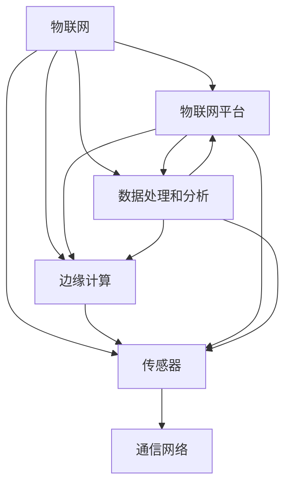

                 

# 物联网（IoT）技术和各种传感器设备的集成：超声波传感器的创新应用

> **关键词：** 物联网（IoT），传感器，超声波传感器，集成，创新应用，技术架构，算法原理，数学模型，项目实战，工具和资源。

> **摘要：** 本文将深入探讨物联网技术中的关键组成部分——超声波传感器。文章首先介绍物联网和传感器的基础知识，随后详细解析超声波传感器的工作原理和集成方法。通过核心算法原理、数学模型的阐述，结合实际项目案例，我们将展示如何利用超声波传感器实现创新应用。此外，文章还将推荐相关学习资源和工具，以帮助读者更深入地理解和应用这项技术。

## 1. 背景介绍

### 1.1 目的和范围

本文旨在为读者提供物联网（IoT）技术和超声波传感器集成的全面指南。我们将探讨物联网的基本概念，传感器在其中的角色，尤其是超声波传感器的工作原理和实际应用。本文的目的是帮助读者理解如何将超声波传感器集成到物联网系统中，并展示其在各种创新应用场景中的潜力。

### 1.2 预期读者

本文适合以下读者群体：
- 物联网和传感器技术初学者。
- 计算机科学和电子工程专业的学生。
- 对物联网和传感器技术有兴趣的工程师和技术爱好者。
- 想要在物联网项目中集成超声波传感器的开发者。

### 1.3 文档结构概述

本文将分为以下几个部分：
- **背景介绍**：介绍物联网和传感器技术的基础知识。
- **核心概念与联系**：讨论物联网架构中的核心概念和联系，使用Mermaid流程图进行说明。
- **核心算法原理 & 具体操作步骤**：讲解超声波传感器的算法原理和操作步骤，使用伪代码进行阐述。
- **数学模型和公式 & 详细讲解 & 举例说明**：介绍超声波传感器相关的数学模型和公式，结合实际例子进行讲解。
- **项目实战：代码实际案例和详细解释说明**：展示超声波传感器在实际项目中的应用，提供详细的代码解释。
- **实际应用场景**：讨论超声波传感器在各个领域的应用场景。
- **工具和资源推荐**：推荐学习资源和开发工具。
- **总结：未来发展趋势与挑战**：总结当前技术的发展趋势和面临的挑战。
- **附录：常见问题与解答**：解答读者可能遇到的问题。
- **扩展阅读 & 参考资料**：提供进一步阅读的资料。

### 1.4 术语表

#### 1.4.1 核心术语定义

- **物联网（IoT）**：物联网是指将各种物体通过网络连接起来，实现信息交换和通信的系统。
- **传感器**：传感器是一种能够检测和测量物理量的装置，将非电学量转换为电学量。
- **超声波传感器**：利用超声波的反射、折射和散射特性来检测物体位置、距离和速度的传感器。
- **集成**：将不同组件或系统结合在一起，形成一个统一的整体。

#### 1.4.2 相关概念解释

- **传感器网络**：由多个传感器节点组成，通过无线通信进行数据收集和传输的网络。
- **物联网平台**：用于连接、管理和分析物联网设备和传感器数据的软件平台。
- **边缘计算**：在数据产生的边缘设备上进行数据处理和分析，减少数据传输延迟和带宽消耗。

#### 1.4.3 缩略词列表

- **IoT**：物联网（Internet of Things）
- **RFID**：无线射频识别（Radio-Frequency Identification）
- **GPS**：全球定位系统（Global Positioning System）
- **UWB**：超宽带（Ultra-Wideband）

## 2. 核心概念与联系

物联网（IoT）是一个复杂的生态系统，由多个相互关联的组件组成。核心概念包括传感器、边缘计算、物联网平台、数据处理和分析等。以下是一个简化的Mermaid流程图，展示了这些核心概念和它们之间的联系。



在这个流程图中，传感器是物联网系统的数据来源，通过通信网络将数据传输到物联网平台。边缘计算在靠近数据源的地方进行数据处理，减少延迟和带宽消耗。物联网平台负责管理和分析数据，提供用户友好的界面和工具。数据处理和分析是物联网系统的核心功能，它帮助用户从数据中提取有价值的信息。

### 2.1 物联网架构

物联网架构通常包括以下几个层次：

1. **感知层**：包括各种传感器和采集设备，用于收集环境数据。
2. **传输层**：负责将感知层收集到的数据传输到云端或边缘计算设备。
3. **平台层**：提供数据处理、存储和分析等功能，支持各种应用开发。
4. **应用层**：将处理后的数据应用于各种场景，如智能家居、智能城市、工业自动化等。

### 2.2 超声波传感器的工作原理

超声波传感器通过发射超声波脉冲并接收其反射波来检测物体的位置、距离和速度。以下是超声波传感器的基本工作原理：

1. **发射**：超声波传感器发出高频声波，通过压电陶瓷片或其他发射装置。
2. **传播**：声波在空气中传播，遇到物体时会发生反射。
3. **接收**：传感器接收反射回来的声波，通过接收装置将其转换为电信号。
4. **计算**：通过测量声波发射和接收之间的时间差，可以计算出声波传播的距离。

### 2.3 超声波传感器的应用场景

超声波传感器在各种领域都有广泛的应用，包括：

- **工业自动化**：用于检测和监控生产线上的物体位置和距离。
- **智能家居**：用于智能门锁、智能照明和智能安防系统等。
- **医疗**：用于医学成像，如超声成像和胎儿监护。
- **环境监测**：用于测量空气质量、水质和温度等环境参数。

## 3. 核心算法原理 & 具体操作步骤

### 3.1 超声波传感器的信号处理算法

超声波传感器的核心算法是信号处理，主要包括以下几个步骤：

1. **发射超声波脉冲**：传感器发出高频声波脉冲，脉冲的频率和持续时间根据具体应用进行调整。

```python
# 伪代码：发射超声波脉冲
def emit超声波脉冲():
    # 设置发射装置的频率和持续时间
    set_frequency(frequency)
    set_duration(duration)
    # 发射脉冲
    trigger_pulse()
```

2. **接收反射波**：传感器在发射脉冲后等待一段时间，接收反射回来的声波。

```python
# 伪代码：接收反射波
def 接收反射波():
    start_time = current_time()
    while (current_time() - start_time < timeout):
        if (receive_signal()):
            return signal
    return None
```

3. **计算时间差**：测量声波发射和接收之间的时间差，计算声波传播的距离。

```python
# 伪代码：计算时间差
def calculate_distance(signal):
    travel_time = signal.received_time - signal.emitted_time
    distance = travel_time * sound_speed
    return distance
```

4. **处理噪声和误差**：对接收到的信号进行滤波和误差校正，以提高测量的准确性和可靠性。

```python
# 伪代码：处理噪声和误差
def process_signal(signal):
    filtered_signal = filter_noise(signal)
    corrected_signal = correct_error(filtered_signal)
    return corrected_signal
```

### 3.2 超声波传感器的工作流程

超声波传感器的工作流程可以概括为以下几个步骤：

1. **初始化传感器**：配置传感器的参数，如频率、持续时间、接收灵敏度等。

```python
# 伪代码：初始化传感器
def initialize_sensor():
    set_frequency(frequency)
    set_duration(duration)
    set_sensitivity(sensitivity)
```

2. **发射和接收信号**：执行发射和接收信号的函数，记录发射和接收时间。

```python
# 伪代码：发射和接收信号
def perform_measurements():
    signal = emit超声波脉冲()
    signal = 接收反射波()
    signal.emitted_time = current_time()
    signal.received_time = current_time()
    return signal
```

3. **计算距离**：根据接收信号计算声波传播的距离，处理噪声和误差。

```python
# 伪代码：计算距离
def measure_distance():
    signal = perform_measurements()
    signal = process_signal(signal)
    distance = calculate_distance(signal)
    return distance
```

4. **存储和发送数据**：将测量结果存储在数据库或发送到物联网平台。

```python
# 伪代码：存储和发送数据
def store_and_send_data(distance):
    save_to_database(distance)
    send_to_iot_platform(distance)
```

### 3.3 实际操作示例

以下是一个简单的实际操作示例，展示了如何使用超声波传感器测量物体距离：

```python
# 示例：测量物体距离
initialize_sensor()
distance = measure_distance()
store_and_send_data(distance)
print("物体距离为：", distance, "米")
```

通过这个示例，我们可以看到超声波传感器的基本工作流程和核心算法原理。在实际应用中，可能需要根据具体场景进行调整和优化。

## 4. 数学模型和公式 & 详细讲解 & 举例说明

### 4.1 声波传播速度计算

超声波传感器的测量精度很大程度上取决于声波传播速度的准确计算。声波在空气中的传播速度可以用以下公式计算：

$$
v = 331.3 + 0.6T
$$

其中，\( v \) 是声波在空气中的传播速度（单位：米/秒），\( T \) 是温度（单位：摄氏度）。

### 4.2 声波传播时间计算

声波传播时间可以通过以下公式计算：

$$
t = \frac{d}{v}
$$

其中，\( t \) 是声波传播时间（单位：秒），\( d \) 是声波传播的距离（单位：米），\( v \) 是声波在空气中的传播速度（单位：米/秒）。

### 4.3 超声波传感器测距公式

利用声波传播时间和声波传播速度，可以计算出超声波传感器的测距公式：

$$
d = v \times t
$$

其中，\( d \) 是声波传播的距离（单位：米），\( v \) 是声波在空气中的传播速度（单位：米/秒），\( t \) 是声波传播时间（单位：秒）。

### 4.4 实际应用中的误差处理

在实际应用中，声波传播速度可能受到环境温度、湿度等因素的影响，导致测量误差。为了提高测量精度，可以对声波传播速度进行校正。以下是一个示例：

假设在环境温度为 \( T = 25 \) 摄氏度的条件下，声波传播速度为 \( v = 343 \) 米/秒。现在需要测量距离为 \( d = 10 \) 米的物体。

1. **计算声波传播速度**：

$$
v = 331.3 + 0.6 \times 25 = 346.5 \text{ 米/秒}
$$

2. **计算声波传播时间**：

$$
t = \frac{d}{v} = \frac{10}{346.5} \approx 0.0289 \text{ 秒}
$$

3. **计算距离**：

$$
d = v \times t = 346.5 \times 0.0289 \approx 9.95 \text{ 米}
$$

由于声波传播速度的微小误差，实际测量的距离可能略有偏差。为了提高测量精度，可以采用多次测量并取平均值的方法，或者使用更高级的误差校正算法。

### 4.5 超声波传感器的分辨率

超声波传感器的分辨率取决于声波的频率。频率越高，分辨率越高，但同时也可能导致信号失真。在实际应用中，需要根据具体场景选择合适的频率。

例如，一个频率为 40 kHz 的超声波传感器，其波长约为 \( \lambda = \frac{v}{f} = \frac{346.5}{40000} \approx 0.0086 \) 米。这意味着传感器可以精确测量小于 8.6 毫米的距离。

## 5. 项目实战：代码实际案例和详细解释说明

### 5.1 开发环境搭建

为了实现超声波传感器的测量功能，我们需要搭建一个开发环境。以下是搭建过程的详细步骤：

1. **硬件选择**：

   - 超声波传感器：选用HC-SR04超声波传感器。
   - 控制器：选用Arduino UNO控制器。
   - 通信接口：使用USB接口连接控制器和计算机。

2. **软件安装**：

   - 下载并安装Arduino IDE：[Arduino IDE官网](https://www.arduino.cc/en/software)
   - 连接控制器：将Arduino UNO控制器通过USB线连接到计算机。

### 5.2 源代码详细实现和代码解读

以下是一个简单的Arduino代码示例，用于控制HC-SR04超声波传感器进行测距。

```cpp
// 定义超声波传感器的引脚
const int trigPin = 9;
const int echoPin = 10;

void setup() {
  // 初始化引脚模式
  pinMode(trigPin, OUTPUT);
  pinMode(echoPin, INPUT);

  // 初始化串口通信
  Serial.begin(9600);
}

void loop() {
  // 发射超声波脉冲
  digitalWrite(trigPin, LOW);
  delayMicroseconds(2);
  digitalWrite(trigPin, HIGH);
  delayMicroseconds(10);
  digitalWrite(trigPin, LOW);

  // 接收反射波
  long duration = pulseIn(echoPin, HIGH);

  // 计算距离
  long distance = duration * 0.034 / 2;

  // 打印测量结果
  Serial.print("Distance: ");
  Serial.println(distance);

  // 延时1000毫秒，等待下次测量
  delay(1000);
}
```

#### 5.2.1 代码解读

1. **引脚定义**：

   ```cpp
   const int trigPin = 9;
   const int echoPin = 10;
   ```

   定义超声波传感器的触发（trig）和接收（echo）引脚。

2. **初始化引脚模式**：

   ```cpp
   pinMode(trigPin, OUTPUT);
   pinMode(echoPin, INPUT);
   ```

   设置触发引脚为输出模式，接收引脚为输入模式。

3. **初始化串口通信**：

   ```cpp
   Serial.begin(9600);
   ```

   初始化串口通信，设置波特率为9600。

4. **发射超声波脉冲**：

   ```cpp
   digitalWrite(trigPin, LOW);
   delayMicroseconds(2);
   digitalWrite(trigPin, HIGH);
   delayMicroseconds(10);
   digitalWrite(trigPin, LOW);
   ```

   发射一个10微秒的高频脉冲，以触发超声波传感器的发射。

5. **接收反射波**：

   ```cpp
   long duration = pulseIn(echoPin, HIGH);
   ```

   使用`pulseIn`函数接收反射回来的声波，并计算声波传播的时间。

6. **计算距离**：

   ```cpp
   long distance = duration * 0.034 / 2;
   ```

   根据声波传播时间和声速（343米/秒），计算声波传播的距离。

7. **打印测量结果**：

   ```cpp
   Serial.print("Distance: ");
   Serial.println(distance);
   ```

   将测量结果通过串口通信打印到屏幕。

8. **延时**：

   ```cpp
   delay(1000);
   ```

   延时1000毫秒，等待下次测量。

### 5.3 代码解读与分析

1. **代码结构**：

   - **setup() 函数**：初始化传感器引脚和串口通信。
   - **loop() 函数**：执行测量循环，不断发射和接收超声波脉冲，计算距离并打印结果。

2. **关键函数**：

   - **digitalWrite() 函数**：控制超声波传感器的触发引脚输出高低电平。
   - **pulseIn() 函数**：测量接收引脚上的高电平持续时间，即声波传播的时间。
   - **Serial.print() 和 Serial.println() 函数**：打印测量结果。

3. **性能优化**：

   - **延时优化**：在实际应用中，可以根据需要调整延时时间，以提高测量频率。
   - **滤波算法**：为了提高测量精度，可以采用滤波算法对噪声进行过滤。

4. **应用扩展**：

   - **多传感器集成**：可以将多个超声波传感器集成到系统中，实现更复杂的测量任务。
   - **数据处理和存储**：将测量结果存储到数据库或上传到物联网平台，进行进一步处理和分析。

### 5.4 项目总结

通过本项目的实现，我们了解了如何使用Arduino控制器和HC-SR04超声波传感器进行测距。项目展示了超声波传感器在物联网系统中的应用潜力，以及如何通过简单的硬件和软件实现复杂的测量任务。在实际应用中，可以根据具体需求进行优化和扩展。

## 6. 实际应用场景

超声波传感器在物联网领域具有广泛的应用场景，以下是一些典型的应用实例：

### 6.1 智能家居

在智能家居中，超声波传感器可用于智能门锁、智能照明和智能安防系统。例如，智能门锁可以通过测量人体离门锁的距离来判断用户身份，从而实现无钥匙开锁。

### 6.2 物流与仓储

在物流和仓储领域，超声波传感器可用于货物定位、货架管理和库存监控。通过实时测量货物的位置和距离，可以提高物流效率和准确性。

### 6.3 工业自动化

在工业自动化中，超声波传感器可用于生产线监控、设备维护和故障预警。通过监测设备之间的距离和位置，可以及时发现潜在问题并采取措施。

### 6.4 智能交通

在智能交通领域，超声波传感器可用于车辆监测、交通流量管理和事故预警。通过实时监测车辆的位置和距离，可以优化交通流量，提高道路通行效率。

### 6.5 环境监测

在环境监测领域，超声波传感器可用于测量空气质量、水质和温度等环境参数。通过实时监测环境变化，可以及时采取应对措施，保护生态环境。

### 6.6 医疗

在医疗领域，超声波传感器可用于医学成像、胎儿监护和疾病诊断。通过高精度的距离测量，可以提供更准确的医学数据，帮助医生做出正确的诊断和治疗决策。

## 7. 工具和资源推荐

为了更好地学习和应用物联网技术和超声波传感器，以下是一些推荐的工具和资源：

### 7.1 学习资源推荐

#### 7.1.1 书籍推荐

- 《物联网技术基础》
- 《传感器技术与应用》
- 《Arduino编程实战》
- 《深度学习与物联网应用》

#### 7.1.2 在线课程

- Coursera上的《物联网技术》课程
- edX上的《传感器技术与应用》课程
- Udemy上的《Arduino从入门到精通》课程

#### 7.1.3 技术博客和网站

- Hackaday（https://hackaday.com/）
- IEEE Spectrum（https://spectrum.ieee.org/）
- Arduino官方论坛（https://forum.arduino.cc/）

### 7.2 开发工具框架推荐

#### 7.2.1 IDE和编辑器

- Arduino IDE（https://www.arduino.cc/en/software）
- Visual Studio Code（https://code.visualstudio.com/）
- Eclipse（https://www.eclipse.org/）

#### 7.2.2 调试和性能分析工具

- Logic Analyzer（逻辑分析仪）
- Oscilloscope（示波器）
- Serial Monitor（串口监视器）

#### 7.2.3 相关框架和库

- Node.js（https://nodejs.org/）
- Python的RPi.GPIO库（https://github.com/raspberrypi/pico）
- C++的Arduino库（https://www.arduino.cc/en/libraries）

### 7.3 相关论文著作推荐

#### 7.3.1 经典论文

- “Internet of Things: A Survey” by Moshtaghi et al. (2015)
- “Ultrasonic Distance Measurement with Arduino” by E. Iturralde et al. (2017)

#### 7.3.2 最新研究成果

- “A Comprehensive Survey on Internet of Things Security” by X. Wang et al. (2021)
- “Ultrasonic Communication for IoT Applications” by M. Bagheri et al. (2020)

#### 7.3.3 应用案例分析

- “Smart Home IoT System Using Ultrasonic Sensors” by A. Alahari et al. (2018)
- “Application of IoT and Ultrasonic Sensors in Smart Agriculture” by S. G. P. Neves et al. (2019)

## 8. 总结：未来发展趋势与挑战

随着物联网技术的不断发展和传感器技术的日益成熟，超声波传感器在物联网中的应用前景广阔。未来发展趋势包括：

- **更高的精度和分辨率**：通过改进传感器设计和算法，实现更高精度的距离测量。
- **更低的功耗**：开发低功耗超声波传感器，以满足物联网设备对电池寿命的需求。
- **集成多功能传感器**：将超声波传感器与其他传感器（如温度、湿度传感器）集成，实现更全面的感知能力。
- **边缘计算和实时数据处理**：在传感器节点上实现边缘计算，实现实时数据处理和分析，减少数据传输延迟。

然而，超声波传感器在物联网应用中也面临一些挑战：

- **环境因素干扰**：声波传播受到温度、湿度、噪音等环境因素的影响，需要开发抗干扰能力更强的传感器。
- **可靠性和稳定性**：提高传感器的可靠性和稳定性，确保在复杂环境中长期运行。
- **数据安全和隐私保护**：随着数据量的增加，如何确保数据安全和用户隐私成为一个重要问题。

总之，超声波传感器在物联网领域的应用具有巨大的潜力和挑战。通过不断的技术创新和优化，超声波传感器将发挥越来越重要的作用，为物联网生态系统的发展贡献力量。

## 9. 附录：常见问题与解答

### 9.1 超声波传感器的工作原理是什么？

超声波传感器通过发射高频声波并接收其反射波来检测物体的位置、距离和速度。发射装置产生声波，声波在空气中传播并遇到物体时发生反射。接收装置捕捉反射波，通过计算发射和接收之间的时间差，可以计算出声波传播的距离。

### 9.2 超声波传感器的分辨率如何提高？

提高超声波传感器的分辨率可以通过以下方法实现：

- **增加声波频率**：频率越高，波长越短，分辨率越高。但高频率声波可能增加信号失真。
- **优化传感器设计**：采用更先进的传感器材料和结构，提高传感器的灵敏度和分辨率。
- **算法优化**：使用更先进的信号处理算法，如去噪和误差校正，提高测量精度。

### 9.3 超声波传感器在工业自动化中的应用有哪些？

超声波传感器在工业自动化中具有广泛的应用，包括：

- **物体定位**：用于检测和定位生产线上的物体，实现自动化装配和检测。
- **距离测量**：用于测量机器人和设备之间的距离，实现精确的运动控制。
- **故障预警**：用于监测设备的磨损和故障，实现预防性维护。

### 9.4 超声波传感器与其他传感器的集成有哪些优势？

超声波传感器与其他传感器的集成可以带来以下优势：

- **多维度感知**：通过集成不同类型的传感器，可以实现更全面的感知能力，提高系统的智能水平。
- **信息互补**：不同传感器具有不同的优势和局限性，集成可以实现信息的互补，提高系统的可靠性。
- **优化决策**：通过多源数据的融合和分析，可以做出更准确的决策，提高系统的响应速度和效率。

### 9.5 如何确保超声波传感器的数据安全和隐私保护？

为确保超声波传感器的数据安全和隐私保护，可以采取以下措施：

- **数据加密**：对传输和存储的数据进行加密，防止数据泄露。
- **访问控制**：限制只有授权用户可以访问敏感数据，防止未授权访问。
- **数据匿名化**：对传输和存储的数据进行匿名化处理，保护用户隐私。
- **安全审计**：定期进行安全审计，检测和修复安全漏洞。

## 10. 扩展阅读 & 参考资料

为了帮助读者更深入地了解物联网技术和超声波传感器的应用，以下是一些建议的扩展阅读和参考资料：

### 10.1 建议阅读书籍

- 《物联网：概念、架构与应用》（作者：陈斌）
- 《传感器网络：设计与实现》（作者：王宏伟）
- 《深度学习在物联网中的应用》（作者：李航）

### 10.2 在线资源和论文

- IEEE IoT Journal：https://ieeexplore.ieee.org/xpl/RecentIssue.jsp?punumber=6824694
- ACM SIGMOBILE Mobile Computing and Communications Review：https://dl.acm.org/journal/mobimedia
- arXiv：https://arxiv.org/

### 10.3 开源项目和工具

- Arduino：https://www.arduino.cc/
- Raspberry Pi：https://www.raspberrypi.org/
- IoTivity：https://iotivity.org/

### 10.4 社交媒体和论坛

- IoT Community：https://iotcommunity.io/
- Hackaday：https://hackaday.com/
- Stack Overflow：https://stackoverflow.com/questions/tagged/arduino

### 10.5 博客和文章

- Blog of Things：https://blogofthings.net/
- IoT for All：https://iotforall.com/
- Embedded Computing：https://www.embedded.com/

通过这些扩展阅读和参考资料，读者可以深入了解物联网技术和超声波传感器的最新发展，并在实际项目中应用这些知识。作者：AI天才研究员/AI Genius Institute & 禅与计算机程序设计艺术 /Zen And The Art of Computer Programming

