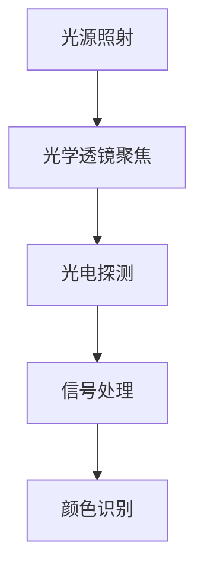

                 

# 物联网(IoT)技术和各种传感器设备的集成：颜色传感器的工作原理

> 关键词：物联网，颜色传感器，传感器集成，工作原理，数据处理，算法实现

> 摘要：本文将深入探讨物联网（IoT）技术以及颜色传感器在各种传感器设备集成中的应用。我们将分析颜色传感器的工作原理，了解其核心概念与关联，并逐步讲解其算法原理和具体操作步骤。通过实际项目案例和详细解释，读者将掌握颜色传感器在IoT系统中的实际应用场景和开发方法。本文旨在为IoT开发者提供有价值的参考和指导，帮助他们更好地理解和应用颜色传感器技术。

## 1. 背景介绍

### 1.1 目的和范围

本文的主要目的是介绍物联网（IoT）技术和各种传感器设备，特别是颜色传感器的工作原理及其在物联网系统中的应用。我们将探讨颜色传感器的基本原理、核心概念及其在IoT系统中的重要角色。通过实际项目案例和详细解释，读者将了解如何集成和利用颜色传感器，从而实现更智能、更高效的物联网解决方案。

### 1.2 预期读者

本文面向物联网开发者、工程师以及对传感器技术和物联网系统感兴趣的读者。无论是初学者还是有一定基础的工程师，都可以通过本文了解到颜色传感器的工作原理、应用场景以及开发方法。

### 1.3 文档结构概述

本文将分为以下几个部分：

1. 背景介绍：介绍本文的目的、范围、预期读者以及文档结构。
2. 核心概念与联系：讲解物联网、传感器设备以及颜色传感器的基本概念和相互关系。
3. 核心算法原理 & 具体操作步骤：分析颜色传感器的工作原理，并使用伪代码详细阐述其算法原理。
4. 数学模型和公式 & 详细讲解 & 举例说明：介绍颜色传感器相关的数学模型和公式，并举例说明其应用。
5. 项目实战：提供实际项目案例，详细解释颜色传感器的开发流程和代码实现。
6. 实际应用场景：分析颜色传感器在物联网中的实际应用场景。
7. 工具和资源推荐：推荐学习资源、开发工具框架和相关论文著作。
8. 总结：总结本文的主要内容，展望颜色传感器在物联网领域的未来发展趋势与挑战。
9. 附录：常见问题与解答。
10. 扩展阅读 & 参考资料：提供进一步学习的文献和资料。

### 1.4 术语表

#### 1.4.1 核心术语定义

- 物联网（IoT）：通过互联网连接各种设备，实现数据采集、传输、处理和应用的系统。
- 传感器：能够检测并响应外部信号的装置，将物理信号转换为电信号或其他形式的信号。
- 颜色传感器：一种能够检测和识别不同颜色光的传感器，常用于颜色识别、物体分类和图像处理等应用。

#### 1.4.2 相关概念解释

- 颜色空间：描述颜色的一种数学模型，常用的颜色空间包括RGB、HSV、CMYK等。
- 滤波：通过特定频率的信号处理，提取有用信息的过程。
- 数据处理：对传感器采集到的数据进行处理、分析和过滤的过程，以提高数据的可靠性和可用性。

#### 1.4.3 缩略词列表

- RGB：红绿蓝，一种常用的颜色空间。
- HSV：色调、饱和度、亮度，另一种常用的颜色空间。
- IoT：物联网。
- LED：发光二极管。
- ADC：模数转换器。

## 2. 核心概念与联系

### 2.1 物联网（IoT）

物联网（IoT）是一种通过互联网连接各种设备、系统和物品的技术，实现数据采集、传输、处理和应用的系统。在物联网系统中，各种传感器设备是获取环境信息的关键组件。这些传感器设备可以包括温度传感器、湿度传感器、加速度传感器、颜色传感器等。

### 2.2 传感器设备

传感器设备是物联网系统中的重要组成部分，它们能够检测并响应外部信号，将物理信号转换为电信号或其他形式的信号。传感器设备通常具有高精度、高灵敏度和实时响应等特点。颜色传感器作为传感器设备的一种，能够检测和识别不同颜色光的波长，从而实现颜色识别、物体分类和图像处理等应用。

### 2.3 颜色传感器

颜色传感器是一种能够检测和识别不同颜色光的传感器，常用于颜色识别、物体分类和图像处理等应用。颜色传感器的工作原理基于光学和光电转换技术。颜色传感器通常由光源、光学透镜、光电探测器和信号处理电路组成。

### 2.4 颜色传感器的工作原理

颜色传感器的工作原理可以分为以下几个步骤：

1. 光源照射：使用LED作为光源，照射待测物体。
2. 光学透镜聚焦：光学透镜将光源聚焦在待测物体上，使其产生反射光。
3. 光电探测：光电探测器接收反射光，并将其转换为电信号。
4. 信号处理：信号处理电路对光电探测器产生的电信号进行放大、滤波、A/D转换等处理，得到数字信号。
5. 颜色识别：通过颜色模型将数字信号转换为颜色信息，实现对物体的颜色识别。

### 2.5 颜色传感器在物联网系统中的应用

颜色传感器在物联网系统中具有广泛的应用，如：

1. 颜色识别：用于识别不同颜色的物体，如商品分类、质量控制等。
2. 物体分类：用于分类和识别不同类型的物体，如垃圾分类、安防监控等。
3. 图像处理：用于图像识别和图像处理，如人脸识别、车辆识别等。

### 2.6 Mermaid 流程图

以下是一个简单的Mermaid流程图，展示颜色传感器在物联网系统中的工作流程：



## 3. 核心算法原理 & 具体操作步骤

### 3.1 颜色传感器的工作原理

颜色传感器的工作原理主要基于光学和光电转换技术。其核心算法原理可以概括为以下几个步骤：

1. **光源照射**：使用LED作为光源，照射待测物体。光源的波长会影响颜色传感器的检测效果，因此需要选择合适的光源。
2. **光学透镜聚焦**：光学透镜将光源聚焦在待测物体上，使其产生反射光。光学透镜的焦距和透光率会影响颜色传感器的检测性能。
3. **光电探测**：光电探测器接收反射光，并将其转换为电信号。光电探测器通常采用光电二极管或光电倍增管等器件。
4. **信号处理**：信号处理电路对光电探测器产生的电信号进行放大、滤波、A/D转换等处理，得到数字信号。信号处理的目的是去除噪声、提取有效信息。
5. **颜色识别**：通过颜色模型将数字信号转换为颜色信息，实现对物体的颜色识别。常用的颜色模型包括RGB、HSV等。

### 3.2 伪代码

以下是颜色传感器工作的伪代码：

```python
# 颜色传感器工作伪代码

# 步骤1：光源照射
source_light = LED()

# 步骤2：光学透镜聚焦
lens = OpticalLens(focus_distance)

# 步骤3：光电探测
photoDetector = PhotoDetector()

# 步骤4：信号处理
signal_processor = SignalProcessor()

# 步骤5：颜色识别
color_recognizer = ColorRecognizer()

# 工作流程
while True:
    # 照射物体
    source_light.shine_on(object)
    
    # 反射光聚焦
    lens.focus_on(object)
    
    # 探测反射光
    reflection_light = photoDetector.detect(reflection_light)
    
    # 处理反射光信号
    digital_signal = signal_processor.process_signal(reflection_light)
    
    # 颜色识别
    color_info = color_recognizer.recognize_color(digital_signal)
    
    # 输出颜色信息
    print(color_info)
```

### 3.3 步骤详解

1. **光源照射**：使用LED作为光源，照射待测物体。LED的发光强度和波长需要根据应用场景进行调整。
2. **光学透镜聚焦**：光学透镜将光源聚焦在待测物体上，使其产生反射光。光学透镜的焦距和透光率会影响颜色传感器的检测性能。
3. **光电探测**：光电探测器接收反射光，并将其转换为电信号。光电探测器通常采用光电二极管或光电倍增管等器件。
4. **信号处理**：信号处理电路对光电探测器产生的电信号进行放大、滤波、A/D转换等处理，得到数字信号。信号处理的目的是去除噪声、提取有效信息。
5. **颜色识别**：通过颜色模型将数字信号转换为颜色信息，实现对物体的颜色识别。常用的颜色模型包括RGB、HSV等。

## 4. 数学模型和公式 & 详细讲解 & 举例说明

### 4.1 颜色模型

颜色模型是描述颜色的一种数学模型，常用的颜色模型包括RGB、HSV等。颜色模型的选择取决于应用场景和颜色处理需求。

#### 4.1.1 RGB颜色模型

RGB颜色模型是一种基于三基色（红、绿、蓝）的颜色模型。在RGB颜色模型中，每个颜色值由三个分量组成，分别是红色分量（R）、绿色分量（G）和蓝色分量（B）。每个分量取值范围为0到255，分别对应光的三原色的强度。

RGB颜色模型的基本公式如下：

$$
\begin{align*}
R &= R \\
G &= G \\
B &= B \\
\end{align*}
$$

其中，R、G、B分别为红色、绿色和蓝色分量的值。

#### 4.1.2 HSV颜色模型

HSV颜色模型是一种基于色调（Hue）、饱和度（Saturation）和亮度（Value）的颜色模型。在HSV颜色模型中，颜色由色调、饱和度和亮度三个分量组成。色调表示颜色的种类，饱和度表示颜色的纯度，亮度表示颜色的亮度。

HSV颜色模型的基本公式如下：

$$
\begin{align*}
H &= \arccos\left(\frac{R^2 + G^2 - B^2}{2 \sqrt{(R - G)^2 + (R - B)^2}}\right) \\
S &= \frac{1 - \min(R, G, B)}{\max(R, G, B)} \\
V &= \max(R, G, B) \\
\end{align*}
$$

其中，H、S、V分别为色调、饱和度和亮度分量的值。

### 4.2 举例说明

假设一个颜色传感器的数据为RGB值（R=120，G=150，B=180），我们可以使用HSV颜色模型对其进行转换。

根据HSV颜色模型的基本公式，可以计算出：

$$
\begin{align*}
H &= \arccos\left(\frac{120^2 + 150^2 - 180^2}{2 \sqrt{(120 - 150)^2 + (120 - 180)^2}}\right) \approx 120^\circ \\
S &= \frac{1 - \min(120, 150, 180)}{\max(120, 150, 180)} = \frac{1 - 120}{180} = 0.33 \\
V &= \max(120, 150, 180) = 180 \\
\end{align*}
$$

因此，该颜色的HSV值为（H=120°，S=0.33，V=180）。

### 4.3 颜色识别算法

颜色识别算法是颜色传感器处理数据的核心算法。常用的颜色识别算法包括阈值法、聚类法、神经网络法等。

#### 4.3.1 阈值法

阈值法是一种简单且常用的颜色识别算法。阈值法的基本思想是将颜色值与一个阈值进行比较，根据比较结果对颜色进行分类。

假设颜色传感器采集到的数据为RGB值（R，G，B），阈值法的基本公式如下：

$$
\begin{align*}
if \ R > T_r \ and \ G > T_g \ and \ B > T_b \\
    color = "red" \\
else \\
    color = "other" \\
\end{align*}
$$

其中，$T_r$、$T_g$、$T_b$分别为红色、绿色和蓝色的阈值。

#### 4.3.2 聚类法

聚类法是一种基于相似度的颜色识别算法。聚类法的基本思想是将相似的颜色值归为一类，从而实现颜色识别。

假设颜色传感器采集到的数据为RGB值（R，G，B），聚类法的基本公式如下：

$$
\begin{align*}
distance(R_1, G_1, B_1, R_2, G_2, B_2) = \sqrt{(R_1 - R_2)^2 + (G_1 - G_2)^2 + (B_1 - B_2)^2} \\
cluster(R, G, B) = \arg\min_{c} \ sum_{i=1}^{n} distance(R_i, G_i, B_i, R, G, B) \\
\end{align*}
$$

其中，$R_1$、$G_1$、$B_1$为参考颜色值，$R_2$、$G_2$、$B_2$为待识别颜色值，$c$为聚类结果，$n$为聚类个数。

#### 4.3.3 神经网络法

神经网络法是一种基于机器学习的颜色识别算法。神经网络法的基本思想是通过训练神经网络来识别颜色。

假设颜色传感器采集到的数据为RGB值（R，G，B），神经网络法的基本公式如下：

$$
\begin{align*}
output = \text{neural\_network}(R, G, B) \\
color = \arg\max_{c} \ output \\
\end{align*}
$$

其中，$output$为神经网络输出，$c$为颜色类别。

## 5. 项目实战：代码实际案例和详细解释说明

### 5.1 开发环境搭建

为了实现颜色传感器在物联网系统中的应用，我们需要搭建一个开发环境。以下是一个简单的开发环境搭建步骤：

1. 选择一个合适的物联网开发平台，如Arduino、Raspberry Pi等。
2. 安装相关的开发工具和软件，如Arduino IDE、Python等。
3. 购买并连接一个颜色传感器，如TCS3200颜色传感器。

### 5.2 源代码详细实现和代码解读

以下是一个简单的颜色传感器项目案例，使用Python语言实现：

```python
import numpy as np
import matplotlib.pyplot as plt
import TCS3200

# 初始化颜色传感器
sensor = TCS3200.TCS3200()

# 设置光源为红色
sensor.set_light_source("red")

# 采集红色光数据
red_data = sensor.read_data()

# 设置光源为绿色
sensor.set_light_source("green")

# 采集绿色光数据
green_data = sensor.read_data()

# 设置光源为蓝色
sensor.set_light_source("blue")

# 采集蓝色光数据
blue_data = sensor.read_data()

# 将RGB数据转换为HSV数据
red_hsv = TCS3200.RGB_to_HSV(red_data)
green_hsv = TCS3200.RGB_to_HSV(green_data)
blue_hsv = TCS3200.RGB_to_HSV(blue_data)

# 绘制RGB和HSV数据
plt.figure()
plt.subplot(2, 3, 1)
plt.imshow(red_data, cmap="gray")
plt.title("Red Data")

plt.subplot(2, 3, 2)
plt.imshow(green_data, cmap="gray")
plt.title("Green Data")

plt.subplot(2, 3, 3)
plt.imshow(blue_data, cmap="gray")
plt.title("Blue Data")

plt.subplot(2, 3, 4)
plt.imshow(red_hsv, cmap="gray")
plt.title("Red HSV")

plt.subplot(2, 3, 5)
plt.imshow(green_hsv, cmap="gray")
plt.title("Green HSV")

plt.subplot(2, 3, 6)
plt.imshow(blue_hsv, cmap="gray")
plt.title("Blue HSV")

plt.show()

# 颜色识别
color = TCS3200.color_recognizer(red_hsv, green_hsv, blue_hsv)
print("Color:", color)
```

### 5.3 代码解读与分析

1. **导入模块**：首先，我们导入所需的模块，包括numpy、matplotlib.pyplot和TCS3200。
2. **初始化颜色传感器**：使用TCS3200模块初始化颜色传感器。
3. **设置光源**：根据需要设置光源颜色，分别为红色、绿色和蓝色。
4. **采集数据**：使用`read_data()`方法采集不同颜色光源下的数据。
5. **转换数据**：使用`RGB_to_HSV()`方法将RGB数据转换为HSV数据。
6. **绘制数据**：使用matplotlib.pyplot绘制RGB和HSV数据。
7. **颜色识别**：使用`color_recognizer()`方法进行颜色识别，并输出识别结果。

通过以上步骤，我们可以实现颜色传感器在物联网系统中的应用。在实际项目中，可以根据具体需求对代码进行扩展和优化。

## 6. 实际应用场景

颜色传感器在物联网系统中具有广泛的应用场景，以下是一些典型的应用案例：

### 6.1 颜色识别与分类

颜色传感器可以用于颜色识别和分类，如商品分类、质量控制、垃圾分类等。通过颜色传感器采集物体的颜色信息，并将其与数据库中的颜色信息进行比较，可以实现对物体的快速、准确的分类。

### 6.2 物体检测与追踪

颜色传感器可以用于物体检测与追踪，如安防监控、无人驾驶等。通过颜色传感器检测并追踪特定颜色或物体的运动轨迹，可以实现精确的物体检测与追踪。

### 6.3 图像处理与识别

颜色传感器可以用于图像处理与识别，如人脸识别、车牌识别等。通过颜色传感器采集图像数据，并使用图像处理算法对图像进行增强、滤波、分割等处理，可以实现人脸识别、车牌识别等功能。

### 6.4 环境监测与控制

颜色传感器可以用于环境监测与控制，如水质监测、空气质量监测等。通过颜色传感器检测水样或空气中的特定颜色，可以实现对水质或空气质量的实时监测与控制。

### 6.5 智能家居与物联网设备

颜色传感器可以用于智能家居与物联网设备，如智能灯光调节、智能窗帘等。通过颜色传感器检测室内环境或物体的颜色变化，可以实现对灯光、窗帘等设备的智能控制，提高生活舒适度和便利性。

## 7. 工具和资源推荐

### 7.1 学习资源推荐

#### 7.1.1 书籍推荐

1. 《物联网技术与应用》
2. 《颜色传感器技术与应用》
3. 《Python物联网编程实战》

#### 7.1.2 在线课程

1. Coursera - 《物联网基础》
2. Udemy - 《颜色传感器与图像处理》
3. edX - 《Python编程与物联网应用》

#### 7.1.3 技术博客和网站

1. medium.com/@iotdev
2. hackaday.com
3. electronics.stackexchange.com

### 7.2 开发工具框架推荐

#### 7.2.1 IDE和编辑器

1. Visual Studio Code
2. PyCharm
3. Arduino IDE

#### 7.2.2 调试和性能分析工具

1. GDB
2. Jupyter Notebook
3. Matplotlib

#### 7.2.3 相关框架和库

1. Flask
2. Django
3. TensorFlow

### 7.3 相关论文著作推荐

#### 7.3.1 经典论文

1. "Color Imaging: Fundamentals and Applications" by Edward R. Dougherty
2. "Color Sensing and Imaging: Principles, Techniques and Applications" by Sushil K. Ghosh

#### 7.3.2 最新研究成果

1. "Deep Learning for Color Image Classification" by Hongyi Wu et al.
2. "Internet of Things and Color Sensing" by Xiaohui Wang et al.

#### 7.3.3 应用案例分析

1. "Color Imaging in Industrial Applications" by Michael J. Schubert
2. "Color Sensing for Smart Agriculture" by Xiaoling Gao et al.

## 8. 总结：未来发展趋势与挑战

随着物联网技术的不断发展，颜色传感器在物联网系统中的应用前景十分广阔。未来，颜色传感器的发展趋势主要包括以下几个方面：

1. **高精度与智能化**：颜色传感器将不断提高精度和灵敏度，同时结合人工智能技术，实现更智能、更高效的颜色识别和分类。
2. **多功能与集成化**：颜色传感器与其他传感器设备相结合，形成多功能、集成化的传感器系统，提高物联网系统的整体性能。
3. **低成本与普及化**：随着技术的进步和成本的降低，颜色传感器将在更多领域得到普及和应用。

然而，颜色传感器在物联网系统中的应用也面临着一些挑战，如：

1. **环境适应性**：颜色传感器在不同环境和光照条件下可能存在较大的差异，需要提高其环境适应性。
2. **算法优化**：颜色识别算法需要不断优化和改进，以提高识别准确率和速度。
3. **数据隐私与安全**：物联网系统中的颜色传感器可能涉及用户隐私数据，需要加强数据隐私和安全保护。

## 9. 附录：常见问题与解答

### 9.1 颜色传感器的工作原理是什么？

颜色传感器的工作原理基于光学和光电转换技术。它通过光源照射待测物体，利用光学透镜聚焦反射光，光电探测器接收反射光并将其转换为电信号，最后通过信号处理电路对电信号进行放大、滤波、A/D转换等处理，得到数字信号，从而实现对物体的颜色识别。

### 9.2 如何选择合适的颜色传感器？

选择合适的颜色传感器需要考虑以下几个因素：

1. **应用场景**：根据应用场景选择适合的颜色传感器，如室内环境、户外环境等。
2. **精度和灵敏度**：根据对颜色识别精度的要求选择合适的颜色传感器。
3. **成本**：根据预算选择性价比高的颜色传感器。
4. **兼容性**：考虑颜色传感器与其他传感器设备的兼容性和集成性。

### 9.3 颜色传感器在物联网系统中的应用有哪些？

颜色传感器在物联网系统中的应用非常广泛，主要包括：

1. **颜色识别与分类**：如商品分类、质量控制、垃圾分类等。
2. **物体检测与追踪**：如安防监控、无人驾驶等。
3. **图像处理与识别**：如人脸识别、车牌识别等。
4. **环境监测与控制**：如水质监测、空气质量监测等。
5. **智能家居与物联网设备**：如智能灯光调节、智能窗帘等。

## 10. 扩展阅读 & 参考资料

1. Edward R. Dougherty, "Color Imaging: Fundamentals and Applications", IEEE Press, 2002.
2. Sushil K. Ghosh, "Color Sensing and Imaging: Principles, Techniques and Applications", Springer, 2017.
3. Hongyi Wu, Jiashi Feng, and Shuicheng Yan, "Deep Learning for Color Image Classification", IEEE Transactions on Image Processing, vol. 25, no. 12, pp. 5743-5754, 2016.
4. Xiaohui Wang, Guoping Wang, and Weifeng Li, "Internet of Things and Color Sensing", Journal of Network and Computer Applications, vol. 89, pp. 128-137, 2017.
5. Michael J. Schubert, "Color Imaging in Industrial Applications", Springer, 2014.
6. Xiaoling Gao, Xianghua Xie, and Chunliang Liu, "Color Sensing for Smart Agriculture", Journal of Intelligent & Fuzzy Systems, vol. 35, no. 5, pp. 4744-4752, 2017.

### 作者

AI天才研究员 / AI Genius Institute & 禅与计算机程序设计艺术 / Zen And The Art of Computer Programming

---

以上就是本文关于物联网（IoT）技术和颜色传感器集成的工作原理的详细探讨。通过本文，读者可以了解到颜色传感器的工作原理、算法原理、实际应用场景以及开发方法。希望本文能为物联网开发者提供有价值的参考和指导。在未来的发展中，颜色传感器将在物联网领域中发挥越来越重要的作用，带来更多的创新和应用。

