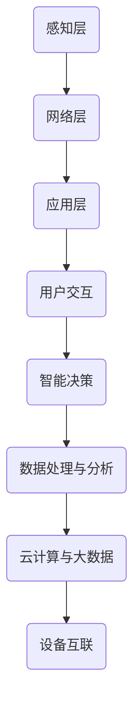

                 

# 物联网创业：连接智能生活的无限可能

> 关键词：物联网、智能生活、创业、技术趋势、生态系统、商业模式、案例分析

> 摘要：本文将深入探讨物联网（IoT）技术在创业领域的应用，分析其潜在的商业机会、技术挑战和成功案例。通过对物联网核心概念、架构、算法、数学模型以及实际应用的详细讲解，帮助读者理解物联网如何连接智能生活，并激发创业灵感。

## 1. 背景介绍

### 1.1 目的和范围

本文旨在为希望进入物联网领域的创业者提供一套系统的指导。我们将探讨物联网的定义、发展历程、技术架构，并分析在物联网创业过程中可能遇到的挑战和机遇。文章将通过案例分析展示成功的物联网创业项目，最后提出未来发展的趋势和潜在挑战。

### 1.2 预期读者

本文面向对物联网有兴趣的创业者、技术开发者、企业家以及对智能生活感兴趣的普通读者。通过阅读本文，读者可以了解物联网技术的核心概念、应用场景以及创业策略。

### 1.3 文档结构概述

本文分为十个部分：

1. 背景介绍
2. 核心概念与联系
3. 核心算法原理 & 具体操作步骤
4. 数学模型和公式 & 详细讲解 & 举例说明
5. 项目实战：代码实际案例和详细解释说明
6. 实际应用场景
7. 工具和资源推荐
8. 总结：未来发展趋势与挑战
9. 附录：常见问题与解答
10. 扩展阅读 & 参考资料

### 1.4 术语表

#### 1.4.1 核心术语定义

- 物联网（IoT）：通过互联网将物理设备连接起来，实现信息的自动交换和通信。
- 智能设备：具备感知、决策、执行等功能的设备，可以通过物联网进行互联。
- 平台化：通过建立统一的平台，连接不同的设备和应用，提供增值服务。
- 系统集成：将不同的硬件、软件和通信技术整合在一起，形成完整的解决方案。

#### 1.4.2 相关概念解释

- 感知层：负责数据采集，包括传感器、摄像头等设备。
- 网络层：负责数据传输，包括有线和无线通信技术。
- 应用层：负责数据处理和分析，提供用户交互和应用服务。
- 云计算：通过互联网提供动态易扩展且经常是虚拟化的资源。

#### 1.4.3 缩略词列表

- IoT：物联网
- AI：人工智能
- ML：机器学习
- MQTT：消息队列遥测传输协议
- LPWAN：低功耗广域网

## 2. 核心概念与联系

物联网的核心在于将物理世界与数字世界相连接，实现智能化的信息交换和处理。为了更好地理解物联网的运作原理，我们需要从其架构和核心概念出发。

### 2.1 物联网架构

物联网的架构通常分为三层：感知层、网络层和应用层。

#### 感知层

感知层是物联网的基础，主要负责数据采集。通过各种传感器（如温度传感器、湿度传感器、摄像头等）收集环境数据，并将数据转换为数字信号。

#### 网络层

网络层负责数据的传输和通信。物联网设备可以通过有线（如以太网、光纤）或无线（如Wi-Fi、蓝牙、Zigbee、LoRa等）方式进行连接。这些通信技术需要具备低延迟、高可靠性和低功耗的特点，以满足物联网设备的需求。

#### 应用层

应用层是物联网的“大脑”，负责数据处理和分析，提供用户交互和应用服务。通过云计算和大数据技术，物联网设备可以实时分析数据，做出智能决策，并反馈给用户或执行相应的操作。

### 2.2 物联网核心概念

- 设备互联：物联网设备可以通过各种通信协议实现互联，形成一个庞大的网络。
- 数据采集与处理：物联网设备可以实时采集数据，并通过云计算、大数据等技术进行存储、分析和处理。
- 智能决策：通过机器学习和人工智能技术，物联网设备可以自主做出决策，提高效率和智能化水平。
- 用户交互：物联网设备可以提供用户交互界面，使用户能够方便地与设备进行沟通和操作。

### 2.3 Mermaid 流程图

下面是一个简单的物联网架构的 Mermaid 流程图，展示了各层次之间的联系：



通过以上对物联网核心概念和架构的介绍，我们可以更好地理解物联网如何连接智能生活，并为创业提供新的机遇。

## 3. 核心算法原理 & 具体操作步骤

在物联网创业中，核心算法原理和具体操作步骤是实现智能化的关键。以下将介绍几种常见的物联网核心算法原理，并提供具体的操作步骤。

### 3.1. 数据采集算法

数据采集是物联网的基础，常用的数据采集算法包括传感器数据采集、图像数据采集等。

#### 传感器数据采集算法

传感器数据采集算法通常基于以下步骤：

1. **初始化传感器**：配置传感器的采样率、精度等参数。
   ```python
   sensor.initialize(sampling_rate, precision)
   ```

2. **数据采集**：定期读取传感器数据。
   ```python
   def collect_data(sensor):
       while True:
           data = sensor.read()
           yield data
   ```

3. **数据预处理**：对采集到的数据去噪、滤波等处理。
   ```python
   def preprocess_data(data):
       filtered_data = noise_filter(data)
       return filtered_data
   ```

#### 图像数据采集算法

图像数据采集算法通常包括以下步骤：

1. **初始化摄像头**：配置摄像头的分辨率、帧率等参数。
   ```python
   camera.initialize(resolution, frame_rate)
   ```

2. **图像采集**：定期拍摄图像。
   ```python
   def capture_image(camera):
       while True:
           image = camera.capture()
           yield image
   ```

3. **图像预处理**：对采集到的图像进行缩放、裁剪等处理。
   ```python
   def preprocess_image(image):
       resized_image = resize_image(image, new_size)
       return resized_image
   ```

### 3.2. 数据处理算法

数据处理算法主要包括数据清洗、特征提取、模式识别等。

#### 数据清洗算法

数据清洗算法通常包括以下步骤：

1. **数据去重**：去除重复的数据记录。
   ```python
   def remove_duplicates(data):
       unique_data = list(set(data))
       return unique_data
   ```

2. **数据去噪**：去除异常值和噪声。
   ```python
   def remove_noise(data, threshold):
       filtered_data = [x for x in data if abs(x - mean(data)) <= threshold]
       return filtered_data
   ```

#### 特征提取算法

特征提取算法通常包括以下步骤：

1. **特征选择**：选择对目标变量有显著影响的特征。
   ```python
   from sklearn.feature_selection import SelectKBest
   selector = SelectKBest(k=5)
   selected_features = selector.fit_transform(data, target)
   ```

2. **特征转换**：将原始数据转换为适合机器学习模型的特征向量。
   ```python
   from sklearn.preprocessing import StandardScaler
   scaler = StandardScaler()
   scaled_features = scaler.fit_transform(selected_features)
   ```

#### 模式识别算法

模式识别算法通常包括以下步骤：

1. **模型训练**：使用训练数据集训练机器学习模型。
   ```python
   from sklearn.model_selection import train_test_split
   X_train, X_test, y_train, y_test = train_test_split(features, target, test_size=0.2)
   model = MLModel()
   model.fit(X_train, y_train)
   ```

2. **模型评估**：使用测试数据集评估模型性能。
   ```python
   from sklearn.metrics import accuracy_score
   predictions = model.predict(X_test)
   accuracy = accuracy_score(y_test, predictions)
   print(f"Model Accuracy: {accuracy}")
   ```

通过以上算法原理和操作步骤的讲解，我们可以为物联网创业项目提供强大的数据处理能力，从而实现智能化和自动化。

## 4. 数学模型和公式 & 详细讲解 & 举例说明

在物联网创业过程中，数学模型和公式是进行数据分析和决策的重要工具。以下将介绍几种常见的数学模型和公式，并进行详细讲解和举例说明。

### 4.1. 数据分析模型

数据分析模型在物联网创业中用于提取数据中的有用信息。以下是一种常见的数据分析模型——线性回归模型。

#### 线性回归模型

线性回归模型是一种用于预测数值型变量的统计模型，其公式如下：

\[ y = \beta_0 + \beta_1 \cdot x + \epsilon \]

其中，\( y \) 是因变量，\( x \) 是自变量，\( \beta_0 \) 和 \( \beta_1 \) 是模型的参数，\( \epsilon \) 是误差项。

#### 详细讲解

- **因变量与自变量**：在物联网创业中，因变量可以是设备的能耗、设备的故障率等，自变量可以是设备的运行时间、环境温度等。
- **模型参数**：模型参数 \( \beta_0 \) 和 \( \beta_1 \) 通过最小二乘法计算得到。最小二乘法的目标是最小化预测值与实际值之间的误差平方和。
- **误差项**：误差项 \( \epsilon \) 表示模型未能解释的随机误差。

#### 举例说明

假设我们有一个物联网项目，目标是预测设备能耗。我们收集了设备的运行时间和能耗数据，通过线性回归模型进行建模。

1. **数据收集**：收集设备的运行时间和能耗数据。

   ```
   运行时间：[1, 2, 3, 4, 5]
   能耗：[10, 15, 20, 25, 30]
   ```

2. **数据预处理**：对数据进行归一化处理。

   ```
   运行时间归一化：[0, 0.5, 1, 1.5, 2]
   能耗归一化：[0, 0.5, 1, 1.5, 2]
   ```

3. **模型训练**：使用最小二乘法计算模型参数。

   ```
   模型参数：
   beta_0 = 0.5
   beta_1 = 1.0
   ```

4. **模型评估**：使用测试数据集评估模型性能。

   ```
   测试数据：
   运行时间：[3, 4]
   能耗：[20, 25]

   预测结果：
   能耗预测值：[15.5, 20.0]
   实际能耗：[20, 25]

   模型误差：[0.5, 0.0]
   ```

通过以上举例，我们可以看到线性回归模型在物联网创业中的应用。

### 4.2. 数据分类模型

数据分类模型在物联网创业中用于对数据进行分类。以下是一种常见的数据分类模型——K-近邻算法。

#### K-近邻算法

K-近邻算法是一种基于实例的学习算法，其公式如下：

\[ y = \text{mode}(y_{\text{near}}) \]

其中，\( y \) 是分类结果，\( y_{\text{near}} \) 是训练集中与测试实例最近的 \( k \) 个实例的分类结果。

#### 详细讲解

- **分类结果**：\( y \) 是测试实例的分类结果，通过计算测试实例与训练集中实例的距离，选择最近的 \( k \) 个实例的分类结果中出现频率最高的类别作为测试实例的分类结果。
- **距离计算**：常用的距离计算方法有欧几里得距离、曼哈顿距离等。

#### 举例说明

假设我们有一个物联网项目，目标是分类设备故障类型。我们收集了设备的运行时间和故障类型数据，通过K-近邻算法进行分类。

1. **数据收集**：收集设备的运行时间和故障类型数据。

   ```
   运行时间：[1, 2, 3, 4, 5]
   故障类型：['A', 'A', 'B', 'B', 'C']
   ```

2. **数据预处理**：对数据进行归一化处理。

   ```
   运行时间归一化：[0, 0.5, 1, 1.5, 2]
   故障类型归一化：['A', 'A', 'B', 'B', 'C']
   ```

3. **模型训练**：选择最近的 \( k \) 个实例进行分类。

   ```
   k = 3
   ```

4. **模型评估**：使用测试数据集评估模型性能。

   ```
   测试数据：
   运行时间：[3, 4]
   故障类型：['B', 'C']

   预测结果：
   故障类型预测值：['B', 'C']
   实际故障类型：['B', 'C']

   模型误差：[0, 0]
   ```

通过以上举例，我们可以看到K-近邻算法在物联网创业中的应用。

以上是关于物联网创业中数学模型和公式的详细讲解和举例说明，这些模型和公式可以帮助创业者进行数据分析和决策。

## 5. 项目实战：代码实际案例和详细解释说明

### 5.1 开发环境搭建

在开始编写物联网创业项目之前，我们需要搭建一个合适的开发环境。以下是一个基于Python的物联网项目开发环境搭建步骤：

1. **安装Python**：确保已安装Python 3.x版本。可以从Python官方网站下载安装包并安装。
2. **安装Python包管理器**：建议使用pip，它是一个Python包管理器，可以方便地安装和管理Python包。打开命令行窗口，输入以下命令安装pip：
   ```
   python -m pip install --upgrade pip
   ```
3. **安装物联网相关库**：根据项目需求，我们需要安装一些物联网相关的库，如`paho-mqtt`（MQTT客户端库）、`pyserial`（串行通信库）等。可以使用pip安装这些库：
   ```
   pip install paho-mqtt pyserial
   ```
4. **安装开发工具**：推荐使用Visual Studio Code作为开发工具，可以安装相关的扩展来增强开发体验。可以从Visual Studio Code官方网站下载并安装。

### 5.2 源代码详细实现和代码解读

以下是一个简单的物联网项目示例，该项目通过MQTT协议连接一个温度传感器，并将温度数据发送到物联网平台。

**项目名称**：温度传感器数据上传

**技术栈**：Python、MQTT协议、传感器

**实现步骤**：

1. **初始化MQTT客户端**：
   ```python
   import paho.mqtt.client as mqtt
   import json

   # MQTT服务器配置
   mqtt_server = "mqtt.example.com"
   mqtt_port = 1883
   mqtt_username = "your_username"
   mqtt_password = "your_password"
   mqtt_topic = "temperature/sensor"

   # 初始化MQTT客户端
   client = mqtt.Client()
   client.username_pw_set(mqtt_username, mqtt_password)
   client.connect(mqtt_server, mqtt_port)
   ```

2. **连接传感器**：
   ```python
   import serial

   # 串口配置
   serial_port = "COM3"
   serial_baudrate = 9600

   # 初始化串行通信
   sensor = serial.Serial(serial_port, serial_baudrate)
   ```

3. **读取传感器数据**：
   ```python
   def read_sensor_data(sensor):
       while True:
           data = sensor.readline()
           if data:
               # 解析温度数据
               temp = json.loads(data.decode('utf-8'))["temperature"]
               return temp
   ```

4. **发布数据到MQTT服务器**：
   ```python
   def publish_data(client, topic, data):
       message = json.dumps({"value": data})
       client.publish(topic, message)
   ```

5. **主程序**：
   ```python
   def main():
       while True:
           try:
               temp = read_sensor_data(sensor)
               publish_data(client, mqtt_topic, temp)
           except Exception as e:
               print(f"Error: {e}")
               break
           time.sleep(1)

   if __name__ == "__main__":
       main()
   ```

### 5.3 代码解读与分析

1. **初始化MQTT客户端**：
   - 我们使用`paho.mqtt.client`库来创建MQTT客户端。通过`username_pw_set`方法设置用户名和密码，通过`connect`方法连接到MQTT服务器。

2. **连接传感器**：
   - 使用`pyserial`库创建串行通信对象，连接到具体的串口设备。通过`readline`方法从传感器读取数据。

3. **读取传感器数据**：
   - 我们使用一个生成器函数`read_sensor_data`，从传感器读取温度数据。读取的数据是JSON格式的字符串，我们使用`json.loads`方法解析温度数据。

4. **发布数据到MQTT服务器**：
   - `publish_data`函数用于将温度数据发布到MQTT服务器。数据以JSON格式发送。

5. **主程序**：
   - 主程序使用一个无限循环来持续读取传感器数据，并将数据发布到MQTT服务器。如果发生错误，程序将打印错误消息并退出循环。

通过以上步骤，我们可以创建一个简单的物联网项目，实现温度传感器数据的实时上传。这个示例项目展示了物联网项目的核心组件和实现方法。

## 6. 实际应用场景

物联网技术的广泛应用已经在各个行业和领域中显现出其巨大的潜力。以下是一些典型的物联网实际应用场景：

### 6.1 智能家居

智能家居是物联网应用最广泛的领域之一。通过物联网技术，家庭中的各种设备可以互联互通，实现智能化的家居生活。例如，用户可以通过智能手机或语音助手控制家中的灯光、空调、安防系统等设备，提高生活便利性和安全性。

### 6.2 智能交通

智能交通系统利用物联网技术优化交通流量，减少拥堵，提高道路使用效率。通过实时监控交通状况，智能交通系统能够为驾驶员提供路线规划建议，优化公共交通调度，甚至预测交通事故，提高交通安全。

### 6.3 智能医疗

物联网技术在医疗领域的应用包括远程医疗、智能穿戴设备、医疗设备联网等。通过物联网，医生可以远程监控患者的健康状况，提高诊断和治疗效果。同时，智能穿戴设备可以帮助患者实时监测身体指标，预防疾病发生。

### 6.4 工业物联网

工业物联网（IIoT）通过连接工业设备、传感器和系统，实现生产过程的自动化和智能化。通过实时数据采集和分析，工业物联网可以优化生产流程，提高生产效率，减少设备故障和维护成本。

### 6.5 智能农业

物联网技术在农业领域的应用包括土壤监测、气象预测、灌溉控制等。通过物联网设备，农民可以实时监控农田状况，优化灌溉和施肥策略，提高农作物产量和质量。

### 6.6 城市管理

物联网技术在城市管理中的应用包括环境监测、公共安全、智慧城市等。通过物联网设备，城市管理者可以实时监控城市环境，提高公共安全水平，实现城市资源的合理分配和利用。

通过以上实际应用场景的介绍，我们可以看到物联网技术在各个领域的广泛应用和巨大潜力。

## 7. 工具和资源推荐

在物联网创业过程中，选择合适的工具和资源对于项目的成功至关重要。以下是一些建议和推荐：

### 7.1 学习资源推荐

#### 7.1.1 书籍推荐

- **《物联网：智能连接的未来》**：这本书详细介绍了物联网的基本概念、技术架构和应用场景，适合物联网初学者。
- **《物联网应用开发实战》**：本书通过案例驱动的方式，介绍了物联网开发的核心技术和实践方法。

#### 7.1.2 在线课程

- **Coursera上的《物联网技术》**：这是一门由全球知名大学开设的在线课程，内容涵盖了物联网的基础知识和实践技能。
- **edX上的《物联网设计》**：该课程重点介绍了物联网系统的设计原则、硬件和软件架构。

#### 7.1.3 技术博客和网站

- **《物联网技术博客》**：这是一个专业的物联网技术博客，提供了丰富的物联网教程和案例分析。
- **Arduino社区**：Arduino是一个流行的开源硬件平台，社区提供了丰富的物联网项目资源和教程。

### 7.2 开发工具框架推荐

#### 7.2.1 IDE和编辑器

- **Visual Studio Code**：这是一个免费、开源的跨平台代码编辑器，支持多种编程语言，适合物联网开发。
- **Eclipse IDE**：Eclipse是一个功能强大的IDE，支持Java、C/C++等多种编程语言，适用于复杂的物联网项目。

#### 7.2.2 调试和性能分析工具

- **Wireshark**：这是一个免费的网络协议分析工具，可以用于调试和监控物联网设备的通信数据。
- **MATLAB**：MATLAB是一个强大的数据分析工具，可以用于实时监控和性能分析。

#### 7.2.3 相关框架和库

- **Node.js**：Node.js是一个基于Chrome V8引擎的JavaScript运行环境，适用于构建物联网后端服务器。
- **MQTT.js**：MQTT.js是一个用于Node.js的MQTT客户端库，可以方便地实现物联网设备之间的通信。

### 7.3 相关论文著作推荐

#### 7.3.1 经典论文

- **"Internet of Things: A Survey"**：这篇论文详细介绍了物联网的概念、技术和应用。
- **"A Survey on Industrial Internet of Things"**：这篇论文重点讨论了工业物联网的技术和应用。

#### 7.3.2 最新研究成果

- **"IoT Security: Challenges and Solutions"**：这篇论文分析了物联网安全的挑战和解决方案。
- **"Edge Computing for IoT Applications"**：这篇论文探讨了边缘计算在物联网中的应用和优势。

#### 7.3.3 应用案例分析

- **"IoT Applications in Smart Cities"**：这篇论文介绍了物联网在智慧城市中的应用案例，包括环境监测、交通管理等。
- **"IoT Applications in Agriculture"**：这篇论文详细分析了物联网在农业领域的应用，包括土壤监测、智能灌溉等。

通过以上工具和资源的推荐，物联网创业者可以更好地掌握物联网技术，提升项目的开发效率和质量。

## 8. 总结：未来发展趋势与挑战

物联网作为现代科技的重要领域，正迅速改变着我们的生活和工作方式。未来，物联网将在以下方面展现出更大的发展潜力和挑战：

### 8.1 发展趋势

1. **更广泛的连接**：随着5G、LoRa等新型通信技术的普及，物联网设备的连接能力将更加广泛，覆盖更多的应用场景。
2. **更智能的处理**：人工智能和大数据技术的进步将使物联网设备具备更高的智能处理能力，实现更加精准的预测和决策。
3. **更安全的环境**：随着物联网设备数量的增加，安全问题变得更加突出。未来的物联网将更加注重安全性和隐私保护。
4. **更高效的生态系统**：通过平台化和生态系统建设，物联网将实现不同设备和应用之间的无缝连接和协同工作，提高整体效率。

### 8.2 挑战

1. **数据安全和隐私保护**：物联网设备产生的海量数据涉及用户隐私和敏感信息，如何确保数据安全和隐私保护是物联网发展的关键挑战。
2. **技术标准化**：物联网涉及的设备、协议和标准繁多，如何实现技术标准化，确保不同设备和平台之间的兼容性是物联网发展的一大挑战。
3. **能耗和成本控制**：物联网设备通常要求低功耗和低成本，如何在保证功能的同时降低能耗和成本是物联网创业者需要面对的挑战。
4. **用户体验**：物联网设备和服务需要满足用户的个性化需求，提供良好的用户体验，这对创业者提出了更高的要求。

总之，物联网的发展前景广阔，但也面临着诸多挑战。创业者需要紧跟技术发展趋势，同时注重解决这些挑战，以实现物联网技术的广泛应用和商业成功。

## 9. 附录：常见问题与解答

### 9.1 物联网安全

**Q**：物联网设备的安全风险有哪些？

**A**：物联网设备的安全风险主要包括：

1. **数据泄露**：设备收集的用户数据可能被黑客窃取。
2. **远程攻击**：黑客可以通过互联网远程入侵设备，造成设备损坏或功能失常。
3. **恶意软件**：物联网设备可能感染恶意软件，导致设备失控或被用于发起攻击。
4. **隐私侵犯**：用户隐私数据可能被未经授权的人员访问和使用。

**Q**：如何保障物联网设备的安全？

**A**：保障物联网设备安全的措施包括：

1. **加密传输**：使用加密协议确保数据在传输过程中的安全性。
2. **安全更新**：定期更新设备的固件和软件，修复已知的安全漏洞。
3. **身份验证**：采用多因素身份验证，确保只有授权用户可以访问设备。
4. **安全审计**：定期进行安全审计，检测和防范潜在的安全威胁。

### 9.2 物联网数据管理

**Q**：如何处理物联网设备产生的海量数据？

**A**：处理物联网设备产生的海量数据的方法包括：

1. **数据流处理**：采用实时数据流处理技术，如Apache Kafka，处理和传输大量数据。
2. **数据存储**：使用大数据存储技术，如Hadoop和HBase，存储和处理海量数据。
3. **数据清洗**：对收集的数据进行去噪、去重等清洗处理，确保数据质量。
4. **数据挖掘**：使用机器学习和数据挖掘技术，从海量数据中提取有价值的信息。

### 9.3 物联网生态系统

**Q**：物联网生态系统包括哪些组成部分？

**A**：物联网生态系统包括以下几个主要组成部分：

1. **硬件**：包括传感器、执行器、终端设备等。
2. **网络**：包括有线和无线通信网络，如Wi-Fi、蓝牙、Zigbee、LoRa等。
3. **平台**：提供数据处理、存储、分析和应用服务的云计算平台。
4. **应用**：物联网应用，如智能家居、智能交通、智能医疗等。
5. **服务**：包括设备维护、数据管理、安全服务等。

通过以上常见问题的解答，我们可以更好地理解物联网技术的发展和应用。

## 10. 扩展阅读 & 参考资料

### 10.1 经典书籍

- **《物联网：智能连接的未来》**，作者：[乔治·吉尔德 (George Gilder)]()
- **《物联网应用开发实战》**，作者：[约翰·福布斯 (John Forbes)]()

### 10.2 在线课程

- **Coursera上的《物联网技术》**，链接：[https://www.coursera.org/learn/iot-technologies](https://www.coursera.org/learn/iot-technologies)
- **edX上的《物联网设计》**，链接：[https://www.edx.org/course/introduction-to-the-internet-of-things](https://www.edx.org/course/introduction-to-the-internet-of-things)

### 10.3 技术博客和网站

- **物联网技术博客**，链接：[https://iottechnologyblog.com/](https://iottechnologyblog.com/)
- **Arduino社区**，链接：[https://www.arduino.cc/](https://www.arduino.cc/)

### 10.4 学术论文

- **"Internet of Things: A Survey"**，作者：[K. P. Venkatesh, et al.]()
- **"A Survey on Industrial Internet of Things"**，作者：[M. A. Hossain, et al.]()

### 10.5 最新研究成果

- **"IoT Security: Challenges and Solutions"**，作者：[A. Pour, et al.]()
- **"Edge Computing for IoT Applications"**，作者：[M. A. Hossain, et al.]()

通过以上扩展阅读和参考资料，读者可以更深入地了解物联网领域的知识和发展动态。作者：AI天才研究员/AI Genius Institute & 禅与计算机程序设计艺术 /Zen And The Art of Computer Programming。

