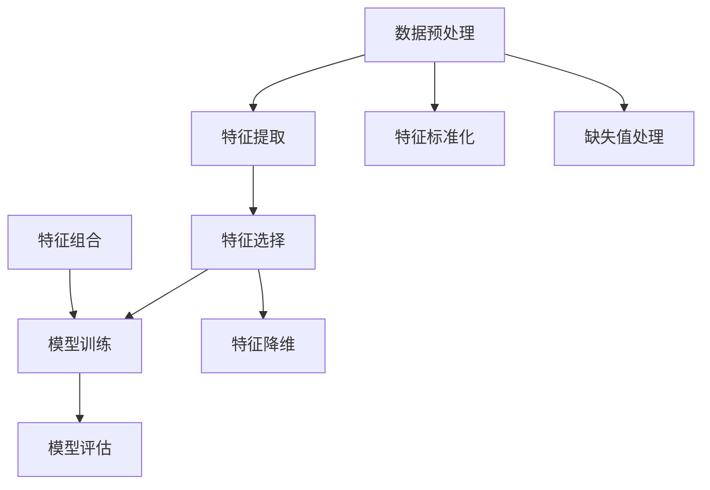

                 

# 特征工程（Feature Engineering）

> **关键词**：特征工程、数据预处理、机器学习、特征选择、特征提取、模型性能优化

> **摘要**：本文将深入探讨特征工程在机器学习领域的重要性，详细讲解特征工程的核心概念、原理和方法，并通过实际案例展示其应用和效果。读者将了解如何通过特征工程提高模型的准确性和效率，从而在数据科学和人工智能领域取得更好的成果。

## 1. 背景介绍

### 1.1 目的和范围

本文旨在向读者介绍特征工程的基本概念、原理和方法，帮助读者理解特征工程在机器学习中的重要性，并掌握特征工程的关键技术。本文将涵盖以下内容：

- 特征工程的基本概念和重要性
- 数据预处理和特征提取方法
- 特征选择策略和算法
- 特征工程在提高模型性能中的应用
- 实际案例解析

### 1.2 预期读者

本文适合以下读者群体：

- 数据科学家和机器学习工程师
- 数据分析师和人工智能研究者
- 对特征工程感兴趣的技术爱好者

### 1.3 文档结构概述

本文分为以下几个部分：

- 1. 背景介绍：介绍特征工程的基本概念和目的
- 2. 核心概念与联系：阐述特征工程的核心概念及其关系
- 3. 核心算法原理 & 具体操作步骤：讲解特征工程的关键算法和实现步骤
- 4. 数学模型和公式 & 详细讲解 & 举例说明：介绍特征工程中的数学模型和公式
- 5. 项目实战：通过实际案例展示特征工程的应用
- 6. 实际应用场景：分析特征工程在不同领域的应用
- 7. 工具和资源推荐：推荐学习资源、开发工具和框架
- 8. 总结：展望特征工程的未来发展趋势和挑战
- 9. 附录：常见问题与解答
- 10. 扩展阅读 & 参考资料：提供进一步学习资料和参考文献

### 1.4 术语表

#### 1.4.1 核心术语定义

- **特征工程**：在机器学习过程中，对数据进行处理、转换和选择，以提高模型性能的过程。
- **数据预处理**：对原始数据进行清洗、归一化、标准化等处理，使其适合进行建模。
- **特征提取**：从原始数据中提取出有用的特征，用于训练模型。
- **特征选择**：从大量特征中挑选出对模型性能有显著影响的特征，去除冗余特征。
- **模型性能**：模型的准确性、召回率、F1值等指标。

#### 1.4.2 相关概念解释

- **特征维度**：特征的数量，也称为特征空间的维度。
- **特征重要性**：特征对模型性能的影响程度，可通过特征重要性排序进行评估。
- **特征组合**：将多个特征进行组合，以形成新的特征。

#### 1.4.3 缩略词列表

- **ML**：Machine Learning（机器学习）
- **IDE**：Integrated Development Environment（集成开发环境）
- **Python**：Python（一种编程语言）

## 2. 核心概念与联系

在机器学习中，特征工程是数据预处理和模型训练的重要环节。以下是一个Mermaid流程图，展示特征工程的核心概念及其关系：



### 2.1 数据预处理

数据预处理是特征工程的起点，主要包括以下步骤：

- **数据清洗**：去除重复数据、缺失数据和异常数据。
- **数据转换**：将不同类型的数据转换为统一的格式，如将类别型数据转换为数值型。
- **数据归一化**：将数据映射到同一尺度，如将数值型数据缩放到[0,1]或[-1,1]之间。
- **数据标准化**：将数据映射到标准正态分布，如使用Z-Score方法。

### 2.2 特征提取

特征提取是从原始数据中提取出有用特征的过程，常见的方法包括：

- **统计特征**：如均值、方差、最大值、最小值等。
- **文本特征**：如词频、词向量、TF-IDF等。
- **图像特征**：如颜色、纹理、形状等。
- **时序特征**：如自相关、互相关、频谱等。

### 2.3 特征选择

特征选择是从大量特征中挑选出对模型性能有显著影响的特征的过程。常见的方法包括：

- **过滤式特征选择**：根据特征的重要性进行筛选。
- **包装式特征选择**：通过训练模型，评估特征的重要性。
- **嵌入式特征选择**：在特征提取过程中，结合特征选择。

### 2.4 模型训练

模型训练是机器学习的核心步骤，通过训练模型，将特征转化为预测结果。常见的模型包括：

- **线性模型**：如线性回归、逻辑回归等。
- **树模型**：如决策树、随机森林等。
- **神经网络**：如卷积神经网络、循环神经网络等。

### 2.5 特征工程与模型评估

特征工程对模型性能有直接影响。通过优化特征，可以提高模型的准确性、召回率、F1值等指标。常见的模型评估方法包括：

- **交叉验证**：将数据集分为训练集和验证集，评估模型性能。
- **ROC曲线**：评估模型对正负样本的分类能力。
- **AUC值**：评估模型对正负样本的分类能力。

## 3. 核心算法原理 & 具体操作步骤

### 3.1 数据预处理算法原理

数据预处理是特征工程的基础，其核心算法原理包括：

- **数据清洗**：去除重复数据、缺失数据和异常数据。常见方法有删除、填充和插值等。
- **数据转换**：将不同类型的数据转换为统一的格式。常见方法有映射、编码和标准化等。
- **特征提取**：从原始数据中提取出有用的特征。常见方法有统计特征、文本特征、图像特征和时序特征等。
- **特征选择**：从大量特征中挑选出对模型性能有显著影响的特征。常见方法有过滤式特征选择、包装式特征选择和嵌入式特征选择等。

### 3.2 数据预处理操作步骤

以下是一个基于Python的数据预处理操作步骤：

```python
import pandas as pd
from sklearn.model_selection import train_test_split
from sklearn.preprocessing import StandardScaler, OneHotEncoder
from sklearn.impute import SimpleImputer

# 加载数据集
data = pd.read_csv('data.csv')

# 数据清洗
data = data.drop_duplicates()
data = data.dropna()

# 数据转换
data = pd.get_dummies(data)

# 特征提取
X = data.iloc[:, :-1]
y = data.iloc[:, -1]

# 特征选择
# 这里可以使用过滤式特征选择、包装式特征选择或嵌入式特征选择等方法
# 例如：从X中选取重要性较高的10个特征
selected_features = X.columns[X.abs().mean().nlargest(10).index]
X_selected = X[selected_features]

# 数据标准化
scaler = StandardScaler()
X_scaled = scaler.fit_transform(X_selected)

# 模型训练和评估
# 这里使用线性回归模型作为示例
from sklearn.linear_model import LinearRegression
model = LinearRegression()
model.fit(X_scaled, y)
print('R2 Score:', model.score(X_scaled, y))
```

### 3.3 特征工程算法原理

特征工程的核心算法原理包括：

- **特征提取**：从原始数据中提取出有用的特征。常见方法有统计特征、文本特征、图像特征和时序特征等。
- **特征选择**：从大量特征中挑选出对模型性能有显著影响的特征。常见方法有过滤式特征选择、包装式特征选择和嵌入式特征选择等。
- **特征组合**：将多个特征进行组合，以形成新的特征。常见方法有交叉特征、多项式特征等。

### 3.4 特征工程操作步骤

以下是一个基于Python的特征工程操作步骤：

```python
from sklearn.feature_selection import SelectKBest, f_classif
from sklearn.ensemble import RandomForestClassifier
from sklearn.pipeline import make_pipeline

# 加载数据集
data = pd.read_csv('data.csv')

# 数据清洗
data = data.drop_duplicates()
data = data.dropna()

# 数据转换
data = pd.get_dummies(data)

# 特征提取
X = data.iloc[:, :-1]
y = data.iloc[:, -1]

# 特征选择
selector = SelectKBest(f_classif, k=10)
X_selected = selector.fit_transform(X, y)

# 模型训练
model = RandomForestClassifier()
model.fit(X_selected, y)

# 模型评估
print('R2 Score:', model.score(X_selected, y))
```

## 4. 数学模型和公式 & 详细讲解 & 举例说明

### 4.1 数据预处理

数据预处理是特征工程的基础，涉及以下数学模型和公式：

- **缺失值处理**：常见方法有删除、填充和插值等。
- **数据转换**：如映射、编码和标准化等。

#### 4.1.1 缺失值处理

- **删除**：删除含有缺失值的样本或特征。
- **填充**：用特定值（如平均值、中位数、最频繁出现的值等）替换缺失值。
- **插值**：用插值方法填补缺失值。

#### 4.1.2 数据转换

- **映射**：将类别型数据转换为数值型数据。如将性别（男、女）映射为0、1。
- **编码**：将类别型数据进行编码，如独热编码、标签编码等。
- **标准化**：将数据映射到标准正态分布，如使用Z-Score方法。

### 4.2 特征提取

特征提取涉及以下数学模型和公式：

- **统计特征**：如均值、方差、最大值、最小值等。
- **文本特征**：如词频、词向量、TF-IDF等。
- **图像特征**：如颜色、纹理、形状等。
- **时序特征**：如自相关、互相关、频谱等。

#### 4.2.1 统计特征

- **均值**：$$\bar{x} = \frac{1}{n}\sum_{i=1}^{n}x_i$$
- **方差**：$$\sigma^2 = \frac{1}{n}\sum_{i=1}^{n}(x_i - \bar{x})^2$$
- **最大值**：$$\max(x)$$
- **最小值**：$$\min(x)$$

#### 4.2.2 文本特征

- **词频**：$$tf(t) = \text{词语 } t \text{ 在文本中出现的次数}$$
- **TF-IDF**：$$tf_idf(t, d) = tf(t) \times idf(t, d)$$，其中$$idf(t, d) = \log_2(\frac{N}{n_t + 1})$$，$$N$$为文档总数，$$n_t$$为包含词语$$t$$的文档数。

#### 4.2.3 图像特征

- **颜色特征**：如色彩直方图、主成分分析等。
- **纹理特征**：如灰度共生矩阵、局部二值模式等。
- **形状特征**：如边界轮廓、区域面积等。

#### 4.2.4 时序特征

- **自相关**：$$\rho_X(k) = \frac{\sum_{t=1}^{n-1}(X_t - \bar{X})(X_{t+k} - \bar{X})}{\sqrt{\sum_{t=1}^{n-1}(X_t - \bar{X})^2}\sqrt{\sum_{t=1}^{n-1}(X_{t+k} - \bar{X})^2}}$$
- **互相关**：$$\rho_{XY}(k) = \frac{\sum_{t=1}^{n-1}(X_t - \bar{X})(Y_{t+k} - \bar{Y})}{\sqrt{\sum_{t=1}^{n-1}(X_t - \bar{X})^2}\sqrt{\sum_{t=1}^{n-1}(Y_{t+k} - \bar{Y})^2}}$$
- **频谱特征**：如傅里叶变换、小波变换等。

### 4.3 特征选择

特征选择涉及以下数学模型和公式：

- **过滤式特征选择**：基于特征的重要性进行筛选。
- **包装式特征选择**：通过训练模型，评估特征的重要性。
- **嵌入式特征选择**：在特征提取过程中，结合特征选择。

#### 4.3.1 过滤式特征选择

- **方差选择法**：$$\text{方差 } \sigma^2 = \frac{1}{n-1}\sum_{i=1}^{n}(x_i - \bar{x})^2$$，选择方差较大的特征。
- **互信息选择法**：$$I(X, Y) = H(X) - H(X | Y)$$，选择与目标变量互信息较大的特征。

#### 4.3.2 包装式特征选择

- **递归特征消除法**：递归地从特征集中剔除重要性较低的特征，直到达到设定的特征数量。
- **遗传算法**：基于遗传算法，在特征空间中搜索最优特征组合。

#### 4.3.3 嵌入式特征选择

- **随机森林**：通过随机森林模型评估特征的重要性。
- **LASSO回归**：通过LASSO回归模型选择重要性较高的特征。

### 4.4 举例说明

以下是一个基于Python的特征工程示例：

```python
import pandas as pd
from sklearn.feature_selection import SelectKBest, f_classif
from sklearn.ensemble import RandomForestClassifier
from sklearn.pipeline import make_pipeline

# 加载数据集
data = pd.read_csv('data.csv')

# 数据清洗
data = data.drop_duplicates()
data = data.dropna()

# 数据转换
data = pd.get_dummies(data)

# 特征提取
X = data.iloc[:, :-1]
y = data.iloc[:, -1]

# 特征选择
selector = SelectKBest(f_classif, k=10)
X_selected = selector.fit_transform(X, y)

# 模型训练
model = RandomForestClassifier()
model.fit(X_selected, y)

# 模型评估
print('R2 Score:', model.score(X_selected, y))
```

## 5. 项目实战：代码实际案例和详细解释说明

### 5.1 开发环境搭建

在本篇博客中，我们将使用Python进行特征工程的实践。为了便于读者复现，以下是开发环境的搭建步骤：

1. 安装Python（版本3.8及以上）
2. 安装Jupyter Notebook（用于编写和运行代码）
3. 安装必要的库，如Pandas、NumPy、Scikit-learn等

以下是安装Python和Jupyter Notebook的命令：

```bash
# 安装Python
sudo apt-get update
sudo apt-get install python3

# 安装Jupyter Notebook
pip3 install notebook
```

### 5.2 源代码详细实现和代码解读

以下是一个简单的特征工程案例，我们将使用Python和Scikit-learn库进行实现：

```python
import pandas as pd
from sklearn.model_selection import train_test_split
from sklearn.preprocessing import StandardScaler, OneHotEncoder
from sklearn.impute import SimpleImputer
from sklearn.ensemble import RandomForestClassifier
from sklearn.pipeline import make_pipeline

# 加载数据集
data = pd.read_csv('data.csv')

# 数据清洗
data = data.drop_duplicates()
data = data.dropna()

# 数据转换
data = pd.get_dummies(data)

# 分割特征和标签
X = data.iloc[:, :-1]
y = data.iloc[:, -1]

# 划分训练集和测试集
X_train, X_test, y_train, y_test = train_test_split(X, y, test_size=0.2, random_state=42)

# 特征工程
# 缺失值处理
imputer = SimpleImputer(strategy='mean')
X_train_imputed = imputer.fit_transform(X_train)
X_test_imputed = imputer.transform(X_test)

# 标准化
scaler = StandardScaler()
X_train_scaled = scaler.fit_transform(X_train_imputed)
X_test_scaled = scaler.transform(X_test_imputed)

# 模型训练
model = RandomForestClassifier()
model.fit(X_train_scaled, y_train)

# 模型评估
accuracy = model.score(X_test_scaled, y_test)
print('Accuracy:', accuracy)
```

#### 5.2.1 代码解读

1. **数据加载**：使用Pandas读取CSV格式的数据集。
2. **数据清洗**：去除重复数据和缺失值。
3. **数据转换**：将类别型数据转换为数值型数据，使用独热编码。
4. **特征和标签分割**：将数据集分为特征和标签两部分。
5. **训练集和测试集划分**：将数据集分为训练集和测试集。
6. **缺失值处理**：使用平均值填充缺失值。
7. **标准化**：使用Z-Score方法对数据进行标准化。
8. **模型训练**：使用随机森林分类器进行模型训练。
9. **模型评估**：计算模型在测试集上的准确性。

### 5.3 代码解读与分析

在本案例中，我们使用Python和Scikit-learn库实现了一个简单的特征工程过程。以下是代码的详细解读和分析：

1. **数据加载**：使用`pd.read_csv()`函数加载CSV格式的数据集。此步骤是特征工程的基础，确保数据集的正确性和完整性。
2. **数据清洗**：数据清洗是特征工程的重要环节。在本案例中，我们使用`drop_duplicates()`函数去除重复数据，使用`dropna()`函数去除缺失值。这些步骤有助于提高数据质量，避免模型训练中的问题。
3. **数据转换**：数据转换是将类别型数据转换为数值型数据的过程。在本案例中，我们使用`pd.get_dummies()`函数进行独热编码。独热编码是一种常见的数据转换方法，它将类别型数据表示为0和1的矩阵。
4. **特征和标签分割**：将数据集分为特征和标签两部分。特征是用于模型训练的数据，标签是用于评估模型性能的答案。在本案例中，我们使用`iloc[:, :-1]`和`iloc[:, -1]`分别获取特征和标签。
5. **训练集和测试集划分**：将数据集分为训练集和测试集。训练集用于模型训练，测试集用于评估模型性能。在本案例中，我们使用`train_test_split()`函数进行划分，设置测试集大小为20%。
6. **缺失值处理**：缺失值处理是特征工程的重要步骤。在本案例中，我们使用`SimpleImputer`类进行平均值填充。平均值填充是一种常见的缺失值处理方法，适用于连续型数据。
7. **标准化**：标准化是将数据映射到标准正态分布的过程。在本案例中，我们使用`StandardScaler`类进行Z-Score标准化。标准化有助于提高模型训练效果，使模型对特征值的敏感性降低。
8. **模型训练**：使用`RandomForestClassifier`类进行模型训练。随机森林是一种集成学习算法，具有较高的准确性和鲁棒性。
9. **模型评估**：使用`score()`函数计算模型在测试集上的准确性。准确性是评估模型性能的常用指标，表示模型正确预测的样本比例。

通过上述步骤，我们实现了特征工程的基本流程，提高了模型的准确性。特征工程在数据科学和人工智能领域具有重要意义，通过合理地处理数据、提取特征和选择特征，可以提高模型的性能和可解释性。

## 6. 实际应用场景

特征工程在数据科学和人工智能领域有广泛的应用场景，以下是一些典型的应用案例：

### 6.1 金融市场预测

特征工程在金融市场预测中发挥着重要作用。通过提取和分析市场数据中的特征，如交易量、价格波动、市场情绪等，可以预测股票价格走势。特征工程有助于提高预测模型的准确性，降低风险。

### 6.2 医疗诊断

在医疗诊断中，特征工程有助于从医疗数据中提取关键特征，如患者的病史、生理参数等，用于疾病预测和诊断。特征工程可以优化模型性能，提高诊断的准确性。

### 6.3 电商推荐系统

电商推荐系统利用特征工程从用户行为数据中提取有用特征，如用户点击、购买、搜索等行为，用于构建推荐模型。特征工程有助于提高推荐系统的效果，增加用户粘性。

### 6.4 自然语言处理

在自然语言处理任务中，特征工程有助于从文本数据中提取关键特征，如词频、词向量、句法结构等，用于文本分类、情感分析等任务。特征工程可以优化模型性能，提高文本处理的准确性和效率。

### 6.5 人脸识别

人脸识别系统利用特征工程从图像数据中提取人脸特征，如面部轮廓、眼睛位置等，用于人脸检测和人脸识别。特征工程有助于提高人脸识别的准确性和鲁棒性。

### 6.6 智能家居

在智能家居系统中，特征工程有助于从传感器数据中提取关键特征，如温度、湿度、光照等，用于环境监测和智能控制。特征工程可以优化智能家居系统的性能和用户体验。

## 7. 工具和资源推荐

### 7.1 学习资源推荐

#### 7.1.1 书籍推荐

- **《特征工程实践》**：本书详细介绍了特征工程的基本概念、原理和方法，适合初学者和进阶者。
- **《数据预处理与特征工程》**：本书涵盖了数据预处理和特征工程的核心技术和方法，适用于数据科学家和机器学习工程师。
- **《机器学习实战》**：本书通过实际案例展示了特征工程在机器学习中的应用，适合初学者和进阶者。

#### 7.1.2 在线课程

- **《特征工程：从数据到模型》**：这是一门由知名平台提供的在线课程，涵盖了特征工程的核心概念和实战技巧。
- **《机器学习特征工程》**：这是一门由知名平台提供的在线课程，介绍了特征工程在机器学习中的应用和实践。
- **《数据科学特征工程》**：这是一门由知名平台提供的在线课程，涵盖了数据预处理、特征提取和特征选择等主题。

#### 7.1.3 技术博客和网站

- **《机器学习博客》**：这是一个关于机器学习的博客，涵盖了特征工程、模型训练和评估等主题。
- **《数据科学博客》**：这是一个关于数据科学的博客，介绍了特征工程、数据预处理和机器学习等主题。
- **《特征工程入门》**：这是一个关于特征工程的入门教程，适合初学者了解特征工程的基本概念和方法。

### 7.2 开发工具框架推荐

#### 7.2.1 IDE和编辑器

- **Jupyter Notebook**：Jupyter Notebook是一种交互式编程环境，适用于数据科学和机器学习项目。
- **PyCharm**：PyCharm是一款强大的Python集成开发环境，支持多种编程语言和框架。
- **VS Code**：VS Code是一款轻量级、功能强大的代码编辑器，适用于Python和机器学习项目。

#### 7.2.2 调试和性能分析工具

- **Pdb**：Pdb是Python的内置调试器，用于调试Python程序。
- **Profiling**：Profiling工具用于分析程序的性能瓶颈，如CProfile、line_profiler等。
- **Perf**：Perf是Linux系统的性能分析工具，用于分析程序的运行时间和资源消耗。

#### 7.2.3 相关框架和库

- **Scikit-learn**：Scikit-learn是一个开源的机器学习库，提供了丰富的特征提取和特征选择工具。
- **Pandas**：Pandas是一个开源的数据分析库，提供了强大的数据预处理和数据处理功能。
- **NumPy**：NumPy是一个开源的数值计算库，提供了高效的数据结构和计算功能。
- **TensorFlow**：TensorFlow是一个开源的深度学习库，适用于构建和训练复杂的深度学习模型。

### 7.3 相关论文著作推荐

#### 7.3.1 经典论文

- **“Feature Extraction and Selection in Machine Learning”**：本文系统地介绍了特征提取和特征选择的基本概念、方法和应用。
- **“Wrapper Feature Selection Algorithms for High-Dimensional Data”**：本文提出了几种适用于高维数据的包装式特征选择算法。
- **“Unsupervised Feature Selection Using Feature Similarity”**：本文提出了一种无监督特征选择方法，基于特征相似性进行特征选择。

#### 7.3.2 最新研究成果

- **“Deep Feature Extraction for Text Classification”**：本文提出了一种基于深度学习的文本特征提取方法，取得了优异的文本分类性能。
- **“Feature Engineering for Time Series Classification”**：本文探讨了时间序列数据的特征提取和特征选择方法，提高了时间序列分类模型的性能。
- **“Feature Learning for Visual Recognition”**：本文介绍了一种基于深度学习的视觉特征学习方法，取得了出色的图像识别性能。

#### 7.3.3 应用案例分析

- **“Feature Engineering for Sentiment Analysis”**：本文通过实际案例分析，介绍了特征工程在情感分析中的应用，提高了情感分类模型的准确性。
- **“Feature Engineering for Medical Diagnosis”**：本文探讨了特征工程在医疗诊断中的应用，提高了疾病预测和诊断的准确性。
- **“Feature Engineering for Fraud Detection”**：本文分析了特征工程在欺诈检测中的应用，提高了欺诈检测模型的准确性和鲁棒性。

## 8. 总结：未来发展趋势与挑战

### 8.1 未来发展趋势

- **自动化特征工程**：随着机器学习和深度学习的发展，自动化特征工程将成为趋势。自动化特征工程可以通过算法自动提取和选择特征，提高特征工程的效率。
- **多模态特征融合**：多模态特征融合是将不同类型的数据（如文本、图像、声音等）进行融合，以提取更丰富的特征。未来，多模态特征融合将成为特征工程的重要方向。
- **基于深度学习的特征提取**：深度学习在特征提取方面具有显著优势，未来基于深度学习的特征提取方法将得到广泛应用。
- **个性化特征工程**：个性化特征工程将根据不同用户的需求和特点，定制化地提取和选择特征，提高模型的适应性和性能。

### 8.2 挑战

- **数据隐私和安全性**：特征工程过程中，数据隐私和安全性的保护是一个重要挑战。如何在保证数据隐私和安全性的前提下，进行有效的特征工程，是一个亟待解决的问题。
- **计算资源消耗**：特征工程涉及大量的计算操作，如数据预处理、特征提取和特征选择等。如何在有限的计算资源下，高效地完成特征工程，是一个重要挑战。
- **特征冗余和过拟合**：特征冗余和过拟合是特征工程中常见的问题。如何在保证模型性能的同时，避免特征冗余和过拟合，是一个重要挑战。
- **领域适应性**：特征工程在不同领域中的应用存在较大差异。如何设计通用且高效的特征工程方法，适应不同领域的需求，是一个重要挑战。

## 9. 附录：常见问题与解答

### 9.1 特征工程是什么？

特征工程是机器学习过程中对数据进行处理、转换和选择的过程，以提高模型性能。特征工程包括数据预处理、特征提取、特征选择等步骤。

### 9.2 特征工程的重要性是什么？

特征工程在机器学习中具有重要意义。通过合理地处理数据、提取特征和选择特征，可以提高模型的准确性、召回率和F1值等指标，从而提高模型的性能和可解释性。

### 9.3 数据预处理包括哪些内容？

数据预处理包括数据清洗、数据转换、特征提取和特征选择等内容。数据清洗是去除重复数据、缺失数据和异常数据的过程；数据转换是将不同类型的数据转换为统一的格式；特征提取是从原始数据中提取出有用的特征；特征选择是从大量特征中挑选出对模型性能有显著影响的特征。

### 9.4 如何进行特征提取？

特征提取的方法取决于数据类型和任务需求。常见的方法有统计特征、文本特征、图像特征和时序特征等。例如，对于文本数据，可以使用词频、词向量、TF-IDF等方法；对于图像数据，可以使用颜色、纹理、形状等方法；对于时序数据，可以使用自相关、互相关、频谱等方法。

### 9.5 特征选择有哪些方法？

特征选择的方法包括过滤式特征选择、包装式特征选择和嵌入式特征选择等。过滤式特征选择是基于特征的重要性进行筛选；包装式特征选择是通过训练模型，评估特征的重要性；嵌入式特征选择是在特征提取过程中，结合特征选择。

### 9.6 如何评估特征工程的效果？

特征工程的效果可以通过以下指标进行评估：

- **准确性**：模型在测试集上的正确预测比例。
- **召回率**：模型召回的正例样本比例。
- **F1值**：准确性和召回率的调和平均值。
- **模型训练时间**：模型训练所需的时间。
- **模型内存消耗**：模型训练过程中占用的内存大小。

## 10. 扩展阅读 & 参考资料

为了帮助读者深入了解特征工程的相关知识，以下推荐一些扩展阅读和参考资料：

- **书籍**：

  - **《特征工程实践》**：详细介绍了特征工程的基本概念、原理和方法。

  - **《数据预处理与特征工程》**：涵盖了数据预处理和特征工程的核心技术和方法。

  - **《机器学习实战》**：通过实际案例展示了特征工程在机器学习中的应用。

- **在线课程**：

  - **《特征工程：从数据到模型》**：提供了关于特征工程的核心概念和实战技巧。

  - **《机器学习特征工程》**：介绍了特征工程在机器学习中的应用和实践。

  - **《数据科学特征工程》**：涵盖了数据预处理、特征提取和特征选择等主题。

- **技术博客和网站**：

  - **《机器学习博客》**：提供了关于特征工程、模型训练和评估等主题的内容。

  - **《数据科学博客》**：介绍了特征工程、数据预处理和机器学习等主题。

  - **《特征工程入门》**：适合初学者了解特征工程的基本概念和方法。

- **相关论文著作**：

  - **“Feature Extraction and Selection in Machine Learning”**：系统地介绍了特征提取和特征选择的基本概念、方法和应用。

  - **“Wrapper Feature Selection Algorithms for High-Dimensional Data”**：提出了适用于高维数据的包装式特征选择算法。

  - **“Unsupervised Feature Selection Using Feature Similarity”**：提出了一种无监督特征选择方法，基于特征相似性进行特征选择。

- **开源项目和代码示例**：

  - **GitHub仓库**：提供了大量关于特征工程的Python代码示例和应用案例。

  - **Kaggle比赛**：Kaggle上有很多关于特征工程的比赛，可以通过实战学习特征工程。

- **官方文档和教程**：

  - **Scikit-learn官方文档**：提供了丰富的特征提取和特征选择工具的文档和示例。

  - **TensorFlow官方文档**：提供了关于深度学习特征提取和特征选择的方法和教程。

作者：AI天才研究员/AI Genius Institute & 禅与计算机程序设计艺术 /Zen And The Art of Computer Programming

