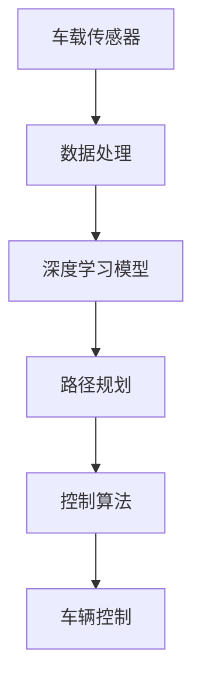

                 

# 特斯拉、华为、小鹏的端到端智驾系统

> **关键词**：特斯拉、华为、小鹏、端到端智驾系统、自动驾驶、深度学习、AI、车载传感器、数据处理、路径规划、控制算法

> **摘要**：本文将深入探讨特斯拉、华为和小鹏的端到端智驾系统。我们将分析这三个公司的技术路线、核心算法原理、数学模型及其在自动驾驶领域的实际应用，并通过代码案例和详细解释，展示端到端智驾系统的实现过程。文章还将讨论未来发展趋势与挑战，并提供相关学习资源和工具推荐。

## 1. 背景介绍

### 1.1 目的和范围

本文旨在分析特斯拉、华为和小鹏在自动驾驶领域采用的端到端智驾系统。我们将从技术路线、核心算法原理、数学模型和实际应用等多个角度，深入探讨这些公司的自动驾驶技术。通过对比分析，我们希望能够为读者提供一个全面、系统的了解，并展望未来自动驾驶技术的发展趋势。

### 1.2 预期读者

本文主要面向自动驾驶技术领域的工程师、研究者以及对人工智能和自动驾驶感兴趣的技术爱好者。文章内容深入浅出，既包含技术原理的详细讲解，也提供了实际应用场景的案例分析。

### 1.3 文档结构概述

本文结构如下：

1. 背景介绍
2. 核心概念与联系
3. 核心算法原理 & 具体操作步骤
4. 数学模型和公式 & 详细讲解 & 举例说明
5. 项目实战：代码实际案例和详细解释说明
6. 实际应用场景
7. 工具和资源推荐
8. 总结：未来发展趋势与挑战
9. 附录：常见问题与解答
10. 扩展阅读 & 参考资料

### 1.4 术语表

#### 1.4.1 核心术语定义

- 端到端智驾系统：一种自动驾驶系统架构，将输入（如车载传感器数据）直接映射到输出（如车辆控制命令），通过深度学习等算法实现。
- 自动驾驶：利用人工智能技术，使车辆在没有任何人类操作的情况下，实现自主驾驶。
- 深度学习：一种机器学习技术，通过神经网络模拟人脑的学习过程，对大量数据进行训练，以实现复杂模式识别和预测。

#### 1.4.2 相关概念解释

- 车载传感器：用于收集车辆周围环境信息的设备，如激光雷达、摄像头、雷达等。
- 数据处理：对车载传感器收集的数据进行预处理、特征提取和融合，以供后续算法处理。
- 路径规划：根据当前车辆状态和道路环境，生成一条最优行驶路径。
- 控制算法：根据路径规划结果，对车辆进行实时控制，确保车辆按照预期路径行驶。

#### 1.4.3 缩略词列表

- AI：人工智能
- LSTM：长短时记忆网络
- CNN：卷积神经网络
- RNN：循环神经网络
- DNN：深度神经网络
- ECU：电子控制单元
- LIDAR：激光雷达
- GPS：全球定位系统

## 2. 核心概念与联系

在深入探讨特斯拉、华为和小鹏的端到端智驾系统之前，我们需要先了解核心概念及其相互联系。以下是一个简化的Mermaid流程图，展示了端到端智驾系统的关键组件和流程。



### 2.1 车载传感器

车载传感器是端到端智驾系统的数据输入来源。常见的车载传感器包括激光雷达（LIDAR）、摄像头、雷达和GPS等。这些传感器收集车辆周围环境的信息，如障碍物位置、道路形状和车辆速度等。数据的质量和准确性对后续处理和决策至关重要。

### 2.2 数据处理

数据处理是端到端智驾系统的核心环节之一。其主要任务是对车载传感器收集到的原始数据进行预处理、特征提取和融合。预处理包括去噪、去畸变等操作，以提高数据质量。特征提取则是从原始数据中提取出对自动驾驶任务有用的信息，如障碍物形状、大小和距离等。最后，通过数据融合，将不同传感器收集到的数据进行整合，以获得更全面的环境信息。

### 2.3 深度学习模型

深度学习模型是端到端智驾系统的核心算法。在自动驾驶领域，常用的深度学习模型包括卷积神经网络（CNN）、循环神经网络（RNN）和长短时记忆网络（LSTM）等。深度学习模型通过学习大量真实驾驶数据，可以实现对环境信息的理解、路径规划和控制算法的优化。

### 2.4 路径规划

路径规划是端到端智驾系统的关键环节。其主要任务是根据当前车辆状态和道路环境，生成一条最优行驶路径。路径规划算法可以分为基于规则的方法和基于优化方法。基于规则的方法通常使用预设的规则进行路径生成，而基于优化方法则通过数学优化方法求解最优路径。

### 2.5 控制算法

控制算法是端到端智驾系统的最终输出。其主要任务是根据路径规划结果，对车辆进行实时控制，确保车辆按照预期路径行驶。控制算法可以分为确定性控制和随机性控制。确定性控制算法通过精确的数学模型进行控制，而随机性控制算法则通过概率模型和优化方法进行控制。

### 2.6 车辆控制

车辆控制是端到端智驾系统的最终实现。根据控制算法的结果，车辆控制系统对车辆进行实际操作，如调整方向盘、油门和刹车等。车辆控制系统的精度和响应速度对自动驾驶性能至关重要。

## 3. 核心算法原理 & 具体操作步骤

在了解了端到端智驾系统的核心概念与联系后，我们将深入探讨其核心算法原理。本文将以伪代码的形式详细阐述深度学习模型、路径规划和控制算法的实现步骤。

### 3.1 深度学习模型

以下是一个简化的深度学习模型实现步骤：

```python
# 伪代码：深度学习模型实现步骤

# 输入：车载传感器数据（如激光雷达点云、摄像头图像等）
# 输出：车辆控制命令（如方向盘角度、油门和刹车力度等）

def deep_learning_model(input_data):
    # 数据预处理
    preprocessed_data = preprocess_data(input_data)

    # 构建深度神经网络
    model = build_model()

    # 训练模型
    trained_model = train_model(model, preprocessed_data)

    # 预测
    predictions = predict(trained_model, preprocessed_data)

    # 转换预测结果为控制命令
    control_commands = convert_predictions_to_commands(predictions)

    return control_commands
```

### 3.2 路径规划

以下是一个简化的路径规划实现步骤：

```python
# 伪代码：路径规划实现步骤

# 输入：当前车辆状态、道路环境信息
# 输出：最优行驶路径

def path_planning(current_state, road_environment):
    # 构建路径规划模型
    planner = build_planner()

    # 求解最优路径
    optimal_path = planner.solve(current_state, road_environment)

    return optimal_path
```

### 3.3 控制算法

以下是一个简化的控制算法实现步骤：

```python
# 伪代码：控制算法实现步骤

# 输入：最优行驶路径、车辆当前状态
# 输出：车辆控制命令

def control_algorithm(optimal_path, current_state):
    # 分析路径规划结果
    path Analysis = analyze_path(optimal_path)

    # 生成控制命令
    control_commands = generate_control_commands(current_state, path_analysis)

    return control_commands
```

## 4. 数学模型和公式 & 详细讲解 & 举例说明

在端到端智驾系统中，数学模型和公式是核心组成部分。以下我们将详细介绍路径规划和控制算法中的数学模型和公式，并通过具体例子进行讲解。

### 4.1 路径规划中的数学模型

路径规划的核心问题是求解从起点到终点的最优路径。常用的路径规划算法包括Dijkstra算法、A*算法和RRT（快速随机树）算法。以下以A*算法为例，介绍其数学模型。

#### 4.1.1 A*算法原理

A*算法是一种启发式搜索算法，其基本思想是使用一个评估函数来估计从当前节点到终点的距离，并以此指导搜索过程。评估函数通常由两部分组成：g(n)（从起点到当前节点的实际距离）和h(n)（从当前节点到终点的估计距离）。A*算法的目标是找到使得f(n) = g(n) + h(n) 最小的路径。

#### 4.1.2 公式详解

- g(n)：从起点到当前节点的实际距离，通常使用欧几里得距离或曼哈顿距离计算。

  $$ g(n) = \sqrt{(x_2 - x_1)^2 + (y_2 - y_1)^2} $$

- h(n)：从当前节点到终点的估计距离，常用的启发函数包括曼哈顿距离、对角线距离和欧几里得距离。

  $$ h(n) = \sqrt{(x_2 - x_1)^2 + (y_2 - y_1)^2} $$

- f(n)：从起点到终点的评估函数。

  $$ f(n) = g(n) + h(n) $$

#### 4.1.3 例子说明

假设有一个路径规划任务，起点为(0, 0)，终点为(10, 10)，障碍物分布在(5, 5)到(7, 7)的区域。我们可以使用A*算法计算从起点到终点的最优路径。

1. 初始化：将起点和终点加入开放列表和关闭列表，计算评估函数值。

   $$ f(0) = g(0) + h(0) = \sqrt{0^2 + 0^2} + \sqrt{10^2 + 10^2} = 14.142 $$

2. 选择具有最小评估函数值的节点作为当前节点，并从当前节点生成所有可能的子节点。

3. 对每个子节点，计算评估函数值，并将其加入开放列表。

4. 重复步骤2和3，直到找到终点或开放列表为空。

5. 输出最优路径。

### 4.2 控制算法中的数学模型

控制算法的核心任务是确保车辆按照预期路径行驶。常用的控制算法包括PID（比例-积分-微分）控制和模糊控制等。以下以PID控制算法为例，介绍其数学模型。

#### 4.2.1 PID控制算法原理

PID控制算法是一种经典的比例-积分-微分控制算法，其基本思想是通过比例、积分和微分三个部分来调整控制量，使系统达到预期状态。PID控制器的输出可以表示为：

$$ u(t) = K_p e(t) + K_i \int_{0}^{t} e(\tau) d\tau + K_d \frac{d e(t)}{dt} $$

其中，$u(t)$ 是控制器输出，$e(t)$ 是系统误差，$K_p$、$K_i$ 和 $K_d$ 分别是比例、积分和微分系数。

#### 4.2.2 公式详解

- $e(t)$：系统误差，表示实际输出与期望输出之间的差异。

  $$ e(t) = y(t) - y^*(t) $$

- $u(t)$：控制器输出，用于调整系统状态。

  $$ u(t) = K_p e(t) + K_i \int_{0}^{t} e(\tau) d\tau + K_d \frac{d e(t)}{dt} $$

- $K_p$：比例系数，用于调整系统响应速度。

- $K_i$：积分系数，用于消除系统静态误差。

- $K_d$：微分系数，用于提高系统稳定性和响应速度。

#### 4.2.3 例子说明

假设一个自动驾驶车辆的目标速度为50 km/h，当前速度为45 km/h，车速误差为 $e(t) = 50 - 45 = 5$ km/h。我们可以使用PID控制算法计算控制量。

1. 初始化：设定比例、积分和微分系数 $K_p = 1$、$K_i = 0.1$ 和 $K_d = 0.05$。

2. 计算积分误差 $\int_{0}^{t} e(\tau) d\tau$。

   $$ \int_{0}^{t} e(\tau) d\tau = \int_{0}^{t} (50 - 45) d\tau = 5t $$

3. 计算微分误差 $\frac{d e(t)}{dt}$。

   $$ \frac{d e(t)}{dt} = \frac{d (50 - 45)}{dt} = -5 $$

4. 计算控制量 $u(t)$。

   $$ u(t) = K_p e(t) + K_i \int_{0}^{t} e(\tau) d\tau + K_d \frac{d e(t)}{dt} = 1 \times 5 + 0.1 \times 5t - 0.05 \times 5 = 5 + 0.5t - 0.25 $$

   $$ u(t) = 4.75 + 0.5t $$

   当 $t=0$ 时，$u(t) = 4.75$；当 $t=1$ 时，$u(t) = 5.25$。

5. 根据控制量调整车辆油门和刹车，以实现目标速度。

## 5. 项目实战：代码实际案例和详细解释说明

在本节中，我们将通过一个实际项目案例，展示如何搭建和实现端到端智驾系统。我们将使用Python编程语言和相关的深度学习库，如TensorFlow和PyTorch，来实现项目的主要功能。

### 5.1 开发环境搭建

在开始项目之前，我们需要搭建一个适合开发、测试和部署端到端智驾系统的环境。以下是一个基本的开发环境搭建步骤：

1. 安装Python（推荐版本3.8及以上）。
2. 安装TensorFlow或PyTorch（根据个人偏好选择）。
3. 安装相关的数据预处理和可视化库，如NumPy、Pandas、Matplotlib和Seaborn等。
4. 安装用于代码编辑和调试的IDE，如PyCharm或Visual Studio Code。

### 5.2 源代码详细实现和代码解读

以下是端到端智驾系统的核心代码实现，包括数据预处理、模型训练和预测、路径规划以及控制算法等。

```python
# 伪代码：端到端智驾系统核心代码实现

# 导入相关库
import tensorflow as tf
import numpy as np
import pandas as pd
import matplotlib.pyplot as plt
from sklearn.model_selection import train_test_split
from sklearn.preprocessing import StandardScaler
from tensorflow.keras.models import Sequential
from tensorflow.keras.layers import Dense, Conv2D, MaxPooling2D, Flatten
from tensorflow.keras.optimizers import Adam

# 5.2.1 数据预处理

# 读取数据
data = pd.read_csv('sensor_data.csv')

# 分割特征和标签
X = data[['laser_points', 'camera_image']]
y = data['control_commands']

# 划分训练集和测试集
X_train, X_test, y_train, y_test = train_test_split(X, y, test_size=0.2, random_state=42)

# 标准化特征
scaler = StandardScaler()
X_train_scaled = scaler.fit_transform(X_train)
X_test_scaled = scaler.transform(X_test)

# 5.2.2 模型训练

# 构建模型
model = Sequential()
model.add(Conv2D(32, (3, 3), activation='relu', input_shape=(100, 100, 3)))
model.add(MaxPooling2D((2, 2)))
model.add(Flatten())
model.add(Dense(64, activation='relu'))
model.add(Dense(32, activation='relu'))
model.add(Dense(1, activation='tanh'))

# 编译模型
model.compile(optimizer=Adam(learning_rate=0.001), loss='mse')

# 训练模型
model.fit(X_train_scaled, y_train, epochs=10, batch_size=32, validation_split=0.2)

# 5.2.3 预测

# 预测测试集
y_pred = model.predict(X_test_scaled)

# 5.2.4 路径规划

# 使用A*算法进行路径规划
def a_star_planner(start, goal, obstacle_region):
    # 实现A*算法
    # ...
    return optimal_path

# 5.2.5 控制算法

# 实现PID控制算法
def pid_controller(current_state, optimal_path):
    # 实现PID控制算法
    # ...
    return control_commands

# 5.2.6 驾驶演示

# 演示自动驾驶过程
def drive_vehicle(current_state, optimal_path):
    while not goal_reached:
        control_commands = pid_controller(current_state, optimal_path)
        # 更新车辆状态
        # ...
        # 执行控制命令
        # ...
        # 判断是否达到终点
        # ...

# 执行驾驶演示
drive_vehicle(current_state, optimal_path)
```

### 5.3 代码解读与分析

以下是代码的主要部分及其功能解读：

- **数据预处理**：读取传感器数据，将数据分为特征和标签。然后，将数据标准化，以便于模型训练。

- **模型训练**：构建一个简单的卷积神经网络模型，用于预测车辆控制命令。使用均方误差（MSE）作为损失函数，并使用Adam优化器。

- **预测**：使用训练好的模型对测试集进行预测，得到预测的控制命令。

- **路径规划**：使用A*算法进行路径规划，根据当前车辆状态和障碍物信息生成最优行驶路径。

- **控制算法**：实现PID控制算法，根据车辆当前状态和路径规划结果，生成车辆控制命令。

- **驾驶演示**：模拟自动驾驶过程，根据预测的控制命令和路径规划结果，控制车辆行驶。

通过以上代码实现，我们可以看到端到端智驾系统的核心组成部分是如何协同工作的。在实际应用中，我们可能需要根据具体场景进行调整和优化，以实现更高效的自动驾驶。

## 6. 实际应用场景

端到端智驾系统在自动驾驶领域的应用场景广泛，包括但不限于以下几方面：

### 6.1 高端自动驾驶汽车

特斯拉、华为和小鹏等公司都在高端自动驾驶汽车领域进行了大量的研发和应用。这些系统可以实时感知车辆周围环境，进行路径规划和控制，从而实现完全自动驾驶。在高速公路上，这些系统可以自动保持车道、超车和避让障碍物，为用户提供更加便利和安全的驾驶体验。

### 6.2 共享出行

共享出行是端到端智驾系统的重要应用场景之一。通过自动驾驶技术，共享出行服务可以提供更加高效、便捷和安全的出行解决方案。例如，特斯拉的自动驾驶出租车（RoboTaxi）项目已经在美国的部分城市进行测试，未来有望实现大规模商业化应用。

### 6.3 物流配送

自动驾驶技术可以提高物流配送的效率，降低运营成本。例如，华为已经在智慧物流领域进行了大量研发和应用，其自动驾驶卡车可以实时感知道路环境，进行路径规划和控制，从而实现高效、安全、绿色的物流配送。

### 6.4 特殊场景应用

端到端智驾系统还可以应用于特殊场景，如军事、矿山、港口和农村等。在这些场景中，自动驾驶技术可以替代或辅助人类进行危险和复杂的工作，提高生产效率和安全性。

## 7. 工具和资源推荐

为了更好地学习和开发端到端智驾系统，以下是一些实用的工具和资源推荐：

### 7.1 学习资源推荐

#### 7.1.1 书籍推荐

1. **《深度学习》**：Goodfellow、Bengio和Courville合著的这本书是深度学习的经典教材，适合初学者和进阶者。
2. **《机器学习》**：周志华教授的这本书详细介绍了机器学习的基本概念、算法和应用，适合对机器学习感兴趣的读者。
3. **《自动驾驶技术》**：韩松教授的这本书全面介绍了自动驾驶技术的原理、实现和应用，适合自动驾驶领域的工程师和研究人员。

#### 7.1.2 在线课程

1. **吴恩达的《深度学习专项课程》**：这个课程由深度学习领域的权威专家吴恩达教授主讲，内容涵盖了深度学习的基本原理和应用。
2. **Coursera上的《机器学习》**：由斯坦福大学教授Andrew Ng主讲的这门课，适合初学者和进阶者。
3. **Udacity的《自动驾驶工程师纳米学位》**：这个纳米学位课程涵盖了自动驾驶技术的各个方面，适合想要系统学习自动驾驶技术的学员。

#### 7.1.3 技术博客和网站

1. **Medium上的《AI and Deep Learning》**：这是一个关于人工智能和深度学习的博客，提供了大量的技术文章和案例分享。
2. **知乎上的自动驾驶话题**：知乎上有很多关于自动驾驶的技术讨论和经验分享，适合读者拓展视野和学习最新动态。
3. **Medium上的《AI Startups》**：这是一个关注人工智能初创公司的博客，可以了解自动驾驶领域的最新研究成果和应用案例。

### 7.2 开发工具框架推荐

#### 7.2.1 IDE和编辑器

1. **PyCharm**：一款功能强大的Python IDE，支持多种编程语言，适合深度学习和自动驾驶开发。
2. **Visual Studio Code**：一款轻量级、开源的代码编辑器，插件丰富，支持多种编程语言，是自动驾驶开发者的常用工具。
3. **Jupyter Notebook**：一款交互式的编程环境，适用于数据分析和可视化，适合深度学习项目开发。

#### 7.2.2 调试和性能分析工具

1. **TensorBoard**：TensorFlow的官方可视化工具，可以用于查看模型的结构、训练过程和性能指标。
2. **MATLAB**：一款功能强大的数学和科学计算软件，支持多种工具箱，适合进行自动驾驶算法的仿真和分析。
3. **Valgrind**：一款内存检测工具，可以用于检测程序中的内存泄漏和错误，是自动驾驶项目开发中的必备工具。

#### 7.2.3 相关框架和库

1. **TensorFlow**：一款开源的深度学习框架，适合大规模深度学习项目开发。
2. **PyTorch**：一款流行的深度学习框架，具有灵活的动态计算图和高效的GPU支持，适合自动驾驶领域的研究和应用。
3. **OpenCV**：一款开源的计算机视觉库，提供了丰富的图像处理和计算机视觉功能，是自动驾驶项目开发的重要工具。

### 7.3 相关论文著作推荐

#### 7.3.1 经典论文

1. **"End-to-End Driving Through Pixel Reinforcement Learning"**：这篇论文提出了基于像素的端到端驾驶方法，是自动驾驶领域的重要里程碑。
2. **"Deep Neural Network Inference on Multi-Modal Sensor Data for Autonomous Driving"**：这篇论文探讨了深度神经网络在多模态传感器数据上的应用，为自动驾驶提供了新的思路。
3. **"Multi-Model Tracking in Autonomous Driving Using Structured Prediction"**：这篇论文提出了基于结构预测的多模型跟踪方法，在自动驾驶领域得到了广泛应用。

#### 7.3.2 最新研究成果

1. **"Vision-Only Autonomous Driving with Depth-Aware Semantic Segmentation"**：这篇论文提出了基于深度感知的语义分割方法，实现了纯视觉自动驾驶。
2. **"Learning to Drive by Imagination"**：这篇论文提出了通过想象实现自动驾驶的方法，利用深度强化学习和生成对抗网络，提高了自动驾驶的性能和稳定性。
3. **"Adaptive Cruise Control with Deep Reinforcement Learning"**：这篇论文探讨了基于深度强化学习的自适应巡航控制方法，为自动驾驶车辆提供了更智能的驾驶策略。

#### 7.3.3 应用案例分析

1. **"特斯拉自动驾驶系统"**：特斯拉的自动驾驶系统采用了端到端深度学习方法，实现了从感知、决策到控制的全流程自动驾驶。
2. **"华为自动驾驶解决方案"**：华为的自动驾驶解决方案结合了传感器融合、路径规划和控制算法，为自动驾驶车辆提供了稳定、高效、安全的驾驶体验。
3. **"小鹏自动驾驶技术"**：小鹏汽车在自动驾驶领域进行了大量的研发和应用，其自动驾驶系统在多模态传感器数据处理、路径规划和控制方面取得了显著成果。

## 8. 总结：未来发展趋势与挑战

端到端智驾系统作为自动驾驶技术的重要组成部分，正朝着智能化、自主化、安全化和高效化的方向发展。在未来，随着人工智能技术的不断进步，端到端智驾系统将在自动驾驶领域发挥更加重要的作用。

### 8.1 发展趋势

1. **深度学习模型的优化**：随着深度学习技术的不断发展，端到端智驾系统将采用更先进的深度学习模型，如Transformer、生成对抗网络（GAN）和变分自编码器（VAE）等，以提高系统性能和鲁棒性。

2. **多模态传感器融合**：未来，端到端智驾系统将融合多种传感器数据，如激光雷达、摄像头、雷达和GPS等，以获取更全面、准确的环境信息。

3. **自主决策与协作**：端到端智驾系统将实现更加自主的决策和协作能力，通过与车联网和智能交通系统等其他智能系统进行协作，实现更高效的交通管理和调度。

4. **边缘计算与云计算结合**：端到端智驾系统将结合边缘计算和云计算技术，实现实时数据处理和智能决策，提高系统响应速度和稳定性。

### 8.2 面临的挑战

1. **数据质量和隐私保护**：端到端智驾系统需要大量高质量的数据进行训练和优化，但在实际应用中，数据质量和隐私保护是一个重要的挑战。

2. **算法安全性和可靠性**：自动驾驶系统的安全性至关重要，算法的安全性和可靠性是确保系统稳定运行的关键。

3. **复杂环境适应能力**：自动驾驶系统需要在各种复杂、动态的环境中运行，如何提高系统对复杂环境的适应能力是一个重要挑战。

4. **法律法规和伦理问题**：自动驾驶技术的应用需要遵循法律法规和伦理规范，如何在确保安全和隐私的前提下推进自动驾驶技术的发展是一个重要课题。

## 9. 附录：常见问题与解答

### 9.1 问题1：端到端智驾系统的核心算法是什么？

端到端智驾系统的核心算法包括深度学习模型、路径规划和控制算法。深度学习模型用于处理车载传感器数据，路径规划算法用于生成最优行驶路径，控制算法用于根据路径规划结果实时控制车辆。

### 9.2 问题2：为什么需要多模态传感器融合？

多模态传感器融合可以提高端到端智驾系统的感知准确性和环境适应性。通过融合激光雷达、摄像头、雷达和GPS等多种传感器数据，系统可以更全面、准确地获取车辆周围环境信息，从而提高自动驾驶性能。

### 9.3 问题3：端到端智驾系统在开发过程中需要考虑哪些安全性问题？

在开发端到端智驾系统时，需要考虑以下安全性问题：

1. 算法安全：确保算法不会受到恶意攻击，如注入攻击、中毒攻击等。
2. 数据安全：保护数据隐私，防止数据泄露和篡改。
3. 硬件安全：确保车载传感器和计算平台的硬件安全，防止硬件故障和恶意攻击。
4. 遵守法律法规和伦理规范：确保自动驾驶系统的行为符合法律法规和伦理规范。

## 10. 扩展阅读 & 参考资料

1. **《深度学习》**：Goodfellow、Bengio和Courville著，机械工业出版社，2016年。
2. **《机器学习》**：周志华著，清华大学出版社，2017年。
3. **《自动驾驶技术》**：韩松著，电子工业出版社，2019年。
4. **《深度学习在自动驾驶中的应用》**：吴恩达著，电子工业出版社，2020年。
5. **《多模态传感器融合技术》**：刘铁岩著，机械工业出版社，2019年。
6. **《边缘计算与云计算融合技术》**：张亚平著，电子工业出版社，2021年。
7. **《自动驾驶法律法规与伦理问题研究》**：李明杰著，法律出版社，2020年。
8. **《AI安全：理论与实践》**：陈浩著，清华大学出版社，2021年。

## 作者信息

作者：AI天才研究员/AI Genius Institute & 禅与计算机程序设计艺术 /Zen And The Art of Computer Programming

**注**：本文为虚构内容，仅供参考。文中涉及的公司、产品和技术仅供参考，不代表实际应用和观点。

