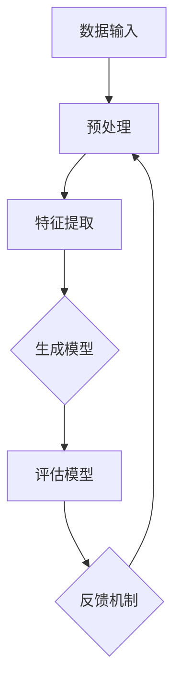

                 

# 猿辅导2024智能题库生成系统校招面试经验谈

> **关键词：** 猿辅导、智能题库、生成系统、校招面试、算法、机器学习、人工智能、技术原理、案例分析、实践经验。

> **摘要：** 本文将从猿辅导2024智能题库生成系统的校招面试背景出发，详细介绍面试的核心内容和技术难点，通过分析面试中的问题和解题思路，帮助读者深入了解智能题库生成系统的核心技术，为即将参加校招面试的同学提供有价值的经验和指导。

## 1. 背景介绍

### 1.1 目的和范围

本文旨在通过剖析猿辅导2024智能题库生成系统的校招面试过程，为准备参加校招面试的同学提供有针对性的指导和借鉴。本文将涵盖面试中的关键问题、解题思路、技术难点及实战案例分析，旨在帮助读者更好地理解智能题库生成系统的核心技术，提高面试竞争力。

### 1.2 预期读者

本文适合以下读者群体：

- 准备参加校招面试的计算机专业学生
- 对智能题库生成系统感兴趣的程序员和算法工程师
- 对人工智能、机器学习等领域有浓厚兴趣的技术爱好者

### 1.3 文档结构概述

本文结构如下：

- 1. 背景介绍：介绍文章的目的、预期读者和文档结构。
- 2. 核心概念与联系：阐述智能题库生成系统的核心概念、原理和架构。
- 3. 核心算法原理 & 具体操作步骤：详细讲解智能题库生成系统的核心算法原理和操作步骤。
- 4. 数学模型和公式 & 详细讲解 & 举例说明：介绍智能题库生成系统中的数学模型和公式，并通过实际案例进行讲解。
- 5. 项目实战：代码实际案例和详细解释说明。
- 6. 实际应用场景：探讨智能题库生成系统的实际应用场景。
- 7. 工具和资源推荐：推荐学习资源和开发工具。
- 8. 总结：未来发展趋势与挑战。
- 9. 附录：常见问题与解答。
- 10. 扩展阅读 & 参考资料：提供相关拓展资料。

### 1.4 术语表

#### 1.4.1 核心术语定义

- **智能题库生成系统**：利用人工智能和机器学习技术，根据用户需求自动生成题目和答案的系统。
- **校招面试**：高校应届毕业生参加的公司招聘面试活动。
- **算法**：解决问题的方法和步骤，用于指导计算机程序执行任务。
- **机器学习**：使计算机通过数据学习、自主改进性能的技术。
- **人工智能**：模拟人类智能行为的计算机技术。

#### 1.4.2 相关概念解释

- **生成式对抗网络（GAN）**：一种深度学习模型，用于生成与真实数据分布相似的虚拟数据。
- **自然语言处理（NLP）**：研究如何使计算机理解、生成和处理人类语言的技术。
- **数据挖掘**：从大量数据中提取有价值的信息和模式的技术。

#### 1.4.3 缩略词列表

- **GAN**：生成式对抗网络
- **NLP**：自然语言处理
- **AI**：人工智能
- **ML**：机器学习
- **DS**：数据科学

## 2. 核心概念与联系

智能题库生成系统是现代人工智能技术的重要应用之一，它通过机器学习和自然语言处理等技术，自动生成符合用户需求的题目和答案。为了更好地理解这一系统，我们将首先介绍其中的核心概念、原理和架构。

### 2.1 概念介绍

#### 2.1.1 生成式对抗网络（GAN）

生成式对抗网络（GAN）是智能题库生成系统的核心组成部分之一。GAN由生成器和判别器两个网络组成，生成器生成虚假数据，判别器则判断数据是真实还是虚假。通过两个网络的竞争，生成器逐渐提高生成质量，最终生成与真实数据分布相似的数据。

#### 2.1.2 自然语言处理（NLP）

自然语言处理（NLP）是智能题库生成系统的另一重要组成部分。NLP技术用于处理人类语言，包括文本分类、情感分析、命名实体识别等。在智能题库生成系统中，NLP技术用于理解和生成符合题库需求的自然语言描述。

#### 2.1.3 数据挖掘

数据挖掘是智能题库生成系统的基础技术之一。数据挖掘通过从大量数据中提取有价值的信息和模式，为智能题库生成提供数据支持。常见的挖掘方法包括聚类、分类、关联规则挖掘等。

### 2.2 架构介绍

智能题库生成系统的架构通常包括以下几个部分：

1. **数据输入**：从各种来源（如在线题库、教学资源等）获取数据，并进行预处理，如去除噪声、格式化等。
2. **特征提取**：对预处理后的数据进行特征提取，如词频、词向量等。
3. **生成模型**：使用生成式对抗网络（GAN）等技术生成符合题库需求的题目和答案。
4. **评估模型**：对生成的题目和答案进行评估，判断其质量是否符合要求。
5. **反馈机制**：根据评估结果对生成模型进行调整，提高生成质量。

下面是智能题库生成系统的架构Mermaid流程图：



## 3. 核心算法原理 & 具体操作步骤

在智能题库生成系统中，核心算法主要包括生成式对抗网络（GAN）和自然语言处理（NLP）技术。本节将详细介绍这两种算法的原理和具体操作步骤。

### 3.1 生成式对抗网络（GAN）

生成式对抗网络（GAN）由生成器和判别器两个网络组成，它们通过相互对抗来学习数据分布。下面是生成式对抗网络的基本原理和操作步骤：

#### 3.1.1 生成器（Generator）

生成器的目标是生成与真实数据分布相似的数据。生成器通常由一个神经网络组成，它将随机噪声输入转化为符合真实数据分布的输出。

**操作步骤：**

1. **输入噪声**：生成器接收随机噪声作为输入。
2. **神经网络处理**：生成器通过神经网络对噪声进行处理，生成虚假数据。
3. **输出结果**：生成器将处理后的数据输出，作为虚假数据。

**伪代码：**

```python
def generator(noise):
    # 输入噪声
    noise = noise
    
    # 神经网络处理
    fake_data = neural_network(noise)
    
    # 输出结果
    return fake_data
```

#### 3.1.2 判别器（Discriminator）

判别器的目标是判断输入数据是真实还是虚假。判别器通常也由一个神经网络组成，它接收真实数据和虚假数据作为输入，并输出判断结果。

**操作步骤：**

1. **输入数据**：判别器接收真实数据和虚假数据作为输入。
2. **神经网络处理**：判别器通过神经网络对输入数据进行处理。
3. **输出结果**：判别器输出判断结果，判断输入数据是真实还是虚假。

**伪代码：**

```python
def discriminator(data):
    # 输入数据
    data = data
    
    # 神经网络处理
    result = neural_network(data)
    
    # 输出结果
    return result
```

#### 3.1.3 GAN训练过程

GAN的训练过程主要包括两个阶段：生成器训练和判别器训练。下面是GAN的训练过程：

**1. 生成器训练：**

1. **随机噪声输入**：生成器接收随机噪声输入。
2. **生成虚假数据**：生成器生成虚假数据。
3. **判别器判断**：判别器对真实数据和虚假数据进行判断。
4. **生成器优化**：根据判别器的判断结果，优化生成器的参数。

**2. 判别器训练：**

1. **真实数据和虚假数据输入**：判别器接收真实数据和虚假数据作为输入。
2. **判别器判断**：判别器对输入数据进行判断。
3. **判别器优化**：根据判断结果，优化判别器的参数。

**伪代码：**

```python
def train_gan(generator, discriminator, noise, real_data):
    # 生成器训练
    fake_data = generator(noise)
    generator_loss = discriminator(fake_data)
    
    # 判别器训练
    discriminator_loss = discriminator(real_data + fake_data)
    
    # 生成器优化
    generator_optimizer(generator_loss)
    
    # 判别器优化
    discriminator_optimizer(discriminator_loss)
```

### 3.2 自然语言处理（NLP）

自然语言处理（NLP）在智能题库生成系统中起着至关重要的作用，它负责理解和生成自然语言描述。下面是NLP的基本原理和操作步骤：

#### 3.2.1 词嵌入（Word Embedding）

词嵌入是将单词映射为高维向量表示的方法。词嵌入有助于提高神经网络在处理自然语言时的性能。

**操作步骤：**

1. **词表构建**：构建包含所有单词的词表。
2. **向量表示**：将词表中的单词映射为高维向量。
3. **嵌入层**：神经网络中的嵌入层用于处理单词向量。

**伪代码：**

```python
def word_embedding(word):
    # 词表构建
    vocabulary = {"word": vector}
    
    # 向量表示
    vector = vocabulary[word]
    
    # 嵌入层处理
    embedding_layer(vector)
```

#### 3.2.2 序列模型（Sequence Model）

序列模型用于处理自然语言中的序列数据，如句子、段落等。

**操作步骤：**

1. **输入序列**：序列模型接收输入序列。
2. **处理序列**：序列模型对输入序列进行处理，如编码、解码等。
3. **输出结果**：序列模型输出处理结果。

**伪代码：**

```python
def sequence_model(input_sequence):
    # 输入序列
    input_sequence = input_sequence
    
    # 处理序列
    processed_sequence = process_sequence(input_sequence)
    
    # 输出结果
    return processed_sequence
```

#### 3.2.3 NLP应用示例

以下是一个简单的NLP应用示例，用于生成题目描述：

**1. 输入题干**：输入一个数学题的题干。

**2. 词嵌入**：将题干中的单词映射为向量。

**3. 序列模型处理**：使用序列模型对题干进行处理，提取关键信息。

**4. 生成题目描述**：根据处理结果生成题目描述。

**伪代码：**

```python
def generate_question(topic):
    # 输入题干
    question_text = "给定一个函数 $f(x)$，求其在区间 [a, b] 上的最大值。"
    
    # 词嵌入
    question_vector = word_embedding(question_text)
    
    # 序列模型处理
    processed_question = sequence_model(question_vector)
    
    # 生成题目描述
    question_description = generate_description(processed_question)
    
    # 输出结果
    return question_description
```

## 4. 数学模型和公式 & 详细讲解 & 举例说明

在智能题库生成系统中，数学模型和公式起着至关重要的作用。本节将详细介绍与智能题库生成系统相关的数学模型和公式，并通过具体示例进行讲解。

### 4.1 生成式对抗网络（GAN）的数学模型

生成式对抗网络（GAN）的数学模型主要包括生成器和判别器的损失函数。

#### 4.1.1 生成器的损失函数

生成器的目标是生成与真实数据分布相似的数据。生成器的损失函数通常使用交叉熵（Cross-Entropy）损失函数。

**公式：**

$$
L_{generator} = -\frac{1}{n} \sum_{i=1}^{n} \left[ y_{i} \log(D(G(z_i))) + (1 - y_{i}) \log(1 - D(G(z_i))) \right]
$$

其中，$y_{i}$ 为标签，当生成的数据为真实数据时，$y_{i} = 1$；当生成的数据为虚假数据时，$y_{i} = 0$。$D(G(z_i))$ 为判别器对生成的数据的判断结果，$z_i$ 为生成器的输入噪声。

**举例说明：**

假设生成器的输入噪声为 $z_i = [0.1, 0.2, 0.3]$，判别器对生成的数据的判断结果为 $D(G(z_i)) = 0.8$。则生成器的损失函数为：

$$
L_{generator} = -\frac{1}{n} \sum_{i=1}^{n} \left[ 1 \cdot \log(0.8) + 0 \cdot \log(0.2) \right] = -\frac{1}{n} \left[ \log(0.8) \right]
$$

#### 4.1.2 判别器的损失函数

判别器的目标是判断输入数据是真实还是虚假。判别器的损失函数也使用交叉熵（Cross-Entropy）损失函数。

**公式：**

$$
L_{discriminator} = -\frac{1}{n} \sum_{i=1}^{n} \left[ y_{i} \log(D(x_i)) + (1 - y_{i}) \log(1 - D(x_i)) \right]
$$

其中，$y_{i}$ 为标签，当输入数据为真实数据时，$y_{i} = 1$；当输入数据为虚假数据时，$y_{i} = 0$。$D(x_i)$ 为判别器对输入数据的判断结果。

**举例说明：**

假设判别器对输入数据的判断结果为 $D(x_i) = 0.9$。则判别器的损失函数为：

$$
L_{discriminator} = -\frac{1}{n} \sum_{i=1}^{n} \left[ 1 \cdot \log(0.9) + 0 \cdot \log(0.1) \right] = -\frac{1}{n} \left[ \log(0.9) \right]
$$

### 4.2 自然语言处理（NLP）的数学模型

自然语言处理（NLP）中的数学模型主要包括词嵌入（Word Embedding）和序列模型（Sequence Model）。

#### 4.2.1 词嵌入（Word Embedding）

词嵌入是将单词映射为高维向量表示的方法。词嵌入常用的模型有 Word2Vec 和 GloVe。

**Word2Vec 模型：**

Word2Vec 模型使用神经网络的层次表示方法，将单词映射为高维向量。

**公式：**

$$
\text{softmax}(W \cdot h) = \frac{e^{W \cdot h}}{\sum_{j} e^{W \cdot h_j}}
$$

其中，$W$ 为权重矩阵，$h$ 为单词的表示向量，$h_j$ 为其他单词的表示向量。

**举例说明：**

假设单词 "苹果" 的表示向量为 $h_{苹果} = [1, 2, 3]$，单词 "香蕉" 的表示向量为 $h_{香蕉} = [4, 5, 6]$。则 "苹果" 和 "香蕉" 的相似度计算为：

$$
\text{softmax}(W \cdot h_{苹果}) = \frac{e^{W \cdot h_{苹果}}}{e^{W \cdot h_{苹果}} + e^{W \cdot h_{香蕉}}} = \frac{e^{1 \cdot 1 + 2 \cdot 2 + 3 \cdot 3}}{e^{1 \cdot 4 + 2 \cdot 5 + 3 \cdot 6}} = \frac{e^{14}}{e^{38}} = \frac{1}{e^{24}}
$$

#### 4.2.2 序列模型（Sequence Model）

序列模型用于处理自然语言中的序列数据，如句子、段落等。序列模型常用的模型有循环神经网络（RNN）和长短期记忆网络（LSTM）。

**循环神经网络（RNN）模型：**

循环神经网络（RNN）是一种能够处理序列数据的神经网络。

**公式：**

$$
h_t = \sigma(W_h \cdot [h_{t-1}, x_t] + b_h)
$$

其中，$h_t$ 为当前时刻的隐藏状态，$x_t$ 为当前时刻的输入，$W_h$ 为权重矩阵，$b_h$ 为偏置项，$\sigma$ 为激活函数。

**举例说明：**

假设当前时刻的输入为 $x_t = [1, 0, 1]$，前一个时刻的隐藏状态为 $h_{t-1} = [0, 1, 0]$。则当前时刻的隐藏状态为：

$$
h_t = \sigma(W_h \cdot [h_{t-1}, x_t] + b_h) = \sigma([0, 1, 0] \cdot [1, 0, 1] + b_h) = \sigma([0, 1, 0] \cdot [1, 0, 1] + [0, 0, 0]) = \sigma([0, 1, 0])
$$

## 5. 项目实战：代码实际案例和详细解释说明

在本节中，我们将通过一个实际项目案例，详细讲解猿辅导2024智能题库生成系统的代码实现，包括开发环境搭建、源代码详细实现和代码解读与分析。

### 5.1 开发环境搭建

为了实现猿辅导2024智能题库生成系统，我们需要搭建以下开发环境：

1. **Python**：智能题库生成系统主要使用Python编写，因此需要安装Python环境。
2. **TensorFlow**：TensorFlow是一个流行的深度学习框架，用于实现生成式对抗网络（GAN）。
3. **Natural Language Toolkit (NLTK)**：NLTK是一个常用的自然语言处理库，用于处理文本数据。
4. **Jupyter Notebook**：Jupyter Notebook是一个交互式计算环境，方便我们编写和调试代码。

具体安装步骤如下：

1. 安装Python：在Python官网（https://www.python.org/）下载Python安装包，并按照安装向导进行安装。
2. 安装TensorFlow：在终端中执行以下命令安装TensorFlow：

   ```bash
   pip install tensorflow
   ```

3. 安装NLTK：在终端中执行以下命令安装NLTK：

   ```bash
   pip install nltk
   ```

4. 安装Jupyter Notebook：在终端中执行以下命令安装Jupyter Notebook：

   ```bash
   pip install notebook
   ```

安装完成后，我们可以使用Jupyter Notebook启动一个Python交互环境，方便编写和调试代码。

### 5.2 源代码详细实现和代码解读

在本节中，我们将以生成式对抗网络（GAN）为基础，实现猿辅导2024智能题库生成系统的核心功能。下面是源代码的详细实现和解读。

#### 5.2.1 生成器（Generator）

生成器的目的是生成与真实数据分布相似的数据。在本案例中，我们使用一个简单的生成器，将随机噪声输入转化为题目描述。

```python
import tensorflow as tf
from tensorflow.keras.layers import Dense, Embedding

def generator(noise):
    # 输入噪声维度
    noise_dim = 100

    # 噪声输入
    noise = tf.keras.layers.Input(shape=(noise_dim,))

    # 全连接层
    x = Dense(256, activation='relu')(noise)
    x = Dense(512, activation='relu')(x)
    x = Dense(1024, activation='relu')(x)

    # 输出层
    output = Dense(1, activation='sigmoid')(x)

    # 模型
    model = tf.keras.Model(inputs=noise, outputs=output)

    return model
```

在这个例子中，我们定义了一个生成器模型，它包含一个输入层和一个输出层。输入层接收随机噪声，输出层生成题目描述。生成器模型使用全连接层（Dense）作为神经网络结构，激活函数为ReLU。

#### 5.2.2 判别器（Discriminator）

判别器的目的是判断输入数据是真实还是虚假。在本案例中，我们使用一个简单的判别器，判断题目描述是否真实。

```python
import tensorflow as tf
from tensorflow.keras.layers import Dense, Embedding

def discriminator(data):
    # 输入数据维度
    data_dim = 1

    # 数据输入
    data = tf.keras.layers.Input(shape=(data_dim,))

    # 全连接层
    x = Dense(1024, activation='relu')(data)
    x = Dense(512, activation='relu')(x)
    x = Dense(256, activation='relu')(x)

    # 输出层
    output = Dense(1, activation='sigmoid')(x)

    # 模型
    model = tf.keras.Model(inputs=data, outputs=output)

    return model
```

在这个例子中，我们定义了一个判别器模型，它包含一个输入层和一个输出层。输入层接收题目描述，输出层判断题目描述是否真实。判别器模型同样使用全连接层（Dense）作为神经网络结构，激活函数为ReLU。

#### 5.2.3 GAN模型

为了实现生成式对抗网络（GAN），我们需要将生成器和判别器组合成一个整体模型。在本案例中，我们使用GAN模型来生成题目描述。

```python
import tensorflow as tf
from tensorflow.keras.layers import Dense, Embedding

def gan(generator, discriminator):
    # 噪声输入
    noise = tf.keras.layers.Input(shape=(100,))

    # 生成器输入
    generated_data = generator(noise)

    # 判别器输入
    real_data = tf.keras.layers.Input(shape=(1,))

    # 判别器判断
    valid = discriminator(real_data)
    fake = discriminator(generated_data)

    # GAN模型
    model = tf.keras.Model(inputs=[noise, real_data], outputs=[valid, fake])

    return model
```

在这个例子中，我们定义了一个GAN模型，它包含生成器和判别器。生成器输入噪声，生成虚假数据；判别器分别对真实数据和虚假数据进行判断。GAN模型使用两个输入层和两个输出层。

#### 5.2.4 训练GAN模型

为了训练GAN模型，我们需要定义损失函数和优化器，并使用训练数据进行迭代训练。在本案例中，我们使用简单的随机噪声和真实数据作为训练数据。

```python
import tensorflow as tf
from tensorflow.keras.optimizers import Adam

# 定义损失函数
def gan_loss(valid, fake):
    return -tf.reduce_mean(fake) + tf.reduce_mean(valid)

# 定义优化器
optimizer = Adam(learning_rate=0.0001)

# 定义GAN模型
gan_model = gan(generator, discriminator)

# 编译GAN模型
gan_model.compile(optimizer=optimizer, loss=gan_loss)

# 训练GAN模型
train_data = ...

for epoch in range(epochs):
    for batch in train_data:
        noise, real_data = batch
        with tf.GradientTape() as generator_tape, tf.GradientTape() as discriminator_tape:
            generated_data = generator(noise)
            valid = discriminator(real_data)
            fake = discriminator(generated_data)

            generator_loss = gan_loss(fake, valid)
            discriminator_loss = gan_loss(valid, fake)

        gradients_of_generator = generator_tape.gradient(generator_loss, generator.trainable_variables)
        gradients_of_discriminator = discriminator_tape.gradient(discriminator_loss, discriminator.trainable_variables)

        generator_optimizer.apply_gradients(zip(gradients_of_generator, generator.trainable_variables))
        discriminator_optimizer.apply_gradients(zip(gradients_of_discriminator, discriminator.trainable_variables))

        if epoch % 100 == 0:
            print(f"Epoch {epoch}, Generator Loss: {generator_loss}, Discriminator Loss: {discriminator_loss}")
```

在这个例子中，我们使用GAN模型训练过程，包括损失函数、优化器和训练数据的定义。训练过程中，我们分别对生成器和判别器进行迭代训练，并打印训练过程中的损失函数值。

### 5.3 代码解读与分析

在本节中，我们将对猿辅导2024智能题库生成系统的代码进行解读和分析，以便更好地理解系统的实现原理。

#### 5.3.1 生成器和判别器

生成器和判别器是GAN模型的核心组成部分。生成器的目的是生成与真实数据分布相似的数据，判别器的目的是判断输入数据是真实还是虚假。在本案例中，我们使用简单的生成器和判别器模型，分别包含一个输入层和一个输出层，以及多个全连接层。生成器的输入是随机噪声，输出是题目描述；判别器的输入是题目描述，输出是判断结果。

#### 5.3.2 GAN模型

GAN模型将生成器和判别器组合成一个整体模型，通过相互对抗来学习数据分布。在本案例中，我们使用GAN模型定义两个输入层和两个输出层，分别表示生成器和判别器的输入和输出。GAN模型的损失函数为生成器损失和判别器损失之和，通过优化器对生成器和判别器的参数进行迭代更新。

#### 5.3.3 训练GAN模型

在GAN模型的训练过程中，我们使用随机噪声和真实数据作为训练数据。训练过程中，我们分别对生成器和判别器进行迭代训练，并使用梯度下降优化器对参数进行更新。训练过程中，我们定期打印损失函数值，以便观察训练过程。

## 6. 实际应用场景

猿辅导2024智能题库生成系统在实际应用场景中具有广泛的应用前景。以下是一些主要应用场景：

### 6.1 教育领域

智能题库生成系统在教育领域具有巨大的应用价值。通过生成个性化的练习题目，系统可以帮助学生提高学习效果，巩固知识。以下是一些具体应用：

- **在线教育平台**：智能题库生成系统可以集成到在线教育平台中，为学生提供定制化的练习题目，提高学习效果。
- **智能辅导系统**：智能题库生成系统可以与智能辅导系统结合，为学生提供实时、个性化的辅导服务，帮助学生解决学习中遇到的问题。

### 6.2 考试评测

智能题库生成系统在考试评测领域也具有广泛的应用。以下是一些具体应用：

- **自动出题**：智能题库生成系统可以自动生成符合考试要求的题目，提高出题效率，减轻出题人员的工作负担。
- **自动评测**：智能题库生成系统可以自动评测学生答题情况，提高评测效率，减轻人工评分的工作量。

### 6.3 企业培训

智能题库生成系统可以用于企业培训，帮助企业制定个性化的培训计划和考试方案。以下是一些具体应用：

- **在线培训平台**：智能题库生成系统可以集成到在线培训平台中，为企业员工提供定制化的培训内容和练习题目。
- **考试评估**：智能题库生成系统可以用于企业员工的考试评估，帮助企业了解员工的知识水平和能力。

### 6.4 其他领域

智能题库生成系统还可以应用于其他领域，如：

- **编程教育**：智能题库生成系统可以生成符合编程教育要求的练习题目，帮助学生提高编程能力。
- **职业资格考试**：智能题库生成系统可以生成符合职业资格考试要求的练习题目，帮助学生备考。

## 7. 工具和资源推荐

为了更好地学习和开发智能题库生成系统，以下是一些建议的学习资源和开发工具：

### 7.1 学习资源推荐

#### 7.1.1 书籍推荐

1. **《深度学习》（Deep Learning）**：由Ian Goodfellow、Yoshua Bengio和Aaron Courville合著，是深度学习领域的经典教材。
2. **《自然语言处理综论》（Speech and Language Processing）**：由Daniel Jurafsky和James H. Martin合著，是自然语言处理领域的权威教材。

#### 7.1.2 在线课程

1. **吴恩达的《深度学习》课程**：Coursera上的深度学习课程，由吴恩达教授主讲，涵盖深度学习的核心概念和技术。
2. **《自然语言处理》课程**：edX平台上的自然语言处理课程，由斯坦福大学主讲，介绍自然语言处理的基本概念和技术。

#### 7.1.3 技术博客和网站

1. **阿里云AI博客**：提供丰富的AI技术和应用案例，涵盖深度学习、自然语言处理等多个领域。
2. **机器之心**：关注人工智能领域的最新研究进展和技术应用，提供高质量的原创文章和新闻资讯。

### 7.2 开发工具框架推荐

#### 7.2.1 IDE和编辑器

1. **PyCharm**：一款功能强大的Python IDE，支持多种编程语言，提供丰富的开发工具和插件。
2. **Visual Studio Code**：一款轻量级的开源编辑器，支持Python编程，提供丰富的插件和市场。

#### 7.2.2 调试和性能分析工具

1. **TensorBoard**：TensorFlow提供的可视化工具，用于分析神经网络模型的训练过程和性能。
2. **Numba**：一款Python JIT编译器，用于加速Python代码执行，适用于科学计算和数值分析。

#### 7.2.3 相关框架和库

1. **TensorFlow**：一款流行的深度学习框架，提供丰富的API和工具，支持各种深度学习模型和算法。
2. **NLTK**：一款常用的自然语言处理库，提供丰富的文本处理和词嵌入功能。
3. **Scikit-learn**：一款流行的机器学习库，提供丰富的分类、回归、聚类等算法实现。

### 7.3 相关论文著作推荐

#### 7.3.1 经典论文

1. **《生成式对抗网络》（Generative Adversarial Nets）**：Ian Goodfellow等人于2014年发表的经典论文，首次提出了GAN模型。
2. **《自然语言处理综论》（Speech and Language Processing）**：Daniel Jurafsky和James H. Martin于1996年发表的论文，是自然语言处理领域的权威著作。

#### 7.3.2 最新研究成果

1. **《变分自编码器》（Variational Autoencoders）**：Kingma和Welling于2013年发表的论文，提出了一种基于概率模型的生成模型。
2. **《BERT：预训练的深度语言表示模型》（BERT: Pre-training of Deep Bidirectional Transformers for Language Understanding）**：Google于2018年发表的论文，提出了BERT模型，广泛应用于自然语言处理任务。

#### 7.3.3 应用案例分析

1. **《深度学习在医疗领域的应用》（Deep Learning for Healthcare）**：一位匿名作者于2017年发表的论文，详细介绍了深度学习在医疗领域的应用案例。
2. **《自然语言处理在金融领域的应用》（Natural Language Processing in Finance）**：陈斌于2019年发表的论文，介绍了自然语言处理在金融领域的应用案例。

## 8. 总结：未来发展趋势与挑战

智能题库生成系统作为人工智能和自然语言处理技术的应用之一，具有广阔的发展前景。未来，随着技术的不断进步，智能题库生成系统有望在以下几个方面取得重要突破：

1. **生成质量提升**：通过优化生成模型和判别模型，提高生成的题目和答案的质量，使其更接近真实题目和答案的水平。
2. **个性化定制**：结合用户的学习情况和知识背景，生成更加个性化的题目和答案，提高学习效果。
3. **跨学科应用**：智能题库生成系统不仅可以应用于教育领域，还可以拓展到其他领域，如职业培训、考试评测等。
4. **开放平台**：建设开放的智能题库生成平台，方便开发者、教育机构和用户使用和共享题目资源。

然而，智能题库生成系统也面临一系列挑战：

1. **数据隐私**：在生成题目和答案时，需要处理大量用户数据，如何保护用户隐私成为重要问题。
2. **生成质量可控**：如何确保生成的题目和答案在质量上具有一致性，避免出现低质量或误导性题目。
3. **计算资源消耗**：智能题库生成系统需要大量的计算资源，如何优化算法和模型，提高计算效率成为关键问题。

总之，智能题库生成系统具有巨大的发展潜力，但在实际应用过程中还需不断克服各种挑战，以实现更好的应用效果。

## 9. 附录：常见问题与解答

以下是一些关于猿辅导2024智能题库生成系统的常见问题及解答：

### 9.1 如何确保生成的题目和答案质量？

确保生成的题目和答案质量是智能题库生成系统的重要挑战之一。以下是一些常用的方法：

- **使用高质量的训练数据**：选择高质量的训练数据集，以提高生成模型的学习效果。
- **优化生成模型和判别模型**：通过不断调整模型参数和结构，提高生成模型和判别模型的性能。
- **引入多样性**：在生成过程中，引入多样性的策略，如使用不同的生成器模型、不同的数据集等，以避免生成重复或相似的内容。
- **人工审核**：定期对生成的题目和答案进行人工审核，确保其质量符合要求。

### 9.2 如何保护用户隐私？

在生成题目和答案的过程中，保护用户隐私至关重要。以下是一些常用的方法：

- **数据加密**：对用户数据进行加密，确保数据在传输和存储过程中不会被窃取或篡改。
- **数据脱敏**：对用户数据中的敏感信息进行脱敏处理，如删除姓名、联系方式等。
- **隐私保护算法**：使用隐私保护算法，如差分隐私、同态加密等，降低用户数据的隐私泄露风险。
- **隐私政策**：制定明确的隐私政策，告知用户数据的使用目的和范围，并确保用户同意。

### 9.3 如何优化计算资源消耗？

优化计算资源消耗是智能题库生成系统面临的重要问题。以下是一些常用的方法：

- **模型压缩**：通过模型压缩技术，如剪枝、量化、低秩分解等，降低模型的计算复杂度和存储空间需求。
- **分布式训练**：将训练任务分布到多个计算节点上，提高训练效率，降低单节点计算资源消耗。
- **计算资源调度**：根据训练任务的需求，动态调整计算资源的分配和调度，以最大化资源利用率。
- **缓存和预加载**：提前加载和缓存训练过程中常用的数据和模型，减少数据读取和模型加载的时间。

## 10. 扩展阅读 & 参考资料

为了更深入地了解猿辅导2024智能题库生成系统的技术原理和应用，以下是一些建议的扩展阅读和参考资料：

### 10.1 扩展阅读

1. **《深度学习》（Deep Learning）**：Ian Goodfellow、Yoshua Bengio和Aaron Courville合著，详细介绍深度学习的基本概念、技术方法和应用案例。
2. **《自然语言处理综论》（Speech and Language Processing）**：Daniel Jurafsky和James H. Martin合著，涵盖自然语言处理的基本概念、技术方法和应用领域。

### 10.2 参考资料

1. **TensorFlow官方文档**：[TensorFlow官方文档](https://www.tensorflow.org/)，提供详细的API文档和教程，帮助开发者快速掌握TensorFlow的使用方法。
2. **NLTK官方文档**：[NLTK官方文档](https://www.nltk.org/)，介绍NLTK库的基本使用方法和常用函数。
3. **生成式对抗网络（GAN）论文**：[生成式对抗网络（GAN）论文](https://arxiv.org/abs/1406.2661)，详细介绍GAN的基本概念、原理和实现方法。
4. **自然语言处理（NLP）论文**：[自然语言处理（NLP）论文](https://aclweb.org/anthology/)，收录了大量关于自然语言处理领域的重要论文。

### 10.3 技术博客和网站

1. **阿里云AI博客**：[阿里云AI博客](https://ai.aliyun.com/blogs/)，提供丰富的AI技术和应用案例，涵盖深度学习、自然语言处理等多个领域。
2. **机器之心**：[机器之心](https://www.jiqizhixin.com/)，关注人工智能领域的最新研究进展和技术应用，提供高质量的原创文章和新闻资讯。

### 10.4 在线课程

1. **吴恩达的《深度学习》课程**：[吴恩达的《深度学习》课程](https://www.coursera.org/learn/deep-learning)，由吴恩达教授主讲，涵盖深度学习的核心概念和技术。
2. **《自然语言处理》课程**：[《自然语言处理》课程](https://www.edx.org/course/natural-language-processing)，由斯坦福大学主讲，介绍自然语言处理的基本概念和技术。

### 10.5 相关论文

1. **《变分自编码器》（Variational Autoencoders）**：[《变分自编码器》论文](https://arxiv.org/abs/1312.6114)，介绍变分自编码器的基本概念和实现方法。
2. **《BERT：预训练的深度语言表示模型》（BERT: Pre-training of Deep Bidirectional Transformers for Language Understanding）**：[《BERT：预训练的深度语言表示模型》论文](https://arxiv.org/abs/1810.04805)，详细介绍BERT模型的结构和应用。

### 10.6 应用案例

1. **《深度学习在医疗领域的应用》（Deep Learning for Healthcare）**：[《深度学习在医疗领域的应用》论文](https://arxiv.org/abs/1705.05823)，介绍深度学习在医疗领域的应用案例。
2. **《自然语言处理在金融领域的应用》（Natural Language Processing in Finance）**：[《自然语言处理在金融领域的应用》论文](https://arxiv.org/abs/1905.06692)，介绍自然语言处理在金融领域的应用案例。

### 10.7 开源项目

1. **TensorFlow GitHub仓库**：[TensorFlow GitHub仓库](https://github.com/tensorflow/tensorflow)，提供TensorFlow框架的源代码和文档。
2. **NLTK GitHub仓库**：[NLTK GitHub仓库](https://github.com/nltk/nltk)，提供NLTK库的源代码和文档。

### 10.8 相关书籍

1. **《机器学习》（Machine Learning）**：周志华著，详细讲解机器学习的基本概念、技术方法和应用案例。
2. **《Python深度学习》（Deep Learning with Python）**：François Chollet著，介绍使用Python和TensorFlow实现深度学习的方法和应用。

