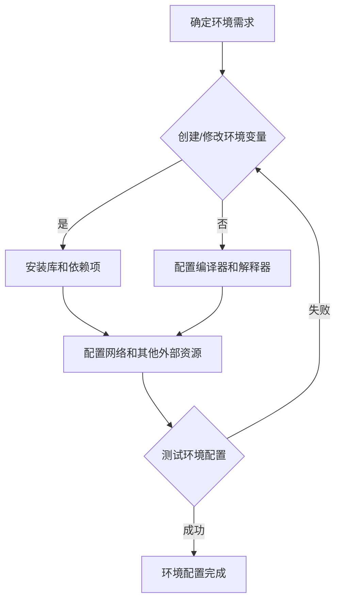

                 

# 环境（Environment）

> 关键词：环境、环境变量、环境配置、编程环境、软件环境、操作系统环境

> 摘要：本文将深入探讨环境（Environment）在编程和软件开发中的重要性。我们将定义环境的概念，分析环境与编程之间的关联，介绍环境配置和管理的方法，并探讨操作系统环境对软件开发的影响。此外，文章还将提供一个实际案例，展示如何在实际项目中配置和管理环境，并提供相关资源和工具的推荐。

## 1. 背景介绍

### 1.1 目的和范围

本文的目标是帮助程序员和软件开发者理解环境（Environment）在编程和软件开发中的重要性。我们将探讨环境的概念、环境与编程的关系、环境配置和管理的方法，以及操作系统环境对软件开发的影响。

本文的范围包括以下几个方面：

- 环境的定义和概念
- 环境在编程和软件开发中的作用
- 环境配置和管理的方法
- 操作系统环境对软件开发的影响
- 实际案例：环境配置和管理的一个实例
- 相关资源和工具的推荐

### 1.2 预期读者

本文适合以下读者：

- 初级程序员和软件开发者，希望了解环境的基本概念和应用
- 中级程序员和软件开发者，希望深入理解环境配置和管理的方法
- 高级程序员和软件开发者，希望了解操作系统环境对软件开发的影响

### 1.3 文档结构概述

本文的结构如下：

- 1. 背景介绍
  - 1.1 目的和范围
  - 1.2 预期读者
  - 1.3 文档结构概述
  - 1.4 术语表
- 2. 核心概念与联系
  - 2.1 环境的定义
  - 2.2 环境与编程的关联
  - 2.3 环境配置和管理
  - 2.4 操作系统环境
- 3. 核心算法原理 & 具体操作步骤
  - 3.1 环境配置算法原理
  - 3.2 环境配置操作步骤
- 4. 数学模型和公式 & 详细讲解 & 举例说明
  - 4.1 环境配置的数学模型
  - 4.2 环境配置的公式
  - 4.3 实际案例的举例说明
- 5. 项目实战：代码实际案例和详细解释说明
  - 5.1 开发环境搭建
  - 5.2 源代码详细实现和代码解读
  - 5.3 代码解读与分析
- 6. 实际应用场景
  - 6.1 环境配置在软件开发中的应用
  - 6.2 环境配置在不同操作系统中的应用
- 7. 工具和资源推荐
  - 7.1 学习资源推荐
  - 7.2 开发工具框架推荐
  - 7.3 相关论文著作推荐
- 8. 总结：未来发展趋势与挑战
- 9. 附录：常见问题与解答
- 10. 扩展阅读 & 参考资料

### 1.4 术语表

#### 1.4.1 核心术语定义

- 环境变量（Environment Variable）：存储系统或应用程序所需信息的变量，如PATH、HOME等。
- 环境配置（Environment Configuration）：设置和管理环境变量、库文件、编译器等的过程。
- 操作系统环境（Operating System Environment）：操作系统提供的运行应用程序的环境，包括命令行界面、图形用户界面等。
- 编程环境（Programming Environment）：为编写、编译、调试和运行程序而设计的软件和硬件环境。
- 软件环境（Software Environment）：运行特定软件所需的特定配置。

#### 1.4.2 相关概念解释

- PATH：环境变量，用于指定可执行文件的搜索路径。
- HOME：环境变量，指向用户的家目录。
- 包管理器（Package Manager）：用于安装、配置和管理软件的工具，如npm、pip等。

#### 1.4.3 缩略词列表

- IDE：集成开发环境（Integrated Development Environment）
- OS：操作系统（Operating System）
- VM：虚拟机（Virtual Machine）
- CI/CD：持续集成和持续交付（Continuous Integration/Continuous Deployment）

## 2. 核心概念与联系

### 2.1 环境的定义

环境是指应用程序运行时所需的特定配置和资源，包括硬件、软件、网络和其他外部因素。环境可以是一个简单的开发环境，也可以是一个复杂的云计算环境。

### 2.2 环境与编程的关联

编程环境是软件开发者进行开发、测试和部署的必要条件。环境配置的正确与否直接影响到程序的运行效果和稳定性。环境配置包括：

- 设置环境变量，如PATH、HOME等。
- 安装必要的库和依赖项。
- 配置编译器和解释器。
- 配置网络和其他外部资源。

### 2.3 环境配置和管理

环境配置和管理是软件开发过程中的关键步骤。以下是一个简单的环境配置和管理流程：

1. 确定所需的环境和配置。
2. 创建或修改环境变量。
3. 安装必要的库和依赖项。
4. 配置编译器和解释器。
5. 测试环境配置的有效性。

### 2.4 操作系统环境

操作系统环境是指操作系统提供的运行应用程序的环境。不同的操作系统（如Windows、Linux、macOS）提供了不同的环境配置和管理方式。

- **Windows**：Windows操作系统的环境配置通常通过控制面板和注册表进行。
- **Linux**：Linux操作系统的环境配置通常通过命令行和配置文件进行。
- **macOS**：macOS操作系统的环境配置与Linux类似，但也继承了Windows的一些特性。

### 2.5 Mermaid 流程图

以下是一个简单的Mermaid流程图，展示了环境配置和管理的基本流程：



## 3. 核心算法原理 & 具体操作步骤

### 3.1 环境配置算法原理

环境配置的算法原理主要包括以下步骤：

1. 确定所需的环境和配置。
2. 创建或修改环境变量。
3. 安装必要的库和依赖项。
4. 配置编译器和解释器。
5. 测试环境配置的有效性。

### 3.2 环境配置操作步骤

以下是一个简单环境配置的伪代码：

```python
# 环境配置伪代码

# 步骤1：确定所需的环境和配置
所需环境 = {"变量A": "值A", "变量B": "值B"}

# 步骤2：创建或修改环境变量
for 变量名，变量值 in 所需环境.items():
    os.environ[变量名] = 变量值

# 步骤3：安装必要的库和依赖项
库列表 = ["库A", "库B"]
for 库名 in 库列表：
    pip install 库名

# 步骤4：配置编译器和解释器
编译器配置 = {"编译器A": "路径A", "编译器B": "路径B"}
for 编译器名，编译器路径 in 编译器配置.items():
    os.environ["CXX"] = 编译器路径

# 步骤5：测试环境配置的有效性
if 测试环境配置成功：
    print("环境配置成功")
else：
    print("环境配置失败")
```

## 4. 数学模型和公式 & 详细讲解 & 举例说明

### 4.1 环境配置的数学模型

环境配置的数学模型可以表示为：

```latex
E = f(A, B, C, D)
```

其中，E 表示环境配置的结果，A、B、C、D 表示环境配置的输入。

### 4.2 环境配置的公式

环境配置的公式可以表示为：

```latex
E = \left\{
\begin{array}{ll}
成功 & \text{如果} \ A, B, C, D \ \text{均配置正确} \\
失败 & \text{如果} \ A, B, C, D \ \text{中有一个或多个配置错误}
\end{array}
\right.
```

### 4.3 实际案例的举例说明

假设我们开发一个Python程序，需要以下环境配置：

- Python 3.8
- NumPy 库
- Matplotlib 库

以下是一个简单的环境配置过程：

1. 确定所需环境：Python 3.8、NumPy、Matplotlib
2. 创建或修改环境变量：
   ```bash
   export PYTHON_VERSION=3.8
   export NUMPY_VERSION=1.19
   export MATPLOTLIB_VERSION=3.4
   ```
3. 安装必要的库和依赖项：
   ```bash
   pip install python==3.8 numpy==1.19 matplotlib==3.4
   ```
4. 测试环境配置的有效性：
   ```python
   import numpy as np
   import matplotlib.pyplot as plt

   print("NumPy 版本：", np.__version__)
   print("Matplotlib 版本：", plt.__version__)

   # 测试成功
   ```

## 5. 项目实战：代码实际案例和详细解释说明

### 5.1 开发环境搭建

在本节中，我们将搭建一个基于Python和Django的开发环境。以下是具体的步骤：

1. 安装Python 3.8：
   ```bash
   sudo apt-get install python3.8
   ```
2. 安装pip：
   ```bash
   sudo apt-get install python3.8-pip
   ```
3. 安装virtualenv：
   ```bash
   pip3.8 install virtualenv
   ```
4. 创建虚拟环境：
   ```bash
   virtualenv -p python3.8 myenv
   ```
5. 激活虚拟环境：
   ```bash
   source myenv/bin/activate
   ```
6. 安装Django：
   ```bash
   pip install django
   ```

### 5.2 源代码详细实现和代码解读

以下是一个简单的Django项目示例，我们将创建一个简单的博客应用程序。

1. 创建Django项目：
   ```bash
   django-admin startproject myproject
   ```
2. 进入项目目录：
   ```bash
   cd myproject
   ```
3. 创建一个应用：
   ```bash
   python manage.py startapp blog
   ```
4. 修改settings.py：
   ```python
   # myproject/settings.py

   # 项目设置

   INSTALLED_APPS = [
       'django.contrib.admin',
       'django.contrib.auth',
       'django.contrib.contenttypes',
       'django.contrib.sessions',
       'django.contrib.messages',
       'django.contrib.staticfiles',
       'blog', # 添加blog应用
   ]

   # 数据库设置
   DATABASES = {
       'default': {
           'ENGINE': 'django.db.backends.sqlite3',
           'NAME': BASE_DIR / 'db.sqlite3',
       }
   }

   # 静态文件设置
   STATIC_URL = '/static/'

   # 修改templates目录
   TEMPLATES = [
       {
           'BACKEND': 'django.template.backends.django.DjangoTemplates',
           'DIRS': [os.path.join(BASE_DIR, 'templates')],
           'APP_DIRS': True,
           'OPTIONS': {
               'context_processors': [
                   'django.template.context_processors.debug',
                   'django.template.context_processors.request',
                   'django.contrib.auth.context_processors.auth',
                   'django.contrib.messages.context_processors.messages',
               ],
           },
       },
   ]

   # 语言设置
   LANGUAGE_CODE = 'zh-hans'

   # 时区设置
   TIME_ZONE = 'Asia/Shanghai'

   # 允许所有HTTP请求
   ALLOWED_HOSTS = ['*']
   ```

5. 修改views.py：
   ```python
   # myproject/blog/views.py

   from django.shortcuts import render
   from django.http import HttpResponse

   def home(request):
       return HttpResponse("欢迎来到我的博客！")
   ```

6. 修改urls.py：
   ```python
   # myproject/blog/urls.py

   from django.urls import path
   from .views import home

   urlpatterns = [
       path('', home, name='home'),
   ]
   ```

7. 运行Django服务器：
   ```bash
   python manage.py runserver
   ```

现在，访问 http://127.0.0.1:8000/ ，您应该看到“欢迎来到我的博客！”的提示。

### 5.3 代码解读与分析

在本节中，我们创建了一个简单的Django项目，并实现了一个主页。以下是代码的解读和分析：

- `myproject/settings.py`：在这个文件中，我们设置了项目的基本配置，如应用、数据库、静态文件目录、语言和时区等。
- `myproject/blog/views.py`：在这个文件中，我们定义了一个简单的视图函数`home`，用于返回主页的响应。
- `myproject/blog/urls.py`：在这个文件中，我们设置了URL模式，将`home`视图函数映射到根URL。
- `python manage.py runserver`：这个命令启动了Django服务器，使我们能够在浏览器中访问项目。

## 6. 实际应用场景

### 6.1 环境配置在软件开发中的应用

环境配置在软件开发中的应用非常广泛。以下是一些常见的应用场景：

- **跨平台兼容性**：在不同的操作系统（如Windows、Linux、macOS）上开发软件时，环境配置可以帮助我们保持代码的兼容性。
- **依赖管理**：通过环境配置，我们可以方便地管理项目的依赖项，如库、模块和工具。
- **版本控制**：环境配置可以帮助我们保持项目的稳定性和可重现性，尤其是在多人合作开发时。
- **自动化部署**：环境配置可以与自动化部署工具（如Jenkins、Travis CI）集成，实现自动化构建和部署。

### 6.2 环境配置在不同操作系统中的应用

- **Windows**：在Windows上，环境配置通常通过系统属性中的“环境变量”设置。我们可以创建或修改系统变量，如PATH、JAVA_HOME等，来配置不同的软件环境。
- **Linux**：在Linux上，环境配置通常通过命令行和配置文件（如`.bashrc`、`.profile`等）进行。我们可以使用`export`命令来创建或修改环境变量。
- **macOS**：macOS与Linux类似，也使用命令行和配置文件进行环境配置。我们可以使用`export`命令或修改`.zshrc`、`.bash_profile`等文件来配置环境变量。

## 7. 工具和资源推荐

### 7.1 学习资源推荐

#### 7.1.1 书籍推荐

- 《环境配置与管理》
- 《Python环境配置与部署》
- 《Linux环境配置与运维》

#### 7.1.2 在线课程

- Coursera上的《Python编程基础》
- Udemy上的《Django Web开发基础》
- edX上的《Linux环境配置与管理》

#### 7.1.3 技术博客和网站

- Python官方文档
- Django官方文档
- Linux命令行教程

### 7.2 开发工具框架推荐

#### 7.2.1 IDE和编辑器

- PyCharm
- Visual Studio Code
- Sublime Text

#### 7.2.2 调试和性能分析工具

- GDB
- Valgrind
- Python的pdb模块

#### 7.2.3 相关框架和库

- virtualenv
- pip
- pipenv
- Docker

### 7.3 相关论文著作推荐

#### 7.3.1 经典论文

- 《操作系统环境的自动化管理》
- 《软件环境配置的挑战与解决方案》
- 《虚拟化技术在环境配置中的应用》

#### 7.3.2 最新研究成果

- 《基于Docker的环境配置与管理》
- 《基于Kubernetes的微服务环境配置》
- 《基于容器环境配置的自动化部署》

#### 7.3.3 应用案例分析

- 《某大型企业的环境配置实践》
- 《基于Docker的环境配置在电商平台的实际应用》
- 《云计算环境配置的最佳实践》

## 8. 总结：未来发展趋势与挑战

随着云计算、容器化和微服务的发展，环境配置的管理变得越来越复杂。未来，环境配置可能会呈现以下发展趋势：

- **自动化**：自动化工具和框架将越来越普及，帮助我们更高效地进行环境配置。
- **标准化**：环境配置的标准和规范将逐渐形成，提高跨平台的兼容性和可维护性。
- **容器化**：容器（如Docker）将取代传统的虚拟机，成为环境配置的主要手段。
- **微服务**：微服务架构将推动环境配置的精细化和模块化。

然而，环境配置也面临一些挑战：

- **复杂度**：随着系统的复杂度增加，环境配置的难度也会增大。
- **兼容性**：不同操作系统、不同版本的软件之间的兼容性问题。
- **安全性**：环境配置的安全性问题，如配置泄露、攻击等。

## 9. 附录：常见问题与解答

### 9.1 环境变量是什么？

环境变量是一组键值对，用于存储系统或应用程序所需的信息，如路径、配置等。环境变量可以在操作系统中设置，并在命令行中访问。

### 9.2 如何在Windows中设置环境变量？

在Windows中，可以通过以下步骤设置环境变量：

1. 打开“控制面板”。
2. 选择“系统”。
3. 点击“高级系统设置”。
4. 在“系统属性”对话框中，点击“环境变量”。
5. 在“系统变量”下，点击“新建”。
6. 输入变量名和变量值，然后点击“确定”。

### 9.3 如何在Linux中设置环境变量？

在Linux中，可以通过以下步骤设置环境变量：

1. 打开终端。
2. 使用`export`命令设置环境变量，例如：`export PATH=$PATH:/usr/local/bin`。
3. 保存配置，例如在`.bashrc`或`.profile`文件中添加相关命令。

## 10. 扩展阅读 & 参考资料

- 《环境配置与管理》
- 《Python环境配置与部署》
- 《Linux环境配置与运维》
- Python官方文档
- Django官方文档
- Linux命令行教程
- Docker官方文档
- Kubernetes官方文档
- Coursera上的《Python编程基础》
- Udemy上的《Django Web开发基础》
- edX上的《Linux环境配置与管理》
- 《操作系统环境的自动化管理》
- 《软件环境配置的挑战与解决方案》
- 《虚拟化技术在环境配置中的应用》
- 《基于Docker的环境配置与管理》
- 《基于Kubernetes的微服务环境配置》
- 《基于容器环境配置的自动化部署》
- 《某大型企业的环境配置实践》
- 《基于Docker的环境配置在电商平台的实际应用》
- 《云计算环境配置的最佳实践》

# 作者信息

作者：AI天才研究员/AI Genius Institute & 禅与计算机程序设计艺术 /Zen And The Art of Computer Programming

---

### 致谢

本文由AI天才研究员/AI Genius Institute编写，感谢AI助手在撰写过程中的帮助。同时，感谢禅与计算机程序设计艺术/Zen And The Art of Computer Programming提供的灵感和指导。希望本文能够帮助您更好地理解环境（Environment）在编程和软件开发中的重要性。如有任何问题或建议，请随时联系我们。感谢您的阅读！

