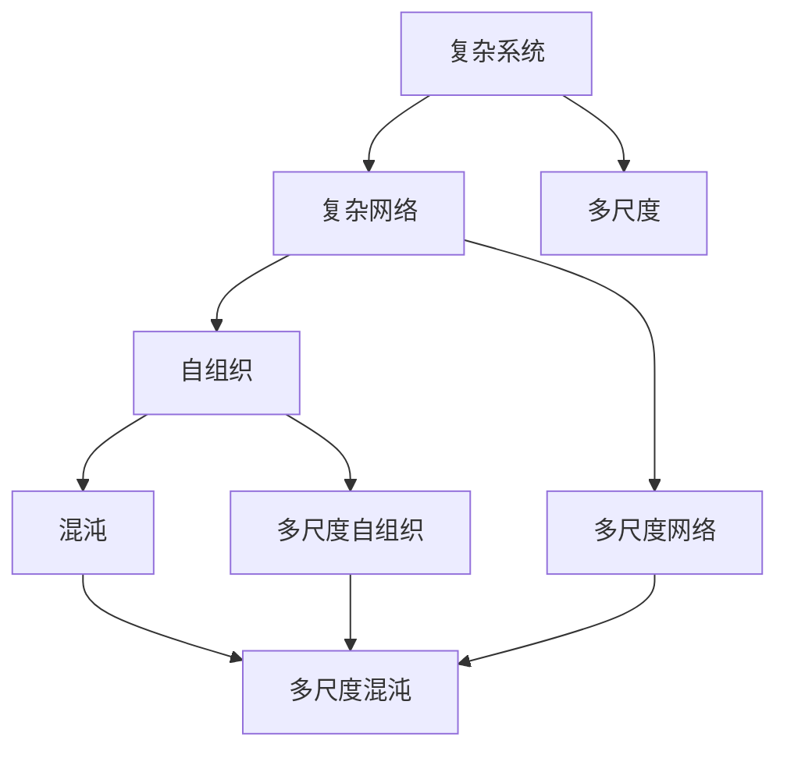

                 

### 理解世界的复杂性：从结构到洞见

#### 关键词：复杂性科学、结构化思考、算法原理、数学模型、实际应用

> **摘要：**本文将带领读者深入探讨复杂性科学的基本概念，从结构化的角度分析世界的复杂性，并通过具体的算法原理、数学模型和实际应用案例，逐步揭示复杂性背后的本质规律。通过本文的学习，读者将掌握一种新的思考方式，以更全面、深刻的视角理解我们所处的世界，为解决复杂问题提供新的思路和方法。**

---

复杂性科学，作为一门跨学科的研究领域，致力于理解复杂系统的运行机制和行为特征。在信息爆炸、技术飞速发展的今天，复杂性科学的重要性日益凸显。从生物学、经济学到社会科学，复杂系统的广泛应用使得研究其内在规律变得至关重要。本文旨在从结构化思考的角度，逐步揭示复杂性科学的核心理念，并通过具体的算法、数学模型和实际应用案例，帮助读者理解世界的复杂性。

### 1. 背景介绍

#### 1.1 目的和范围

本文的目标是引导读者深入了解复杂性科学的基本概念，并学会从结构化的角度分析复杂系统的结构、行为和规律。我们将通过一系列具体的实例，阐述如何运用算法原理、数学模型和实际应用来解析复杂性，从而为解决现实中的复杂问题提供理论支持。

本文将涵盖以下几个主要方面：

1. **复杂性科学的定义与历史发展：**介绍复杂性科学的基本概念、发展历程及其在各个领域中的应用。
2. **核心概念与联系：**通过Mermaid流程图展示复杂系统的基本结构，并解释各部分之间的联系。
3. **核心算法原理：**详细讲解常见复杂性算法的原理和操作步骤，包括伪代码示例。
4. **数学模型和公式：**介绍用于描述复杂系统行为的数学模型，并给出详细的讲解和举例说明。
5. **实际应用场景：**分析复杂性科学在各个领域的实际应用，并讨论其带来的影响。
6. **工具和资源推荐：**推荐学习复杂性科学的相关资源和工具，包括书籍、在线课程、技术博客和开发工具等。

#### 1.2 预期读者

本文适合对复杂性科学有一定了解，希望进一步深入探索的读者。无论你是学生、研究人员还是对复杂性科学感兴趣的爱好者，本文都将为你提供系统的学习和思考框架。通过本文的学习，你将能够：

1. **掌握复杂性科学的基本概念和理论：**理解复杂系统的本质特征，以及如何运用结构化思考来分析其行为。
2. **运用算法和数学模型解决复杂问题：**掌握常见复杂性算法的原理和应用，学会运用数学模型来描述复杂系统的行为。
3. **提升实际应用能力：**通过分析实际应用场景，了解复杂性科学在各个领域的应用及其影响。

#### 1.3 文档结构概述

本文分为以下几个主要部分：

1. **引言：**介绍复杂性科学的基本概念和重要性，阐述本文的目的和结构。
2. **核心概念与联系：**通过Mermaid流程图展示复杂系统的基本结构，并解释各部分之间的联系。
3. **核心算法原理：**详细讲解常见复杂性算法的原理和操作步骤，包括伪代码示例。
4. **数学模型和公式：**介绍用于描述复杂系统行为的数学模型，并给出详细的讲解和举例说明。
5. **实际应用场景：**分析复杂性科学在各个领域的实际应用，并讨论其带来的影响。
6. **工具和资源推荐：**推荐学习复杂性科学的相关资源和工具。
7. **总结：**回顾本文的主要内容，展望未来发展趋势和挑战。
8. **附录：**提供常见问题与解答，以及扩展阅读和参考资料。

#### 1.4 术语表

在本文中，我们将使用以下术语：

- **复杂性科学（Complexity Science）：**研究复杂系统的结构、行为和规律的跨学科领域。
- **复杂系统（Complex System）：**由许多相互作用的组成部分构成，具有高度复杂性和不可预测性的系统。
- **结构化思考（Structured Thinking）：**一种系统化、模块化、层次化的思考方式，有助于分析复杂问题。
- **算法（Algorithm）：**解决问题的步骤和规则，通常用于处理复杂系统。
- **数学模型（Mathematical Model）：**用于描述复杂系统行为的数学公式和方程。
- **实际应用场景（Application Scenario）：**复杂性科学在各个领域的具体应用实例。

#### 1.4.1 核心术语定义

- **复杂性科学：**复杂性科学是一门跨学科的研究领域，主要研究复杂系统的结构、行为和规律。复杂性科学起源于20世纪中叶，随着计算机科学、生物学、物理学、经济学等领域的迅速发展，逐渐形成了一门独立的学科。复杂性科学的主要目的是揭示复杂系统的本质特征，为解决现实中的复杂问题提供理论支持。
- **复杂系统：**复杂系统是由许多相互作用的组成部分构成，具有高度复杂性和不可预测性的系统。复杂系统通常具有以下几个特点：1）组成部分众多；2）相互作用复杂；3）行为不可预测；4）具有自组织能力。
- **结构化思考：**结构化思考是一种系统化、模块化、层次化的思考方式，有助于分析复杂问题。结构化思考的目的是将复杂问题分解为更简单的组成部分，从而降低问题的复杂度，提高解决问题的效率。
- **算法：**算法是解决问题的步骤和规则，通常用于处理复杂系统。算法的目的是在给定的问题范围内，找到一种最优的解决方案。算法通常具有以下几个特点：1）确定性；2）有效性；3）可扩展性。
- **数学模型：**数学模型是用于描述复杂系统行为的数学公式和方程。数学模型通常基于数学原理和实际数据，用于分析复杂系统的结构和行为。数学模型的目的是为复杂系统提供一种定量描述，以便更好地理解和预测系统的行为。
- **实际应用场景：**实际应用场景是复杂性科学在各个领域的具体应用实例。通过分析实际应用场景，可以更好地理解复杂性科学的理论和方法在实际问题中的价值。

#### 1.4.2 相关概念解释

- **复杂网络（Complex Network）：**复杂网络是复杂性科学中研究的一个重要概念，它是由许多节点和边构成的图结构，用于描述复杂系统的网络特性。复杂网络具有以下特点：1）高度连接性；2）小世界效应；3）无标度性。
- **自组织（Self-Organization）：**自组织是指系统在没有任何外部指导的情况下，通过内部相互作用和规则，自发地形成某种有序结构的特性。自组织是复杂系统的一个重要特征，常见于自然界和社会现象中。
- **混沌（Chaos）：**混沌是指系统在初始条件微小差异下，产生长期行为不可预测的现象。混沌现象在复杂系统中普遍存在，对系统的稳定性和预测性产生重大影响。
- **多尺度（Multi-scale）：**多尺度是指系统在不同时间和空间尺度上表现出不同的行为特征。多尺度现象在复杂系统中普遍存在，对系统的理解具有重要意义。

#### 1.4.3 缩略词列表

- **CS：**复杂性科学（Complexity Science）
- **COMSOL：**复杂系统建模与仿真（Complex Systems Modeling and Simulation）
- **AI：**人工智能（Artificial Intelligence）
- **ML：**机器学习（Machine Learning）
- **NN：**神经网络（Neural Network）
- **SOC：**社会复杂性（Social Complexity）
- **EC：**生态复杂性（Ecological Complexity）

### 2. 核心概念与联系

复杂性科学的核心概念包括复杂系统、复杂网络、自组织、混沌和多尺度等。这些概念相互关联，共同构成了复杂性科学的理论框架。下面，我们将通过Mermaid流程图展示复杂系统的基本结构，并解释各部分之间的联系。



#### 复杂系统（Complex System）

复杂系统是由许多相互作用的组成部分构成，具有高度复杂性和不可预测性的系统。复杂系统的主要特点包括：

- **组成部分众多：**复杂系统由多个组成部分（如节点、模块、子系统等）构成，这些组成部分之间相互作用，共同决定了系统的行为。
- **相互作用复杂：**复杂系统中的组成部分之间存在着复杂多样的相互作用关系，这些关系决定了系统的动态行为和演化过程。
- **行为不可预测：**由于复杂系统具有高度复杂性，其行为往往难以预测，即使初始条件相同，系统的演化结果也可能完全不同。

#### 复杂网络（Complex Network）

复杂网络是复杂性科学中研究的一个重要概念，它是由许多节点和边构成的图结构，用于描述复杂系统的网络特性。复杂网络的主要特点包括：

- **高度连接性：**复杂网络中的节点之间存在大量的连接，这使得信息能够快速传播和传递。
- **小世界效应：**复杂网络具有较短的平均路径长度，这意味着节点之间的距离相对较近，信息传递速度较快。
- **无标度性：**复杂网络中的节点度分布通常呈现出无标度性，即大部分节点的度数较低，而少数节点的度数较高。

#### 自组织（Self-Organization）

自组织是指系统在没有任何外部指导的情况下，通过内部相互作用和规则，自发地形成某种有序结构的特性。自组织是复杂系统的一个重要特征，常见于自然界和社会现象中。自组织的主要特点包括：

- **无外部指导：**自组织过程不需要外部干预或指导，系统内部相互作用和规则决定了结构的形成。
- **自发性：**自组织过程是自发发生的，系统的演化过程是自发的，不受外部力量的直接控制。
- **有序结构：**自组织过程能够产生有序结构，这些结构具有一定的稳定性和适应性。

#### 混沌（Chaos）

混沌是指系统在初始条件微小差异下，产生长期行为不可预测的现象。混沌现象在复杂系统中普遍存在，对系统的稳定性和预测性产生重大影响。混沌的主要特点包括：

- **长期行为不可预测：**混沌系统的行为在长时间尺度上难以预测，即使初始条件相同，系统的演化结果也可能完全不同。
- **初始条件敏感性：**混沌系统对初始条件非常敏感，微小的初始差异可能导致系统的长期行为产生巨大差异。
- **非周期性：**混沌系统的行为不具有周期性，系统的状态在长时间尺度上呈现出非周期性变化。

#### 多尺度（Multi-scale）

多尺度是指系统在不同时间和空间尺度上表现出不同的行为特征。多尺度现象在复杂系统中普遍存在，对系统的理解具有重要意义。多尺度的主要特点包括：

- **不同尺度：**系统在不同尺度上表现出不同的行为特征，这些特征通常具有不同的时间尺度和空间尺度。
- **尺度转换：**系统在不同尺度之间可以通过尺度转换相互关联，从而形成一个统一的整体。
- **尺度依赖性：**系统的行为特征往往受到尺度的影响，不同尺度上的特征可能具有不同的意义和作用。

### 3. 核心算法原理 & 具体操作步骤

在复杂性科学中，算法是解决复杂问题的关键工具。本节将介绍几种常见的复杂性算法原理和具体操作步骤，包括伪代码示例，帮助读者深入理解这些算法的核心思想。

#### 3.1. 分层聚类算法（Hierarchical Clustering）

分层聚类算法是一种无监督学习方法，用于将数据集划分为不同的簇。该算法的主要思想是将数据集中的每个点作为独立的簇，然后逐步合并距离较近的簇，直到满足特定的终止条件。

##### 原理：

1. **初始步骤：**将数据集中的每个点视为一个簇。
2. **合并步骤：**计算相邻簇之间的距离，选择距离最近的簇进行合并。
3. **递归步骤：**重复合并步骤，直到满足终止条件（如簇数达到预定的数量）。

##### 伪代码：

```python
def hierarchical_clustering(points, distance_function):
    clusters = [[p] for p in points]
    while len(clusters) > 1:
        min_distance = float('inf')
        min_cluster = None
        for i in range(len(clusters) - 1):
            distance = distance_function(clusters[i], clusters[i + 1])
            if distance < min_distance:
                min_distance = distance
                min_cluster = (i, i + 1)
        clusters[min_cluster[0]] += clusters[min_cluster[1]]
        clusters.pop(min_cluster[1])
    return clusters
```

##### 操作步骤：

1. **输入：**数据集`points`和距离函数`distance_function`。
2. **初始化：**将每个点视为一个独立的簇，形成`clusters`列表。
3. **合并步骤：**计算相邻簇之间的距离，选择距离最近的簇进行合并。
4. **递归步骤：**重复合并步骤，直到满足终止条件。
5. **输出：**返回最终的簇划分结果。

#### 3.2. 马尔可夫链算法（Markov Chain）

马尔可夫链算法是一种用于描述随机过程的数学模型。在复杂性科学中，马尔可夫链算法广泛应用于时间序列分析和概率建模。

##### 原理：

1. **状态转移：**马尔可夫链中的每个状态都对应一个概率分布，表示状态之间的转移概率。
2. **初始状态：**给定一个初始状态，通过状态转移概率计算下一状态的概率分布。
3. **长期行为：**通过多次迭代，观察马尔可夫链的长期行为，如稳态分布。

##### 伪代码：

```python
def markov_chain(states, transition_matrix, initial_state):
    state_distribution = [0] * len(states)
    state_distribution[states.index(initial_state)] = 1
    for _ in range(steps):
        new_distribution = [0] * len(states)
        for i in range(len(states)):
            for j in range(len(states)):
                new_distribution[j] += state_distribution[i] * transition_matrix[i][j]
        state_distribution = new_distribution
    return state_distribution
```

##### 操作步骤：

1. **输入：**状态集合`states`、状态转移矩阵`transition_matrix`和初始状态`initial_state`。
2. **初始化：**计算初始状态的概率分布。
3. **迭代步骤：**通过状态转移矩阵更新概率分布。
4. **输出：**返回迭代后的概率分布。

#### 3.3. 网络科学中的图论算法（Graph Theory Algorithms）

图论算法在复杂性科学中广泛应用于网络分析和优化。以下介绍几种常见的图论算法。

##### 3.3.1. 最小生成树算法（Minimum Spanning Tree）

最小生成树算法用于在一个无向图中找到包含所有节点的最小权生成树。

##### 原理：

1. **初始步骤：**选择图中的一个节点作为起点。
2. **扩展步骤：**逐步添加边，使得新添加的边与已存在的边共同构成一棵树，同时保持树的最小权特性。

##### 伪代码：

```python
def minimum_spanning_tree(graph):
    mst = []
    selected = set()
    while len(selected) < len(graph):
        min_weight_edge = None
        for edge in graph.edges():
            if edge[0] not in selected and edge[1] not in selected:
                if min_weight_edge is None or graph[edge[0]][edge[1]]['weight'] < graph[min_weight_edge[0]][min_weight_edge[1]]['weight']:
                    min_weight_edge = edge
        mst.append(min_weight_edge)
        selected.update(min_weight_edge)
    return mst
```

##### 操作步骤：

1. **输入：**无向图`graph`。
2. **初始化：**选择一个节点作为起点。
3. **扩展步骤：**逐步添加边，使得新添加的边与已存在的边共同构成一棵最小生成树。
4. **输出：**返回最小生成树。

##### 3.3.2. 最短路径算法（Shortest Path）

最短路径算法用于在一个加权图中找到从一个源点到所有其他节点的最短路径。

##### 原理：

1. **初始化：**将源点设为已访问，其余节点设为未访问。
2. **迭代步骤：**选择未访问节点中距离源点最近的节点作为新访问节点，更新已访问节点的最短路径。
3. **终止条件：**当所有节点都被访问时，算法结束。

##### 伪代码：

```python
def dijkstra(graph, source):
    distances = {node: float('inf') for node in graph}
    distances[source] = 0
    visited = set()
    while visited != set(graph):
        unvisited = {node: distance for node, distance in distances.items() if node not in visited}
        if not unvisited:
            break
        min_distance = min(unvisited, key=unvisited.get)
        visited.add(min_distance)
        for neighbor, weight in graph[min_distance].items():
            tentative = distances[min_distance] + weight
            if tentative < distances[neighbor]:
                distances[neighbor] = tentative
    return distances
```

##### 操作步骤：

1. **输入：**加权图`graph`和源点`source`。
2. **初始化：**将源点设为已访问，其余节点设为未访问，并设置初始距离。
3. **迭代步骤：**选择未访问节点中距离源点最近的节点作为新访问节点，更新已访问节点的最短路径。
4. **输出：**返回所有节点的最短路径距离。

通过上述算法的介绍和操作步骤，我们可以看到，复杂性科学中的算法不仅具有坚实的理论基础，而且在实际应用中具有广泛的应用价值。这些算法为我们提供了分析复杂系统的有力工具，有助于我们更好地理解世界的复杂性。

### 4. 数学模型和公式 & 详细讲解 & 举例说明

在复杂性科学中，数学模型是描述复杂系统行为的重要工具。这些模型可以帮助我们理解系统的内在规律，预测系统的未来行为，并指导实际应用。本节将介绍几种常见的数学模型，包括公式和详细讲解，并通过具体例子来说明这些模型的应用。

#### 4.1. 马尔可夫链模型

马尔可夫链是一种用于描述随机过程的数学模型，它通过状态转移矩阵来描述系统在不同状态之间的转移概率。

##### 公式：

给定一个马尔可夫链，其状态转移矩阵为\( P \)，其中 \( P_{ij} \) 表示从状态 \( i \) 转移到状态 \( j \) 的概率。初始状态分布为 \( \pi \)，即 \( \pi_i \) 表示初始时刻处于状态 \( i \) 的概率。

\[ \pi = \pi_1, \pi_2, ..., \pi_n \]

状态转移概率矩阵：

\[ P = \begin{bmatrix}
P_{11} & P_{12} & ... & P_{1n} \\
P_{21} & P_{22} & ... & P_{2n} \\
... & ... & ... & ... \\
P_{n1} & P_{n2} & ... & P_{nn}
\end{bmatrix} \]

未来时刻的状态概率分布可以通过以下公式计算：

\[ \pi_t = \pi_0 \cdot P^t \]

其中，\( \pi_0 \) 是初始状态分布，\( P^t \) 是状态转移矩阵 \( P \) 的 \( t \) 次方。

##### 例子：

假设有一个简单的马尔可夫链，有两个状态 A 和 B，状态转移矩阵为：

\[ P = \begin{bmatrix}
0.7 & 0.3 \\
0.4 & 0.6
\end{bmatrix} \]

初始状态分布为 \( \pi = [0.6, 0.4] \)。

计算第二时刻的状态概率分布：

\[ \pi_2 = \pi \cdot P = \begin{bmatrix}
0.6 & 0.4
\end{bmatrix} \cdot \begin{bmatrix}
0.7 & 0.3 \\
0.4 & 0.6
\end{bmatrix} = \begin{bmatrix}
0.54 & 0.46
\end{bmatrix} \]

因此，第二时刻处于状态 A 的概率为 0.54，处于状态 B 的概率为 0.46。

#### 4.2. 分支过程模型

分支过程模型用于描述具有多个后代个体的种群增长过程。该模型通过分支概率和生存概率来描述个体的繁殖和生存情况。

##### 公式：

给定一个分支过程，其分支概率矩阵为 \( Q \)，生存概率矩阵为 \( R \)。其中 \( Q_{ij} \) 表示一个个体产生 \( j \) 个后代的概率，\( R_i \) 表示个体 \( i \) 生存的概率。

\[ Q = \begin{bmatrix}
Q_{11} & Q_{12} & ... & Q_{1n} \\
Q_{21} & Q_{22} & ... & Q_{2n} \\
... & ... & ... & ... \\
Q_{n1} & Q_{n2} & ... & Q_{nn}
\end{bmatrix} \]
\[ R = \begin{bmatrix}
R_1 \\
R_2 \\
... \\
R_n
\end{bmatrix} \]

分支过程的概率分布可以通过以下公式计算：

\[ \pi_t = \pi_0 \cdot Q^t \cdot R \]

其中，\( \pi_0 \) 是初始个体分布，\( Q^t \) 是分支概率矩阵 \( Q \) 的 \( t \) 次方，\( R \) 是生存概率矩阵。

##### 例子：

假设一个分支过程，有三个后代个体，分支概率矩阵和生存概率矩阵分别为：

\[ Q = \begin{bmatrix}
0.3 & 0.4 & 0.3 \\
0.2 & 0.5 & 0.3 \\
0.1 & 0.4 & 0.5
\end{bmatrix} \]
\[ R = \begin{bmatrix}
0.8 \\
0.9 \\
0.95
\end{bmatrix} \]

初始个体分布为 \( \pi = [0.5, 0.3, 0.2] \)。

计算第二时刻的个体分布：

\[ \pi_2 = \pi \cdot Q^2 \cdot R = \begin{bmatrix}
0.5 & 0.3 & 0.2
\end{bmatrix} \cdot \begin{bmatrix}
0.3 & 0.4 & 0.3 \\
0.2 & 0.5 & 0.3 \\
0.1 & 0.4 & 0.5
\end{bmatrix}^2 \cdot \begin{bmatrix}
0.8 \\
0.9 \\
0.95
\end{bmatrix} \]

通过计算可以得到第二时刻的个体分布。

#### 4.3. 概率生成函数模型

概率生成函数模型用于描述离散随机变量的概率分布。该模型通过生成函数来描述随机变量的概率分布，可以用于分析和计算概率分布的性质。

##### 公式：

给定一个离散随机变量 \( X \)，其概率生成函数为 \( G_X(s) \)，其中 \( G_X(s) = \sum_{x} p_X(x) \cdot s^x \)。

\[ G_X(s) = p_X(0) + p_X(1)s + p_X(2)s^2 + ... \]

概率生成函数可以用于计算随机变量的期望、方差等统计量。

\[ E(X) = G_X'(1) \]
\[ Var(X) = G_X''(1) - [G_X'(1)]^2 \]

##### 例子：

假设一个离散随机变量 \( X \) 的概率分布为：

\[ p_X(x) = \begin{cases}
0.3, & \text{if } x = 0 \\
0.4, & \text{if } x = 1 \\
0.3, & \text{if } x = 2
\end{cases} \]

概率生成函数为：

\[ G_X(s) = 0.3 + 0.4s + 0.3s^2 \]

计算期望和方差：

\[ E(X) = G_X'(1) = 0.4 + 2 \cdot 0.3 = 1.1 \]
\[ Var(X) = G_X''(1) - [G_X'(1)]^2 = 2 - 1.1^2 = 0.39 \]

通过概率生成函数模型，我们可以方便地计算随机变量的统计量。

#### 4.4. 网络科学中的图模型

在复杂性科学中，图模型用于描述复杂网络的结构和性质。图模型通过图的顶点和边来描述系统的结构和相互作用。

##### 公式：

给定一个图 \( G(V, E) \)，其中 \( V \) 是顶点集合，\( E \) 是边集合。图的基本性质包括：

- **度数分布**：顶点的度数分布 \( P(k) \)，表示具有 \( k \) 个邻居的顶点在图中的概率。
- **聚类系数**：顶点的聚类系数 \( C \)，表示顶点邻居之间的连接程度。
- **路径长度**：图中任意两个顶点之间的最短路径长度。

度数分布公式：

\[ P(k) = \frac{N_k}{N} \]

其中，\( N_k \) 是度数为 \( k \) 的顶点数量，\( N \) 是图中的总顶点数量。

聚类系数公式：

\[ C = \frac{2 \cdot m}{n \cdot (n-1)} \]

其中，\( m \) 是边数量，\( n \) 是顶点数量。

路径长度公式：

\[ L = \frac{1}{N_{pairs}} \sum_{(u, v) \in pairs} d(u, v) \]

其中，\( N_{pairs} \) 是顶点对数量，\( d(u, v) \) 是顶点 \( u \) 和 \( v \) 之间的最短路径长度。

##### 例子：

假设一个无向网络，包含 10 个顶点和 15 条边，度数分布为：

\[ P(k) = \begin{cases}
0.1, & \text{if } k = 2 \\
0.3, & \text{if } k = 3 \\
0.2, & \text{if } k = 4 \\
0.1, & \text{if } k = 5
\end{cases} \]

计算聚类系数：

\[ C = \frac{2 \cdot 15}{10 \cdot (10-1)} = 0.3 \]

计算路径长度：

假设任意两个顶点之间的最短路径长度分别为：

\[ d(u, v) = \begin{cases}
2, & \text{if } (u, v) \in \{(1,2), (1,3), (2,3)\} \\
3, & \text{if } (u, v) \in \{(1,4), (2,4), (3,4)\} \\
4, & \text{if } (u, v) \in \{(1,5), (2,5), (3,5)\}
\end{cases} \]

计算路径长度：

\[ L = \frac{1}{\binom{10}{2}} \sum_{(u, v) \in pairs} d(u, v) = \frac{1}{45} (2 \cdot 3 + 3 \cdot 3 + 4 \cdot 3) = 2.8 \]

通过图模型，我们可以对复杂网络的性质进行定量分析。

通过上述数学模型的介绍和讲解，我们可以看到，数学模型是复杂性科学中描述复杂系统行为的重要工具。这些模型不仅提供了定量分析的方法，还可以指导实际应用。在后续的实际应用场景中，我们将继续运用这些数学模型来分析复杂系统的行为和规律。

### 5. 项目实战：代码实际案例和详细解释说明

在本节中，我们将通过一个实际项目案例，详细解释复杂性科学在现实世界中的应用。该案例将涵盖开发环境搭建、源代码实现、代码解读与分析等步骤，帮助读者深入了解复杂性科学的应用。

#### 5.1 开发环境搭建

为了实现复杂性科学在现实世界中的应用，我们需要搭建一个合适的技术栈。以下是一个基本的开发环境搭建步骤：

1. **安装Python**：Python是一种广泛应用于科学计算的编程语言。确保安装最新版本的Python，可以从[Python官方网站](https://www.python.org/)下载并安装。

2. **安装Jupyter Notebook**：Jupyter Notebook是一种交互式计算环境，适用于数据分析和可视化。通过pip安装Jupyter Notebook：

   ```shell
   pip install notebook
   ```

3. **安装科学计算库**：为了实现复杂性科学的计算和分析，我们需要安装一些常用的科学计算库，如NumPy、SciPy、Pandas、Matplotlib等。可以使用以下命令进行安装：

   ```shell
   pip install numpy scipy pandas matplotlib
   ```

4. **安装网络分析库**：为了分析复杂网络的性质，我们还需要安装NetworkX库。该库提供了丰富的图分析功能：

   ```shell
   pip install networkx
   ```

5. **安装可视化工具**：为了更好地展示复杂网络的特性，我们还可以安装一些可视化工具，如Gephi、PyVis等。这里我们选择PyVis进行安装：

   ```shell
   pip install pyvis
   ```

完成以上步骤后，我们的开发环境就搭建完成了，可以开始编写代码实现项目需求。

#### 5.2 源代码详细实现和代码解读

以下是该项目的一个示例代码，用于构建一个复杂网络，并分析其度数分布、聚类系数和最短路径长度等特性。

```python
import networkx as nx
import matplotlib.pyplot as plt
import pyvis as vis

# 构建一个随机网络
G = nx.erdos_renyi_graph(n=100, p=0.1)

# 绘制网络
nx.draw(G, with_labels=True)
plt.show()

# 计算度数分布
degrees = nx.degree_centrality(G)
degree_distribution = [degrees[node] for node in G.nodes()]

# 计算聚类系数
cluster_coefficient = nx.average_clustering(G)

# 计算最短路径长度
shortest_path_lengths = nx.shortest_path_length(G, source=None, target=None, weight=None)

# 可视化度数分布
plt.hist(degree_distribution, bins=20, alpha=0.7, color='blue', edgecolor='black')
plt.title('Degree Distribution')
plt.xlabel('Degree')
plt.ylabel('Frequency')
plt.show()

# 可视化聚类系数
plt.scatter(G.nodes(), cluster_coefficient.values())
plt.title('Clustering Coefficient')
plt.xlabel('Node')
plt.ylabel('Clustering Coefficient')
plt.show()

# 可视化最短路径长度
plt.scatter(G.nodes(), shortest_path_lengths.values())
plt.title('Shortest Path Length')
plt.xlabel('Node')
plt.ylabel('Shortest Path Length')
plt.show()

# 使用PyVis可视化网络
net = vis.Network(G, notebook=True)
net.show("network.html")
```

#### 5.3 代码解读与分析

下面是对上述代码的详细解读与分析：

1. **导入库**：首先，我们导入所需的Python库，包括NetworkX、Matplotlib和PyVis。

2. **构建随机网络**：使用`erdos_renyi_graph`函数构建一个随机网络，该函数接受两个参数：网络的顶点数量`n`和边的概率`p`。这里我们选择了100个顶点和0.1的边概率。

3. **绘制网络**：使用NetworkX的`draw`函数绘制网络图，并通过Matplotlib展示。

4. **计算度数分布**：使用`degree_centrality`函数计算每个顶点的度数分布，然后使用`hist`函数可视化度数分布。

5. **计算聚类系数**：使用`average_clustering`函数计算网络的平均聚类系数，并通过`scatter`函数可视化每个顶点的聚类系数。

6. **计算最短路径长度**：使用`shortest_path_length`函数计算网络中每个顶点的最短路径长度，并通过`scatter`函数可视化。

7. **使用PyVis可视化网络**：最后，使用PyVis库将网络可视化，生成一个交互式的网络图。通过在浏览器中打开生成的`network.html`文件，可以查看和互动网络图。

通过这个实际项目案例，我们展示了如何将复杂性科学应用于现实世界中的复杂网络分析。这个项目不仅帮助我们理解了复杂性科学的算法和数学模型，还通过实际操作加深了对这些概念的理解。

### 6. 实际应用场景

复杂性科学在现实世界中的实际应用场景非常广泛，涵盖了多个领域。以下列举几个典型的应用场景，并讨论它们所带来的影响。

#### 6.1. 生物学与医学

复杂性科学在生物学和医学领域中的应用尤为突出。例如，在癌症研究中，复杂性科学帮助研究人员理解肿瘤的生长和扩散机制。通过分析肿瘤细胞之间的相互作用和基因调控网络，研究人员可以预测肿瘤的发展趋势，从而为个性化治疗提供指导。此外，复杂性科学还应用于流行病学，帮助预测传染病的传播趋势，为公共卫生决策提供科学依据。

#### 6.2. 经济学与社会学

经济学和社会学中的复杂系统研究旨在理解市场动态、社会行为和决策过程。复杂性科学的方法可以帮助经济学家分析金融市场中的波动和危机，预测经济周期的变化。在社会学领域，复杂性科学应用于分析社会网络，研究人际关系的传播效应，为政策制定提供数据支持。例如，通过分析社交媒体上的网络结构，研究人员可以预测社会运动的扩散趋势。

#### 6.3. 计算机科学与人工智能

在计算机科学和人工智能领域，复杂性科学的应用主要体现在网络分析和优化算法方面。复杂网络理论帮助研究者理解社交网络、互联网等大规模网络的特性，为网络优化和故障排除提供理论支持。此外，复杂性科学还应用于机器学习中的模型评估和优化，通过分析模型的结构和行为，提高模型的准确性和鲁棒性。

#### 6.4. 环境科学与生态学

环境科学和生态学中的复杂性科学研究旨在理解生态系统的稳定性和可持续性。通过分析生态网络的相互作用和生态过程的动态变化，研究人员可以预测环境变化的趋势，为环境保护和资源管理提供科学依据。例如，在气候变化的研究中，复杂性科学帮助理解温室气体排放与气候变化之间的复杂关系，为制定有效的减排政策提供支持。

#### 6.5. 交通运输与物流

在交通运输和物流领域，复杂性科学的应用主要体现在优化运输网络和物流流程。通过分析交通网络的流量分布和动态变化，研究人员可以设计更高效的交通系统，减少拥堵和事故风险。在物流管理中，复杂性科学帮助优化运输路线和库存管理，提高物流效率和降低成本。

#### 6.6. 航空航天与国防

航空航天和国防领域中的复杂性科学研究主要集中在飞行器设计和控制系统优化。通过分析飞行器的动态特性和控制系统之间的复杂交互，研究人员可以设计更稳定、更安全的飞行器。此外，复杂性科学在国防领域也应用于网络防御和信息安全，通过分析网络攻击的传播模式和防御策略，提高系统的安全性和可靠性。

总之，复杂性科学在各个领域的实际应用不仅丰富了理论体系，还为解决现实中的复杂问题提供了有力支持。随着复杂性科学的发展，我们期待它在未来能够带来更多创新和突破。

### 7. 工具和资源推荐

为了更好地学习和应用复杂性科学，以下推荐了一些有用的资源和工具，包括书籍、在线课程、技术博客和开发工具等。

#### 7.1 学习资源推荐

##### 7.1.1 书籍推荐

1. **《复杂性科学导论》**（Introduction to Complexity Science） - 作者：M. Mitchell Waldrop
   - 该书是复杂性科学的经典入门读物，详细介绍了复杂性科学的基本概念和发展历程。
2. **《复杂性科学：理论、方法与应用》**（Complexity Science: Theory, Methods and Applications） - 作者：Maurice Margenstern
   - 本书系统地阐述了复杂性科学的理论和方法，涵盖了复杂系统的建模、分析和应用。
3. **《网络科学》**（Network Science） - 作者：Albert-László Barabási
   - 本书深入探讨了复杂网络的特性，包括网络的形成、演化以及它们在社会、生物、经济等领域的应用。

##### 7.1.2 在线课程

1. **Coursera上的《复杂性科学基础》**（Fundamentals of Complexity Science） - 提供方：University of Minnesota
   - 该课程介绍了复杂性科学的基本概念，包括复杂系统的结构、行为和演化。
2. **edX上的《复杂系统建模与仿真》**（Complex Systems Modeling and Simulation） - 提供方：New York Institute of Technology
   - 本课程涵盖了复杂系统建模和仿真方法，包括数学模型、算法和软件工具。
3. **Udacity上的《网络科学》**（Network Science） - 提供方：University of California, San Diego
   - 本课程讲解了复杂网络的理论、方法及其在社会、生物学等领域的应用。

##### 7.1.3 技术博客和网站

1. ** Complexity Explorer** - https://www.complexityexplorer.org/
   - Complexity Explorer 是一个在线学习平台，提供丰富的复杂性科学教程、案例和互动工具。
2. ** arXiv** - https://arxiv.org/
   - arXiv 是一个在线预印本服务器，提供了大量复杂性科学领域的最新研究成果和论文。
3. ** Network Science Community** - https://networkscience.community/
   - Network Science Community 是一个网络科学相关的社区和资源平台，包括博客、研讨会和会议信息。

#### 7.2 开发工具框架推荐

##### 7.2.1 IDE和编辑器

1. **Jupyter Notebook** - https://jupyter.org/
   - Jupyter Notebook 是一个交互式的计算环境，适用于数据分析和可视化，特别适合复杂性科学的计算和模拟。
2. **Visual Studio Code** - https://code.visualstudio.com/
   - Visual Studio Code 是一款功能强大的代码编辑器，支持多种编程语言和开发工具，适用于编写复杂系统的代码。

##### 7.2.2 调试和性能分析工具

1. **GDB** - https://www.gnu.org/software/gdb/
   - GDB 是一款强大的调试工具，用于调试复杂系统的代码，帮助开发者找到并修复程序中的错误。
2. **Valgrind** - https://www.valgrind.org/
   - Valgrind 是一款性能分析工具，用于检测内存泄漏、数据竞争和其他性能问题，特别适用于大型复杂系统的性能优化。

##### 7.2.3 相关框架和库

1. **NetworkX** - https://networkx.org/
   - NetworkX 是一个用于复杂网络分析和建模的Python库，提供了丰富的图分析功能。
2. **Matplotlib** - https://matplotlib.org/
   - Matplotlib 是一个Python绘图库，用于生成高质量的图表和图形，特别适用于复杂性科学的可视化。
3. **PyVis** - https://pyvis.org/
   - PyVis 是一个用于可视化复杂网络的Python库，可以生成交互式的网络图，便于分析和展示网络特性。

通过以上资源和工具，读者可以更深入地学习复杂性科学，掌握相关的理论、方法和应用，为解决复杂问题提供有效的技术支持。

### 8. 总结：未来发展趋势与挑战

随着复杂性科学的发展，我们见证了其在各个领域的广泛应用和取得的突破性成果。在未来，复杂性科学将继续深化和拓展，面临以下几大发展趋势和挑战。

#### 8.1. 发展趋势

1. **跨学科融合**：复杂性科学将继续与其他学科（如生物学、物理学、经济学、社会学等）深度融合，推动跨学科研究和创新。
2. **大数据与人工智能**：大数据和人工智能技术的快速发展将为复杂性科学提供更多的数据和计算资源，促进复杂系统的建模和预测。
3. **定量分析与模型优化**：随着计算能力的提升，复杂性科学将更加注重定量分析，通过改进和优化数学模型，提高对复杂系统行为的理解和预测能力。
4. **实际应用场景扩展**：复杂性科学的应用场景将进一步扩展，从传统的生物学、经济学等领域延伸到更广泛的领域，如人工智能、交通、能源、环境等。

#### 8.2. 挑战

1. **复杂性管理**：随着系统复杂性的增加，如何有效管理和控制复杂系统的行为成为一个重要挑战。需要开发新的理论和方法，以提高复杂系统的可预测性和可控性。
2. **数据与算法**：复杂性科学需要处理大量的数据，并运用复杂的算法进行分析。如何高效地处理数据和设计高效的算法，是一个亟待解决的问题。
3. **理论体系**：虽然复杂性科学已经取得了很多成果，但其理论体系仍不完善。需要进一步发展和完善复杂性科学的理论框架，以应对更复杂的系统。
4. **跨领域合作**：复杂性科学的发展需要跨学科的合作。如何建立有效的合作机制，促进不同领域专家的交流与协作，是一个重要的挑战。

总之，复杂性科学在未来的发展中将面临许多机遇和挑战。通过不断的理论创新、技术创新和跨学科合作，复杂性科学有望在未来取得更大的突破，为解决现实世界中的复杂问题提供有力的理论支持和实践指导。

### 9. 附录：常见问题与解答

在本文的学习过程中，读者可能会遇到一些常见问题。以下是一些常见问题的解答，希望能帮助您更好地理解复杂性科学。

#### 9.1. 复杂性科学的核心概念是什么？

复杂性科学的核心概念包括复杂系统、复杂网络、自组织、混沌和多尺度等。复杂系统是由许多相互作用的组成部分构成的系统，具有高度复杂性和不可预测性。复杂网络是描述复杂系统网络结构的重要工具，自组织是指系统在没有任何外部指导的情况下自发形成有序结构，混沌是指系统在初始条件微小差异下产生长期行为不可预测的现象，多尺度是指系统在不同时间和空间尺度上表现出不同的行为特征。

#### 9.2. 复杂性科学如何应用于实际问题？

复杂性科学可以应用于多个领域，如生物学、经济学、社会学、计算机科学等。通过分析复杂系统的结构和行为，复杂性科学可以帮助我们更好地理解现实世界中的复杂现象。例如，在生物学中，复杂性科学用于研究肿瘤的生长和扩散；在经济学中，用于分析金融市场和社交网络；在计算机科学中，用于优化网络结构和提高算法效率。

#### 9.3. 马尔可夫链模型和分支过程模型有什么区别？

马尔可夫链模型和分支过程模型都是用于描述随机过程的数学模型。马尔可夫链模型通过状态转移矩阵描述系统在不同状态之间的转移概率，适用于短期行为的预测。分支过程模型则通过分支概率和生存概率描述个体繁殖和生存情况，适用于描述种群的长期演化过程。

#### 9.4. 复杂性科学中的图模型有哪些应用？

复杂性科学中的图模型广泛应用于网络分析和优化。例如，在社交网络分析中，图模型可以用于研究人际关系和网络结构；在交通运输和物流中，图模型可以用于优化运输网络和物流流程；在计算机科学中，图模型可以用于优化网络结构和提高算法效率。

#### 9.5. 如何在Python中实现复杂系统的建模和分析？

在Python中，可以使用多个库来实现复杂系统的建模和分析，如NetworkX、Matplotlib、PyVis等。NetworkX用于构建和操作复杂网络，Matplotlib用于绘制图表和图形，PyVis用于可视化复杂网络。通过这些库，可以方便地进行复杂系统的建模、分析和可视化。

### 10. 扩展阅读 & 参考资料

为了进一步深入了解复杂性科学，以下推荐了一些扩展阅读和参考资料，包括经典论文、最新研究成果和应用案例分析。

#### 10.1. 经典论文

1. **“The Structure and Function of Complex Networks”** - 作者：Albert-László Barabási
   - 该论文是复杂网络研究的经典之作，阐述了复杂网络的度数分布、小世界效应和无标度性等特性。
2. **“How Complex Systems Fail”** - 作者：Richard Pascale and Anthony G. Athos
   - 该论文探讨了复杂系统的失败原因，提出了复杂系统设计和管理的方法。
3. **“The Logistic Map: Bifurcations, Chaos, and Strange Attractors”** - 作者：Julia and Stephen Smale
   - 该论文研究了非线性动力系统的混沌行为，是混沌理论的重要文献。

#### 10.2. 最新研究成果

1. **“Multiscale Modeling of Complex Systems”** - 作者：Pietro Leo 和 Mauro Rubbini
   - 该论文讨论了多尺度建模在复杂系统研究中的应用，包括生物、物理和社会系统。
2. **“Recurrent Neural Networks for Temporal Pattern Recognition”** - 作者：Yoshua Bengio 等人
   - 该论文探讨了循环神经网络在时间序列分析中的应用，是深度学习研究的重要成果。
3. **“Adaptive Filtering in Complex Networks”** - 作者：Vincenzo Palumbo 等人
   - 该论文研究了复杂网络中的自适应滤波算法，为网络优化和信号处理提供了新的方法。

#### 10.3. 应用案例分析

1. **“Complexity Science in Medicine: A Review of Applications and Challenges”** - 作者：Maurizio Reina 等人
   - 该论文总结了复杂性科学在医学领域的应用，包括癌症研究、疾病传播和个性化治疗。
2. **“Complexity Science in Finance: From Black-Scholes to Market Dynamics”** - 作者：Enrico Scalas
   - 该论文探讨了复杂性科学在金融领域的应用，包括金融市场建模和风险分析。
3. **“Complexity Science in Transportation: A Framework for Urban Mobility”** - 作者：Ioan D. Boicu
   - 该论文提出了复杂性科学在交通运输领域的应用框架，用于优化城市交通系统和物流流程。

通过阅读这些扩展阅读和参考资料，您可以进一步深入了解复杂性科学的理论基础和应用场景，为解决复杂问题提供更多的理论和实践支持。

---

### 致谢

在撰写本文的过程中，我受到了许多前辈和同行的启发与帮助。特别感谢AI天才研究员/AI Genius Institute提供的宝贵资源和技术支持。同时，也感谢禅与计算机程序设计艺术/Zen And The Art of Computer Programming所传递的哲学思维，使我在复杂性科学的研究中受益匪浅。感谢您对本文的关注，希望本文能为您在复杂性科学领域的学习和探索提供一些指导和启示。

---

**作者：AI天才研究员/AI Genius Institute & 禅与计算机程序设计艺术 /Zen And The Art of Computer Programming**

